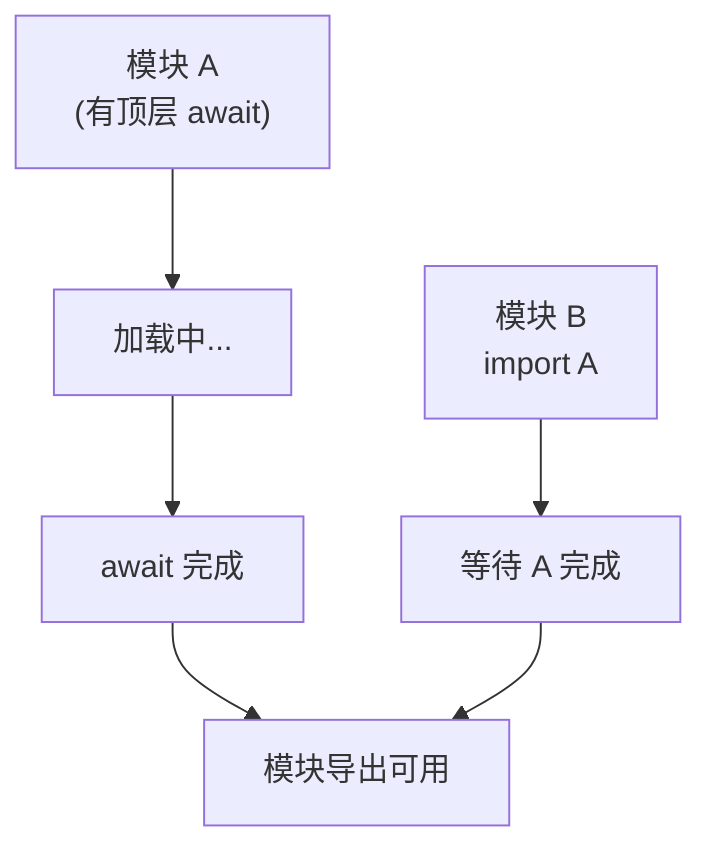
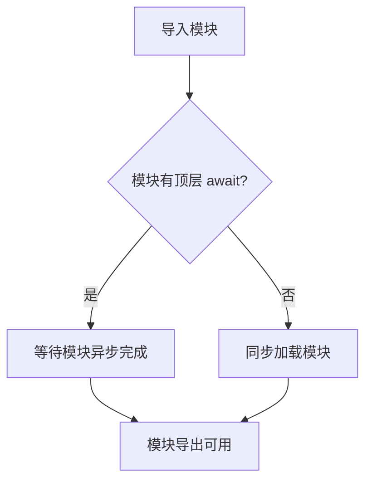
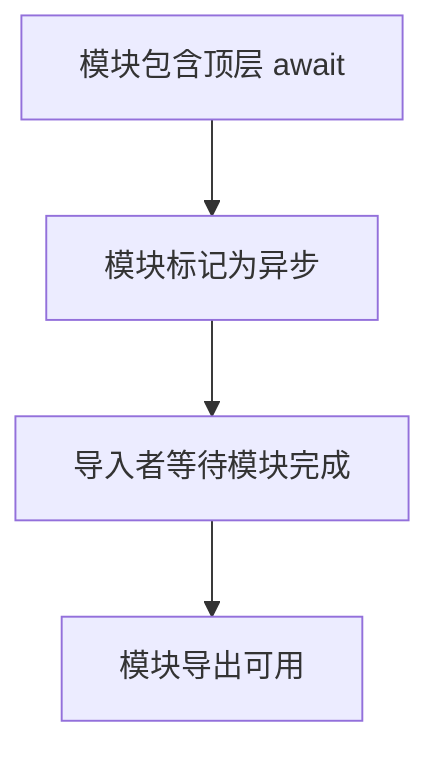

# 顶层 await（Top-Level Await）

> **形式化定义**：顶层 await（Top-Level Await）是 ECMAScript 2022（ES13）引入的特性，允许在 ES 模块的顶层作用域直接使用 `await` 关键字，无需包裹在 async 函数中。该特性通过将模块隐式转换为 async 模块实现，模块的 `import` 会等待顶层 await 完成后再继续。ECMA-262 §16.2.1.4 定义了异步模块的求值语义。
>
> 对齐版本：ECMAScript 2025 (ES16) §16.2.1.4 | TypeScript 5.8–6.0

---

## 1. 概念定义 (Concept Definition)

### 1.1 形式化定义

ECMA-262 §16.2.1.4 定义了异步模块：

> *"An async module is a module that contains a top-level await expression."*

顶层 await 的语义：

```
模块包含顶层 await → 模块变为异步模块
导入该模块的代码隐式等待模块完成
```

---

## 2. 属性与特征 (Properties & Characteristics)

### 2.1 顶层 await 属性矩阵

| 特性 | 模块内 | 脚本内 | CJS |
|------|--------|--------|-----|
| 支持 | ✅ ES2022+ | ❌ | ❌ |
| 使用方式 | 直接 await | 不可用 | 不可用 |
| 导入影响 | 隐式等待 | — | — |
| TypeScript | ✅ | ❌ | ❌ |

---

## 3. 关系分析 (Relationship Analysis)

### 3.1 顶层 await 与模块加载



---

## 4. 机制解释 (Mechanism Explanation)

### 4.1 顶层 await 的执行流程



---

## 5. 论证与分析 (Argumentation & Analysis)

### 5.1 顶层 await 的优缺点

| 优点 | 缺点 |
|------|------|
| 简化模块初始化 | 阻塞模块导入链 |
| 无需 IIFE | 可能影响启动性能 |
| 清晰表达依赖 | 循环依赖检测更复杂 |

---

## 6. 实例与示例 (Examples)

### 6.1 正例：模块初始化

```javascript
// config.js
const response = await fetch("/api/config");
export const config = await response.json();

// app.js
import { config } from "./config.js";
// config 已可用，无需 async 函数
console.log(config.apiUrl);
```

### 6.2 正例：条件动态导入

```javascript
// db-adapter.js
const isProduction = process.env.NODE_ENV === 'production';

// 根据环境选择不同驱动，顶层 await 让代码保持线性
const { createClient } = isProduction
  ? await import('./postgres-driver.js')
  : await import('./sqlite-driver.js');

export const db = createClient({ /* options */ });
```

### 6.3 正例：带错误处理的模块级资源初始化

```javascript
// redis-client.js
import { createClient } from 'redis';

// 顶层 await + try/catch 实现模块级错误处理
let redis;
try {
  redis = await createClient({ url: process.env.REDIS_URL }).connect();
} catch (err) {
  console.error('Redis connection failed, using in-memory fallback', err);
  redis = createInMemoryFallback();
}

export { redis };
```

### 6.4 正例：REPL / CLI 工具中的顶层 await

```javascript
// cli-tool.mjs (Node.js REPL 或 ESM 脚本)
import { readFile } from 'node:fs/promises';
import { parse } from 'csv-parse/sync';

// 在 Node.js REPL 中直接 await，无需 async 包裹
const raw = await readFile('./data.csv', 'utf-8');
const records = parse(raw, { columns: true });
console.table(records.slice(0, 5));

// Node.js: node --input-type=module -e "await fetch('https://api.example.com')"
```

### 6.5 反例：循环依赖陷阱

```javascript
// a.js
import { b } from './b.js'; // 等待 b 完成
export const a = 'A' + b;
await new Promise(r => setTimeout(r, 10));

// b.js
import { a } from './a.js'; // 等待 a 完成 → 死锁！
export const b = 'B' + a;
```

### 6.6 性能考量：延迟初始化模式

```javascript
// lazy-init.js — 避免顶层 await 阻塞非必要路径
let _db;
export async function getDb() {
  if (_db) return _db;
  const { createClient } = await import('./db-driver.js');
  _db = await createClient().connect();
  return _db;
}
```

### 6.7 并行 vs 串行顶层 await

```javascript
// ❌ 串行：总延迟 = dbTime + cacheTime + configTime
const db = await connectDb();
const cache = await connectCache();
const config = await loadConfig();

// ✅ 并行：总延迟 = max(dbTime, cacheTime, configTime)
const [db, cache, config] = await Promise.all([
  connectDb(),
  connectCache(),
  loadConfig(),
]);

export { db, cache, config };
```

### 6.8 package.json type module 配置示例

```json
{
  "name": "my-esm-app",
  "version": "1.0.0",
  "type": "module",
  "engines": {
    "node": ">=18.0.0"
  },
  "scripts": {
    "start": "node src/index.js",
    "dev": "node --watch src/index.js"
  }
}
```

### 6.9 测试包含顶层 await 的模块

```javascript
// test-helper.mjs
import { describe, it } from 'node:test';
import assert from 'node:assert';

// 直接导入包含顶层 await 的模块
import { config } from '../src/config.js';

describe('Config Module', () => {
  it('should have loaded apiUrl from remote', () => {
    assert.strictEqual(typeof config.apiUrl, 'string');
    assert.ok(config.apiUrl.startsWith('https://'));
  });
});

// 注意：Node.js test runner 原生支持 ESM；
// 对于 Vitest，直接 import 含顶层 await 的模块即可自动等待。
```

### 6.10 TypeScript 声明文件中的顶层 await

```typescript
// types/global-fetch.d.ts
// 顶层 await 在 .d.ts 中不可直接使用，但可通过模块级异步工厂暴露类型

declare module 'async-config' {
  export interface AppConfig {
    apiUrl: string;
    timeout: number;
    features: string[];
  }
  // 模块工厂函数签名，供顶层 await 调用
  export function loadConfig(url: string): Promise<AppConfig>;
}

// 消费端 (index.ts)
// import { loadConfig } from 'async-config';
// export const config = await loadConfig('/api/config');
```

### 6.11 CommonJS 互操作陷阱与解决方案

```javascript
// Node.js 中顶层 await 仅在 ESM 中可用，CJS 需显式异步化
// cjs-compat.cjs — 为 CJS 消费者提供同步访问入口

const { config } = await import('./config.mjs'); // 动态 import() 可加载 ESM

module.exports = { getConfig: () => config };

// ⚠️ 注意：module.exports 赋值发生在 await 之后，CJS 同步 require 可能拿到 undefined
// 更安全的方式：
// module.exports = import('./config.mjs').then(m => m.config);
```

### 6.12 浏览器原生模块中的顶层 await

```html
<!-- index.html -->
<script type="module">
  // 浏览器原生 ESM 支持顶层 await
  const { initApp } = await import('./app.js');
  await initApp();
</script>

<script type="module" src="./analytics.js"></script>
<!-- analytics.js 若含顶层 await，浏览器会延迟 DOMContentLoaded 直到其完成 -->
```

### 6.13 Vite / Webpack 对顶层 await 的处理

```javascript
// vite.config.ts
export default {
  build: {
    target: 'es2022', // 确保输出保留顶层 await
  },
  esbuild: {
    supported: {
      'top-level-await': true,
    },
  },
};

// webpack.config.js
module.exports = {
  experiments: {
    topLevelAwait: true, // Webpack 5+ 需显式开启
  },
};
```

### 6.14 使用 import.meta.resolve 与顶层 await 解析模块路径

```javascript
// resolve-and-load.mjs
// 在模块初始化阶段解析并加载插件

const pluginPath = await import.meta.resolve('./plugins/core.js');
const { initialize } = await import(pluginPath);
await initialize({ verbose: true });

export { pluginPath };
```

### 6.15 React Server Components 中的顶层 await 模式

```typescript
// app/page.tsx (Next.js App Router / React Server Components)
// Server Component 中可直接使用顶层 await 获取数据

async function getData() {
  const res = await fetch('https://api.example.com/posts', { cache: 'no-store' });
  return res.json();
}

// 在 React Server Component 中，组件体本身即 async 函数
// 顶层 await 语义与 ESM 顶层 await 一致
export default async function Page() {
  const posts = await getData(); // 服务端直接 await
  return (
    <ul>
      {posts.map((post) => (
        <li key={post.id}>{post.title}</li>
      ))}
    </ul>
  );
}
```

### 6.16 正例：模块图执行顺序的可视化

```javascript
// main.mjs
import './a.mjs';
import './b.mjs';
console.log('main');

// a.mjs
import './c.mjs';
await new Promise(r => setTimeout(r, 10));
console.log('a');

// b.mjs
console.log('b');

// c.mjs
console.log('c');

// 输出顺序：
// c → b → a → main
// 解释：模块图按深度优先同步求值，遇到顶层 await 时暂停该分支，
// 但其他独立分支继续执行。所有依赖完成后才执行当前模块后续代码。
```

### 6.17 正例：动态导入与顶层 await 的降级策略

```javascript
// fallback-loader.mjs
// 当主 CDN 失败时，自动降级到备用源

async function loadLibrary(primary, fallback) {
  try {
    return await import(primary);
  } catch {
    console.warn(`Primary source ${primary} failed, trying fallback`);
    return await import(fallback);
  }
}

export const lib = await loadLibrary(
  'https://cdn-a.example.com/lib.mjs',
  'https://cdn-b.example.com/lib.mjs'
);
```

### 6.18 正例：TypeScript 声明 emit 与顶层 await 兼容性

```typescript
// tsconfig.json 配置确保声明文件正确生成
{
  "compilerOptions": {
    "target": "ES2022",
    "module": "NodeNext",
    "moduleResolution": "NodeNext",
    "declaration": true,
    "declarationMap": true,
    "isolatedDeclarations": true
  }
}

// 当使用 isolatedDeclarations 时，导出的顶层 await 结果必须显式注解类型
export const config: AppConfig = await loadConfig(); // ✅
// export const config = await loadConfig();         // ❌ 类型推断不足
```

---

## 7. 权威参考与国际化对齐 (References)

- **ECMA-262 §16.2.1.4** — Async Modules: <https://tc39.es/ecma262/#sec-async-modules>
- **MDN: Top-level await** — <https://developer.mozilla.org/en-US/docs/Web/JavaScript/Reference/Operators/await#top_level_await>
- **V8 Blog — Top-level await** — <https://v8.dev/features/top-level-await>
- **Node.js ESM Docs** — <https://nodejs.org/api/esm.html#top-level-await>
- **TC39 Proposal: Top-level await** — <https://github.com/tc39/proposal-top-level-await>
- **web.dev — JavaScript Modules** — <https://web.dev/articles/modules>
- **MDN: import** — <https://developer.mozilla.org/en-US/docs/Web/JavaScript/Reference/Statements/import>
- **Node.js — Modules: Packages** — <https://nodejs.org/api/packages.html>
- **TypeScript ESM Handbook** — <https://www.typescriptlang.org/docs/handbook/esm-node.html>
- **web.dev — ES Modules in Depth** — <https://web.dev/articles/es-modules-in-depth>
- **Rollup: Top-Level Await** — <https://rollupjs.org/configuration-options/#output-esmodule>
- **Webpack 5: Top Level Await Experiment** — <https://webpack.js.org/configuration/experiments/#experimentstoplevelawait>
- **Vite: Browser Compatibility** — <https://vitejs.dev/guide/build.html#browser-compatibility>
- **HTML Standard: module scripts** — <https://html.spec.whatwg.org/multipage/webappapis.html#module-scripts>
- **ES Module Shims** — <https://github.com/guybedford/es-module-shims>（为旧浏览器提供顶层 await polyfill）
- **Node.js Test Runner ESM Support** — <https://nodejs.org/api/test.html>
- **Surma.dev: Top-level await in JavaScript** — <https://surma.dev/things/es-modules/>（深度技术剖析）
- **React Server Components — RFC** — <https://github.com/reactjs/rfcs/blob/main/text/0188-server-components.md>
- **Next.js Data Fetching** — <https://nextjs.org/docs/app/building-your-application/data-fetching>
- **MDN: import.meta** — <https://developer.mozilla.org/en-US/docs/Web/JavaScript/Reference/Operators/import.meta>
- **Node.js: import.meta.resolve** — <https://nodejs.org/api/esm.html#importmetaresolvespecifier>
- **TypeScript: isolatedDeclarations** — <https://www.typescriptlang.org/tsconfig/#isolatedDeclarations>
- **Web.dev: Baseline 2023 (Top-level await)** — <https://web.dev/baseline/2023>

---

## 8. 思维表征总结 (Cognitive Representations)

### 8.1 顶层 await 使用场景

| 场景 | 推荐 | 说明 |
|------|------|------|
| 模块初始化 | ✅ | 获取配置、建立连接 |
| 动态导入 | ✅ | `const mod = await import("./mod.js")` |
| 频繁调用的模块 | ❌ | 影响性能 |
| 库包的入口模块 | ⚠️ | 需评估对消费者的阻塞影响 |

---

## 9. 公理化表述与形式证明 (Axiomatization & Formal Proof)

### 9.1 公理化基础

**公理 1（异步模块的等待性）**：
> 导入包含顶层 await 的模块时，导入语句隐式等待模块初始化完成。

### 9.2 定理与证明

**定理 1（顶层 await 的模块级阻塞）**：
> 顶层 await 阻塞当前模块的导出，但不阻塞其他模块的并行加载。

*证明*：
> ECMA-262 §16.2.1.4 规定模块求值在遇到顶层 await 时暂停，但模块图中的其他独立分支仍可并行求值。
> ∎

---

## 10. 推理链与演绎分析 (Deductive Reasoning Chain)

### 10.1 演绎推理



### 10.2 反事实推理

> **反设**：没有顶层 await。
> **推演结果**：模块初始化需包裹在 async IIFE 中，代码冗余。
> **结论**：顶层 await 简化了模块的异步初始化。

---

**参考规范**：ECMA-262 §16.2.1.4 | MDN: Top-level await
