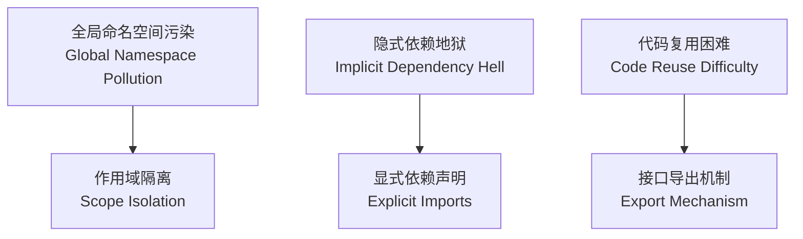
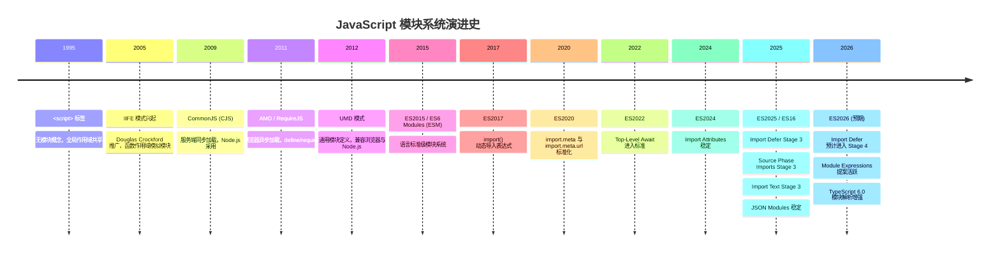
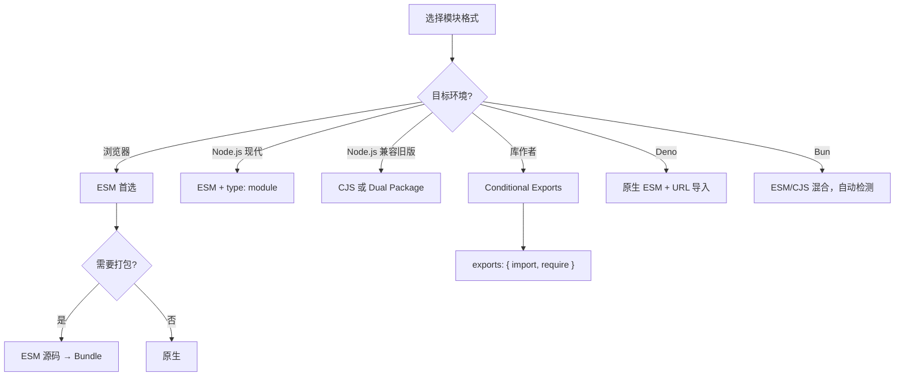
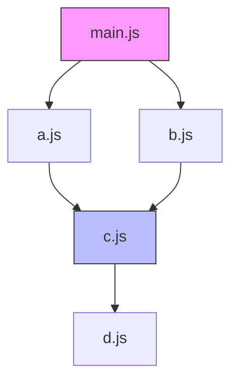

# 模块系统综述 (Module System Overview)

> **形式化定义**：模块系统（Module System）是编程语言中用于实现**信息隐藏（Information Hiding）**、**命名空间隔离（Namespace Isolation）**与**依赖显式化（Explicit Dependency Declaration）**的语法与语义机制。在 ECMAScript 的语境下，模块被定义为一段具有独立词法作用域（Lexical Scope）的代码单元，其内部绑定默认私有，仅通过显式的 `export` 声明暴露接口，通过显式的 `import` 声明引入外部依赖。
>
> 对齐版本：ECMAScript 2025 (ES16) | TypeScript 5.8–6.0 | Node.js 22+ | Deno 2.7 | Bun 1.3

---

## 1. 形式化定义 (Formal Definitions)

### 1.1 模块 (Module)

依据 ECMA-262 §16.2 的规范表述：

> *"A module is a collection of related code that can be reasoned about independently."*

形式化地，一个模块可表示为五元组 $M = (E, I, R, S, \Phi)$：

- **$E$ (Exports)**：模块向外部环境暴露的接口集合，构成模块的**契约（Contract）**。$E = \{e_1, e_2, \ldots, e_n\}$，其中每个 $e_i$ 为一个命名绑定（Named Binding）或默认绑定（Default Binding）。
- **$I$ (Imports)**：模块所依赖的外部接口集合，形成模块的**依赖图（Dependency Graph）**。$I = \{i_1, i_2, \ldots, i_m\}$，其中每个 $i_j$ 为对另一模块导出绑定的引用。
- **$R$ (Resolution)**：模块标识符（Module Specifier）到实际资源定位符（Resource Locator）的偏函数（Partial Function），$R: \text{Specifier} \rightharpoonup \text{URL} \cup \text{filePath}$。
- **$S$ (Scope)**：模块的词法环境记录（Lexical Environment Record），确保模块内部绑定与全局命名空间解耦。
- **$\Phi$ (Evaluation State)**：模块的求值状态机，$\Phi \in \{\text{uninstantiated}, \text{instantiating}, \text{instantiated}, \text{evaluating}, \text{evaluated}, \text{errored}\}$。

**公理 1（封装性，Encapsulation）**：模块 $M$ 的内部实现细节对其消费者不可见，消费者仅能通过 $E$ 中声明的导出绑定与模块交互。形式化为：

$$
\forall v \in \text{Variables}(M),\; v \notin N_{\text{global}} \implies v \text{ 在 } M \text{ 外部不可直接访问}
$$

**公理 2（复用性，Reusability）**：同一模块 $M$ 可被多个消费者导入，其求值实例在单次执行上下文（Execution Context）中保持唯一（Singleton 语义，具体由宿主环境的模块缓存机制保证）。

**公理 3（依赖显式化，Explicit Dependency）**：模块的所有外部依赖必须通过声明语句显式表达，禁止隐式的全局变量依赖。形式化为：

$$
\forall d \in \text{Dependencies}(M),\; \exists i \in I : i \text{ 声明了对 } d \text{ 的引用}
$$

### 1.2 命名空间 (Namespace)

> **定义**：命名空间是标识符（Identifier）到绑定（Binding）的映射集合 $N: \text{Identifier} \rightarrow \text{Binding}$，其作用域边界由模块的词法作用域（Lexical Scope）严格限定。

在无模块系统的早期 JavaScript 中，全局对象（Global Object）充当唯一的共享命名空间，导致**命名空间污染（Namespace Pollution）**。模块系统通过为每个模块创建独立的模块环境记录（Module Environment Record），将命名空间 $N_{\text{module}}$ 与全局命名空间 $N_{\text{global}}$ 解耦，从而保证：

$$
\forall v \in \text{Variables}(M),\; v \notin N_{\text{global}} \implies v \text{ 在 } M \text{ 外部不可直接访问}
$$

**直觉类比**：想象一个没有模块系统的 JavaScript 项目就像一座所有人共用一个抽屉的办公室——任何人的文件都可能被他人误拿或覆盖。模块系统则为每个开发者分配了独立的带锁文件柜，仅通过指定的窗口（exports）传递文件。

### 1.3 依赖 (Dependency)

> **定义**：依赖是模块之间的一种有向关系。若模块 $A$ 的求值或实例化需要模块 $B$ 的导出绑定，则称 $A$ **依赖（Depends on）** $B$，记作 $A \rightarrow B$。

模块的依赖集合构成**模块图（Module Graph）** $G = (V, E)$，其中：

- 顶点集 $V$ 为系统中的所有模块；
- 边集 $E \subseteq V \times V$ 为模块间的依赖关系；
- 若存在环路 $M_1 \rightarrow M_2 \rightarrow \ldots \rightarrow M_1$，则称系统存在**循环依赖（Cyclic Dependency）**。

模块图的拓扑性质直接决定了加载时序：
- 若 $G$ 为有向无环图（DAG），则存在拓扑排序，模块可按确定性顺序加载；
- 若 $G$ 含环，则加载顺序存在循环引用，需要特殊处理机制（如 CJS 的部分导出或 ESM 的 TDZ）。

---

## 2. 为什么需要模块 (Why Modules Exist)

在模块化机制诞生之前，JavaScript 代码主要依赖 `<script>` 标签按序加载，面临三大核心问题：



### 2.1 封装性（Encapsulation）

模块将内部状态与实现细节隐藏于词法作用域之内，仅暴露受控的公共接口。这种**信息隐藏（Information Hiding）**原则降低了系统各组件之间的耦合度（Coupling），使得模块可以独立演进而不破坏外部消费者。

**类比**：模块就像一台咖啡机。用户只需知道按哪个按钮（export 的接口），而无需了解内部水泵、加热器或控制电路的实现。如果厂商升级了内部加热算法（修改模块内部代码），只要按钮功能不变，消费者就不会受到影响。

**正例**（良好的封装）：

```typescript
// math-utils.ts —— 内部实现细节完全隐藏
const PRECISION = 1e-10; // 私有常量，外部不可见

function sanitizeInput(n: number): number {
  // 私有辅助函数
  return Number.isFinite(n) ? n : 0;
}

export function safeDivide(a: number, b: number): number {
  const cleanB = sanitizeInput(b);
  if (Math.abs(cleanB) < PRECISION) {
    throw new RangeError(`Division by zero or near-zero: ${b}`);
  }
  return sanitizeInput(a) / cleanB;
}

export const PI_APPROX = 3.141592653589793;
```

**反例**（缺乏封装的全局变量）：

```typescript
// ❌ 错误：没有模块系统时，所有变量都挂在全局对象上
// 在浏览器中，这等同于 window.PRECISION = 1e-10
const PRECISION = 1e-10; // 任何脚本都可以意外修改此值

function safeDivide(a: number, b: number): number {
  // 没有封装，辅助函数暴露在外
  if (Math.abs(b) < PRECISION) throw new Error("div by zero");
  return a / b;
}
// 没有 export，所有内容都全局可见
```

**修正**：使用模块的私有作用域，仅 export 需要的接口。

### 2.2 复用性（Reusability）

模块化的代码单元可在不同项目、不同上下文中被重复引用。通过版本化的包管理器（如 npm、pnpm、yarn），开发者能够共享与复用经过验证的代码库，避免重复造轮子。

**类比**：模块系统就像乐高积木的标准接口。每一块积木（模块）都有标准的凸点和凹槽（import/export 接口），使得来自不同套装的积木可以无缝组合。

**正例**（高复用性模块）：

```typescript
// date-formatter.ts —— 可在任何需要日期格式化的项目中复用
export type DateFormat = 'iso' | 'locale' | 'relative';

export function formatDate(date: Date, format: DateFormat): string {
  switch (format) {
    case 'iso': return date.toISOString();
    case 'locale': return date.toLocaleString();
    case 'relative': return getRelativeTime(date);
  }
}

function getRelativeTime(date: Date): string {
  const diff = Date.now() - date.getTime();
  const seconds = Math.floor(diff / 1000);
  if (seconds < 60) return `${seconds}秒前`;
  const minutes = Math.floor(seconds / 60);
  if (minutes < 60) return `${minutes}分钟前`;
  const hours = Math.floor(minutes / 60);
  if (hours < 24) return `${hours}小时前`;
  return `${Math.floor(hours / 24)}天前`;
}
```

### 2.3 依赖管理（Dependency Management）

显式的依赖声明使得工具链（Bundler、Type Checker、Linter）能够在**编译时（Compile-Time）**或**解析时（Parse-Time）**构建完整的模块图，从而支持：

- 确定性构建（Deterministic Build）
- 死代码消除（Dead Code Elimination / Tree Shaking）
- 循环依赖检测（Cyclic Dependency Detection）
- 自动化依赖升级与漏洞扫描

**正例**（显式依赖声明）：

```typescript
// app.ts —— 依赖关系一目了然
import { createServer } from 'node:http';     // 核心模块依赖
import { formatDate } from './date-formatter'; // 本地模块依赖
import express from 'express';                 // 第三方依赖（通过 package.json 管理）

const app = express();
app.get('/', (req, res) => {
  res.send(`Server started at ${formatDate(new Date(), 'iso')}`);
});
```

**反例**（隐式依赖地狱）：

```html
<!-- ❌ 错误：script 标签顺序即依赖声明，但不可见、不可验证 -->
<script src="jquery.js"></script>
<script src="lodash.js"></script>
<!-- 如果顺序颠倒，或某个脚本缺失，运行时才会报错 -->
<script src="app.js"></script>
```

---

## 3. 历史演进 (Historical Evolution)

JavaScript 模块系统的演进是一部从"无模块"到"语言级标准"的漫长历程。

### 3.1 演进时间线



### 3.2 各阶段详述

**无模块时代（1995–2005）**

`<script>` 标签按序加载，所有变量与函数声明提升（Hoisting）至全局作用域。开发者只能依赖命名约定（如前缀 `myLib_`）来避免冲突。这一时期的 JavaScript 代码就像没有隔断的开放式办公空间——任何人的变量都可能被意外覆盖。

**IIFE（Immediately Invoked Function Expression，2005）**

通过函数表达式与立即调用创建私有作用域，是最早的"模块模式"：

```typescript
// iife-module.ts —— IIFE 模式模拟模块
const myModule = (function () {
  let privateVar = 0;
  function privateMethod(): number { return privateVar++; }
  return { publicMethod: privateMethod };
})();

myModule.publicMethod(); // 0
myModule.publicMethod(); // 1
// myModule.privateVar 不可访问
```

**CommonJS（CJS，2009）**

为服务端 JavaScript 设计的同步模块系统：

```typescript
// cjs-module.js
const fs = require("fs");
module.exports.readConfig = function () { /* ... */ };
```

CJS 解决了服务端模块化需求，但其同步加载模型天然不适合浏览器环境（网络 I/O 不能阻塞）。

**AMD（Asynchronous Module Definition，2011）**

面向浏览器的异步加载方案，RequireJS 为其主要实现：

```javascript
define(["jquery"], function ($) {
  return { init: function () { /* ... */ } };
});
```

AMD 的异步设计适合浏览器，但语法冗长，且与 CJS 生态分裂。

**UMD（Universal Module Definition，2012）**

一种兼容 AMD、CJS 与全局变量的"胶水"模式，旨在让库作者编写一次代码即可运行于多种环境：

```typescript
// umd-wrapper.ts —— UMD 模式的 TypeScript 实现
(function (root, factory) {
  if (typeof define === 'function' && define.amd) {
    define(['exports'], factory);
  } else if (typeof module === 'object' && module.exports) {
    factory(module.exports);
  } else {
    factory((root as any).MyLib = {});
  }
}(typeof self !== 'undefined' ? self : this, function (exports: any) {
  exports.version = '1.0.0';
}));
```

**ESM（ECMAScript Modules，ES2015）**

语言级标准模块系统，核心特征为**静态结构（Static Structure）**：

```typescript
// esm-module.ts
import { parse } from 'node:path';
export const config = { env: "production" };
```

ESM 的设计哲学是"一次编写，到处运行"——从浏览器到服务端，从 Deno 到 Bun，所有现代 JavaScript 运行时均原生支持 ESM。

### 3.3 2025–2026 最新发展

| 年份 | 特性 | 状态 | 影响 |
|------|------|------|------|
| 2025 | Import Attributes (`with { type: "json" }`) | ES2025 标准 | JSON/CSS/WASM 模块类型安全加载 |
| 2025 | Import Defer (`import defer * as x`) | Stage 3 | 延迟求值，优化启动性能 |
| 2025 | Source Phase Imports | Stage 3 | WASM 模块源对象导入 |
| 2025 | Import Text | Stage 3 | 非代码资源作为字符串导入 |
| 2025 | JSON Modules | 稳定 | 原生 JSON 导入，无需 assert |
| 2025 | TypeScript `moduleResolution: "nodenext"` | 稳定 | 严格 ESM/CJS 双模式类型解析 |
| 2026 | Import Defer | 预计 Stage 4 | 全引擎支持延迟加载 |
| 2026 | Module Expressions | Stage 2 | 内联模块表达式 |
| 2026 | Node.js `require(esm)` | v22+ 稳定 | CJS 同步 require ESM 模块 |

---

## 4. 关键概念 (Key Concepts)

### 4.1 导出（Exports）

导出是模块向外部暴露绑定的机制。ESM 支持：

- **Named Export**：`export const foo = 1;`
- **Default Export**：`export default function () {}`
- **Namespace Re-export**：`export * as ns from "./mod.js";`
- **Aggregating Re-export**：`export { foo, bar } from "./mod.js";`

**正例**（多样化的导出模式）：

```typescript
// geometry.ts —— 展示所有导出模式
export const PI = 3.141592653589793;                    // 命名导出
export function circleArea(r: number): number {         // 命名导出
  return PI * r * r;
}
export class Rectangle {                                // 命名导出
  constructor(public width: number, public height: number) {}
  area(): number { return this.width * this.height; }
}

export default class Circle {                           // 默认导出
  constructor(public radius: number) {}
  area(): number { return PI * this.radius * this.radius; }
}

// 聚合重导出
export { Rectangle as Rect } from './shapes/rectangle';
export * as shapes from './shapes';
```

**反例**（混淆默认导出与命名导出）：

```typescript
// ❌ 错误：同时 export default 和 export = 在 TS 中冲突
export = class Circle {};
export default Circle; // Error: An export assignment cannot be used with other exports
```

**修正**：选择一种导出风格并统一使用。

### 4.2 导入（Imports）

导入是模块消费外部绑定的机制：

- **Named Import**：`import { foo } from "./mod.js";`
- **Default Import**：`import foo from "./mod.js";`
- **Namespace Import**：`import * as mod from "./mod.js";`
- **Side-effect Import**：`import "./polyfill.js";`
- **Dynamic Import**：`const mod = await import("./mod.js");`

**正例**（各种导入模式的最佳实践）：

```typescript
// app.ts
import express from 'express';                          // 默认导入
import { Router, Request, Response } from 'express';    // 命名导入
import * as path from 'node:path';                      // 命名空间导入
import './instrumentation';                             // 副作用导入（初始化追踪）

// 动态导入用于代码分割
async function loadHeavyFeature() {
  const { generateReport } = await import('./report-generator');
  return generateReport();
}
```

### 4.3 模块解析（Module Resolution）

模块解析是从模块标识符（Module Specifier）到实际资源位置的映射过程。不同宿主环境采用不同的解析算法：

- **Node.js**：支持相对路径（`./`）、绝对路径（`/`）与裸指定符（bare specifier，如 `lodash`）。裸指定符通过 `node_modules` 层级查找。
- **浏览器**：仅支持相对路径与绝对 URL，不支持裸指定符（除非使用 Import Map）。
- **Deno**：支持 URL 导入（`https://deno.land/std/mod.ts`）与本地路径，通过权限模型控制访问。
- **Bun**：兼容 Node.js 解析算法，同时支持更快速的内部解析缓存。

**模块解析的形式化描述**：

设模块指定符为 $s$，解析上下文为 $c$（包含当前文件路径、模块类型、条件键），则解析函数为：

$$
\text{Resolve}(s, c) = \begin{cases}
\text{core}(s) & \text{if } s \in \text{CoreModules} \\
\text{path.resolve}(\text{dirname}(c), s) & \text{if } s \text{ starts with } ./ \text{ or } ../ \\
\text{nodeModulesLookup}(s, c) & \text{if } s \text{ is bare specifier} \\
\text{URL}(s) & \text{if } s \text{ starts with } https:// \\
\text{MODULE\_NOT\_FOUND} & \text{otherwise}
\end{cases}
$$

### 4.4 循环依赖（Cyclic Dependencies）

当模块图 $G$ 中存在有向环时，即发生循环依赖。不同模块系统对循环依赖的处理策略截然不同：

- **CommonJS**：允许循环依赖，但由于 `require()` 在运行时执行，部分导出可能为未完成的对象（Incomplete Object）。
- **ESM**：由于依赖图在实例化阶段即已确定，循环依赖通过 **Temporal Dead Zone（TDZ）** 处理：若访问尚未完成求值的绑定，抛出 `ReferenceError`。

---

## 5. Node.js 的双模块问题（The Dual-Module Problem）

Node.js 从 v12 开始实验性支持 ESM，v14 后稳定，但遗留了庞大的 CJS 生态系统。这导致所谓的**双模块问题（Dual-Module Problem）**：

### 5.1 核心矛盾

1. **同步 vs 异步加载**：CJS 的 `require()` 是同步的；ESM 的静态 `import` 在求值阶段是异步流程的（尽管语法看起来像同步）。这导致 `require()` 无法加载 ESM 模块（ESM 不允许被同步求值）。
2. **文件扩展名歧义**：`.js` 文件既可能是 CJS 也可能是 ESM，取决于 `package.json` 中的 `"type"` 字段。
3. **互操作复杂性**：`import` 可以加载 CJS（由 Node.js 运行时进行包装转换），但 CJS 无法 `require()` ESM（Node.js 22+ 实验性支持除外）。
4. **工具链负担**：打包器（Webpack、Rollup、esbuild）、类型检查器（tsc）、测试框架（Vitest、Jest）均需同时理解两套语义。

### 5.2 Node.js 的解决方案

- **`"type": "module"` / `"type": "commonjs"`**：在 `package.json` 中显式声明默认模块格式。
- **`.mjs` 与 `.cjs`**：文件扩展名强制指定模块格式，绕过 `package.json` 的 `type` 字段。
- **`createRequire`**：在 ESM 中创建 CJS 的 `require` 函数，用于加载遗留 CJS 模块。
- **Conditional Exports（`exports` 字段）**：支持**双包（Dual Package）**模式，使同一个 npm 包可以同时为 ESM 与 CJS 消费者提供对应入口。

**正例**（package.json 条件导出配置）：

```json
{
  "name": "my-modern-lib",
  "type": "module",
  "exports": {
    ".": {
      "types": {
        "import": "./dist/index.d.mts",
        "require": "./dist/index.d.cts"
      },
      "import": "./dist/index.mjs",
      "require": "./dist/index.cjs"
    },
    "./utils": {
      "import": "./dist/utils.mjs",
      "require": "./dist/utils.cjs"
    }
  }
}
```

---

## 6. 模块格式对比 (Comparison Table)

### 6.1 特性矩阵：IIFE vs AMD vs CJS vs UMD vs ESM

| 特性 | IIFE | AMD | CommonJS | UMD | ESM |
|------|------|-----|----------|-----|-----|
| 作用域隔离 | ✅ 函数作用域 | ✅ 函数作用域 | ✅ 文件作用域 | ✅ 视环境而定 | ✅ 模块作用域 |
| 依赖显式声明 | ❌ 隐式全局 | ✅ `define(deps)` | ✅ `require()` | ⚠️ 视环境而定 | ✅ `import` |
| 异步加载 | ❌ | ✅ | ❌ | ⚠️ | ✅ (浏览器原生并行) |
| 浏览器原生支持 | ✅ (script 标签) | ❌ (需 RequireJS) | ❌ (需 Browserify) | ❌ (需打包) | ✅ `<script type="module">` |
| Node.js 原生支持 | ✅ | ❌ | ✅ | ✅ | ✅ (12+ 实验, 14+ 稳定) |
| 静态分析友好 | ❌ | ⚠️ | ❌ | ❌ | ✅ |
| Tree Shaking | ❌ | ❌ | ❌ | ❌ | ✅ |
| 循环依赖处理 | N/A | ⚠️ 有限 | ⚠️ 部分导出 | ⚠️ 视环境而定 | ✅ TDZ 语义明确 |
| Top-Level Await | N/A | N/A | ❌ | ❌ | ✅ |
| 动态条件加载 | ❌ | ✅ | ✅ | ✅ | ⚠️ 需 `import()` |
| 死代码消除 | ❌ | ❌ | ❌ | ❌ | ✅ |
| 浏览器 MIME 要求 | 无 | 无 | 无 | 无 | CORS + `application/javascript` |

### 6.2 各模块格式的关系与定位

| 格式 | 设计目标 | 与 ESM 的关系 | 现状 |
|------|---------|-------------|------|
| IIFE | 浏览器作用域隔离 | 被 ESM 完全取代 | 遗留代码 / CDN 极小脚本 |
| AMD | 浏览器异步加载 | 被 ESM 动态 `import()` 取代 | 基本淘汰 |
| CommonJS | 服务端同步加载 | 与 ESM 共存，逐步迁移 | Node.js 核心生态，大量 npm 包 |
| UMD | 通用封装（浏览器+Node） | 过渡方案，被 ESM 取代 | 库打包输出格式 |
| ESM | 语言标准模块 | 未来唯一标准 | 现代开发首选 |

### 6.3 运行时差异矩阵（2025–2026）

| 特性 | Node.js 22 | Deno 2.x | Bun 1.3 | Chrome 125+ |
|------|-----------|----------|---------|-------------|
| ESM 裸指定符 | 支持 (package.json) | 支持 (URL + npm) | 支持 | 否（需 Import Map） |
| `import.meta.url` | `file://` | `file://` / `https://` | `file://` | 文档 URL |
| `import.meta.resolve` | 支持 | 支持 | 支持 | 否 |
| `import.meta.main` | 否 | 支持 | 支持 | N/A |
| JSON 模块 (with) | 支持 | 支持 | 支持 | 实验性 |
| CSS 模块 (with) | 否 | 否 | 否 | Chrome 123+ |
| WASM 模块导入 | 实验性 | 支持 | 支持 | 实验性 |
| `require(esm)` | v22+ 稳定 | N/A | 支持 | N/A |
| TypeScript 原生导入 | `--experimental-strip-types` | 原生支持 | 原生支持 | 不支持 |

---

## 7. 思维表征与机制图解 (Mental Models & Diagrams)

### 7.1 模块系统决策树



### 7.2 模块图拓扑示例



### 7.3 模块加载的"水管系统"类比

想象模块系统是一个复杂建筑的供水系统：

- **CJS 的 `require()`** 就像直接打开水龙头——水是即时流出的（同步），但你必须在建筑已经建成、水管已经铺好后才能使用（运行时解析）。如果两条水管互相连接（循环依赖），水流可能在某些分支只流了一半（部分导出）。

- **ESM 的 `import`** 就像建筑蓝图上的管道设计图——在建筑动工前（编译/解析阶段），工程师就已经知道每根水管从哪里来到哪里去（静态依赖图）。当建筑完工后，所有的水阀是联动开启的，并且每个水龙头都实时连接到总水箱（Live Bindings）。

- **动态 `import()`** 则是可伸缩的软管——平时收起来不占空间，需要时拉出来连接（异步加载），适合偶尔使用的花园浇水场景（条件加载、代码分割）。

---

## 8. 进阶代码示例

### 8.1 浏览器原生 ESM 与 Import Map

```html
<!-- index.html -->
<script type="importmap">
{
  "imports": {
    "vue": "https://cdn.jsdelivr.net/npm/vue@3/dist/vue.esm-browser.js",
    "lodash-es/": "https://cdn.jsdelivr.net/npm/lodash-es/",
    "react": "https://esm.sh/react@19",
    "react-dom/client": "https://esm.sh/react-dom@19/client"
  },
  "scopes": {
    "/legacy/": {
      "react": "https://esm.sh/react@18"
    }
  }
}
</script>
<script type="module">
  import { createApp } from 'vue';
  import debounce from 'lodash-es/debounce.js';
  import { createRoot } from 'react-dom/client';

  // Vue 应用
  const app = createApp({
    data() { return { count: 0 }; }
  });
  app.mount('#vue-app');

  // React 应用（在同一页面共存）
  const root = createRoot(document.getElementById('react-app'));
  root.render(React.createElement('h1', null, 'Hello React'));
</script>
```

### 8.2 Node.js `createRequire` 在 ESM 中使用 CJS

```typescript
// config.mts —— ESM 中桥接 CJS 生态
import { createRequire } from 'node:module';
import { fileURLToPath } from 'node:url';
import { dirname, join } from 'node:path';

const require = createRequire(import.meta.url);
const __filename = fileURLToPath(import.meta.url);
const __dirname = dirname(__filename);

// 加载 CJS 配置文件
const legacyConfig: Record<string, unknown> = require('./legacy.config.cjs');

// 读取 JSON（在 ESM 中也可用 import with { type: "json" }，但 createRequire 兼容旧代码）
const pkg = require('../package.json');

// 使用 node_modules 中的 CJS 包
const cjsUtil = require('some-legacy-cjs-package');

export const config = {
  ...legacyConfig,
  version: pkg.version as string,
  utilVersion: cjsUtil.VERSION as string,
  baseDir: __dirname,
};
```

### 8.3 UMD 模式完整示例（TypeScript 编译目标）

```typescript
// umd-module.ts —— 现代库打包工具（Rollup/Webpack）会自动生成此模式
// 以下为等效手写 TypeScript 实现

type Factory = (dep: any) => any;

(function (root: any, factory: Factory) {
  if (typeof define === 'function' && define.amd) {
    // AMD
    define(['jquery'], factory);
  } else if (typeof module === 'object' && module.exports) {
    // CommonJS
    module.exports = factory(require('jquery'));
  } else {
    // 浏览器全局
    root.MyModule = factory(root.jQuery);
  }
}(typeof self !== 'undefined' ? self : this, function ($: any) {
  return {
    init(): number { return $('body').length; },
    version: '1.0.0'
  };
}));
```

### 8.4 条件导出（Conditional Exports）实战

```json
{
  "name": "my-lib",
  "version": "2.0.0",
  "type": "module",
  "exports": {
    ".": {
      "types": {
        "import": "./dist/index.d.mts",
        "require": "./dist/index.d.cts"
      },
      "import": {
        "types": "./dist/index.d.mts",
        "default": "./dist/index.mjs"
      },
      "require": {
        "types": "./dist/index.d.cts",
        "default": "./dist/index.cjs"
      }
    },
    "./package.json": "./package.json",
    "./utils": {
      "types": "./dist/utils.d.mts",
      "import": "./dist/utils.mjs",
      "require": "./dist/utils.cjs"
    },
    "./features/*": {
      "types": "./dist/features/*.d.mts",
      "import": "./dist/features/*.mjs",
      "require": "./dist/features/*.cjs"
    }
  }
}
```

### 8.5 TypeScript 模块系统检测与自适应加载

```typescript
// module-detector.ts —— 运行时检测模块系统并自适应加载

export type ModuleSystem = 'esm' | 'cjs' | 'unknown';

export function detectModuleSystem(): ModuleSystem {
  try {
    // import.meta 仅在 ESM 中可用
    if (typeof import.meta.url === 'string') {
      return 'esm';
    }
  } catch {
    // SyntaxError 意味着我们在 CJS 环境中
  }
  
  // 检查 CJS 特有的全局变量
  if (typeof module !== 'undefined' && module.exports != null) {
    return 'cjs';
  }
  
  return 'unknown';
}

// 自适应加载器：根据环境选择加载策略
export async function loadModule<T>(esmPath: string, cjsPath: string): Promise<T> {
  const sys = detectModuleSystem();
  
  if (sys === 'esm') {
    const mod = await import(esmPath);
    return mod.default ?? mod;
  }
  
  if (sys === 'cjs') {
    // 在 ESM 中此分支不会执行，但在 CJS 中会
    // @ts-ignore
    return require(cjsPath);
  }
  
  throw new Error(`Unsupported module system: ${sys}`);
}
```

### 8.6 Deno 与 Bun 的跨运行时兼容模块

```typescript
// cross-runtime.ts —— 兼容 Node.js / Deno / Bun 的模块

// 检测运行时环境
const runtime = (() => {
  // @ts-ignore
  if (typeof Deno !== 'undefined') return 'deno';
  // @ts-ignore
  if (typeof Bun !== 'undefined') return 'bun';
  if (typeof process !== 'undefined') return 'node';
  return 'browser';
})();

// 跨运行时文件读取
export async function readConfigFile(path: string): Promise<Record<string, unknown>> {
  switch (runtime) {
    case 'deno': {
      // Deno 使用权限控制的文件 API
      const text = await Deno.readTextFile(path);
      return JSON.parse(text);
    }
    case 'bun': {
      // Bun 提供同步文件 API，性能更优
      const file = Bun.file(path);
      return await file.json();
    }
    case 'node': {
      const fs = await import('node:fs/promises');
      const text = await fs.readFile(path, 'utf-8');
      return JSON.parse(text);
    }
    default: {
      const res = await fetch(path);
      return await res.json();
    }
  }
}

// 跨运行时环境变量获取
export function getEnv(key: string): string | undefined {
  switch (runtime) {
    case 'deno': return Deno.env.get(key) ?? undefined;
    case 'bun': return process.env[key];
    case 'node': return process.env[key];
    default: return undefined;
  }
}
```

### 8.7 模块加载性能基准对比

```typescript
// benchmark.ts —— 比较不同模块加载策略的性能

import { performance } from 'node:perf_hooks';

interface BenchmarkResult {
  strategy: string;
  durationMs: number;
  memoryDeltaMb: number;
}

export async function runBenchmark(): Promise<BenchmarkResult[]> {
  const results: BenchmarkResult[] = [];
  
  // 基准 1：静态导入（ESM 编译时解析）
  const memBeforeStatic = process.memoryUsage().heapUsed;
  const t0 = performance.now();
  const { randomUUID } = await import('node:crypto');
  results.push({
    strategy: 'static-import',
    durationMs: performance.now() - t0,
    memoryDeltaMb: (process.memoryUsage().heapUsed - memBeforeStatic) / 1024 / 1024,
  });
  
  // 基准 2：动态导入（运行时解析）
  const memBeforeDynamic = process.memoryUsage().heapUsed;
  const t1 = performance.now();
  const os = await import('node:os');
  results.push({
    strategy: 'dynamic-import',
    durationMs: performance.now() - t1,
    memoryDeltaMb: (process.memoryUsage().heapUsed - memBeforeDynamic) / 1024 / 1024,
  });
  
  // 基准 3：CJS require（同步缓存加载）
  const memBeforeRequire = process.memoryUsage().heapUsed;
  const t2 = performance.now();
  // @ts-ignore
  const path = require('node:path');
  results.push({
    strategy: 'cjs-require',
    durationMs: performance.now() - t2,
    memoryDeltaMb: (process.memoryUsage().heapUsed - memBeforeRequire) / 1024 / 1024,
  });
  
  return results;
}

// 典型结果（Node.js 22）：
// static-import: ~0.05ms, dynamic-import: ~0.1ms, cjs-require: ~0.01ms
// CJS require 最快因为直接访问缓存；ESM 静态导入在解析阶段已完成大部分工作
```

### 8.8 2025 最新：JSON 模块与 Import Attributes

```typescript
// config-loader.ts —— 使用 ES2025 Import Attributes 安全加载配置

// ✅ 正例：使用 with { type: "json" } 明确声明模块类型
import appConfig from './config.json' with { type: 'json' };

// TypeScript 5.3+ 会自动推断 JSON 结构类型
// appConfig 的类型：{ name: string; version: string; features: { darkMode: boolean; }; }

export function getFeatureFlag(flag: keyof typeof appConfig.features): boolean {
  return appConfig.features[flag] ?? false;
}

// 动态导入 + Import Attributes
export async function loadLocale(locale: string): Promise<Record<string, string>> {
  const mod = await import(`./locales/${locale}.json`, {
    with: { type: 'json' }
  });
  return mod.default;
}

// ❌ 反例：不使用 import attributes（旧做法，不安全）
// import appConfig from './config.json'; // 在某些环境中可能按 JS 解析，存在安全风险
```

---

## 9. 2025–2026 模块系统前沿 (Cutting-Edge Developments)

### 9.1 TypeScript ESM 解析的演进

TypeScript 5.8–6.0 在模块解析方面做出了重大调整：

| 特性 | TypeScript 5.7 | TypeScript 5.8–6.0 |
|------|---------------|-------------------|
| `moduleResolution` | `node`, `nodenext`, `bundler` | 同上，但 `nodenext` 更严格 |
| `baseUrl` 自动推断 | 存在 | 已移除，必须显式声明 |
| ESM 文件扩展名 | 强制 `.js` | 强制 `.js`（即使源码是 `.ts`） |
| `--experimental-strip-types` | Node.js 专属 | Node.js 22+ 原生支持 |
| 条件导出 `types` | 支持 | 优先级提升，推荐放在首位 |

### 9.2 Node.js 模块钩子（Module Hooks）

Node.js 20+ 引入了实验性的**模块自定义钩子（Module Customization Hooks）**，允许在加载、解析、转换阶段注入自定义逻辑：

```typescript
// loader-hook.mjs —— Node.js 自定义模块钩子（实验性）
export async function resolve(specifier, context, nextResolve) {
  // 自定义解析逻辑：将 @app/ 前缀映射到 src/ 目录
  if (specifier.startsWith('@app/')) {
    return {
      shortCircuit: true,
      url: new URL(specifier.replace('@app/', './src/'), context.parentURL).href,
    };
  }
  return nextResolve(specifier, context);
}

export async function load(url, context, nextLoad) {
  // 自定义加载逻辑：在加载前注入版本信息
  if (url.endsWith('.ts')) {
    const result = await nextLoad(url, context);
    const injected = `// Auto-generated header\n` + result.source;
    return { ...result, source: injected };
  }
  return nextLoad(url, context);
}
```

### 9.3 Bun 的模块系统创新

Bun 在模块系统方面做了多项性能优化：

1. **并行模块解析**：利用 Zig 编写的高性能路径解析，模块图构建速度比 Node.js 快 4-10 倍
2. **自动格式检测**：无需 `"type": "module"`，Bun 通过语法分析自动检测 ESM vs CJS
3. **内置 TypeScript 支持**：`.ts` 和 `.tsx` 文件可直接导入，无需预编译
4. **JSON 和 TOML 原生导入**：`import config from './bunfig.toml'` 无需 attributes

```typescript
// bun-features.ts —— Bun 特有模块功能
// Bun 原生支持直接导入 TOML
import bunfig from './bunfig.toml';

// Bun 支持 CSS 导入（作为 CSSStyleSheet）
import styles from './styles.css';

// Bun 的 require 和 import 混用无需 createRequire
const cjs = require('./legacy.cjs'); // 在 .ts 文件中直接可用
```

### 9.4 Deno 的权限感知模块系统

Deno 的模块系统以安全为首要设计目标：

```typescript
// deno-app.ts —— Deno 权限感知模块加载
// 运行时需要 --allow-read --allow-net 权限

// 从 URL 直接导入（Deno 特色）
import { serve } from "https://deno.land/std@0.224.0/http/server.ts";

// 使用 npm: 前缀导入 npm 包
import express from "npm:express@4";

// Deno 的 import.meta.main 判断入口
if (import.meta.main) {
  serve((req) => new Response("Hello from Deno"), { port: 8000 });
}
```

---

## 10. 模块系统的抽象代数视角 (Abstract Algebra Perspective)

### 10.1 模块作为代数学结构

从抽象代数的角度审视，模块系统可被视为一种**部分代数（Partial Algebra）**。设 $\mathcal{M}$ 为模块的集合，$\circ$ 为组合操作（Composition），则：

$$
\circ: \mathcal{M} \times \mathcal{M} \rightharpoonup \mathcal{M}
$$

该操作是部分的（Partial），因为并非任意两个模块都可组合——组合的前提是两个模块的接口契约相容。

**公理 10（组合封闭性）**：若模块 $M_1$ 的导入集合 $I(M_1)$ 被模块 $M_2$ 的导出集合 $E(M_2)$ 满足（$I(M_1) \subseteq E(M_2)$），则 $M_1 \circ M_2$ 是良定义的。

**公理 11（结合性）**：模块的组合满足结合律，$(M_1 \circ M_2) \circ M_3 = M_1 \circ (M_2 \circ M_3)$，前提是两侧的依赖关系均相容。

**公理 12（单位元）**：空模块 $\varepsilon$（无导入、无导出的模块）是组合操作的单位元：$M \circ \varepsilon = \varepsilon \circ M = M$。

### 10.2 范畴论视角

在范畴论（Category Theory）框架下，模块系统构成一个**范畴（Category）** $\mathbf{Mod}$：

- **对象（Objects）**：模块 $M \in \text{Ob}(\mathbf{Mod})$
- **态射（Morphisms）**：模块间的导入关系 $f: M_1 \rightarrow M_2$，表示 $M_1$ 依赖 $M_2$
- **恒等态射（Identity）**：$\text{id}_M: M \rightarrow M$，表示模块自引用
- **态射组合（Composition）**：若 $M_1 \rightarrow M_2$ 且 $M_2 \rightarrow M_3$，则存在 $M_1 \rightarrow M_3$（传递闭包）

循环依赖在该范畴中对应于**非平凡的环（Non-trivial Loop）**，即存在态射序列 $M \xrightarrow{f_1} M_1 \xrightarrow{f_2} \ldots \xrightarrow{f_n} M$ 使得组合 $f_n \circ \ldots \circ f_1 \neq \text{id}_M$。

---

## 11. 更多实战代码示例

### 11.1 模块系统性能基准测试

```typescript
// module-benchmark.ts —— 比较 ESM 与 CJS 的加载性能
import { performance } from 'node:perf_hooks';
import { writeFileSync, mkdirSync, rmSync } from 'node:fs';
import { join } from 'node:path';

interface BenchmarkResult {
  system: 'esm' | 'cjs';
  moduleCount: number;
  totalLoadTimeMs: number;
  avgLoadTimeMs: number;
}

export async function runModuleBenchmark(moduleCount: number = 100): Promise<BenchmarkResult[]> {
  const tmpDir = join(process.cwd(), '.tmp-modules');
  
  // 清理并创建临时目录
  try { rmSync(tmpDir, { recursive: true }); } catch {}
  mkdirSync(tmpDir, { recursive: true });
  
  // 生成 CJS 模块链
  for (let i = 0; i < moduleCount; i++) {
    const next = i < moduleCount - 1 ? `require('./mod_${i + 1}');` : '';
    writeFileSync(
      join(tmpDir, `mod_${i}.js`),
      `module.exports = { value: ${i}, next: ${i < moduleCount - 1} }; ${next}`
    );
  }
  
  // 生成 ESM 模块链
  for (let i = 0; i < moduleCount; i++) {
    const next = i < moduleCount - 1 ? `import './mod_esm_${i + 1}.js';` : '';
    writeFileSync(
      join(tmpDir, `mod_esm_${i}.js`),
      `export const value = ${i}; export const hasNext = ${i < moduleCount - 1}; ${next}`
    );
  }
  
  const results: BenchmarkResult[] = [];
  
  // 基准 CJS
  const t0 = performance.now();
  // @ts-ignore
  require(join(tmpDir, 'mod_0.js'));
  results.push({
    system: 'cjs',
    moduleCount,
    totalLoadTimeMs: performance.now() - t0,
    avgLoadTimeMs: (performance.now() - t0) / moduleCount,
  });
  
  // 基准 ESM（通过动态导入）
  const t1 = performance.now();
  await import(join(tmpDir, 'mod_esm_0.js'));
  results.push({
    system: 'esm',
    moduleCount,
    totalLoadTimeMs: performance.now() - t1,
    avgLoadTimeMs: (performance.now() - t1) / moduleCount,
  });
  
  // 清理
  rmSync(tmpDir, { recursive: true });
  
  return results;
}

// 典型结果（Node.js 22，100 个模块）：
// CJS: ~2-5ms 总加载时间（缓存命中后几乎为 0）
// ESM: ~3-8ms 总加载时间（首次解析开销略高）
```

### 11.2 沙箱模块加载器（教育用途）

```typescript
// sandbox-loader.ts —— 模拟模块系统的核心机制

interface SandboxModule {
  exports: Record<string, unknown>;
  loaded: boolean;
}

export class SandboxModuleSystem {
  private cache = new Map<string, SandboxModule>();
  
  require(id: string, sourceCode: string): unknown {
    // 1. 缓存检查
    if (this.cache.has(id)) {
      return this.cache.get(id)!.exports;
    }
    
    // 2. 创建模块
    const mod: SandboxModule = { exports: {}, loaded: false };
    this.cache.set(id, mod);
    
    // 3. 包装并执行
    const wrapper = new Function('exports', 'require', 'module', sourceCode);
    const requireFn = (subId: string) => {
      console.log(`[Sandbox] requiring '${subId}' from '${id}'`);
      return this.require(subId, `module.exports = { mocked: true };`);
    };
    
    wrapper(mod.exports, requireFn, mod);
    mod.loaded = true;
    
    return mod.exports;
  }
  
  clearCache(): void {
    this.cache.clear();
  }
}

// 使用示例
const sandbox = new SandboxModuleSystem();
const result = sandbox.require('main', `
  exports.message = "Hello from sandbox";
  const sub = require('sub');
  exports.subMessage = sub.mocked;
`);
console.log(result); // { message: "Hello from sandbox", subMessage: true }
```

---

## 12. 2025–2026 前沿追踪

### 12.1 WinterTC 与跨运行时标准化

WinterTC（前身为 WinterCG）正在推动 JavaScript 运行时之间的模块系统标准化：

| 提案 | 状态 | 描述 |
|------|------|------|
| 最小通用 API | 已发布 | `fetch`、`URL`、`TextEncoder` 等跨运行时 API |
| 模块加载语义 | 讨论中 | 统一 ESM 在不同运行时的边界行为 |
| 文件系统模块 | 讨论中 | 标准化 `node:fs` 的跨运行时子集 |

### 12.2 TypeScript 6.0 模块解析展望

TypeScript 6.0 预计在模块系统方面有以下改进：

- **`package.json` `imports` 字段的完全支持**：无需额外 `paths` 配置
- **ESM 路径映射自动推断**：减少手动 `baseUrl` 配置需求
- **更严格的 `--isolatedModules` 默认启用**：确保单文件 transpilation 安全

---

## 13. 模块系统的未来演进 (2026 及以后)

### 13.1 Module Expressions 提案

TC39 Stage 2 的 Module Expressions 提案允许在表达式位置创建内联模块：

```typescript
// 提案语法（尚未实现）
const utils = module {
  export function add(a: number, b: number): number {
    return a + b;
  }
  export const PI = 3.14159;
};

// 使用内联模块
const { add, PI } = await import(utils);
```

**意义**：Module Expressions 将模块从文件级抽象提升为值级抽象，使得模块可以在运行时动态创建、传递和组合。

### 13.2 模块系统的统一愿景

WinterTC 和 TC39 正在推动 JavaScript 模块系统的进一步统一：

| 方向 | 目标 | 预期时间 |
|------|------|---------|
| 跨运行时模块语义统一 | 消除 Node.js/Browser/Deno 的行为差异 | 2026–2027 |
| 原生 TypeScript 支持 | 无需构建步骤直接运行 .ts 模块 | 2025+ |
| 模块安全性增强 | 内置的导入权限控制（类似 Deno） | 2027+ |
| 模块加载性能优化 | 预编译模块缓存的标准化 | 2026+ |

---

## 14. 权威参考 (References)

| 来源 | 链接 | 相关章节 |
|------|------|---------|
| ECMA-262 | [tc39.es/ecma262](https://tc39.es/ecma262) | §16.2 Modules |
| Node.js ESM | [nodejs.org/api/esm.html](https://nodejs.org/api/esm.html) | ESM 完整文档 |
| Node.js CJS | [nodejs.org/api/modules.html](https://nodejs.org/api/modules.html) | CJS 完整文档 |
| Node.js Packages | [nodejs.org/api/packages.html](https://nodejs.org/api/packages.html) | 条件导出、Import Map |
| TypeScript Handbook | [typescriptlang.org/docs/handbook/modules/reference.html](https://www.typescriptlang.org/docs/handbook/modules/reference.html) | Modules |
| MDN | [developer.mozilla.org/en-US/docs/Web/JavaScript/Guide/Modules](https://developer.mozilla.org/en-US/docs/Web/JavaScript/Guide/Modules) | JavaScript Modules |
| MDN Import Map | [developer.mozilla.org/en-US/docs/Web/HTML/Element/script/type/importmap](https://developer.mozilla.org/en-US/docs/Web/HTML/Element/script/type/importmap) | 浏览器 Import Map |
| HTML Spec — Scripting | [html.spec.whatwg.org/multipage/webappapis.html#module-map](https://html.spec.whatwg.org/multipage/webappapis.html#module-map) | 浏览器模块映射 |
| Rollup Guide | [rollupjs.org/guide/en/](https://rollupjs.org/guide/en/) | ESM-first 打包器 |
| Webpack Modules | [webpack.js.org/concepts/modules/](https://webpack.js.org/concepts/modules/) | Webpack 模块解析 |
| esbuild Docs | [esbuild.github.io/](https://esbuild.github.io/) | 极速打包器 |
| 2ality — ESM in depth | [2ality.com/2014/09/es6-modules-final.html](https://2ality.com/2014/09/es6-modules-final.html) | Dr. Axel 深度解析 |
| Sindre Sorhus ESM Guide | [gist.github.com/sindresorhus/a39789f98801d908bbc7ff3ecc99d99c](https://gist.github.com/sindresorhus/a39789f98801d908bbc7ff3ecc99d99c) | ESM 迁移指南 |
| Deno Modules | [docs.deno.com/runtime/fundamentals/modules/](https://docs.deno.com/runtime/fundamentals/modules/) | Deno 模块系统 |
| Bun Modules | [bun.sh/docs/runtime/modules](https://bun.sh/docs/runtime/modules) | Bun 运行时模块 |
| TC39 Import Attributes | [tc39.es/proposal-import-attributes](https://tc39.es/proposal-import-attributes) | ES2025 Import Attributes |
| TC39 Import Defer | [tc39.es/proposal-import-defer](https://tc39.es/proposal-import-defer) | Stage 3 延迟导入 |
| Node.js Module Hooks | [nodejs.org/api/module.html#customization-hooks](https://nodejs.org/api/module.html#customization-hooks) | 自定义模块钩子 |

---

**参考规范**：ECMA-262 §16.2 | Node.js Modules Documentation | TypeScript Handbook: Modules | HTML Living Standard
