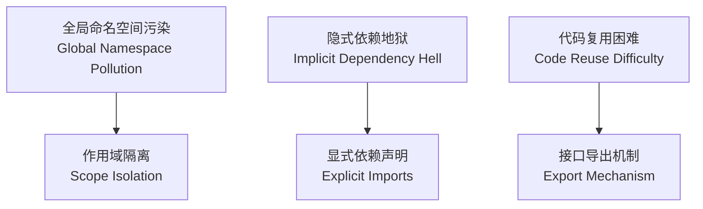
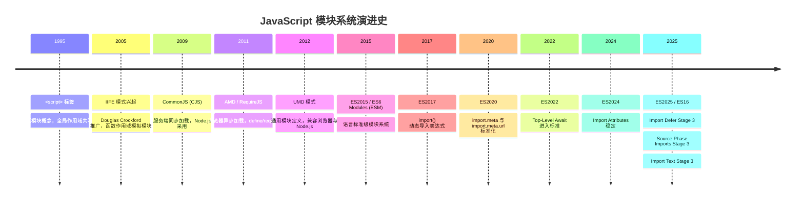
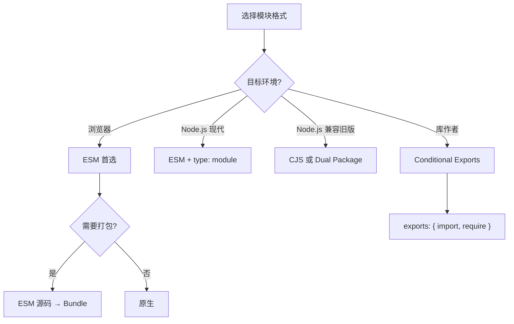
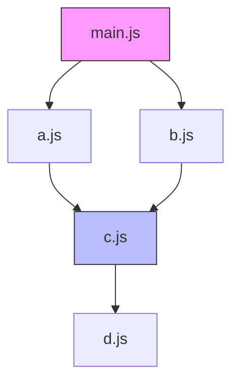

# 模块系统综述 (Module System Overview)

> **形式化定义**：模块系统（Module System）是编程语言中用于实现**信息隐藏（Information Hiding）**、**命名空间隔离（Namespace Isolation）**与**依赖显式化（Explicit Dependency Declaration）**的语法与语义机制。在 ECMAScript 的语境下，模块被定义为一段具有独立词法作用域（Lexical Scope）的代码单元，其内部绑定默认私有，仅通过显式的 `export` 声明暴露接口，通过显式的 `import` 声明引入外部依赖。
>
> 对齐版本：ECMAScript 2025 (ES16) | TypeScript 5.8–6.0 | Node.js 22+

---

## 1. 形式化定义 (Formal Definitions)

### 1.1 模块 (Module)

依据 ECMA-262 §16.2 的规范表述：

> *"A module is a collection of related code that can be reasoned about independently."*

形式化地，一个模块可表示为三元组 `M = (E, I, R)`：

- **E (Exports)**：模块向外部环境暴露的接口集合，构成模块的**契约（Contract）**。`E = {e₁, e₂, ..., eₙ}`，其中每个 `eᵢ` 为一个命名绑定（Named Binding）或默认绑定（Default Binding）。
- **I (Imports)**：模块所依赖的外部接口集合，形成模块的**依赖图（Dependency Graph）**。`I = {i₁, i₂, ..., iₘ}`，其中每个 `iⱼ` 为对另一模块导出绑定的引用。
- **R (Resolution)**：模块标识符（Module Specifier）到实际资源定位符（Resource Locator）的偏函数（Partial Function），`R: Specifier → URL | filePath`。

**公理 1（封装性，Encapsulation）**：模块 `M` 的内部实现细节对其消费者不可见，消费者仅能通过 `E` 中声明的导出绑定与模块交互。

**公理 2（复用性，Reusability）**：同一模块 `M` 可被多个消费者导入，其求值实例在单次执行上下文（Execution Context）中保持唯一（Singleton 语义，具体由宿主环境的模块缓存机制保证）。

**公理 3（依赖显式化，Explicit Dependency）**：模块的所有外部依赖必须通过声明语句显式表达，禁止隐式的全局变量依赖。

### 1.2 命名空间 (Namespace)

> **定义**：命名空间是标识符（Identifier）到绑定（Binding）的映射集合 `N: Identifier → Binding`，其作用域边界由模块的词法作用域（Lexical Scope）严格限定。

在无模块系统的早期 JavaScript 中，全局对象（Global Object）充当唯一的共享命名空间，导致**命名空间污染（Namespace Pollution）**。模块系统通过为每个模块创建独立的模块环境记录（Module Environment Record），将命名空间 `N_module` 与全局命名空间 `N_global` 解耦，从而保证：

```
∀v ∈ Variables(M), v ∉ N_global  ⟹  v 在 M 外部不可直接访问
```

### 1.3 依赖 (Dependency)

> **定义**：依赖是模块之间的一种有向关系。若模块 `A` 的求值或实例化需要模块 `B` 的导出绑定，则称 `A` **依赖（Depends on）** `B`，记作 `A → B`。

模块的依赖集合构成**模块图（Module Graph）** `G = (V, E)`，其中：

- 顶点集 `V` 为系统中的所有模块；
- 边集 `E ⊆ V × V` 为模块间的依赖关系；
- 若存在环路 `M₁ → M₂ → ... → M₁`，则称系统存在**循环依赖（Cyclic Dependency）**。

---

## 2. 为什么需要模块 (Why Modules Exist)

在模块化机制诞生之前，JavaScript 代码主要依赖 `<script>` 标签按序加载，面临三大核心问题：



### 2.1 封装性（Encapsulation）

模块将内部状态与实现细节隐藏于词法作用域之内，仅暴露受控的公共接口。这种**信息隐藏（Information Hiding）**原则降低了系统各组件之间的耦合度（Coupling），使得模块可以独立演进而不破坏外部消费者。

### 2.2 复用性（Reusability）

模块化的代码单元可在不同项目、不同上下文中被重复引用。通过版本化的包管理器（如 npm、pnpm、yarn），开发者能够共享与复用经过验证的代码库，避免重复造轮子。

### 2.3 依赖管理（Dependency Management）

显式的依赖声明使得工具链（Bundler、Type Checker、Linter）能够在**编译时（Compile-Time）**或**解析时（Parse-Time）**构建完整的模块图，从而支持：

- 确定性构建（Deterministic Build）
- 死代码消除（Dead Code Elimination / Tree Shaking）
- 循环依赖检测（Cyclic Dependency Detection）
- 自动化依赖升级与漏洞扫描

---

## 3. 历史演进 (Historical Evolution)

JavaScript 模块系统的演进是一部从“无模块”到“语言级标准”的漫长历程。

### 3.1 演进时间线



### 3.2 各阶段详述

**无模块时代（1995–2005）**

`<script>` 标签按序加载，所有变量与函数声明提升（Hoisting）至全局作用域。开发者只能依赖命名约定（如前缀 `myLib_`）来避免冲突。

**IIFE（Immediately Invoked Function Expression，2005）**

通过函数表达式与立即调用创建私有作用域，是最早的“模块模式”：

```javascript
const myModule = (function () {
  let privateVar = 0;
  function privateMethod() { return privateVar++; }
  return { publicMethod: privateMethod };
})();
```

**CommonJS（CJS，2009）**

为服务端 JavaScript 设计的同步模块系统：

```javascript
const fs = require("fs");
module.exports.readConfig = function () { /* ... */ };
```

**AMD（Asynchronous Module Definition，2011）**

面向浏览器的异步加载方案，RequireJS 为其主要实现：

```javascript
define(["jquery"], function ($) {
  return { init: function () { /* ... */ } };
});
```

**UMD（Universal Module Definition，2012）**

一种兼容 AMD、CJS 与全局变量的“胶水”模式，旨在让库作者编写一次代码即可运行于多种环境。

**ESM（ECMAScript Modules，ES2015）**

语言级标准模块系统，核心特征为**静态结构（Static Structure）**：

```javascript
import { parse } from "node:path";
export const config = { env: "production" };
```

---

## 4. 关键概念 (Key Concepts)

### 4.1 导出（Exports）

导出是模块向外部暴露绑定的机制。ESM 支持：

- **Named Export**：`export const foo = 1;`
- **Default Export**：`export default function () {}`
- **Namespace Re-export**：`export * as ns from "./mod.js";`

### 4.2 导入（Imports）

导入是模块消费外部绑定的机制：

- **Named Import**：`import { foo } from "./mod.js";`
- **Default Import**：`import foo from "./mod.js";`
- **Namespace Import**：`import * as mod from "./mod.js";`
- **Side-effect Import**：`import "./polyfill.js";`
- **Dynamic Import**：`const mod = await import("./mod.js");`

### 4.3 模块解析（Module Resolution）

模块解析是从模块标识符（Module Specifier）到实际资源位置的映射过程。不同宿主环境采用不同的解析算法：

- **Node.js**：支持相对路径（`./`）、绝对路径（`/`）与裸指定符（bare specifier，如 `lodash`）。裸指定符通过 `node_modules` 层级查找。
- **浏览器**：仅支持相对路径与绝对 URL，不支持裸指定符（除非使用 Import Map）。
- **Deno**：支持 URL 导入（`https://deno.land/std/mod.ts`）与本地路径。

### 4.4 循环依赖（Cyclic Dependencies）

当模块图 `G` 中存在有向环时，即发生循环依赖。不同模块系统对循环依赖的处理策略截然不同：

- **CommonJS**：允许循环依赖，但由于 `require()` 在运行时执行，部分导出可能为未完成的对象（Incomplete Object）。
- **ESM**：由于依赖图在实例化阶段即已确定，循环依赖通过 **Temporal Dead Zone（TDZ）** 处理：若访问尚未完成求值的绑定，抛出 `ReferenceError`。

---

## 5. Node.js 的双模块问题（The Dual-Module Problem）

Node.js 从 v12 开始实验性支持 ESM，v14 后稳定，但遗留了庞大的 CJS 生态系统。这导致所谓的**双模块问题（Dual-Module Problem）**：

### 5.1 核心矛盾

1. **同步 vs 异步加载**：CJS 的 `require()` 是同步的；ESM 的静态 `import` 在求值阶段是异步流程的（尽管语法看起来像同步）。这导致 `require()` 无法加载 ESM 模块（ESM 不允许被同步求值）。
2. **文件扩展名歧义**：`.js` 文件既可能是 CJS 也可能是 ESM，取决于 `package.json` 中的 `"type"` 字段。
3. **互操作复杂性**：`import` 可以加载 CJS（由 Node.js 运行时进行包装转换），但 CJS 无法 `require()` ESM。
4. **工具链负担**：打包器（Webpack、Rollup、esbuild）、类型检查器（tsc）、测试框架（Vitest、Jest）均需同时理解两套语义。

### 5.2 Node.js 的解决方案

- **`"type": "module"` / `"type": "commonjs"`**：在 `package.json` 中显式声明默认模块格式。
- **`.mjs` 与 `.cjs`**：文件扩展名强制指定模块格式，绕过 `package.json` 的 `type` 字段。
- **`createRequire`**：在 ESM 中创建 CJS 的 `require` 函数，用于加载遗留 CJS 模块。
- **Conditional Exports（`exports` 字段）**：支持**双包（Dual Package）**模式，使同一个 npm 包可以同时为 ESM 与 CJS 消费者提供对应入口。

---

## 6. 模块格式对比 (Comparison Table)

### 6.1 特性矩阵：IIFE vs AMD vs CJS vs UMD vs ESM

| 特性 | IIFE | AMD | CommonJS | UMD | ESM |
|------|------|-----|----------|-----|-----|
| 作用域隔离 | ✅ 函数作用域 | ✅ 函数作用域 | ✅ 文件作用域 | ✅ 视环境而定 | ✅ 模块作用域 |
| 依赖显式声明 | ❌ 隐式全局 | ✅ `define(deps)` | ✅ `require()` | ⚠️ 视环境而定 | ✅ `import` |
| 异步加载 | ❌ | ✅ | ❌ | ⚠️ | ✅ (浏览器原生并行) |
| 浏览器原生支持 | ✅ (script 标签) | ❌ (需 RequireJS) | ❌ (需 Browserify) | ❌ (需打包) | ✅ `<script type="module">` |
| Node.js 原生支持 | ✅ | ❌ | ✅ | ✅ | ✅ (12+ 实验, 14+ 稳定) |
| 静态分析友好 | ❌ | ⚠️ | ❌ | ❌ | ✅ |
| Tree Shaking | ❌ | ❌ | ❌ | ❌ | ✅ |
| 循环依赖处理 | N/A | ⚠️ 有限 | ⚠️ 部分导出 | ⚠️ 视环境而定 | ✅ TDZ 语义明确 |
| Top-Level Await | N/A | N/A | ❌ | ❌ | ✅ |
| 动态条件加载 | ❌ | ✅ | ✅ | ✅ | ⚠️ 需 `import()` |

### 6.2 各模块格式的关系与定位

| 格式 | 设计目标 | 与 ESM 的关系 | 现状 |
|------|---------|-------------|------|
| IIFE | 浏览器作用域隔离 | 被 ESM 完全取代 | 遗留代码 / CDN 极小脚本 |
| AMD | 浏览器异步加载 | 被 ESM 动态 `import()` 取代 | 基本淘汰 |
| CommonJS | 服务端同步加载 | 与 ESM 共存，逐步迁移 | Node.js 核心生态，大量 npm 包 |
| UMD | 通用封装（浏览器+Node） | 过渡方案，被 ESM 取代 | 库打包输出格式 |
| ESM | 语言标准模块 | 未来唯一标准 | 现代开发首选 |

---

## 7. 思维表征与机制图解 (Mental Models & Diagrams)

### 7.1 模块系统决策树



### 7.2 模块图拓扑示例



---

## 8. 权威参考 (References)

| 来源 | 链接 | 相关章节 |
|------|------|---------|
| ECMA-262 | tc39.es/ecma262 | §16.2 Modules |
| Node.js ESM | nodejs.org/api/esm.html | ESM 完整文档 |
| Node.js CJS | nodejs.org/api/modules.html | CJS 完整文档 |
| TypeScript Handbook | typescriptlang.org/docs | Modules |
| MDN | developer.mozilla.org | JavaScript Modules |

---

**参考规范**：ECMA-262 §16.2 | Node.js Modules Documentation | TypeScript Handbook: Modules
