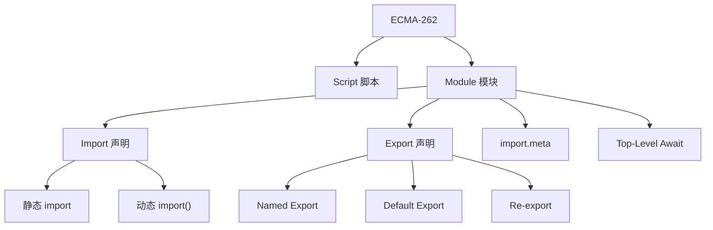
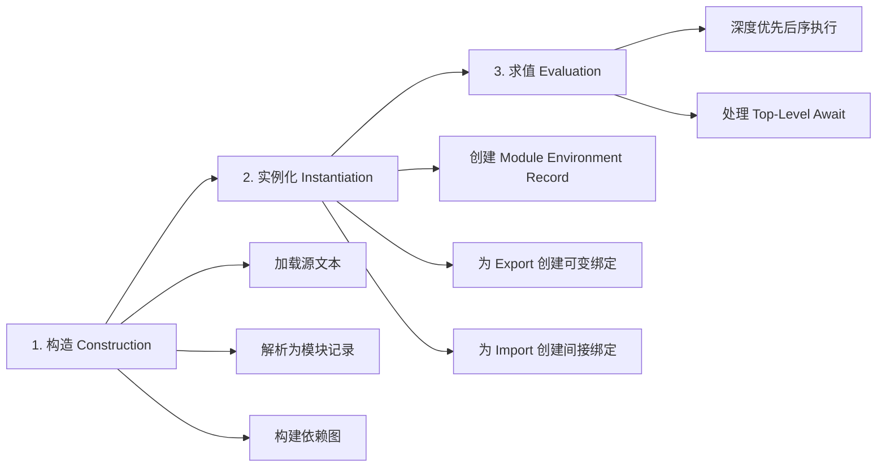
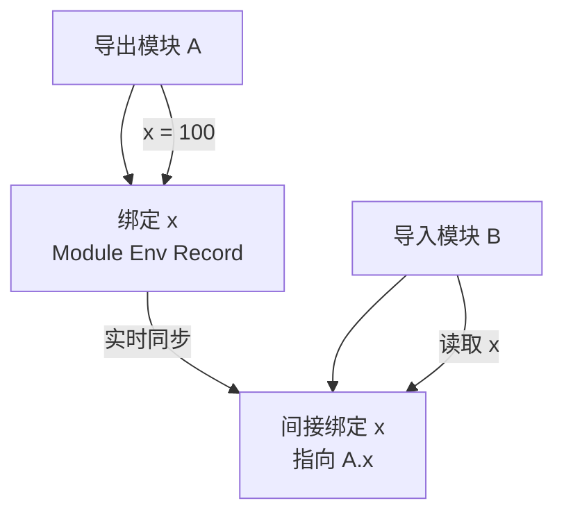
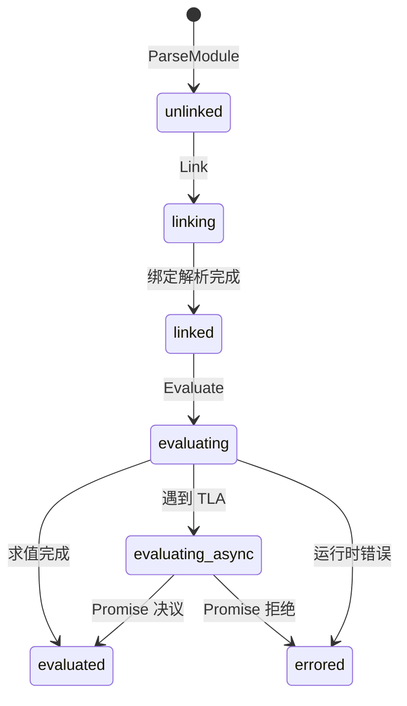
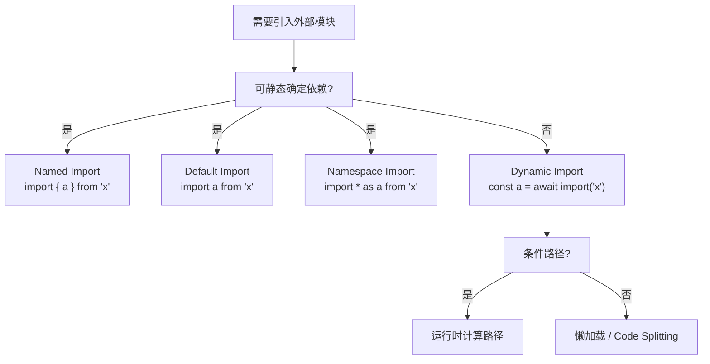

# ESM 深度解析

> **形式化定义**：ECMAScript Modules（ESM）是 ECMA-262 §16.2 定义的静态模块系统。其形式语义核心在于：**模块依赖图（Module Graph）在解析阶段（Parse Phase）即可完全确定**，所有 `import` 和 `export` 声明必须位于模块的顶层作用域（Top-Level），且模块标识符（Module Specifier）必须为字符串字面量（String Literal），从而保证编译器/引擎在不执行代码的前提下构建完整的模块拓扑结构。
>
> 对齐版本：ECMAScript 2025 (ES16) | TypeScript 5.8–6.0 | Node.js 22+

---

## 1. 概念定义 (Concept Definition)

### 1.1 形式化定义

ECMA-262 §16.2.1 定义了模块记录（Module Record）及其状态机：

> *"A Module Record encapsulates information about a single module's imports and exports."* — ECMA-262 §16.2.1

ESM 的静态结构约束（Static Structure Constraints）：

1. **位置约束**：`import`/`export` 声明必须出现在模块体的顶层（Top-Level），不能嵌套于函数、块级作用域或控制流语句中。
2. **标识符约束**：`import` 的模块指定符（Module Specifier）必须是字符串字面量，不能是运行时计算的表达式。
3. **绑定约束**：`export` 导出的是**绑定（Binding）**而非值，导入方持有对该绑定的间接引用。

### 1.2 静态结构的语法边界

```mermaid
graph TD
    A[ESM 静态结构] --> B[编译时确定]
    A --> C[运行时不可变]
    B --> D[依赖图构建]
    B --> E[Tree Shaking 基础]
    C --> F[禁止条件 import]
    C --> G[禁止动态路径]

    D --> H[并行下载]
    E --> I[Dead Code Elimination]
    F --> J[必须使用 import()]
    G --> K[路径必须为字符串字面量]
```

### 1.3 Live Bindings 的本质

传统模块系统（如 CJS）导出的是**值的拷贝（Value Copy）**。ESM 导出的是**绑定的引用（Binding Reference）**，ECMA-262 称之为 **Live Binding**。

**形式化表述**：设模块 `A` 导出绑定 `x`，模块 `B` 导入 `x`。若 `A` 中执行 `x = newValue`，则 `B` 中访问 `x` 得到的值为 `newValue`，而非导入时刻的旧值。该语义由模块环境记录（Module Environment Record）的间接绑定机制实现。

---

## 2. 属性与特征 (Properties & Characteristics)

### 2.1 ESM 核心特性矩阵

| 特性 | 说明 | 规范依据 | 运行时影响 |
|------|------|---------|-----------|
| 静态依赖图 | 解析时即可构建完整模块图 | ECMA-262 §16.2.1 | 支持预加载、预编译 |
| Live Bindings | 导出的是绑定引用，非值拷贝 | ECMA-262 §16.2.1.4 | 导入方观察到导出方的实时值 |
| 隐式严格模式 | 模块体自动处于严格模式 | ECMA-262 §16.2.1 | 无 with、无隐式全局变量 |
| 顶层作用域隔离 | 模块顶层不是全局作用域 | ECMA-262 §16.2 | this 为 undefined |
| Top-Level Await | 模块顶层可使用 await | ES2022 | 模块变为异步，影响父模块求值 |
| Import Attributes | with { type: "json" } | ES2025 | 控制模块加载方式 |

### 2.2 ESM vs CJS 真值表

| 行为 | ESM | CJS | 说明 |
|------|-----|-----|------|
| export 在函数内 | 语法错误 | N/A | ESM 强制顶层 |
| import 动态路径 | 语法错误 | 支持 | ESM 需用 import() |
| 导出值被重新赋值 | Live | Stale | ESM 绑定实时同步 |
| 模块级 this | undefined | module.exports | ESM 无模块对象 |
| 条件加载 | import() | require() | ESM 动态导入返回 Promise |
| 同步加载 | 否 | 支持 | ESM 评估是异步流程 |

---

## 3. 关系分析 (Relationship Analysis)

### 3.1 ESM 在规范中的位置



### 3.2 ESM 与运行时环境的关系

| 运行时 | ESM 支持 | 特殊行为 | 备注 |
|--------|---------|---------|------|
| 浏览器 | 原生 script type="module" | CORS 严格、MIME 类型必须为 JS | 不支持裸指定符 |
| Node.js | .mjs / type: "module" | import.meta.url 为 file:// URL | 支持裸指定符（npm 包） |
| Deno | 原生 ESM | URL 导入、权限模型 | 无 node_modules |
| Bun | 原生 ESM | 兼容 Node.js ESM | 性能优化 |
| TypeScript | 编译为 ESM/CJS | module: "NodeNext" | 类型解析独立于运行时 |

---

## 4. 机制解释 (Mechanism Explanation)

### 4.1 ESM 的三阶段生命周期

ECMA-262 明确定义了 ESM 从加载到执行的三个阶段：



**阶段详解**：

1. **构造（Construction）**：引擎通过网络或文件系统获取模块源文本，调用 ParseModule 抽象操作生成模块记录（Module Record），并递归处理所有 import 声明构建模块图。

2. **实例化（Instantiation）**：为每个模块创建模块环境记录（Module Environment Record）。对于每个 export 声明，创建一个新的可变绑定（Mutable Binding）；对于每个 import 声明，创建一个指向被导入模块对应导出的**间接绑定（Indirect Binding）**。

3. **求值（Evaluation）**：按深度优先后序（Post-Order DFS）遍历模块图执行模块体代码。若模块包含 Top-Level Await，求值过程可挂起（Suspend），等待 Promise 决议后继续。

### 4.2 Live Bindings 的实现机制



**机制说明**：当模块 `B` 导入模块 `A` 的 `x` 时，`B` 的环境记录中并不存储 `x` 的值，而是存储一个**目标引用（Target Reference）**，指向 `A` 的环境记录中的 `x` 绑定。因此每次 `B` 访问 `x`，引擎都会解引用到 `A` 的当前值。

---

## 5. 论证分析 (Argumentation Analysis)

### 5.1 Top-Level Await 的 Trade-off

ES2022 引入的 Top-Level Await（TLA）允许在模块顶层使用 await 关键字。

**收益**：
- 模块初始化可自然地等待异步资源（如配置文件加载、数据库连接）
- 消除立即执行异步函数表达式（IIAFE）的样板代码

**代价**：
- 引入 TLA 的模块成为**异步模块（Async Module）**，其父模块必须等待其求值完成
- 阻塞模块图的求值链，可能增加应用启动时间
- 循环依赖中包含 TLA 时语义复杂

### 5.2 Import Attributes (with { type: "json" })

ES2025 稳定的 Import Attributes 允许在导入时附加元数据：

```javascript
import config from "./config.json" with { type: "json" };
```

**设计动机**：
- JSON 模块的加载需要引擎明确知道目标类型，以决定解析策略
- 防止**MIME 类型混淆攻击（MIME Type Confusion Attack）**：若服务器返回非预期的 JS 代码但客户端按 JSON 解析，可能产生安全漏洞

**语义要点**：Import Attributes 是**不透明的（Opaque）**——引擎检查其合法性，但不将其传递给被导入模块。与之对比，旧的 Import Assertions（assert { type: "json" }）已被废弃。

### 5.3 Source Phase Imports（Stage 3）

TC39 Stage 3 提案引入**源阶段导入（Source Phase Imports）**，允许导入模块的源对象而非实例化后的模块：

```javascript
import source modSource from "./mod.wasm";
// modSource 是一个 WebAssembly.Module 对象
```

**意义**：WebAssembly 模块需要先编译为 WebAssembly.Module，再实例化为 WebAssembly.Instance。Source Phase Imports 让 JS 能够获取中间阶段的模块对象，实现更精细的 WASM 生命周期控制。

---

## 6. 形式证明 (Formal Proof)

### 6.1 公理化基础

**公理 7（静态确定性）**：ESM 的模块图 G = (V, E) 在解析阶段即可完全确定，不依赖于运行时状态。

**公理 8（绑定实时性）**：若模块 A 的导出绑定 b 被模块 B 导入，则 B 对 b 的每次访问都等价于 A 对 b 的当前访问。

**公理 9（求值顺序性）**：模块图的求值遵循深度优先后序遍历，确保对于任意边 (u, v) 属于 E，v 在 u 之前完成求值。

### 6.2 定理与证明

**定理 3（Live Binding 的传递一致性）**：若模块 A 导出 x，模块 B 导入并重新导出 x，模块 C 从 B 导入 x，则 C 观察到的 x 值与 A 中的 x 实时一致。

*证明*：A 的 export 创建绑定 x_A。B 的 import 创建指向 x_A 的间接绑定 x_B。B 的 export 将 x_B 导出，创建绑定 x_B'。C 的 import 创建指向 x_B' 的间接绑定 x_C。由于间接绑定的解引用是传递的，x_C 最终解引用至 x_A。∎

**定理 4（TLA 的异步传播性）**：若模块 M 包含 Top-Level Await，则任何直接或间接导入 M 的模块的求值都会被延迟，直到 M 的 TLA Promise 决议。

*证明*：ECMA-262 规定，模块求值时若遇到 Await 表达式，引擎创建一个新的 Promise 并将模块的求值状态设为 evaluating-async。父模块在调用 InnerModuleEvaluation 时，会等待子模块的求值 Promise 决议后才继续。该行为递归传播至所有祖先模块。∎

---

## 7. 实例示例 (Examples)

### 7.1 Live Bindings 正例

```javascript
// counter.js
export let count = 0;
export function increment() { count++; }

// main.js
import { count, increment } from "./counter.js";
console.log(count); // 0
increment();
console.log(count); // 1 — Live Binding 实时反映变化
```

### 7.2 反例：试图在函数内使用 import

```javascript
function loadModule() {
  import { foo } from "./foo.js"; // SyntaxError
}
```

**正确做法**：使用动态 import()：

```javascript
async function loadModule() {
  const { foo } = await import("./foo.js"); // 正确
}
```

### 7.3 Import Attributes 使用

```javascript
// ES2025 语法
import data from "./data.json" with { type: "json" };

// 旧语法（已废弃）
// import data from "./data.json" assert { type: "json" };
```

### 7.4 Import Defer（Stage 3，ES2027 预期）

```javascript
// 延迟导入：模块在后台加载，首次访问绑定时才阻塞等待
import defer * as heavy from "./heavy-computation.js";

// heavy 对象立即可用，但内部绑定在首次访问时才保证解析完成
heavy.compute(); // 若尚未加载完成，此处阻塞
```

### 7.5 Import Text（Stage 3）

```javascript
// 直接导入文件内容为字符串
import text from "./shader.glsl" with { type: "text" };
console.log(text); // GLSL 源码字符串
```

---

## 8. 权威参考 (References)

| 来源 | 链接 | 相关章节 |
|------|------|---------|
| ECMA-262 | tc39.es/ecma262 | §16.2 Modules |
| TC39: Import Attributes | tc39.es/proposal-import-attributes | ES2025 |
| TC39: Source Phase Imports | tc39.es/proposal-source-phase-imports | Stage 3 |
| TC39: Import Defer | tc39.es/proposal-import-defer | Stage 3 |
| Node.js ESM | nodejs.org/api/esm.html | ESM 文档 |
| V8 Blog | v8.dev/features/modules | ESM 实现 |

---

## 9. 思维表征 (Mental Representations)

### 9.1 ESM 生命周期状态机



### 9.2 导入类型决策树



---

## 10. 版本演进 (Version Evolution)

### 10.1 ESM 特性演进表

| 特性 | 提案 | ECMAScript 版本 | Node.js 支持 | 浏览器支持 |
|------|------|----------------|-------------|-----------|
| import/export | 语言标准 | ES2015 | 12+ (实验), 14+ (稳定) | Chrome 61+ |
| 动态 import() | 语言标准 | ES2020 | 12+ | Chrome 63+ |
| import.meta | 语言标准 | ES2020 | 12+ | Chrome 64+ |
| import.meta.url | 语言标准 | ES2020 | 12+ | Chrome 64+ |
| Top-Level Await | 语言标准 | ES2022 | 14+ | Chrome 89+ |
| Import Attributes (with) | TC39 提案 | ES2025 | 22+ | Chrome 123+ |
| Import Defer | Stage 3 | ES2027 (预计) | — | — |
| Import Text | Stage 3 | ES2027 (预计) | — | — |
| Source Phase Imports | Stage 3 | ES2027 (预计) | — | — |

### 10.2 运行时差异矩阵

| 特性 | Node.js 22 | Deno 2.x | Bun 1.1+ | Chrome 120+ |
|------|-----------|----------|----------|-------------|
| ESM 裸指定符 | 支持 (package.json) | 支持 (URL) | 支持 | 否 |
| import.meta.url | file:// | file:// / https:// | file:// | 文档 URL |
| import.meta.resolve | 支持 | 支持 | 支持 | 否 |
| import.meta.main | 否 | 支持 | 支持 | N/A |
| JSON 模块 (assert) | 废弃 | 支持 | 支持 | 否 |
| JSON 模块 (with) | 支持 | 支持 | 支持 | 否 |
| WASM 模块导入 | 实验 | 支持 | 支持 | 实验 |

---

**参考规范**：ECMA-262 §16.2 | ES2022 Top-Level Await | ES2025 Import Attributes | TC39 Stage 3 Proposals
