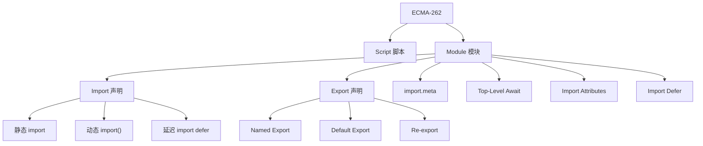
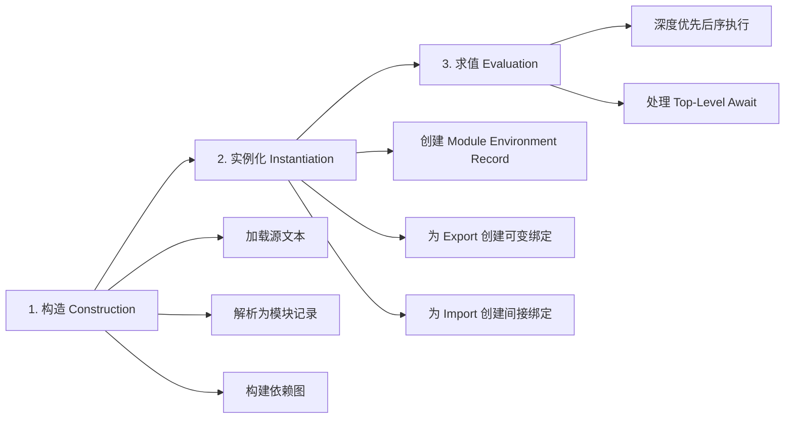
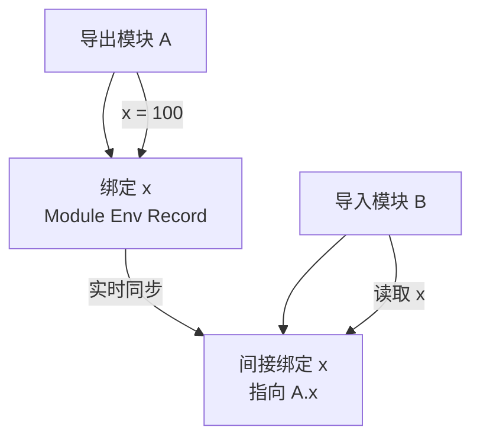
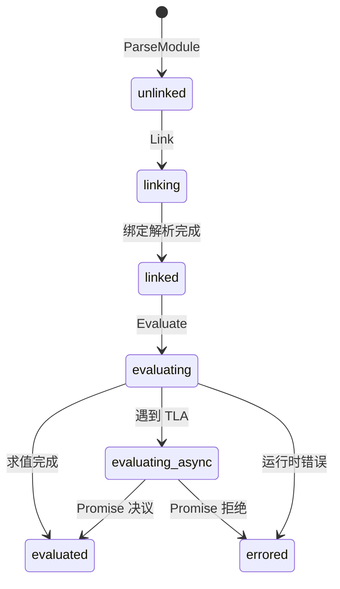
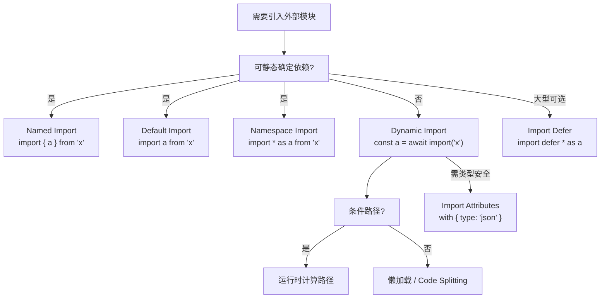

# ESM 深度解析 (ESM Deep Dive)

> **形式化定义**：ECMAScript Modules（ESM）是 ECMA-262 §16.2 定义的静态模块系统。其形式语义核心在于：**模块依赖图（Module Graph）在解析阶段（Parse Phase）即可完全确定**，所有 `import` 和 `export` 声明必须位于模块的顶层作用域（Top-Level），且模块标识符（Module Specifier）必须为字符串字面量（String Literal），从而保证编译器/引擎在不执行代码的前提下构建完整的模块拓扑结构。
>
> 对齐版本：ECMAScript 2025 (ES16) | TypeScript 5.8–6.0 | Node.js 22+ | Deno 2.7 | Bun 1.3

---

## 1. 概念定义 (Concept Definition)

### 1.1 形式化定义

ECMA-262 §16.2.1 定义了模块记录（Module Record）及其状态机：

> *"A Module Record encapsulates information about a single module's imports and exports."* — ECMA-262 §16.2.1

ESM 的静态结构约束（Static Structure Constraints）：

1. **位置约束**：`import`/`export` 声明必须出现在模块体的顶层（Top-Level），不能嵌套于函数、块级作用域或控制流语句中。
2. **标识符约束**：`import` 的模块指定符（Module Specifier）必须是字符串字面量，不能是运行时计算的表达式。
3. **绑定约束**：`export` 导出的是**绑定（Binding）**而非值，导入方持有对该绑定的间接引用。

形式化地，一个 ESM 模块记录可描述为四元组 $M = (\text{AST}, \text{Imports}, \text{Exports}, \text{State})$：

$$
\text{Imports}(M) = \{(s_1, n_1), (s_2, n_2), \ldots, (s_k, n_k)\}
$$

其中 $s_i$ 为模块指定符，$n_i$ 为导入的绑定名称集合。

$$
\text{Exports}(M) = \{(n_1, b_1), (n_2, b_2), \ldots, (n_m, b_m)\}
$$

其中 $n_j$ 为导出名称，$b_j$ 为对应的环境记录绑定。

### 1.2 静态结构的语法边界

```mermaid
graph TD
    A[ESM 静态结构] --> B[编译时确定]
    A --> C[运行时不可变]
    B --> D[依赖图构建]
    B --> E[Tree Shaking 基础]
    C --> F[禁止条件 import]
    C --> G[禁止动态路径]

    D --> H[并行下载]
    E --> I[Dead Code Elimination]
    F --> J[必须使用 import()]
    G --> K[路径必须为字符串字面量]
```

**静态结构的数学直觉**：设模块图为 $G = (V, E)$，其中顶点 $V$ 是模块，边 $E$ 是导入关系。在 ESM 中，$G$ 可以在**不执行任何模块代码**的情况下被完全构造出来。这意味着：

$$
\forall M \in V,\; \text{Imports}(M) \text{ 可从 } M \text{ 的 AST 静态提取}
$$

这与 CJS 形成鲜明对比——在 CJS 中，$G$ 只能在运行时通过执行 `require()` 调用才能逐步确定。

### 1.3 Live Bindings 的本质

传统模块系统（如 CJS）导出的是**值的拷贝（Value Copy）**。ESM 导出的是**绑定的引用（Binding Reference）**，ECMA-262 称之为 **Live Binding**。

**形式化表述**：设模块 $A$ 导出绑定 $x$，模块 $B$ 导入 $x$。若 $A$ 中执行 $x = \text{newValue}$，则 $B$ 中访问 $x$ 得到的值为 $\text{newValue}$，而非导入时刻的旧值。该语义由模块环境记录（Module Environment Record）的间接绑定机制实现。

$$
\text{Let } x_A \text{ be binding in } A,\; x_B \text{ be import in } B \\
x_B \mapsto \text{IndirectBinding}(x_A) \\
\forall t > t_0,\; \text{read}(x_B, t) = \text{read}(x_A, t)
$$

**类比理解**：Live Binding 就像两个办公室共享同一块电子白板。当 A 办公室修改白板上的数字时，B 办公室看到的数字会**实时同步更新**，而不是看到 A 办公室最初抄写给自己的纸质副本。

---

## 2. 属性与特征 (Properties & Characteristics)

### 2.1 ESM 核心特性矩阵

| 特性 | 说明 | 规范依据 | 运行时影响 |
|------|------|---------|-----------|
| 静态依赖图 | 解析时即可构建完整模块图 | ECMA-262 §16.2.1 | 支持预加载、预编译 |
| Live Bindings | 导出的是绑定引用，非值拷贝 | ECMA-262 §16.2.1.4 | 导入方观察到导出方的实时值 |
| 隐式严格模式 | 模块体自动处于严格模式 | ECMA-262 §16.2.1 | 无 with、无隐式全局变量 |
| 顶层作用域隔离 | 模块顶层不是全局作用域 | ECMA-262 §16.2 | this 为 undefined |
| Top-Level Await | 模块顶层可使用 await | ES2022 | 模块变为异步，影响父模块求值 |
| Import Attributes | with { type: "json" } | ES2025 | 控制模块加载方式 |
| Import Defer | import defer * as x | Stage 3 | 延迟求值，优化启动 |
| Source Phase Imports | import source x | Stage 3 | 获取模块源对象 |

### 2.2 ESM vs CJS 真值表

| 行为 | ESM | CJS | 说明 |
|------|-----|-----|------|
| export 在函数内 | 语法错误 | N/A | ESM 强制顶层 |
| import 动态路径 | 语法错误 | 支持 | ESM 需用 import() |
| 导出值被重新赋值 | Live | Stale | ESM 绑定实时同步 |
| 模块级 this | undefined | module.exports | ESM 无模块对象 |
| 条件加载 | import() | require() | ESM 动态导入返回 Promise |
| 同步加载 | 否 | 支持 | ESM 评估是异步流程 |
| 静态分析 | 完全支持 | 不支持 | 打包器可精确 Tree Shake |
| 循环依赖 TDZ | 有 | 无 | ESM 通过 TDZ 保护未初始化绑定 |

---

## 3. 关系分析 (Relationship Analysis)

### 3.1 ESM 在规范中的位置



### 3.2 ESM 与运行时环境的关系

| 运行时 | ESM 支持 | 特殊行为 | 备注 |
|--------|---------|---------|------|
| 浏览器 | 原生 script type="module" | CORS 严格、MIME 类型必须为 JS | 不支持裸指定符（需 Import Map） |
| Node.js | .mjs / type: "module" | import.meta.url 为 file:// URL | 支持裸指定符（npm 包） |
| Deno | 原生 ESM | URL 导入、权限模型 | 无 node_modules，支持 npm: 前缀 |
| Bun | 原生 ESM | 兼容 Node.js ESM，自动检测格式 | 性能优化，内置 TS 支持 |
| TypeScript | 编译为 ESM/CJS | module: "NodeNext" | 类型解析独立于运行时 |

---

## 4. 机制解释 (Mechanism Explanation)

### 4.1 ESM 的三阶段生命周期

ECMA-262 明确定义了 ESM 从加载到执行的三个阶段：



**阶段详解**：

1. **构造（Construction）**：引擎通过网络或文件系统获取模块源文本，调用 `ParseModule` 抽象操作生成模块记录（Module Record），并递归处理所有 import 声明构建模块图。

2. **实例化（Instantiation）**：为每个模块创建模块环境记录（Module Environment Record）。对于每个 export 声明，创建一个新的可变绑定（Mutable Binding）；对于每个 import 声明，创建一个指向被导入模块对应导出的**间接绑定（Indirect Binding）**。

3. **求值（Evaluation）**：按深度优先后序（Post-Order DFS）遍历模块图执行模块体代码。若模块包含 Top-Level Await，求值过程可挂起（Suspend），等待 Promise 决议后继续。

**形式化算法**：

$$
\text{EvaluateModule}(M):
\quad \text{if } M.\text{State} = \text{evaluated}: \text{ return } M.\text{EvaluationResult}
\quad \text{if } M.\text{State} = \text{evaluating}: \text{ throw SyntaxError (cycle)}
\quad M.\text{State} \leftarrow \text{evaluating}
\quad \text{for each } D \in \text{Dependencies}(M):
\quad \quad \text{EvaluateModule}(D)
\quad \text{result} \leftarrow \text{ExecuteModuleBody}(M)
\quad M.\text{State} \leftarrow \text{evaluated}
\quad \text{return result}
$$

### 4.2 Live Bindings 的实现机制



**机制说明**：当模块 $B$ 导入模块 $A$ 的 $x$ 时，$B$ 的环境记录中并不存储 $x$ 的值，而是存储一个**目标引用（Target Reference）**，指向 $A$ 的环境记录中的 $x$ 绑定。因此每次 $B$ 访问 $x$，引擎都会解引用到 $A$ 的当前值。

**数学表述**：

$$
\text{Env}_B(x) = \text{IndirectReference}(\text{Env}_A, x)
$$

$$
\text{GetValue}(\text{Env}_B(x)) = \text{GetValue}(\text{Env}_A(x)) = x_A^{\text{current}}
$$

---

## 5. Import Attributes 深度解析（ES2025 标准）

### 5.1 设计动机与语义

Import Attributes 允许在导入时附加元数据：

```javascript
import config from "./config.json" with { type: "json" };
```

**设计动机**：
- JSON 模块的加载需要引擎明确知道目标类型，以决定解析策略
- 防止**MIME 类型混淆攻击（MIME Type Confusion Attack）**：若服务器返回非预期的 JS 代码但客户端按 JSON 解析，可能产生安全漏洞
- 为未来的模块类型（CSS、WASM、文本）提供可扩展的声明机制

**核心语义**：Import Attributes 是**不透明的（Opaque）**——引擎检查其合法性，但不将其传递给被导入模块。与之对比，旧的 Import Assertions（`assert { type: "json" }`）已被废弃。

**形式化定义**：设导入属性集合为 $\mathcal{A} = \{(k_1, v_1), \ldots, (k_n, v_n)\}$，则模块解析函数扩展为：

$$
\text{Resolve}(s, c, \mathcal{A}) = \begin{cases}
\text{ParseAsJSON}(\text{Load}(s)) & \text{if } (\text{type}, \text{json}) \in \mathcal{A} \\
\text{ParseAsModule}(\text{Load}(s)) & \text{otherwise}
\end{cases}
$$

### 5.2 Import Attributes vs Import Assertions 历史演变

| 特性 | Import Assertions (ES2022 实验) | Import Attributes (ES2025 标准) |
|------|--------------------------------|--------------------------------|
| 语法 | `assert { type: 'json' }` | `with { type: 'json' }` |
| 语义 | 运行时断言 | 宿主提示（hint） |
| 重复导入一致性 | 要求相同 | 要求相同 |
| 浏览器支持 | Chrome 91+ (已废弃) | Chrome 123+, Safari 17+, Node 20+ |
| 未来扩展性 | 低（assert 语义受限） | 高（任意键值提示） |
| TypeScript 支持 | 5.0+ | 5.3+ |

### 5.3 JSON 模块安全加载实战

```typescript
// config-loader.ts —— 使用 Import Attributes 安全加载配置

// ✅ 正例：使用 with { type: "json" } 明确声明模块类型
import appConfig from './config/app.json' with { type: 'json' };

// TypeScript 5.3+ 会自动推断 JSON 结构类型
interface AppConfig {
  name: string;
  version: string;
  features: {
    darkMode: boolean;
    analytics: boolean;
    betaAccess: string[];
  };
}

// appConfig 被推断为具体类型，而非 any
export function getFeatureFlag<K extends keyof AppConfig['features']>(
  flag: K
): AppConfig['features'][K] {
  return appConfig.features[flag];
}

// 动态导入 + Import Attributes（用于条件加载）
export async function loadLocale(locale: string): Promise<Record<string, string>> {
  const mod = await import(`./locales/${locale}.json`, {
    with: { type: 'json' }
  });
  return mod.default;
}

// ❌ 反例：不使用 import attributes（旧做法，不安全）
// import appConfig from './config/app.json'; 
// 风险：如果服务器被入侵返回恶意 JS，此导入可能执行任意代码
```

### 5.4 CSS 模块与 WASM 模块导入

```typescript
// css-modules.ts —— Chrome 123+ 支持 CSS Module Scripts
import sheet from './styles.css' with { type: 'css' };

// sheet 是 CSSStyleSheet 实例
document.adoptedStyleSheets = [...document.adoptedStyleSheets, sheet];

// WASM 模块导入（Node.js 22+ 实验性）
import wasmModule from './math.wasm' with { type: 'webassembly' };

const instance = await WebAssembly.instantiate(wasmModule, {
  env: { memory: new WebAssembly.Memory({ initial: 1 }) }
});

console.log(instance.exports.add(1, 2)); // 3
```

---

## 6. Import Defer 深度解析（Stage 3，预计 ES2027）

### 6.1 设计动机

Import Defer 允许模块的**命名空间对象**立即可用，但内部模块延迟加载：

```javascript
import defer * as heavy from "./heavy-computation.js";

// heavy 对象立即可用，但内部绑定在首次访问时才保证解析完成
heavy.compute(); // 若尚未加载完成，此处阻塞
```

**用例分析**：

| 场景 | 收益 |
|------|------|
| 大型图表库 | 减少首屏初始化 50%+ |
| 富文本编辑器 | 按需加载编辑器核心 |
| 多语言包 | 仅加载当前语言 |
| 大型数学/ML 库 | 后台预编译，首次调用时可用 |

### 6.2 语义模型

Import Defer 引入了新的模块求值语义。设延迟导入的模块为 $M_{\text{deferred}}$，则：

$$
\text{ImportDefer}(M_{\text{deferred}}) \rightarrow \text{NamespaceProxy}
$$

该代理对象满足：

$$
\forall p \in \text{Exports}(M_{\text{deferred}}),\;
\text{Get}(\text{NamespaceProxy}, p) = \begin{cases}
\text{Evaluate}(M_{\text{deferred}}) \text{ then return } p & \text{if not yet evaluated} \\
\text{return } p & \text{otherwise}
\end{cases}
$$

### 6.3 与动态导入的选型对比

```typescript
// 场景 A：延迟加载大型库，但需立即暴露 API 签名
import defer * as HeavyLib from './heavy-lib.js';
// ✅ 命名空间立即可用，调用时自动等待
HeavyLib.compute(); // 首次调用触发实际加载

// 场景 B：条件加载（用户点击后才需要）
async function onUserClick() {
  const { renderModal } = await import('./modal.js');
  renderModal();
}
// ✅ 动态导入更灵活，完全不加载直到触发条件

// 场景 C：预加载但延迟执行
import defer * as ReportGenerator from './report-generator.js';
// 浏览器可在空闲时预取 report-generator.js
// 用户点击"生成报告"时直接调用
async function onGenerateClick() {
  const report = await ReportGenerator.run(); // 若已预加载则立即返回
  return report;
}
```

**决策矩阵**：

| 策略 | 语法 | 加载时机 | 命名空间可用性 | 适用场景 |
|------|------|---------|--------------|---------|
| 静态导入 | `import { x } from '...'` | 解析阶段 | 立即 | 必需依赖 |
| 动态导入 | `await import('...')` | 执行阶段 | Promise 决议后 | 条件/懒加载 |
| Import Defer | `import defer * as x` | 延迟加载 | 立即（代理） | 大型可选依赖 |

---

## 7. Source Phase Imports（Stage 3）

TC39 Stage 3 提案引入**源阶段导入（Source Phase Imports）**，允许导入模块的源对象而非实例化后的模块：

```typescript
// 导入 WASM 模块的源对象（WebAssembly.Module）
import source modSource from "./mod.wasm";

// modSource 是一个 WebAssembly.Module 对象
const instance = await WebAssembly.instantiate(modSource, imports);
```

**意义**：WebAssembly 模块需要先编译为 `WebAssembly.Module`，再实例化为 `WebAssembly.Instance`。Source Phase Imports 让 JS 能够获取中间阶段的模块对象，实现更精细的 WASM 生命周期控制。

```typescript
// 多实例化同一 WASM 模块（复用编译结果）
import source wasmSource from './crypto.wasm';

// 创建两个独立实例，共享同一个编译后的 Module
const instance1 = await WebAssembly.instantiate(wasmSource, { env: { memory: mem1 } });
const instance2 = await WebAssembly.instantiate(wasmSource, { env: { memory: mem2 } });
```

---

## 8. Import Maps 与模块加载器钩子

### 8.1 浏览器 Import Map

Import Map 允许浏览器将裸指定符（bare specifier）映射到实际 URL：

```html
<script type="importmap">
{
  "imports": {
    "react": "https://esm.sh/react@19",
    "react-dom/client": "https://esm.sh/react-dom@19/client",
    "lodash/": "https://cdn.jsdelivr.net/npm/lodash-es/",
    "#utils/": "/src/utils/"
  },
  "scopes": {
    "/legacy/": {
      "react": "https://esm.sh/react@18"
    }
  }
}
</script>
```

**映射规则**：

$$
\text{Map}(s) = \begin{cases}
\text{imports}[s] & \text{if exact match} \\
\text{imports}[p] + s_{\text{suffix}} & \text{if } s \text{ starts with prefix } p \text{ and } p \text{ ends with } / \\
s & \text{otherwise}
\end{cases}
$$

### 8.2 Node.js 模块自定义钩子（Module Customization Hooks）

Node.js 20+ 支持通过 `--import` 注入自定义加载器：

```typescript
// loader.mjs —— 自定义模块加载钩子
export async function resolve(specifier, context, nextResolve) {
  // 自定义路径映射：@app/* -> ./src/*
  if (specifier.startsWith('@app/')) {
    return {
      shortCircuit: true,
      url: new URL(specifier.replace('@app/', './src/'), context.parentURL).href,
    };
  }
  
  // 自定义路径映射：@test/* -> ./test/*
  if (specifier.startsWith('@test/')) {
    return {
      shortCircuit: true,
      url: new URL(specifier.replace('@test/', './test/'), context.parentURL).href,
    };
  }
  
  return nextResolve(specifier, context);
}

export async function load(url, context, nextLoad) {
  // 对 .ts 文件进行源码转换
  if (url.endsWith('.ts')) {
    const result = await nextLoad(url, context);
    // 注入运行时版本信息
    const header = `// Generated for ${url}\n`;
    return {
      ...result,
      source: header + result.source,
    };
  }
  
  return nextLoad(url, context);
}
```

**使用方式**：

```bash
node --import ./loader.mjs app.ts
```

---

## 9. 论证分析 (Argumentation Analysis)

### 9.1 Top-Level Await 的 Trade-off

ES2022 引入的 Top-Level Await（TLA）允许在模块顶层使用 await 关键字。

**收益**：
- 模块初始化可自然地等待异步资源（如配置文件加载、数据库连接）
- 消除立即执行异步函数表达式（IIAFE）的样板代码

**代价**：
- 引入 TLA 的模块成为**异步模块（Async Module）**，其父模块必须等待其求值完成
- 阻塞模块图的求值链，可能增加应用启动时间
- 循环依赖中包含 TLA 时语义复杂

**形式化影响**：设模块 $M$ 包含 TLA，则其父模块 $P$ 的求值时间 $T_P$ 满足：

$$
T_P \geq T_M + T_{\text{await}}
$$

其中 $T_{\text{await}}$ 是 TLA 等待的异步操作耗时。

### 9.2 Import Defer 的性能模型

Import Defer 的核心价值在于优化**时间到首次交互（TTI）**。设应用有 $n$ 个模块，其中 $k$ 个为延迟加载：

$$
\text{TTI}_{\text{defer}} = \text{TTI}_{\text{static}} - \sum_{i=1}^{k} T_{\text{eval}}(M_i) \cdot P(M_i \text{ not needed immediately})
$$

即延迟加载将不需要立即使用的模块的求值时间从启动关键路径中移除。

---

## 10. 形式证明 (Formal Proof)

### 10.1 公理化基础

**公理 7（静态确定性）**：ESM 的模块图 $G = (V, E)$ 在解析阶段即可完全确定，不依赖于运行时状态。

**公理 8（绑定实时性）**：若模块 $A$ 的导出绑定 $b$ 被模块 $B$ 导入，则 $B$ 对 $b$ 的每次访问都等价于 $A$ 对 $b$ 的当前访问。

**公理 9（求值顺序性）**：模块图的求值遵循深度优先后序遍历，确保对于任意边 $(u, v) \in E$，$v$ 在 $u$ 之前完成求值。

### 10.2 定理与证明

**定理 3（Live Binding 的传递一致性）**：若模块 $A$ 导出 $x$，模块 $B$ 导入并重新导出 $x$，模块 $C$ 从 $B$ 导入 $x$，则 $C$ 观察到的 $x$ 值与 $A$ 中的 $x$ 实时一致。

*证明*：$A$ 的 export 创建绑定 $x_A$。$B$ 的 import 创建指向 $x_A$ 的间接绑定 $x_B$。$B$ 的 export 将 $x_B$ 导出，创建绑定 $x_B'$。$C$ 的 import 创建指向 $x_B'$ 的间接绑定 $x_C$。由于间接绑定的解引用是传递的，$x_C$ 最终解引用至 $x_A$。∎

**定理 4（TLA 的异步传播性）**：若模块 $M$ 包含 Top-Level Await，则任何直接或间接导入 $M$ 的模块的求值都会被延迟，直到 $M$ 的 TLA Promise 决议。

*证明*：ECMA-262 规定，模块求值时若遇到 Await 表达式，引擎创建一个新的 Promise 并将模块的求值状态设为 `evaluating-async`。父模块在调用 `InnerModuleEvaluation` 时，会等待子模块的求值 Promise 决议后才继续。该行为递归传播至所有祖先模块。∎

---

## 11. 实例示例 (Examples)

### 11.1 Live Bindings 正例

```typescript
// counter.ts
export let count = 0;
export function increment(): void { count++; }

// main.ts
import { count, increment } from "./counter.js";
console.log(count); // 0
increment();
console.log(count); // 1 — Live Binding 实时反映变化

// 正例验证：Live Binding 保证导入方看到最新值
export function getCount(): number {
  return count; // 始终返回 counter.ts 中的当前值
}
```

### 11.2 反例：试图在函数内使用 import

```typescript
// ❌ 错误：import 不能出现在块级作用域
function loadModule() {
  import { foo } from "./foo.js"; // SyntaxError: Unexpected token
}

// ✅ 正确做法：使用动态 import()
async function loadModuleCorrect(): Promise<void> {
  const { foo } = await import("./foo.js"); // 正确
  console.log(foo);
}
```

### 11.3 Import Attributes 完整实战

```typescript
// i18n-loader.ts —— 多语言配置的安全加载

// 使用 Import Attributes 加载翻译文件
type Locale = 'zh-CN' | 'en-US' | 'ja-JP';

interface TranslationFile {
  greetings: { hello: string; goodbye: string };
  errors: { notFound: string; serverError: string };
}

export async function loadTranslations(locale: Locale): Promise<TranslationFile> {
  // 动态导入 + Import Attributes 组合
  const mod = await import(`./locales/${locale}.json`, {
    with: { type: 'json' }
  });
  return mod.default as TranslationFile;
}

// 静态加载默认语言（编译时已知）
import defaultMessages from './locales/zh-CN.json' with { type: 'json' };

export function getDefaultGreeting(): string {
  return defaultMessages.greetings.hello;
}
```

### 11.4 Import Defer 实战模式

```typescript
// analytics.ts —— 延迟加载分析 SDK，不阻塞首屏
import defer * as AnalyticsSDK from './heavy-analytics-sdk.js';

export async function trackEvent(eventName: string, data?: Record<string, unknown>): Promise<void> {
  try {
    // 首次调用时自动触发 AnalyticsSDK 的实际加载
    await AnalyticsSDK.track(eventName, data);
  } catch (err) {
    // 降级：如果加载失败，静默丢弃事件
    console.warn('Analytics unavailable, event dropped:', eventName);
  }
}

export async function flushEvents(): Promise<void> {
  if (AnalyticsSDK.flush) {
    await AnalyticsSDK.flush();
  }
}
```

### 11.5 条件与动态加载实战

```typescript
// feature-loader.ts —— 基于特性标志的条件模块加载

interface FeatureFlags {
  analytics: boolean;
  payments: boolean;
  reporting: boolean;
}

// 静态导入特性标志（必需且轻量）
import { features } from './feature-flags.js';

export async function initializeFeatures(flags: FeatureFlags): Promise<void> {
  const initTasks: Promise<void>[] = [];
  
  if (flags.analytics) {
    const { initAnalytics } = await import('./analytics.js');
    initTasks.push(initAnalytics());
  }
  
  if (flags.payments) {
    const { initPayments } = await import('./payments.js');
    initTasks.push(initPayments());
  }
  
  if (flags.reporting) {
    const { initReporting } = await import('./reporting.js');
    initTasks.push(initReporting());
  }
  
  await Promise.all(initTasks);
}
```

### 11.6 `import.meta` 与运行时自省

```typescript
// utils.ts —— 基于 import.meta.url 解析相对路径

export function resolveAsset(relativePath: string): string {
  // 在浏览器中返回模块所在目录的绝对 URL
  // 在 Node.js 中返回 file:// URL
  return new URL(relativePath, import.meta.url).href;
}

export function resolveModulePath(target: string): string {
  // import.meta.resolve 在 Node.js 20+ 和 Deno 中可用
  if ('resolve' in import.meta && typeof import.meta.resolve === 'function') {
    return import.meta.resolve(target);
  }
  // 降级：手动拼接
  return new URL(target, import.meta.url).href;
}

// import.meta.main —— Deno/Bun 中判断是否为入口模块
export function isEntryModule(): boolean {
  // @ts-ignore
  return import.meta.main === true;
}

// 使用示例
const iconUrl = resolveAsset("../assets/icon.svg");
console.log(iconUrl); // file:///path/to/assets/icon.svg 或 https://...
```

### 11.7 循环依赖中的 Live Binding 行为

```typescript
// a.ts
import { b } from "./b.js";
export const a = "from A";
console.log("In A, b =", b); // "from B"（如果 b 已初始化）

// b.ts
import { a } from "./a.js";
export const b = "from B";
console.log("In B, a =", a); // "from A"（a 已初始化）

// 正例：使用函数导出避免 TDZ 问题
// shared.ts
export let shared: { value: string } | null = null;
export function init(value: string): void { 
  shared = { value }; 
}

// consumer-a.ts
import { shared, init } from "./shared.js";
export function getA(): string { 
  return shared?.value ?? 'not-initialized'; 
}
```

### 11.8 Node.js Loader Hooks 实战

```typescript
// ts-loader-hook.mjs —— 运行时 TypeScript 加载（实验性）
import { readFile } from 'node:fs/promises';
import { transform } from '@swc/core';

export async function load(url, context, nextLoad) {
  if (url.endsWith('.ts')) {
    const source = await readFile(new URL(url), 'utf-8');
    const { code } = await transform(source, {
      jsc: {
        parser: { syntax: 'typescript', tsx: url.endsWith('.tsx') },
        target: 'es2022',
      },
      module: { type: 'es6' },
    });
    return { format: 'module', shortCircuit: true, source: code };
  }
  return nextLoad(url, context);
}
```

---

## 12. 版本演进与运行时差异 (Version Evolution)

### 12.1 ESM 特性演进表

| 特性 | 提案 | ECMAScript 版本 | Node.js 支持 | 浏览器支持 | Deno | Bun |
|------|------|----------------|-------------|-----------|------|-----|
| import/export | 语言标准 | ES2015 | 12+ (实验), 14+ (稳定) | Chrome 61+ | 1.0 | 1.0 |
| 动态 import() | 语言标准 | ES2020 | 12+ | Chrome 63+ | 1.0 | 1.0 |
| import.meta | 语言标准 | ES2020 | 12+ | Chrome 64+ | 1.0 | 1.0 |
| Top-Level Await | 语言标准 | ES2022 | 14+ | Chrome 89+ | 1.0 | 1.0 |
| Import Attributes (with) | TC39 提案 | ES2025 | 22+ | Chrome 123+ | 1.3 | 1.0 |
| Import Defer | Stage 3 | ES2027 (预计) | — | — | — | — |
| Import Text | Stage 3 | ES2027 (预计) | — | — | — | — |
| Source Phase Imports | Stage 3 | ES2027 (预计) | — | — | — | — |

### 12.2 运行时差异矩阵（2025–2026）

| 特性 | Node.js 22 | Deno 2.x | Bun 1.3+ | Chrome 125+ |
|------|-----------|----------|----------|-------------|
| ESM 裸指定符 | 支持 (package.json) | 支持 (URL + npm:) | 支持 | 否（需 Import Map） |
| import.meta.url | file:// | file:// / https:// | file:// | 文档 URL |
| import.meta.resolve | 支持 | 支持 | 支持 | 否 |
| import.meta.main | 否 | 支持 | 支持 | N/A |
| JSON 模块 (with) | 支持 (22+) | 支持 | 支持 | 实验性 |
| CSS 模块 (with) | 否 | 否 | 否 | Chrome 123+ |
| WASM 模块导入 | 实验性 | 支持 | 支持 | 实验性 |
| 模块自定义钩子 | 20+ 实验性 | 否 | 否 | 否 |
| require(esm) | v22+ 稳定 | N/A | 支持 | N/A |

---

## 13. 思维表征 (Mental Representations)

### 13.1 ESM 生命周期状态机



### 13.2 导入类型决策树



---

## 14. Import Maps 实战与高级配置

### 14.1 浏览器 Import Map 完整示例

```html
<!-- index.html —— 生产级 Import Map 配置 -->
<script type="importmap">
{
  "imports": {
    "react": "https://esm.sh/react@19.0.0?dev",
    "react-dom/client": "https://esm.sh/react-dom@19.0.0/client?dev",
    "react/jsx-runtime": "https://esm.sh/react@19.0.0/jsx-runtime",
    "lodash-es/": "https://cdn.jsdelivr.net/npm/lodash-es@4.17.21/",
    "@company/design-system/": "https://cdn.company.com/design-system/2.0.0/",
    "#app/": "/src/",
    "#shared/": "/src/shared/"
  },
  "scopes": {
    "/legacy/": {
      "react": "https://esm.sh/react@18.3.1",
      "react-dom/client": "https://esm.sh/react-dom@18.3.1/client"
    },
    "https://cdn.company.com/": {
      "react": "https://esm.sh/react@19.0.0"
    }
  }
}
</script>
```

**关键设计原则**：
- 使用 `scopes` 为特定路径或域指定不同的模块版本（解决多版本共存问题）
- 以 `/` 结尾的指定符支持前缀匹配：`"lodash-es/"` 匹配 `"lodash-es/debounce.js"`
- `#` 前缀用于内部别名，不占用全局命名空间

### 14.2 Node.js 的 `--experimental-import-meta-resolve`

Node.js 20+ 支持 `import.meta.resolve` 的运行时模块解析：

```typescript
// module-resolver.ts —— 运行时解析模块路径

export async function resolveModulePath(specifier: string): Promise<string> {
  // import.meta.resolve 返回完整的 file:// URL
  const url = await import.meta.resolve!(specifier);
  return new URL(url).pathname;
}

// 使用示例
const reactPath = await resolveModulePath('react');
console.log(reactPath); // /project/node_modules/react/index.js

const localPath = await resolveModulePath('./utils.ts');
console.log(localPath); // /project/src/utils.ts
```

---

## 15. ESM 打包器兼容性深度分析

### 15.1 Tree Shaking 的数学基础

Tree Shaking 的有效性依赖于 ESM 的静态结构。设模块 $M$ 导出集合 $E = \{e_1, \ldots, e_n\}$，消费者仅导入子集 $S \subseteq E$。则打包器可安全消除的导出为 $E \setminus S$（需考虑副作用）。

$$
\text{TreeShake}(M, S) = M \text{ 中仅保留 } S \cup \text{sideEffectFree}(M) \text{ 的代码}
$$

**正例**（支持 Tree Shaking 的模块设计）：

```typescript
// math-lib.ts —— 设计为 Tree-Shaking 友好
export function add(a: number, b: number): number {
  return a + b;
}

export function subtract(a: number, b: number): number {
  return a - b;
}

export function multiply(a: number, b: number): number {
  return a * b;
}

// 消费者仅导入 add
import { add } from './math-lib.js';
console.log(add(2, 3));
// subtract 和 multiply 不会出现在最终 bundle 中
```

**反例**（阻碍 Tree Shaking 的设计）：

```typescript
// ❌ 错误：所有导出聚合到一个对象上
const MathLib = {
  add(a: number, b: number) { return a + b; },
  subtract(a: number, b: number) { return a - b; },
};

export default MathLib;

// 消费者：
import MathLib from './math-lib.js';
// 即使只使用 add，subtract 也会被保留（因为打包器无法静态确定对象属性访问）
```

---

## 16. 更多实战代码示例

### 16.1 ESM 模块的自测试入口

```typescript
// math-utils.ts —— 带自测试的 ESM 模块

export function factorial(n: number): number {
  if (n < 0) throw new RangeError('n must be non-negative');
  return n <= 1 ? 1 : n * factorial(n - 1);
}

export function fibonacci(n: number): number {
  if (n < 0) throw new RangeError('n must be non-negative');
  if (n <= 1) return n;
  let a = 0, b = 1;
  for (let i = 2; i <= n; i++) {
    [a, b] = [b, a + b];
  }
  return b;
}

// 自测试：当模块作为入口直接运行时执行
if (import.meta.main) {
  // Deno/Bun 风格
  const tests = [
    { fn: factorial, input: 5, expected: 120 },
    { fn: fibonacci, input: 10, expected: 55 },
  ];
  
  for (const { fn, input, expected } of tests) {
    const result = fn(input);
    console.assert(result === expected, `${fn.name}(${input}) = ${result}, expected ${expected}`);
  }
  console.log('All self-tests passed!');
}
```

### 16.2 条件导出与运行时检测的组合

```typescript
// platform-detector.ts —— 跨平台模块加载

export type Runtime = 'node' | 'deno' | 'bun' | 'browser';

export function detectRuntime(): Runtime {
  // @ts-ignore
  if (typeof Deno !== 'undefined') return 'deno';
  // @ts-ignore
  if (typeof Bun !== 'undefined') return 'bun';
  if (typeof process !== 'undefined' && process.versions?.node) return 'node';
  return 'browser';
}

// 根据运行时选择最优实现
export async function getOptimizedHasher() {
  const runtime = detectRuntime();
  
  switch (runtime) {
    case 'node': {
      const { createHash } = await import('node:crypto');
      return (data: string) => createHash('sha256').update(data).digest('hex');
    }
    case 'deno': {
      return async (data: string) => {
        const encoder = new TextEncoder();
        const hash = await crypto.subtle.digest('SHA-256', encoder.encode(data));
        return Array.from(new Uint8Array(hash)).map(b => b.toString(16).padStart(2, '0')).join('');
      };
    }
    case 'bun': {
      // Bun 内置更快的哈希
      return (data: string) => Bun.password.hashSync(data, { algorithm: 'sha256' });
    }
    default: {
      return async (data: string) => {
        const encoder = new TextEncoder();
        const hash = await crypto.subtle.digest('SHA-256', encoder.encode(data));
        return Array.from(new Uint8Array(hash)).map(b => b.toString(16).padStart(2, '0')).join('');
      };
    }
  }
}
```

---

## 17. ESM 加载器的内部实现细节

### 17.1 Node.js ESM Loader 的架构

Node.js 的 ESM 加载器（位于 `lib/internal/modules/esm/`）采用了与 CJS 完全不同的架构：

```
ESM Loader Pipeline:
  1. resolve(specifier, parentURL) → URL
     - 解析模块指定符为绝对 URL
     - 支持自定义 resolve 钩子
  2. load(url) → { source, format }
     - 从 URL 加载源文本
     - 确定模块格式（module / commonjs / wasm / json）
  3. translate(source, format) → Module Record
     - 将源文本转换为模块记录
     - 对 CJS 模块创建 Synthetic Module Record
```

### 17.2 Loader Hooks 的注册与链式调用

Node.js 20+ 支持通过 `--import` 注册多个加载器，它们按注册顺序形成调用链：

```typescript
// loader-a.mjs
export async function resolve(specifier, context, nextResolve) {
  console.log('[Loader A] resolving:', specifier);
  return nextResolve(specifier, context);
}

// loader-b.mjs
export async function resolve(specifier, context, nextResolve) {
  console.log('[Loader B] resolving:', specifier);
  return nextResolve(specifier, context);
}

// 命令行：node --import ./loader-a.mjs --import ./loader-b.mjs app.mjs
// 调用顺序：Loader B → Loader A → Built-in
```

---

## 18. Import Attributes 的浏览器实现差异

### 18.1 Chrome 与 Safari 的差异

| 特性 | Chrome 123+ | Safari 17+ | Firefox |
|------|-------------|------------|---------|
| `with { type: "json" }` | 支持 | 支持 | 开发中 |
| `with { type: "css" }` | 支持 | 不支持 | 不支持 |
| `with { type: "webassembly" }` | 不支持 | 不支持 | 不支持 |
| 重复导入校验 | 严格 | 严格 | — |

### 18.2 浏览器中 JSON 模块的安全模型

浏览器对 Import Attributes 的安全要求比 Node.js 更严格：

1. **CORS**：JSON 模块必须满足同源策略或正确的 CORS 头
2. **MIME 类型**：响应的 `Content-Type` 必须与 `with { type: "json" }` 一致
3. **CSP**：`script-src` 指令控制允许加载的模块来源

---

## 19. ESM 与 CommonJS 的语义映射表

### 19.1 导出语义映射

| ESM 源码 | CJS 等价物 | ESM 消费者看到 |
|---------|-----------|--------------|
| `export const x = 1` | `exports.x = 1` | `{ x: 1 }`（命名导出） |
| `export default fn` | `module.exports = fn` | `{ default: fn }`（若 __esModule 为假） |
| `export default fn` | `exports.default = fn; exports.__esModule = true` | `fn`（直接作为 default） |
| `export * from './mod'` | `for (const k in mod) exports[k] = mod[k]` | 所有重新导出的绑定 |

### 19.2 导入语义映射

| ESM 导入 | CJS 等价物 | 运行时行为 |
|---------|-----------|-----------|
| `import { x } from 'mod'` | `const { x } = require('mod')` | 解构命名导出 |
| `import x from 'mod'` | `const x = require('mod')` | 取 default 导出 |
| `import * as x from 'mod'` | `const x = require('mod')` | 整个命名空间对象 |
| `await import('mod')` | `Promise.resolve(require('mod'))` | 动态导入返回 Promise |

---

## 20. 更多实战代码示例

### 20.1 自定义模块加载器：路径别名解析

```typescript
// alias-loader.mjs —— 实现类似 TypeScript paths 的路径别名

const aliases = {
  '@app/': new URL('./src/', import.meta.url).href,
  '@shared/': new URL('./shared/', import.meta.url).href,
  '@config/': new URL('./config/', import.meta.url).href,
};

export async function resolve(specifier, context, nextResolve) {
  for (const [alias, target] of Object.entries(aliases)) {
    if (specifier.startsWith(alias)) {
      const resolved = new URL(specifier.replace(alias, ''), target).href;
      return { shortCircuit: true, url: resolved };
    }
  }
  return nextResolve(specifier, context);
}
```

### 20.2 ESM 模块的版本兼容性检查

```typescript
// version-gate.ts —— 运行时检查模块版本兼容性

export interface VersionRequirement {
  module: string;
  minVersion?: string;
  maxVersion?: string;
}

export async function checkVersion(req: VersionRequirement): Promise<boolean> {
  try {
    const mod = await import(req.module);
    const version = mod.VERSION ?? mod.version ?? '0.0.0';
    
    if (req.minVersion && compareVersions(version, req.minVersion) < 0) {
      console.warn(`Module ${req.module} version ${version} < required ${req.minVersion}`);
      return false;
    }
    
    if (req.maxVersion && compareVersions(version, req.maxVersion) > 0) {
      console.warn(`Module ${req.module} version ${version} > required ${req.maxVersion}`);
      return false;
    }
    
    return true;
  } catch {
    return false;
  }
}

function compareVersions(a: string, b: string): number {
  const pa = a.split('.').map(Number);
  const pb = b.split('.').map(Number);
  for (let i = 0; i < Math.max(pa.length, pb.length); i++) {
    const na = pa[i] ?? 0;
    const nb = pb[i] ?? 0;
    if (na < nb) return -1;
    if (na > nb) return 1;
  }
  return 0;
}
```

### 20.3 模块预加载与预解析策略

```typescript
// preload-strategy.ts —— 浏览器中的模块预加载

/**
 * 使用 <link rel="modulepreload"> 预加载关键模块
 * 这会在 HTML 解析阶段就开始获取和编译模块，减少后续加载延迟
 */
export function preloadModule(url: string): void {
  if (typeof document === 'undefined') return;
  
  const link = document.createElement('link');
  link.rel = 'modulepreload';
  link.href = url;
  document.head.appendChild(link);
}

/**
 * 预加载 Import Map 中定义的所有依赖
 */
export function preloadImportMapDependencies(): void {
  if (typeof document === 'undefined') return;
  
  const importMap = document.querySelector('script[type="importmap"]');
  if (!importMap) return;
  
  try {
    const { imports } = JSON.parse(importMap.textContent ?? '{}');
    for (const url of Object.values(imports ?? {})) {
      if (typeof url === 'string' && !url.endsWith('/')) {
        preloadModule(url);
      }
    }
  } catch {
    // 忽略解析错误
  }
}
```

---

## 21. ESM 与 HTTP/2 的协同优化

### 21.1 多路复用与模块加载

ESM 的细粒度模块结构与 HTTP/2 的多路复用（Multiplexing）天然契合：

```
HTTP/1.1 加载 100 个模块：
  → 建立连接 → 请求 mod1 → 响应 mod1 → 请求 mod2 → 响应 mod2 → ...（串行或有限并行）

HTTP/2 加载 100 个模块：
  → 建立单一连接 → 同时发送 100 个请求 → 同时接收 100 个响应（真正并行）
```

**性能收益**：在 HTTP/2 环境下，ESM 的细粒度模块不会导致显著的加载性能下降，因为所有请求共享同一 TCP 连接，消除了 HTTP/1.1 的队头阻塞问题。

### 21.2 服务器推送（Server Push）的考量

虽然 HTTP/2 Server Push 理论上可用于预推送模块依赖，但现代最佳实践倾向于使用：

1. **`<link rel="modulepreload">`**：由客户端主动请求，更可控
2. **Import Map 预解析**：浏览器在解析 HTML 时即可开始解析 Import Map
3. **早期提示（103 Early Hints）**：服务器提前提示客户端开始加载关键资源

---

## 22. ESM 的内存模型与垃圾回收

### 22.1 模块实例的生命周期

ESM 模块实例在浏览器和 Node.js 中具有不同的生命周期：

| 环境 | 模块实例存活时间 | 重新加载机制 |
|------|---------------|------------|
| 浏览器 | 与 Document 关联 | 刷新页面或重新插入 `<script>` |
| Node.js | 与进程关联 | 无法直接清除，需使用 `--watch` 或子进程 |
| Deno | 与进程关联 | `deno cache --reload` 强制重新加载 |

### 22.2 循环引用与内存泄漏

ESM 的模块环境记录（Module Environment Record）持有对其导入模块的引用。若模块图存在循环引用，垃圾回收器（GC）需要能够正确处理这些循环：

```
模块 A 导入模块 B
模块 B 导入模块 A

→ A 和 B 互相引用，但两者都是根可达的（通过 module map）
→ 只有当 module map 中的条目被移除时，A 和 B 才能被 GC
```

**结论**：正常的 ESM 循环依赖不会导致内存泄漏，因为 module map 持有强引用，这是预期的行为。

---

## 23. 权威参考 (References)

| 来源 | 链接 | 相关章节 |
|------|------|---------|
| ECMA-262 | https://tc39.es/ecma262 | §16.2 Modules |
| TC39: Import Attributes | https://tc39.es/proposal-import-attributes | ES2025 |
| TC39: Source Phase Imports | https://tc39.es/proposal-source-phase-imports | Stage 3 |
| TC39: Import Defer | https://tc39.es/proposal-import-defer | Stage 3 |
| TC39: Import Assertions (Deprecated) | https://github.com/tc39/proposal-import-attributes | 废弃说明 |
| Node.js ESM | https://nodejs.org/api/esm.html | ESM 文档 |
| Node.js Module Resolution | https://nodejs.org/api/modules.html | 模块解析算法 |
| Node.js Module Hooks | https://nodejs.org/api/module.html | Customization Hooks |
| V8 Blog: ESM | https://v8.dev/features/modules | ESM 实现 |
| V8 Blog: Dynamic Import | https://v8.dev/features/dynamic-import | 动态导入 |
| V8 Blog: Import Attributes | https://v8.dev/features/import-attributes | Import Attributes |
| MDN: import | https://developer.mozilla.org/en-US/docs/Web/JavaScript/Reference/Statements/import | import 语句参考 |
| MDN: export | https://developer.mozilla.org/en-US/docs/Web/JavaScript/Reference/Statements/export | export 语句参考 |
| MDN: import.meta | https://developer.mozilla.org/en-US/docs/Web/JavaScript/Reference/Operators/import.meta | import.meta 参考 |
| MDN: Dynamic import() | https://developer.mozilla.org/en-US/docs/Web/JavaScript/Reference/Operators/import | 动态导入参考 |
| MDN: Top-Level Await | https://developer.mozilla.org/en-US/docs/Web/JavaScript/Guide/Modules | TLA 指南 |
| Rollup: Tree Shaking | https://rollupjs.org/tutorial/tree-shaking | Tree Shaking 原理 |
| Webpack: Tree Shaking | https://webpack.js.org/guides/tree-shaking/ | Tree Shaking 配置 |
| esbuild: ESM | https://esbuild.github.io/api/#format | ESM 输出格式 |
| TypeScript: ESM Guide | https://www.typescriptlang.org/docs/handbook/modules/theory.html | TS 模块理论 |
| TypeScript: NodeNext | https://www.typescriptlang.org/docs/handbook/modules/reference.html | NodeNext 模块解析 |
| Deno: ESM | https://docs.deno.com/runtime/fundamentals/modules/ | Deno 模块系统 |
| Bun: Modules | https://bun.sh/docs/runtime/modules | Bun 模块系统 |
| Import Maps | https://developer.mozilla.org/en-US/docs/Web/HTML/Element/script/type/importmap | 浏览器 Import Maps |
| W3C: Import Maps Spec | https://wicg.github.io/import-maps/ | Import Maps 规范 |
| WHATWG: HTML Module Script | https://html.spec.whatwg.org/multipage/webappapis.html | HTML 模块脚本规范 |

---

**参考规范**：ECMA-262 §16.2 | ES2022 Top-Level Await | ES2025 Import Attributes | TC39 Stage 3 Proposals | Node.js Module Customization Hooks
