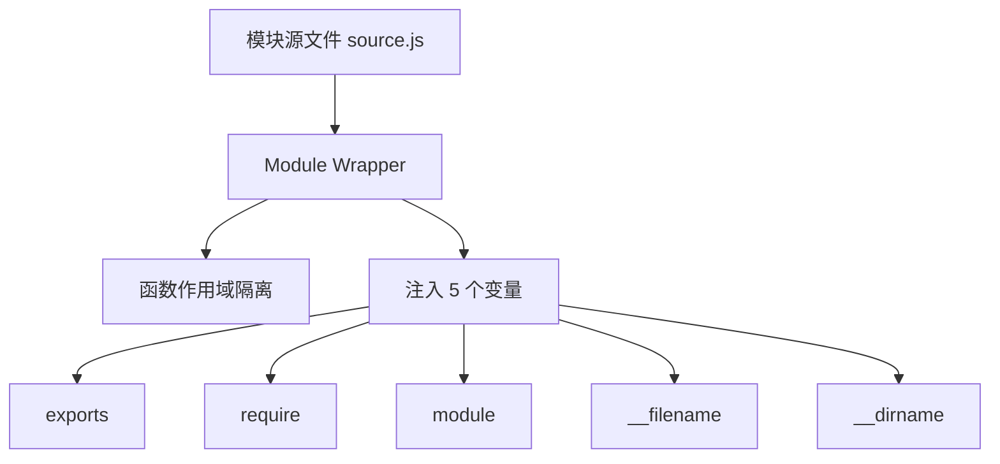
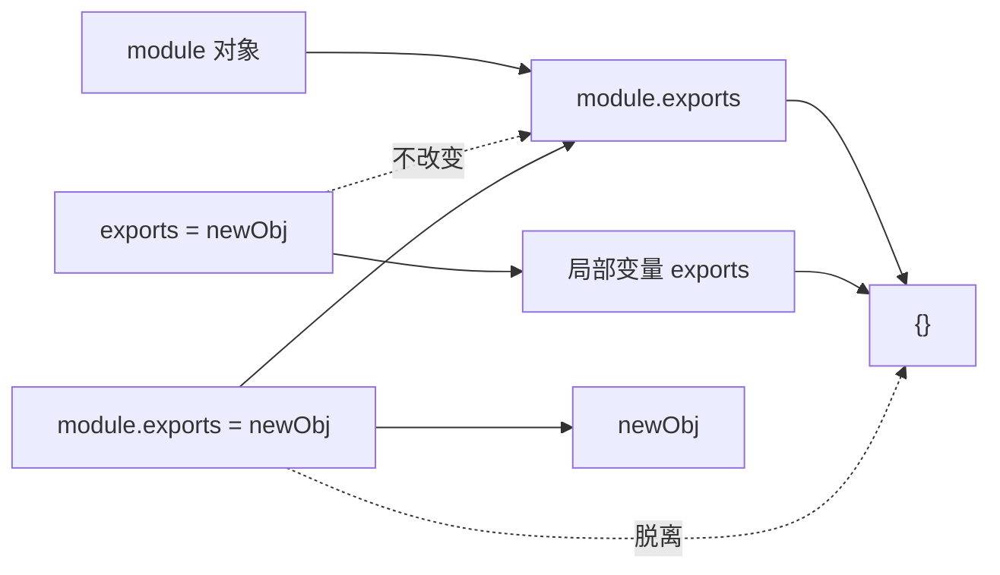
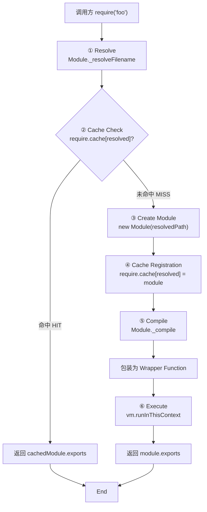
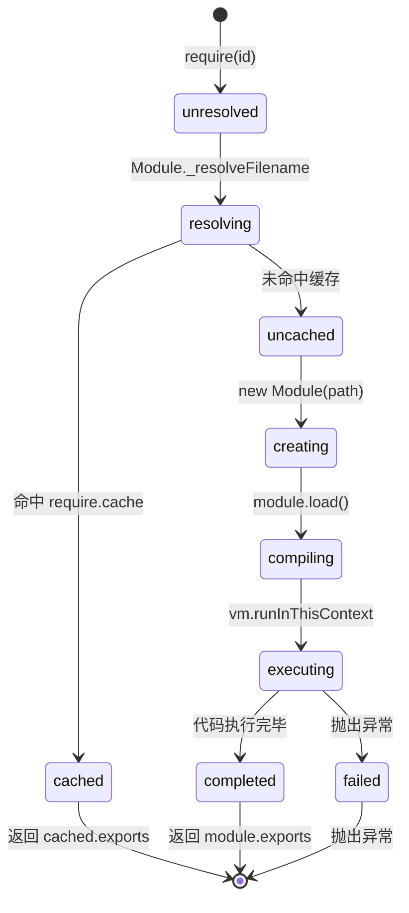

# CommonJS 模块机制深度解析 (CommonJS Module Mechanics Deep Dive)

> **形式化定义**：CommonJS（CJS）是 Node.js 原生采用的模块系统，其语义根基为**同步函数式加载（Synchronous Functional Loading）**。每个 CJS 模块在执行前被包装为 `function(exports, require, module, __filename, __dirname)` 形式的 Wrapper Function，由 Node.js 的 `Module._load` 抽象操作调用。模块导出通过修改 `module.exports` 对象实现，加载结果通过 `require.cache` 实现单例（Singleton）保证。
>
> 对齐版本：Node.js 22+ | CommonJS Modules/1.1.1 | TypeScript 5.8–6.0

---

## 1. `require()` 作为同步函数调用 (Synchronous Functional Loading)

### 1.1 核心语义

在 CJS 中，`require(id)` 是一个**普通的同步函数调用（Synchronous Function Call）**，而非声明性语法。这意味着：

- 它在**运行时（Runtime）**求值，而非编译时解析；
- 它可以出现在条件分支、循环体或嵌套函数中；
- 它会**阻塞（Block）**事件循环，直到文件系统完成同步读取、编译并执行目标模块。

```typescript
// 动态条件加载 —— 仅 CJS 支持
const config = process.env.NODE_ENV === "production"
  ? require("./config.prod")
  : require("./config.dev");
```

**类比理解**：`require()` 就像去图书馆借书——你走到书架前（文件系统），找到书（解析路径），当场阅读（同步执行），然后带回自己的座位（返回 module.exports）。如果书架上没有这本书，你会当场得知（同步报错）。

### 1.2 `require()` 的四阶段算法

Node.js 的 `require()` 执行以下抽象算法：

```
Require(id):
  1. resolvedPath ← Module._resolveFilename(id, this)
  2. if require.cache[resolvedPath] exists:
       return require.cache[resolvedPath].exports
  3. module ← new Module(resolvedPath, parent)
  4. require.cache[resolvedPath] ← module
  5. module.load(resolvedPath)
  6. return module.exports
```

| 阶段 | 名称 | 说明 |
|------|------|------|
| 1 | Resolve | 将模块标识符解析为绝对文件路径 |
| 2 | Cache Check | 查询 `require.cache`，命中则直接返回 |
| 3 | Module Creation | 创建 `Module` 实例，初始化 `exports = {}` |
| 4 | Cache Registration | **执行前即将模块加入缓存**（循环依赖防递归关键） |
| 5 | Load & Compile | 读取源码，包装为 Wrapper Function，通过 `vm.runInThisContext` 编译 |
| 6 | Execute & Return | 执行包装函数，返回 `module.exports` |

**形式化描述**：设 $R(id)$ 为 require 操作，$C$ 为缓存，$M$ 为 Module 实例：

$$
R(id) = \begin{cases}
C[\text{resolve}(id)].\text{exports} & \text{if } \text{resolve}(id) \in \text{dom}(C) \\
M.\text{exports} & \text{where } M = \text{new Module}(\text{resolve}(id)),\; C[\text{resolve}(id)] = M,\; \text{execute}(M)
\end{cases}
$$

### 1.3 同步性带来的设计约束

| 约束维度 | CJS 行为 | 当代挑战 |
|---------|---------|---------|
| I/O 模型 | 同步 `fs.readFileSync` | 浏览器无文件系统，无法原生支持 |
| 启动性能 | 顺序阻塞加载 | 大型应用模块图数万节点，启动慢 |
| Tree Shaking | 运行时导出结构不可静态分析 | 打包工具需启发式猜测 |
| 浏览器兼容性 | 需 Browserify/Webpack 转换 | 现代开发首选 ESM |
| 微任务交互 | require 期间不释放事件循环 | 可能阻塞 I/O 密集型操作 |

---

## 2. Module Wrapper：作用域隔离与变量注入

### 2.1 Wrapper 的形式化结构

Node.js 在加载模块前，将源文本包裹为以下函数表达式：

```javascript
(function(exports, require, module, __filename, __dirname) {
  // 用户的模块代码位于此处
});
```

该 Wrapper 提供五项核心语义保证：

1. **作用域隔离（Scope Isolation）**：用户代码运行在函数作用域内，不会污染 `globalThis`；
2. **变量注入（Variable Injection）**：`exports`、`require`、`module`、`__filename`、`__dirname` 作为形参自动可用；
3. **文件路径信息**：`__filename` 为绝对文件路径，`__dirname` 为其所在目录的绝对路径；
4. **模块对象访问**：通过 `module` 对象可访问模块元数据和 `exports`；
5. **非严格模式默认**：Wrapper 内部不自动注入 `"use strict"`，模块默认运行于 Sloppy Mode。



### 2.2 `this` 的指向

在 CJS 模块的顶层作用域中，`this` 指向 `module.exports`，而非 `globalThis`：

```typescript
// cjs-this-demo.js
console.log(this === module.exports); // true
console.log(this === globalThis);     // false

// 利用 this 隐式导出（不推荐但有效）
this.implicitExport = "I am exported via this";
// 等价于 module.exports.implicitExport = "..."
```

这与 ESM 模块形成鲜明对比：ESM 的顶层 `this` 为 `undefined`（隐式严格模式）。

**正例**：理解 `this` 指向有助于调试 CJS 模块：

```typescript
// cjs-debug.ts
function showThisContext(): void {
  console.log('this === module.exports:', this === module.exports);
  console.log('this === exports:', this === exports);
}

showThisContext(); // true, true
```

### 2.3 Wrapper 的 TypeScript 模拟实现

```typescript
// wrapper-simulation.ts —— 模拟 Node.js 的 Module Wrapper

interface ModuleRecord {
  id: string;
  exports: Record<string, unknown>;
  parent: ModuleRecord | null;
  filename: string;
  loaded: boolean;
  children: ModuleRecord[];
}

function createModuleWrapper(
  sourceCode: string,
  module: ModuleRecord,
  filename: string,
  dirname: string
): () => void {
  // 构建 Wrapper 函数字符串
  const wrapper = [
    '(function(exports, require, module, __filename, __dirname) {',
    sourceCode,
    '});'
  ].join('\n');
  
  // 使用 eval 模拟 vm.runInThisContext（实际 Node.js 使用 V8 脚本编译）
  const compiledWrapper = eval(wrapper) as Function;
  
  return () => {
    compiledWrapper(
      module.exports,
      createRequire(filename),
      module,
      filename,
      dirname
    );
  };
}

function createRequire(filename: string): (id: string) => unknown {
  // 简化版 require 实现
  return (id: string) => {
    console.log(`[Simulated] require('${id}') from ${filename}`);
    return {};
  };
}

// 使用示例
const mockModule: ModuleRecord = {
  id: '/project/src/demo.js',
  exports: {},
  parent: null,
  filename: '/project/src/demo.js',
  loaded: false,
  children: [],
};

const source = `
  exports.hello = "world";
  console.log(__filename);
`;

const runner = createModuleWrapper(source, mockModule, '/project/src/demo.js', '/project/src');
runner();
console.log(mockModule.exports); // { hello: "world" }
```

---

## 3. 模块缓存与单例保证 (`require.cache`)

### 3.1 `require.cache` 的数据结构

`require.cache` 是一个以**绝对路径**为键、`Module` 实例为值的对象：

```typescript
// 伪代码表示
interface RequireCache {
  [absolutePath: string]: ModuleRecord;
}

declare const require: {
  cache: RequireCache;
  resolve(id: string): string;
  (id: string): unknown;
};
```

**关键语义**：对同一 `resolvedPath` 的所有 `require()` 调用，仅第一次会执行模块代码；后续调用直接返回缓存的 `module.exports`。

### 3.2 Singleton 定理

**定理 1（CJS Singleton 定理）**：在同一 Node.js 进程中，对同一模块标识符的所有 `require()` 调用返回同一对象引用。

*证明*：设两次 `require(id)` 调用。第一次解析得 `path`，创建 `Module` 实例 $m$，将 `require.cache[path] = m$，执行代码得到 $m.\text{exports}$，返回 $m.\text{exports}$。第二次调用解析同一 `id` 得相同 `path`，查询 `require.cache[path]` 命中 $m$，直接返回 $m.\text{exports}$。因此两次返回同一引用。∎

**形式化表述**：

$$
\forall t_1, t_2,\; R_{t_1}(id) = R_{t_2}(id) \iff \text{resolve}(id) \text{ 在同一进程中不变}
$$

### 3.3 强制重新加载（边缘案例）

通过删除缓存条目，可实现热更新（Hot Reload）场景下的强制重载：

```typescript
// hot-reload.ts —— 开发环境中的热更新模式

interface ReloadableModule {
  version: number;
  getData(): string;
}

function loadModuleWithReload(modulePath: string): ReloadableModule {
  const resolved = require.resolve(modulePath);
  
  // 删除缓存以强制重新加载
  delete require.cache[resolved];
  
  // 重新加载模块
  return require(modulePath) as ReloadableModule;
}

// 正例：开发时监视文件变化并热更新
import { watch } from 'node:fs';

export function watchAndReload(modulePath: string, callback: (mod: ReloadableModule) => void): void {
  const resolved = require.resolve(modulePath);
  
  watch(resolved, () => {
    console.log(`[Hot Reload] ${modulePath} changed, reloading...`);
    try {
      const fresh = loadModuleWithReload(modulePath);
      callback(fresh);
    } catch (err) {
      console.error('[Hot Reload] Failed to reload:', err);
    }
  });
}

// ❌ 反例：生产环境中应谨慎操作 require.cache
// delete require.cache[require.resolve('./module')];
// const fresh = require('./module'); // 破坏 Singleton，可能导致状态不一致
```

**警告**：生产环境中应谨慎操作 `require.cache`，因为这会破坏 Singleton 语义，并可能导致依赖该模块的其他模块持有过期引用。

### 3.4 `require.cache` 遍历与依赖分析

```typescript
// dependency-analyzer.ts —— 基于 require.cache 的依赖分析工具

interface ModuleInfo {
  id: string;
  exports: unknown;
  parent: string | null;
  children: string[];
  loaded: boolean;
  depth: number;
}

export function analyzeModuleGraph(): Map<string, ModuleInfo> {
  const graph = new Map<string, ModuleInfo>();
  const visited = new Set<string>();
  
  function traverse(path: string, depth: number): void {
    if (visited.has(path)) return;
    visited.add(path);
    
    const mod = require.cache[path];
    if (!mod) return;
    
    graph.set(path, {
      id: mod.id,
      exports: mod.exports,
      parent: mod.parent?.id ?? null,
      children: mod.children.map(c => c.id),
      loaded: mod.loaded,
      depth,
    });
    
    for (const child of mod.children) {
      traverse(child.id, depth + 1);
    }
  }
  
  // 从入口模块开始遍历
  for (const path of Object.keys(require.cache)) {
    const mod = require.cache[path];
    if (mod && mod.parent === null) {
      traverse(path, 0);
    }
  }
  
  return graph;
}

export function findCircularDependencies(): string[][] {
  const cycles: string[][] = [];
  const visited = new Set<string>();
  const stack = new Set<string>();
  
  function dfs(path: string, chain: string[]): void {
    if (stack.has(path)) {
      const cycleStart = chain.indexOf(path);
      cycles.push(chain.slice(cycleStart).concat(path));
      return;
    }
    
    if (visited.has(path)) return;
    
    visited.add(path);
    stack.add(path);
    
    const mod = require.cache[path];
    if (mod) {
      for (const child of mod.children) {
        dfs(child.id, [...chain, path]);
      }
    }
    
    stack.delete(path);
  }
  
  for (const path of Object.keys(require.cache)) {
    if (!visited.has(path)) {
      dfs(path, []);
    }
  }
  
  return cycles;
}
```

---

## 4. `exports` vs `module.exports`：引用关系与陷阱

### 4.1 形式化关系

在 Module Wrapper 内部，存在如下初始化代码：

```javascript
var exports = module.exports;
```

即 `exports` 是 `module.exports` 的初始引用（Alias），二者最初指向同一个空对象 `{}`。

$$
\text{exports}_0 = \text{module.exports}_0 = \{\}
$$

### 4.2 真值表与行为矩阵

| 操作 | 是否有效导出 | 是否改变引用 | 消费者能否访问 | 推荐场景 |
|------|------------|------------|--------------|---------|
| `exports.x = 1` | ✅ | ❌（修改原对象） | ✅ | 多属性导出 |
| `module.exports = { x: 1 }` | ✅ | ✅（替换引用） | ✅ | 单一对象/函数导出 |
| `exports = { x: 1 }` | ❌ | ✅（仅局部变量） | ❌ | **应避免** |
| `exports = function() {}` | ❌ | ✅（仅局部变量） | ❌ | **应避免** |
| `module.exports.x = 1` | ✅ | ❌（修改原对象） | ✅ | 运行时扩展 |

### 4.3 引用关系图解



### 4.4 常见陷阱与修正

```typescript
// 陷阱 1：exports 重新赋值导致导出失效
// ❌ 错误
exports = { foo: 1 }; // 仅改变了局部变量 exports

// ✅ 正确
module.exports = { foo: 1 };
// 或者
exports.foo = 1;

// 陷阱 2：混合使用导致部分导出丢失
// ❌ 错误
exports.foo = 1;
module.exports = { bar: 2 };
// 结果：foo 丢失，因为只有 module.exports 被返回

// ✅ 正确：统一使用一种风格
module.exports = { foo: 1, bar: 2 };

// 陷阱 3：导出单一函数时误用 exports
// ❌ 错误
exports = function greet(name: string): string {
  return `Hello, ${name}`;
};

// ✅ 正确
module.exports = function greet(name: string): string {
  return `Hello, ${name}`;
};

// 或者使用 named export 风格
exports.greet = function(name: string): string {
  return `Hello, ${name}`;
};
```

### 4.5 运行时替换导出（Monkey-patching）

```typescript
// patch-logger.ts —— 在测试环境中替换 console 方法
interface Logger {
  log(...args: unknown[]): void;
  error(...args: unknown[]): void;
}

// 正例：在测试中安全地 monkey-patch 模块
export function patchLoggerForTesting(): () => void {
  const original: Logger = require('./logger');
  const originalLog = original.log;
  const originalError = original.error;
  
  // 替换模块导出上的方法
  original.log = function patchedLog(...args: unknown[]): void {
    if (process.env.NODE_ENV === 'test') {
      process.stdout.write(`[TEST-LOG] ${args.map(String).join(' ')}\n`);
    } else {
      originalLog.apply(this, args);
    }
  };
  
  // 返回恢复函数
  return function restore(): void {
    original.log = originalLog;
    original.error = originalError;
  };
}

// 由于 Singleton 语义，所有 require('./logger') 的调用方都会看到这个补丁
// 这是 CJS 的优势之一：运行时模块修改
```

---

## 5. 循环依赖行为：部分导出 (Partial Exports)

### 5.1 循环依赖的执行时序

当模块 $A$ 与模块 $B$ 循环依赖时，CJS 不会陷入无限递归，但可能导致模块拿到**部分导出（Partial Exports）**。

**定理 2（循环依赖的部分导出定理）**：若模块 $A$ 与模块 $B$ 循环依赖，且 $A$ 在 $B$ 完成执行前 `require('./B')`，则 $A$ 获得的 `B.exports` 是执行到该时刻的部分结果。

*证明*：设执行从 $A$ 开始。$A$ 被创建、加入缓存后执行。当 $A$ 执行到 `require('./B')` 时，$B$ 被创建、加入缓存、开始执行。若 $B$ 又 `require('./A')`，命中已缓存的 $A$（虽然 $A$ 尚未执行完毕）。此时 $B$ 获得的 `A.exports` 是 $A$ 已执行部分附加到 `exports` 上的结果。该语义保证无无限递归，但消费者可能拿到不完整对象。∎

### 5.2 时序示例

```typescript
// a.ts（CJS）
exports.loaded = false;
const b = require("./b"); // 此处 b 可能拿到 a 的部分导出
exports.loaded = true;
console.log('b says:', b.message);

// b.ts（CJS）
const a = require("./a");
console.log('a.loaded =', a.loaded); // false（a 尚未执行完毕）
exports.message = "from B";
```

### 5.3 最佳实践

| 策略 | 说明 | 示例 |
|------|------|------|
| 重构依赖方向 | 将双向依赖拆分为单向依赖，引入中间模块 | 提取共享常量到 types.ts |
| 延迟求值 | 将 `require()` 调用移至函数内部，避免模块顶层循环引用 | function getB() { return require('./b'); } |
| 纯函数导出 | 优先导出无状态函数/类，减少部分导出带来的副作用 | module.exports = { process: (x) => x * 2 } |
| 工厂模式 | 使用工厂函数替代直接导出实例 | module.exports = { createService: () => new Service() } |

---

## 6. `__filename` 与 `__dirname` 语义

### 6.1 定义与计算

- **`__filename`**：当前正在执行的模块文件的**绝对路径**（Absolute Path）。
- **`__dirname`**：当前模块文件所在目录的**绝对路径**。

二者由 Node.js 的 `path.resolve()` 计算得出，与 `process.cwd()` 无关。

```typescript
// /project/src/utils.ts
console.log(__filename); // /project/src/utils.js（编译后）
console.log(__dirname);  // /project/src
```

### 6.2 与 ESM 的对比

| 特性 | CJS | ESM |
|------|-----|-----|
| 文件路径变量 | `__filename`, `__dirname` 直接可用 | 需通过 `import.meta.url` 推导 |
| 计算方式 | Node.js 运行时注入 | `fileURLToPath(import.meta.url)` |
| 严格模式 | 默认 Sloppy Mode | 隐式 Strict Mode |
| 跨平台路径 | 平台原生分隔符 | URL 格式（file://） |

```typescript
// ESM 中等价的写法
import { fileURLToPath } from "node:url";
import { dirname } from "node:path";

const __filename = fileURLToPath(import.meta.url);
const __dirname = dirname(__filename);
```

---

## 7. `require.extensions` 与模块编译扩展

### 7.1 历史机制

Node.js 允许通过 `require.extensions` 注册自定义文件类型的加载器：

```typescript
// ❌ 已废弃：require.extensions 在 Node.js 中已标记为废弃
require.extensions['.ts'] = function(module: any, filename: string) {
  const content = require('fs').readFileSync(filename, 'utf-8');
  module._compile(content, filename);
};
```

**正例**：现代替代方案（Node.js 20+ 模块钩子）：

```typescript
// modern-loader.mjs —— 使用官方支持的模块自定义钩子
import { readFileSync } from 'node:fs';

export async function load(url, context, nextLoad) {
  if (url.endsWith('.ts')) {
    const source = readFileSync(new URL(url), 'utf-8');
    // 使用 esbuild/swc 进行转换
    return { format: 'module', source: transformedSource };
  }
  return nextLoad(url, context);
}
```

### 7.2 `.json` 与 `.node` 的内置加载器

Node.js 内置支持 `.js`、`.json`、`.node` 三种扩展名：

| 扩展名 | 加载方式 | 说明 |
|--------|---------|------|
| `.js` | Wrapper + vm.runInThisContext | 标准 JavaScript |
| `.json` | JSON.parse | 直接解析为对象 |
| `.node` | dlopen | 加载 C++ 原生插件 |

```typescript
// json-loader-demo.ts —— CJS 直接加载 JSON
const pkg = require('./package.json');
console.log(pkg.version); // 直接访问 JSON 属性

// 在 ESM 中对应写法（需要 Import Attributes）
import pkg from './package.json' with { type: 'json' };
console.log(pkg.version);
```

---

## 8. CJS 模块加载完整流程图

以下 Mermaid 流程图展示了从 `require(id)` 调用到返回 `module.exports` 的完整生命周期：



### 8.1 状态机视角



---

## 9. CJS 内部实现细节（Node.js 源码级分析）

### 9.1 Module 类结构

Node.js 的 `Module` 类（位于 `lib/internal/modules/cjs/loader.js`）核心字段：

```typescript
// Node.js Module 类的 TypeScript 类型定义
interface NodeModule {
  id: string;              // 模块标识符（通常是绝对路径）
  path: string;            // 模块所在目录
  exports: unknown;        // 导出的对象/值
  filename: string | null; // 模块文件的绝对路径
  loaded: boolean;         // 是否已完成加载
  children: NodeModule[];  // 该模块直接 require 的子模块
  parent: NodeModule | null; // 父模块
  paths: string[];         // node_modules 查找路径列表
  require(id: string): unknown;
}
```

### 9.2 模块路径解析算法

Node.js 的 `Module._resolveFilename` 实现了以下解析策略：

```typescript
// resolve-filename.ts —— 模拟 Node.js 的 _resolveFilename
import { isAbsolute, resolve, dirname, extname, join } from 'node:path';
import { existsSync, statSync, readFileSync } from 'node:fs';

const CORE_MODULES = new Set(['fs', 'path', 'http', 'util', 'events', 'stream', 'crypto']);

export function resolveFilename(id: string, parentPath: string): string {
  // 1. 核心模块
  if (CORE_MODULES.has(id)) {
    return id;
  }
  
  // 2. 绝对路径
  if (isAbsolute(id)) {
    return resolveFile(id);
  }
  
  // 3. 相对路径
  if (id.startsWith('./') || id.startsWith('../')) {
    return resolveFile(resolve(dirname(parentPath), id));
  }
  
  // 4. 裸指定符（node_modules 查找）
  return resolvePackage(id, parentPath);
}

function resolveFile(filePath: string): string {
  // 尝试精确匹配
  if (existsSync(filePath) && statSync(filePath).isFile()) {
    return filePath;
  }
  
  // 尝试扩展名补全
  for (const ext of ['.js', '.json', '.node']) {
    const withExt = filePath + ext;
    if (existsSync(withExt)) {
      return withExt;
    }
  }
  
  // 尝试目录索引
  const indexPath = join(filePath, 'index.js');
  if (existsSync(indexPath)) {
    return indexPath;
  }
  
  throw new Error(`Cannot find module: ${filePath}`);
}

function resolvePackage(id: string, parentPath: string): string {
  let currentDir = dirname(parentPath);
  
  while (currentDir !== dirname(currentDir)) {
    const packagePath = join(currentDir, 'node_modules', id);
    if (existsSync(packagePath)) {
      // 读取 package.json 的 main 字段
      const pkgPath = join(packagePath, 'package.json');
      if (existsSync(pkgPath)) {
        const pkg = JSON.parse(readFileSync(pkgPath, 'utf-8'));
        const main = pkg.main ?? 'index.js';
        return resolveFile(join(packagePath, main));
      }
      return resolveFile(join(packagePath, 'index.js'));
    }
    currentDir = dirname(currentDir);
  }
  
  throw new Error(`Cannot find module: ${id}`);
}
```

---

## 10. 在 ESM 中使用 CJS：`createRequire` 与条件导出

### 10.1 `module.createRequire` 桥接

```typescript
// bridge.mts —— 在 ESM 中创建 CJS require 函数
import { createRequire } from 'node:module';
import { fileURLToPath } from 'node:url';
import { dirname } from 'node:path';

const require = createRequire(import.meta.url);
const __filename = fileURLToPath(import.meta.url);
const __dirname = dirname(__filename);

// 现在可以像 CJS 一样使用 require
const lodash = require('lodash');
const localConfig = require('./config.json');

console.log(lodash.VERSION);

// createRequire 创建的 require 共享全局 require.cache
export { require, __filename, __dirname };
```

### 10.2 条件导出（Conditional Exports）在 CJS 与 ESM 间的兼容

```json
{
  "name": "my-lib",
  "exports": {
    ".": {
      "import": "./dist/index.mjs",
      "require": "./dist/index.cjs"
    }
  }
}
```

```typescript
// 当 CJS 代码 require('my-lib') 时，Node.js 会加载 ./dist/index.cjs
// 当 ESM 代码 import('my-lib') 时，Node.js 会加载 ./dist/index.mjs

// CJS 消费者
const lib = require('my-lib');

// ESM 消费者
import * as lib from 'my-lib';
```

---

## 11. 2025–2026 CJS 生态现状与演进

### 11.1 Node.js 22+ 的 `require(esm)`

Node.js 22 起，`require()` 可以直接加载 ESM 模块（不再抛出 `ERR_REQUIRE_ESM`），但存在限制：

```typescript
// Node.js 22+ 中 CJS 加载 ESM
// esm-module.mjs
export const value = 42;
export default function hello() { return 'world'; }

// cjs-consumer.js
const esmMod = require('./esm-module.mjs');
console.log(esmMod.value);       // 42
console.log(esmMod.default());   // 'world'

// ❌ 但如果 ESM 包含顶层 await，require 会抛出 ERR_REQUIRE_ASYNC_MODULE
// async-esm.mjs
export const asyncValue = await Promise.resolve(100);

// cjs-consumer.js
try {
  require('./async-esm.mjs');
} catch (err) {
  console.log(err.code); // 'ERR_REQUIRE_ASYNC_MODULE'
}
```

### 11.2 CJS 与 ESM 的渐进式迁移策略

| 迁移阶段 | 策略 | 工具 |
|---------|------|------|
| 第一阶段 | 在 CJS 中使用动态 `import()` 加载 ESM | 原生语法 |
| 第二阶段 | 将内部模块改为 `.mjs`，入口保持 CJS | 手动重构 |
| 第三阶段 | 使用 `createRequire` 在 ESM 中加载遗留 CJS | `node:module` |
| 第四阶段 | 完全迁移到 ESM，设置 `"type": "module"` | package.json |
| 第五阶段 | 使用条件导出发布双格式包 | `exports` 字段 |

---

## 12. `require.extensions` 历史与模块编译扩展

### 12.1 `require.extensions` 的机制与废弃

`require.extensions` 是 Node.js 早期提供的扩展机制，允许注册自定义文件类型的加载器。虽然已标记为废弃，但理解其机制有助于把握 Node.js 模块系统的演进。

```typescript
// ❌ 已废弃：require.extensions 在 Node.js 中已标记为废弃
// 以下为历史教育用途的模拟实现

interface RequireExtensions {
  [ext: string]: (module: NodeModule, filename: string) => void;
}

declare const require: {
  extensions: RequireExtensions;
};

// 历史上的 TypeScript 加载器实现原理
function createTsExtensionLoader(): (module: any, filename: string) => void {
  return (module, filename) => {
    const fs = require('fs');
    const content = fs.readFileSync(filename, 'utf-8');
    // 简化的 TypeScript 到 JavaScript 转换（实际使用 tsc/swc）
    const jsContent = content
      .replace(/:\s*[A-Za-z<>,\[\]|&{}\s]+/g, '') // 移除类型注解
      .replace(/interface\s+\w+\s*\{[^}]*\}/g, '') // 移除接口定义
      .replace(/type\s+\w+[^;]*;/g, ''); // 移除类型别名
    module._compile(jsContent, filename);
  };
}

// require.extensions['.ts'] = createTsExtensionLoader();
```

**废弃原因**：
1. `require.extensions` 是全局修改，影响整个进程的所有模块加载
2. 与 ESM 的静态结构不兼容
3. 性能 overhead 高（每次加载都需转换）
4. Node.js 20+ 推荐使用模块自定义钩子（Module Customization Hooks）

### 12.2 `.json` 与 `.node` 的内置加载器深度分析

Node.js 内置支持 `.js`、`.json`、`.node` 三种扩展名：

| 扩展名 | 加载方式 | 说明 | 编译缓存 |
|--------|---------|------|---------|
| `.js` | Wrapper + vm.runInThisContext | 标准 JavaScript | 是 |
| `.json` | JSON.parse(fs.readFileSync) | 直接解析为对象 | 否（每次都重新解析） |
| `.node` | process.dlopen | 加载 C++ 原生插件 | 是（操作系统 dlopen 缓存） |

```typescript
// json-loader-demo.ts —— CJS 直接加载 JSON
const pkg = require('./package.json');
console.log(pkg.version); // 直接访问 JSON 属性

// JSON 加载的边界情况
const config = require('./config.json');
// config 是 JSON.parse 的结果，即一个普通对象
// 修改它不会影响文件内容
config.debug = true; // 仅修改内存中的对象

// 再次 require 返回同一对象（Singleton）
const config2 = require('./config.json');
console.log(config2.debug); // true（因为共享同一对象引用）
```

---

## 13. CJS 模块路径解析算法详解

### 13.1 `Module._resolveFilename` 的完整流程

Node.js 的模块路径解析是一个精心设计的算法，其核心步骤如下：

```
Module._resolveFilename(request, parent):
  1. 若 request 是核心模块（fs, path, http 等），直接返回
  2. 若 request 以 '/' 开头，按绝对路径解析
  3. 若 request 以 './' 或 '../' 开头，按相对路径解析
  4. 若 request 以 '#' 开头，解析 package.json 的 imports 字段
  5. 否则，按裸指定符（bare specifier）解析 node_modules
     a. 从 parent 所在目录开始，逐层向上查找 node_modules/request
     b. 读取 package.json，优先使用 exports 字段
     c. 若无 exports，回退到 main 字段
  6. 尝试扩展名补全：.js → .json → .node
  7. 尝试目录索引：index.js → index.json → index.node
  8. 若全部失败，抛出 MODULE_NOT_FOUND
```

### 13.2 `module.paths` 与 `node_modules` 查找层级

每个 CJS 模块的 `module.paths` 属性包含该模块的 `node_modules` 查找路径：

```typescript
// paths-demo.ts —— 观察 module.paths 的层级结构
console.log('Module paths:');
for (const p of (module as any).paths) {
  console.log('  ', p);
}

// 典型输出：
// /project/src/node_modules
// /project/node_modules
// /node_modules
```

**关键观察**：`node_modules` 的层级查找允许不同目录下的模块解析到**不同版本的同一包**。这是 npm 依赖隔离机制的基础。

---

## 14. CJS 性能特征与优化

### 14.1 启动性能瓶颈

CJS 的同步加载模型在大型应用中可能导致显著的启动延迟。设模块图有 $n$ 个模块，平均加载时间为 $t$，则总启动时间为：

$$
T_{\text{startup}} = \sum_{i=1}^{n} t_i \approx n \cdot \bar{t}
$$

**优化策略**：

| 策略 | 方法 | 效果 |
|------|------|------|
| 延迟加载 | 将 `require()` 移入函数内部 | 减少启动时加载的模块数 |
| 按需子模块 | `const debounce = require('lodash/debounce')` | 避免加载整个库 |
| 构建时打包 | 使用 Webpack/Rollup 预先打包 | 减少运行时的文件系统访问 |
| V8 编译缓存 | `--cache` 选项 | 缓存编译后的字节码 |

### 14.2 CJS 与 ESM 的性能对比

```typescript
// perf-comparison.ts —— CJS vs ESM 加载性能对比
import { performance } from 'node:perf_hooks';

interface LoadBenchmark {
  system: 'cjs' | 'esm';
  firstLoadMs: number;
  cachedLoadMs: number;
  memoryKb: number;
}

export function benchmarkCjsLoad(id: string): LoadBenchmark {
  // 清除缓存模拟首次加载
  delete require.cache[require.resolve(id)];
  
  const memBefore = process.memoryUsage().heapUsed;
  const t0 = performance.now();
  require(id);
  const firstLoadMs = performance.now() - t0;
  
  const t1 = performance.now();
  require(id); // 缓存命中
  const cachedLoadMs = performance.now() - t1;
  
  return {
    system: 'cjs',
    firstLoadMs,
    cachedLoadMs,
    memoryKb: (process.memoryUsage().heapUsed - memBefore) / 1024,
  };
}

export async function benchmarkEsmLoad(id: string): Promise<LoadBenchmark> {
  const memBefore = process.memoryUsage().heapUsed;
  const t0 = performance.now();
  await import(id);
  const firstLoadMs = performance.now() - t0;
  
  // ESM 缓存是规范级实现，无法手动清除
  const t1 = performance.now();
  await import(id); // 缓存命中
  const cachedLoadMs = performance.now() - t1;
  
  return {
    system: 'esm',
    firstLoadMs,
    cachedLoadMs,
    memoryKb: (process.memoryUsage().heapUsed - memBefore) / 1024,
  };
}
```

---

## 15. CJS 到 ESM 的渐进式迁移路径

### 15.1 迁移阶段矩阵

| 迁移阶段 | 策略 | 工具 | 风险 |
|---------|------|------|------|
| 第一阶段 | 在 CJS 中使用动态 `import()` 加载 ESM | 原生语法 | 低 |
| 第二阶段 | 将内部模块改为 `.mjs`，入口保持 CJS | 手动重构 | 中 |
| 第三阶段 | 使用 `createRequire` 在 ESM 中加载遗留 CJS | `node:module` | 低 |
| 第四阶段 | 完全迁移到 ESM，设置 `"type": "module"` | package.json | 高（需全面测试） |
| 第五阶段 | 使用条件导出发布双格式包 | `exports` 字段 | 中 |

### 15.2 自动化迁移工具

```bash
# cjs-to-esm 自动化转换工具
npx cjs-to-esm src/**/*.js --out-dir esm/

# TypeScript 编译器自动处理
# tsconfig.json 设置 "module": "NodeNext" 即可输出 ESM
```

---

## 16. 更多实战代码示例

### 16.1 CJS 模块包装器模拟

```typescript
// cjs-wrapper-sim.ts —— 深度模拟 Node.js 的模块包装器

interface CjsModule {
  exports: Record<string, unknown>;
  id: string;
  filename: string;
  loaded: boolean;
  parent: CjsModule | null;
  children: CjsModule[];
  paths: string[];
}

class CjsLoader {
  private cache = new Map<string, CjsModule>();
  
  require(id: string, parent?: CjsModule): unknown {
    const resolved = this.resolve(id, parent?.filename ?? '');
    
    // 缓存检查
    if (this.cache.has(resolved)) {
      return this.cache.get(resolved)!.exports;
    }
    
    // 创建模块
    const mod: CjsModule = {
      exports: {},
      id: resolved,
      filename: resolved,
      loaded: false,
      parent: parent ?? null,
      children: [],
      paths: this.generatePaths(resolved),
    };
    
    // 注册缓存（关键：执行前加入缓存，防止循环依赖无限递归）
    this.cache.set(resolved, mod);
    
    // 加载并执行
    this.load(mod);
    mod.loaded = true;
    
    return mod.exports;
  }
  
  private resolve(id: string, parentFilename: string): string {
    // 简化版解析：仅支持相对路径
    if (id.startsWith('./') || id.startsWith('../')) {
      const path = require('path');
      return path.resolve(path.dirname(parentFilename), id);
    }
    return id;
  }
  
  private generatePaths(filename: string): string[] {
    const path = require('path');
    const paths: string[] = [];
    let dir = path.dirname(filename);
    while (dir !== path.dirname(dir)) {
      paths.push(path.join(dir, 'node_modules'));
      dir = path.dirname(dir);
    }
    return paths;
  }
  
  private load(mod: CjsModule): void {
    // 模拟 Wrapper Function 执行
    const wrapper = `(function(exports, require, module, __filename, __dirname) {\n` +
                    `// module source would go here\n` +
                    `exports.loaded = true;\n` +
                    `});`;
    const fn = eval(wrapper) as Function;
    const path = require('path');
    fn(mod.exports, this.createRequire(mod), mod, mod.filename, path.dirname(mod.filename));
  }
  
  private createRequire(parent: CjsModule): (id: string) => unknown {
    return (id: string) => this.require(id, parent);
  }
}

// 使用示例
const loader = new CjsLoader();
const result = loader.require('./dummy');
console.log(result); // { loaded: true }
```

### 16.2 CJS 热更新完整实现

```typescript
// hot-reload-system.ts —— 生产级 CJS 热更新系统

import { watch, FSWatcher } from 'node:fs';
import { resolve } from 'node:path';
import EventEmitter from 'node:events';

interface HotReloadEvent {
  modulePath: string;
  timestamp: number;
  previousExports: unknown;
  currentExports: unknown;
}

export class CjsHotReloadSystem extends EventEmitter {
  private watchers = new Map<string, FSWatcher>();
  private moduleCallbacks = new Map<string, Array<(mod: unknown) => void>>();
  
  watch(modulePath: string, callback: (mod: unknown) => void): () => void {
    const resolved = require.resolve(modulePath);
    
    // 注册回调
    if (!this.moduleCallbacks.has(resolved)) {
      this.moduleCallbacks.set(resolved, []);
      
      // 创建文件监视器
      const watcher = watch(resolved, (eventType) => {
        if (eventType === 'change') {
          this.reload(resolved);
        }
      });
      
      this.watchers.set(resolved, watcher);
    }
    
    this.moduleCallbacks.get(resolved)!.push(callback);
    
    // 返回取消订阅函数
    return () => {
      const callbacks = this.moduleCallbacks.get(resolved);
      if (callbacks) {
        const idx = callbacks.indexOf(callback);
        if (idx >= 0) callbacks.splice(idx, 1);
      }
    };
  }
  
  private reload(resolved: string): void {
    const previousExports = require.cache[resolved]?.exports;
    
    // 清除缓存
    delete require.cache[resolved];
    
    try {
      // 重新加载
      const currentExports = require(resolved);
      
      const event: HotReloadEvent = {
        modulePath: resolved,
        timestamp: Date.now(),
        previousExports,
        currentExports,
      };
      
      this.emit('reload', event);
      
      // 通知所有订阅者
      const callbacks = this.moduleCallbacks.get(resolved) ?? [];
      for (const cb of callbacks) {
        cb(currentExports);
      }
    } catch (err) {
      this.emit('error', err);
    }
  }
  
  dispose(): void {
    for (const watcher of this.watchers.values()) {
      watcher.close();
    }
    this.watchers.clear();
    this.moduleCallbacks.clear();
  }
}

// 使用示例
const hmr = new CjsHotReloadSystem();
const unwatch = hmr.watch('./config.ts', (config) => {
  console.log('Config reloaded:', config);
});
```

---

## 17. `Module` 对象的内部字段详解

### 17.1 Node.js Module 类的完整结构

Node.js 的 `Module` 类（位于 `lib/internal/modules/cjs/loader.js`）是 CJS 模块系统的核心。以下是其完整字段的 TypeScript 类型定义：

```typescript
// Node.js Module 类的完整 TypeScript 类型定义
interface NodeJSModule {
  id: string;                    // 模块标识符（通常是绝对路径，对核心模块为模块名）
  path: string;                  // 模块所在目录（dirname of filename）
  exports: unknown;              // 导出的对象或值，由模块代码填充
  filename: string | null;       // 模块文件的绝对路径（核心模块为 null）
  loaded: boolean;               // 是否已完成加载（module.load() 执行完毕）
  children: NodeJSModule[];      // 该模块直接 require 的所有子模块
  parent: NodeJSModule | null;    // 父模块（第一个 require 此模块的模块）
  paths: string[];               // node_modules 查找路径列表（从近到远）
  isPreloading: boolean;         // 是否在 --require 预加载阶段
  require(id: string): unknown;  // 该模块的 require 函数（绑定到该模块的解析上下文）
}
```

### 17.2 `module.parent` 的注意事项

`module.parent` 指向**第一个** require 该模块的模块，而非所有消费者：

```typescript
// parent-demo.ts
console.log('Parent module:', module.parent?.filename ?? 'none');

// 若 a.ts 先 require('./parent-demo')，则 parent 为 a.ts
// 若 b.ts 再 require('./parent-demo')，parent 仍为 a.ts（不会更新）
```

这一设计意味着 `module.parent` 不能用于获取完整的消费者列表。若需追踪所有消费者，需手动维护引用关系。

---

## 18. `require.cache` 的进阶操作

### 18.1 缓存的遍历与分析

```typescript
// cache-analyzer.ts —— 深度分析 require.cache

interface CacheAnalysis {
  totalModules: number;
  totalSizeEstimate: number;
  deepestPath: string[];
  mostRequired: string;
  requireCount: number;
}

export function analyzeRequireCache(): CacheAnalysis {
  const cache = require.cache;
  const modules = Object.values(cache);
  
  // 统计每个模块被引用的次数
  const referenceCount = new Map<string, number>();
  for (const mod of modules) {
    for (const child of mod.children) {
      referenceCount.set(child.id, (referenceCount.get(child.id) ?? 0) + 1);
    }
  }
  
  // 找出被引用最多的模块
  let mostRequired = '';
  let maxCount = 0;
  for (const [id, count] of referenceCount.entries()) {
    if (count > maxCount) {
      maxCount = count;
      mostRequired = id;
    }
  }
  
  // 计算最深依赖路径
  let deepestPath: string[] = [];
  const visited = new Set<string>();
  
  function findDepth(mod: NodeModule, path: string[]): void {
    if (visited.has(mod.id) || path.includes(mod.id)) {
      if (path.length > deepestPath.length) {
        deepestPath = [...path];
      }
      return;
    }
    
    visited.add(mod.id);
    
    if (mod.children.length === 0) {
      if (path.length > deepestPath.length) {
        deepestPath = [...path];
      }
    } else {
      for (const child of mod.children) {
        findDepth(child, [...path, child.id]);
      }
    }
    
    visited.delete(mod.id);
  }
  
  for (const mod of modules) {
    if (!mod.parent) {
      findDepth(mod, [mod.id]);
    }
  }
  
  return {
    totalModules: modules.length,
    totalSizeEstimate: modules.length * 1024, // 粗略估计
    deepestPath,
    mostRequired,
    requireCount: maxCount,
  };
}
```

### 18.2 缓存的批量操作

```typescript
// cache-utils.ts —— require.cache 的批量操作工具

export function clearModuleCache(pattern: RegExp): number {
  let count = 0;
  for (const key of Object.keys(require.cache)) {
    if (pattern.test(key)) {
      delete require.cache[key];
      count++;
    }
  }
  return count;
}

export function clearAllCache(): void {
  for (const key of Object.keys(require.cache)) {
    delete require.cache[key];
  }
}

export function getCacheStats(): Record<string, number> {
  const stats: Record<string, number> = {};
  for (const [key, mod] of Object.entries(require.cache)) {
    const ext = key.split('.').pop() ?? 'unknown';
    stats[ext] = (stats[ext] ?? 0) + 1;
    stats['__total'] = (stats['__total'] ?? 0) + 1;
  }
  return stats;
}
```

---

## 19. CJS 的同步加载与事件循环

### 19.1 同步加载对事件循环的影响

CJS 的 `require()` 是同步操作，会阻塞事件循环直到模块加载完成。在大型应用中，这可能导致以下问题：

```
事件循环时间线：
  [require('./a')] → [require('./b')] → [require('./c')] → [处理 I/O 事件]
       ↑ 阻塞            ↑ 阻塞            ↑ 阻塞
```

**缓解策略**：

| 策略 | 实现 | 效果 |
|------|------|------|
| 延迟加载 | 将 require 移入函数 | 分散加载时间 |
| 异步初始化 | 使用 ESM 动态导入 | 不阻塞事件循环 |
| 预加载 | --require 或 --import | 在应用启动前完成加载 |

---

## 20. CJS 在 Node.js 22+ 中的变化

### 20.1 `require(esm)` 的缓存语义

Node.js 22+ 支持 `require()` 加载 ESM 模块时，缓存语义有所变化：

```typescript
// esm-module.mjs
export const value = 42;
export function updateValue(v: number): void {
  // ESM 的 Live Binding 在 require 加载后是否保持？
}

// cjs-consumer.js
const esm = require('./esm-module.mjs');
console.log(esm.value); // 42

// 注意：通过 require 加载的 ESM 模块，其 Live Binding 行为可能受限
// 因为 CJS 的 module.exports 是一次性返回的对象引用
```

### 20.2 CJS 与 ESM 缓存的隔离

Node.js 22+ 中，CJS 的 `require.cache` 和 ESM 的内部模块映射（Module Map）是两个独立的数据结构：

- `require.cache`：以绝对路径为键，存储 CJS Module 实例
- ESM Module Map：以 URL 为键，存储 Module Record 和状态

这意味着同一文件通过 `require()` 和 `import()` 加载时，可能创建两个独立的模块实例（除非 Node.js 进行了特殊处理）。

---

## 21. 更多实战代码示例

### 21.1 CJS 模块的单元测试模拟

```typescript
// mock-module.ts —— 在测试中模拟 CJS 模块

import { Module } from 'node:module';
import { fileURLToPath } from 'node:url';

export function mockModule(id: string, exports: Record<string, unknown>): void {
  const resolved = require.resolve(id);
  
  // 创建模拟模块
  const mod = new Module(resolved, module.parent);
  mod.exports = exports;
  mod.loaded = true;
  
  // 注入缓存
  require.cache[resolved] = mod;
}

export function unmockModule(id: string): void {
  const resolved = require.resolve(id);
  delete require.cache[resolved];
}

// 使用示例
mockModule('./config', { debug: true, apiUrl: 'http://test' });
const config = require('./config');
console.log(config.debug); // true
unmockModule('./config');
```

### 21.2 CJS 模块的依赖注入容器

```typescript
// cjs-di-container.ts —— CJS 风格的依赖注入

interface ServiceFactory<T> {
  (): T;
}

class CjsContainer {
  private registry = new Map<string, ServiceFactory<unknown>>();
  private singletons = new Map<string, unknown>();
  
  register<T>(key: string, factory: ServiceFactory<T>, singleton: boolean = true): void {
    if (singleton) {
      this.registry.set(key, () => {
        if (!this.singletons.has(key)) {
          this.singletons.set(key, factory());
        }
        return this.singletons.get(key);
      });
    } else {
      this.registry.set(key, factory);
    }
  }
  
  resolve<T>(key: string): T {
    const factory = this.registry.get(key);
    if (!factory) {
      // 尝试作为模块路径加载
      return require(key) as T;
    }
    return factory() as T;
  }
  
  reset(): void {
    this.singletons.clear();
  }
}

module.exports = { CjsContainer };
```

### 21.3 CJS 到 ESM 的自动化转换脚本

```typescript
// cjs-to-esm-converter.ts —— 简单的 CJS 到 ESM 语法转换器

export function convertCjsToEsm(source: string): string {
  let result = source;
  
  // 转换 require 语句（简单场景）
  result = result.replace(
    /const\s+(\w+)\s+=\s+require\(['"]([^'"]+)['"]\);?/g,
    "import $1 from '$2';"
  );
  
  // 转换解构 require
  result = result.replace(
    /const\s+\{([^}]+)\}\s+=\s+require\(['"]([^'"]+)['"]\);?/g,
    "import { $1 } from '$2';"
  );
  
  // 转换 module.exports = ...
  result = result.replace(
    /module\.exports\s+=\s+(.+);?/,
    'export default $1;'
  );
  
  // 转换 exports.x = ...
  result = result.replace(
    /exports\.(\w+)\s+=\s+(.+);?/g,
    'export const $1 = $2;'
  );
  
  return result;
}

// 使用示例
const cjsCode = `
const fs = require('fs');
const { join } = require('path');

function readConfig() {
  return fs.readFileSync(join(__dirname, 'config.json'));
}

exports.readConfig = readConfig;
module.exports = { readConfig };
`;

console.log(convertCjsToEsm(cjsCode));
```

---

## 22. CJS 的错误处理与调试

### 22.1 模块加载错误的分类

CJS 模块加载过程中可能遇到多种错误，理解其分类有助于快速定位问题：

| 错误类型 | 错误码 | 常见原因 |
|---------|--------|---------|
| 模块未找到 | `MODULE_NOT_FOUND` | 路径错误、未安装依赖、文件不存在 |
| 语法错误 | `SyntaxError` | 模块代码包含非法语法 |
| 运行时错误 | 任意 `Error` 子类 | 模块执行期间抛出异常 |
| 循环依赖警告 | 无（静默） | 循环依赖导致部分导出 |
| 原生模块加载失败 | `ERR_DLOPEN_FAILED` | `.node` 文件与当前平台不兼容 |

### 22.2 调试 CJS 模块加载

```typescript
// debug-require.ts —— CJS 模块加载调试工具

export function traceRequire(id: string): unknown {
  const resolved = require.resolve(id);
  console.log(`[Trace] require('${id}')`);
  console.log(`[Trace]   resolved: ${resolved}`);
  console.log(`[Trace]   cached: ${resolved in require.cache}`);
  
  const start = Date.now();
  try {
    const result = require(id);
    console.log(`[Trace]   loaded in ${Date.now() - start}ms`);
    console.log(`[Trace]   exports type: ${typeof result}`);
    if (result && typeof result === 'object') {
      console.log(`[Trace]   export keys: ${Object.keys(result).join(', ')}`);
    }
    return result;
  } catch (err) {
    console.error(`[Trace]   FAILED: ${(err as Error).message}`);
    throw err;
  }
}

// 打印完整的模块加载链
export function printLoadChain(modulePath: string, depth: number = 0): void {
  const indent = '  '.repeat(depth);
  const mod = require.cache[require.resolve(modulePath)];
  if (!mod) {
    console.log(`${indent}${modulePath} [not loaded]`);
    return;
  }
  
  console.log(`${indent}${modulePath}`);
  for (const child of mod.children) {
    printLoadChain(child.id, depth + 1);
  }
}
```

---

## 23. CJS 与 TypeScript 的集成

### 23.1 `ts-node` 与 `tsx` 的模块加载机制

`ts-node` 和 `tsx` 等工具通过注册 `require.extensions['.ts']` 或使用 Node.js 的模块钩子来实现 TypeScript 的直接运行：

```typescript
// ts-node 的简化加载原理

require.extensions['.ts'] = function(module: any, filename: string) {
  const fs = require('fs');
  const ts = require('typescript');
  
  const source = fs.readFileSync(filename, 'utf-8');
  const result = ts.transpileModule(source, {
    compilerOptions: { module: ts.ModuleKind.CommonJS, target: ts.ScriptTarget.ES2020 }
  });
  
  module._compile(result.outputText, filename);
};
```

**现代替代方案**：Node.js 22+ 的 `--experimental-strip-types` 标志允许直接运行 TypeScript 文件，无需外部工具：

```bash
node --experimental-strip-types app.ts
```

### 23.2 TypeScript 编译后的 CJS 输出

TypeScript 的 `module: "CommonJS"` 配置生成以下输出模式：

```typescript
// 源码
export const foo = 1;
export function bar(): void {}
export default class MyClass {}

// 编译后的 CJS
"use strict";
Object.defineProperty(exports, "__esModule", { value: true });
exports.bar = exports.foo = void 0;
exports.foo = 1;
function bar() {}
exports.bar = bar;
class MyClass {}
exports.default = MyClass;
```

---

## 24. 权威参考 (References)

| 来源 | 链接 | 相关章节 |
|------|------|---------|
| Node.js Modules API | <https://nodejs.org/api/modules.html> | The module wrapper, Caching |
| CommonJS Spec | <https://wiki.commonjs.org/wiki/Modules/1.1> | Module Context, Require |
| Node.js Source | <https://github.com/nodejs/node> | lib/internal/modules/cjs/loader.js |
| ECMA-262 (对比参考) | <https://tc39.es/ecma262> | §16.2 Modules |
| Node.js — `module.createRequire` | <https://nodejs.org/api/module.html#modulecreaterequirefilename> | ESM 桥接 CJS |
| Node.js — Packages | <https://nodejs.org/api/packages.html> | Conditional Exports |
| TypeScript Handbook — CJS/ESM Interop | <https://www.typescriptlang.org/docs/handbook/modules/appendices/esm-cjs-interop.html> | 互操作指南 |
| MDN — JavaScript Modules | <https://developer.mozilla.org/en-US/docs/Web/JavaScript/Guide/Modules> | ESM 与 CJS 对比 |
| webpack — Tree Shaking | <https://webpack.js.org/guides/tree-shaking/> | CJS 对 Tree Shaking 的限制 |
| Rollup — CommonJS Plugin | <https://github.com/rollup/plugins/tree/master/packages/commonjs> | CJS 转 ESM 打包 |
| Node.js require(esm) | <https://nodejs.org/api/modules.html#requireid> | Node.js 22+ 同步加载 ESM |

---

**参考规范**：Node.js Modules API | CommonJS Modules/1.1.1 Spec | ECMA-262 §16.2 | Node.js lib/internal/modules/cjs/loader.js
