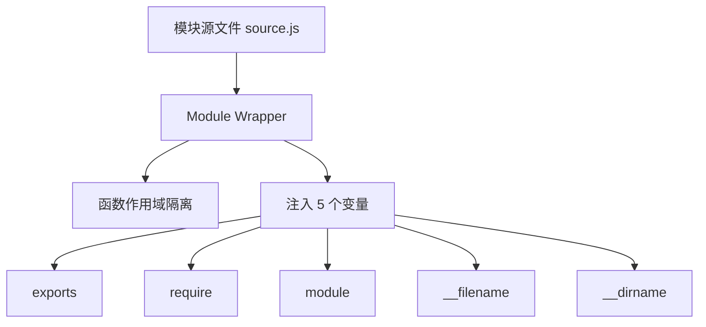
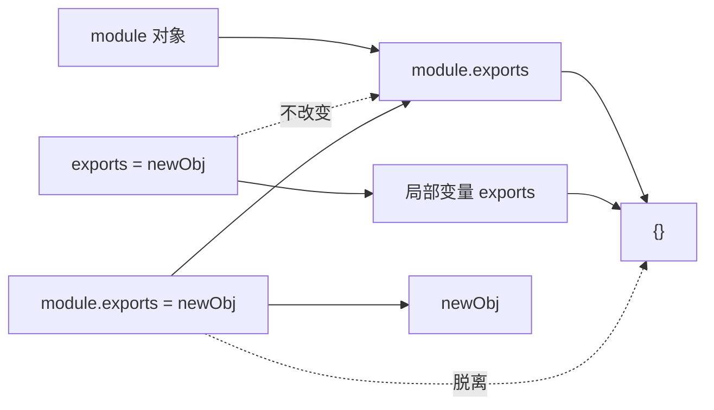
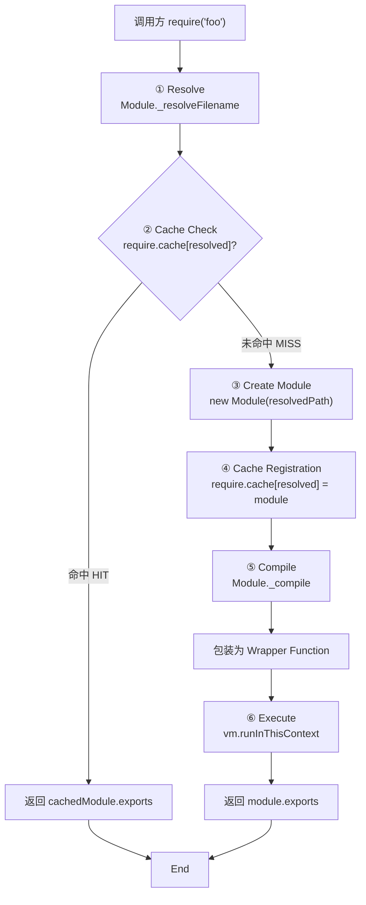
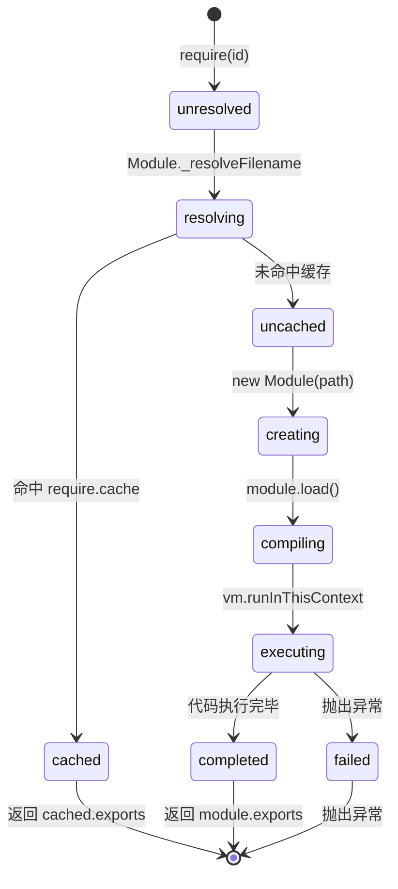

# CommonJS 模块机制深度解析 (CommonJS Module Mechanics Deep Dive)

> **形式化定义**：CommonJS（CJS）是 Node.js 原生采用的模块系统，其语义根基为**同步函数式加载（Synchronous Functional Loading）**。每个 CJS 模块在执行前被包装为 `function(exports, require, module, __filename, __dirname)` 形式的 Wrapper Function，由 Node.js 的 `Module._load` 抽象操作调用。模块导出通过修改 `module.exports` 对象实现，加载结果通过 `require.cache` 实现单例（Singleton）保证。
>
> 对齐版本：Node.js 22+ | CommonJS Modules/1.1.1 | TypeScript 5.8–6.0

---

## 1. `require()` 作为同步函数调用 (Synchronous Functional Loading)

### 1.1 核心语义

在 CJS 中，`require(id)` 是一个**普通的同步函数调用（Synchronous Function Call）**，而非声明性语法。这意味着：

- 它在**运行时（Runtime）**求值，而非编译时解析；
- 它可以出现在条件分支、循环体或嵌套函数中；
- 它会**阻塞（Block）**事件循环，直到文件系统完成同步读取、编译并执行目标模块。

```javascript
// 动态条件加载 —— 仅 CJS 支持
const config = process.env.NODE_ENV === "production"
  ? require("./config.prod")
  : require("./config.dev");
```

### 1.2 `require()` 的四阶段算法

Node.js 的 `require()` 执行以下抽象算法：

```
Require(id):
  1. resolvedPath ← Module._resolveFilename(id, this)
  2. if require.cache[resolvedPath] exists:
       return require.cache[resolvedPath].exports
  3. module ← new Module(resolvedPath, parent)
  4. require.cache[resolvedPath] ← module
  5. module.load(resolvedPath)
  6. return module.exports
```

| 阶段 | 名称 | 说明 |
|------|------|------|
| 1 | Resolve | 将模块标识符解析为绝对文件路径 |
| 2 | Cache Check | 查询 `require.cache`，命中则直接返回 |
| 3 | Module Creation | 创建 `Module` 实例，初始化 `exports = {}` |
| 4 | Cache Registration | **执行前即将模块加入缓存**（循环依赖防递归关键） |
| 5 | Load & Compile | 读取源码，包装为 Wrapper Function，通过 `vm.runInThisContext` 编译 |
| 6 | Execute & Return | 执行包装函数，返回 `module.exports` |

### 1.3 同步性带来的设计约束

| 约束维度 | CJS 行为 | 当代挑战 |
|---------|---------|---------|
| I/O 模型 | 同步 `fs.readFileSync` | 浏览器无文件系统，无法原生支持 |
| 启动性能 | 顺序阻塞加载 | 大型应用模块图数万节点，启动慢 |
| Tree Shaking | 运行时导出结构不可静态分析 | 打包工具需启发式猜测 |

---

## 2. Module Wrapper：作用域隔离与变量注入

### 2.1 Wrapper 的形式化结构

Node.js 在加载模块前，将源文本包裹为以下函数表达式：

```javascript
(function(exports, require, module, __filename, __dirname) {
  // 用户的模块代码位于此处
});
```

该 Wrapper 提供五项核心语义保证：

1. **作用域隔离（Scope Isolation）**：用户代码运行在函数作用域内，不会污染 `globalThis`；
2. **变量注入（Variable Injection）**：`exports`、`require`、`module`、`__filename`、`__dirname` 作为形参自动可用；
3. **文件路径信息**：`__filename` 为绝对文件路径，`__dirname` 为其所在目录的绝对路径；
4. **模块对象访问**：通过 `module` 对象可访问模块元数据和 `exports`；
5. **非严格模式默认**：Wrapper 内部不自动注入 `"use strict"`，模块默认运行于 Sloppy Mode。



### 2.2 `this` 的指向

在 CJS 模块的顶层作用域中，`this` 指向 `module.exports`，而非 `globalThis`：

```javascript
// CJS 模块内
console.log(this === module.exports); // true
console.log(this === globalThis);     // false
```

这与 ESM 模块形成鲜明对比：ESM 的顶层 `this` 为 `undefined`（隐式严格模式）。

---

## 3. 模块缓存与单例保证 (`require.cache`)

### 3.1 `require.cache` 的数据结构

`require.cache` 是一个以**绝对路径**为键、`Module` 实例为值的对象：

```javascript
// 伪代码表示
require.cache = {
  "/project/node_modules/lodash/index.js": Module { id, exports, parent, ... },
  "/project/src/utils.js": Module { ... }
};
```

**关键语义**：对同一 `resolvedPath` 的所有 `require()` 调用，仅第一次会执行模块代码；后续调用直接返回缓存的 `module.exports`。

### 3.2 Singleton 定理

**定理 1（CJS Singleton 定理）**：在同一 Node.js 进程中，对同一模块标识符的所有 `require()` 调用返回同一对象引用。

*证明*：设两次 `require(id)` 调用。第一次解析得 `path`，创建 `Module` 实例 `m`，将 `require.cache[path] = m`，执行代码得到 `m.exports`，返回 `m.exports`。第二次调用解析同一 `id` 得相同 `path`，查询 `require.cache[path]` 命中 `m`，直接返回 `m.exports`。因此两次返回同一引用。∎

### 3.3 强制重新加载（边缘案例）

通过删除缓存条目，可实现热更新（Hot Reload）场景下的强制重载：

```javascript
delete require.cache[require.resolve("./module")];
const fresh = require("./module"); // 重新执行模块代码
```

> ⚠️ 生产环境中应谨慎操作 `require.cache`，因为这会破坏 Singleton 语义，并可能导致依赖该模块的其他模块持有过期引用。

---

## 4. `exports` vs `module.exports`：引用关系与陷阱

### 4.1 形式化关系

在 Module Wrapper 内部，存在如下初始化代码：

```javascript
var exports = module.exports;
```

即 `exports` 是 `module.exports` 的初始引用（Alias），二者最初指向同一个空对象 `{}`。

### 4.2 真值表与行为矩阵

| 操作 | 是否有效导出 | 是否改变引用 | 消费者能否访问 | 推荐场景 |
|------|------------|------------|--------------|---------|
| `exports.x = 1` | ✅ | ❌（修改原对象） | ✅ | 多属性导出 |
| `module.exports = { x: 1 }` | ✅ | ✅（替换引用） | ✅ | 单一对象/函数导出 |
| `exports = { x: 1 }` | ❌ | ✅（仅局部变量） | ❌ | **应避免** |

### 4.3 引用关系图解



### 4.4 常见陷阱

```javascript
// 陷阱 1：exports 重新赋值导致导出失效
exports = { foo: 1 }; // ❌ 仅改变了局部变量 exports

// 陷阱 2：混合使用导致部分导出丢失
exports.foo = 1;
module.exports = { bar: 2 };
// 结果：foo 丢失，因为只有 module.exports 被返回

// 正确做法：导出单一函数
module.exports = function greet(name) {
  return `Hello, ${name}`;
};
```

---

## 5. 循环依赖行为：部分导出 (Partial Exports)

### 5.1 循环依赖的执行时序

当模块 `A` 与模块 `B` 循环依赖时，CJS 不会陷入无限递归，但可能导致模块拿到**部分导出（Partial Exports）**。

**定理 2（循环依赖的部分导出定理）**：若模块 `A` 与模块 `B` 循环依赖，且 `A` 在 `B` 完成执行前 `require('./B')`，则 `A` 获得的 `B.exports` 是执行到该时刻的部分结果。

*证明*：设执行从 `A` 开始。`A` 被创建、加入缓存后执行。当 `A` 执行到 `require('./B')` 时，`B` 被创建、加入缓存、开始执行。若 `B` 又 `require('./A')`，命中已缓存的 `A`（虽然 `A` 尚未执行完毕）。此时 `B` 获得的 `A.exports` 是 `A` 已执行部分附加到 `exports` 上的结果。该语义保证无无限递归，但消费者可能拿到不完整对象。∎

### 5.2 时序示例

```javascript
// a.js
exports.loaded = false;
const b = require("./b"); // 此处 b 可能拿到 a 的部分导出
exports.loaded = true;

// b.js
const a = require("./a");
console.log(a.loaded); // false（a 尚未执行完毕）
```

### 5.3 最佳实践

| 策略 | 说明 |
|------|------|
| 重构依赖方向 | 将双向依赖拆分为单向依赖，引入中间模块 |
| 延迟求值 | 将 `require()` 调用移至函数内部，避免模块顶层循环引用 |
| 纯函数导出 | 优先导出无状态函数/类，减少部分导出带来的副作用 |

---

## 6. `__filename` 与 `__dirname` 语义

### 6.1 定义与计算

- **`__filename`**：当前正在执行的模块文件的**绝对路径**（Absolute Path）。
- **`__dirname`**：当前模块文件所在目录的**绝对路径**。

二者由 Node.js 的 `path.resolve()` 计算得出，与 `process.cwd()` 无关。

```javascript
// /project/src/utils.js
console.log(__filename); // /project/src/utils.js
console.log(__dirname);  // /project/src
```

### 6.2 与 ESM 的对比

| 特性 | CJS | ESM |
|------|-----|-----|
| 文件路径变量 | `__filename`, `__dirname` 直接可用 | 需通过 `import.meta.url` 推导 |
| 计算方式 | Node.js 运行时注入 | `fileURLToPath(import.meta.url)` |
| 严格模式 | 默认 Sloppy Mode | 隐式 Strict Mode |

```javascript
// ESM 中等价的写法
import { fileURLToPath } from "node:url";
const __filename = fileURLToPath(import.meta.url);
const __dirname = path.dirname(__filename);
```

---

## 7. CJS 模块加载流程图

以下 Mermaid 流程图展示了从 `require(id)` 调用到返回 `module.exports` 的完整生命周期：



### 7.1 状态机视角



---

## 8. 权威参考 (References)

| 来源 | 链接 | 相关章节 |
|------|------|---------|
| Node.js Modules API | nodejs.org/api/modules.html | The module wrapper, Caching |
| CommonJS Spec | wiki.commonjs.org/wiki/Modules/1.1 | Module Context, Require |
| Node.js Source | github.com/nodejs/node | lib/internal/modules/cjs/loader.js |
| ECMA-262 (对比参考) | tc39.es/ecma262 | §16.2 Modules |

---

**参考规范**：Node.js Modules API | CommonJS Modules/1.1.1 Spec | ECMA-262 §16.2
