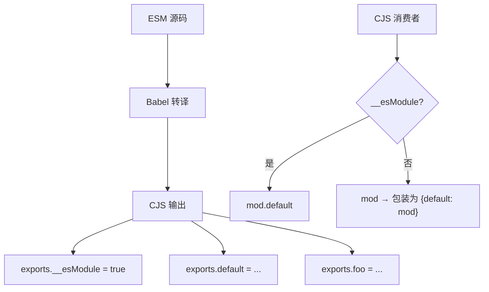
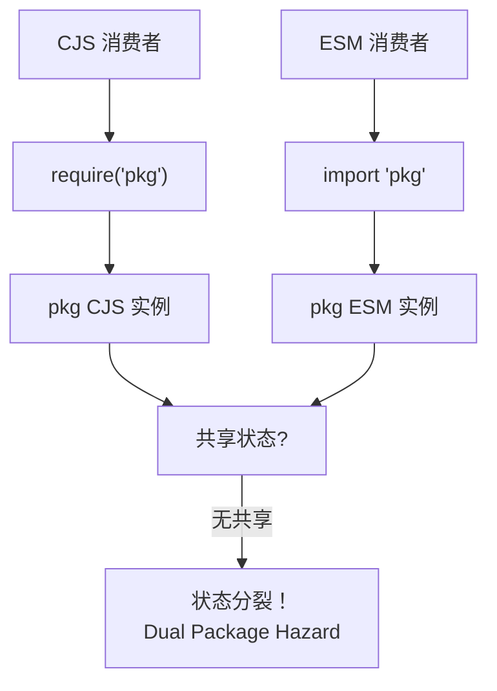
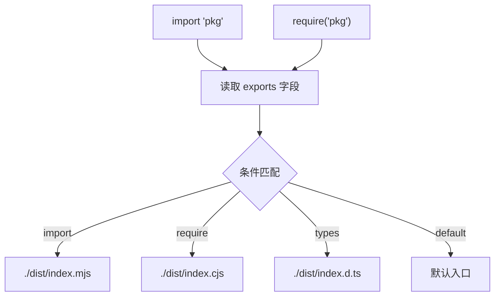

# CJS/ESM 互操作深度解析 (CJS/ESM Interoperability Deep Dive)

> **形式化定义**：CJS/ESM 互操作（Interoperability）是指在单一 Node.js 运行时中，CommonJS 模块与 ECMAScript Modules 模块之间进行相互引用、调用和类型转换时所涉及的完整语义规则集。该规则集由 Node.js 的模块加载器实现、TypeScript 的类型擦除策略以及打包工具（Bundler）的转换层共同定义。其核心矛盾在于 CJS 的**动态导出对象语义（Dynamic Export Object Semantics）**与 ESM 的**静态绑定映射语义（Static Binding Map Semantics）**之间的结构性不匹配。
>
> 对齐版本：Node.js 22+ | TypeScript 5.8–6.0 | ECMAScript 2025 (ES16)

---

## 1. 双模块问题 (The Dual-Module Problem in Node.js)

### 1.1 问题起源

Node.js 于 v12 引入原生 ESM 支持后，同一生态系统中同时存在两种模块格式：

- **CommonJS（CJS）**：`require()` / `module.exports`，同步加载，运行时解析；
- **ECMAScript Modules（ESM）**：`import` / `export`，异步求值，编译时解析。

这两种格式在**加载时序（Loading Timing）**、**导出语义（Export Semantics）**和**作用域规则（Scope Rules）**上存在根本性差异，导致互操作（Interoperability）成为一个非平凡的工程问题。

### 1.2 核心矛盾矩阵

| 维度 | CommonJS | ESM |
|------|---------|-----|
| 加载时序 | 同步（Synchronous） | 异步（Asynchronous） |
| 导出结构 | 单一对象 `module.exports` | 命名绑定集合 `ExportEntries` |
| 解析时机 | 运行时（Runtime） | 编译时（Compile Time） |
| 顶层 `this` | `module.exports` | `undefined`（严格模式） |
| 动态导入 | `require()` 任意位置 | `import()` 表达式 |

---

## 2. `__esModule` 属性与 Babel 互操作

### 2.1 历史起源

Babel 在将 ESM 源码转译为 CJS 时，为了保留 ESM 的语义信息（尤其是 `default export` 与 `named exports` 的区分），引入了 `__esModule` 标记：

```javascript
Object.defineProperty(exports, "__esModule", { value: true });
```

该标记的语义为："本模块虽然以 CJS 格式输出，但其源语义是 ESM，默认导出应通过 `.default` 属性访问"。

### 2.2 Babel 的 `_interopRequireDefault` 辅助函数

当 CJS 代码通过 Babel 消费 ESM 转译产物时，Babel 会注入如下互操作层：

```javascript
function _interopRequireDefault(obj) {
  return obj && obj.__esModule ? obj : { default: obj };
}
```

| 场景 | `__esModule` 值 | `_interopRequireDefault` 行为 |
|------|---------------|------------------------------|
| Babel 转译的 ESM → CJS | `true` | 返回原对象，保留 `default` 属性 |
| 原生 CJS 模块 | `undefined` / `false` | 将整个 `module.exports` 包装为 `{ default: obj }` |



---

## 3. `createRequire(import.meta.url)`：ESM → CJS 的桥梁

### 3.1 机制说明

在 ESM 模块中，不存在原生的 `require()` 函数。Node.js 提供 `module.createRequire` API，允许 ESM 模块基于自身路径创建一个 CJS 风格的 `require` 函数：

```javascript
// ESM 文件 (.mjs 或 type: module)
import { createRequire } from "node:module";
const require = createRequire(import.meta.url);

const cjs = require("./legacy.cjs");
```

### 3.2 关键语义

- `createRequire` 创建的 `require` 函数与原生 CJS `require` **共享同一个 `require.cache`**；
- `import.meta.url` 用于确定解析的基准路径（Base URL）；
- 该机制使得渐进式迁移（Incremental Migration）成为可能——ESM 模块可以逐步替换 CJS 依赖，而无需一次性重构整个代码库。

**代码示例：ESM 中使用 CJS 的 `__dirname` 和 `__filename` 等价物**

```javascript
// utils.mjs
import { createRequire } from 'node:module';
import { fileURLToPath } from 'node:url';
import { dirname } from 'node:path';

const require = createRequire(import.meta.url);
const __filename = fileURLToPath(import.meta.url);
const __dirname = dirname(__filename);

// 现在可以像 CJS 一样读取 JSON 文件
const pkg = require('./package.json');
console.log(__dirname, pkg.name);
```

---

## 4. CJS → ESM：动态 `import()`

### 4.1 语法与语义

CJS 模块无法使用 `require()` 加载 ESM 模块（Node.js 会抛出 `ERR_REQUIRE_ESM`）。但 CJS 可以使用动态导入表达式 `import()`：

```javascript
// CJS 文件
async function loadEsm() {
  const esm = await import("./module.mjs");
  console.log(esm.default);
}
```

### 4.2 异步性约束

由于 ESM 模块的顶层求值可能是异步的（例如包含顶层 `await`），`import()` 返回一个 `Promise<ModuleNamespaceObject>`。这要求 CJS 代码必须以异步方式消费 ESM：

| 方向 | 语法 | 同步性 | 支持状态 |
|------|------|--------|---------|
| CJS → ESM | `require("esm")` | 同步 | ❌ 禁止（`ERR_REQUIRE_ESM`） |
| CJS → ESM | `import("esm")` | 异步 | ✅ 支持 |
| ESM → CJS | `import cjs from "cjs"` | 同步 | ✅ 支持 |

**代码示例：CJS 中动态导入 ESM 并处理命名导出**

```javascript
// loader.cjs
async function loadUtils() {
  // 动态导入 ESM 模块
  const { foo, bar, default: defaultExport } = await import('./utils.mjs');

  console.log(foo, bar);
  console.log(defaultExport);
}

// 在 CJS 顶层使用立即执行异步函数
(async () => {
  await loadUtils();
})();
```

---

## 5. Dual Package Hazard（双包危害）

### 5.1 问题定义

当同一个 npm 包同时以 CJS 和 ESM 两种格式发布，且两种格式的构建产物各自维护独立的状态时，可能导致**状态分裂（State Splitting）**：



### 5.2 典型危害场景

假设 `pkg` 内部维护一个全局计数器：

- CJS 消费者 `require('pkg')` 修改计数器 → CJS 实例状态变更；
- ESM 消费者 `import 'pkg'` 读取计数器 → ESM 实例状态未变；
- 两者观察到不一致的状态，导致逻辑错误。

**代码示例：复现 Dual Package Hazard**

```javascript
// counter-lib/index.cjs
let count = 0;
module.exports = {
  increment() { return ++count; },
  getCount() { return count; }
};

// counter-lib/index.mjs
let count = 0;
export const increment = () => ++count;
export const getCount = () => count;

// consumer.cjs
const cjsCounter = require('counter-lib');
console.log(cjsCounter.increment()); // 1

// consumer.mjs
import * as esmCounter from 'counter-lib';
console.log(esmCounter.getCount()); // 0 — 状态分裂！
```

### 5.3 消除策略

| 策略 | 实现方式 |
|------|---------|
| 状态隔离 | 将共享状态抽离至独立 CJS 模块，ESM 入口通过 `createRequire` 引用 |
| ESM 封装 CJS | 仅发布 CJS 构建，ESM 入口为薄封装层（Thin Wrapper） |
| Wrapper 模式 | CJS 和 ESM 均引用同一内部实现，入口自身无状态 |

---

## 6. Conditional Exports：`package.json` 的 `exports` 字段

### 6.1 机制说明

`package.json` 的 `exports` 字段是 Node.js 解决互操作问题的核心机制。它允许包作者根据消费者的模块系统（CJS 或 ESM）提供不同的入口文件：

```json
{
  "name": "my-lib",
  "exports": {
    ".": {
      "import": {
        "types": "./dist/index.d.mts",
        "default": "./dist/index.mjs"
      },
      "require": {
        "types": "./dist/index.d.cts",
        "default": "./dist/index.cjs"
      }
    }
  }
}
```

### 6.2 解析流程



### 6.3 条件键优先级

Node.js 按以下条件键顺序匹配（部分）：

1. `"types"` —— TypeScript 类型声明（推荐放在首位）；
2. `"import"` —— ESM 导入上下文；
3. `"require"` —— CJS 导入上下文；
4. `"default"` —— 兜底条件，必须放在最后。

**代码示例：支持子路径导出的完整 `package.json`**

```json
{
  "name": "my-lib",
  "exports": {
    ".": {
      "types": "./dist/index.d.ts",
      "import": "./dist/index.mjs",
      "require": "./dist/index.cjs"
    },
    "./utils": {
      "types": "./dist/utils.d.ts",
      "import": "./dist/utils.mjs",
      "require": "./dist/utils.cjs"
    },
    "./package.json": "./package.json"
  }
}
```

---

## 7. `.mjs` / `.cjs` 扩展名与 `"type": "module"`

### 7.1 Node.js 模块类型判定规则

Node.js 通过以下规则判定 `.js` 文件的模块类型：

| package.json `type` | 文件扩展名 | 模块格式 | 严格模式 |
|-------------------|-----------|---------|---------|
| 未指定 | `.js` | CJS | 否（Sloppy Mode） |
| 未指定 | `.mjs` | ESM | 是（隐式 Strict Mode） |
| 未指定 | `.cjs` | CJS | 否 |
| `"commonjs"` | `.js` | CJS | 否 |
| `"commonjs"` | `.mjs` | ESM | 是 |
| `"module"` | `.js` | ESM | 是 |
| `"module"` | `.cjs` | CJS | 否 |

### 7.2 关键结论

- `.mjs` **强制**解释为 ESM，不受 `package.json` 的 `type` 字段影响；
- `.cjs` **强制**解释为 CJS，不受 `package.json` 的 `type` 字段影响；
- `.js` 的格式由**最近**的 `package.json` 的 `type` 字段决定（向上查找目录树）。

---

## 8. TypeScript `moduleResolution`：`"nodenext"` vs `"bundler"`

### 8.1 设计目标差异

TypeScript 5.0+ 引入了 `"moduleResolution": "bundler"`，与 `"nodenext"` 形成对比：

| 维度 | `"nodenext"` | `"bundler"` |
|------|-------------|------------|
| 设计目标 | 精确匹配 Node.js 运行时行为 | 匹配打包工具（Vite/Webpack/Rollup）行为 |
| 扩展名要求 | 强制 `.js`/`.mjs`/`.cjs` | 可省略扩展名 |
| `type` 字段 | 严格遵循 | 可忽略 |
| 条件导出 | 严格匹配 | 宽松匹配 |
| `import` 裸指定符 | 遵循 Node.js 解析算法 | 支持 `package.json` 中的 `"imports"` 字段 |
| 适用场景 | Node.js 原生 ESM/CJS 库 | Web 应用、打包工具项目 |

### 8.2 代码示例差异

```typescript
// tsconfig.json with "nodenext"
// 必须显式写 .js 扩展名（即使源码是 .ts）
import { foo } from "./foo.js";

// tsconfig.json with "bundler"
// 可以省略扩展名
import { foo } from "./foo";
```

**代码示例：Node.js 库的 `tsconfig.json` 配置**

```json
{
  "compilerOptions": {
    "target": "ES2022",
    "module": "NodeNext",
    "moduleResolution": "NodeNext",
    "declaration": true,
    "strict": true,
    "outDir": "./dist",
    "rootDir": "./src"
  },
  "include": ["src/**/*"]
}
```

**推理链**：若项目最终由 Vite 打包，则 `"bundler"` 更贴近实际行为；若项目发布为 npm 包供 Node.js 直接使用，则 `"nodenext"` 是必要的，否则运行时可能出现路径解析失败。

---

## 9. CJS vs ESM 互操作能力对比表

| 能力 | CJS 消费者 | ESM 消费者 | 说明 |
|------|-----------|-----------|------|
| 导入 CJS | `require('cjs')` | `import cjs from 'cjs'` | ESM 将 CJS 包装为 Synthetic Namespace |
| 导入 ESM | `import('esm')`（异步） | `import esm from 'esm'` | CJS 禁止同步 `require()` ESM |
| 命名导入 CJS | N/A | `import { named } from 'cjs'`（启发式，不可靠） | Node.js 尝试静态分析 CJS 的 exports |
| `default` 导入 CJS | N/A | `import cjs from 'cjs'` | CJS 的 `module.exports` 映射为 `default` |
| 在 ESM 中使用 `require` | N/A | `createRequire(import.meta.url)` | 创建局部 `require` 函数 |
| 动态导入 | `import()` | `import()` | 两者均支持 |
| 条件导出匹配 | `"require"` 条件 | `"import"` 条件 | 互斥 |
| Tree Shaking | 困难（运行时结构） | 天然支持（静态结构） | 打包工具对 CJS 使用启发式 |
| 顶层 `await` | 不支持 | 支持 | CJS 模块求值必须是同步的 |
| `import.meta.url` | 不支持 | 支持 | CJS 使用 `__filename` |

---

## 10. Node.js ESM 加载 CJS 的算法

当 ESM 执行 `import cjs from "./module.cjs"` 时，Node.js 执行以下转换：

```
ESMImportCJS(module.exports):
  if module.exports is not an object or is null:
    return { default: module.exports, [Symbol.toStringTag]: 'Module' }

  namespace ← CreateSyntheticModule()

  if module.exports.__esModule is true:
    for each key in module.exports:
      if key ≠ "__esModule":
        namespace[key] ← module.exports[key]
    namespace.default ← module.exports.default ?? module.exports
  else:
    namespace.default ← module.exports
    for each key in module.exports:
      if key ≠ "default":
        namespace[key] ← module.exports[key]

  return namespace
```

**关键语义**：

- CJS 的 `module.exports` 总是被包装为一个 **Synthetic Module Namespace Object**；
- 若 `__esModule` 为真，默认导出优先取 `module.exports.default`；
- 若 `__esModule` 为假，整个 `module.exports` 对象成为 `default` 导出。

---

## 11. 权威参考 (References)

| 来源 | 链接 | 相关章节 |
|------|------|---------|
| Node.js ESM Interop | [nodejs.org/api/esm.html](https://nodejs.org/api/esm.html) | Interoperability with CommonJS |
| Node.js Packages | [nodejs.org/api/packages.html](https://nodejs.org/api/packages.html) | Conditional Exports, Type Field |
| TypeScript Modules | [typescriptlang.org/docs/handbook/modules](https://www.typescriptlang.org/docs/handbook/modules) | Module Resolution |
| TC39 ESM Spec | [tc39.es/ecma262/#sec-modules](https://tc39.es/ecma262/#sec-modules) | Module Semantics |
| Babel Plugin | [babeljs.io/docs/babel-plugin-transform-modules-commonjs](https://babeljs.io/docs/babel-plugin-transform-modules-commonjs) | __esModule |
| Vite Library Mode | [vitejs.dev/guide/build.html#library-mode](https://vitejs.dev/guide/build.html#library-mode) | 打包 ESM/CJS 双格式库 |
| Rollup Output Formats | [rollupjs.org/configuration-options/#output-format](https://rollupjs.org/configuration-options/#output-format) | cjs / es 输出配置 |
| webpack Module Federation | [webpack.js.org/concepts/module-federation](https://webpack.js.org/concepts/module-federation) | 跨构建运行时模块共享 |
| Node.js ERR_REQUIRE_ESM | [nodejs.org/api/errors.html#err_require_esm](https://nodejs.org/api/errors.html#err_require_esm) | 错误码说明 |

---

**参考规范**：Node.js ESM Interop | TypeScript Handbook: Module Resolution | ECMA-262 §16.2 | CommonJS Modules/1.1.1
