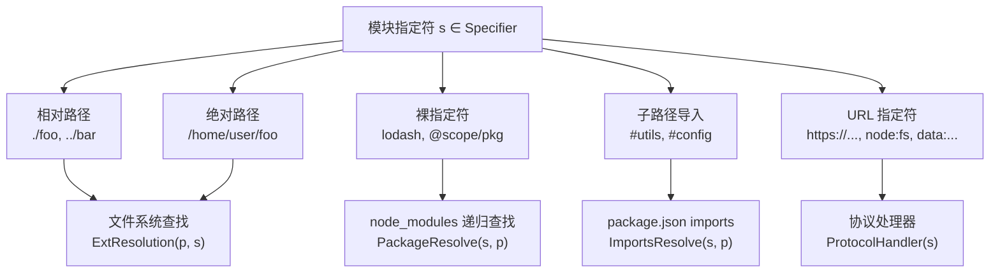
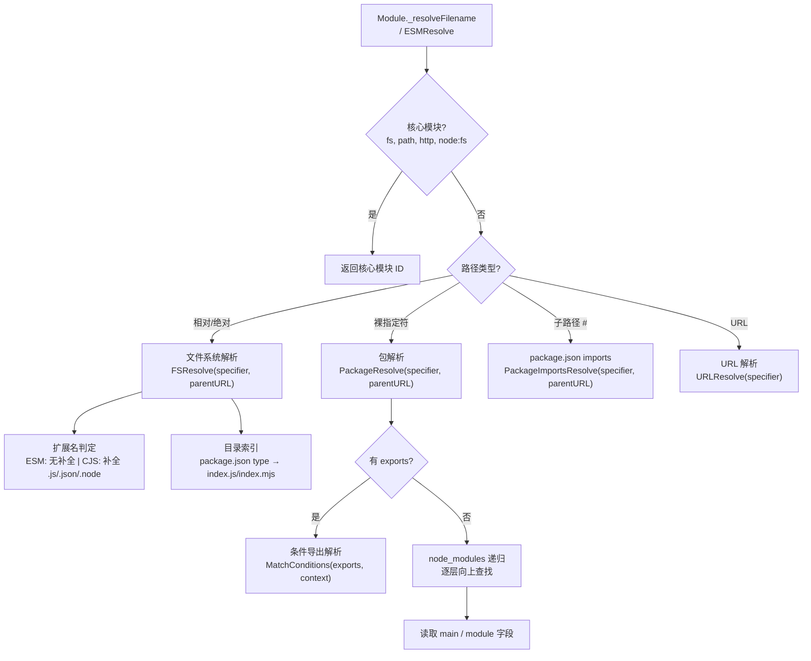
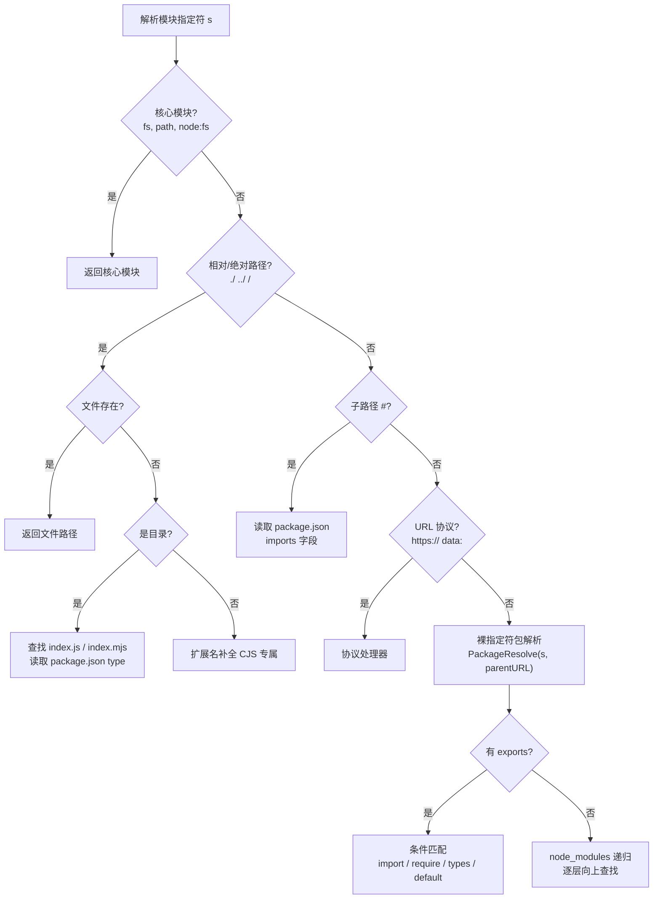
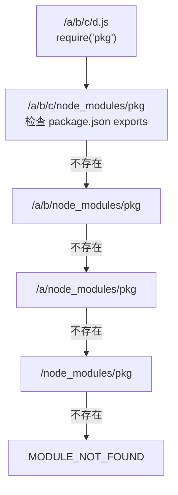

# 模块解析算法深度解析 (Module Resolution Algorithm Deep Dive)

> **形式化定义**：模块解析（Module Resolution）是将模块指定符（Module Specifier）——即 `import` 或 `require` 语句中的字符串字面量——映射到文件系统实际路径的算法过程。在 Node.js 中，该算法分为**传统解析算法（Legacy Algorithm）**和**现代解析算法（Modern Algorithm，含 `exports` / `imports` 字段支持）**；在 TypeScript 中，该算法进一步扩展为包含 `paths`、`baseUrl`、`rootDirs` 和条件导出的类型感知解析系统。模块解析的正确性直接决定了模块图构建的完备性。
>
> 形式化地，模块解析是一个偏函数：
>
> $$
> \text{Resolve}: \text{Specifier} \times \text{Context} \to \text{Path} \cup \{\text{Error}\}
> $$
>
> 其中：
> - **Specifier**（$s$）：模块指定符字符串，如 `"./utils"`、`"lodash"`、`"#internal"`
> - **Context**（$c$）：解析上下文，包含当前文件路径 $p$、模块类型 $t \in \{\text{ESM}, \text{CJS}\}$、条件键集合 $K \subseteq \{\text{import}, \text{require}, \text{types}, \text{default}, \text{node}, \text{browser}, \text{worker}\}$
> - **Path**：文件系统绝对路径或内部核心模块标识符
> - **Error**：解析失败时抛出的 `MODULE_NOT_FOUND` 或 `ERR_PACKAGE_PATH_NOT_EXPORTED`
>
> ECMA-262 本身不定义模块指定符的解析算法，将其留给宿主环境（Host Environment）。Node.js、Bun、Deno 和浏览器分别实现了不同的解析策略，形成了一幅**多运行时模块解析的复杂图景**。
>
> 对齐版本：Node.js 22–23 | TypeScript 5.7–5.8 | ECMAScript 2025 (ES16) | Bun 1.2 | pnpm 9.5+

---

## 1. 概念定义 (Concept Definition)

### 1.1 模块指定符的分类学

模块指定符（Module Specifier）可按其语法结构分为五大类，每一类对应不同的解析策略：

| 类别 | 前缀特征 | 示例 | 解析策略 |
|------|---------|------|---------|
| 相对路径（Relative） | `./` 或 `../` | `./foo`, `../bar/utils` | 基于父文件目录的文件系统查找 |
| 绝对路径（Absolute） | `/`（POSIX）或盘符（Windows） | `/home/user/foo`, `C:\\project\\src` | 直接从文件系统根目录查找 |
| 裸指定符（Bare） | 无特殊前缀 | `lodash`, `react`, `@scope/pkg` | `node_modules` 递归查找 + `exports` 条件匹配 |
| 子路径导入（Subpath Import） | `#` | `#utils`, `#config/database` | 读取当前 `package.json` 的 `imports` 字段 |
| URL 指定符（URL） | 协议前缀 | `https://...`, `file://...`, `node:fs`, `data:text/javascript,...` | 按协议处理：网络加载 / 核心模块 / Data URL |



### 1.2 `node:` 前缀与核心模块解析

Node.js 14+ 引入 `node:` 前缀用于显式引用核心模块：

```typescript
import fs from "node:fs";      // ✅ 显式核心模块
import fs2 from "fs";          // ✅ 隐式核心模块（向后兼容）
```

**关键差异**：`node:` 前缀的核心模块**不经过** `node_modules` 查找，直接映射到内置模块。这对于防止恶意 npm 包劫持核心模块名（如发布名为 `fs` 的恶意包）具有安全意义。

---

## 2. 属性与特征 (Properties & Characteristics)

### 2.1 解析算法属性矩阵（多运行时对比）

| 特性 | Node.js Legacy | Node.js Modern (22+) | TypeScript `node` | TypeScript `nodenext` | TypeScript `bundler` | Bun 1.2 |
|------|---------------|---------------------|-------------------|----------------------|---------------------|---------|
| 支持 `exports` | ❌ | ✅ | ❌ | ✅ | ✅ | ✅ |
| 支持 `imports` | ❌ | ✅ | ❌ | ✅ | ✅ | ✅ |
| 扩展名自动补全（CJS） | `.js`/`.json`/`.node` | 相同 | `.ts`/`.tsx`/`.js` | 相同，更严格 | `.ts`/`.tsx`/`.js` | 相同 |
| 扩展名自动补全（ESM） | ❌（必须显式） | ❌（必须显式） | ❌ | ❌ | ✅（可省略） | ✅（可省略） |
| `node_modules` 递归 | ✅ | ✅ | ✅ | ✅ | ✅ | ✅ |
| 目录索引解析 | `index.js` | `index.js` | `index.ts` | 严格匹配 | `index.ts` | `index.js`/`.ts` |
| 条件导出 | ❌ | ✅ | ❌ | ✅ | ✅ | ✅ |
| `customConditions` | N/A | N/A | ❌ | ❌ | ✅（TS 5.3+） | N/A |
| `workspace:` 协议 | N/A | N/A（pnpm 处理） | N/A | N/A | N/A | N/A |
| 同步 `require(esm)` | ❌（实验性 23+） | `--experimental-require-module` | ❌ | ❌ | ❌ | ✅ |

### 2.2 扩展名解析优先级真值表

对于指定符 `"./utils"`，不同上下文下的解析尝试顺序如下：

| 尝试顺序 | ESM 上下文（Node.js） | CJS 上下文（Node.js） | TypeScript `nodenext` | TypeScript `bundler` |
|---------|---------------------|---------------------|----------------------|---------------------|
| 1 | `./utils`（无补全） | `./utils` | `./utils.ts` | `./utils.ts` |
| 2 | `./utils.js`（显式） | `./utils.js` | `./utils.tsx` | `./utils.tsx` |
| 3 | `./utils/package.json` | `./utils.json` | `./utils.d.ts` | `./utils.d.ts` |
| 4 | — | `./utils.node` | `./utils.js` | `./utils.js` |
| 5 | — | `./utils/index.js` | `./utils/index.ts` | `./utils/index.ts` |

**核心结论**：ESM 在 Node.js 中**不自动补全扩展名**，`import "./utils"` 必须显式写为 `import "./utils.js"`（即使源文件是 `.ts`，编译后也需指向 `.js`）。这是 ESM 严格性的一部分，源于浏览器兼容性设计——浏览器无法像文件系统那样高效地尝试多个路径。

---

## 3. 关系分析 (Relationship Analysis)

### 3.1 Node.js 模块解析层级结构



### 3.2 TypeScript 与 Node.js 解析的关系

| 层级 | Node.js 运行时 | TypeScript 编译时 | 打包工具（Vite/Webpack） |
|------|---------------|------------------|------------------------|
| 目标 | 找到可执行的 `.js`/`.mjs`/`.cjs` | 找到类型定义 `.d.ts` 或源码 `.ts` | 找到源码并构建依赖图 |
| `paths` 支持 | ❌（需 tsx/ts-node/loader） | ✅ | ✅（通常读取 tsconfig） |
| `exports` 条件 | `import` / `require` / `default` | 增加 `types` 条件 | 增加 `browser` / `worker` 等 |
| 扩展名 | 运行时实际扩展名 | 源码扩展名 + 编译后映射 | 源码扩展名，构建后重写 |
| Monorepo 支持 | `node_modules` 符号链接 | `paths` + `rootDirs` + Project References | `resolve.alias` |
| Workspace 协议 | pnpm 替换后解析 | 不感知（pnpm 预处理） | 需插件支持 |

---

## 4. Node.js 模块解析算法详解

### 4.1 现代解析算法伪代码

Node.js 的 ESM 解析算法（ESM Resolution Algorithm）在 ECMA-262 的 HostResolveImportedModule 规范基础上扩展：

```
ESMResolve(specifier, parentURL):
  if specifier is a bare specifier:
    if specifier starts with "#":
      return PackageImportsResolve(specifier, parentURL)
    return PackageResolve(specifier, parentURL)

  if specifier is a relative path or absolute path:
    resolved ← new URL(specifier, parentURL)
    return FinalizeResolution(resolved, parentURL)

  if specifier is a URL:
    return URLResolve(specifier)

  throw ERR_INVALID_MODULE_SPECIFIER

FinalizeResolution(resolvedURL, parentURL):
  path ← fileURLToPath(resolvedURL)

  if path ends with "/":
    // 目录解析
    if fileExists(path + "package.json"):
      pkg ← readPackageJSON(path)
      if pkg.exports exists:
        return PackageExportsResolve(path, ".", pkg.exports, parentURL)
      if pkg.type === "module" and fileExists(path + "index.mjs"):
        return path + "index.mjs"
      if fileExists(path + "index.js"):
        return path + "index.js"
    throw ERR_UNSUPPORTED_DIR_IMPORT

  if fileExists(path):
    return path

  // ESM 无扩展名补全！
  throw ERR_MODULE_NOT_FOUND
```

对比 CJS 的解析算法：

```
CJSResolve(specifier, parentPath):
  if specifier is a core module name:
    return core module

  if specifier starts with "/":
    resolved ← specifier
  else if specifier starts with "./" or "../":
    resolved ← path.resolve(dirname(parentPath), specifier)
  else:
    resolved ← Module._resolveLookupPaths(specifier, parentPath)

  if fileExists(resolved):
    return resolved
  if fileExists(resolved + ".js"):
    return resolved + ".js"
  if fileExists(resolved + ".json"):
    return resolved + ".json"
  if fileExists(resolved + ".node"):
    return resolved + ".node"
  if isDirectory(resolved) and fileExists(resolved + "/index.js"):
    return resolved + "/index.js"

  throw MODULE_NOT_FOUND
```

### 4.2 `node_modules` 递归查找机制与 pnpm 的优化

对于裸指定符 `"lodash"`，传统 Node.js 从 `parentURL` 所在目录开始，逐层向上查找 `node_modules/lodash`：

```mermaid
graph LR
    Start["/project/apps/web/src/app.js<br/>require('lodash')"] --> L1["/project/apps/web/src/node_modules/lodash"]
    L1 -->|不存在| L2["/project/apps/web/node_modules/lodash"]
    L2 -->|不存在| L3["/project/apps/node_modules/lodash"]
    L3 -->|不存在| L4["/project/node_modules/lodash"]
    L4 -->|不存在| L5["/node_modules/lodash"]
    L5 -->|不存在| Error["MODULE_NOT_FOUND"]
```



**pnpm 的非扁平 `node_modules`**：pnpm 使用符号链接（symlink）和硬链接（hardlink）实现依赖隔离，其 `node_modules` 结构如下：

```
project/
├── node_modules/
│   ├── lodash -> ../../node_modules/.pnpm/lodash@4.17.21/node_modules/lodash
│   └── .pnpm/
│       └── lodash@4.17.21/
│           └── node_modules/
│               └── lodash/
│                   ├── package.json
│                   └── index.js
```

pnpm 通过 `.pnpm` 目录的物理隔离，确保了**同一个包的不同版本不会冲突**，同时通过符号链接维持了 Node.js 解析算法的兼容性。从模块解析的角度看，pnpm 的 `node_modules` 结构对解析器是**透明的**——解析器仍然遵循标准的层级查找，只是每层找到的 `node_modules` 目录内包含的是符号链接而非物理文件。

---

## 5. TypeScript 模块解析系统深度剖析

### 5.1 四种 `moduleResolution` 模式的形式化对比

TypeScript 提供了四种 `moduleResolution` 模式，每种模式对应不同的解析策略：

| 模式 | 设计目标 | 扩展名补全 | `node_modules` | `exports`/`imports` | 适用场景 |
|------|---------|-----------|---------------|-------------------|---------|
| `classic` | 早期 TypeScript / AMD | `.ts` / `.d.ts` / `.tsx` | ❌（仅同级目录） | ❌ | 遗留项目、浏览器 AMD |
| `node` | 兼容 Node.js CJS | `.ts` / `.tsx` / `.js` / `.json` | ✅（递归向上） | ❌ | Node.js CJS 项目 |
| `nodenext` | 兼容 Node.js ESM + CJS | `.ts` / `.tsx` / `.js` / `.mjs` / `.cjs` | ✅ | ✅ | 双模式（ESM/CJS）库 |
| `bundler` | 兼容打包工具（Vite / Webpack / Rollup） | `.ts` / `.tsx` / `.js` | ✅ | ✅ | 前端打包项目 |

**`classic` 模式解析规则（已废弃）**：

- 相对路径：仅尝试 `.ts`、`.tsx`、`.d.ts`，不查找 `node_modules`
- 非相对路径：从当前文件所在目录开始，向父级目录查找 `.ts`/`.tsx` 文件，**不进入 `node_modules`**
- 该模式已被标记为遗留（legacy），新项目不应使用

**`node` vs `nodenext` 关键差异**：

- `node` 模式不识别 `package.json` 的 `exports` 和 `imports` 字段，因此无法解析条件导出
- `nodenext` 严格遵循 Node.js ESM 规范：要求相对路径导入必须包含扩展名（即使源码是 `.ts`，也必须写 `.js`）
- `bundler` 模式与 `nodenext` 类似支持 `exports`/`imports`，但**允许省略扩展名**（模拟打包工具行为）

### 5.2 TypeScript 5.7 的新特性：`rewriteRelativeImportExtensions` 与 `customConditions`

TypeScript 5.7 引入了两项影响模块解析的重要特性：

**`rewriteRelativeImportExtensions`**：允许在源码中使用 `.ts` 扩展名，编译后自动重写为 `.js`。

```json
{
  "compilerOptions": {
    "module": "NodeNext",
    "moduleResolution": "NodeNext",
    "rewriteRelativeImportExtensions": true
  }
}
```

```typescript
// 源码（开发者友好）
import { add } from "./math.ts";

// 编译后输出（运行时正确）
import { add } from "./math.js";
```

**`customConditions`**（TS 5.3+ 引入，5.7 强化）：在 `bundler` 模式下，允许自定义条件键，以匹配打包工具的特殊条件。

```json
{
  "compilerOptions": {
    "moduleResolution": "bundler",
    "customConditions": ["my-company-build", "internal-tools"]
  }
}
```

对应的 `package.json` 可以定义：

```json
{
  "exports": {
    ".": {
      "my-company-build": "./dist/internal.mjs",
      "import": "./dist/index.mjs"
    }
  }
}
```

### 5.3 `paths`、`baseUrl` 与 `rootDirs`

TypeScript 的 `paths` 配置允许将模块指定符映射到自定义路径：

```json
{
  "compilerOptions": {
    "baseUrl": "./src",
    "paths": {
      "@app/*": ["app/*"],
      "@shared/*": ["../shared/*"],
      "#utils": ["utils/index.ts"]
    }
  }
}
```

**关键限制与运行时对齐**：

- `paths` 仅在 TypeScript 编译时生效，**不影响运行时模块解析**
- 运行时（Node.js）需要通过 `--experimental-specifier-resolution=node`（已废弃）或打包工具处理相同映射
- `tsconfig` 的 `extends` 机制允许子项目继承父项目的 `paths` 配置，但 `baseUrl` 是基于继承者位置解析的

**代码示例：TypeScript paths 与 Node.js 子路径导入的对比**

```typescript
// tsconfig.json 配置方式（仅编译时）
import { helper } from "@app/utils";

// package.json imports 方式（编译时 + 运行时）
// package.json: { "imports": { "#utils": "./src/utils.js" } }
import { helper } from "#utils";
```

`package.json` 的 `imports` 字段是**运行时原生支持**的，不依赖 TypeScript 或打包工具，因此在现代 Node.js 项目中更推荐使用 `#` 前缀的子路径导入替代 `@` 前缀的 TypeScript paths。

---

## 6. 子路径导入（Subpath Imports）深度解析

### 6.1 `package.json` 的 `imports` 字段

Node.js 12.20+ 和 TypeScript 5.4+ 支持 `package.json` 的 `imports` 字段，允许包内部使用 `#` 前缀的指定符：

```json
{
  "imports": {
    "#utils": "./src/utils.js",
    "#config/*": "./config/*.json",
    "#db": {
      "node": "./src/db/node.js",
      "default": "./src/db/browser.js"
    }
  }
}
```

**优势分析**：

- **封装性**：内部模块路径重构不影响消费者（`#utils` 始终有效）
- **免 `node_modules` 依赖**：不依赖符号链接或 `node_modules` 安装结构
- **类型安全**：TypeScript 支持 `imports` 字段解析，无需额外 `paths` 配置
- **条件化**：支持 `node` / `default` 等条件键，实现环境特定导入

### 6.2 与 `exports` 字段的对比

| 特性 | `exports` | `imports` |
|------|----------|----------|
| 暴露范围 | 对外（消费者可见） | 对内（仅当前包内） |
| 指定符前缀 | 裸包名或子路径 | `#` 前缀 |
| 消费者使用 | `import "pkg/subpath"` | `import "#internal"`（仅包内） |
| 条件导出 | ✅ | ✅ |
| 通配符 | ✅ | ✅ |

**代码示例：package.json imports 与路径解析**

```json
// package.json
{
  "imports": {
    "#utils": "./src/utils.js",
    "#config/*": "./config/*.json"
  }
}
```

```typescript
// TypeScript 5.4+ 无需额外 paths 配置即可解析
import { helper } from "#utils";
import dbConfig from "#config/database";

// Node.js 运行时同样支持（Node.js 12.20+）
console.log(helper());
console.log(dbConfig.host);
```

---

## 7. 条件导出（Conditional Exports）优先级算法

### 7.1 条件匹配的短路求值

Node.js 的 `exports` 字段采用**短路求值（Short-circuit Evaluation）**：一旦某个条件键匹配成功，立即返回对应路径，不再检查后续条件。条件匹配的优先级由**声明顺序**决定，而非条件键的内在优先级。

**推荐顺序（TypeScript 5.7 最佳实践）**：

```json
{
  "exports": {
    ".": {
      "types": {
        "import": "./dist/index.d.mts",
        "require": "./dist/index.d.cts",
        "default": "./dist/index.d.ts"
      },
      "import": {
        "node": "./dist/index.node.mjs",
        "default": "./dist/index.mjs"
      },
      "require": {
        "node": "./dist/index.node.cjs",
        "default": "./dist/index.cjs"
      },
      "default": "./dist/index.js"
    }
  }
}
```

### 7.2 嵌套条件与环境特定导出

条件导出支持嵌套结构，允许组合多个条件：

```json
{
  "exports": {
    ".": {
      "node": {
        "import": "./dist/node.esm.mjs",
        "require": "./dist/node.cjs.cjs"
      },
      "browser": {
        "import": "./dist/browser.esm.mjs",
        "require": "./dist/browser.cjs.cjs"
      },
      "default": "./dist/index.js"
    }
  }
}
```

解析时，Node.js 会按以下逻辑选择：

1. 确定模块系统：`import` → ESM，`require` → CJS
2. 确定环境：`node` / `browser` / `worker` / `default`
3. 组合选择最匹配的路径

**代码示例：条件导出的消费者视角**

```typescript
// 在 Node.js ESM 中
import lib from "my-lib"; // 解析为 ./dist/node.esm.mjs

// 在 Node.js CJS 中
const lib = require("my-lib"); // 解析为 ./dist/node.cjs.cjs

// 在浏览器（Webpack/Vite）中
import lib from "my-lib"; // 解析为 ./dist/browser.esm.mjs
```

---

## 8. Monorepo 路径解析与 Workspace 协议

### 8.1 Monorepo 中的模块解析挑战

在 monorepo 架构中，模块解析面临独特的挑战：

- **跨包引用**：`apps/web` 需要引用 `packages/ui` 的源码或构建产物
- **版本协调**：多个包可能依赖同一库的不同版本
- **开发 vs 生产**：开发时引用源码，生产时引用构建产物
- **类型同步**：TypeScript 需要跨包解析类型定义

### 8.2 pnpm Workspace 协议：`workspace:` 与 `catalog:`

pnpm 的 `workspace:` 协议允许包引用同一 workspace 中的其他包：

```json
// apps/web/package.json
{
  "dependencies": {
    "@my/ui": "workspace:*",
    "@my/utils": "workspace:^"
  }
}
```

| 协议形式 | 语义 | 发布时替换 |
|---------|------|----------|
| `workspace:*` | 精确匹配当前版本 | 替换为实际版本号（如 `1.2.3`） |
| `workspace:^` | 允许兼容更新 | 替换为 `^1.2.3` |
| `workspace:~` | 允许补丁更新 | 替换为 `~1.2.3` |
| `workspace:range` | 自定义范围 | 保留指定范围 |

**解析流程**：pnpm 在安装时将 `workspace:*` 替换为本地包的版本，并在 `node_modules` 中创建指向本地 `packages/ui` 的符号链接。Node.js 解析器按标准算法遍历 `node_modules` 时，会沿着符号链接找到实际的 `package.json`，进而读取其 `exports` 字段。

**pnpm `catalog:` 协议（pnpm 9.5+）**：

```yaml
# pnpm-workspace.yaml
catalog:
  "typescript": "^5.7.0"
  "vitest": "^2.0.0"
  "eslint": "^9.0.0"

catalogs:
  react17:
    "react": "^17.0.0"
    "react-dom": "^17.0.0"
  react18:
    "react": "^18.0.0"
    "react-dom": "^18.0.0"
```

```json
// packages/app/package.json
{
  "dependencies": {
    "typescript": "catalog:"
  },
  "devDependencies": {
    "react": "catalog:react18"
  }
}
```

`catalog:` 协议在模块解析层面的意义在于：**确保 monorepo 中所有包使用相同的依赖版本**，从而避免由于版本差异导致的类型系统不一致（例如 TypeScript 5.6 和 5.7 的 `moduleResolution` 差异）和运行时行为差异。

### 8.3 TypeScript Project References

对于大型 monorepo，TypeScript 的 Project References 机制可以优化跨包类型解析：

```json
// packages/ui/tsconfig.json
{
  "compilerOptions": {
    "composite": true,
    "declaration": true,
    "outDir": "./dist"
  },
  "include": ["src/**/*"]
}

// apps/web/tsconfig.json
{
  "references": [
    { "path": "../../packages/ui" }
  ],
  "compilerOptions": {
    "moduleResolution": "bundler"
  }
}
```

**代码示例：monorepo 中的跨包导入**

```typescript
// apps/web/src/main.ts
import { Button } from "@my/ui";

// TypeScript 通过 Project References 解析到 packages/ui/src/index.ts
// Node.js 运行时通过 pnpm 符号链接解析到 packages/ui/dist/index.mjs
```

---

## 9. Bun 的模块解析系统

### 9.1 Bun 与 Node.js 的差异

Bun 1.0+ 实现了与 Node.js 基本兼容的模块解析系统，但包含以下扩展：

| 特性 | Node.js | Bun |
|------|---------|-----|
| 扩展名补全（ESM） | ❌ 必须显式 | ✅ 自动补全 |
| `require(esm)` | ❌（实验性 23+） | ✅ 原生支持 |
| `.toml` 导入 | ❌ | ✅ `import config from './bunfig.toml'` |
| `.text` / `.env` 导入 | ❌ | ✅ |
| `node_modules` 查找 | 递归向上 | 递归向上 + Bun 全局缓存 |
| 条件导出 | 标准 | 标准 + `bun` 条件键 |
| 解析速度 | ~毫秒级 | ~微秒级（Bun 的卖点） |

### 9.2 Bun 的 `bun` 条件键

Bun 支持在 `exports` 中定义 `bun` 条件键，提供 Bun 优化的入口：

```json
{
  "exports": {
    ".": {
      "bun": "./dist/index.bun.mjs",
      "node": "./dist/index.node.mjs",
      "default": "./dist/index.mjs"
    }
  }
}
```

**代码示例：Bun 的自动扩展名补全**

```typescript
// bun-app/index.ts — Bun 允许省略扩展名
import { add } from "./math";      // Bun 自动尝试 ./math.ts, ./math.mjs, ./math.js
import { utils } from "./utils";   // 同上

// Node.js 必须显式写扩展名
import { add } from "./math.js";   // Node.js ESM 要求
```

---

## 10. 打包工具的模块解析

### 10.1 Vite / Rollup / Webpack 的解析策略

打包工具不直接调用 Node.js 的模块解析器，而是实现自己的解析逻辑：

| 特性 | Vite | Webpack | Rollup |
|------|------|---------|--------|
| 扩展名补全 | ✅（默认 .js/.ts/.jsx/.tsx/.json） | ✅（通过 resolve.extensions） | ✅（通过 @rollup/plugin-node-resolve） |
| `exports` 条件 | `import` / `browser` | `import` / `browser` / `require` | `import` / `browser` |
| `alias` 配置 | `resolve.alias` | `resolve.alias` | `@rollup/plugin-alias` |
| `tsconfig` 继承 | ✅（自动读取） | 需 `tsconfig-paths-webpack-plugin` | 需手动配置 |
| Monorepo 支持 | 原生支持 workspace | 需配置 | 需配置 |

### 10.2 Vite 的 `resolve.conditions` 配置

Vite 允许自定义条件导出的匹配条件：

```typescript
// vite.config.ts
export default {
  resolve: {
    conditions: ["my-custom-condition", "import"],
    alias: {
      "@app": "/src",
      "#utils": "/src/utils"
    }
  }
};
```

**代码示例：打包工具解析与 Node.js 解析的对比**

```typescript
// 源码
import { helper } from "@app/utils";

// Vite 解析：@app → /src → /src/utils.ts（或 /src/utils/index.ts）
// Node.js 解析：@app → node_modules/@app（失败，除非有符号链接或 tsconfig paths）
```

---

## 11. Node.js 22/23 的模块解析演进

### 11.1 `--experimental-detect-module` 自动检测

Node.js 22 引入了自动模块检测：当 `package.json` 未指定 `type` 字段时，Node.js 扫描文件内容，若包含 ESM 语法（`import` / `export` 关键字），则自动按 ESM 解析。

```typescript
// auto-detected.mjs（实际上可以是 .js 无 type 字段）
export const value = 42; // Node.js 22+ 自动检测为 ESM
```

这对模块解析的影响在于：解析器在读取文件前需要先判断模块类型，而模块类型又影响扩展名补全策略（ESM 不补全，CJS 补全）。

### 11.2 `import.meta.resolve` 的增强

Node.js 22+ 的 `import.meta.resolve` 支持第二个参数，允许指定父模块的 URL，改变 `node_modules` 查找的起点：

```typescript
// 从 /other/project/ 的 node_modules 解析 lodash
const resolved = import.meta.resolve("lodash", "file:///other/project/any.js");
// resolved === "file:///other/project/node_modules/lodash/index.js"
```

### 11.3 JSON 导入的稳定化

Node.js 22+ 稳定支持 ESM JSON 导入，使用 `with { type: "json" }` 语法：

```typescript
import pkg from "./package.json" with { type: "json" };
console.log(pkg.name);
```

此语法成为模块解析的一部分：解析器在解析 `package.json` 时识别 `with` 断言，验证文件扩展名为 `.json`，否则抛出 `ERR_IMPORT_ASSERTION_TYPE_FAILED`。

---

## 12. 自引用包（Self-Referencing）

### 12.1 包引用自身

Node.js 支持包通过自身的名称引用自己，这在测试和 monorepo 中非常有用：

```json
{
  "name": "my-lib",
  "exports": {
    ".": "./dist/index.js",
    "./internal": "./dist/internal.js"
  }
}
```

```typescript
// my-lib/src/test.ts
import { foo } from "my-lib";           // ✅ 自引用，解析为 ./dist/index.js
import { bar } from "my-lib/internal"; // ✅ 自引用子路径
```

自引用的解析规则：Node.js 检查当前 `package.json` 的 `name` 字段，若与指定符匹配，则直接在当前包的 `exports` 字段中解析，不进入 `node_modules`。

---

## 13. 形式证明 (Formal Proof)

### 13.1 公理化基础

**公理 15（解析唯一性）**：在同一解析上下文 $c$ 中，同一模块指定符 $s$ 映射到唯一的绝对路径或核心模块标识符。

$$
> \forall s \in \text{Specifier}, \forall c \in \text{Context}: |\text{Resolve}(s, c)| \leq 1
> $$

**公理 16（目录层级单调性）**：`node_modules` 查找遵循从近到远、从深到浅的单调顺序，不会跳过任何中间层级。

$$
> \text{若 } L_1 < L_2 < L_3 \text{（目录层级），则查找顺序为 } L_1 \to L_2 \to L_3
> $$

**公理 17（条件导出优先级）**：`exports` 字段的条件匹配遵循声明顺序，第一个匹配的条件键决定导出路径。

### 13.2 定理与证明

**定理 9（路径解析的传递闭包）**：若模块 $A$ 导入 `"B"`，模块 $B$ 导入 `"C"`，且三者均为相对路径，则 $C$ 的解析路径相对于 $A$ 的解析路径满足传递关系。

*证明*：设 $A$ 位于 `/project/src/a.js`，`B` 位于 `/project/src/b.js`。$A$ 解析 `"./c"` 得 `/project/src/c.js`。$B$ 解析 `"./d"` 得 `/project/src/d.js`。相对路径解析以当前文件目录为基准，不依赖于调用链，因此具有局部确定性。∎

**定理 10（裸指定符的最长前缀匹配）**：对于 scoped package `"@scope/pkg/subpath"`，Node.js 解析时以 `"@scope/pkg"` 为包名，`"/subpath"` 为子路径，在包的 `exports` 或 `node_modules` 目录内继续解析。

*证明*：Node.js `PackageResolve` 算法识别 `@` 开头的指定符，找到第一个 `/` 后的第二个 `/` 分割包名与子路径。对于 `"@scope/pkg/subpath/module"`，包名为 `"@scope/pkg"`，子路径为 `"subpath/module"`。∎

**定理 11（pnpm 符号链接的解析等价性）**：pnpm 的符号链接结构不改变模块解析的结果集合，即对于任意指定符 $s$，Node.js 在 pnpm 结构中的解析结果与在扁平 `node_modules` 中的解析结果相同。

*证明*：pnpm 的符号链接满足 `readlink(node_modules/pkg) = .pnpm/pkg@version/node_modules/pkg`。Node.js 解析器在遇到符号链接时，会解析到目标路径，然后在该路径的目录下继续查找 `node_modules`。由于 `.pnpm/pkg@version/node_modules` 包含了该包的所有依赖（通过另一层符号链接），解析的闭包与扁平结构等价。∎

---

## 14. 实例示例 (Examples)

### 14.1 正例：Conditional Exports 的精确配置

```json
{
  "name": "modern-lib",
  "exports": {
    ".": {
      "types": { "import": "./dist/index.d.mts", "require": "./dist/index.d.cts" },
      "import": "./dist/index.mjs",
      "require": "./dist/index.cjs"
    },
    "./feature": {
      "types": { "import": "./dist/feature.d.mts", "require": "./dist/feature.d.cts" },
      "import": "./dist/feature.mjs",
      "require": "./dist/feature.cjs"
    }
  }
}
```

### 14.2 反例：循环的 `exports` 映射

```json
{
  "exports": {
    ".": "./dist/index.js",
    "./sub": "./dist/sub.js",
    "./sub/deep": "./sub"
  }
}
```

`"./sub/deep"` 指向 `"./sub"`，而 `"./sub"` 不指向 `"./sub/deep"`，看似无循环，但若 `"./sub"` 通过目录索引解析回 `"./sub/deep"`，可能导致无限循环。Node.js 对此有检测机制（`ERR_INVALID_PACKAGE_TARGET`）。

### 14.3 边缘案例：`exports` 的通配符模式

```json
{
  "exports": {
    "./*.js": {
      "types": "./types/*.d.ts",
      "import": "./esm/*.js",
      "require": "./cjs/*.js"
    }
  }
}
```

`"./utils.js"` 匹配 `"./*.js"`，`*` 捕获 `"utils"`，因此解析为 `./types/utils.d.ts`（类型）、`./esm/utils.js`（ESM）、`./cjs/utils.js`（CJS）。

### 14.4 实战代码：package.json imports 与路径解析

```json
// package.json
{
  "imports": {
    "#utils": "./src/utils.js",
    "#config/*": "./config/*.json"
  }
}
```

```typescript
// TypeScript 5.4+ 无需额外 paths 配置即可解析
import { helper } from "#utils";
import dbConfig from "#config/database";

// Node.js 运行时同样支持（Node.js 12.20+）
console.log(helper());
```

### 14.5 TypeScript paths 与运行时对齐

```json
// tsconfig.json
{
  "compilerOptions": {
    "baseUrl": ".",
    "paths": {
      "@app/*": ["src/app/*"],
      "@shared/*": ["../shared/*"]
    }
  }
}
```

```typescript
// 编译时正确，但运行时需通过 tsx / ts-node / 打包工具处理
import { User } from "@app/models/user";
// 运行时等价于：import { User } from './src/app/models/user';
```

### 14.6 ESM 严格扩展名检查与 TS 5.7 的 `rewriteRelativeImportExtensions`

```typescript
// ESM 中不可省略扩展名，即使 TypeScript 源码是 .ts
import { add } from "./math.js"; // ✅ 正确（指向编译后的 .js）

// TypeScript 5.7+ 支持 rewriteRelativeImportExtensions，允许源码写 .ts
import { add } from "./math.ts"; // ✅ TS 5.7+ 编译为 ./math.js

// TypeScript bundler 模式允许省略扩展名
import { add } from "./math";    // ✅ bundler 模式
```

### 14.7 pnpm monorepo 中的 workspace 解析

```typescript
// apps/web/src/main.ts
import { Button } from "@my/ui";

// pnpm 将 @my/ui workspace:* 解析为符号链接：
// node_modules/@my/ui -> ../../packages/ui
// Node.js 读取 packages/ui/package.json 的 exports 字段
// 最终解析到 packages/ui/dist/index.mjs
```

### 14.8 Bun 的扩展名自动补全验证

```typescript
// bun-app/main.ts
import { add } from "./math";     // Bun 自动尝试 ./math.ts
import { utils } from "./utils";  // Bun 自动尝试 ./utils/index.ts

console.log(add(1, 2)); // 3
```

---

## 15. 思维表征 (Mental Representations)

### 15.1 模块解析决策树



### 15.2 `node_modules` 查找层级图



---

## 16. 版本演进 (Version Evolution)

### 16.1 TypeScript 模块解析演进

| 版本 | 特性 | 说明 |
|------|------|------|
| TS 1.0 | `paths` + `baseUrl` 引入 | 编译时路径映射 |
| TS 4.1 | `paths` 支持 `*` 通配 | 更灵活的子路径映射 |
| TS 4.7 | `moduleResolution: "node16"` | 支持 ESM/CJS 条件解析 |
| TS 5.0 | `moduleResolution: "bundler"` | 打包工具兼容模式 |
| TS 5.3 | `customConditions` | bundler 模式自定义条件键 |
| TS 5.7 | `rewriteRelativeImportExtensions` | 源码可写 `.ts`，编译重写为 `.js` |

### 16.2 Node.js 解析算法演进

| 版本 | 特性 | 说明 |
|------|------|------|
| Node.js 0.x | Legacy Algorithm | `node_modules` 递归、扩展名补全 |
| Node.js 12.7 | `exports` 字段 | Conditional Exports |
| Node.js 12.20 | `imports` 字段 | Subpath Imports |
| Node.js 14+ | ESM 严格解析 | 无扩展名自动补全 |
| Node.js 18+ | `node:` 前缀 | 核心模块显式前缀 |
| Node.js 20+ | `import.meta.resolve` | 运行时路径解析稳定化 |
| Node.js 22+ | `--experimental-detect-module` | 自动检测 ESM 语法 |
| Node.js 23+ | `require(esm)` 实验性 | 同步加载无顶层 await 的 ESM |

---

## 17. 模块解析性能与缓存机制

### 17.1 Node.js 模块缓存

Node.js 的模块系统实现了两层缓存：

**CJS 缓存（`require.cache`）**：以模块的绝对路径为键，缓存 `Module` 实例。这使得同一模块在同一次进程中被多次 `require()` 时，仅执行一次。

**ESM 缓存（内部 Loader Cache）**：ESM 的缓存不暴露给用户空间，由内部的 Module Map 管理。键为模块的规范化 URL（如 `file:///project/src/utils.mjs`），值为模块记录（Module Record）。

**关键差异**：CJS 的 `require.cache` 可以被手动清除（`delete require.cache[path]`），而 ESM 的缓存**无法**从用户代码中清除。这意味着在 ESM 中，循环依赖的模块一旦加载，其绑定关系就固定下来，无法通过「热重载」机制重置。

### 17.2 模块解析的性能优化

在大型 monorepo 中，模块解析可能成为构建瓶颈。优化策略：

1. **限制 `node_modules` 层级**：扁平化依赖树（如 pnpm 的 `node_modules` 结构）减少查找层级
2. **使用 `exports` 字段**：避免 `node_modules` 内多余的 `package.json` 读取
3. **TypeScript `incremental` 编译**：缓存类型解析结果
4. **打包工具预解析**：Webpack / Vite 的 Persistent Cache 存储模块解析结果

---

## 18. 自引用包（Self-Referencing）与内部子路径

### 18.1 包引用自身的语义

Node.js 支持包通过自身的名称引用自己，这在测试和 monorepo 中非常有用：

```json
{
  "name": "my-lib",
  "exports": {
    ".": "./dist/index.js",
    "./internal": "./dist/internal.js",
    "./package.json": "./package.json"
  }
}
```

```typescript
// my-lib/src/test.ts
import { foo } from "my-lib";           // ✅ 自引用，解析为 ./dist/index.js
import { bar } from "my-lib/internal"; // ✅ 自引用子路径
import pkg from "my-lib/package.json" with { type: "json" }; // ✅ 读取包元数据
```

自引用的解析规则：Node.js 检查当前 `package.json` 的 `name` 字段，若与指定符匹配，则直接在当前包的 `exports` 字段中解析，**不进入** `node_modules`。这意味着即使 `node_modules` 中存在同名包（可能是旧版本），自引用也会优先解析到当前包。

### 18.2 自引用在 monorepo 中的应用

在 pnpm workspace 中，自引用允许包在开发和生产环境中使用统一的导入路径：

```typescript
// packages/ui/src/components/Button.test.ts
import { Button } from "@my/ui"; // 自引用，开发时解析到源码，发布后解析到构建产物
```

---

## 19. 浏览器 Import Maps 与 Node.js 解析的对比

### 19.1 Import Maps 机制

浏览器通过 Import Maps 实现裸指定符解析：

```html
<script type="importmap">
{
  "imports": {
    "react": "/node_modules/react/index.mjs",
    "lodash/": "/node_modules/lodash/"
  }
}
</script>
<script type="module">
  import React from "react"; // 解析为 /node_modules/react/index.mjs
  import debounce from "lodash/debounce.js";
</script>
```

### 19.2 与 Node.js 的差异

| 特性 | Node.js | 浏览器 Import Maps |
|------|---------|-------------------|
| 配置位置 | `package.json` 的 `imports` / `exports` | HTML `<script type="importmap">` |
| `node_modules` 递归 | ✅ | ❌（必须显式映射） |
| 条件导出 | ✅（`import`/`require`/`node`） | ❌（仅简单映射） |
| 通配符 | ✅（`"./*.js"`） | ✅（`"lodash/"` 前缀映射） |
| 版本解析 | 通过 `node_modules` 层级 | 通过路径显式指定 |

**关键洞察**：Import Maps 是浏览器对「没有文件系统的模块解析」的补偿方案。它更简单、更静态，但也更有限。现代全栈框架（如 Deno、Fresh）尝试统一两种解析模型，但 Node.js 的 `exports` / `imports` 系统仍然是服务端最强大和精细的方案。

---

## 20. 实战：诊断一个复杂的模块解析失败

### 20.1 问题场景

某 monorepo 项目中，TypeScript 编译成功，但 Node.js 运行时抛出 `ERR_MODULE_NOT_FOUND`：

```
Error [ERR_MODULE_NOT_FOUND]: Cannot find module '/project/apps/web/src/utils'
```

### 20.2 诊断步骤

**步骤 1：检查模块指定符**

源码中写的是 `import { helper } from "./utils"` —— ESM 上下文省略了扩展名。

**步骤 2：验证 TypeScript 配置**

`tsconfig.json` 使用 `"moduleResolution": "bundler"`，允许省略扩展名。但运行时 Node.js 使用原生 ESM 解析，**不自动补全扩展名**。

**步骤 3：修复方案**

```typescript
// ❌ 错误：bundler 模式允许，但 Node.js 原生运行失败
import { helper } from "./utils";

// ✅ 修复 1：显式添加扩展名（Node.js 兼容）
import { helper } from "./utils.js";

// ✅ 修复 2：改用 bundler 打包后运行
// vite build → 打包器处理扩展名补全

// ✅ 修复 3：TS 5.7+ 使用 rewriteRelativeImportExtensions
// tsconfig.json: "rewriteRelativeImportExtensions": true
import { helper } from "./utils.ts"; // 编译为 ./utils.js
```

---

## 21. URL 指定符与 Data URL 的解析

### 21.1 Data URL 模块

Node.js 和浏览器支持通过 Data URL 内联加载模块：

```typescript
// Node.js 20+ 支持 Data URL ESM
const module = await import(
  "data:text/javascript,export const answer = 42;"
);
console.log(module.answer); // 42

// Base64 编码的 Data URL
const base64 = Buffer.from("export const msg = 'hello';").toString("base64");
const mod = await import(`data:text/javascript;base64,${base64}`);
```

Data URL 的模块解析遵循以下规则：
- 无 `node_modules` 查找，无 `exports` 条件匹配
- MIME 类型必须是 `text/javascript`（ESM）或 `application/json`（JSON）
- 每个 Data URL 被视为独立模块，具有独立的模块记录

### 21.2 `https:` URL 模块

Deno 原生支持 `https:` 导入，Node.js 通过 `--experimental-network-imports` 实验性支持：

```typescript
// Deno / Node.js 实验性
import { serve } from "https://deno.land/std@0.200.0/http/server.ts";
```

Node.js 的 `https:` 解析会下载远程模块到本地缓存，然后按文件系统模块解析。这种「网络优先、本地缓存兜底」的策略代表了模块解析的未来方向。

---

## 22. Scoped Package 解析的边界情况

### 22.1 `@scope/pkg/subpath` 的精确分割

对于 Scoped Package `"@scope/pkg/subpath"`，Node.js 的解析器执行以下分割：

```
Package Name:    @scope/pkg
Subpath:         /subpath

查找路径: node_modules/@scope/pkg/package.json
子路径解析: 读取 package.json 的 exports["./subpath"] 或文件系统查找
```

**边缘案例**：`"@scope"` 单独出现（无包名）是无效的，会立即抛出 `ERR_INVALID_MODULE_SPECIFIER`。

### 22.2 Scoped Package 的 `exports` 通配符

```json
{
  "name": "@my/lib",
  "exports": {
    "./*.js": {
      "types": "./types/*.d.ts",
      "import": "./esm/*.mjs",
      "require": "./cjs/*.cjs"
    }
  }
}
```

消费者可以使用 `@my/lib/utils.js`，其中 `*` 捕获 `"utils"`。

---

## 23. TypeScript `paths` 的高级配置与陷阱

### 23.1 `paths` 与 `rootDirs` 的组合使用

`rootDirs` 允许 TypeScript 将多个目录视为一个虚拟根目录：

```json
{
  "compilerOptions": {
    "rootDirs": ["./src", "./generated"],
    "paths": {
      "@generated/*": ["generated/*"]
    }
  }
}
```

此配置使得 `import { schema } from "@generated/db"` 解析到 `./generated/db.ts`，同时 TypeScript 在类型查找时会同时搜索 `./src` 和 `./generated`。

### 23.2 `paths` 不继承的陷阱

当子项目通过 `extends` 继承父项目的 `tsconfig.json` 时，`paths` 中的相对路径是基于**子项目的 `tsconfig.json` 位置**解析的，而非父项目：

```json
// packages/app/tsconfig.json
{
  "extends": "../../tsconfig.base.json",
  "compilerOptions": {
    "baseUrl": "."
  }
}
```

若 `tsconfig.base.json` 中定义 `"@shared/*": ["shared/*"]`，则在 `packages/app` 中会解析为 `packages/app/shared/*`，而非项目根目录的 `shared/*`。

---

## 24. 模块解析的缓存与性能优化

### 24.1 Node.js 的 `Module._cache` 与 ESM Loader Cache

CJS 使用 `Module._cache`（即 `require.cache`），而 ESM 使用内部 Loader Cache。两者的关键差异：

| 特性 | CJS `require.cache` | ESM Loader Cache |
|------|-------------------|-----------------|
| 可访问性 | 用户可读写 | 不可访问 |
| 键格式 | 绝对路径字符串 | 规范化 URL 字符串 |
| 清除方法 | `delete require.cache[key]` | 无官方方法 |
| 热重载支持 | ✅ 手动清除后重新 require | ❌ 需重启进程 |
| 循环依赖处理 | 部分导出（Partial Exports） | TDZ + Live Binding |

### 24.2 解析性能优化实践

在大型 monorepo 中，模块解析可能成为构建瓶颈：

1. **使用 `"exports"` 字段**：避免 `node_modules` 内多余的 `package.json` 遍历
2. **限制 `paths` 通配符数量**：过多的 `paths` 条目会线性增加解析时间
3. **TypeScript `incremental` + `tsBuildInfoFile`**：缓存类型解析结果
4. **打包工具 Persistent Cache**：Webpack / Vite 缓存模块解析的完整结果

---

## 25. 权威参考 (References)

| 来源 | 链接 | 相关章节 |
|------|------|---------|
| Node.js Resolution | [nodejs.org/api/modules.html](https://nodejs.org/api/modules.html) | CJS 模块解析 |
| Node.js ESM Resolution | [nodejs.org/api/esm.html#resolution-algorithm](https://nodejs.org/api/esm.html#resolution-algorithm) | ESM 解析算法 |
| Node.js Packages | [nodejs.org/api/packages.html](https://nodejs.org/api/packages.html) | exports / imports 字段 |
| TypeScript Module Resolution | [typescriptlang.org/docs/handbook/module-resolution.html](https://www.typescriptlang.org/docs/handbook/module-resolution.html) | TS 解析策略 |
| TypeScript TSConfig | [typescriptlang.org/tsconfig](https://www.typescriptlang.org/tsconfig) | paths, baseUrl 配置 |
| TypeScript 5.7 Release | [devblogs.microsoft.com/typescript/announcing-typescript-5-7](https://devblogs.microsoft.com/typescript/announcing-typescript-5-7/) | rewriteRelativeImportExtensions |
| pnpm Workspaces | [pnpm.io/workspaces](https://pnpm.io/workspaces) | workspace: / catalog: |
| Bun Module Resolution | [bun.sh/docs/runtime/modules](https://bun.sh/docs/runtime/modules) | Bun 模块系统 |
| Vite Resolve Config | [vitejs.dev/config/shared-options.html#resolve-conditions](https://vitejs.dev/config/shared-options.html#resolve-conditions) | 条件导出配置 |
| ECMA-262 §16.2 | [tc39.es/ecma262/#sec-modules](https://tc39.es/ecma262/#sec-modules) | 模块规范 |

---

**参考规范**：Node.js Module Resolution Algorithm | TypeScript Handbook: Module Resolution | ECMA-262 §16.2 (Host Resolve Imported Module) | pnpm Workspace Protocol | Bun Module Documentation
