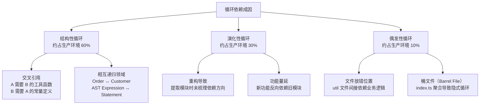
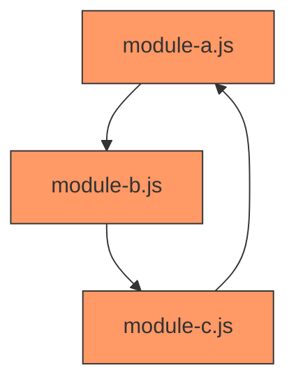
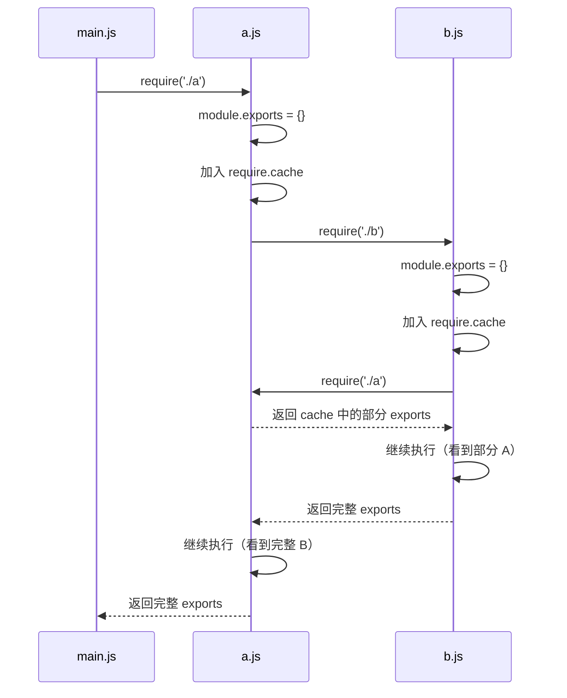
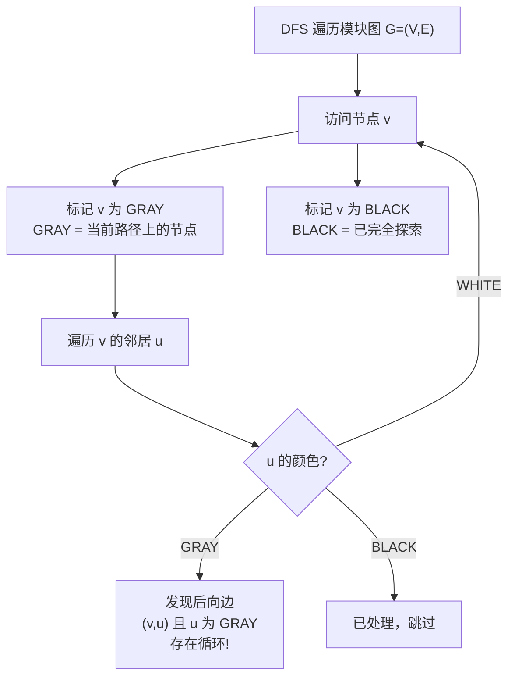
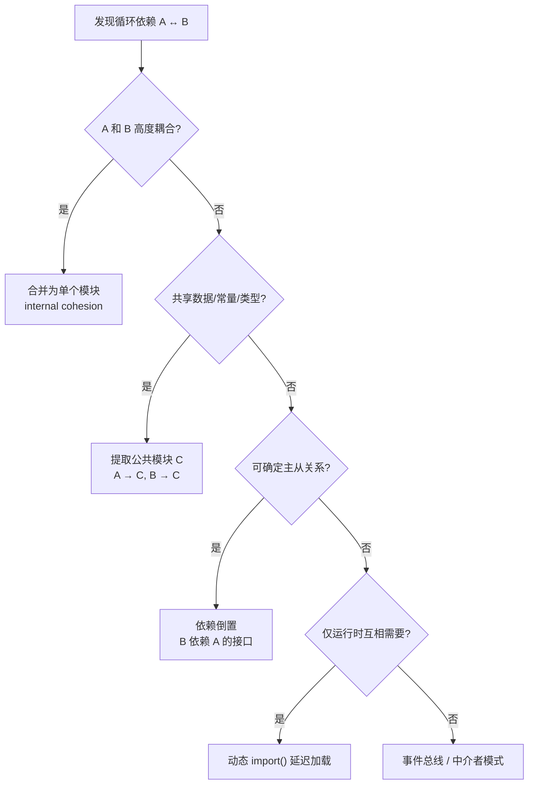
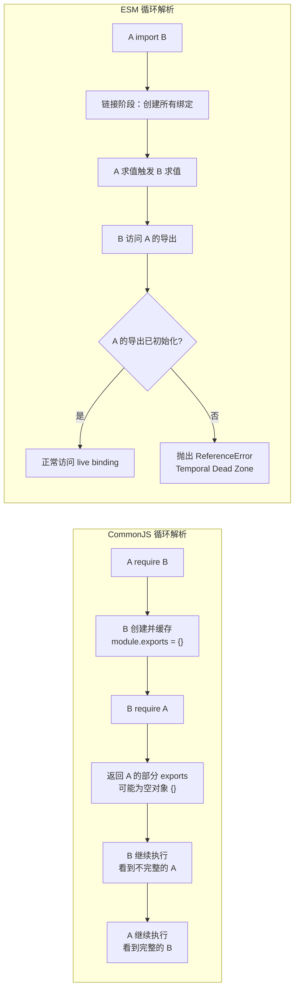

# 循环依赖深度解析 (Cyclic Dependencies Deep Dive)

> **形式化定义**：循环依赖（Cyclic Dependency，又称 Circular Dependency）是指模块依赖图（Module Dependency Graph）中存在有向环（Directed Cycle）的现象，即存在模块序列 $M_1, M_2, \ldots, M_n$ 使得 $M_1 \to M_2 \to \ldots \to M_n \to M_1$，其中 $A \to B$ 表示模块 $A$ 静态导入模块 $B$。循环依赖在 CJS 和 ESM 中均被允许，但其语义表现截然不同：CJS 基于**部分导出（Partial Exports）**和缓存优先机制，ESM 基于**暂时性死区（Temporal Dead Zone, TDZ）**和间接绑定（Indirect Binding）机制。
>
> 从图论的角度，设模块依赖图为有向图 $G = (V, E)$，其中 $V$ 为模块集合，$E \subseteq V \times V$ 为导入关系集合。若存在顶点序列 $v_1, v_2, \ldots, v_n$ 满足 $(v_1, v_2) \in E, (v_2, v_3) \in E, \ldots, (v_n, v_1) \in E$，则称 $G$ 存在长度为 $n$ 的有向环。模块系统的目标不是消除所有环（这在数学上等价于将图限制为 DAG，往往导致过度工程化），而是**管理环的风险**，确保环内模块在对方完成初始化前不会被不安全地访问。
>
> 对齐版本：Node.js 22–23 | ECMAScript 2025 (ES16) | TypeScript 5.7–5.8 | Bun 1.2

---

## 1. 概念定义 (Concept Definition)

### 1.1 形式化定义与分类

设模块图为有向图 $G = (V, E)$，其中 $V$ 为模块集合，$E$ 为导入关系集合。若存在顶点序列 $v_1, v_2, \ldots, v_n$ 满足：

$$
(v_1, v_2) \in E, (v_2, v_3) \in E, \ldots, (v_{n-1}, v_n) \in E, (v_n, v_1) \in E
$$

则称 $G$ 存在循环依赖，该序列为一个长度为 $n$ 的有向环。

**关键观察**：循环依赖不等于错误。ECMA-262 和 Node.js 均明确允许循环依赖存在。问题在于循环依赖中的模块在对方完成初始化前被访问，可能导致**不完整状态（Incomplete State）**或**暂时性死区错误（TDZ Error）**。

### 1.2 循环依赖的成因分类



**桶文件陷阱（Barrel File Pitfall）**：当多个模块通过 `index.ts` 统一导出时，容易形成隐式循环：

```typescript
// utils/index.ts — 桶文件
export * from "./string";
export * from "./number";
export * from "./date";

// utils/string.ts
import { formatDate } from "./index"; // ❌ 通过桶文件间接循环！
```

---

## 2. 属性与特征 (Properties & Characteristics)

### 2.1 CJS vs ESM 循环依赖行为矩阵

| 特性 | CommonJS | ESM | Bun | 影响 |
|------|----------|-----|-----|------|
| 检测时机 | 运行时 `require()` | 链接阶段 (Linking Phase) | 运行时 | ESM 的错误更早暴露 |
| 未完成模块的导出 | 部分 `module.exports`（已执行部分） | 绑定进入 TDZ（访问抛错） | 类似 ESM | CJS 静默失败更难调试 |
| 默认导出类型 | 对象（可部分填充） | 绑定引用（未初始化时不可访问） | 绑定引用 | CJS 允许「渐进式」初始化 |
| 是否允许 | 允许 | 允许 | 允许 | 两者均非错误 |
| 调试难度 | 困难（静默拿到 undefined） | 较易（显式 ReferenceError） | 较易 | TDZ 错误是「快速失败」 |
| 顶层 `await` 影响 | N/A（CJS 无 TLA） | 可能延迟初始化 | 可能延迟初始化 | TLA 加剧 ESM 循环风险 |
| `const` vs `let` | N/A | `const` 必须在声明时初始化 | 同 ESM | `let` 提供更大的灵活性 |

### 2.2 循环依赖结果真值表

| 场景 | CJS 结果 | ESM 结果 | Bun 结果 | 风险等级 |
|------|---------|---------|---------|---------|
| A 导入 B 的已完成导出 | 正常 | 正常 | 正常 | 低 |
| A 在顶部导入 B，B 在顶部导入 A | 部分对象（可能 `{}`） | TDZ / ReferenceError | TDZ | 高 |
| A 在函数内 `require` B，B 导入 A | 正常（延迟加载） | 不适用（静态导入） | 正常 | 低 |
| A 动态 `import()` B，B 导入 A | 不适用 | 可能正常（异步解耦） | 正常 | 中 |
| A 导出函数，B 顶部导入 A，A 顶部导入 B | 正常（函数提升） | 正常（函数声明提升） | 正常 | 低 |
| A 导出 `let`，B 在 A 初始化前访问 | N/A | ReferenceError (TDZ) | ReferenceError | 高 |

---

## 3. 关系分析 (Relationship Analysis)

### 3.1 循环依赖在模块图中的表示



在真实项目中，循环往往不是简单的三元环，而是**复杂环（Complex Cycle）**：A → B → C → D → B（B 参与多个环）或**嵌套环（Nested Cycle）**：大环内部包含小环。

### 3.2 CJS 循环依赖的执行时序



---

## 4. CJS 循环依赖的缓存机制深度解析

### 4.1 先缓存后执行原则

CJS 处理循环依赖的核心在于**先缓存后执行**：

```
LoadModule(path):
  module ← new Module(path)
  require.cache[path] ← module    // 关键：执行前加入缓存
  module.load(path)               // 执行模块代码
  return module.exports
```

当模块 $B$ 在 $A$ 尚未执行完毕时 `require('./A')`，`require.cache` 已包含 $A$ 的条目（虽然 `A.exports` 可能还是空对象 `{}`）。因此 $B$ 获得的是 $A$ 的**部分导出**。

**代码示例：CJS 缓存操作的危险边缘**

```typescript
// dangerous-cache.cjs
const Module = require("node:module");
const originalLoad = Module._load;
Module._load = function(request, parent, isMain) {
  console.log(`Loading: ${request} from ${parent?.filename}`);
  return originalLoad(request, parent, isMain);
};

// 清除特定模块的缓存（常用于测试）
delete require.cache[require.resolve("./module.cjs")];

// 重新加载模块（注意：状态丢失！）
const fresh = require("./module.cjs");
```

**警告**：手动操作 `require.cache` 会破坏循环依赖的一致性假设，可能导致同一模块在进程中被多次求值，引发状态不一致。

### 4.2 CJS 循环中的函数提升保护

CJS 中，若模块导出的主要是函数（而非立即执行的数据），循环依赖往往可以安全工作，因为函数声明在模块顶部即已可用：

```typescript
// math-ops.cjs
const helpers = require("./helpers.cjs"); // 可能拿到部分 helpers

module.exports = {
  calculate(x) {
    // 函数执行时 helpers 已完成初始化
    return helpers.multiply(x, 2);
  }
};

// helpers.cjs
const ops = require("./math-ops.cjs"); // 拿到 { calculate: [Function] }

module.exports = {
  multiply(a, b) { return a * b; },
  // 安全：ops.calculate 在调用时才执行，此时 ops 已完全初始化
  computedDouble(x) { return ops.calculate(x); }
};
```

---

## 5. ESM 循环依赖的 TDZ 机制深度解析

### 5.1 链接阶段 vs 求值阶段

ESM 的生命周期分为三个阶段：

1. **构造阶段（Construction Phase）**：下载并解析所有模块，构建模块记录（Module Record）
2. **链接阶段（Instantiation Phase）**：为所有导出创建绑定（Binding），为所有导入创建间接绑定（Indirect Binding）
3. **求值阶段（Evaluation Phase）**：按后序遍历（Post-order Traversal）执行模块代码

在循环依赖中，链接阶段为所有绑定分配了「槽位」，但求值阶段按特定顺序填充这些槽位。若模块 $B$ 在 $A$ 的绑定初始化前访问该绑定，则触发 TDZ。

### 5.2 TDZ 的精确时序分析

设模块 $A$ 和 $B$ 互相导入：

```typescript
// a.mjs
import { y } from "./b.mjs";
export let x = 1;
export function getX() { return x; }

// b.mjs
import { x, getX } from "./a.mjs";
export let y = x + 1;        // ❌ TDZ！x 尚未初始化
export let z = getX() + 1;   // ✅ 正常，getX 函数已提升，且调用时 x 已初始化
```

**关键洞察**：
- `export let x = 1` 的**声明**在链接阶段完成，但**初始化**在求值阶段执行到该行时才完成
- `export function getX()` 的**整个函数对象**在链接阶段即已创建（函数提升），因此即使在初始化前也可安全访问
- `export const` 必须在声明时初始化，其 TDZ 窗口与 `let` 相同，但不可重新赋值

### 5.3 顶层 await（Top-Level Await）与循环依赖的交互

ES2022 引入的顶层 await 使模块求值变为异步，进一步复杂化了循环依赖：

```typescript
// async-config.mjs
import { db } from "./database.mjs"; // 循环点
export const config = await fetchConfig();

// database.mjs
import { config } from "./async-config.mjs";
export const db = createConnection(config); // ❌ config 可能是 Promise 或 undefined
```

**代码示例：安全使用顶层 await 打破循环**

```typescript
// config.mjs
let configPromise: Promise<Config>;
export async function getConfig(): Promise<Config> {
  if (!configPromise) {
    configPromise = loadConfigFromDisk();
  }
  return configPromise;
}

// database.mjs
import { getConfig } from "./config.mjs";
export async function connect() {
  const config = await getConfig(); // 安全：按需异步获取
  return createConnection(config);
}

// main.mjs
import { connect } from "./database.mjs";
const db = await connect(); // 顶层 await 在入口安全使用
```

---

## 6. 循环依赖的检测工具与配置

### 6.1 检测工具矩阵

| 工具 | 检测能力 | 输出格式 | 集成方式 | 适用场景 | 配置复杂度 |
|------|---------|---------|---------|---------|----------|
| madge | CJS/ESM/TS | 文本/JSON/Graphviz/GUI | CLI/API | 快速诊断 | 低 |
| dependency-cruiser | CJS/ESM/TS | 多种报告（HTML/JSON/SVG） | CLI/CI | 架构规则校验 | 中 |
| eslint-plugin-import | ESM/CJS | ESLint 报告 | ESLint 插件 | 编码时实时提示 | 低 |
| webpack | ESM/CJS | 构建警告 | 打包器内置 | 构建时检测 | 无 |
| Rollup | ESM | 构建警告 | 打包器内置 | ESM 项目 | 无 |
| skott | ESM/TS | 文本/可视化 | CLI | 现代 ESM 项目 | 低 |

### 6.2 madge 的编程式 API 与配置

```typescript
// detect-cycles.mjs
import madge from "madge";

const result = await madge("./src/index.ts", {
  fileExtensions: ["ts", "tsx", "js", "mjs"],
  excludeRegExp: [/node_modules/, /\.test\./, /\.spec\./]
});

const circular = result.circular();
if (circular.length > 0) {
  console.error(`发现 ${circular.length} 个循环依赖:`);
  for (const cycle of circular) {
    console.error("  ", cycle.join(" → "));
  }
  process.exit(1);
}
```

### 6.3 dependency-cruiser 的架构规则配置

```typescript
// .dependency-cruiser.cjs
module.exports = {
  forbidden: [
    {
      name: "no-circular-dependency",
      severity: "error",
      from: {},
      to: { circular: true }
    },
    {
      name: "no-cross-layer-cycle",
      severity: "warn",
      from: { path: "^src/domain/" },
      to: {
        path: "^src/infrastructure/",
        pathNot: "^src/infrastructure/utils",
        circular: true
      }
    }
  ],
  options: {
    doNotFollow: { path: "node_modules" },
    tsConfig: { fileName: "./tsconfig.json" }
  }
};
```

### 6.4 ESLint `import/no-cycle` 规则

```json
// .eslintrc.json
{
  "plugins": ["import"],
  "rules": {
    "import/no-cycle": ["error", { "maxDepth": 5, "ignoreExternal": true }]
  },
  "settings": {
    "import/resolver": {
      "typescript": { "project": "./tsconfig.json" }
    }
  }
}
```

---

## 7. 循环依赖的预防策略

### 7.1 架构层面：分层与依赖方向

通过**分层架构（Layered Architecture）**强制依赖方向，从根本上预防循环依赖：

```
┌─────────────────────────────────────┐
│  Presentation Layer（展示层）        │
│  ← React Components, CLI, API        │
├─────────────────────────────────────┤
│  Application Layer（应用层）         │
│  ← Use Cases, Services               │
├─────────────────────────────────────┤
│  Domain Layer（领域层）              │
│  ← Entities, Value Objects, Domain   │
│    Events（禁止依赖外层）             │
├─────────────────────────────────────┤
│  Infrastructure Layer（基础设施层）   │
│  ← Database, HTTP Client, Logger     │
│    （可被所有上层依赖）               │
└─────────────────────────────────────┘
```

**依赖规则**：上层可以依赖下层，下层**绝不可以**依赖上层。同一层内尽量避免循环，必要时通过提取公共模块打破。

### 7.2 设计模式：依赖倒置与接口隔离

**依赖倒置原则（Dependency Inversion Principle）**：高层模块不应依赖低层模块，两者都应依赖抽象。

```typescript
// ❌ 错误：直接相互依赖
// order.ts
import { Customer } from "./customer";
export class Order {
  constructor(private customer: Customer) {}
}

// customer.ts
import { Order } from "./order";
export class Customer {
  orders: Order[] = [];
}

// ✅ 正确：依赖抽象，打破循环
// types.ts — 提取公共抽象
export interface IOrder { id: string; }
export interface ICustomer { id: string; }

// order.ts
import type { ICustomer } from "./types"; // 仅类型导入，无运行时耦合
export class Order implements IOrder {
  constructor(private customer: ICustomer) {}
}

// customer.ts
import type { IOrder } from "./types";
export class Customer implements ICustomer {
  orders: IOrder[] = [];
}
```

### 7.3 设计模式：事件总线与中介者

当两个模块需要双向通信但不应直接依赖时，**事件总线（Event Bus）**或**中介者模式（Mediator Pattern）**可以彻底解耦：

```typescript
// event-bus.ts — 中央事件总线（无外部依赖）
type Handler = (payload: unknown) => void;
const handlers = new Map<string, Set<Handler>>();

export const eventBus = {
  on(event: string, handler: Handler) {
    if (!handlers.has(event)) handlers.set(event, new Set());
    handlers.get(event)!.add(handler);
  },
  off(event: string, handler: Handler) {
    handlers.get(event)?.delete(handler);
  },
  emit(event: string, payload: unknown) {
    handlers.get(event)?.forEach((h) => h(payload));
  }
};

// order-service.ts — 发布事件，不依赖 customer-service
import { eventBus } from "./event-bus";
export function createOrder(data: unknown) {
  const order = { id: "123", data };
  eventBus.emit("order:created", order);
  return order;
}

// customer-service.ts — 订阅事件，不依赖 order-service
import { eventBus } from "./event-bus";
export function initCustomerService() {
  eventBus.on("order:created", (order) => {
    console.log("Customer service received order:", order);
  });
}
```

### 7.4 设计模式：依赖注入（DI）容器

使用 DI 容器可以反转依赖创建的控制权，消除模块间的静态导入循环：

```typescript
// container.ts — DI 容器（无业务逻辑依赖）
export class Container {
  private registry = new Map<string, unknown>();
  private factories = new Map<string, () => unknown>();

  register<T>(token: string, factory: () => T) {
    this.factories.set(token, factory);
  }

  resolve<T>(token: string): T {
    if (!this.registry.has(token)) {
      const factory = this.factories.get(token);
      if (!factory) throw new Error(`No registration for ${token}`);
      this.registry.set(token, factory());
    }
    return this.registry.get(token) as T;
  }
}

export const container = new Container();

// user-service.ts — 注册时不依赖其他服务
import { container } from "./container";
export class UserService {
  getUser(id: string) { return { id, name: "Alice" }; }
}
container.register("UserService", () => new UserService());

// order-service.ts — 运行时解析依赖
import { container } from "./container";
import type { UserService } from "./user-service"; // 仅类型导入
export class OrderService {
  private userService = container.resolve<UserService>("UserService");
  createOrder(userId: string) {
    const user = this.userService.getUser(userId);
    return { userId: user.id, items: [] };
  }
}
container.register("OrderService", () => new OrderService());
```

---

## 8. 循环依赖的重构模式

### 8.1 模式一：提取公共模块（Extract Common Module）

当 A ↔ B 共享常量、类型或工具函数时，将共享部分提取为 C：

```typescript
// ❌ 循环前
// a.ts
import { B_TYPE } from "./b";
export const A_TYPE = "a";

// b.ts
import { A_TYPE } from "./a";
export const B_TYPE = "b";

// ✅ 重构后
// constants.ts
export const A_TYPE = "a";
export const B_TYPE = "b";

// a.ts
import { B_TYPE } from "./constants";
// b.ts
import { A_TYPE } from "./constants";
```

### 8.2 模式二：动态导入延迟加载（Dynamic Import Deferral）

当循环仅发生在特定代码路径时，使用动态 `import()` 延迟加载：

```typescript
// report-generator.ts
let analyticsModule: typeof import("./analytics");

export async function generateReport() {
  // 延迟加载，打破静态循环
  if (!analyticsModule) {
    analyticsModule = await import("./analytics");
  }
  const data = analyticsModule.getAnalyticsData();
  return { report: `Report: ${data}` };
}

// analytics.ts
import type { generateReport } from "./report-generator"; // 仅类型，无循环
export function getAnalyticsData() {
  return { clicks: 100, views: 500 };
}
```

### 8.3 模式三：合并高度耦合模块（Merge Modules）

当 A 和 B 高度耦合、难以分离时，合并为单一模块：

```typescript
// ❌ 循环前
// user.ts ↔ auth.ts 互相依赖，逻辑紧密耦合

// ✅ 重构后
// user-auth.ts
export class User {
  constructor(public id: string) {}
}

export class AuthService {
  login(user: User) { return { token: "abc" }; }
  getUser(token: string) { return new User("1"); }
}
```

### 8.4 模式四：端口与适配器（Ports and Adapters / Hexagonal Architecture）

定义清晰的端口（接口），适配器在运行时注入：

```typescript
// ports.ts — 纯接口，无依赖
export interface IUserRepository {
  findById(id: string): Promise<User>;
}

export interface IEmailService {
  send(to: string, body: string): Promise<void>;
}

export interface User {
  id: string;
  name: string;
}

// domain/user-service.ts — 依赖抽象
import type { IUserRepository, IEmailService, User } from "../ports";
export class UserService {
  constructor(
    private repo: IUserRepository,
    private email: IEmailService
  ) {}
  async register(id: string, email: string) {
    const user = await this.repo.findById(id);
    await this.email.send(email, "Welcome!");
    return user;
  }
}

// infrastructure/sql-repository.ts — 适配器实现
import type { IUserRepository, User } from "../ports";
export class SqlUserRepository implements IUserRepository {
  async findById(id: string): Promise<User> { return { id, name: "Alice" }; }
}

// infrastructure/smtp-service.ts — 适配器实现
import type { IEmailService } from "../ports";
export class SmtpEmailService implements IEmailService {
  async send(to: string, body: string) { console.log("Sent to", to); }
}
```

### 8.5 模式五：惰性初始化与 Setter 注入

当构造函数参数导致循环时，使用 setter 注入或惰性初始化：

```typescript
// plugin-system.ts
export class PluginManager {
  private core?: Core;

  // 避免构造函数循环
  setCore(core: Core) { this.core = core; }

  load(plugin: Plugin) {
    if (!this.core) throw new Error("Core not set");
    plugin.init(this.core);
  }
}

// core.ts
import { PluginManager } from "./plugin-system";
export class Core {
  plugins = new PluginManager();

  constructor() {
    // 初始化完成后再建立反向引用
    this.plugins.setCore(this);
  }
}

interface Plugin {
  init(core: Core): void;
}
```

---

## 9. TDZ 问题实战：检测、诊断与修复

### 9.1 TDZ 错误的典型场景

```typescript
// config.mjs
import { db } from "./database.mjs"; // 触发 database.mjs 的求值
export const host = "localhost";     // 若 database.mjs 同步访问 host，TDZ！
export const port = 5432;

// database.mjs
import { host, port } from "./config.mjs";
// ❌ ReferenceError: Cannot access 'host' before initialization
export const db = createConnection({ host, port });
```

### 9.2 修复策略：重排导入顺序与函数封装

```typescript
// ✅ 修复后：config.mjs
export const host = "localhost";     // 先初始化所有导出
export const port = 5432;
import { db } from "./database.mjs"; // 后导入（需要 config 已完成初始化）

// 或者更好的方案：函数封装
database.mjs:
import { host, port } from "./config.mjs";
export function createDb() {        // 函数封装，延迟执行
  return createConnection({ host, port });
}
```

### 9.3 TypeScript 对 TDZ 的静态检测

TypeScript 编译器在 `--strict` 模式下会警告部分 TDZ 风险，但**无法**完全检测跨模块的 TDZ。这是因为 TDZ 是运行时求值顺序的产物，而非静态结构问题。

---

## 10. Monorepo 与 Workspace 中的循环依赖

### 10.1 跨包循环的特殊性

在 monorepo 中，循环依赖可能跨越多个包：

```
packages/
├── ui/      → 依赖 @my/utils
├── utils/   → 依赖 @my/types
└── types/   → 依赖 @my/ui（❌ 跨包循环！）
```

**pnpm 的检测**：pnpm 在安装 workspace 依赖时会检测循环，但**不会阻止**安装，因为 workspace 循环在构建时可能不会触发运行时问题。

### 10.2 跨包循环的解决方案

```typescript
// 方案一：提取公共基础包
packages/
├── ui/       → 依赖 @my/shared
├── utils/    → 依赖 @my/shared
├── types/    → 依赖 @my/shared
└── shared/   → 无依赖（纯常量、类型、工具函数）

// 方案二：使用 TypeScript Project References 的拓扑排序
// tsconfig.json
{
  "references": [
    { "path": "./packages/shared" },
    { "path": "./packages/types" },
    { "path": "./packages/utils" },
    { "path": "./packages/ui" }
  ]
}
// TypeScript 会按 references 顺序构建，强制单向依赖
```

---

## 11. Bun 与 Node.js 23 对循环依赖的处理差异

### 11.1 Bun 的循环行为

Bun 1.2 在处理 ESM 循环依赖时与 Node.js 基本一致（遵循 ECMA-262 规范），但在以下方面有所不同：

- **更快的求值速度**：Bun 的模块加载器用 Zig 编写，循环依赖的链接和求值阶段比 Node.js 更快
- **更宽松的 `require(esm)`**：Bun 允许同步 `require()` 加载 ESM，这可能导致循环依赖的行为差异

### 11.2 Node.js 23 的 `require(esm)` 实验性支持

Node.js 23 实验性支持 `require(esm)`，但**禁止**在循环依赖场景中使用。若 ESM 模块通过 `require()` 加载，且该 ESM 模块的依赖图中存在循环，Node.js 会抛出 `ERR_REQUIRE_CYCLE_MODULE`。

```typescript
// Node.js 23+ 实验性（--experimental-require-module）
// a.mjs
import { b } from "./b.mjs";
export const a = 1;

// b.mjs
import { a } from "./a.mjs";
export const b = 2;

// main.cjs
const a = require("./a.mjs"); // ❌ ERR_REQUIRE_CYCLE_MODULE
```

---

## 12. CJS 循环中的 `module.exports` 重新赋值陷阱

### 12.1 重新赋值导致缓存失效

在 CJS 循环依赖中，若模块在初始化过程中重新赋值 `module.exports`，消费者可能获得不一致的引用：

```typescript
// mutable-exports.cjs
module.exports = { version: 1 };

// 模拟异步初始化后的重新赋值
setTimeout(() => {
  module.exports = { version: 2 }; // ❌ 重新赋值！
}, 0);

// consumer.cjs
const obj = require("./mutable-exports.cjs");
console.log(obj.version); // 1

setTimeout(() => {
  const obj2 = require("./mutable-exports.cjs");
  console.log(obj2.version); // 2 — 同一指定符返回不同对象！
}, 10);
```

**最佳实践**：CJS 模块应避免重新赋值 `module.exports`。若必须更新状态，应修改 `module.exports` 的属性而非替换整个对象：

```typescript
// immutable-pattern.cjs
module.exports = { version: 1 };

setTimeout(() => {
  module.exports.version = 2; // ✅ 修改属性，不替换对象
}, 0);
```

---

## 13. ESM 中 `class` 声明与循环依赖

### 13.1 `class` 声明的 TDZ 行为

与函数声明不同，`class` 声明在 ESM 中**不会**提升。它们在求值阶段才创建绑定，因此存在与 `let` / `const` 相同的 TDZ 风险：

```typescript
// factory.mjs
import { Service } from "./service.mjs";
export class Factory {
  create() { return new Service(); }
}

// service.mjs
import { Factory } from "./factory.mjs"; // 触发 factory.mjs 求值
// ❌ ReferenceError: Cannot access 'Factory' before initialization
export class Service {
  doWork() { return new Factory().create(); }
}
```

### 13.2 修复：使用函数表达式延迟类创建

```typescript
// service-fixed.mjs
import type { Factory } from "./factory.mjs"; // 仅类型导入

let FactoryCtor: typeof import("./factory.mjs").Factory;

export class Service {
  async doWork() {
    if (!FactoryCtor) {
      FactoryCtor = (await import("./factory.mjs")).Factory; // 动态延迟
    }
    return new FactoryCtor().create();
  }
}
```

或者更简单的方法：将互相依赖的类提取到独立模块中：

```typescript
// service.mjs
export class Service {
  doWork(factory: Factory) { // 通过参数注入，而非导入
    return factory.create();
  }
}

// factory.mjs
import { Service } from "./service.mjs";
export class Factory {
  create() { return new Service(); }
}
```

---

## 14. TypeScript 声明文件中的循环依赖

### 14.1 `.d.ts` 文件的循环导入

TypeScript 声明文件支持 `import type` 和 `export` 形成循环，但编译器会将其展平为单一类型图。与运行时循环不同，类型循环通常是无害的：

```typescript
// types-a.d.ts
import type { TypeB } from "./types-b";
export interface TypeA {
  child: TypeB;
}

// types-b.d.ts
import type { TypeA } from "./types-a";
export interface TypeB {
  parent: TypeA;
}
```

### 14.2 声明合并与循环

当使用 TypeScript 的声明合并（Declaration Merging）时，循环可能导致意外的类型展开：

```typescript
// module-a.ts
export interface Config {
  plugin: import("./module-b").Plugin;
}

// module-b.ts
export interface Plugin {
  config: import("./module-a").Config;
}
```

TypeScript 编译器能够处理此类循环，但生成的声明文件可能非常庞大。使用 `interface` 而非 `type` 别名有助于编译器更高效地处理循环类型。

---

## 15. 循环依赖的性能影响

### 15.1 加载时序延迟

循环依赖会导致模块求值的顺序变得复杂，可能引入不必要的延迟：

- **CJS**：缓存机制确保每个模块仅执行一次，但循环中的模块可能等待对方完成初始化，导致调用栈加深
- **ESM**：链接阶段必须遍历整个环以建立绑定，求值阶段按深度优先顺序执行，大环可能导致较长的启动时间
- **打包工具**：Rollup 在遇到循环依赖时会发出警告，并生成额外的「代理模块（Proxy Module）」代码，增加包体积

### 15.2 Tree Shaking 受损

循环依赖会阻碍打包工具的 Tree Shaking 优化。当模块 A 和 B 形成循环时，打包器通常必须将两者整体包含，即使消费者只使用了其中一个模块的少量导出：

```typescript
// utils.mjs
import { internalHelper } from "./helpers.mjs";
export function publicFn() { return internalHelper(); }

// helpers.mjs
import { publicFn } from "./utils.mjs"; // 循环！
export function internalHelper() { return 42; }
```

在此例中，即使消费者仅使用 `publicFn`，打包工具也可能保留整个 `helpers.mjs` 模块，因为静态分析无法确定 `helpers.mjs` 的副作用。

---

## 16. 真实世界案例研究

### 16.1 React 内部的受控循环

React 源码中存在大量「受控循环依赖」，这些循环被精心设计在单一抽象层级内：

```typescript
// 简化示意：React 的 reconciler ↔ renderer 关系
// reconciler 需要 renderer 提供的宿主配置
// renderer 需要 reconciler 提供的调度逻辑

// react-reconciler/package.json 通过 internal exports 控制暴露范围
{
  "exports": {
    ".": {
      "react-server": "./server.js",
      "default": "./index.js"
    }
  }
}
```

React 通过**条件导出**和**内部子路径**（不对外暴露的模块）将循环限制在 reconciler 内部，消费者不会感知到这些循环。

### 16.2 插件系统的必然循环

VS Code 的插件系统允许插件调用 VS Code API，而 VS Code 通过插件宿主调用插件入口。这种循环通过**接口隔离**和**延迟初始化**管理：

```typescript
// vscode-extension-host.ts
export function activateExtension(ext: Extension) {
  const api = createExtensionApi(); // 创建受控 API 对象
  ext.activate(api); // 将 API 注入插件
}

// extension.ts
import type { ExtensionContext } from "vscode"; // 仅类型导入
export function activate(context: ExtensionContext) {
  // 通过 context 访问 VS Code API，而非直接导入
}
```

---

## 17. 循环依赖治理的 CI/CD 集成

### 17.1 在 CI 中自动检测循环

```yaml
# .github/workflows/check-cycles.yml
name: Check Circular Dependencies
on: [push, pull_request]
jobs:
  check:
    runs-on: ubuntu-latest
    steps:
      - uses: actions/checkout@v4
      - uses: pnpm/action-setup@v4
      - run: pnpm install
      - run: pnpm madge --circular ./src/index.ts
      - run: pnpm depcruise --config .dependency-cruiser.cjs src
```

### 17.2 阈值管理

对于遗留代码库，完全消除所有循环可能不现实。可以设置**渐进式阈值**：

```typescript
// check-cycle-threshold.mjs
import madge from "madge";

const THRESHOLD = 5; // 允许的循环数量上限
const result = await madge("./src");
const cycles = result.circular();

if (cycles.length > THRESHOLD) {
  console.error(`循环依赖 ${cycles.length} 个，超过阈值 ${THRESHOLD}`);
  console.error("新增循环：", cycles.slice(THRESHOLD));
  process.exit(1);
}
```

---

## 18. 形式证明 (Formal Proof)

### 18.1 公理化基础

**公理 18（CJS 部分导出保证）**：在 CJS 循环依赖中，后进入的模块总能获得先进入模块的 `module.exports` 对象引用，即使该对象尚未完全填充。

$$
> \forall A, B \in V: \text{若 } A \to B \to A \text{ 且执行从 } A \text{ 开始，则 } B \text{ 获得的 } A.exports \neq \text{undefined}
> $$

**公理 19（ESM TDZ 保证）**：在 ESM 循环依赖中，若模块 $B$ 在模块 $A$ 的 `export` 绑定初始化前访问该绑定，引擎必定抛出 `ReferenceError`。

**公理 20（循环检测可能性）**：模块依赖图的有向环可通过深度优先搜索（DFS）的后向边（Back Edge）检测，时间复杂度为 $O(|V| + |E|)$。

### 18.2 定理与证明

**定理 11（CJS 循环依赖的一致性上限）**：在 CJS 循环依赖中，若模块 $A$ 和 $B$ 互相导入，且均在模块顶部执行 `require`，则 $A$ 获得的 `B.exports` 和 $B$ 获得的 `A.exports` 至多有一个是完全填充的。

*证明*：设执行从 $A$ 开始。$A$ 被创建并加入缓存，开始执行。$A$ 执行到 `require('./B')` 时，$B$ 被创建、加入缓存、开始执行。$B$ 执行到 `require('./A')` 时，返回已缓存的 $A$（此时 $A$ 尚未执行完毕）。因此 $B$ 获得部分 $A$。$B$ 完成后返回给 $A$，此时 $A$ 获得完整的 $B$。但 $B$ 永远只能获得部分的 $A$。∎

**定理 12（ESM 循环依赖的 TDZ 避免条件）**：在 ESM 循环依赖中，若模块 $A$ 导出绑定 $x$，模块 $B$ 导入 $x$，则 $B$ 能安全访问 $x$ 的充要条件是 $A$ 的 $x$ 初始化表达式在 $A$ 触发 $B$ 求值的 `import` 语句之前完成求值。

*证明*：ESM 的求值按后序遍历进行。$A$ 被求值时，若 $A$ 包含 `import './B'`，则 $B$ 的求值被触发。此时 $A$ 的执行暂停，$B$ 开始执行。若 $A$ 的 `export let x = expr` 已执行，则 $x$ 绑定已初始化，$B$ 访问安全。若该语句在 `import './B'` 之后，则 $B$ 执行时 $x$ 仍处于 TDZ，访问抛错。∎

**定理 13（函数声明的循环安全性）**：在 ESM 循环依赖中，若模块 $A$ 导出函数声明 `export function f() {}`，模块 $B$ 导入 `f`，则 $B$ 总能安全调用 `f`，无论求值顺序如何。

*证明*：ESM 的链接阶段为所有导出创建绑定。函数声明的绑定在链接阶段即被初始化为函数对象（函数提升的等价物），而非等到求值阶段。因此当 $B$ 的求值访问 `f` 时，`f` 的绑定已完成初始化，不存在 TDZ。∎

**定理 14（动态导入打破循环的充分性）**：若模块 $A$ 使用动态 `import()` 加载模块 $B$（而非静态 `import`），则 $A$ 和 $B$ 之间不存在静态循环依赖，因此不可能发生 ESM TDZ 错误。

*证明*：动态 `import()` 在运行时求值，不参与链接阶段的依赖图构建。因此 $B$ 不是 $A$ 的静态依赖，模块图 $G' = (V, E')$ 中不存在边 $(A, B)$，自然不存在包含该边的环。∎

---

## 19. 实例示例 (Examples)

### 19.1 CJS 循环依赖正例（函数内延迟加载）

```typescript
// a.cjs
const bHelpers = require("./b.cjs"); // 顶部导入，可能拿到部分导出

exports.getData = function() {
  // 函数执行时，b.cjs 已完成初始化
  return bHelpers.process("raw");
};

// b.cjs
exports.process = function(data) {
  const a = require("./a.cjs"); // 函数内延迟加载
  return a.getData() + ":processed"; // 安全，因为 getData 已定义
};

// main.cjs
const a = require("./a.cjs");
console.log(a.getData()); // raw:processed
```

### 19.2 反例：CJS 顶部互相 `require` 导致 undefined

```typescript
// bad-a.cjs
const b = require("./bad-b.cjs");
module.exports = { name: "a", bName: b.name }; // b.name 可能是 undefined！

// bad-b.cjs
const a = require("./bad-a.cjs");
module.exports = { name: "b", aName: a.name }; // a.name 也可能是 undefined！

// main.cjs
const a = require("./bad-a.cjs");
console.log(a); // { name: 'a', bName: undefined }
```

### 19.3 ESM 循环依赖与 TDZ：安全与危险版本对比

```typescript
// safe-a.mjs — 安全版本：先初始化再导入
export let x = 1;
export let y = 2;
import { z } from "./safe-b.mjs"; // 后导入，此时 x, y 已初始化

// safe-b.mjs
import { x, y } from "./safe-a.mjs";
export let z = x + y; // ✅ 安全：x = 1, y = 2, z = 3
```

```typescript
// danger-a.mjs — 危险版本：先导入后初始化
import { z } from "./danger-b.mjs"; // 触发 danger-b.mjs 的求值
export let x = 1;                   // 此时 danger-b.mjs 访问 x 会 TDZ！

// danger-b.mjs
import { x } from "./danger-a.mjs";
export let z = x + 1; // ❌ ReferenceError: Cannot access 'x' before initialization
```

### 19.4 ESM Live Binding 在循环依赖中的行为

```typescript
// counter.mjs
export let count = 0;
export function increment() {
  count++;
}

// logger.mjs
import { count, increment } from "./counter.mjs";

export function logCount() {
  console.log("Current count:", count); // Live binding：始终读取最新值
}

// main.mjs
import { increment } from "./counter.mjs";
import { logCount } from "./logger.mjs";

increment();
logCount(); // 输出 1（live binding 正常工作，即使存在循环）
```

### 19.5 使用动态 `import()` 打破循环依赖

```typescript
// service.mjs
let repository: typeof import("./repository.mjs").repository;

export async function init() {
  // 动态导入打破静态循环
  repository = (await import("./repository.mjs")).repository;
}

export function getUser(id: string) {
  if (!repository) throw new Error("Not initialized");
  return repository.findById(id);
}

// repository.mjs
import type { getUser } from "./service.mjs"; // 仅类型导入，无静态循环

export const repository = {
  findById(id: string) {
    return { id, name: "Alice" };
  }
};

// main.mjs
import { init, getUser } from "./service.mjs";
await init(); // 动态加载完成后才能使用
console.log(getUser("1"));
```

### 19.6 TypeScript 类型导入打破循环

```typescript
// types.mjs — 纯类型/常量，无运行时依赖
export interface User {
  id: string;
  name: string;
}

export const MAX_USERS = 100;

// user-service.mjs
import type { User } from "./types.mjs"; // ✅ 仅类型导入，不建立运行时循环
import { MAX_USERS } from "./types.mjs";

export class UserService {
  private users: User[] = [];
  addUser(user: User) {
    if (this.users.length >= MAX_USERS) throw new Error("Limit reached");
    this.users.push(user);
  }
}

// order-service.mjs
import type { User } from "./types.mjs"; // ✅ 仅类型导入
import { UserService } from "./user-service.mjs";

export class OrderService {
  constructor(private userService: UserService) {}
  createOrder(userId: string) {
    return { userId, items: [] };
  }
}
```

### 19.7 事件总线彻底解耦循环

```typescript
// analytics.mjs
import { eventBus } from "./event-bus.mjs";

export function initAnalytics() {
  eventBus.on("user:login", (user) => {
    console.log("Analytics: user logged in", user.id);
  });
}

// auth.mjs
import { eventBus } from "./event-bus.mjs";

export function loginUser(id: string) {
  const user = { id, name: "Alice" };
  eventBus.emit("user:login", user);
  return user;
}

// main.mjs
import { initAnalytics } from "./analytics.mjs";
import { loginUser } from "./auth.mjs";

initAnalytics();
loginUser("123"); // Analytics: user logged in 123
```

---

## 20. 思维表征 (Mental Representations)

### 20.1 循环依赖检测算法（DFS）



### 20.2 重构策略决策树



### 20.3 CJS vs ESM 循环解析对比图



---

## 21. 版本演进 (Version Evolution)

### 21.1 循环依赖检测工具矩阵

| 工具 | 检测能力 | 输出格式 | 集成方式 | 适用场景 | 最新版本特性 |
|------|---------|---------|---------|---------|------------|
| madge | CJS/ESM/TS | 文本/JSON/Graphviz/GUI | CLI/API | 快速诊断 | 支持 `.mjs`/`.cjs` |
| dependency-cruiser | CJS/ESM/TS | 多种报告（HTML/SVG） | CLI/CI | 架构规则校验 | 支持 TS 5.7 paths |
| eslint-plugin-import | ESM/CJS | ESLint 报告 | ESLint 插件 | 编码时实时提示 | `no-cycle` 规则强化 |
| webpack | ESM/CJS | 构建警告 | 打包器内置 | 构建时检测 | 模块联邦循环检测 |
| Rollup | ESM | 构建警告 | 打包器内置 | ESM 项目 | `!` 强制循环 |
| skott | ESM/TS | 文本/可视化 | CLI | 现代 ESM 项目 | 支持 Workspace 循环 |

### 21.2 Node.js 循环依赖行为演进

| 版本 | 特性 | 说明 |
|------|------|------|
| Node.js 0.x–至今 | CJS 循环依赖 | 基于缓存的部分导出机制未变 |
| Node.js 12+ | ESM 循环依赖 | TDZ 行为标准化 |
| Node.js 20+ | `--experimental-detect-module` | 自动检测 ESM，减少循环歧义 |
| Node.js 22+ | `require(esm)` | CJS 可同步加载 ESM，循环语义更复杂 |
| Node.js 23+ | `ERR_REQUIRE_CYCLE_MODULE` | 循环 ESM 同步 require 被禁止 |
| TypeScript 5.0+ | `import type` 自动推断 | 编译器自动将值导入转为类型导入 |

---

## 22. 权威参考 (References)

| 来源 | 链接 | 相关章节 |
|------|------|---------|
| Node.js CJS Cycles | [nodejs.org/api/modules.html#cycles](https://nodejs.org/api/modules.html#cycles) | Cycles |
| ECMA-262 ESM | [tc39.es/ecma262/#sec-moduleevaluation](https://tc39.es/ecma262/#sec-moduleevaluation) | Module Evaluation |
| madge | [github.com/pahen/madge](https://github.com/pahen/madge) | Circular dependency detection |
| dependency-cruiser | [github.com/sverweij/dependency-cruiser](https://github.com/sverweij/dependency-cruiser) | Architecture validation |
| Node.js ESM Cycles | [nodejs.org/api/esm.html#resolution-and-loading-algorithm](https://nodejs.org/api/esm.html#resolution-and-loading-algorithm) | ESM 解析与加载算法 |
| V8 Blog: Modules | [v8.dev/features/modules](https://v8.dev/features/modules) | JavaScript 模块系统详解 |
| ESLint Plugin Import | [github.com/import-js/eslint-plugin-import](https://github.com/import-js/eslint-plugin-import) | `no-cycle` 规则 |
| Rollup Circular Dependencies | [rollupjs.org/troubleshooting/#warning-circular-dependencies](https://rollupjs.org/troubleshooting/#warning-circular-dependencies) | 打包器循环依赖处理 |
| TypeScript Project References | [typescriptlang.org/docs/handbook/project-references.html](https://www.typescriptlang.org/docs/handbook/project-references.html) | 编译期包级循环检测 |
| Vite: Dependency Pre-Bundling | [vitejs.dev/guide/dep-pre-bundling.html](https://vitejs.dev/guide/dep-pre-bundling.html) | Vite 预打包与循环依赖 |
| 2ality — ESM vs CJS | [2ality.com/2019/04/eval-via-import.html](https://2ality.com/2019/04/eval-via-import.html) | Dr. Axel 深度解析 |
| Bun Module Cycles | [bun.sh/docs/runtime/modules](https://bun.sh/docs/runtime/modules) | Bun 循环依赖行为 |

---

**参考规范**：Node.js Modules: Cycles | ECMA-262 §16.2.1.5 (Evaluate) | madge documentation | dependency-cruiser rule set | V8 Module Implementation | TypeScript Project References
