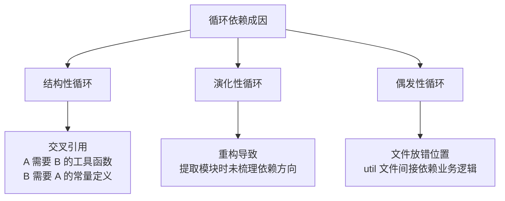
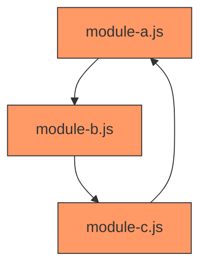
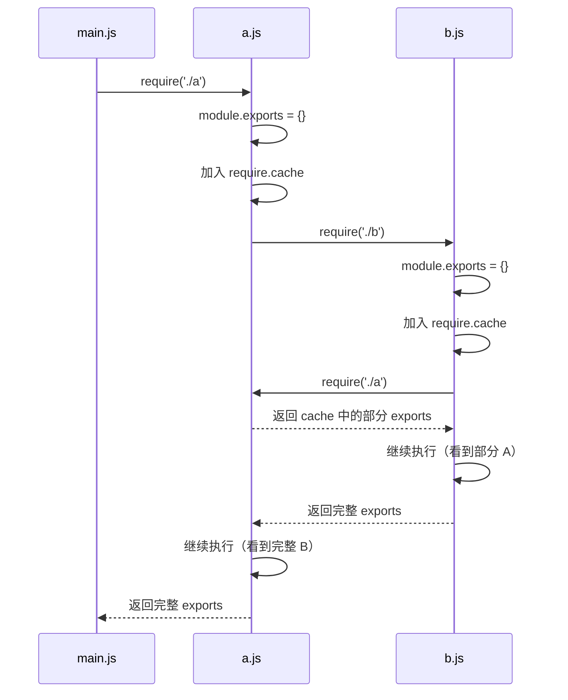
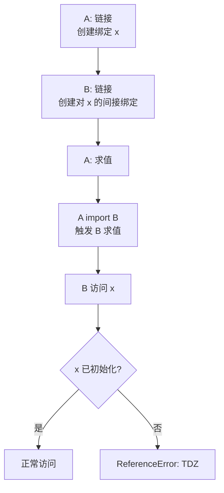
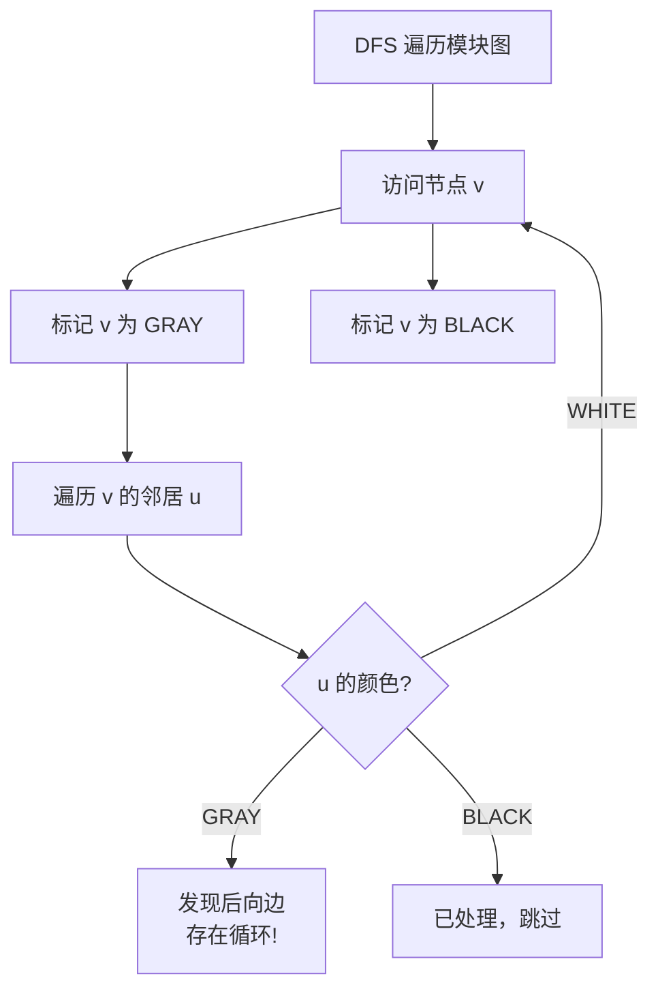
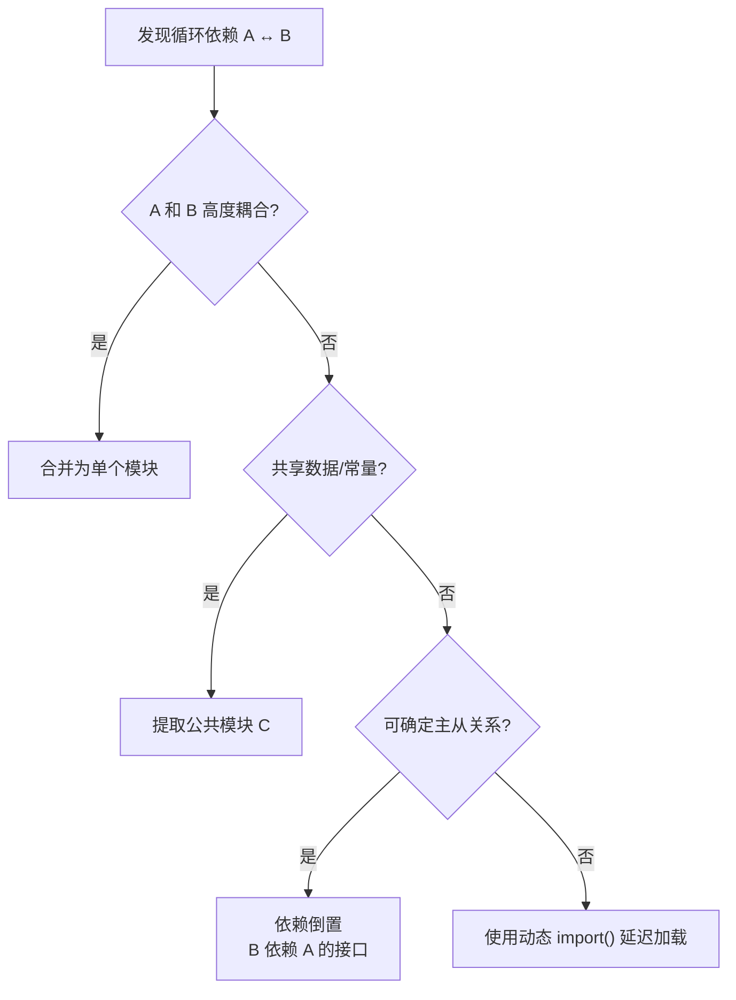
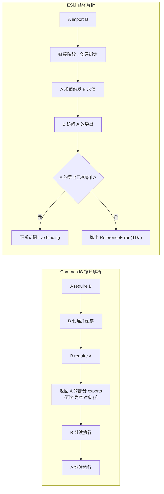

# 循环依赖深度解析

> **形式化定义**：循环依赖（Cyclic Dependency，又称 Circular Dependency）是指模块依赖图（Module Dependency Graph）中存在有向环（Directed Cycle）的现象，即存在模块序列 `M₁, M₂, ..., Mₙ` 使得 `M₁ → M₂ → ... → Mₙ → M₁`，其中 `A → B` 表示模块 `A` 导入模块 `B`。循环依赖在 CJS 和 ESM 中均被允许，但其语义表现截然不同：CJS 基于**部分导出（Partial Exports）**和缓存优先机制，ESM 基于**暂时性死区（Temporal Dead Zone, TDZ）**和间接绑定机制。
>
> 对齐版本：Node.js 22+ | ECMAScript 2025 (ES16) | TypeScript 5.8–6.0

---

## 1. 概念定义 (Concept Definition)

### 1.1 形式化定义

设模块图为有向图 `G = (V, E)`，其中 `V` 为模块集合，`E` 为导入关系集合。若存在顶点序列 `v₁, v₂, ..., vₙ` 满足：

```
(v₁, v₂) ∈ E, (v₂, v₃) ∈ E, ..., (vₙ₋₁, vₙ) ∈ E, (vₙ, v₁) ∈ E
```

则称 `G` 存在循环依赖，该序列为一个长度为 `n` 的有向环。

**关键观察**：循环依赖不等于错误。ECMA-262 和 Node.js 均明确允许循环依赖存在。问题在于循环依赖中的模块在对方完成初始化前被访问，可能导致**不完整状态（Incomplete State）**或**暂时性死区错误（TDZ Error）**。

### 1.2 循环依赖的成因分类



---

## 2. 属性与特征 (Properties & Characteristics)

### 2.1 CJS vs ESM 循环依赖行为矩阵

| 特性 | CommonJS | ESM |
|------|----------|-----|
| 检测时机 | 运行时 `require()` | 链接阶段 (Linking Phase) |
| 未完成模块的导出 | 部分 `module.exports`（已执行部分） | 绑定进入 TDZ（访问抛错） |
| 默认导出类型 | 对象（可部分填充） | 绑定引用（未初始化时不可访问） |
| 是否允许 | 允许 | 允许 |
| 调试难度 | 困难（静默拿到 undefined） | 较易（显式 ReferenceError） |
| 消除策略 | 重构为单向依赖或事件驱动 | 重构为单向依赖或动态 `import()` |

### 2.2 循环依赖结果真值表

| 场景 | CJS 结果 | ESM 结果 | 风险等级 |
|------|---------|---------|---------|
| A 导入 B 的已完成导出 | 正常 | 正常 | 低 |
| A 在顶部导入 B，B 在顶部导入 A | 部分对象 | TDZ / 错误 | 高 |
| A 在函数内 `require` B，B 导入 A | 正常（延迟加载） | 不适用 | 低 |
| A 动态 `import()` B，B 导入 A | 不适用 | 可能正常（异步解耦） | 中 |

---

## 3. 关系分析 (Relationship Analysis)

### 3.1 循环依赖在模块图中的表示



### 3.2 CJS 循环依赖的执行时序



---

## 4. 机制解释 (Mechanism Explanation)

### 4.1 CJS 循环依赖的缓存机制

CJS 处理循环依赖的核心在于**先缓存后执行**：

```
LoadModule(path):
  module ← new Module(path)
  require.cache[path] ← module    // 关键：执行前加入缓存
  module.load(path)               // 执行模块代码
  return module.exports
```

当模块 `B` 在 `A` 尚未执行完毕时 `require('./A')`，`require.cache` 已包含 `A` 的条目（虽然 `A.exports` 可能还是空对象 `{}`）。因此 `B` 获得的是 `A` 的**部分导出**。

### 4.2 ESM 循环依赖的 TDZ 机制

ESM 在链接阶段（Instantiation Phase）为所有导出创建绑定，但尚未求值（Evaluation）。若模块 `A` 和 `B` 循环依赖：

1. 链接阶段：`A` 为 `export let x = 1` 创建绑定 `x_A`，`B` 为 `import { x } from './A'` 创建间接绑定指向 `x_A`
2. 求值阶段：假设 `A` 先于 `B` 执行。`A` 执行到 `import { y } from './B'` 时，触发 `B` 的求值
3. `B` 执行时若访问 `x`，由于 `x_A` 已初始化（`A` 已执行到赋值语句），值正常
4. 但若 `A` 的 `x` 声明在 `import './B'` 之后，`B` 访问 `x` 时 `x_A` 仍处于 TDZ，抛出 `ReferenceError`



---

## 5. 论证分析 (Argumentation Analysis)

### 5.1 循环依赖为何难以消除

**前提 1**：模块化的目标是高内聚、低耦合。
**前提 2**：高内聚要求相关逻辑放在同一模块或相邻模块。
**前提 3**：当两个紧密相关的领域互相需要对方的抽象时，自然形成双向依赖。

**推理**：纯粹的树形依赖结构（DAG）是理想状态，但在复杂业务系统中，完全消除循环依赖可能导致：

- 过度细粒度的模块拆分
- 接口膨胀（为打破循环而引入不必要的抽象层）
- 维护成本上升

**结论**：工程实践中允许**受控的循环依赖**存在，但应通过工具监控，确保循环不导致运行时错误。

### 5.2 重构策略对比

| 策略 | 适用场景 | 代价 | 效果 |
|------|---------|------|------|
| 提取公共模块 | A↔B 共享常量/类型 | 新增文件 | 彻底消除循环 |
| 依赖倒置 | A 需要 B 的具体实现 | 引入接口层 | 反转依赖方向 |
| 事件驱动 | A 和 B 需互相通知 | 异步复杂度 | 解耦为发布-订阅 |
| 动态导入 | 仅部分场景需要对方 | 异步引入 | 打破静态循环 |
| 合并模块 | A 和 B 高度耦合 | 模块变大 | 循环变为内部 |

### 5.3 何时循环依赖可被接受

并非所有循环依赖都是代码异味（Code Smell）。在特定架构模式下，循环依赖不仅是可接受的，甚至是**必要的**：

**插件架构（Plugin Architecture）**

在插件系统中，核心系统加载插件，插件又回调核心系统的 API，形成自然的双向依赖：

```javascript
// core.js
import { PluginManager } from "./plugin-manager.js";
export class Core {
  plugins = new PluginManager(this); // 将 core 实例注入插件管理器
  register(plugin) { this.plugins.load(plugin); }
}

// plugin-manager.js
import type { Core } from "./core.js"; // 类型层面的循环
export class PluginManager {
  constructor(private core: Core) {}
  load(plugin) { plugin.init(this.core); } // 插件通过 core API 与系统交互
}
```

此处的循环是**架构层面的必要耦合**：插件必须了解 Core 的接口才能扩展功能，而 Core 必须知道 PluginManager 才能调度插件。此类循环应被限制在**单一职责边界内**，并通过接口隔离（Interface Segregation）降低风险。

**其他可接受场景**：

- **相互递归的数据结构**：如 AST 节点（`Expression` ↔ `Statement`）
- **状态机与上下文**：状态机引用上下文，上下文引用状态机以触发转移
- **双向关联的领域模型**：如 `Order` ↔ `Customer`（通过 ORM 延迟加载管理）

**管理原则**：

1. 将循环限制在**同一抽象层级**内，禁止跨层循环
2. 使用**接口或类型导入**而非值导入，降低运行时耦合
3. 通过工具持续监控，确保循环数量不随项目增长而失控

---

## 6. 形式证明 (Formal Proof)

### 6.1 公理化基础

**公理 18（CJS 部分导出保证）**：在 CJS 循环依赖中，后进入的模块总能获得先进入模块的 `module.exports` 对象引用，即使该对象尚未完全填充。

**公理 19（ESM TDZ 保证）**：在 ESM 循环依赖中，若模块 `B` 在模块 `A` 的 `export` 绑定初始化前访问该绑定，引擎必定抛出 `ReferenceError`。

**公理 20（循环检测可能性）**：模块依赖图的有向环可通过深度优先搜索（DFS）的后向边（Back Edge）检测，时间复杂度为 `O(|V| + |E|)`。

### 6.2 定理与证明

**定理 11（CJS 循环依赖的一致性上限）**：在 CJS 循环依赖中，若模块 `A` 和 `B` 互相导入，且均在模块顶部执行 `require`，则 `A` 获得的 `B.exports` 和 `B` 获得的 `A.exports` 至多有一个是完全填充的。

*证明*：设执行从 `A` 开始。`A` 被创建并加入缓存，开始执行。`A` 执行到 `require('./B')` 时，`B` 被创建、加入缓存、开始执行。`B` 执行到 `require('./A')` 时，返回已缓存的 `A`（此时 `A` 尚未执行完毕）。因此 `B` 获得部分 `A`。`B` 完成后返回给 `A`，此时 `A` 获得完整的 `B`。但 `B` 永远只能获得部分的 `A`。∎

**定理 12（ESM 循环依赖的 TDZ 避免条件）**：在 ESM 循环依赖中，若模块 `A` 导出绑定 `x`，模块 `B` 导入 `x`，则 `B` 能安全访问 `x` 的充要条件是 `A` 的 `x` 初始化表达式在 `A` 触发 `B` 求值的 `import` 语句之前完成求值。

*证明*：ESM 的求值按后序遍历进行。`A` 被求值时，若 `A` 包含 `import './B'`，则 `B` 的求值被触发。此时 `A` 的执行暂停，`B` 开始执行。若 `A` 的 `export let x = expr` 已执行，则 `x` 绑定已初始化，`B` 访问安全。若该语句在 `import './B'` 之后，则 `B` 执行时 `x` 仍处于 TDZ，访问抛错。∎

---

## 7. 实例示例 (Examples)

### 7.1 CJS 循环依赖正例（函数内延迟加载）

```javascript
// a.js
const bHelpers = require("./b"); // 顶部导入，可能拿到部分导出

exports.getData = function() {
  // 函数执行时，b.js 已完成初始化
  return bHelpers.process("raw");
};

// b.js
exports.process = function(data) {
  const a = require("./a"); // 函数内延迟加载
  return a.getData() + ":processed"; // 安全，因为 getData 已定义
};
```

### 7.2 反例：CJS 顶部互相 `require` 导致 undefined

```javascript
// a.js
const b = require("./b");
module.exports = { name: "a", bName: b.name }; // b.name 可能是 undefined！

// b.js
const a = require("./a");
module.exports = { name: "b", aName: a.name }; // a.name 也可能是 undefined！
```

### 7.3 ESM 循环依赖与 TDZ

```javascript
// a.mjs
import { y } from "./b.mjs";
export let x = 1;
// 若 b.mjs 访问 x：正常，因为 x 已初始化

// 危险版本：
// a.mjs
import { y } from "./b.mjs"; // 触发 b 求值
export let x = y + 1;        // 若 b 访问 x，TDZ！因为此语句尚未执行
```

---

## 8. 权威参考 (References)

| 来源 | 链接 | 相关章节 |
|------|------|---------|
| Node.js CJS Cycles | nodejs.org/api/modules.html#cycles | Cycles |
| ECMA-262 ESM | tc39.es/ecma262/#sec-moduleevaluation | Module Evaluation |
| madge | github.com/pahen/madge | Circular dependency detection |
| dependency-cruiser | github.com/sverweij/dependency-cruiser | Architecture validation |

---

## 9. 思维表征 (Mental Representations)

### 9.1 循环依赖检测算法（DFS）



### 9.2 重构策略决策树



### 9.3 CJS vs ESM 循环解析对比图



---

## 10. 版本演进 (Version Evolution)

### 10.1 循环依赖检测工具矩阵

| 工具 | 检测能力 | 输出格式 | 集成方式 | 适用场景 |
|------|---------|---------|---------|---------|
| madge | CJS/ESM/TS | 文本/JSON/Graphviz/GUI | CLI/API | 快速诊断 |
| dependency-cruiser | CJS/ESM/TS | 多种报告 | CLI/CI | 架构规则校验 |
| eslint-plugin-import | ESM/CJS | ESLint 报告 | ESLint 插件 | 编码时实时提示 |
| webpack | ESM/CJS | 构建警告 | 打包器内置 | 构建时检测 |
| Rollup | ESM | 构建警告 | 打包器内置 | ESM 项目 |

### 10.2 Node.js 循环依赖行为演进

| 版本 | 特性 | 说明 |
|------|------|------|
| Node.js 0.x–至今 | CJS 循环依赖 | 基于缓存的部分导出机制未变 |
| Node.js 12+ | ESM 循环依赖 | TDZ 行为标准化 |
| Node.js 20+ | `--experimental-detect-module` | 自动检测 ESM，减少循环歧义 |

---

**参考规范**：Node.js Modules: Cycles | ECMA-262 §16.2.1.5 (Evaluate) | madge documentation
