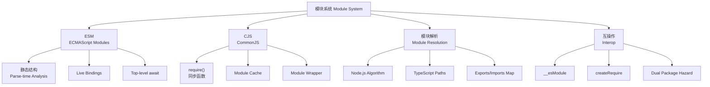

# 08 模块系统 (Module System)

> 本专题深入探讨 JavaScript/TypeScript 的模块系统，从 ECMAScript Modules (ESM) 到 CommonJS (CJS)，从浏览器到 Node.js/Deno/Bun 的运行时差异，涵盖模块解析、循环依赖、CJS/ESM 互操作、TypeScript 模块解析策略等核心概念。所有文档对齐 ECMA-262 第16版（ES2025）和 TypeScript 6.0 模块系统。
>
> 模块系统是现代 JavaScript 工程的基石，理解其形式语义和运行时行为是构建可维护大型应用的前提。

---

## 专题结构

| # | 文件 | 主题 | 核心概念 |
|---|------|------|---------|
| 01 | [01-module-system-overview.md](./01-module-system-overview.md) | 模块系统概述 | IIFE → AMD → CJS → UMD → ESM 演进、封装与复用 |
| 02 | [02-esm-deep-dive.md](./02-esm-deep-dive.md) | ESM 深度机制 | 静态结构、Live Bindings、Top-level await、Import Attributes/Defer/Text |
| 03 | [03-commonjs-mechanics.md](./03-commonjs-mechanics.md) | CommonJS 机制 | require()、Module Wrapper、Module Cache、exports 语义 |
| 04 | [04-cjs-esm-interop.md](./04-cjs-esm-interop.md) | CJS/ESM 互操作 | __esModule、createRequire、Dual Package Hazard、Conditional Exports |
| 05 | [05-module-resolution.md](./05-module-resolution.md) | 模块解析算法 | Node.js Resolution、Path Mapping、Subpath Imports、Exports Map |
| 06 | [06-cyclic-dependencies.md](./06-cyclic-dependencies.md) | 循环依赖 | CJS vs ESM 处理差异、检测工具、重构策略 |

---

## 核心概念图谱

---

## 版本对齐

- **ECMAScript**: 2025 (ES16) — Import Attributes Stage 4, Import Defer/Text/Source Phase Stage 3
- **TypeScript**: 5.8–6.0 — `moduleResolution: "nodenext"`, `baseUrl` 移除
- **Node.js**: 22+ / 24 LTS — `--experimental-strip-types`, ESM 稳定
- **Deno**: 2.7 — 原生 ESM + npm 兼容
- **Bun**: 1.3.x — 最快的 ESM/CJS 混合运行时

---

## 权威参考

| 来源 | 链接 |
|------|------|
| ECMA-262 §16.2 Modules | tc39.es/ecma262 |
| Node.js Module API |nodejs.org/api/modules.html |
| TypeScript Module Resolution | typescriptlang.org/docs/handbook/module-resolution.html |
| WinterTC / Ecma TC55 | wintertc.org |

---

## 关联专题

- **06 规范基础** — 模块加载的抽象操作和规范算法
- **07 JS/TS 对称差** — ESM/CJS 在 JS 和 TS 中的语义差异
- **jsts-code-lab/12-package-management** — 包管理与模块的实战
