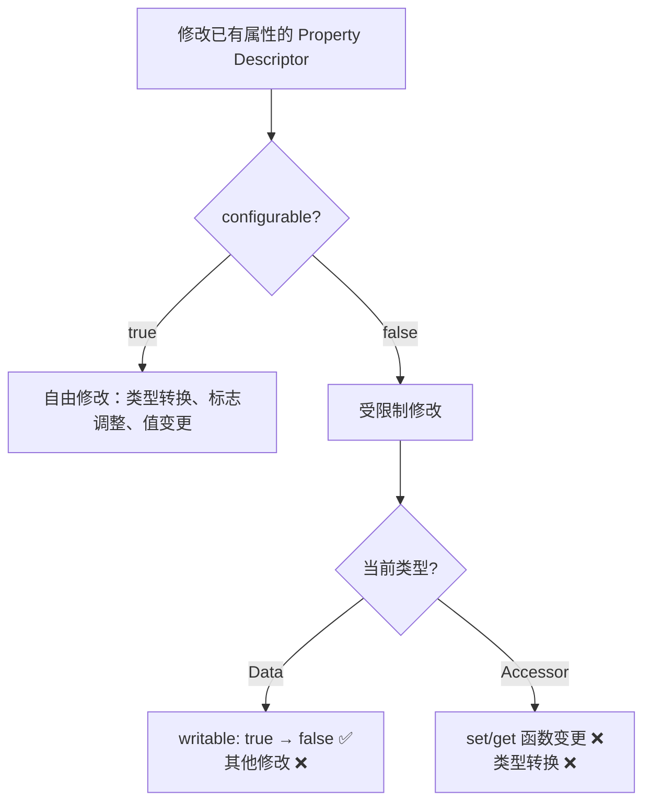
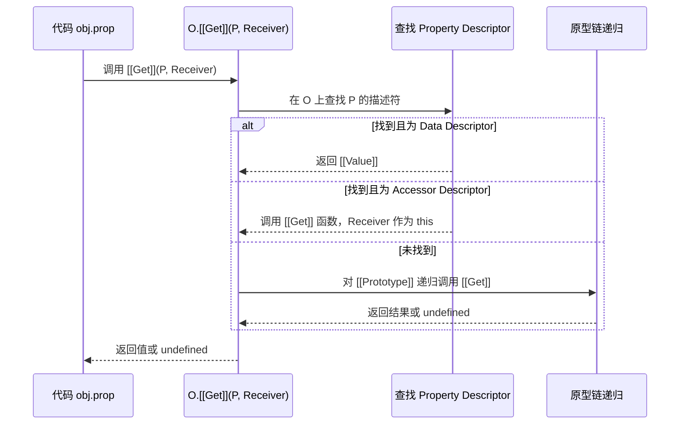
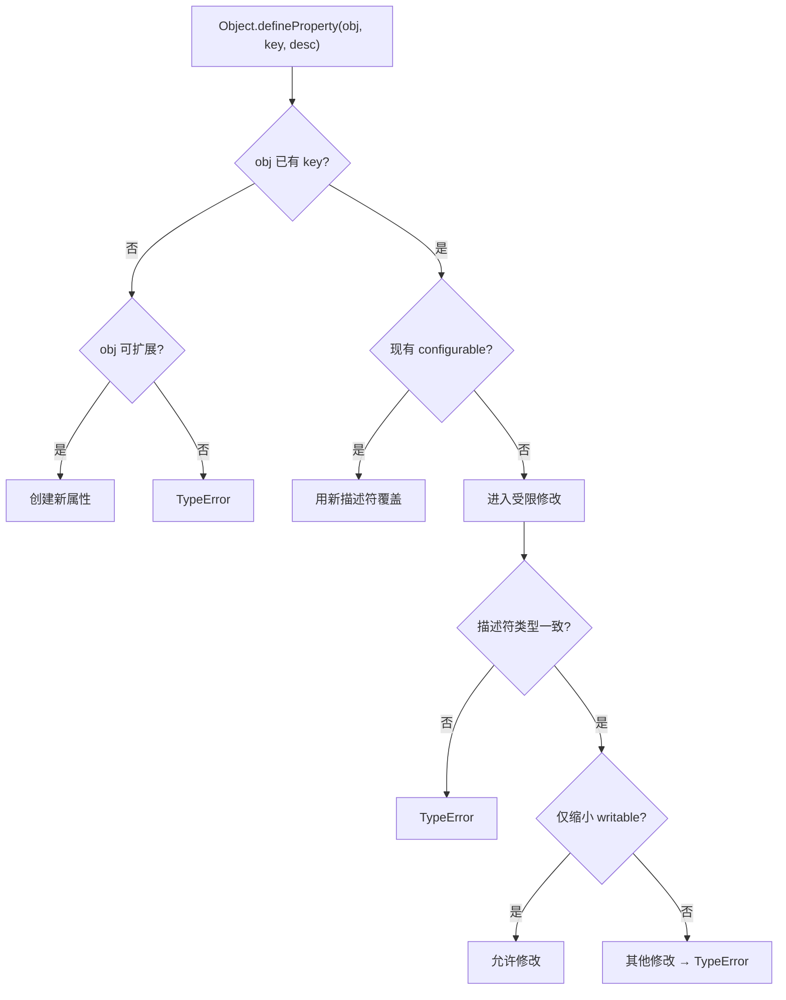
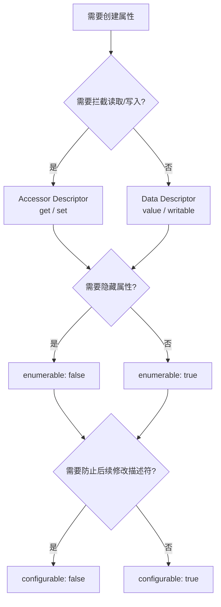

# 对象模型总览

> **形式化定义**：ECMAScript 对象是一个属性的集合（collection of properties），每个属性是一个键（key）到值（value）的映射，并附加一组属性特征（Property Attributes）。对象内部具有 `[[Prototype]]` 内部槽（internal slot），指向其原型对象，构成原型链（Prototype Chain）。Property Descriptor 是 ECMAScript 规范用于抽象属性元数据的规范类型（specification type），分为数据描述符（Data Descriptor）和访问器描述符（Accessor Descriptor）。
>
> 对齐版本：ECMAScript 2025 (ES16) | TypeScript 5.8–6.0 | TS 7.0 Go 编译器预览

---

## 1. 概念定义 (Concept Definition)

### 1.1 形式化定义

ECMA-262 §6.1.7 定义了语言的**对象类型（Object Type）**：

> *"An Object is logically a collection of properties. Each property is either a data property, or an accessor property."* — ECMA-262 §6.1.7

一个 ECMAScript 对象在规范层面可形式化为四元组：

```
Object = ⟨ Properties, [[Prototype]], [[Extensible]], [[PrivateElements]] ⟩
```

其中：
- **Properties**：属性的有限集合，每个属性为 `⟨ Key, Descriptor ⟩` 对
- **[[Prototype]]**：内部槽，指向原型对象或 `null`
- **[[Extensible]]**：布尔标志，表示是否允许新增属性
- **[[PrivateElements]]**：私有元素列表（ES2022+）

### 1.2 Property Descriptor 规范类型

ECMA-262 §6.1.7.1 定义了 Property Descriptor 为规范记录的子类型：

```
Data Descriptor = ⟨ [[Value]], [[Writable]], [[Enumerable]], [[Configurable]] ⟩
Accessor Descriptor = ⟨ [[Get]], [[Set]], [[Enumerable]], [[Configurable]] ⟩
```

| 字段 | 类型 | 适用描述符 | 语义 |
|------|------|-----------|------|
| `[[Value]]` | ECMAScript language value | Data | 属性存储的值 |
| `[[Writable]]` | Boolean | Data | 是否允许通过赋值修改 `[[Value]]` |
| `[[Get]]` | Object / Undefined | Accessor | getter 函数或 `undefined` |
| `[[Set]]` | Object / Undefined | Accessor | setter 函数或 `undefined` |
| `[[Enumerable]]` | Boolean | Both | 是否可通过 `for...in` 枚举 |
| `[[Configurable]]` | Boolean | Both | 是否可删除属性或修改描述符 |

### 1.3 核心概念图谱

```mermaid
mindmap
  root((对象模型 Object Model))
    属性集合
      Data Property
        value
        writable
      Accessor Property
        get
        set
      公共属性
        enumerable
        configurable
    原型链
      [[Prototype]]
      Object.prototype
      null 终止
    对象完整性
      preventExtensions
      seal
      freeze
    属性操作
      普通赋值
      Object.defineProperty
      Reflect.defineProperty
```

---

## 2. 属性与特征 (Properties & Characteristics)

### 2.1 数据描述符 vs 访问器描述符矩阵

| 维度 | 数据描述符 | 访问器描述符 |
|------|-----------|-------------|
| 核心特征 | `value` + `writable` | `get` + `set` |
| 值存储位置 | 对象内部槽 | 闭包/外部变量（由 getter/setter 决定） |
| 赋值行为 | 直接修改 `[[Value]]` | 调用 `[[Set]]` 函数 |
| 读取行为 | 直接返回 `[[Value]]` | 调用 `[[Get]]` 函数 |
| `writable: false` 效果 | 赋值静默失败（strict mode 抛 TypeError） | 不适用（无 `writable`） |
| `configurable: false` 效果 | 禁止删除、禁止修改描述符 | 禁止删除、禁止修改描述符 |
| 两种描述符是否可互转 | ⚠️ 有限制（见下方引理） | ⚠️ 有限制 |

### 2.2 描述符转换规则（引理）

**引理 2.1**：若某属性当前为数据描述符且 `configurable: false`，则不能将其转换为访问器描述符。

**引理 2.2**：若某属性当前为访问器描述符且 `configurable: false`，则不能将其转换为数据描述符。

**引理 2.3**：对于 `configurable: false` 的数据描述符，`writable` 只能从 `true` 改为 `false`，不可反向。



### 2.3 对象完整性层级（Integrity Levels）

ECMAScript 定义了三种对象完整性操作，形成递进约束：

| 完整性级别 | 新增属性 | 删除属性 | 修改值 | 修改描述符 | 检测方法 |
|-----------|---------|---------|--------|-----------|---------|
| 普通对象 | ✅ | ✅ | ✅ | ✅ | — |
| `preventExtensions` | ❌ | ✅ | ✅ | ✅ | `Object.isExtensible` |
| `seal` | ❌ | ❌ | ✅ (writable) | ❌ | `Object.isSealed` |
| `freeze` | ❌ | ❌ | ❌ | ❌ | `Object.isFrozen` |

**定理 3.1**：`freeze(O)` 的语义等价于 `seal(O)` 后再将所有数据属性的 `writable` 设为 `false`。

**证明**：
1. `Object.seal(O)` 将 `[[Extensible]]` 设为 `false`，并将所有属性的 `configurable` 设为 `false`。
2. `Object.freeze(O)` 执行与 `seal` 相同的操作，并额外将所有数据属性的 `writable` 设为 `false`。
3. 因此 `freeze(O)` 的约束集是 `seal(O)` 约束集的超集，且额外包含值不可变性约束。∎

---

## 3. 机制解释 (Mechanism Explanation)

### 3.1 属性赋值 vs `Object.defineProperty`

ECMAScript 区分两种属性创建/修改路径：

| 机制 | 语法 | 创建时默认值 | 修改范围 | 触发陷阱 |
|------|------|------------|---------|---------|
| 属性赋值 | `obj.x = 1` | `writable: true`, `enumerable: true`, `configurable: true` | 仅修改 `[[Value]]`（若 writable） | `handler.set()` |
| `Object.defineProperty` | `Object.defineProperty(obj, 'x', { value: 1 })` | **全部 `false`** | 可修改完整描述符 | `handler.defineProperty()` |

**关键差异**：`Object.defineProperty` 在未显式指定 `writable`/`enumerable`/`configurable` 时默认设为 `false`，而普通赋值创建的属性这三个标志均为 `true`。

### 3.2 属性读取与写入的规范流程

根据 ECMA-262 §10.1，Ordinary Object 的 `[[Get]]` 和 `[[Set]]` 内部方法遵循以下流程：



### 3.3 `Object.defineProperty` 的决策树



---

## 4. 实例示例 (Examples)

### 4.1 数据描述符与访问器描述符的正反例

**正例**：使用 getter/setter 实现计算属性与校验

```typescript
const rect = {
  width: 10,
  height: 5,
  get area() {
    return this.width * this.height;
  },
  set area(value: number) {
    // 只读计算属性：setter 可抛出错误或忽略
    throw new TypeError("area is read-only");
  },
};
```

**反例**：试图将 non-configurable 数据属性转为访问器属性

```typescript
const obj: Record<string, any> = {};
Object.defineProperty(obj, "x", { value: 1, writable: false, configurable: false });
// 以下操作抛出 TypeError
// Object.defineProperty(obj, "x", { get() { return 1; } });
```

### 4.2 对象完整性边缘案例

**边缘案例 1**：`freeze` 仅冻结直接属性，不递归冻结嵌套对象

```typescript
const nested = { inner: { value: 42 } };
Object.freeze(nested);
nested.inner.value = 100; // ✅ 成功！inner 对象未被冻结
```

**边缘案例 2**：`Object.freeze` 在严格模式与非严格模式下的差异

```typescript
"use strict";
const frozen = Object.freeze({ x: 1 });
frozen.x = 2; // TypeError: Cannot assign to read-only property
```

在非严格模式下，上述赋值静默失败（silently fail），不抛出异常。

### 4.3 `defineProperty` 默认值陷阱

```typescript
const obj2: Record<string, any> = {};
Object.defineProperty(obj2, "hidden", { value: "secret" });

console.log(obj2.hidden); // "secret"
console.log(Object.keys(obj2)); // [] —— enumerable 默认为 false！
obj2.hidden = "leaked"; // 静默失败（strict 下 TypeError）—— writable 默认为 false！
```

---

## 5. 权威参考 (References)

### ECMA-262 规范

| 章节 | 主题 |
|------|------|
| §6.1.7 | The Object Type |
| §6.1.7.1 | Property Attributes |
| §10.1.5 | `[[DefineOwnProperty]]` |
| §10.1.8 | `[[Get]]` |
| §10.1.9 | `[[Set]]` |
| §20.1.2 | Object Constructor Properties |

### MDN Web Docs

- **MDN: Property descriptors** — <https://developer.mozilla.org/en-US/docs/Web/JavaScript/Reference/Global_Objects/Object/defineProperty>
- **MDN: Object.freeze** — <https://developer.mozilla.org/en-US/docs/Web/JavaScript/Reference/Global_Objects/Object/freeze>
- **MDN: Object.seal** — <https://developer.mozilla.org/en-US/docs/Web/JavaScript/Reference/Global_Objects/Object/seal>

### 学术参考

- **Pierce, B. C. (2002). "Types and Programming Languages". MIT Press.** — 类型系统与对象模型的形式语义
- **Agha, G. (1986). "Actors: A Model of Concurrent Computation in Distributed Systems". MIT Press.** — 消息传递与对象行为的早期形式化模型

---

## 6. 版本演进 (Version Evolution)

| ES 版本 | 特性 | 说明 |
|---------|------|------|
| ES1 (1997) | 基础对象模型 | `Object`、`prototype` 链 |
| ES5 (2009) | Property Descriptor | `Object.defineProperty`、`getOwnPropertyDescriptor`、freeze/seal |
| ES2015 (ES6) | Symbol 键 | 对象属性键扩展为 `String | Symbol` |
| ES2022 (ES13) | Private Elements | `#private` 字段、私有方法、私有 getter/setter |
| ES2025 (ES16) | Decorator Metadata | 类装饰器与元数据（Stage 3 → 标准） |

| TS 版本 | 特性 | 说明 |
|---------|------|------|
| TS 1.x | `readonly` 修饰符 | 编译时属性只读检查 |
| TS 3.8 | `#private` 支持 | 编译到 WeakMap 或原生私有字段 |
| TS 4.3 | `override` 关键字 | 显式标记方法覆盖 |
| TS 5.x | `--erasableSyntaxOnly` | 仅擦除语法，不转换运行时语义 |

---

## 7. 思维表征 (Mental Representation)

### 7.1 对象结构的多维矩阵

| 维度 | 可变性 | 可见性 | 可枚举性 | 可配置性 |
|------|--------|--------|---------|---------|
| 普通数据属性 | ✅ | ✅ | ✅ | ✅ |
| `writable: false` | ❌ | ✅ | ✅ | ✅ |
| `enumerable: false` | ✅ | ✅ | ❌ | ✅ |
| `configurable: false` | ⚠️ 受限 | ✅ | ⚠️ 不可改 | ❌ |
| `seal` 后 | ⚠️ writable 决定 | ✅ | ⚠️ 不可改 | ❌ |
| `freeze` 后 | ❌ | ✅ | ⚠️ 不可改 | ❌ |

### 7.2 描述符创建决策树



---

## 8. Trade-off 与 Pitfalls

### 8.1 `defineProperty` 的性能成本

在 V8 等现代引擎中，使用 `defineProperty` 创建大量具有复杂描述符的对象会触发**字典模式（Dictionary Mode）**，导致 Inline Caching（IC）失效，属性访问性能下降 5–10 倍。对于高频访问的热路径对象，优先使用普通属性赋值。

### 8.2 `freeze` 的浅层语义

`Object.freeze` 只冻结对象的直接属性，不递归处理嵌套对象。若需要深层不可变性，需手动递归 freeze 或使用 Immutable.js、Immer 等库。

### 8.3 `configurable: false` 的不可逆性

一旦将属性设为 `configurable: false`，后续无法恢复为 `configurable: true`，也无法删除该属性。此操作具有**单向性**，在设计 API 时需谨慎。
