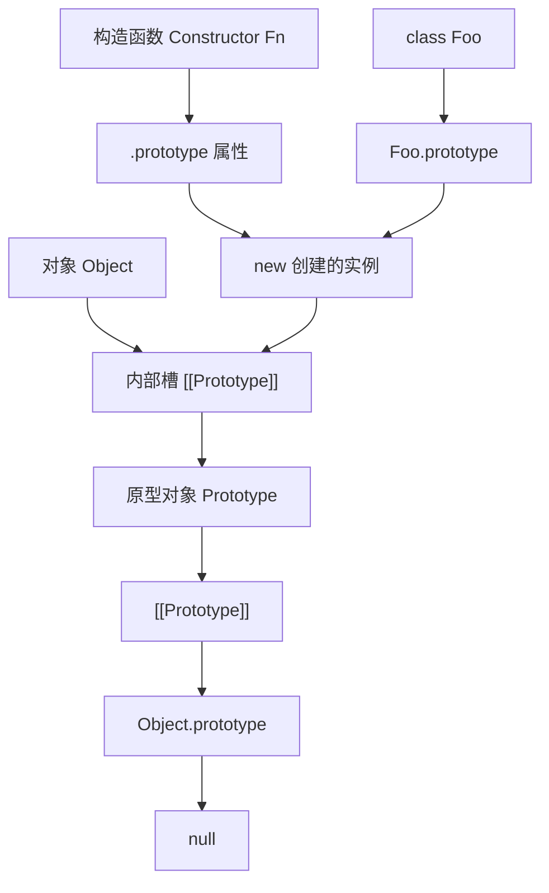
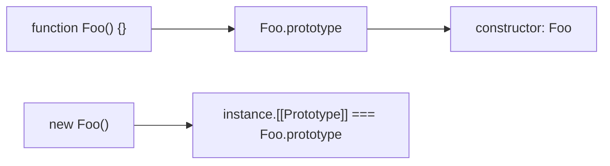
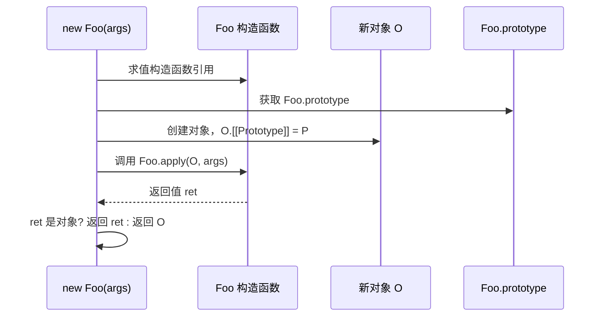
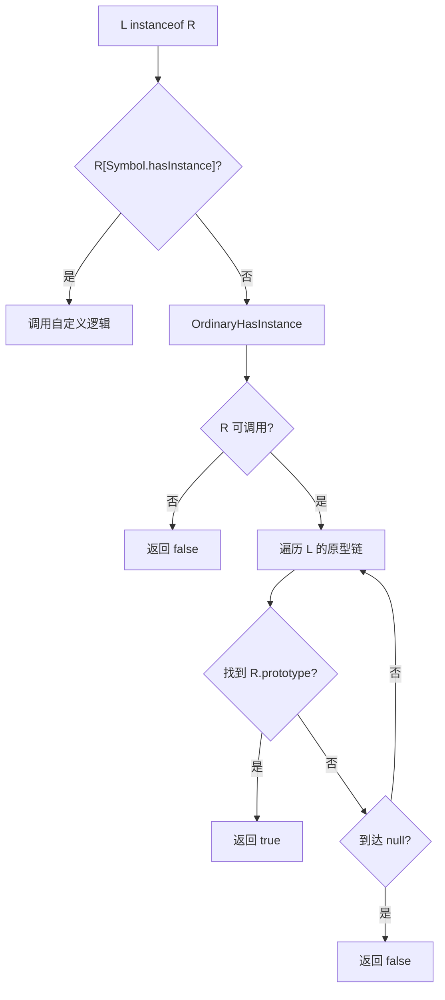
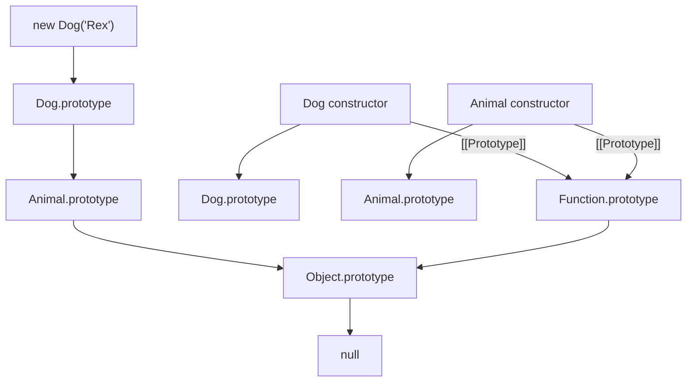
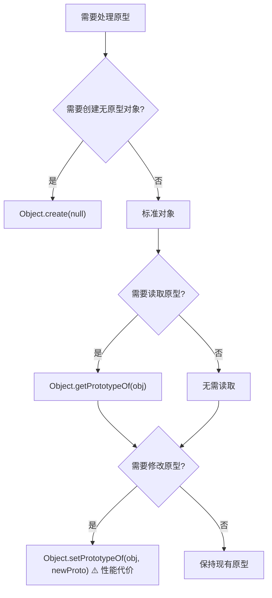

# 原型链深入

> **形式化定义**：ECMAScript 中每个对象（除 `Object.create(null)` 和 `null` 原型对象外）都有一个内部槽 `[[Prototype]]`，其值为 `null` 或另一个对象。当访问对象的属性时，若对象自身不存在该属性，引擎将递归地在 `[[Prototype]]` 指向的对象上查找，此链接结构称为**原型链（Prototype Chain）**。原型链终止于 `null`，而 `Object.prototype` 是所有普通对象的最终原型。
>
> 对齐版本：ECMAScript 2025 (ES16) | TypeScript 5.8–6.0 | TS 7.0 Go 编译器预览

---

## 1. 概念定义 (Concept Definition)

### 1.1 形式化定义

ECMA-262 §6.1.7.2 定义了 `[[Prototype]]` 内部槽：

> *"Every object has an internal slot named `[[Prototype]]`, whose value is either `null` or an object."* — ECMA-262 §6.1.7.2

**原型链的形式化描述**：

```
设 obj 为一个对象，定义 PrototypeChain(obj) 为有限序列：

PrototypeChain(obj) = [obj, obj.[[Prototype]], obj.[[Prototype]].[[Prototype]], ..., null]

约束条件：
- 序列长度有限（无环）
- 最后一个元素为 null
- 对任意 i, j，若 i ≠ j，则 chain[i] ≠ chain[j]（无环约束）
```

### 1.2 `__proto__` vs `Object.getPrototypeOf()`

| 维度 | `__proto__` | `Object.getPrototypeOf()` |
|------|-------------|---------------------------|
| 规范来源 | Annex B（遗留特性） | ES5 标准（§20.1.2.11） |
| 实现机制 | `Object.prototype` 上的 accessor property | 内部方法 `[[GetPrototypeOf]]` 的直接暴露 |
| 可删除性 | ✅ 可被 `delete` 移除 | ❌ 全局静态方法，不可删除 |
| CSP 兼容性 | ⚠️ 某些安全策略下禁用 | ✅ 始终可用 |
| 语义稳定性 | ⚠️ 可被对象同名属性遮蔽 | ✅ 直接读取内部槽 |
| 现代推荐度 | ⭐ | ⭐⭐⭐⭐⭐ |

**定理 1.1**：对于任意普通对象 `O`，在 `__proto__` 未被覆盖且未被删除的条件下，`O.__proto__ === Object.getPrototypeOf(O)`。

**证明**：`O.__proto__` 继承自 `Object.prototype.__proto__`，其 getter 调用 `O.[[GetPrototypeOf]]()`，与 `Object.getPrototypeOf(O)` 的算法完全一致。∎

### 1.3 核心概念图谱



---

## 2. 属性与特征 (Properties & Characteristics)

### 2.1 构造函数与 `.prototype` 属性

每个函数对象（包括 `class` 的 constructor）在创建时自动拥有一个 `prototype` 属性，该属性是一个普通对象，带有 `constructor` 属性回指函数本身。



**关键区分**：

| 概念 | 所属对象 | 类型 | 语义 |
|------|---------|------|------|
| `Foo.prototype` | 函数 `Foo` | 普通对象 | 新实例的默认原型 |
| `instance.__proto__` | 实例 `instance` | 内部槽的暴露 | 指向创建时的原型 |
| `Foo.__proto__` | 函数 `Foo` | 内部槽 | 指向 `Function.prototype` |

### 2.2 `new` 运算符的规范语义

ECMA-262 §13.2.2 定义了 `new` 的求值流程：

```
1. 获取构造函数的 prototype 属性值（对象或 null）
2. 创建新对象 O，设置 O.[[Prototype]] = prototype
3. 以 O 为 this 调用构造函数
4. 若构造函数返回对象，则返回该对象；否则返回 O
```



### 2.3 `instanceof` 与 `Symbol.hasInstance`

`instanceof` 的规范语义并非检查原型链，而是调用右侧对象的 `@@hasInstance` 方法（§13.5.8）：

```
L instanceof R:
  1. 获取 R[Symbol.hasInstance]
  2. 若存在，则调用并返回 Boolean(result)
  3. 否则执行 OrdinaryHasInstance(R, L):
     a. 若 R 不可调用，返回 false
     b. 获取 R.prototype
     c. 遍历 L 的原型链，若存在 prototype === R.prototype，返回 true
     d. 到达 null，返回 false
```



**关键洞察**：`instanceof` 检查的是**原型链上的原型对象是否严格等于构造函数的 `prototype` 属性**，而非检查构造函数本身。若 `Foo.prototype` 被重新赋值，则之前创建的实例的 `instanceof Foo` 结果可能改变。

---

## 3. 机制解释 (Mechanism Explanation)

### 3.1 Class 语法与原型链（Syntactic Sugar）

ES2015 引入的 `class` 语法本质上是原型继承的语法糖：

```typescript
class Animal {
  constructor(public name: string) {}
  speak() {
    return `${this.name} makes a sound`;
  }
}

class Dog extends Animal {
  speak() {
    return `${this.name} barks`;
  }
}
```

上述代码等价于以下 ES5 模式：

```typescript
function Animal(name: string) {
  this.name = name;
}
Animal.prototype.speak = function () {
  return `${this.name} makes a sound`;
};

function Dog(name: string) {
  Animal.call(this, name);
}
Dog.prototype = Object.create(Animal.prototype);
Dog.prototype.constructor = Dog;
Dog.prototype.speak = function () {
  return `${this.name} barks`;
};
```

**原型链结构**：



### 3.2 `isPrototypeOf()` 的语义

`isPrototypeOf()` 是 `Object.prototype` 上的方法，用于判断某对象是否出现在另一对象的原型链中：

```
A.isPrototypeOf(B)  ⟺  存在对象链 B.[[Prototype]]* 包含 A
```

与 `instanceof` 的区别：

| 特性 | `isPrototypeOf` | `instanceof` |
|------|-----------------|--------------|
| 检查方向 | 正向：原型是否在目标链上 | 反向：目标是否是某构造函数的实例 |
| 对 `null` 原型对象 | ✅ 可工作 | ⚠️ 右侧需为可调用对象 |
| 可定制性 | ❌ 固定语义 | ✅ `Symbol.hasInstance` 可覆盖 |
| 跨 Realm | ✅ 直接比较对象引用 | ⚠️ 不同 Realm 的相同构造函数不通过 |

---

## 4. 实例示例 (Examples)

### 4.1 原型链查找的正例与反例

**正例**：利用原型链共享方法

```typescript
function Person(name: string) {
  this.name = name;
}
Person.prototype.greet = function () {
  return `Hello, ${this.name}`;
};

const alice = new Person("Alice");
console.log(alice.greet()); // "Hello, Alice" — 方法在原型上找到
console.log(alice.hasOwnProperty("greet")); // false
```

**反例**：原型链查找的性能陷阱

```typescript
// 过深的原型链导致属性查找时间复杂度 O(n)
let obj: any = { value: 1 };
for (let i = 0; i < 1000; i++) {
  obj = Object.create(obj);
}
// 访问 obj.value 需要遍历 1000 层原型链
```

### 4.2 `instanceof` 的边缘案例

**边缘案例 1**：跨 Realm（iframe）的构造函数

```typescript
// 假设 iframe 中定义了 MyClass
// const instance = iframe.contentWindow.MyClass();
// instance instanceof MyClass        // false（主窗口的 MyClass !== iframe 的 MyClass）
// iframe.contentWindow.MyClass.prototype.isPrototypeOf(instance) // true
```

**边缘案例 2**：修改构造函数的 `prototype`

```typescript
function Foo() {}
const instance = new Foo();
console.log(instance instanceof Foo); // true

Foo.prototype = {};
console.log(instance instanceof Foo); // false！prototype 引用已改变
```

**边缘案例 3**：`Symbol.hasInstance` 的完全覆盖

```typescript
class FakeArray {
  static [Symbol.hasInstance](instance: any) {
    return Array.isArray(instance);
  }
}

console.log([] instanceof FakeArray); // true（语义被完全重写）
```

### 4.3 `Object.create(null)` 的用途

```typescript
// ✅ 正例：创建无原型字典，避免原型污染攻击
const safeDict = Object.create(null);
safeDict["toString"] = "value"; // 不会与 Object.prototype.toString 冲突
console.log("toString" in safeDict); // true
console.log(safeDict.toString); // "value"
```

---

## 5. 权威参考 (References)

### ECMA-262 规范

| 章节 | 主题 |
|------|------|
| §6.1.7.2 | `[[Prototype]]` Internal Slot |
| §10.1.1 | `[[GetPrototypeOf]]` |
| §10.1.2 | `[[SetPrototypeOf]]` |
| §13.2.2 | The `new` Operator |
| §13.5.8 | The `instanceof` Operator |
| §20.1.3.3 | `Object.prototype.isPrototypeOf` |

### MDN Web Docs

- **MDN: Prototypes** — <https://developer.mozilla.org/en-US/docs/Learn/JavaScript/Objects/Object_prototypes>
- **MDN: Object.getPrototypeOf** — <https://developer.mozilla.org/en-US/docs/Web/JavaScript/Reference/Global_Objects/Object/getPrototypeOf>
- **MDN: instanceof** — <https://developer.mozilla.org/en-US/docs/Web/JavaScript/Reference/Operators/instanceof>
- **MDN: Symbol.hasInstance** — <https://developer.mozilla.org/en-US/docs/Web/JavaScript/Reference/Global_Objects/Symbol/hasInstance>

---

## 6. 版本演进 (Version Evolution)

| ES 版本 | 特性 | 说明 |
|---------|------|------|
| ES1 (1997) | 原型链基础 | `new`、构造函数、`.prototype` |
| ES5 (2009) | 标准原型访问 | `Object.getPrototypeOf`、`Object.create` |
| ES2015 (ES6) | `class` 语法 | 原型继承的 syntactic sugar |
| ES2015 (ES6) | `Symbol.hasInstance` | 可定制的 `instanceof` 行为 |
| ES2022 (ES13) | `class` 私有字段 | 不影响原型链的 `#private` |

---

## 7. 思维表征 (Mental Representation)

### 7.1 原型链长度与查找代价

| 原型链深度 | 平均属性查找代价 | 优化状态 |
|-----------|----------------|---------|
| 1–2 | O(1)（IC 命中） | ✅ Inline Cache 高效 |
| 3–5 | O(1)–O(3) | ⚠️ IC 退化 |
| >10 | O(n) | ❌ 字典模式 / Megamorphic |

### 7.2 原型操作决策树



---

## 8. Trade-off 与 Pitfalls

### 8.1 原型链修改的性能灾难

`Object.setPrototypeOf()` 或 `__proto__` 的修改会触发 V8 等引擎的 **Map transition chain 断裂**，使对象从 Fast Mode 退化为 Dictionary Mode（Slow Mode）。在热路径上，属性访问性能可下降 10–100 倍。应避免在运行时动态修改对象原型。

### 8.2 `class` 语法的 `super` 绑定

`class` 中的 `super` 是静态绑定的，指向当前类声明时的父类原型。若运行时修改了构造函数的 `prototype`，`super` 调用仍指向原始绑定，不会动态跟随修改。

```typescript
class Parent {
  greet() { return "parent"; }
}
class Child extends Parent {
  greet() { return super.greet() + " → child"; }
}

// 修改 Parent.prototype 不会影响 Child 中 super 的绑定
Parent.prototype = { greet() { return "hijacked"; } };
new Child().greet(); // 仍为 "parent → child"
```

### 8.3 原型污染（Prototype Pollution）

攻击者通过向 `Object.prototype` 注入属性，可影响所有普通对象：

```typescript
// 危险的代码（如 lodash.merge 未校验键名）
(Object.prototype as any).isAdmin = true;

// 后续任意对象都继承了 isAdmin
const user = {};
console.log((user as any).isAdmin); // true
```

防御策略：
1. 使用 `Object.create(null)` 创建字典对象
2. 禁止 `__proto__`、`constructor`、`prototype` 作为用户输入的键名
3. 使用 `Object.freeze(Object.prototype)` 冻结原型
