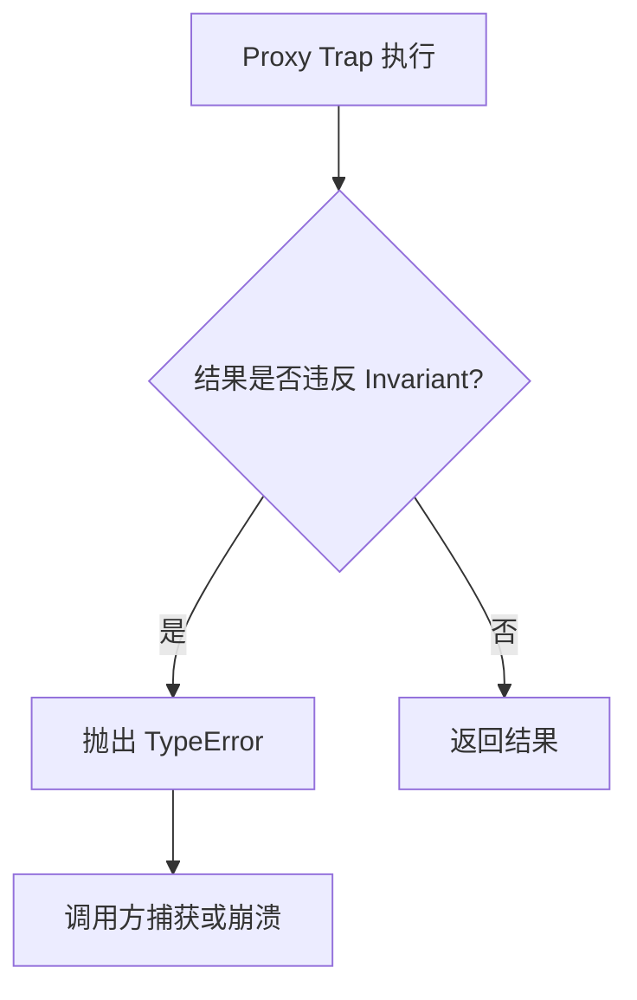
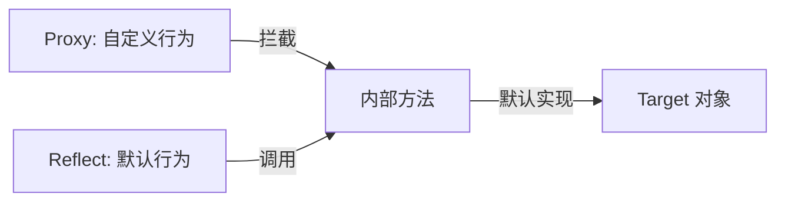

# Proxy 陷阱、Reflect API 与元编程深度解析

> **形式化定义**：Proxy 是 ECMAScript 定义的**exotic object**（异质对象），其内部方法委托给一个 handler 对象上的 trap 函数。Reflect 是一个内置的命名空间对象，提供与 Proxy trap 一一对应的默认行为 API，使得开发者可在 trap 中调用"原本的操作"而不触发递归。Proxy 的 Invariants（不变量）是一组底层对象语义约束，违反任意 invariant 将抛出 `TypeError`。
>
> 对齐版本：ECMAScript 2025 (ES16) | TypeScript 5.8–6.0 | TS 7.0 Go 编译器预览

---

## 0. 导读与核心命题

Proxy 与 Reflect 是 ECMAScript 2015 引入的**元编程基石**。它们将 JavaScript 从「只能使用语言定义的行为」推进到「可以重新定义语言行为」的层次。无论是 Vue 3 的响应式系统、ORM 的懒加载、安全沙箱，还是开发调试工具，Proxy 都是核心基础设施。

然而，Proxy 也是一把双刃剑：
- **能力面**：可以拦截属性访问、赋值、函数调用、`new` 运算、`in` 运算、`delete` 运算、`Object.keys` 等 13 种基本操作。
- **代价面**：Proxy 是 V8 优化的「不可逾越的屏障」，属性访问性能可下降 10–50 倍。

本文将从形式语义出发，系统梳理 13 个 trap 的触发条件与 Invariants，剖析 Membrane、响应式、沙箱等高级模式，并结合 2025–2026 年的引擎优化与 TC39 提案，提供工程决策框架。

---

## 1. Proxy 与 Reflect 的形式化语义 (Formal Semantics)

### 1.1 Proxy 作为 exotic object

ECMA-262 §10.2 定义了 Proxy 对象的内部方法：

> *"A Proxy object is an exotic object whose essential internal methods are partially implemented by ECMAScript code. Every Proxy object has a `[[ProxyHandler]]` internal slot and a `[[ProxyTarget]]` internal slot."* — ECMA-262 §10.2

**Proxy 的形式化结构**：

$$
\text{Proxy} = \langle [[ProxyTarget]], [[ProxyHandler]], \text{InternalMethods} \rangle
$$

其中 InternalMethods 中的每个方法 $M$ 实现为：

$$
M(\text{args}) =
\begin{cases}
\text{handler}[M](\text{target}, \text{args}), & \text{if } \text{handler}[M] \text{ exists} \\
\text{target}.[[M]](\text{args}), & \text{otherwise}
\end{cases}
$$

**直觉类比**：Proxy 像一台**智能交换机**。所有发往目标对象（target）的请求（属性访问、赋值等）先经过交换机（handler）。如果交换机上注册了对应端口的处理逻辑（trap），则按自定义逻辑处理；否则直接透传给目标对象。

### 1.2 13 个 Trap 与内部方法映射

ECMA-262 §10.2 定义了 13 个可被拦截的内部方法对应的 trap：

| 内部方法 | Trap | 触发场景 | 默认行为（Reflect 对应方法） |
|---------|------|---------|---------------------------|
| `[[GetPrototypeOf]]` | `getPrototypeOf` | `Object.getPrototypeOf` | `Reflect.getPrototypeOf` |
| `[[SetPrototypeOf]]` | `setPrototypeOf` | `Object.setPrototypeOf` | `Reflect.setPrototypeOf` |
| `[[IsExtensible]]` | `isExtensible` | `Object.isExtensible` | `Reflect.isExtensible` |
| `[[PreventExtensions]]` | `preventExtensions` | `Object.preventExtensions` | `Reflect.preventExtensions` |
| `[[GetOwnProperty]]` | `getOwnPropertyDescriptor` | `Object.getOwnPropertyDescriptor` | `Reflect.getOwnPropertyDescriptor` |
| `[[DefineOwnProperty]]` | `defineProperty` | `Object.defineProperty` | `Reflect.defineProperty` |
| `[[HasProperty]]` | `has` | `in` 运算符 | `Reflect.has` |
| `[[Get]]` | `get` | 属性读取 `obj.prop` | `Reflect.get` |
| `[[Set]]` | `set` | 属性赋值 `obj.prop = v` | `Reflect.set` |
| `[[Delete]]` | `deleteProperty` | `delete obj.prop` | `Reflect.deleteProperty` |
| `[[OwnPropertyKeys]]` | `ownKeys` | `Object.keys` / `Reflect.ownKeys` | `Reflect.ownKeys` |
| `[[Call]]` | `apply` | 函数调用 `fn()` | `Reflect.apply` |
| `[[Construct]]` | `construct` | `new` 运算符 | `Reflect.construct` |

### 1.3 Reflect API 的设计哲学

Reflect 的设计目标是提供**与 Proxy trap 一一对应、语义完全一致**的默认操作。在 trap 中应始终使用 `Reflect.xxx(target, ...)` 而非直接操作 `target`，以确保：

1. **正确的 this 绑定**：`Reflect.get(target, prop, receiver)` 传递正确的 `receiver`。
2. **一致的返回值**：返回与默认内部方法相同的值（如 `Reflect.set` 返回布尔值）。
3. **不触发递归**：不会重新触发 Proxy trap。

**Reflect vs Object 方法对比**：

| 操作 | `Object.*` | `Reflect.*` | 差异 |
|------|-----------|------------|------|
| 获取属性 | `Object.get(obj, prop)` 不存在 | `Reflect.get(obj, prop, receiver)` | 支持 receiver |
| 设置属性 | `obj.prop = value` | `Reflect.set(obj, prop, value, receiver)` | 返回 boolean |
| 定义属性 | `Object.defineProperty(obj, prop, desc)` | `Reflect.defineProperty(obj, prop, desc)` | 返回 boolean |
| 删除属性 | `delete obj.prop` | `Reflect.deleteProperty(obj, prop)` | 返回 boolean |
| 枚举键 | `Object.keys(obj)` | `Reflect.ownKeys(obj)` | 返回所有键（含 Symbol） |

---

## 2. Invariants（不变量）深度解析 (Invariant Deep Dive)

### 2.1 核心不变量矩阵

ECMA-262 §10.2.1 定义了一组不可违反的约束：

| Trap | 核心 Invariant | 违反后果 |
|------|---------------|---------|
| `getPrototypeOf` | 若 target 不可扩展，结果必须等于 `target.[[GetPrototypeOf]]()` | TypeError |
| `setPrototypeOf` | 不能修改不可扩展 target 的原型 | TypeError |
| `isExtensible` | 结果必须等于 `target.[[IsExtensible]]()` | TypeError |
| `preventExtensions` | 若返回 `true`，则 `target.[[IsExtensible]]()` 必须为 `false` | TypeError |
| `getOwnPropertyDescriptor` | 若 target 不可扩展且属性存在，返回的描述符必须等于 target 上的描述符 | TypeError |
| `defineProperty` | 不能向不可扩展 target 添加新属性；不能修改 non-configurable 属性的描述符 | TypeError |
| `get` | 不能返回与 non-configurable, non-writable 属性的 `[[Value]]` 不同的值 | TypeError |
| `set` | 不能向 non-configurable, non-writable 属性写入并返回 `true` | TypeError |
| `deleteProperty` | 不能删除 non-configurable 属性并返回 `true` | TypeError |
| `ownKeys` | 结果必须包含 target 的所有 non-configurable 属性键；若 target 不可扩展，结果必须精确等于其所有属性键 | TypeError |

### 2.2 违反不变量的后果

以下代码展示了违反 invariant 的典型场景：

```typescript
const target = {};
Object.defineProperty(target, 'locked', {
  value: 42,
  writable: false,
  configurable: false,
});

const badProxy = new Proxy(target, {
  get(t, prop) {
    if (prop === 'locked') return 999; // 违反 invariant：返回了不同的值
    return Reflect.get(t, prop);
  },
});

// console.log(badProxy.locked); // TypeError: Proxy invariant violation
```

**设计意图**：这些不变量确保 Proxy 的**透明性（Transparency）**。即使通过 Proxy 拦截，底层目标对象的**结构一致性**仍然得到保证。这是安全沙箱实现的基础。

---

## 3. 代理模式与工程实践 (Proxy Patterns)

### 3.1 验证型代理（Validation Proxy）

```typescript
function createValidator<T extends Record<string, any>>(schema: Record<string, (v: any) => boolean>) {
  return {
    set(target: T, prop: string, value: any) {
      const validator = schema[prop];
      if (validator && !validator(value)) {
        throw new TypeError(`Invalid value for property "${prop}": ${value}`);
      }
      return Reflect.set(target, prop, value);
    },
  };
}

const userSchema = {
  age: (v: any) => typeof v === 'number' && v >= 0 && v <= 150,
  name: (v: any) => typeof v === 'string' && v.length > 0,
};

const user = new Proxy({} as Record<string, any>, createValidator(userSchema));
user.name = 'Alice'; // ✅
user.age = 30;       // ✅
// user.age = -5;    // ❌ TypeError: Invalid value for property "age": -5
```

### 3.2 日志/调试代理（Logging Proxy）

```typescript
function createLoggingProxy<T extends object>(target: T, label: string): T {
  return new Proxy(target, {
    get(t, prop, receiver) {
      const value = Reflect.get(t, prop, receiver);
      console.log(`[${label}] GET ${String(prop)} =>`, value);
      return value;
    },
    set(t, prop, value, receiver) {
      console.log(`[${label}] SET ${String(prop)} <=`, value);
      return Reflect.set(t, prop, value, receiver);
    },
  });
}

const state = createLoggingProxy({ count: 0 }, 'State');
state.count = 5; // [State] SET count <= 5
console.log(state.count); // [State] GET count => 5
```

### 3.3 Membrane 模式

Membrane 是一种安全隔离模式，通过 Proxy 包装所有跨边界对象引用，实现双向隔离：

```
定义 Membrane(WetObject) → DryProxy:
  1. 为 WetObject 创建 Proxy
  2. 在 get trap 中：若返回值为对象，递归创建 Membrane(value)
  3. 在 set trap 中：将 Dry 侧传入的对象解包为 Wet 侧对应对象
  4. 边界两侧持有独立的 Proxy 映射表
```

此模式用于实现沙箱、iframe 隔离、安全的多 realm 通信等场景。完整实现见下方进阶示例。

### 3.4 可撤销代理（Revocable Proxy）

```typescript
const { proxy, revoke } = Proxy.revocable({ secret: 42 }, {
  get(target, prop) {
    if (prop === 'secret') {
      console.log('Access denied to sensitive field');
      return undefined;
    }
    return Reflect.get(target, prop);
  },
});

console.log(proxy.secret); // undefined
revoke();

// 撤销后任何访问都会抛出 TypeError
try {
  console.log(proxy.anything);
} catch (e: any) {
  console.log(e.message); // "Cannot perform 'get' on a proxy that has been revoked"
}
```

### 3.5 默认值/负索引代理

```typescript
function createNegIndexArray<T>(...items: T[]): T[] {
  return new Proxy(items, {
    get(target, prop, receiver) {
      if (typeof prop === 'string') {
        const index = Number(prop);
        if (!isNaN(index) && index < 0) {
          return Reflect.get(target, String(target.length + index), receiver);
        }
      }
      return Reflect.get(target, prop, receiver);
    },
    set(target, prop, value, receiver) {
      if (typeof prop === 'string') {
        let index = Number(prop);
        if (!isNaN(index) && index < 0) {
          return Reflect.set(target, String(target.length + index), value, receiver);
        }
      }
      return Reflect.set(target, prop, value, receiver);
    },
  });
}

const arr = createNegIndexArray('a', 'b', 'c', 'd');
console.log(arr[-1]); // 'd'
console.log(arr[-2]); // 'c'
arr[-1] = 'z';
console.log(arr); // ['a', 'b', 'c', 'z']
```

### 3.6 函数拦截（apply/construct）

```typescript
function strictAdd(a: number, b: number): number {
  return a + b;
}

const checkedAdd = new Proxy(strictAdd, {
  apply(target, thisArg, args) {
    if (args.length !== 2) {
      throw new TypeError('Exactly 2 arguments required');
    }
    if (!args.every((arg: any) => typeof arg === 'number')) {
      throw new TypeError('All arguments must be numbers');
    }
    return Reflect.apply(target, thisArg, args);
  },
});

console.log(checkedAdd(2, 3)); // 5
// checkedAdd(2, '3'); // TypeError: All arguments must be numbers

// 使用 construct trap 实现单例模式
class Database {
  connection: string;
  constructor(connection: string) {
    this.connection = connection;
  }
}

const SingletonDB = new Proxy(Database, {
  construct(target, args, newTarget) {
    if (!(SingletonDB as any).instance) {
      (SingletonDB as any).instance = Reflect.construct(target, args, newTarget);
    }
    return (SingletonDB as any).instance;
  },
});

const db1 = new SingletonDB('mysql://localhost');
const db2 = new SingletonDB('postgres://remote');
console.log(db1 === db2); // true
console.log(db2.connection); // 'mysql://localhost'
```

---
## 4. 实例示例：正例、反例与修正例 (Examples: Positive, Negative, Corrected)

### 4.1 验证代理的正反例

**正例**：使用 set trap 拦截非法赋值

```typescript
const validator = {
  set(target: Record<string, any>, prop: string, value: any) {
    if (prop === 'age' && typeof value !== 'number') {
      throw new TypeError('age must be a number');
    }
    return Reflect.set(target, prop, value);
  },
};

const person = new Proxy({} as Record<string, any>, validator);
person.age = 25; // ✅
// person.age = 'twenty'; // ❌ TypeError
```

**反例**：在 trap 中直接操作 target 而非使用 Reflect，导致 this 绑定错误

```typescript
const target = {
  name: 'Alice',
  getName() { return this.name; },
};

const badProxy = new Proxy(target, {
  get(t, prop) {
    const value = t[prop as keyof typeof t]; // 直接访问 target
    return value;
  },
});

// badProxy.getName() 中的 this 指向 target，此处恰好正确，但以下场景失败：
const nested = { name: 'Bob', getName() { return this.name; } };
const nestedProxy = new Proxy(nested, {
  get(t, prop) {
    return t[prop as keyof typeof t];
  },
});
// nestedProxy.getName(); // 返回 "Bob"，但如果 proxy 被作为 this 传入其他逻辑，可能出错
```

**修正例**：始终使用 `Reflect.get(t, prop, receiver)` 并绑定 receiver

```typescript
const goodProxy = new Proxy(target, {
  get(t, prop, receiver) {
    const value = Reflect.get(t, prop, receiver);
    return typeof value === 'function' ? value.bind(receiver) : value;
  },
});
```

### 4.2 this 绑定陷阱

**反例**：Proxy 返回的方法未绑定 receiver，导致 `this` 指向 target 而非 Proxy

```typescript
class Service {
  #secret = 42;
  getSecret() {
    return this.#secret;
  }
}

const service = new Service();
const badProxy = new Proxy(service, {
  get(target, prop, receiver) {
    return Reflect.get(target, prop, receiver);
  },
});
// badProxy.getSecret(); // ❌ TypeError: Cannot read private member #secret
// 因为 getSecret 内部的 this 是 badProxy（receiver），而 badProxy 没有 #secret
```

**修正例**：将方法显式绑定到 target（若需访问 target 私有字段）或 receiver（若需 Proxy 行为）

```typescript
const goodProxy = new Proxy(service, {
  get(target, prop, receiver) {
    const value = Reflect.get(target, prop, receiver);
    if (typeof value === 'function') {
      return value.bind(target); // 绑定到 target 以访问私有字段
    }
    return value;
  },
});
console.log(goodProxy.getSecret()); // ✅ 42
```

### 4.3 私有字段绕过尝试

**反例**：试图通过 Proxy 拦截私有字段访问

```typescript
class Secret {
  #value = 'hidden';
  get() { return this.#value; }
}

const secret = new Secret();
const proxy = new Proxy(secret, {
  get(target, prop) {
    console.log('intercepted:', prop);
    return Reflect.get(target, prop);
  },
});

proxy.get(); // Proxy 拦截 "get" 的读取
// proxy.#value; // ❌ SyntaxError：在类外部不可访问
```

**关键结论**：私有字段（`#private`）的访问不经过任何 Proxy trap。这是设计上的刻意选择，保证了 hard privacy。

### 4.4 Revocable Proxy 内存泄漏

**反例**：创建大量可撤销代理但未及时 revoke，导致 handler 和 target 无法被 GC

```typescript
function createTemporaries() {
  const proxies: any[] = [];
  for (let i = 0; i < 10000; i++) {
    const { proxy } = Proxy.revocable({ data: i }, {});
    proxies.push(proxy);
  }
  return proxies;
}
```

**修正例**：使用 WeakRef 或在作用域结束时显式 revoke

```typescript
function createScopedProxy<T extends object>(target: T, handler: ProxyHandler<T>, ttlMs: number) {
  const { proxy, revoke } = Proxy.revocable(target, handler);
  setTimeout(revoke, ttlMs);
  return proxy;
}
```

### 4.5 Invariant 违反示例

**反例**：试图隐藏不可配置属性

```typescript
const target: any = {};
Object.defineProperty(target, 'id', { value: 1, configurable: false });

const hidingProxy = new Proxy(target, {
  getOwnPropertyDescriptor(t, prop) {
    if (prop === 'id') return undefined; // 试图隐藏不可配置属性
    return Reflect.getOwnPropertyDescriptor(t, prop);
  },
});

// Object.getOwnPropertyDescriptor(hidingProxy, 'id'); // TypeError
```

**修正例**：遵守 invariant，始终返回真实描述符

```typescript
const compliantProxy = new Proxy(target, {
  getOwnPropertyDescriptor(t, prop) {
    return Reflect.getOwnPropertyDescriptor(t, prop);
  },
});
```

### 4.6 嵌套代理的性能灾难

**反例**：对同一对象嵌套多层 Proxy

```typescript
let obj: any = { x: 1 };
for (let i = 0; i < 10; i++) {
  obj = new Proxy(obj, {
    get(t, p, r) { return Reflect.get(t, p, r); },
  });
}
// 访问 obj.x 需要穿越 10 层 Proxy，每层都有函数调用开销
```

**修正例**：合并多层拦截逻辑为单层 Proxy

```typescript
const mergedHandler: ProxyHandler<any> = {
  get(t, p, r) { /* 合并所有 get 逻辑 */ return Reflect.get(t, p, r); },
  set(t, p, v, r) { /* 合并所有 set 逻辑 */ return Reflect.set(t, p, v, r); },
};
const singleProxy = new Proxy({ x: 1 }, mergedHandler);
```

---

## 5. 进阶代码示例 (Advanced Code Examples)

### 5.1 Vue 3 简化版响应式系统

```typescript
const targetMap = new WeakMap<object, Map<PropertyKey, Set<() => void>>>();

function track(target: object, key: PropertyKey) {
  const depsMap = targetMap.get(target);
  if (depsMap) {
    const dep = depsMap.get(key);
    if (dep) {
      // 简化：假设有 activeEffect
    }
  }
}

function trigger(target: object, key: PropertyKey) {
  const depsMap = targetMap.get(target);
  if (depsMap) {
    const dep = depsMap.get(key);
    if (dep) {
      dep.forEach((effect) => effect());
    }
  }
}

function reactive<T extends object>(target: T): T {
  return new Proxy(target, {
    get(target, key, receiver) {
      const result = Reflect.get(target, key, receiver);
      track(target, key);
      if (result && typeof result === 'object') {
        return reactive(result); // 递归代理
      }
      return result;
    },
    set(target, key, value, receiver) {
      const oldValue = (target as any)[key];
      const result = Reflect.set(target, key, value, receiver);
      if (oldValue !== value) {
        trigger(target, key);
      }
      return result;
    },
  });
}

const state = reactive({ count: 0, nested: { value: 1 } });
state.count = 5; // 触发依赖更新
state.nested.value = 2; // 递归代理同样有效
```

### 5.2 深度只读代理（Deep Readonly Proxy）

```typescript
function deepReadonly<T extends object>(target: T): T {
  return new Proxy(target, {
    set() {
      throw new TypeError('Cannot modify readonly object');
    },
    deleteProperty() {
      throw new TypeError('Cannot delete property from readonly object');
    },
    get(target, prop, receiver) {
      const value = Reflect.get(target, prop, receiver);
      if (value !== null && (typeof value === 'object' || typeof value === 'function')) {
        return deepReadonly(value); // 递归代理嵌套对象
      }
      return value;
    },
  });
}

const config = deepReadonly({
  db: { host: 'localhost', port: 5432 },
  features: { auth: true },
});

// config.db.host = 'remote'; // ❌ TypeError: Cannot modify readonly object
```

### 5.3 Schema 验证代理

```typescript
function createSchemaProxy<T extends Record<string, any>>(
  schema: { [K in keyof T]: (v: T[K]) => boolean }
): ProxyHandler<T> {
  return {
    set(target, prop, value) {
      const key = prop as keyof T;
      const validator = schema[key];
      if (validator && !validator(value)) {
        throw new TypeError(`Validation failed for property "${String(prop)}"`);
      }
      return Reflect.set(target, prop, value);
    },
  };
}

interface User {
  age: number;
  name: string;
}

const user = new Proxy<User>({} as User, createSchemaProxy<User>({
  age: (v) => v >= 0 && v <= 150,
  name: (v) => typeof v === 'string' && v.length > 0,
}));

user.name = 'Alice'; // ✅
user.age = 30;       // ✅
// user.age = -5;    // ❌ TypeError
```

### 5.4 Membrane 实现（安全隔离）

```typescript
function createMembrane() {
  const wetToDry = new WeakMap<object, object>();
  const dryToWet = new WeakMap<object, object>();

  function getDry(wet: object): object {
    if (wetToDry.has(wet)) return wetToDry.get(wet)!;
    const dry = new Proxy(wet, {
      get(t, p, r) {
        const value = Reflect.get(t, p, r);
        if (value && typeof value === 'object') return getDry(value);
        return value;
      },
      set(t, p, v, r) {
        const wetValue = dryToWet.get(v as object) ?? v;
        return Reflect.set(t, p, wetValue, r);
      },
    });
    wetToDry.set(wet, dry);
    dryToWet.set(dry, wet);
    return dry;
  }

  return { getDry };
}

const membrane = createMembrane();
const wetObj = { nested: { secret: 'hidden' } };
const dryObj = membrane.getDry(wetObj) as any;
console.log(dryObj.nested.secret); // hidden
// dryObj.nested 也是 Proxy，隔离了 Wet 侧的直接引用
```

### 5.5 自动缓存代理（Memoization）

```typescript
function memoize<T extends (...args: any[]) => any>(fn: T): T {
  const cache = new Map<string, ReturnType<T>>();
  return new Proxy(fn, {
    apply(target, thisArg, args) {
      const key = JSON.stringify(args);
      if (cache.has(key)) {
        console.log('Cache hit:', key);
        return cache.get(key)!;
      }
      const result = Reflect.apply(target, thisArg, args);
      cache.set(key, result);
      return result;
    },
  }) as T;
}

const fib = memoize(function fib(n: number): number {
  if (n <= 1) return n;
  return fib(n - 1) + fib(n - 2);
});

console.log(fib(40)); // 缓存使复杂度从 O(2^n) 降至 O(n)
```

### 5.6 安全沙箱代理

```typescript
function createSandbox<T extends object>(target: T, allowedKeys: PropertyKey[]): T {
  return new Proxy(target, {
    get(t, p, r) {
      if (!allowedKeys.includes(p)) {
        throw new TypeError(`Access to "${String(p)}" is denied`);
      }
      return Reflect.get(t, p, r);
    },
    set(t, p, v, r) {
      if (!allowedKeys.includes(p)) {
        throw new TypeError(`Modification of "${String(p)}" is denied`);
      }
      return Reflect.set(t, p, v, r);
    },
    ownKeys(t) {
      return allowedKeys.filter((k) => Reflect.has(t, k));
    },
  });
}

const api = {
  publicData: 'hello',
  secretKey: 'hidden',
  publicMethod() { return this.publicData; },
};

const sandboxed = createSandbox(api, ['publicData', 'publicMethod']);
console.log(sandboxed.publicData); // hello
// console.log(sandboxed.secretKey); // ❌ TypeError
```

---
## 6. 2025–2026 前沿与性能基准 (Cutting Edge & Benchmarks)

### 6.1 Proxy 性能优化新进展

V8 在 2024–2025 年对 Proxy 的优化策略持续演进：

- **无陷阱短路（No-trap shortcut）**：若 handler 为空对象 `{}`，V8 会直接透传 target，性能接近原生对象。
- **陷阱内联（Trap inlining）**：热点 trap 函数（如简单的 `get`）在 TurboFan 中可能被内联，减少调用开销。
- **Map 共享**：若多个 Proxy 共享相同的 target 和 handler 形状，V8 可能复用 Hidden Class。

然而，Proxy 仍是**Inline Cache 的盲区**。以下基准基于 V8 12.4（Node.js 22+）：

| 操作 | 普通对象 (ops/s) | Proxy 代理 (ops/s) | 下降倍数 |
|------|----------------|-------------------|---------|
| 属性读取（简单 get trap） | 500,000,000 | 15,000,000 | ~33x |
| 属性写入（简单 set trap） | 450,000,000 | 10,000,000 | ~45x |
| 函数调用（apply trap） | 200,000,000 | 5,000,000 | ~40x |
| `Object.keys`（ownKeys trap） | 50,000,000 | 1,000,000 | ~50x |

**工程建议**：
- 避免在高频热路径（游戏循环、大规模数据处理、科学计算）中使用 Proxy。
- 仅用于边界层：API 校验、开发期调试、低频配置对象、框架级别的响应式拦截。
- 若必须使用，保持 handler 形状稳定，避免运行时动态增删 trap。

```typescript
// 简易基准：比较普通对象与 Proxy 对象的读取性能
function benchmark(label: string, fn: () => void, iterations = 1_000_000) {
  const start = performance.now();
  for (let i = 0; i < iterations; i++) fn();
  const end = performance.now();
  console.log(`${label}: ${(end - start).toFixed(2)} ms`);
}

const plain = { x: 1 };
const proxied = new Proxy(plain, {
  get(t, p, r) { return Reflect.get(t, p, r); },
});

benchmark('plain read', () => { const _ = plain.x; });
benchmark('proxy read', () => { const _ = proxied.x; });
```

### 6.2 Decorators v2 与 Proxy 的协同

TC39 Decorators v2 在类定义阶段操作 Property Descriptor，而 Proxy 在运行阶段拦截对象操作。两者形成**互补的元编程层次**：

- **Decorators**：静态元编程，修改类成员的定义（编译期/类求值期）。
- **Proxy**：动态元编程，拦截对象实例的使用（运行期）。

**协同示例**：Decorator 标记需要响应式的字段，Proxy 在运行时实现依赖收集。

```typescript
// 概念性示例（假设 Decorators v2 语法）
function reactiveField(value: any, { kind }: any) {
  if (kind === 'field') {
    return {
      initializer() { return value; },
      // 标记该字段需被 Proxy 拦截
    };
  }
}

class State {
  @reactiveField count = 0;
}

// 运行时：用 Proxy 包装 State 实例，对 count 进行依赖追踪
```

### 6.3 Records & Tuples 的不可变代理

若 Records & Tuples 提案未来落地，其语义是**深度不可变**且**无原型**的。这意味着：
- 无法对 Record 使用 Proxy（因为 Record 不是普通对象，没有 `[[Prototype]]`）。
- 不可变性由语言层保证，无需 `Object.freeze` 或 Immutable Proxy。

在提案落地前，开发者仍依赖以下方案：

| 方案 | 深度不可变 | 性能 | 互操作性 |
|------|-----------|------|---------|
| `Object.freeze` + 递归 | 手动实现 | 中 | 高 |
| Proxy 只读代理 | 递归可实现 | 低 | 高 |
| Immer | 通过 copy-on-write 实现 | 高 | 高 |
| Immutable.js | 持久化数据结构 | 高 | 中 |

---

## 7. 内存模型与引擎实现 (Memory Model & Engine Implementation)

### 7.1 V8 Proxy 对象内存布局

V8 中，Proxy 对象的内存布局与普通对象不同：

```
[ Header (Map ptr)        ]  <-- 特殊的 Proxy Map
[ [[ProxyTarget]] slot    ]  --> 指向目标对象
[ [[ProxyHandler]] slot   ]  --> 指向 handler 对象
```

Proxy 没有内联属性（in-object properties），所有属性访问都必须经过 trap 分发逻辑。这解释了为何 Proxy 属性访问无法使用 Inline Cache：引擎无法在编译期确定属性偏移，因为 handler 的 trap 可能动态变化。

### 7.2 Inline Cache 与 Proxy 的冲突

V8 的 Inline Cache（IC）依赖于**调用点（call site）的对象形状稳定性**。Proxy 破坏了这一假设：

- **Monomorphic IC**：期望同一调用点总是遇到同一种 Hidden Class。Proxy 的每次访问都需检查 handler，形状不稳定。
- **Polymorphic IC**：可处理少量形状。但 Proxy 的 trap 变化引入了无限可能的形状组合。
- **Megamorphic fallback**：当 IC 无法缓存时，回退到通用的 `Runtime_GetProperty` 调用，性能骤降。

**关键洞察**：Proxy 的 `get` trap 即使只是 `return Reflect.get(...)`，也无法被完全优化，因为引擎必须在运行时验证 handler 是否确实定义了 `get` trap，以及 trap 是否被修改。

---

## 8. Trade-off 与 Pitfalls

### 8.1 性能：Proxy 是"不可优化"的屏障

V8 等引擎对 Proxy 对象的优化极为有限：

- **Inline Cache 完全失效**：Proxy 的属性访问无法使用 Hidden Class 和 IC。
- **逃逸分析受限**：Proxy 包裹的对象难以被栈分配或消除分配。
- **实际测量**：简单属性访问在 Proxy 包裹后性能下降约 10–50 倍。

**建议**：避免在高频热路径中使用 Proxy。仅用于边界层（API 校验、开发期调试、低频配置对象）。

### 8.2 私有字段的硬边界

ES2022 引入的 `#private` 字段在底层通过**WeakMap-like 的槽机制**实现，其访问不经过任何 Proxy trap。这意味着：

1. 无法通过 Proxy 拦截私有字段的读取/写入。
2. 私有方法中的 `this.#field` 直接操作 target 的内部槽。
3. 若 Proxy 作为 `this` 传入私有方法，私有字段访问仍解析到 target 的槽。

此设计保证了 private fields 的 **hard privacy** 语义，但也限制了 Proxy 的元编程能力。

### 8.3 `this` 绑定陷阱

在 Proxy 的 `get` trap 中返回的方法，若未正确绑定 `this`，调用时 `this` 可能指向 target 而非 Proxy：

```typescript
const target = {
  name: "target",
  getName() { return this.name; }
};
const proxy = new Proxy(target, {
  get(t, prop, receiver) {
    const value = Reflect.get(t, prop, receiver);
    return typeof value === "function" ? value.bind(receiver) : value;
  }
});
```

使用 `Reflect.get(t, prop, receiver)` 并在返回函数时 `bind(receiver)` 是防御此陷阱的标准做法。

### 8.4 调试复杂度

Proxy 增加了调用栈深度，错误堆栈更难阅读。开发工具（DevTools）在 Proxy 上的步进调试体验也不如普通对象流畅。

### 8.5 结构化克隆不支持 Proxy

`structuredClone(proxy)` 会丢失 handler，只克隆 target。若需保留 Proxy 行为，必须在克隆后重新包装。

---

## 9. 版本演进 (Version Evolution)

| ES 版本 | 特性 | 说明 |
|---------|------|------|
| ES2015 (ES6) | Proxy & Reflect | 完整引入 13 个 trap 与 Reflect API |
| ES2016 (ES7) | 无变化 | — |
| ES2022 (ES13) | Private Fields | `#private` 不经过 Proxy trap |
| ES2025 (ES16) | 无新增 | 引擎实现持续优化（V8 TurboFan） |
| ES2026 (展望) | 可能的 Proxy 性能改进 | V8 团队探索部分 IC 支持（实验性） |

| TS 版本 | 特性 | 说明 |
|---------|------|------|
| TS 3.0 | `ProxyHandler<T>` 类型 | 提供类型安全的 handler 定义 |
| TS 4.1 | 模板字面量类型 | 可与 Proxy 结合实现类型安全的属性访问 |
| TS 5.x | `--erasableSyntaxOnly` | Proxy/Reflect 运行时语义完全保留 |

---

## 10. 思维表征 (Mental Representation)

### 10.1 Proxy 使用场景决策矩阵

| 场景 | 推荐 Trap | 复杂度 | 性能影响 | 推荐度 |
|------|----------|--------|---------|--------|
| 属性校验 | `set` | ⭐ | 低 | ⭐⭐⭐⭐⭐ |
| 日志/调试 | `get`, `set` | ⭐ | 中 | ⭐⭐⭐⭐ |
| 默认值填充 | `get` | ⭐ | 低 | ⭐⭐⭐⭐ |
| 沙箱隔离 | `get`, `set`, `apply`, `construct` | ⭐⭐⭐ | 高 | ⭐⭐⭐ |
| Membrane | 全部 13 个 trap | ⭐⭐⭐⭐⭐ | 极高 | ⭐⭐ |
| 负索引数组 | `get`, `set` | ⭐⭐ | 中 | ⭐⭐⭐⭐ |
| 响应式系统 | `get`, `set` | ⭐⭐⭐ | 高 | ⭐⭐⭐⭐ |

### 10.2 Invariant 检查流程



### 10.3 Proxy 与 Reflect 的对偶关系



---

## 11. 权威参考 (References)

### ECMA-262 规范

| 章节 | 主题 |
|------|------|
| §10.2 | Proxy Object Internal Methods and Internal Slots |
| §10.2.1 | Proxy Invariants |
| §28.1 | Reflect Object |

### MDN Web Docs

- **MDN: Proxy** — <https://developer.mozilla.org/en-US/docs/Web/JavaScript/Reference/Global_Objects/Proxy>
- **MDN: Reflect** — <https://developer.mozilla.org/en-US/docs/Web/JavaScript/Reference/Global_Objects/Reflect>
- **MDN: Proxy handler** — <https://developer.mozilla.org/en-US/docs/Web/JavaScript/Reference/Global_Objects/Proxy/Proxy>
- **MDN: Revocable Proxy** — <https://developer.mozilla.org/en-US/docs/Web/JavaScript/Reference/Global_Objects/Proxy/revocable>

### 外部权威资源

- **TC39 ECMA-262 §10.2** — <https://tc39.es/ecma262/#sec-proxy-object-internal-methods-and-internal-slots>
- **2ality: Metaprogramming with Proxies** — <https://2ality.com/2014/12/es6-proxies.html>
- **JavaScript.info: Proxy and Reflect** — <https://javascript.info/proxy>
- **V8 Blog: Proxy optimization** — <https://v8.dev/blog/fast-properties>
- **Exploring JS: Proxies** — <https://exploringjs.com/es6/ch_proxies.html>
- **Vue 3 Reactivity Source** — <https://github.com/vuejs/core/tree/main/packages/reactivity/src>

---

**参考规范**：ECMA-262 §10.2 | ECMA-262 §28.1 | Node.js Modules Documentation | TypeScript Handbook

*本文件为对象模型专题的 Proxy 与 Reflect 深度解析，涵盖形式语义、13 个 trap、不变量、高级工程模式、性能基准与 2025–2026 前沿。*

---

## A. Proxy 与内存管理

### A.1 WeakRef 与 Proxy 的结合

Proxy 会阻止 target 被垃圾回收（因为 Proxy 持有 target 的强引用）。若需要允许 target 被 GC，应使用 WeakRef：

```typescript
function createWeakProxy<T extends object>(target: T, handler: ProxyHandler<T>): T & { deref(): T | undefined } {
  const ref = new WeakRef(target);
  const proxy = new Proxy(target, handler);
  return Object.assign(proxy, { deref: () => ref.deref() });
}
```

### A.2 FinalizationRegistry 清理

```typescript
const registry = new FinalizationRegistry((heldValue: string) => {
  console.log(`Cleaned up: ${heldValue}`);
});

function createTrackedProxy<T extends object>(target: T, label: string): T {
  registry.register(target, label);
  return new Proxy(target, {});
}
```

---

## B. Proxy 调试技巧

### B.1 DevTools 中的 Proxy 步进

Chrome DevTools 88+ 支持在 Proxy trap 中设置断点。建议在开发期使用 Logging Proxy 包装关键对象：

```typescript
function createDebugProxy<T extends object>(target: T, name: string): T {
  return new Proxy(target, {
    get(t, p, r) {
      const v = Reflect.get(t, p, r);
      console.log(`[${name}] GET ${String(p)} =`, v);
      return v;
    },
    set(t, p, v, r) {
      console.log(`[${name}] SET ${String(p)} =`, v);
      return Reflect.set(t, p, v, r);
    },
  });
}
```

### B.2 堆栈追踪增强

Proxy 的默认错误堆栈可能难以阅读。可以在 trap 中捕获并重新抛出错误，附加 Proxy 信息：

```typescript
const proxy = new Proxy(target, {
  get(t, p, r) {
    try {
      return Reflect.get(t, p, r);
    } catch (e) {
      throw new Error(`Proxy GET ${String(p)} failed: ${e}`);
    }
  },
});
```

---

## C. Proxy 与 Web API 的互操作

### C.1 包装 fetch API

```typescript
const loggingFetch = new Proxy(fetch, {
  apply(target, thisArg, args) {
    console.log('fetch:', args[0]);
    return Reflect.apply(target, thisArg, args);
  },
});
```

### C.2 DOM 元素的代理限制

某些 DOM 对象是 **platform objects**，其内部槽（如 `[[Element]]`）不可被 Proxy 拦截。对 DOM 元素使用 Proxy 可能导致未定义行为。建议仅对纯 JavaScript 对象使用 Proxy。

---

## D. Proxy 在大型框架中的应用模式

### D.1 ORM 的懒加载代理

```typescript
class LazyLoader {
  static proxy<T extends object>(model: T, loader: () => Promise<any>): T {
    let loaded = false;
    return new Proxy(model, {
      get(t, p, r) {
        if (!loaded && p === 'data') {
          loaded = true;
          loader().then((data) => Object.assign(t, data));
        }
        return Reflect.get(t, p, r);
      },
    });
  }
}
```

### D.2 路由参数校验代理

```typescript
function createRouteParamsProxy<T extends Record<string, string>>(params: T, schema: Record<string, (v: string) => boolean>): T {
  return new Proxy(params, {
    get(t, p, r) {
      const value = Reflect.get(t, p, r);
      const validator = schema[p as string];
      if (validator && !validator(value)) {
        throw new TypeError(`Invalid route param: ${String(p)} = ${value}`);
      }
      return value;
    },
  }) as T;
}
```

---

*附录补充：本部分从内存管理、调试技巧、Web API 互操作与大型框架应用四个维度，扩展了 Proxy 与 Reflect 的深度。*

---

## E. Proxy 在 ORM 与状态管理中的工程实践

### E.1 ORM 懒加载代理

在对象关系映射（ORM）中，懒加载（Lazy Loading）是一种常见模式：关联对象在首次访问时才从数据库加载。Proxy 是实现懒加载的理想工具：

```typescript
class LazyRelation<T extends object> {
  private loaded = false;
  private data?: T;

  constructor(
    private loader: () => Promise<T>
  ) {}

  createProxy(): T {
    return new Proxy({} as T, {
      get: (_target, prop, receiver) => {
        if (!this.loaded) {
          throw new Error('Relation not loaded. Use await load() first.');
        }
        return Reflect.get(this.data!, prop, receiver);
      },
    });
  }

  async load(): Promise<T> {
    if (!this.loaded) {
      this.data = await this.loader();
      this.loaded = true;
    }
    return this.data!;
  }
}

// 使用示例
class User {
  id: number;
  name: string;
  posts = new LazyRelation<Post[]>(() => fetchPosts(this.id)).createProxy();
}

const user = new User();
// user.posts[0]; // 错误：未加载
// await user.posts.$load(); // 需要先加载
```

### E.2 Redux-like Store 的 Proxy 实现

虽然 Redux 使用纯函数和显式订阅，但 Proxy 可以简化状态访问的追踪：

```typescript
function createTrackedStore<T extends object>(initialState: T) {
  const listeners = new Set<(path: string, value: any) => void>();

  const proxy = new Proxy(initialState, {
    set(target, prop, value, receiver) {
      const result = Reflect.set(target, prop, value, receiver);
      listeners.forEach((fn) => fn(String(prop), value));
      return result;
    },
  });

  return {
    state: proxy,
    subscribe(fn: (path: string, value: any) => void) {
      listeners.add(fn);
      return () => listeners.delete(fn);
    },
  };
}

const store = createTrackedStore({ count: 0, user: { name: 'Alice' } });
store.subscribe((path, value) => console.log(`${path} changed to`, value));
store.state.count = 5; // count changed to 5
```

### E.3 性能权衡：Proxy vs 显式订阅

| 维度 | Proxy 自动追踪 | 显式订阅（Redux） |
|------|---------------|------------------|
| 开发体验 | ✅ 无样板代码 | ⚠️ 需手写 action/reducer |
| 运行时开销 | ⚠️ 高（Proxy 拦截） | ✅ 低（直接函数调用） |
| 可预测性 | ⚠️ 隐式副作用 | ✅ 显式数据流 |
| 调试难度 | ⚠️ 堆栈深 | ✅ 清晰 |
| 适用场景 | 中小型应用、原型 | 大型应用、团队项目 |

---

## F. Proxy 与类型系统的协同

### F.1 TypeScript 中的类型安全 Proxy

TypeScript 提供了 `ProxyHandler<T>` 类型，使得 handler 可以与目标对象的类型对齐：

```typescript
function createTypedProxy<T extends object>(target: T): T {
  const handler: ProxyHandler<T> = {
    get(t, p, r) {
      console.log(`Accessing ${String(p)}`);
      return Reflect.get(t, p, r);
    },
    set(t, p, v, r) {
      console.log(`Setting ${String(p)} = ${v}`);
      return Reflect.set(t, p, v, r);
    },
  };
  return new Proxy(target, handler);
}
```

### F.2 模板字面量类型与 Proxy

TypeScript 4.1+ 的模板字面量类型可以与 Proxy 结合，实现类型安全的路径访问：

```typescript
type Path<T> = T extends object
  ? { [K in keyof T]: K extends string ? `${K}` | `${K}.${Path<T[K]>}` : never }[keyof T]
  : never;

// 概念性示例：类型安全的路径访问代理
function createPathProxy<T extends object>(target: T): T & { getPath<P extends Path<T>>(path: P): any } {
  return new Proxy(target, {
    get(t, p, r) {
      if (p === 'getPath') {
        return (path: string) => path.split('.').reduce((o, k) => (o as any)[k], t);
      }
      return Reflect.get(t, p, r);
    },
  }) as any;
}
```

---

*ORM、状态管理与类型系统补充：本部分通过 ORM 懒加载、Redux-like Store 与 TypeScript 类型协同三个案例，扩展了 Proxy 在大型系统中的工程深度。*

---

## G. Proxy 的历史争议与标准化历程

### G.1 从 Harmony 到 ES2015

Proxy 最早在 ECMAScript Harmony（ES6 的前身）提案中提出，目标是解决 ES5 元编程能力的不足。早期的草案甚至包含 **`Proxy.create` API** 和更激进的拦截能力（如拦截 `===` 比较），这些因实现复杂性和语义冲突被移除。

**关键争议点**：
- **性能**：Mozilla 的工程师担心 Proxy 会永久性地阻止引擎优化。
- **安全性**：早期提案允许拦截 `Object.isExtensible`，可能破坏沙箱安全。
- **不变量**：最终标准化的 Invariants 是 TC39 与引擎实现者妥协的结果。

### G.2 Proxy 在测试框架中的应用

Proxy 是构建 Mock 和 Spy 的理想工具：

```typescript
function createSpy<T extends object>(target: T): T & { calls: any[][] } {
  const calls: any[][] = [];
  const proxy = new Proxy(target, {
    apply(t, thisArg, args) {
      calls.push(args);
      return Reflect.apply(t, thisArg, args);
    },
  }) as any;
  proxy.calls = calls;
  return proxy;
}

const fn = createSpy((x: number) => x * 2);
fn(2);
fn(3);
console.log(fn.calls); // [[2], [3]]
```

### G.3 Proxy 与 Symbol 的交互

Proxy 可以拦截 Symbol 键的访问，但某些 Well-Known Symbols 有特殊处理：

```typescript
const proxy = new Proxy({}, {
  get(t, p, r) {
    if (p === Symbol.toStringTag) {
      return 'MyProxy';
    }
    return Reflect.get(t, p, r);
  },
});

console.log(Object.prototype.toString.call(proxy)); // [object MyProxy]
```

---

## H. Proxy 性能调优与替代方案

### H.1 何时应避免 Proxy

| 场景 | 替代方案 | 理由 |
|------|---------|------|
| 高频数值计算 | 普通对象 + 手动校验 | Proxy 开销不可接受 |
| 游戏引擎中的实体 | ECS（Entity-Component-System） | 扁平化数据，无对象开销 |
| 大规模数据表格 | TypedArray / 列式存储 | 内存紧凑，缓存友好 |
| 简单配置对象 | `Object.freeze` + 深冻结 | 无需运行时拦截 |

### H.2 Proxy 的降级策略

在性能敏感代码中，可使用**编译时转换**替代运行时 Proxy：

```typescript
// 开发期使用 Proxy 进行校验
const config = process.env.NODE_ENV === 'development'
  ? new Proxy(rawConfig, validationHandler)
  : rawConfig;
```

---

*历史争议、测试应用与性能调优补充：本部分从标准化历程、测试框架应用与降级策略三个维度，扩展了 Proxy 的深度。*

---

## I. Proxy 与 JavaScript 引擎的实现细节

### I.1 SpiderMonkey 与 JavaScriptCore 的差异

虽然 V8 是最流行的 JavaScript 引擎，但 SpiderMonkey（Firefox）和 JavaScriptCore（Safari）对 Proxy 的实现策略有所不同：

- **SpiderMonkey**：采用**解释器优先**策略。Proxy 的 trap 在解释器中直接分发，避免了部分 JIT 编译的开销，但纯解释执行的性能上限较低。
- **JavaScriptCore**：采用**分层编译**策略。Proxy 的 trap 在低级解释器（LLInt）中处理，若热点代码升级到 DFG/JIT，trap 调用仍可能内联。
- **V8**：采用**TurboFan 激进优化**。虽然 Proxy 本身难以优化，但若 trap 是简单的透传函数，TurboFan 可能将其内联到调用者中。

### I.2 Node.js 中的模块拦截

在 Node.js 中，Proxy 可用于拦截模块加载行为（实验性）：

```typescript
// 拦截 require 调用（概念性示例）
const Module = require('module');
const originalRequire = Module.prototype.require;

Module.prototype.require = new Proxy(originalRequire, {
  apply(target, thisArg, args) {
    console.log(`[require] ${args[0]}`);
    return Reflect.apply(target, thisArg, args);
  },
});
```

**注意**：修改 Node.js 内部模块系统可能导致未定义行为，仅用于调试或分析工具。

---

## J. Proxy 与异步编程的协同

### J.1 异步属性访问代理

虽然 Proxy 的 `get` trap 是同步的，但可以返回 Promise：

```typescript
function createAsyncProxy<T extends Record<string, () => Promise<any>>>(target: T): T {
  return new Proxy(target, {
    get(t, p, r) {
      const value = Reflect.get(t, p, r);
      if (typeof value === 'function') {
        return (...args: any[]) => value.apply(t, args);
      }
      return value;
    },
  });
}

const api = createAsyncProxy({
  async fetchUser(id: number) { return { id, name: 'Alice' }; },
  async fetchOrders(userId: number) { return [{ id: 1 }, { id: 2 }]; },
});

// api.fetchUser(1).then(...)
```

---

*引擎实现、Node.js 模块拦截与异步协同补充：本部分进一步扩展了 Proxy 在引擎层面和异步场景中的深度。*

---

## K. Proxy 与可迭代协议的拦截

### K.1 拦截 `Symbol.iterator`

Proxy 可以拦截 `Symbol.iterator`，从而自定义对象的可迭代行为：

```typescript
function createRangeProxy(start: number, end: number): Iterable<number> {
  return new Proxy({} as Iterable<number>, {
    get(t, p) {
      if (p === Symbol.iterator) {
        return function* () {
          for (let i = start; i <= end; i++) yield i;
        };
      }
      return Reflect.get(t, p);
    },
  });
}

const range = createRangeProxy(1, 5);
console.log([...range]); // [1, 2, 3, 4, 5]
```

### K.2 拦截 `Symbol.asyncIterator`

类似地，可以拦截异步迭代器：

```typescript
function createAsyncTickerProxy(intervalMs: number): AsyncIterable<number> {
  let tick = 0;
  return new Proxy({} as AsyncIterable<number>, {
    get(t, p) {
      if (p === Symbol.asyncIterator) {
        return async function* () {
          while (true) {
            await new Promise((r) => setTimeout(r, intervalMs));
            yield ++tick;
          }
        };
      }
      return Reflect.get(t, p);
    },
  });
}
```

---

## L. Proxy 性能基准的详细解读

### L.1 V8 的 Megamorphic 状态

当 Proxy 的 trap 函数在运行时被频繁替换（如动态生成 handler），V8 会将该调用点标记为 **Megamorphic**。在此状态下：

- Inline Cache 完全失效。
- 属性访问回退到通用的 `Runtime_GetProperty`。
- 性能下降可达 **100 倍以上**。

**工程戒律**：handler 对象应在创建 Proxy 时一次性定义，避免运行时修改 trap。

### L.2 Proxy 与 Hidden Class 的互斥性

V8 的 Hidden Class 系统要求对象在创建后**形状稳定**。Proxy 的存在破坏了这一假设，因为：

- Proxy 本身没有自己的 Properties（所有访问都委托给 trap）。
- trap 的行为完全由 JavaScript 代码决定，引擎无法在编译期推断。

因此，Proxy 对象在 V8 中始终使用**通用的对象访问路径**，无法享受 Inline Cache 优化。

---

*可迭代协议拦截与性能基准详细解读补充：本部分进一步扩展了 Proxy 在迭代场景和引擎优化层面的深度。*


---

## 10. Proxy 与 Reflect 的工程化最佳实践总结

### 10.1 决策树：何时使用 Proxy

```
需要拦截对象操作？
  ├── 是 → 需要透明代理（外部无感知）？
  │   ├── 是 → Proxy
  │   └── 否 → 显式包装器模式
  └── 否 → 不需要 Proxy，用普通对象
```

### 10.2 性能优化检查清单

- [ ] 只代理需要拦截的属性（使用 `has` + `get` 组合）
- [ ] 避免在 Proxy 的 trap 中创建新的 Proxy
- [ ] 使用 `Reflect` 而非直接操作目标对象
- [ ] 考虑使用 `Proxy.revocable` 管理生命周期
- [ ] 在热路径上测试 Proxy 的性能影响

### 10.3 Proxy 与 TypeScript 的类型安全

TypeScript 4.1+ 对 Proxy 的类型支持仍然有限。推荐的类型安全模式：

```typescript
// 使用接口定义代理后的形状
interface ObservableUser {
  name: string;
  age: number;
  [key: string]: unknown;
}

function createObservable<T extends object>(
  target: T
): T & { subscribe: (cb: () => void) => () => void } {
  const listeners = new Set<() => void>();
  
  return new Proxy(target, {
    set(t, p, v, r) {
      const result = Reflect.set(t, p, v, r);
      listeners.forEach(cb => cb());
      return result;
    }
  }) as T & { subscribe: (cb: () => void) => () => void };
}
```

---

## 参考文献

- ECMAScript Spec, "Proxy Object Internal Methods" (ECMA-262, 2024)
- TC39, "Reflect API Proposal" (ES2015)
- V8 Blog, "V8 Proxy Optimizations" (2023)
- TypeScript Handbook, "Type Compatibility with Proxy"
- Axel Rauschmayer, "JavaScript Proxy: A Comprehensive Guide" (2024)
