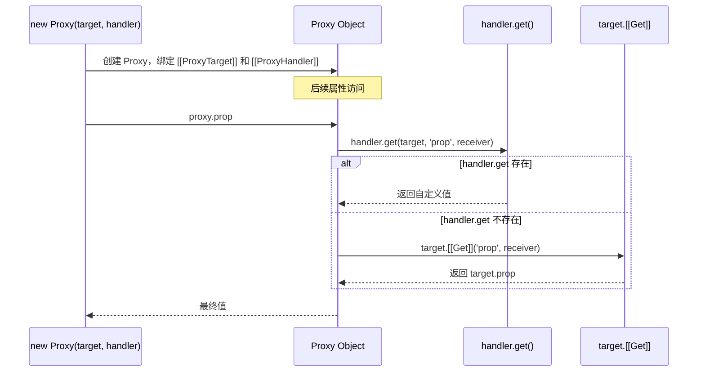
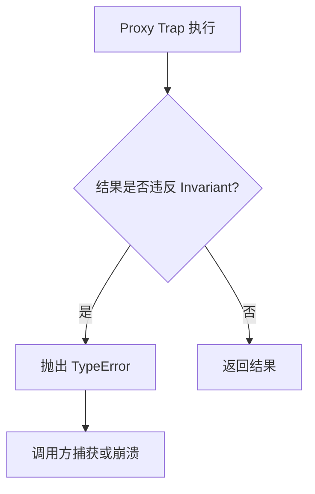

# Proxy 与 Reflect

> **形式化定义**：Proxy 是 ECMAScript 定义的**exotic object**（异质对象），其内部方法委托给一个 handler 对象上的 trap 函数。Reflect 是一个内置的命名空间对象，提供与 Proxy trap 一一对应的默认行为 API，使得开发者可在 trap 中调用"原本的操作"而不触发递归。Proxy 的 Invariants（不变量）是一组底层对象语义约束，违反任意 invariant 将抛出 `TypeError`。
>
> 对齐版本：ECMAScript 2025 (ES16) | TypeScript 5.8–6.0 | TS 7.0 Go 编译器预览

---

## 1. 概念定义 (Concept Definition)

### 1.1 形式化定义

ECMA-262 §10.2 定义了 Proxy 对象的内部方法：

> *"A Proxy object is an exotic object whose essential internal methods are partially implemented by ECMAScript code. Every Proxy object has a `[[ProxyHandler]]` internal slot and a `[[ProxyTarget]]` internal slot."* — ECMA-262 §10.2

**Proxy 的形式化结构**：

```
Proxy = ⟨ [[ProxyTarget]], [[ProxyHandler]], InternalMethods ⟩

其中 InternalMethods 中的每个方法 M 实现为：
  M(args) = handler[M] ? handler[M](target, args) : target.[[M]](args)
```

### 1.2 Proxy Handler Traps 全集

ECMA-262 §10.2 定义了 13 个可被拦截的内部方法对应的 trap：

| 内部方法 | Trap | 触发场景 | 默认行为（Reflect 对应方法） |
|---------|------|---------|---------------------------|
| `[[GetPrototypeOf]]` | `getPrototypeOf` | `Object.getPrototypeOf` | `Reflect.getPrototypeOf` |
| `[[SetPrototypeOf]]` | `setPrototypeOf` | `Object.setPrototypeOf` | `Reflect.setPrototypeOf` |
| `[[IsExtensible]]` | `isExtensible` | `Object.isExtensible` | `Reflect.isExtensible` |
| `[[PreventExtensions]]` | `preventExtensions` | `Object.preventExtensions` | `Reflect.preventExtensions` |
| `[[GetOwnProperty]]` | `getOwnPropertyDescriptor` | `Object.getOwnPropertyDescriptor` | `Reflect.getOwnPropertyDescriptor` |
| `[[DefineOwnProperty]]` | `defineProperty` | `Object.defineProperty` | `Reflect.defineProperty` |
| `[[HasProperty]]` | `has` | `in` 运算符 | `Reflect.has` |
| `[[Get]]` | `get` | 属性读取 `obj.prop` | `Reflect.get` |
| `[[Set]]` | `set` | 属性赋值 `obj.prop = v` | `Reflect.set` |
| `[[Delete]]` | `deleteProperty` | `delete obj.prop` | `Reflect.deleteProperty` |
| `[[OwnPropertyKeys]]` | `ownKeys` | `Object.keys` / `Reflect.ownKeys` | `Reflect.ownKeys` |
| `[[Call]]` | `apply` | 函数调用 `fn()` | `Reflect.apply` |
| `[[Construct]]` | `construct` | `new` 运算符 | `Reflect.construct` |

### 1.3 Reflect API 作为"默认行为"

Reflect 的设计目标是提供**与 Proxy trap 一一对应、语义完全一致**的默认操作。在 trap 中应始终使用 `Reflect.xxx(target, ...)` 而非直接操作 `target`，以确保：

1. **正确的 this 绑定**：`Reflect.get(target, prop, receiver)` 传递正确的 `receiver`
2. **一致的返回值**：返回与默认内部方法相同的值（如 `Reflect.set` 返回布尔值）
3. **不触发递归**：不会重新触发 Proxy trap

---

## 2. 属性与特征 (Properties & Characteristics)

### 2.1 Proxy Invariants（不变量）

ECMA-262 §10.2.1 定义了一组不可违反的约束。以下为核心 invariants 矩阵：

| Trap | 核心 Invariant | 违反后果 |
|------|---------------|---------|
| `getPrototypeOf` | 结果必须等于 `target.[[GetPrototypeOf]]()`（若 target 不可扩展） | TypeError |
| `setPrototypeOf` | 不能修改不可扩展 target 的原型 | TypeError |
| `isExtensible` | 结果必须等于 `target.[[IsExtensible]]()` | TypeError |
| `preventExtensions` | 若返回 `true`，则 `target.[[IsExtensible]]()` 必须为 `false` | TypeError |
| `getOwnPropertyDescriptor` | 返回的描述符必须等于 target 上的描述符（不可扩展且属性存在时） | TypeError |
| `defineProperty` | 不能向不可扩展 target 添加新属性；不能修改 non-configurable 属性的描述符 | TypeError |
| `get` | 不能返回与 non-configurable, non-writable 属性的 `[[Value]]` 不同的值 | TypeError |
| `set` | 不能向 non-configurable, non-writable 属性写入并返回 `true` | TypeError |
| `deleteProperty` | 不能删除 non-configurable 属性并返回 `true` | TypeError |
| `ownKeys` | 结果必须包含 target 的所有 non-configurable 属性键；若 target 不可扩展，结果必须精确等于其所有属性键 | TypeError |

### 2.2 Proxy 的类型矩阵

| 维度 | 可被代理的对象 | 不可被代理的对象 |
|------|--------------|----------------|
| 普通对象 | ✅ | — |
| 数组 | ✅ | — |
| 函数 | ✅（需 `apply`/`construct`） | — |
| 内置构造函数（如 Date） | ⚠️ 受限 | — |
| `null` | ❌ | 不能作为 target 或 handler |
| 另一个 Proxy | ✅（可嵌套） | — |
| 私有字段访问 | ❌ | `#private` 绕过 Proxy trap |

---

## 3. 机制解释 (Mechanism Explanation)

### 3.1 Proxy 的创建与内部委托流程



### 3.2 Membrane 模式的形式化描述

Membrane 是一种安全隔离模式，通过 Proxy 包装所有跨边界对象引用，实现双向隔离：

```
定义 Membrane(WetObject) → DryProxy:
  1. 为 WetObject 创建 Proxy
  2. 在 get trap 中：若返回值为对象，递归创建 Membrane(value)
  3. 在 set trap 中：将 Dry 侧传入的对象解包为 Wet 侧对应对象
  4. 边界两侧持有独立的 Proxy 映射表
```

此模式用于实现沙箱、iframe 隔离、安全的多 realm 通信等场景。

---

## 4. 实例示例 (Examples)

### 4.1 验证型 Proxy（Validation Proxy）

```typescript
const validator = {
  set(target: Record<string, any>, prop: string, value: any) {
    if (prop === "age" && typeof value !== "number") {
      throw new TypeError("age must be a number");
    }
    return Reflect.set(target, prop, value);
  },
};

const person = new Proxy({} as Record<string, any>, validator);
person.age = 25; // ✅
// person.age = "twenty"; // ❌ TypeError
```

### 4.2 日志型 Proxy（Logging Proxy）

```typescript
function createLoggingProxy<T extends object>(target: T, label: string): T {
  return new Proxy(target, {
    get(t, prop, receiver) {
      const value = Reflect.get(t, prop, receiver);
      console.log(`[${label}] GET ${String(prop)} =>`, value);
      return value;
    },
    set(t, prop, value, receiver) {
      console.log(`[${label}] SET ${String(prop)} <=`, value);
      return Reflect.set(t, prop, value, receiver);
    },
  });
}
```

### 4.3 私有字段与 Proxy 的限制

**边缘案例**：私有字段访问不经过 Proxy trap

```typescript
class Secret {
  #value = 42;
  getValue() {
    return this.#value;
  }
}

const secret = new Secret();
const proxied = new Proxy(secret, {
  get(target, prop) {
    console.log("trapped:", String(prop));
    return Reflect.get(target, prop);
  },
});

console.log(proxied.getValue()); // 42 — getValue 内部访问 #value 不经过 Proxy
// 但 proxied.getValue() 本身的 "getValue" 读取经过了 trap
```

### 4.4 可撤销 Proxy（Revocable Proxy）

```typescript
// 可撤销代理：在不再需要时彻底切断访问，防止内存泄漏
const { proxy, revoke } = Proxy.revocable({ secret: 42 }, {
  get(target, prop) {
    if (prop === 'secret') {
      console.log('Access denied to sensitive field');
      return undefined;
    }
    return Reflect.get(target, prop);
  }
});

console.log(proxy.secret); // undefined
revoke();

// 撤销后任何访问都会抛出 TypeError
try {
  console.log(proxy.anything);
} catch (e) {
  console.log(e.message); // "Cannot perform 'get' on a proxy that has been revoked"
}
```

### 4.5 负索引数组代理

```typescript
// 支持 Python 风格的负索引访问
function createNegIndexArray<T>(...items: T[]): T[] {
  return new Proxy(items, {
    get(target, prop, receiver) {
      if (typeof prop === 'string') {
        const index = Number(prop);
        if (!isNaN(index) && index < 0) {
          return Reflect.get(target, String(target.length + index), receiver);
        }
      }
      return Reflect.get(target, prop, receiver);
    }
  });
}

const arr = createNegIndexArray('a', 'b', 'c', 'd');
console.log(arr[-1]); // 'd'
console.log(arr[-2]); // 'c'
console.log(arr[0]);  // 'a'
```

### 4.6 apply / construct trap：函数行为拦截

```typescript
// 使用 apply trap 限制函数参数类型
function strictAdd(a: number, b: number): number {
  return a + b;
}

const checkedAdd = new Proxy(strictAdd, {
  apply(target, thisArg, args) {
    if (args.length !== 2) {
      throw new TypeError('Exactly 2 arguments required');
    }
    if (!args.every(arg => typeof arg === 'number')) {
      throw new TypeError('All arguments must be numbers');
    }
    return Reflect.apply(target, thisArg, args);
  }
});

console.log(checkedAdd(2, 3)); // 5
// checkedAdd(2, '3'); // TypeError: All arguments must be numbers

// 使用 construct trap 实现单例模式
class Database {
  connection: string;
  constructor(connection: string) {
    this.connection = connection;
  }
}

const SingletonDB = new Proxy(Database, {
  construct(target, args, newTarget) {
    if (!SingletonDB.instance) {
      SingletonDB.instance = Reflect.construct(target, args, newTarget);
    }
    return SingletonDB.instance;
  }
});

const db1 = new SingletonDB('mysql://localhost');
const db2 = new SingletonDB('postgres://remote');
console.log(db1 === db2); // true
console.log(db2.connection); // 'mysql://localhost'
```

---

## 5. 权威参考 (References)

### ECMA-262 规范

| 章节 | 主题 |
|------|------|
| §10.2 | Proxy Object Internal Methods and Internal Slots |
| §10.2.1 | Proxy Invariants |
| §28.1 | Reflect Object |

### MDN Web Docs

- **MDN: Proxy** — <https://developer.mozilla.org/en-US/docs/Web/JavaScript/Reference/Global_Objects/Proxy>
- **MDN: Reflect** — <https://developer.mozilla.org/en-US/docs/Web/JavaScript/Reference/Global_Objects/Reflect>
- **MDN: Proxy handler** — <https://developer.mozilla.org/en-US/docs/Web/JavaScript/Reference/Global_Objects/Proxy/Proxy>
- **MDN: Revocable Proxy** — <https://developer.mozilla.org/en-US/docs/Web/JavaScript/Reference/Global_Objects/Proxy/revocable>

### 外部权威资源

- **TC39 ECMA-262 §10.2** — <https://tc39.es/ecma262/#sec-proxy-object-internal-methods-and-internal-slots>
- **2ality: Metaprogramming with Proxies** — <https://2ality.com/2014/12/es6-proxies.html>
- **2ality: Why `typeof null` is `'object'`** — <https://2ality.com/2013/10/typeof-null.html>
- **JavaScript.info: Proxy and Reflect** — <https://javascript.info/proxy>
- **V8 Blog: Proxy optimization** — <https://v8.dev/blog/fast-properties>
- **TC39 Proxy Invariants** — <https://tc39.es/ecma262/#sec-proxy-object-internal-methods-and-internal-slots>
- **Exploring JS: Proxies** — <https://exploringjs.com/es6/ch_proxies.html>

---

## 6. 版本演进 (Version Evolution)

| ES 版本 | 特性 | 说明 |
|---------|------|------|
| ES2015 (ES6) | Proxy & Reflect | 完整引入 13 个 trap 与 Reflect API |
| ES2016 (ES7) | 无变化 | — |
| ES2022 (ES13) | Private Fields | `#private` 不经过 Proxy trap |
| ES2025 (ES16) | 无新增 | 引擎实现持续优化（V8 TurboFan） |

---

## 7. 思维表征 (Mental Representation)

### 7.1 Proxy 使用场景决策矩阵

| 场景 | 推荐 Trap | 复杂度 | 性能影响 |
|------|----------|--------|---------|
| 属性校验 | `set` | ⭐ | 低 |
| 日志/调试 | `get`, `set` | ⭐ | 中 |
| 默认值填充 | `get` | ⭐ | 低 |
| 沙箱隔离 | `get`, `set`, `apply`, `construct` | ⭐⭐⭐ | 高 |
| Membrane | 全部 13 个 trap | ⭐⭐⭐⭐⭐ | 极高 |
| 负索引数组 | `get` | ⭐⭐ | 中 |

### 7.2 Invariant 检查流程



---

## 8. Trade-off 与 Pitfalls

### 8.1 性能：Proxy 是"不可优化"的屏障

V8 等引擎对 Proxy 对象的优化极为有限：

- **Inline Cache 完全失效**：Proxy 的属性访问无法使用 Hidden Class 和 IC
- **逃逸分析受限**：Proxy 包裹的对象难以被栈分配或消除分配
- **实际测量**：简单属性访问在 Proxy 包裹后性能下降约 10–50 倍

**建议**：避免在高频热路径（如游戏循环、大规模数据处理）中使用 Proxy。仅用于边界层（API 校验、开发期调试、低频配置对象）。

### 8.2 私有字段的硬边界

ES2022 引入的 `#private` 字段在底层通过**WeakMap-like 的槽机制**实现，其访问不经过任何 Proxy trap。这意味着：

1. 无法通过 Proxy 拦截私有字段的读取/写入
2. 私有方法中的 `this.#field` 直接操作 target 的内部槽
3. 若 Proxy 作为 `this` 传入私有方法，私有字段访问仍解析到 target 的槽

此设计保证了 private fields 的 **hard privacy** 语义，但也限制了 Proxy 的元编程能力。

### 8.3 `this` 绑定陷阱

在 Proxy 的 `get` trap 中返回的方法，若未正确绑定 `this`，调用时 `this` 可能指向 target 而非 Proxy：

```typescript
const target = {
  name: "target",
  getName() { return this.name; }
};
const proxy = new Proxy(target, {
  get(t, prop, receiver) {
    const value = Reflect.get(t, prop, receiver);
    // 若直接返回 value，getName 内部的 this 可能为 target
    return typeof value === "function" ? value.bind(receiver) : value;
  }
});
```

使用 `Reflect.get(t, prop, receiver)` 并在返回函数时 `bind(receiver)` 是防御此陷阱的标准做法。
