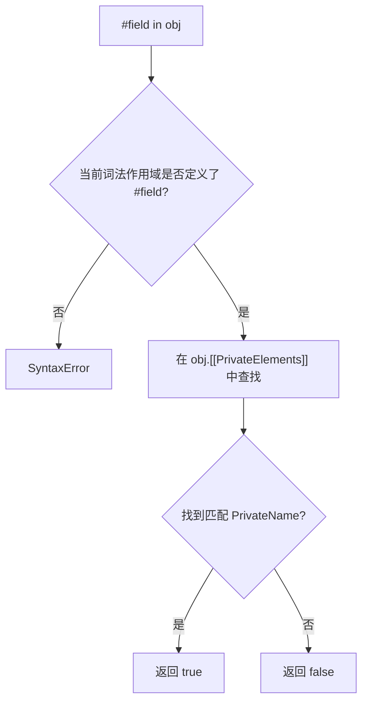
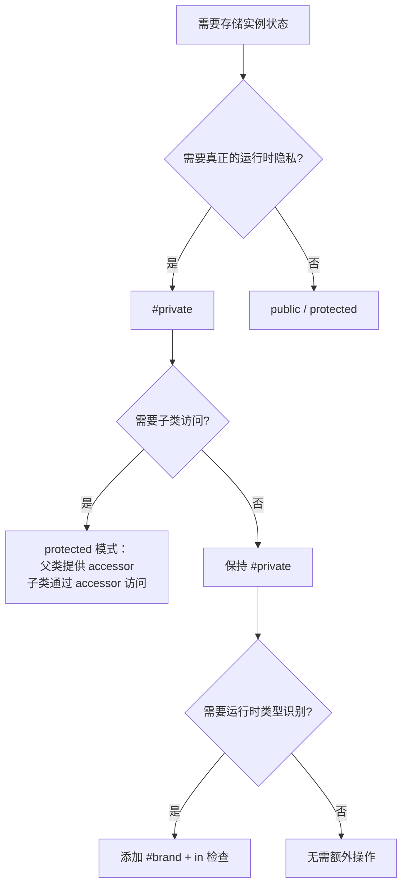

# 私有类字段

> **形式化定义**：ECMAScript 2022 引入的 Private Class Fields 是一种**词法作用域绑定（lexically scoped binding）**机制，通过 `#identifier` 语法在类体内部声明私有标识符。私有字段不是对象的普通属性，而是存储在由类定义创建的** Private Name** 对象中的内部槽。私有字段提供 **hard privacy**：在类外部不可访问、不可枚举、不可被 Proxy 拦截、不可通过反射获取。
>
> 对齐版本：ECMAScript 2025 (ES16) | TypeScript 5.8–6.0 | TS 7.0 Go 编译器预览

---

## 1. 概念定义 (Concept Definition)

### 1.1 形式化定义

ECMA-262 §15.7.3 定义了 Private Element 规范语义：

> *"Private fields are not properties. They are identified by Private Names, which are globally unique values associated with class definitions."* — TC39 Proposal: Class Fields

**私有字段的形式化结构**：

```
类定义 C 在求值时创建一组 Private Names：
  PrivateName(#field) = ⟨ Description: "#field", UniqueID: uuid ⟩

对象实例 O 的私有字段存储为：
  O.[[PrivateElements]] = List of ⟨ PrivateName, Value ⟩

访问规则：
  O.#field 仅在 C 的词法作用域内可解析为 PrivateName(#field)
```

### 1.2 Hard Privacy vs Soft Privacy

| 维度 | Hard Privacy (`#private`) | Soft Privacy (`_private` 约定) | TypeScript `private` |
|------|--------------------------|-------------------------------|----------------------|
| 规范来源 | ECMAScript 2022 (ES13) | 社区约定 | TypeScript 编译时修饰符 |
| 运行时可见性 | ❌ 完全不可见 | ✅ 完全可见 | ✅ 编译后可见 |
| 可枚举性 | N/A（非属性） | 取决于声明 | 普通属性 |
| Proxy 拦截 | ❌ 不可拦截 | ✅ 可拦截 | ✅ 可拦截 |
| `Object.keys` | ❌ 不出现 | ✅ 可能出现 | ✅ 可能出现 |
| `JSON.stringify` | ❌ 不序列化 | ✅ 序列化 | ✅ 序列化 |
| `as any` 绕过 | ❌ 不可能 | ✅ 可能 | ✅ 可能 |
| 性能 | ⚠️ 引擎优化中 | ✅ 与普通属性相同 | ✅ 与普通属性相同 |

**定理 1.1**：`#private` 字段在类外部不可通过任何 ECMAScript 标准 API 访问。

**证明**：私有字段的访问由编译器/解析器在**解析阶段（parse time）**绑定到类体的词法作用域。`O.#field` 的求值需要当前执行上下文包含该类定义的 Private Environment Record。类外部不存在此 Record，因此任何对 `#field` 的引用都会导致早期语法错误（SyntaxError），而非运行时错误。由于私有字段不存储在对象的 Properties 中，所有基于 Properties 的反射 API（`Object.getOwnPropertyDescriptor`、`Reflect.ownKeys` 等）均无法触及。∎

### 1.3 核心概念图谱

```mermaid
mindmap
  root((私有字段 Private Fields))
    语法层
      #field
      #method()
      #getter / #setter
      static #field
    语义层
      Private Name
      Lexical Scoping
      [[PrivateElements]]
    对比层
      WeakMap legacy
      TS private
      _convention
    工具层
      in operator (#field in obj)
      brand checking
```

---

## 2. 属性与特征 (Properties & Characteristics)

### 2.1 私有成员类型矩阵

ECMAScript 2022 支持四类私有成员：

| 成员类型 | 语法 | 存储位置 | 可继承 | 可 brand check |
|---------|------|---------|--------|---------------|
| 私有字段 | `#field` | 实例 `[[PrivateElements]]` | ❌ 不继承 | ✅ `#field in obj` |
| 私有方法 | `#method(){}` | 类闭包中的函数对象 | ❌ 不继承 | ✅ `#method in obj` |
| 私有 getter/setter | `#get foo() / #set foo(v)` | 类闭包中的 accessor pair | ❌ 不继承 | ✅ `#getter in obj` |
| 私有静态成员 | `static #field` | 类构造函数的 `[[PrivateElements]]` | N/A | ✅ `#field in Class` |

### 2.2 词法作用域规则

私有字段的可见性由**词法作用域**决定，而非 `this` 的动态类型：

```typescript
class Outer {
  #secret = 1;

  access(other: Outer) {
    return other.#secret; // ✅ 合法：同一类词法作用域内可访问其他实例的私有字段
  }
}
```

**关键约束**：子类不能访问父类的私有字段，即使通过 `super` 调用或类型转换。

```typescript
class Parent {
  #parentSecret = 1;
}
class Child extends Parent {
  expose() {
    // return this.#parentSecret; // ❌ SyntaxError：Child 的词法作用域无此 PrivateName
  }
}
```

---

## 3. 机制解释 (Mechanism Explanation)

### 3.1 `in` 运算符与品牌检查（Brand Checking）

ES2022 引入 `#field in obj` 语法，用于在运行时检查对象是否拥有某个私有字段：

```
#field in obj 的求值语义：
  1. 在当前 PrivateEnvironment 中查找 #field 对应的 PrivateName
  2. 检查 obj.[[PrivateElements]] 中是否存在该 PrivateName
  3. 返回 boolean
```

此机制实现了**品牌检查（Brand Checking）**：确认对象是否为特定类构造的实例，比 `instanceof` 更可靠（不受跨 Realm 或 prototype 修改影响）。



### 3.2 WeakMap 作为 Legacy 私有字段实现

在 ES2022 之前，社区使用 WeakMap 模拟私有字段：

```typescript
const _private = new WeakMap<{ secret: number }>();

class LegacyPrivate {
  constructor() {
    _private.set(this, { secret: 42 });
  }
  getSecret() {
    return _private.get(this)!.secret;
  }
}
```

**WeakMap 模拟 vs 原生 #private 对比**：

| 维度 | WeakMap 模拟 | `#private` |
|------|-------------|-----------|
| 垃圾回收 | ✅ 自动（WeakMap 键为弱引用） | ✅ 自动（引擎内部管理） |
| 性能 | ⚠️ 每次访问需 Map 查找 | ✅ 直接槽访问（V8 优化后接近普通属性） |
| 调试体验 | ❌ DevTools 中难追踪 | ✅ DevTools 原生支持 |
| 可序列化 | ❌ 不会出现在 JSON | ❌ 不会出现在 JSON |
| 语法噪音 | ⚠️ 需额外变量和 setter/getter | ✅ 原生语法 |
| 子类可见性 | 可设计为共享或隔离 | ❌ 严格隔离（不继承） |

---

## 4. 实例示例 (Examples)

### 4.1 完整私有成员声明

```typescript
class SecureAccount {
  #balance = 0;              // 私有字段
  #owner: string;            // 带类型的私有字段

  static #accountCounter = 0; // 私有静态字段

  constructor(owner: string, initial: number) {
    this.#owner = owner;
    this.#balance = initial;
    SecureAccount.#accountCounter++;
  }

  #validate(amount: number) {  // 私有方法
    if (amount < 0) throw new RangeError("Negative amount");
  }

  get #auditLog() {           // 私有 getter
    return `[${this.#owner}] balance: ${this.#balance}`;
  }

  deposit(amount: number) {
    this.#validate(amount);
    this.#balance += amount;
    console.log(this.#auditLog);
  }

  static getCount() {
    return SecureAccount.#accountCounter;
  }
}
```

### 4.2 Brand Checking 用例

```typescript
class Token {
  #brand = true; // 仅用于品牌检查

  static isToken(obj: unknown): obj is Token {
    return obj instanceof Object && #brand in obj;
  }
}

const t = new Token();
console.log(Token.isToken(t));     // true
console.log(Token.isToken({}));    // false
console.log(Token.isToken(null));  // false
```

### 4.3 跨实例访问私有字段

```typescript
class Counter {
  #count = 0;

  combine(other: Counter): Counter {
    const result = new Counter();
    (result as any).#count = this.#count + other.#count; // ❌ 不能在类外部访问
    return result;
  }
}
```

正确做法（类内部可访问任意实例的私有字段）：

```typescript
class Counter {
  #count = 0;

  combine(other: Counter): Counter {
    const result = new Counter();
    result.#count = this.#count + other.#count; // ✅ 同一类作用域内合法
    return result;
  }
}
```

---

## 5. 进阶代码示例

### 5.1 私有字段与 Symbol 联合实现名义类型

```typescript
const brandSymbol = Symbol('brand');

class User {
  #id: number;
  [brandSymbol] = 'User' as const;

  constructor(id: number) {
    this.#id = id;
  }

  getId() { return this.#id; }
}

class Admin {
  #id: number;
  [brandSymbol] = 'Admin' as const;

  constructor(id: number) {
    this.#id = id;
  }

  getId() { return this.#id; }
}

// 结构类型相同但 brandSymbol 值不同，可区分类型
const u = new User(1);
const a = new Admin(1);
```

### 5.2 私有静态块实现单例模式

```typescript
class Database {
  static #instance: Database;
  #connection: string;

  static {
    // 静态块中可执行复杂初始化
    Database.#instance = new Database('default');
  }

  private constructor(connection: string) {
    this.#connection = connection;
  }

  static getInstance(): Database {
    return Database.#instance;
  }

  query(sql: string) {
    return `Executing "${sql}" on ${this.#connection}`;
  }
}

const db = Database.getInstance();
console.log(db.query('SELECT 1'));
```

### 5.3 带品牌检查的 Mixin 模式

```typescript
type Constructor<T = {}> = new (...args: any[]) => T;

function Timestamped<TBase extends Constructor>(Base: TBase) {
  class TimestampedClass extends Base {
    #createdAt = Date.now();

    getCreatedAt() {
      return this.#createdAt;
    }

    static isTimestamped(obj: unknown): obj is TimestampedClass {
      return obj instanceof Object && #createdAt in (obj as TimestampedClass);
    }
  }
  return TimestampedClass;
}

class Document {
  constructor(public title: string) {}
}

const TimestampedDocument = Timestamped(Document);
const doc = new TimestampedDocument('Hello');
console.log(TimestampedDocument.isTimestamped(doc)); // true
```

### 5.4 私有字段与 Proxy 的交互

```typescript
class SecretHolder {
  #secret = 'hidden';

  getSecret() {
    return this.#secret;
  }
}

const holder = new SecretHolder();
const proxy = new Proxy(holder, {
  get(target, prop) {
    console.log(`Accessing ${String(prop)}`);
    return (target as any)[prop];
  }
});

// Proxy 无法拦截 #secret 访问，因为私有字段不经过 [[Get]]
console.log(proxy.getSecret()); // "hidden"（通过公共方法间接访问）
// proxy.#secret; // SyntaxError: 在类外部不可访问
```

---

## 6. 权威参考 (References)

### ECMA-262 规范

| 章节 | 主题 |
|------|------|
| §15.7.3 | Class Element Evaluation |
| §15.7.4 | Private Methods and Accessors |
| §6.1.7.2 | `[[PrivateElements]]` Internal Slot |

### TC39 提案

- **Class Fields Proposal (ES2022)** — <https://github.com/tc39/proposal-class-fields>
- **Private Methods and Accessors (ES2022)** — <https://github.com/tc39/proposal-private-methods>

### MDN Web Docs

- **MDN: Private class features** — <https://developer.mozilla.org/en-US/docs/Web/JavaScript/Reference/Classes/Private_class_fields>
- **MDN: `in` operator with private fields** — <https://developer.mozilla.org/en-US/docs/Web/JavaScript/Reference/Operators/in#private_fields_and_methods>

---

## 7. 版本演进 (Version Evolution)

| ES 版本 | 特性 | 说明 |
|---------|------|------|
| ES2015 (ES6) | `class` 语法 | 无原生私有字段，依赖约定或 WeakMap |
| ES2022 (ES13) | `#private` 字段 | 实例私有字段、私有方法、私有 accessor |
| ES2022 (ES13) | `static #field` | 类级别的私有静态成员 |
| ES2022 (ES13) | `#field in obj` | 品牌检查运算符 |
| ES2025 (ES16) | 无新增 | 引擎实现成熟（V8 12.4+ 完全优化） |

| TS 版本 | 特性 | 说明 |
|---------|------|------|
| TS 3.8 | `#private` 编译支持 | 编译目标 < ES2022 时使用 WeakMap 模拟 |
| TS 4.3 | `override` + 私有字段 | 更好的类继承提示 |
| TS 5.x | `--useDefineForClassFields` | 类字段语义对齐 ECMAScript |

---

## 8. 思维表征 (Mental Representation)

### 8.1 隐私机制多维矩阵

| 机制 | 运行时安全 | 跨 Realm 安全 | 性能 | DevTools 可见 | 语法优雅 |
|------|-----------|--------------|------|--------------|---------|
| `_convention` | ❌ | ❌ | ✅ | ✅ | ⭐ |
| TypeScript `private` | ❌ | ❌ | ✅ | ✅ | ⭐⭐ |
| `Symbol` 键 | ⚠️ 可枚举 | ⚠️ 可反射 | ✅ | ⚠️ | ⭐⭐ |
| WeakMap | ✅ | ✅ | ⚠️ | ❌ | ⭐⭐ |
| `#private` | ✅ | ✅ | ✅ | ✅ | ⭐⭐⭐⭐⭐ |

### 8.2 私有字段访问控制决策树



---

## 9. Trade-off 与 Pitfalls

### 9.1 `#private` 不继承的语义陷阱

私有字段在子类中不可见，这意味着子类无法直接访问父类的内部状态。若需要在继承层次中共享状态，应使用 `protected` 模式的公有 getter/setter，或重新设计类的封装边界。

```typescript
class Parent {
  #value = 1;
  getValue() { return this.#value; }
}

class Child extends Parent {
  // 无法直接读取 this.#value，必须通过 getValue()
}
```

### 9.2 编译到 ES2021 或更低目标时的 WeakMap 开销

当 TypeScript 编译目标低于 ES2022 时，`#private` 字段会被编译为 WeakMap 模拟：

```typescript
// 源码
class A { #x = 1; }

// 编译到 ES2020
var _A_x = new WeakMap();
class A {
  constructor() {
    _A_x.set(this, 1);
  }
}
```

此转换引入：

1. 每个类一个 WeakMap 分配
2. 每次字段访问的 Map 查找开销
3. 构造函数中的额外 `set` 调用

**建议**：在支持 ES2022 的运行时使用 `"target": "ES2022"` 或 `"useDefineForClassFields": true` 以获得原生性能。

### 9.3 私有字段与结构化类型的冲突

TypeScript 的结构类型系统不识别 `#private` 字段的品牌效应。两个具有相同公有形状但不同私有字段的类在类型上被认为是兼容的：

```typescript
class A { #secret = 1; public name = "A"; }
class B { #secret = 2; public name = "B"; }

const a: A = new B(); // ⚠️ TypeScript 允许！结构类型只看 public 形状
```

此行为符合 TypeScript 的结构类型哲学，但在需要名义类型区分时，应结合 `Symbol` 或品牌类型（Branded Type）模式。

---

## 10. 权威外部链接

| 资源 | 说明 | 链接 |
|------|------|------|
| TC39 Class Fields Proposal | 私有字段规范提案 | [github.com/tc39/proposal-class-fields](https://github.com/tc39/proposal-class-fields) |
| TC39 Private Methods Proposal | 私有方法规范提案 | [github.com/tc39/proposal-private-methods](https://github.com/tc39/proposal-private-methods) |
| MDN — Private class features | 私有字段完整文档 | [developer.mozilla.org/en-US/docs/Web/JavaScript/Reference/Classes/Private_class_fields](https://developer.mozilla.org/en-US/docs/Web/JavaScript/Reference/Classes/Private_class_fields) |
| MDN — `in` operator (private) | `#field in obj` 文档 | [developer.mozilla.org/en-US/docs/Web/JavaScript/Reference/Operators/in#private_fields_and_methods](https://developer.mozilla.org/en-US/docs/Web/JavaScript/Reference/Operators/in#private_fields_and_methods) |
| V8 Blog — Private fields | V8 私有字段实现解析 | [v8.dev/features/class-fields](https://v8.dev/features/class-fields) |
| TypeScript 3.8 Release | `#private` 编译支持 | [devblogs.microsoft.com/typescript/announcing-typescript-3-8](https://devblogs.microsoft.com/typescript/announcing-typescript-3-8/) |
| 2ality — Class fields | Dr. Axel 深度解析 | [2ality.com/2019/07/private-class-fields.html](https://2ality.com/2019/07/private-class-fields.html) |
| JavaScript Info — Private fields | 教程式讲解 | [javascript.info/private-protected-properties-methods](https://javascript.info/private-protected-properties-methods) |

---

**参考规范**：ECMA-262 §15.7.3 | TC39 Class Fields Proposal | MDN: Private class features
