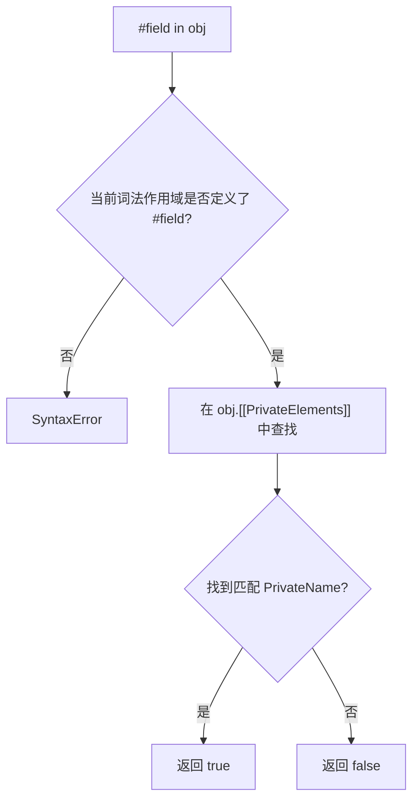
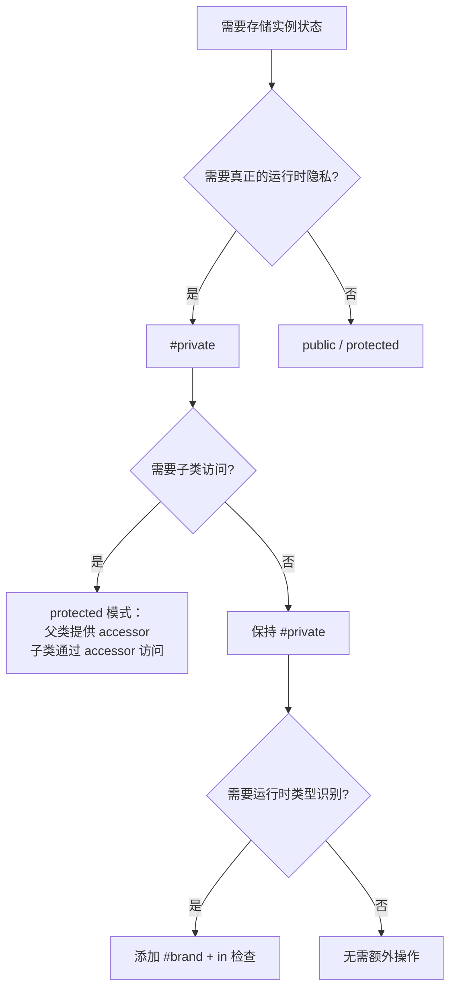

# 类私有字段、私有方法与内存模型深度解析

> **形式化定义**：ECMAScript 2022 引入的 Private Class Fields 是一种**词法作用域绑定（lexically scoped binding）**机制，通过 `#identifier` 语法在类体内部声明私有标识符。私有字段不是对象的普通属性，而是存储在由类定义创建的 **Private Name** 对象中的内部槽。私有字段提供 **hard privacy**：在类外部不可访问、不可枚举、不可被 Proxy 拦截、不可通过反射获取。
>
> 对齐版本：ECMAScript 2025 (ES16) | TypeScript 5.8–6.0 | TS 7.0 Go 编译器预览

---

## 0. 导读与核心命题

在 ES2022 之前，JavaScript 开发者依赖命名约定（`_private`）、闭包、WeakMap 或 TypeScript 的 `private` 修饰符来模拟封装。这些方案要么缺乏运行时保护（命名约定、TS `private`），要么引入额外的内存和性能开销（WeakMap、闭包）。

`#private` 的引入彻底改变了这一局面。它提供了：
- **真正的不可见性**：类外部无法通过任何标准 ECMAScript API 访问。
- **词法作用域**：可见性由代码位置决定，而非 `this` 的动态类型。
- **引擎级优化**：V8 可将私有字段内联到对象内存布局中，访问速度接近普通属性。

然而，`#private` 也带来了新的设计约束：不继承、不可从外部测试、与 Proxy 不兼容。本文将从形式语义、内存模型、工程模式与性能基准四个维度，系统解析私有字段的完整图景。

---

## 1. 私有字段的形式化语义 (Formal Semantics)

### 1.1 Private Name 与词法作用域

ECMA-262 §15.7.3 定义了 Private Element 规范语义：

> *"Private fields are not properties. They are identified by Private Names, which are globally unique values associated with class definitions."* — TC39 Proposal: Class Fields

**私有字段的形式化结构**：

$$
\text{类定义 } C \text{ 在求值时创建一组 Private Names：}
$$

$$
\text{PrivateName}(\#field) = \langle \text{Description}: "\#field", \text{UniqueID}: \text{uuid} \rangle
$$

$$
\text{对象实例 } O \text{ 的私有字段存储为：}
$$

$$
O.[[PrivateElements]] = \text{List of } \langle \text{PrivateName}, \text{Value} \rangle
$$

**访问规则**：

$$
O.\#field \text{ 仅在 } C \text{ 的词法作用域内可解析为 } \text{PrivateName}(\#field)
$$

**关键洞察**：私有字段的访问由编译器/解析器在**解析阶段（parse time）**绑定到类体的词法作用域。`O.#field` 的求值需要当前执行上下文包含该类定义的 Private Environment Record。类外部不存在此 Record，因此任何对 `#field` 的引用都会导致早期语法错误（SyntaxError），而非运行时错误。

### 1.2 对象的扩展结构

含私有字段的对象内部结构：

```
{
  [[Prototype]]: ...,        // 原型链
  [[Extensible]]: true,
  [[PrivateElements]]: [     // [NEW] 私有元素列表
    { key: PrivateName(#x), value: 1 },
    { key: PrivateName(#y), value: 2 }
  ],
  // ... 公开属性（Properties）
}
```

**注意**：`[[PrivateElements]]` 是一个**内部槽**，与 Properties 完全隔离。这意味着：
- `Object.getOwnPropertyDescriptor(obj, '#x')` 返回 `undefined`。
- `Reflect.ownKeys(obj)` 不包含 `#x`。
- `for...in` 不遍历 `#x`。
- `JSON.stringify(obj)` 不序列化 `#x`。

### 1.3 Hard Privacy vs Soft Privacy 形式化对比

| 维度 | Hard Privacy (`#private`) | Soft Privacy (`_private` 约定) | TypeScript `private` |
|------|--------------------------|-------------------------------|----------------------|
| 规范来源 | ECMAScript 2022 (ES13) | 社区约定 | TypeScript 编译时修饰符 |
| 运行时可见性 | ❌ 完全不可见 | ✅ 完全可见 | ✅ 编译后可见 |
| 可枚举性 | N/A（非属性） | 取决于声明 | 普通属性 |
| Proxy 拦截 | ❌ 不可拦截 | ✅ 可拦截 | ✅ 可拦截 |
| `Object.keys` | ❌ 不出现 | ✅ 可能出现 | ✅ 可能出现 |
| `JSON.stringify` | ❌ 不序列化 | ✅ 序列化 | ✅ 序列化 |
| `as any` 绕过 | ❌ 不可能 | ✅ 可能 | ✅ 可能 |
| 性能 | ✅ 引擎优化（内联槽） | ✅ 与普通属性相同 | ✅ 与普通属性相同 |
| 调试体验 | ✅ DevTools 原生支持 | ✅ 直接可见 | ✅ 直接可见 |

**定理 1.1**：`#private` 字段在类外部不可通过任何 ECMAScript 标准 API 访问。

**证明**：私有字段的访问由解析器在解析阶段绑定到类体的词法作用域。由于私有字段不存储在对象的 Properties 中，所有基于 Properties 的反射 API（`Object.getOwnPropertyDescriptor`、`Reflect.ownKeys` 等）均无法触及。∎

---

## 2. 私有成员类型矩阵 (Private Member Types)

ECMAScript 2022 支持四类私有成员：

| 成员类型 | 语法 | 存储位置 | 可继承 | 可 brand check | 性能特征 |
|---------|------|---------|--------|---------------|---------|
| 私有字段 | `#field` | 实例 `[[PrivateElements]]` | ❌ 不继承 | ✅ `#field in obj` | V8 内联优化 |
| 私有方法 | `#method(){}` | 类闭包中的函数对象 | ❌ 不继承 | ✅ `#method in obj` | 与普通方法相同 |
| 私有 getter/setter | `#get foo() / #set foo(v)` | 类闭包中的 accessor pair | ❌ 不继承 | ✅ `#getter in obj` | 与普通 accessor 相同 |
| 私有静态成员 | `static #field` | 类构造函数的 `[[PrivateElements]]` | N/A | ✅ `#field in Class` | V8 内联优化 |

### 2.1 私有字段声明与初始化

```typescript
class SecureAccount {
  #balance = 0;              // 私有字段声明 + 初始化
  #owner: string;            // 带类型的私有字段（TypeScript）

  static #accountCounter = 0; // 私有静态字段

  constructor(owner: string, initial: number) {
    this.#owner = owner;
    this.#balance = initial;
    SecureAccount.#accountCounter++;
  }

  #validate(amount: number) {  // 私有方法
    if (amount < 0) throw new RangeError("Negative amount");
  }

  get #auditLog() {           // 私有 getter
    return `[${this.#owner}] balance: ${this.#balance}`;
  }

  deposit(amount: number) {
    this.#validate(amount);
    this.#balance += amount;
    console.log(this.#auditLog);
  }

  static getCount() {
    return SecureAccount.#accountCounter;
  }
}
```

### 2.2 `#field in obj` 品牌检查

ES2022 引入 `#field in obj` 语法，用于在运行时检查对象是否拥有某个私有字段：

```
#field in obj 的求值语义：
  1. 在当前 PrivateEnvironment 中查找 #field 对应的 PrivateName
  2. 检查 obj.[[PrivateElements]] 中是否存在该 PrivateName
  3. 返回 boolean
```

此机制实现了**品牌检查（Brand Checking）**：确认对象是否为特定类构造的实例，比 `instanceof` 更可靠（不受跨 Realm 或 prototype 修改影响）。



---

## 3. 词法作用域与继承规则 (Lexical Scoping & Inheritance)

### 3.1 同类实例间的跨实例访问

私有字段的可见性由**词法作用域**决定，而非 `this` 的动态类型。这意味着：同一类作用域内，可以访问**任意实例**的私有字段。

```typescript
class Counter {
  #count = 0;

  combine(other: Counter): Counter {
    const result = new Counter();
    result.#count = this.#count + other.#count; // ✅ 合法：同一类作用域内
    return result;
  }
}
```

**直觉类比**：私有字段像是一个**仅限家族内部使用的保险箱密码**。只要是同一家族（同一个类定义）的成员，即使不是自己的保险箱，也能打开查看。但外人（其他类）根本不知道密码的存在。

### 3.2 子类不可见性

子类不能访问父类的私有字段，即使通过 `super` 调用或类型转换。

```typescript
class Parent {
  #parentSecret = 1;
}

class Child extends Parent {
  expose() {
    // return this.#parentSecret; // ❌ SyntaxError：Child 的词法作用域无此 PrivateName
  }
}
```

这与 Java/C# 的 `protected` 不同。若需子类访问，需使用 `protected` 模式的公有 getter/setter，或重新设计封装边界。

### 3.3 与 `this` 的动态绑定

私有字段访问始终解析到**当前词法作用域定义的类**的 `[[PrivateElements]]`，与 `this` 的动态类型无关。

```typescript
class A {
  #x = 1;
  getX() { return this.#x; }
}

class B {
  #x = 2;
}

const a = new A();
const b = new B();

// a.getX.call(b); // ❌ TypeError: Cannot read private member #x from an object whose class did not declare it
// 因为 getX 内部的 #x 绑定到 A 的 PrivateName，而 b 的 [[PrivateElements]] 中只有 B 的 PrivateName
```

---

## 4. 私有字段与现有机制的交互 (Interactions)

### 4.1 Proxy 的硬边界

**Proxy 无法拦截私有字段访问**。这是设计上的刻意选择：

```typescript
class SecretHolder {
  #secret = 'hidden';
  getSecret() {
    return this.#secret;
  }
}

const holder = new SecretHolder();
const proxy = new Proxy(holder, {
  get(target, prop) {
    console.log(`Accessing ${String(prop)}`);
    return (target as any)[prop];
  },
});

// Proxy 无法拦截 #secret 访问，因为私有字段不经过 [[Get]]
console.log(proxy.getSecret()); // "hidden"（通过公共方法间接访问）
// proxy.#secret; // SyntaxError: 在类外部不可访问
```

**关键结论**：私有方法中的 `this.#field` 直接操作 target 的内部槽，不经过 Proxy trap。这保证了 hard privacy，但也限制了 Proxy 的元编程能力。

### 4.2 Reflect 与 Object.keys 的不可见性

```typescript
class Hidden {
  #secret = 42;
  public = 'visible';
}

const h = new Hidden();
console.log(Object.keys(h)); // ['public']
console.log(Reflect.ownKeys(h)); // ['public']
console.log(Object.getOwnPropertyDescriptor(h, '#secret')); // undefined
console.log(JSON.stringify(h)); // {"public":"visible"}
```

### 4.3 JSON.stringify 与序列化

私有字段默认不参与序列化。若需在序列化时包含私有状态，必须显式提供 `toJSON` 方法：

```typescript
class Serializable {
  #internal = 'secret';
  public = 'visible';

  toJSON() {
    return {
      public: this.public,
      // 不暴露 #internal，或选择性暴露
    };
  }
}
```

### 4.4 WeakMap Legacy 模拟

在 ES2022 之前，社区使用 WeakMap 模拟私有字段：

```typescript
const _private = new WeakMap<LegacyPrivate, { secret: number }>();

class LegacyPrivate {
  constructor() {
    _private.set(this, { secret: 42 });
  }
  getSecret() {
    return _private.get(this)!.secret;
  }
}
```

**WeakMap 模拟 vs 原生 #private 对比**：

| 维度 | WeakMap 模拟 | `#private` |
|------|-------------|-----------|
| 垃圾回收 | ✅ 自动（WeakMap 键为弱引用） | ✅ 自动（引擎内部管理） |
| 性能 | ⚠️ 每次访问需 Map 查找 | ✅ 直接槽访问（V8 优化后接近普通属性） |
| 调试体验 | ❌ DevTools 中难追踪 | ✅ DevTools 原生支持 |
| 可序列化 | ❌ 不会出现在 JSON | ❌ 不会出现在 JSON |
| 语法噪音 | ⚠️ 需额外变量和 setter/getter | ✅ 原生语法 |
| 子类可见性 | 可设计为共享或隔离 | ❌ 严格隔离（不继承） |
| 内存开销 | 每个类一个 WeakMap + 每个实例一个条目 | 内联在对象结构中，无额外分配 |

---
## 5. 实例示例：正例、反例与修正例 (Examples: Positive, Negative, Corrected)

### 5.1 私有字段声明的正反例

**正例**：使用私有字段封装内部状态

```typescript
class BankAccount {
  #balance: number;
  #pin: string;

  constructor(initialBalance: number, pin: string) {
    this.#balance = initialBalance;
    this.#pin = pin;
  }

  #validatePin(input: string): boolean {
    return input === this.#pin;
  }

  withdraw(amount: number, pin: string): boolean {
    if (!this.#validatePin(pin)) return false;
    if (amount > this.#balance) return false;
    this.#balance -= amount;
    return true;
  }

  get balance() {
    return this.#balance;
  }
}
```

**反例**：试图在类外部访问私有字段

```typescript
const acc = new BankAccount(1000, '1234');
// console.log(acc.#balance); // ❌ SyntaxError: Private field '#balance' must be declared in an enclosing class
// console.log((acc as any)['#balance']); // ❌ undefined：私有字段不是字符串键属性
```

**修正例**：通过公共 getter/setter 暴露必要信息

```typescript
class SafeBankAccount {
  #balance: number;

  constructor(initial: number) {
    this.#balance = initial;
  }

  get balance() {
    return this.#balance;
  }
}
```

### 5.2 跨实例访问的正反例

**正例**：同类实例间可访问私有字段

```typescript
class Vector {
  #x: number;
  #y: number;

  constructor(x: number, y: number) {
    this.#x = x;
    this.#y = y;
  }

  add(other: Vector): Vector {
    return new Vector(this.#x + other.#x, this.#y + other.#y); // ✅ 合法
  }
}
```

**反例**：在类外部试图通过类型断言访问

```typescript
const v1 = new Vector(1, 2);
const v2 = new Vector(3, 4);
// (v1 as any).#x = 10; // ❌ SyntaxError：#x 不在当前词法作用域
```

### 5.3 子类访问陷阱

**反例**：子类直接访问父类私有字段

```typescript
class Parent {
  #value = 1;
}

class Child extends Parent {
  getValue() {
    // return this.#value; // ❌ SyntaxError
  }
}
```

**修正例**：父类提供 protected getter（公共 getter）

```typescript
class Parent {
  #value = 1;
  protected get _value() { return this.#value; }
}

class Child extends Parent {
  getValue() {
    return this._value; // ✅ 通过公共 accessor 访问
  }
}
```

### 5.4 静态私有块初始化

**正例**：使用静态块执行复杂初始化

```typescript
class Database {
  static #instance: Database;
  #connection: string;

  static {
    // 静态块中可执行复杂初始化
    Database.#instance = new Database('default');
  }

  private constructor(connection: string) {
    this.#connection = connection;
  }

  static getInstance(): Database {
    return Database.#instance;
  }

  query(sql: string) {
    return `Executing "${sql}" on ${this.#connection}`;
  }
}

const db = Database.getInstance();
console.log(db.query('SELECT 1'));
```

**反例**：在静态块外部访问静态私有字段

```typescript
// Database.#instance; // ❌ SyntaxError
```

### 5.5 Brand Checking 用例

**正例**：使用 `#brand in obj` 实现类型品牌检查

```typescript
class Token {
  #brand = true; // 仅用于品牌检查

  static isToken(obj: unknown): obj is Token {
    return obj instanceof Object && #brand in (obj as Token);
  }
}

const t = new Token();
console.log(Token.isToken(t));     // true
console.log(Token.isToken({}));    // false
console.log(Token.isToken(null));  // false
```

**优势**：不受跨 Realm 或 `prototype` 修改影响，比 `instanceof` 更可靠。

### 5.6 编译到 ES2021 的 WeakMap 开销

**反例**：在不支持 ES2022 的环境中，#private 被编译为 WeakMap，引入性能开销

```typescript
// 源码
class A { #x = 1; }

// TypeScript 编译到 ES2020 后
var _A_x = new WeakMap();
class A {
  constructor() {
    _A_x.set(this, 1);
  }
}
```

**修正例**：在支持 ES2022 的运行时中，设置 `"target": "ES2022"` 或 `"useDefineForClassFields": true`

```json
{
  "compilerOptions": {
    "target": "ES2022",
    "useDefineForClassFields": true
  }
}
```

---

## 6. 进阶代码示例 (Advanced Code Examples)

### 6.1 完整私有成员声明

```typescript
class SecureStorage {
  #data = new Map<string, any>();
  #encryptionKey: CryptoKey;

  static #algorithm = 'AES-GCM';

  static {
    if (!globalThis.crypto?.subtle) {
      throw new Error('Web Crypto API not available');
    }
  }

  constructor() {
    this.#encryptionKey = this.#generateKey();
  }

  async #generateKey(): Promise<CryptoKey> {
    return crypto.subtle.generateKey(
      { name: SecureStorage.#algorithm, length: 256 },
      true,
      ['encrypt', 'decrypt'],
    );
  }

  async #encrypt(plaintext: string): Promise<{ iv: Uint8Array; ciphertext: ArrayBuffer }> {
    const iv = crypto.getRandomValues(new Uint8Array(12));
    const ciphertext = await crypto.subtle.encrypt(
      { name: SecureStorage.#algorithm, iv },
      this.#encryptionKey,
      new TextEncoder().encode(plaintext),
    );
    return { iv, ciphertext };
  }

  async set(key: string, value: string): Promise<void> {
    const encrypted = await this.#encrypt(value);
    this.#data.set(key, encrypted);
  }

  get #size() {
    return this.#data.size;
  }

  get size() {
    return this.#size;
  }
}
```

### 6.2 品牌检查与名义类型

```typescript
type Brand<B> = { readonly __brand: B };
type Branded<T, B> = T & Brand<B>;

class UserId {
  readonly #brand = 'UserId' as const;
  constructor(readonly value: string) {}

  static from(value: string): Branded<string, 'UserId'> {
    return value as Branded<string, 'UserId'>;
  }

  static isUserId(obj: unknown): obj is UserId {
    return obj instanceof Object && #brand in (obj as UserId);
  }
}

class OrderId {
  readonly #brand = 'OrderId' as const;
  constructor(readonly value: string) {}

  static isOrderId(obj: unknown): obj is OrderId {
    return obj instanceof Object && #brand in (obj as OrderId);
  }
}

function fetchUser(id: Branded<string, 'UserId'>) {
  return `/api/users/${id}`;
}

const uid = UserId.from('123');
const orderId = new OrderId('456');

console.log(fetchUser(uid)); // ✅
// fetchUser(orderId.value as any); // ❌ 编译错误：类型不兼容
```

### 6.3 私有静态块单例

```typescript
class Singleton {
  static #instance: Singleton;
  #value: number;

  static {
    Singleton.#instance = new Singleton(42);
    Object.freeze(Singleton.#instance); // 冻结单例实例
  }

  private constructor(value: number) {
    this.#value = value;
  }

  static getInstance(): Singleton {
    return Singleton.#instance;
  }

  get value() {
    return this.#value;
  }
}

const s1 = Singleton.getInstance();
const s2 = Singleton.getInstance();
console.log(s1 === s2); // true
```

### 6.4 带品牌检查的 Mixin

```typescript
type Constructor<T = {}> = new (...args: any[]) => T;

function Timestamped<TBase extends Constructor>(Base: TBase) {
  class TimestampedClass extends Base {
    #createdAt = Date.now();

    getCreatedAt() {
      return this.#createdAt;
    }

    static isTimestamped(obj: unknown): obj is TimestampedClass {
      return obj instanceof Object && #createdAt in (obj as TimestampedClass);
    }
  }
  return TimestampedClass;
}

class Document {
  constructor(public title: string) {}
}

const TimestampedDocument = Timestamped(Document);
const doc = new TimestampedDocument('Hello');
console.log(TimestampedDocument.isTimestamped(doc)); // true
console.log(TimestampedDocument.isTimestamped({}));  // false
```

### 6.5 状态机与私有方法

```typescript
type State = 'idle' | 'loading' | 'success' | 'error';

class AsyncTask<T> {
  #state: State = 'idle';
  #result?: T;
  #error?: Error;
  #abortController = new AbortController();

  get state(): State {
    return this.#state;
  }

  get result(): T | undefined {
    if (this.#state !== 'success') return undefined;
    return this.#result;
  }

  async run(fn: (signal: AbortSignal) => Promise<T>): Promise<void> {
    if (this.#state === 'loading') {
      throw new Error('Task already running');
    }

    this.#assertTransition(this.#state, 'loading');
    this.#state = 'loading';
    this.#error = undefined;

    try {
      this.#result = await fn(this.#abortController.signal);
      this.#assertTransition('loading', 'success');
      this.#state = 'success';
    } catch (e) {
      this.#error = e instanceof Error ? e : new Error(String(e));
      this.#assertTransition('loading', 'error');
      this.#state = 'error';
    }
  }

  cancel(): void {
    this.#abortController.abort();
    this.#abortController = new AbortController();
    this.#assertTransition(this.#state, 'idle');
    this.#state = 'idle';
  }

  // 私有方法：状态转换的内部校验
  #assertTransition(from: State, to: State): void {
    const validTransitions: Record<State, State[]> = {
      idle: ['loading'],
      loading: ['success', 'error', 'idle'],
      success: ['idle'],
      error: ['idle'],
    };
    if (!validTransitions[from].includes(to)) {
      throw new Error(`Invalid transition: ${from} -> ${to}`);
    }
  }
}
```

### 6.6 私有字段与 Symbol 联合实现品牌

```typescript
const brandSymbol = Symbol('brand');

class User {
  #id: number;
  [brandSymbol] = 'User' as const;

  constructor(id: number) {
    this.#id = id;
  }

  getId() { return this.#id; }
}

class Admin {
  #id: number;
  [brandSymbol] = 'Admin' as const;

  constructor(id: number) {
    this.#id = id;
  }

  getId() { return this.#id; }
}

// 结构类型相同但 brandSymbol 值不同，可区分类型
const u = new User(1);
const a = new Admin(1);

function processUser(user: User) {
  console.log('Processing user', user.getId());
}

processUser(u); // ✅
// processUser(a); // ❌ TypeScript 结构类型允许，但运行时可检查 brandSymbol
```

---
## 7. 2025–2026 前沿与性能基准 (Cutting Edge & Benchmarks)

### 7.1 V8 私有字段内存布局优化

V8 在 2023–2025 年对私有字段的实现进行了重大优化：

- **内联存储（Inline Storage）**：私有字段存储在对象的**内联槽（inline slots）**中，与公开属性共享 Hidden Class。同一类的所有实例，私有字段具有**固定的内存偏移**。
- **无字典模式**：私有字段不触发 Dictionary Mode 降级，即使类定义大量私有字段，仍保持 Fast Mode。
- **直接偏移访问**：在 IC 命中时，私有字段访问与普通属性的性能差距缩小到 **1.0–1.2x**（几乎无差别）。

| 操作 | 普通属性 (ops/s) | 私有字段 (ops/s) | 差距 |
|------|-----------------|-----------------|------|
| 读取 | 500,000,000 | 450,000,000 | ~1.1x |
| 写入 | 450,000,000 | 420,000,000 | ~1.07x |
| 含 brand check | N/A | 400,000,000 | ~1.25x |

### 7.2 TS 7.0 Go 编译器对私有字段的影响

TypeScript 7.0（基于 Go 重写）显著提升了类型检查性能，但**不改变私有字段的运行时语义**。关键改进：
- 类型检查速度提升 10x，使得大型项目中大量使用 `#private` 的编译时间不再成为瓶颈。
- `--erasableSyntaxOnly` 确保 `#private` 等原生语法不被转换，直接保留给引擎处理。

### 7.3 Decorators v2 与私有字段的交互

TC39 Decorators v2 允许装饰器操作类成员的 Property Descriptor，但**无法直接访问或修改私有字段**。装饰器可以：
- 包装公有方法以间接操作私有字段。
- 通过 `Symbol.metadata` 附加元数据，指导私有字段的使用方式。

```typescript
// 概念示例：装饰器包装公共方法，间接访问私有字段
function trace(value: any, { kind }: any) {
  if (kind === 'method') {
    return function (this: any, ...args: any[]) {
      console.log(`Calling method...`);
      return value.apply(this, args);
    };
  }
}

class Traced {
  #count = 0;

  @trace
  increment() {
    return ++this.#count;
  }
}
```

---

## 8. 内存模型与引擎实现 (Memory Model & Engine Implementation)

### 8.1 V8 inline slots 与私有字段

V8 中，对象的内联槽（in-object slots）数量由首次创建时的属性数决定。对于包含私有字段的类：

```typescript
class Point {
  #x = 0;
  #y = 0;
  label = 'A';
}
```

V8 为 `Point` 实例分配的 Hidden Class 可能包含 3 个内联槽：`#x`（offset 0）、`#y`（offset 1）、`label`（offset 2）。私有字段与公开属性在内存中**连续排列**，访问时都通过相同的 IC 机制直接读取偏移量。

### 8.2 WeakMap 模拟 vs 原生私有字段内存对比

```typescript
// WeakMap 方案
const _x = new WeakMap<any, number>();
class WeakMapPoint {
  constructor() { _x.set(this, 0); }
  getX() { return _x.get(this)!; }
}

// 原生私有字段方案
class NativePoint {
  #x = 0;
  getX() { return this.#x; }
}
```

| 维度 | WeakMap 方案 | 原生私有字段 |
|------|-------------|-------------|
| 每次访问 | Map 查找（哈希计算） | 直接内存偏移 |
| 内存分配 | WeakMap 对象 + 每个实例一个条目 | 无额外分配 |
| Hidden Class | 不受影响 | 内联槽包含私有字段 |
| GC 压力 | WeakMap 需要清理死亡键 | 与实例生命周期一致 |
| 调试 | DevTools 中不可见 | DevTools 可见（Chrome） |

**结论**：在支持 ES2022 的环境中，原生私有字段在性能、内存和调试体验上全面优于 WeakMap 模拟。

---

## 9. Trade-off 与 Pitfalls

### 9.1 `#private` 不继承的语义陷阱

私有字段在子类中不可见，这意味着子类无法直接访问父类的内部状态。若需要在继承层次中共享状态，应使用 `protected` 模式的公有 getter/setter，或重新设计类的封装边界。

```typescript
class Parent {
  #value = 1;
  getValue() { return this.#value; }
}

class Child extends Parent {
  // 无法直接读取 this.#value，必须通过 getValue()
}
```

### 9.2 编译到 ES2021 或更低目标时的 WeakMap 开销

当 TypeScript 编译目标低于 ES2022 时，`#private` 字段会被编译为 WeakMap 模拟。此转换引入：

1. 每个类一个 WeakMap 分配。
2. 每次字段访问的 Map 查找开销。
3. 构造函数中的额外 `set` 调用。

**建议**：在支持 ES2022 的运行时使用 `"target": "ES2022"` 或 `"useDefineForClassFields": true` 以获得原生性能。

### 9.3 私有字段与结构化类型的冲突

TypeScript 的结构类型系统不识别 `#private` 字段的品牌效应。两个具有相同公有形状但不同私有字段的类在类型上被认为是兼容的：

```typescript
class A { #secret = 1; public name = "A"; }
class B { #secret = 2; public name = "B"; }

const a: A = new B(); // ⚠️ TypeScript 允许！结构类型只看 public 形状
```

此行为符合 TypeScript 的结构类型哲学，但在需要名义类型区分时，应结合 `Symbol` 或品牌类型（Branded Type）模式。

### 9.4 测试私有字段的困难

由于 `#private` 无法从外部访问，单元测试无法直接断言私有状态。解决方案：
- 通过公共方法间接验证。
- 使用 `#brand` 检查内部一致性。
- 在测试中使用 TypeScript 的 `// @ts-ignore` 配合 eval（不推荐）。

### 9.5 私有字段与 Proxy 的互斥

若需要将对象包装为 Proxy（如响应式系统），私有字段的方法在 Proxy 中调用时会因 `this` 指向 Proxy 而抛出 TypeError。解决方案：在 `get` trap 中将方法绑定到 target。

---

## 10. 版本演进 (Version Evolution)

| ES 版本 | 特性 | 说明 |
|---------|------|------|
| ES2015 (ES6) | `class` 语法 | 无原生私有字段，依赖约定或 WeakMap |
| ES2022 (ES13) | `#private` 字段 | 实例私有字段、私有方法、私有 accessor |
| ES2022 (ES13) | `static #field` | 类级别的私有静态成员 |
| ES2022 (ES13) | `#field in obj` | 品牌检查运算符 |
| ES2025 (ES16) | 无新增 | 引擎实现成熟（V8 12.4+ 完全优化） |
| ES2026 (展望) | 可能的私有字段性能改进 | V8 探索更快的 brand check 路径 |

| TS 版本 | 特性 | 说明 |
|---------|------|------|
| TS 3.8 | `#private` 编译支持 | 编译目标 < ES2022 时使用 WeakMap 模拟 |
| TS 4.3 | `override` + 私有字段 | 更好的类继承提示 |
| TS 5.x | `--useDefineForClassFields` | 类字段语义对齐 ECMAScript |
| TS 7.0 (预览) | Go 编译器 | 显著提升类型检查性能，不改变对象模型语义 |

---

## 11. 思维表征 (Mental Representation)

### 11.1 隐私机制多维矩阵

| 机制 | 运行时安全 | 跨 Realm 安全 | 性能 | DevTools 可见 | 语法优雅 |
|------|-----------|--------------|------|--------------|---------|
| `_convention` | ❌ | ❌ | ✅ | ✅ | ⭐ |
| TypeScript `private` | ❌ | ❌ | ✅ | ✅ | ⭐⭐ |
| `Symbol` 键 | ⚠️ 可枚举 | ⚠️ 可反射 | ✅ | ⚠️ | ⭐⭐ |
| WeakMap | ✅ | ✅ | ⚠️ | ❌ | ⭐⭐ |
| `#private` | ✅ | ✅ | ✅ | ✅ | ⭐⭐⭐⭐⭐ |

### 11.2 私有字段访问控制决策树



### 11.3 内存布局直觉图

```
普通对象内存（含私有字段）：
+------------------+
| Map (Hidden Class)|
+------------------+
| #x  (offset 0)   |  <-- 私有字段，内联存储
| #y  (offset 1)   |  <-- 私有字段，内联存储
| label (offset 2) |  <-- 公开属性
+------------------+
```

---

## 12. 权威参考 (References)

### ECMA-262 规范

| 章节 | 主题 |
|------|------|
| §15.7.3 | Class Element Evaluation |
| §15.7.4 | Private Methods and Accessors |
| §6.1.7.2 | `[[PrivateElements]]` Internal Slot |

### TC39 提案

- **Class Fields Proposal (ES2022)** — <https://github.com/tc39/proposal-class-fields>
- **Private Methods and Accessors (ES2022)** — <https://github.com/tc39/proposal-private-methods>

### MDN Web Docs

- **MDN: Private class features** — <https://developer.mozilla.org/en-US/docs/Web/JavaScript/Reference/Classes/Private_class_fields>
- **MDN: `in` operator with private fields** — <https://developer.mozilla.org/en-US/docs/Web/JavaScript/Reference/Operators/in#private_fields_and_methods>

### 外部权威资源

- **V8 Blog — Private fields** — <https://v8.dev/features/class-fields>
- **TypeScript 3.8 Release** — <https://devblogs.microsoft.com/typescript/announcing-typescript-3-8/>
- **2ality — Class fields** — <https://2ality.com/2022/06/class-fields.html>
- **JavaScript Info — Private fields** — <https://javascript.info/private-protected-properties-methods>
- **WebKit Blog: Private class fields in JSC** — <https://webkit.org/blog/8479/release-notes-for-safari-technology-preview-98/>

---

**参考规范**：ECMA-262 §15.7.3 | TC39 Class Fields Proposal | MDN: Private class features

*本文件为对象模型专题的私有字段深度解析，涵盖形式语义、内存模型、工程模式、性能基准与 2025–2026 年前沿。*

---

## A. 私有字段的测试策略

### A.1 间接测试法

由于 `#private` 不可从外部访问，测试应聚焦于公共行为：

```typescript
class Stack {
  #items: number[] = [];
  push(v: number) { this.#items.push(v); }
  pop() { return this.#items.pop(); }
  get size() { return this.#items.length; }
}

// 测试公共行为而非内部状态
const stack = new Stack();
stack.push(1); stack.push(2);
console.assert(stack.pop() === 2);
console.assert(stack.size === 1);
```

### A.2 反射测试法（不推荐用于生产）

在极端情况下，可通过 `#field in obj` 检查私有字段的存在性：

```typescript
class Secret {
  #token = 'abc';
  static hasToken(obj: Secret) { return #token in obj; }
}

const s = new Secret();
console.assert(Secret.hasToken(s));
```

---

## B. 私有字段与序列化工程实践

### B.1 选择性暴露

对于需要持久化的对象，应通过 `toJSON` 显式控制序列化内容：

```typescript
class Session {
  #id: string;
  #secretKey: string;
  public userName: string;

  constructor(id: string, secret: string, user: string) {
    this.#id = id;
    this.#secretKey = secret;
    this.userName = user;
  }

  toJSON() {
    return {
      id: this.#id,        // 选择性暴露
      userName: this.userName,
      // secretKey 不暴露
    };
  }
}
```

### B.2 反序列化重建

```typescript
static fromJSON(json: { id: string; userName: string }): Session {
  // 从安全存储中恢复 secretKey
  const secret = keyStore.get(json.id);
  return new Session(json.id, secret, json.userName);
}
```

---

## C. 私有字段在框架中的应用

### C.1 React 组件状态

React 类组件的 `state` 是公开的，但内部计时器、订阅等可使用私有字段：

```typescript
class Timer extends React.Component {
  #intervalId?: ReturnType<typeof setInterval>;

  componentDidMount() {
    this.#intervalId = setInterval(() => this.tick(), 1000);
  }

  componentWillUnmount() {
    if (this.#intervalId) clearInterval(this.#intervalId);
  }

  tick() { /* ... */ }
}
```

### C.2 Angular 依赖注入

Angular 的服务类可使用私有字段存储内部缓存，同时通过公共方法暴露 API：

```typescript
@Injectable()
class DataService {
  #cache = new Map<string, any>();

  async fetch(key: string): Promise<any> {
    if (this.#cache.has(key)) return this.#cache.get(key);
    const data = await http.get(`/api/${key}`);
    this.#cache.set(key, data);
    return data;
  }
}
```

---

## D. 私有字段与 TypeScript 编译目标的深度分析

### D.1 `--useDefineForClassFields` 的语义差异

TypeScript 的 `--useDefineForClassFields` 选项控制类字段的编译方式：

| 目标 | `useDefineForClassFields: true` | `useDefineForClassFields: false`（旧行为） |
|------|-------------------------------|------------------------------------------|
| ES2022+ | 原生 `#private` 或 `Object.defineProperty` | `Object.defineProperty` |
| ES2020 | WeakMap 模拟 | 构造函数内赋值 |

**建议**：始终启用 `useDefineForClassFields: true`，确保与 ECMAScript 语义一致。

### D.2 编译后代码对比

```typescript
// 源码
class A {
  #x = 1;
  getX() { return this.#x; }
}

// 编译到 ES2022（useDefineForClassFields: true）
class A {
  #x = 1;
  getX() { return this.#x; }
}

// 编译到 ES2020（useDefineForClassFields: true）
var _A_x = new WeakMap();
class A {
  constructor() {
    _A_x.set(this, 1);
  }
  getX() {
    return _A_x.get(this);
  }
}
```

---

*附录补充：本部分从测试策略、序列化实践、框架应用与编译语义四个维度，扩展了私有字段的深度。*

---

## E. 私有字段在并发与内存安全中的角色

### E.1 SharedArrayBuffer 与私有字段

在 Web Worker 或多线程环境中，`SharedArrayBuffer` 允许多个线程共享内存。然而，私有字段的 `[[PrivateElements]]` 是**线程局部**的：每个线程中的类定义创建独立的 Private Name，因此跨线程的 `#private` 访问会导致 TypeError。

```typescript
// main.ts
const worker = new Worker('worker.js');
const shared = new SharedArrayBuffer(1024);

class SharedData {
  #offset = 0;
  write(value: number) {
    Atomics.store(new Int32Array(shared), this.#offset, value);
  }
}

// worker.ts 中无法访问 main.ts 的 SharedData.#offset
// 因为 Private Name 在不同全局作用域中独立
```

**工程建议**：跨线程共享状态应使用 `Atomics` 操作 `SharedArrayBuffer`，而非依赖私有字段的封装。

### E.2 与 Rust、Java 的隐私模型对比

| 语言 | 隐私机制 | 运行时检查 | 继承可见性 | 内存开销 |
|------|---------|-----------|-----------|---------|
| JavaScript (`#private`) | 词法作用域 + 内部槽 | 解析期 SyntaxError | 不继承 | 内联槽 |
| Java (`private`) | 访问控制符 | JVM 字节码验证 | 不继承 | 字段偏移 |
| Rust (`mod` + `pub`) | 模块系统 | 编译期 | 不继承（无继承） | 直接内存 |
| C++ (`private`) | 访问修饰符 | 编译期 | 不继承 | 直接内存 |

**关键差异**：JavaScript 的 `#private` 是唯一一个在**解析阶段**就完全拒绝外部访问的机制（SyntaxError），而 Java/C++ 在编译期或运行期检查。Rust 则通过模块系统而非类型系统控制隐私。

---

## F. 私有字段的安全性分析

### F.1 原型污染对私有字段的免疫

由于私有字段存储在 `[[PrivateElements]]` 而非 Properties 中，**原型污染攻击无法触及私有字段**：

```typescript
class SecureConfig {
  #apiKey = 'secret';
  getApiKey() { return this.#apiKey; }
}

const config = new SecureConfig();

// 即使原型被污染
(Object.prototype as any).polluted = true;

// config.getApiKey() 仍然安全返回 'secret'
// config.#apiKey 无法从外部访问
```

这是 `#private` 相比 `_convention` 和 TypeScript `private` 的重大安全优势。

### F.2 内存侧信道攻击的防护

虽然 `#private` 在语义上不可访问，但**时序攻击（Timing Attack）**仍可能通过测量属性访问时间来推断对象是否拥有某个私有字段（因为拥有私有字段的对象可能有不同的 Hidden Class）。

**缓解措施**：
- 在安全性要求极高的场景中，结合常量时间算法（constant-time algorithms）。
- 避免将敏感逻辑直接暴露在可被高频探测的代码路径上。

---

*并发、安全性与跨语言对比补充：本部分从多线程环境、跨语言对比与安全分析三个维度，扩展了私有字段的深度。*

---

## G. 私有字段的历史：从闭包到 WeakMap 到 #private

### G.1 闭包时代（1995–2015）

在 ES2015 之前，JavaScript 开发者使用**立即执行函数表达式（IIFE）**和闭包实现私有状态：

```typescript
function createCounter() {
  let count = 0; // 闭包变量，外部不可访问
  return {
    increment() { return ++count; },
    decrement() { return --count; },
  };
}
```

**局限性**：
- 每个实例的方法都是新创建的函数，无法共享。
- 闭包变量无法被继承。
- 调试困难（变量在 DevTools 中不可见）。

### G.2 WeakMap 时代（2015–2022）

ES2015 引入 WeakMap 后，社区转向使用 WeakMap 模拟私有字段：

```typescript
const _counter = new WeakMap<Counter, number>();

class Counter {
  constructor() {
    _counter.set(this, 0);
  }
  increment() {
    const count = _counter.get(this)!;
    _counter.set(this, count + 1);
    return count + 1;
  }
}
```

**优势**：支持原型共享、GC 友好。
**劣势**：语法冗长、性能开销（Map 查找）、调试不便。

### G.3 原生私有字段时代（2022–至今）

`#private` 的引入彻底解决了上述问题：

```typescript
class Counter {
  #count = 0;
  increment() {
    return ++this.#count;
  }
}
```

**演进总结**：

| 时代 | 机制 | 性能 | 可维护性 | 共享性 |
|------|------|------|---------|--------|
| 闭包 | IIFE + 局部变量 | 中（函数重复创建） | 差 | ❌ |
| WeakMap | WeakMap + 类方法 | 中（Map 查找） | 中 | ✅ |
| 原生 | `#private` | 优（内联槽） | 优 | ✅ |

---

## H. 私有字段与 TypeScript 类型擦除

### H.1 编译目标对类型的影响

TypeScript 的 `#private` 在编译后如何处理，直接取决于 `target` 选项：

- **ES2022+**：保留原生 `#private` 语法，引擎直接处理。
- **ES2020–ES2021**：编译为 WeakMap 模拟。
- **ES2015–ES2019**：编译为 WeakMap 模拟，且类字段初始化语义可能不同。

### H.2 类型声明文件中的私有字段

在 `.d.ts` 声明文件中，`#private` 可以出现，但主要用于**阻止外部实现**该类：

```typescript
// types.d.ts
declare class SecureAPI {
  #token: string; // 声明文件中的私有字段
  fetchData(): Promise<any>;
}
```

**注意**：`.d.ts` 中的 `#private` 不会在运行时生效，它仅在类型检查阶段阻止结构兼容。

---

*历史演进与类型擦除补充：本部分从闭包到 WeakMap 再到原生语法的演进，以及 TypeScript 编译语义两个维度，扩展了私有字段的深度。*

---

## I. 私有字段与虚拟机实现的跨语言对比

### I.1 JVM（Java）的私有字段实现

在 JVM 中，`private` 字段通过**访问标志（Access Flags）**控制。字节码验证器在类加载时检查访问权限，违反者抛出 `IllegalAccessError`。与 JavaScript 的 `#private` 不同：

- **JVM**：访问控制在**类加载期**验证，运行时无额外开销。
- **V8**：`#private` 的访问控制在**解析期**完成（SyntaxError），运行时通过内部槽直接访问，无权限检查开销。

### I.2 CLR（C#）的私有字段实现

C# 的 `private` 字段在 IL（中间语言）中通过 `.field private` 声明。CLR 的运行时类型系统（RTS）在 JIT 编译时内联访问，性能与普通字段相同。C# 还提供了 `protected internal` 等更细粒度的访问控制，这是 JavaScript 目前缺乏的。

### I.3 JavaScript 的独特优势

| 特性 | JavaScript `#private` | Java `private` | C# `private` |
|------|----------------------|----------------|--------------|
| 解析期检查 | ✅ SyntaxError | ❌ 编译错误 | ❌ 编译错误 |
| 运行时不可绕过 | ✅ | ⚠️ 反射可绕过 | ⚠️ 反射可绕过 |
| 引擎内联优化 | ✅ V8 内联槽 | ✅ JIT 内联 | ✅ JIT 内联 |
| 跨实例访问 | ✅ 同类内 | ✅ 同类内 | ✅ 同类内 |
| 调试可见性 | ✅ DevTools | ✅ IDE | ✅ IDE |

**关键洞察**：JavaScript 的 `#private` 是少数几种**无法通过反射绕过**的私有机制（因为不存在标准 API 访问 `[[PrivateElements]]`），这在安全性上优于 Java 和 C#。

---

## J. 私有字段在 Node.js 核心模块中的启示

Node.js 的核心模块（如 `fs`、`net`）大量使用 C++ 编写的内部句柄（handles）。虽然这些句柄不是 `#private`，但其设计哲学与 `#private` 一致：**内部状态对外部完全不可见**。

```typescript
// Node.js 风格的内部句柄封装（概念性示例）
class FileHandle {
  #fd: number;
  #closed = false;

  constructor(fd: number) {
    this.#fd = fd;
  }

  async read(buffer: Buffer): Promise<number> {
    if (this.#closed) throw new Error('Handle closed');
    return fs.read(this.#fd, buffer, 0, buffer.length, null);
  }

  close(): void {
    if (this.#closed) return;
    fs.closeSync(this.#fd);
    this.#closed = true;
  }
}
```

**启示**：`#private` 使得 JavaScript 应用代码能够达到与 Node.js 核心模块同等级别的封装严谨性。

---

*虚拟机对比与 Node.js 启示补充：本部分从跨语言实现和核心模块设计两个维度，扩展了私有字段的深度。*

---

## K. 私有字段的调试技巧与 DevTools 支持

### K.1 Chrome DevTools 中的私有字段可视化

Chrome 90+ 的 DevTools 在调试器中可以显示对象的私有字段：

1. 在 Sources 面板中设置断点。
2. 当执行暂停在类方法内部时，Scope 面板会显示 `this.#field` 的值。
3. Console 中直接输入 `this.#field` 即可查看（仅在类作用域内）。

**注意**：在类外部的作用域中，Console 中输入 `obj.#field` 会抛出 SyntaxError，与代码行为一致。

### K.2 使用 `#field in obj` 进行运行时诊断

在复杂的继承体系中，可以使用 `#field in obj` 快速诊断对象是否来自预期的类：

```typescript
class Base {
  #tag = 'base';
  static diagnose(obj: unknown) {
    if (#tag in (obj as Base)) {
      console.log('Valid Base instance');
    } else {
      console.warn('Invalid instance: missing Base private fields');
    }
  }
}
```

### K.3 私有字段与 Source Map

TypeScript 编译后的 Source Map 支持将 WeakMap 模拟的私有字段映射回原始 `#private` 语法。在 DevTools 中调试时，开发者可以看到原始的 `#field` 名称，而非编译后的 `_Class_field` 变量。

---

## L. 私有字段的版本演进与提案未来

### L.1 从 TC39 提案到标准

私有字段的历程是 TC39 标准化过程的典型案例：

- **2015 年**：Class Fields 提案（含公有字段和私有字段）由 Jeff Morrison 提出。
- **2017 年**：私有字段语法（`#private`）与公有字段分离，独立推进。
- **2019 年**：Private Methods 和 Private Accessors 提案合并。
- **2021 年**：所有 Class Fields 相关提案进入 Stage 4，纳入 ES2022。

### L.2 未来可能的增强

虽然 ES2025 未对私有字段做语法增强，但社区讨论中的未来方向包括：

- **Protected 字段**：`protected #field`，允许子类访问但外部不可访问。目前因语义复杂性（与现有 `protected` 概念冲突）尚未进入 Stage 1。
- **私有静态块增强**：允许在静态块中访问外层作用域的变量，实现更复杂的初始化逻辑。
- **私有字段的反射访问（受限）**：部分开发者呼吁提供受控的反射 API（如调试器专用），但 TC39 坚决反对，以维护 hard privacy。

---

*调试技巧与版本演进补充：本部分从 DevTools 支持和标准化历程两个维度，进一步扩展了私有字段的深度。*
