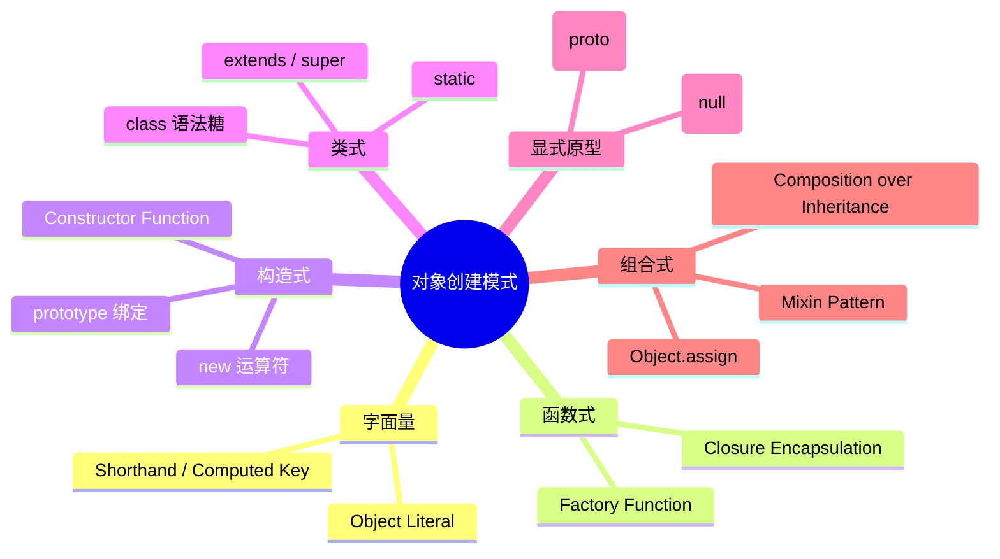
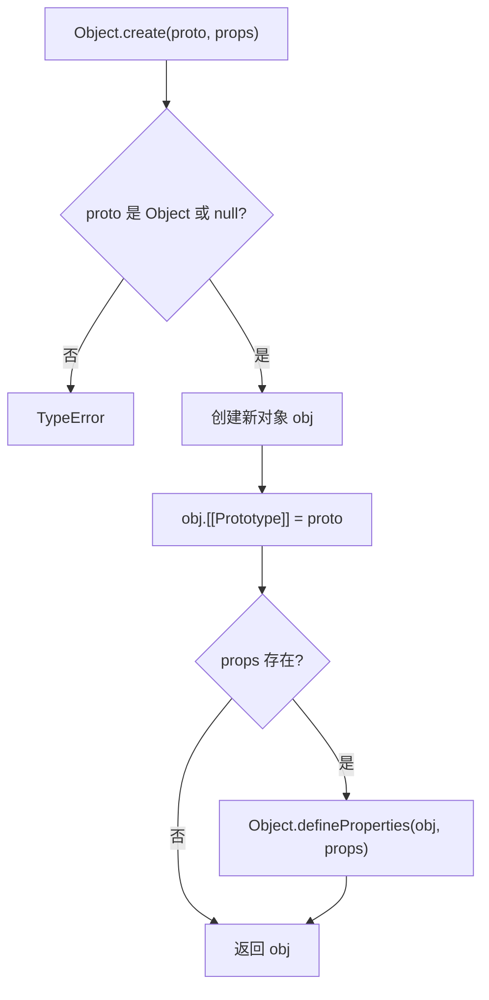
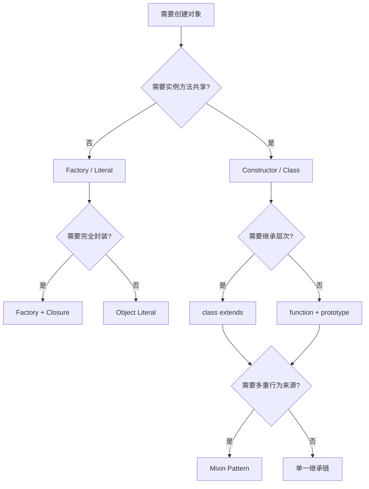

# 对象创建模式

> **形式化定义**：ECMAScript 提供了多种对象创建机制，从对象字面量（Object Literal）到构造函数（Constructor Function），从 `Object.create()` 到 ES2015 的 `class` 语法，以及函数式工厂（Factory Function）和 Mixin/Composition 模式。这些机制在底层共享同一套原型继承语义，但在语法抽象、封装能力和类型系统交互上存在显著差异。在 TypeScript 的语境下，还需理解**结构类型（Structural Typing）**与**名义类型（Nominal Typing）**对对象创建模式的影响。
>
> 对齐版本：ECMAScript 2025 (ES16) | TypeScript 5.8–6.0 | TS 7.0 Go 编译器预览

---

## 1. 概念定义 (Concept Definition)

### 1.1 形式化定义

ECMA-262 §13.2 定义了对象的创建语义：

> *"An object literal is an expression describing the initialization of an Object, written in a form resembling a literal."* — ECMA-262 §13.2

**对象创建模式的形式化分类**：

```
对象创建模式 C = { Literal, Factory, Constructor, Class, ObjectCreate, Mixin }

每种模式可形式化为二元组 ⟨ CreationSemantics, PrototypeBinding ⟩：
- Literal: ⟨ 直接求值为新对象, Object.prototype ⟩
- Factory: ⟨ 函数调用返回新对象, 由函数内部决定 ⟩
- Constructor: ⟨ new 运算符创建, Constructor.prototype ⟩
- Class: ⟨ new 运算符创建（syntactic sugar for constructor）, Class.prototype ⟩
- ObjectCreate: ⟨ 显式创建并绑定原型, 第一个参数 ⟩
- Mixin: ⟨ Object.assign / 展开运算符合并, 混合多个原型来源 ⟩
```

### 1.2 核心概念图谱



---

## 2. 属性与特征 (Properties & Characteristics)

### 2.1 六种创建模式对比矩阵

| 维度 | Object Literal | Factory Function | Constructor | Class (ES2015+) | `Object.create` | Mixin/Composition |
|------|---------------|-----------------|-------------|-----------------|-----------------|-------------------|
| 语法年代 | ES1 | ES1 | ES1 | ES2015 | ES5 | ES5+ |
| 原型链 | `Object.prototype` | 自定义 | `Constructor.prototype` | `Class.prototype` | 显式指定 | 多重来源 |
| `new` 需要 | ❌ | ❌ | ✅ | ✅ | ❌ | ❌ |
| `this` 绑定 | N/A | 不依赖 `this` | `new` 绑定 | `new` 绑定 | N/A | N/A |
| 封装能力 | 低 | 高（闭包） | 中 | 高（#private） | 低 | 高 |
| TS 类型推导 | ✅ 最佳 | ✅ 良好 | ✅ 良好 | ✅ 最佳 | ⚠️ 需断言 | ✅ 良好 |
| 运行时开销 | 最低 | 闭包分配 | prototype 共享 | 同 Constructor | 最低 | 合并开销 |

### 2.2 Factory Function vs Constructor/Class

**Factory Function 的核心优势**：

1. **无需 `new`**：避免 `new` 的遗漏导致的 `this` 绑定错误
2. **闭包封装**：可创建真正的私有状态（pre-ES2022）
3. **灵活的返回类型**：可返回不同形状的对象（Discriminated Union）
4. **`this` 无关**：不受调用方式影响

**Constructor/Class 的核心优势**：

1. **原型共享**：方法存储在 `prototype` 上，实例共享引用
2. **`instanceof` 语义**：可参与原型链检查
3. **继承语法**：`extends` / `super` 提供清晰的层次结构
4. **引擎优化**：V8 对 `class` 构造函数的 Hidden Class 优化更积极

---

## 3. 机制解释 (Mechanism Explanation)

### 3.1 `Object.create()` 的规范语义

ECMA-262 §20.1.2.2 定义了 `Object.create(O, Properties)`：

```
1. 若 Type(O) 不是 Object 且 O ≠ null，抛出 TypeError
2. 创建新对象 obj
3. 设置 obj.[[Prototype]] = O
4. 若 Properties 存在，执行 Object.defineProperties(obj, Properties)
5. 返回 obj
```



### 3.2 Mixin 与组合优先于继承

**组合（Composition）的形式化定义**：

```
给定行为集合 B = { b₁, b₂, ..., bₙ }
组合对象 C = Object.assign({}, ...B.map(b => b()))

约束：C 的原型为 Object.prototype，所有行为通过自有属性合并
```

**Mixin 实现模式**：

```typescript
// Mixin 工厂：返回一个可应用到基类的函数
function Timestamped<TBase extends new (...args: any[]) => object>(Base: TBase) {
  return class extends Base {
    timestamp = Date.now();
    getTimestamp() {
      return this.timestamp;
    }
  };
}

// 组合多个 Mixin
class User {
  constructor(public name: string) {}
}

const TimestampedUser = Timestamped(User);
const user = new TimestampedUser("Alice");
```

### 3.3 结构类型 vs 名义类型

TypeScript 采用**结构类型系统（Structural Typing）**：类型的兼容性由成员结构决定，而非声明位置。

```typescript
class Dog {
  bark() {}
}
class Cat {
  bark() {} // 相同的结构
}

function triggerBark(animal: Dog) {
  animal.bark();
}

triggerBark(new Cat()); // ✅ TypeScript 允许：结构兼容
```

**名义类型模拟（Nominal Typing Simulation）**：

```typescript
type Brand<K, T> = K & { __brand: T };
type USD = Brand<number, "USD">;
type EUR = Brand<number, "EUR">;

const usd = 100 as USD;
const eur = 100 as EUR;

function pay(amount: USD) {}
// pay(eur); // ❌ 类型错误：结构相同但品牌不同
```

---

## 4. 实例示例 (Examples)

### 4.1 工厂函数与闭包封装

```typescript
function createCounter(initial = 0) {
  let count = initial; // 闭包私有状态

  return {
    increment() {
      return ++count;
    },
    decrement() {
      return --count;
    },
    get value() {
      return count;
    },
  };
}

const counter = createCounter(10);
console.log(counter.value); // 10
console.log(counter.increment()); // 11
// count 不可从外部访问
```

### 4.2 `Object.create(null)` 与字典模式

```typescript
// ✅ 正例：安全字典，免疫原型污染
const dict = Object.create(null);
dict["__proto__"] = "value";
dict["constructor"] = "value";
console.log("toString" in dict); // false
```

### 4.3 Mixin 组合边缘案例

**边缘案例**：Mixin 中的方法名冲突

```typescript
const MixinA = (Base: any) => class extends Base {
  greet() { return "A"; }
};
const MixinB = (Base: any) => class extends Base {
  greet() { return "B"; }
};

class Base {}
class Mixed extends MixinB(MixinA(Base)) {}

const m = new Mixed();
console.log(m.greet()); // "B" — 后应用的 Mixin 覆盖前者
```

### 4.4 ES2022 私有字段与静态块

```typescript
// ✅ class 私有字段提供真正的硬私有（不可从外部访问，包括反射）
class SecureAccount {
  #balance: number;
  #pin: string;

  static #nextId = 0;
  readonly id: number;

  // 静态初始化块（ES2022）
  static {
    console.log('SecureAccount class initialized');
  }

  constructor(initialBalance: number, pin: string) {
    this.#balance = initialBalance;
    this.#pin = pin;
    this.id = ++SecureAccount.#nextId;
  }

  #validatePin(input: string): boolean {
    return input === this.#pin;
  }

  withdraw(amount: number, pin: string): boolean {
    if (!this.#validatePin(pin)) return false;
    if (amount > this.#balance) return false;
    this.#balance -= amount;
    return true;
  }

  get balance() {
    return this.#balance;
  }
}

const acc = new SecureAccount(1000, '1234');
console.log(acc.balance); // 1000
// console.log(acc.#balance); // ❌ TS Error: Property '#balance' is not accessible outside class
```

### 4.5 `Object.groupBy` 与 `Map.groupBy`（ES2024）

```typescript
// Object.groupBy：将数组按条件分组为普通对象
const inventory = [
  { name: 'apple', type: 'fruit', qty: 10 },
  { name: 'banana', type: 'fruit', qty: 5 },
  { name: 'carrot', type: 'vegetable', qty: 20 },
];

const byType = Object.groupBy(inventory, item => item.type);
// {
//   fruit: [{ name: 'apple', ... }, { name: 'banana', ... }],
//   vegetable: [{ name: 'carrot', ... }]
// }

// Map.groupBy：当键为对象或需要保留任意类型时使用
const byQuantity = Map.groupBy(inventory, item =>
  item.qty > 10 ? 'sufficient' : 'low'
);
```

### 4.6 使用 Symbol 作为计算键（Well-Known Symbols）

```typescript
const id = Symbol('id');

const user = {
  name: 'Alice',
  [id]: 42, // Symbol 键不会出现在 Object.keys 中
  [Symbol.toStringTag]: 'User', // 影响 Object.prototype.toString.call
  [Symbol.iterator]: function* () {
    yield this.name;
    yield this[id];
  },
};

console.log(Object.keys(user)); // ['name']
console.log(Object.getOwnPropertySymbols(user)); // [Symbol(id), Symbol(toStringTag), Symbol(iterator)]
console.log([...user]); // ['Alice', 42]
```

### 4.7 `structuredClone` 深拷贝对象（ES2022）

```typescript
// 替代 JSON.parse(JSON.stringify(...)) 的深拷贝方案
// 支持循环引用、Date、RegExp、Map、Set、TypedArray、Blob 等

const original = {
  nested: { value: 1 },
  date: new Date(),
  map: new Map([['key', 'val']]),
  set: new Set([1, 2, 3]),
  regex: /abc/g,
};

const clone = structuredClone(original);
clone.nested.value = 2;
console.log(original.nested.value); // 1 — 真正深拷贝

// 对比 Object.assign 的浅拷贝
const shallow = Object.assign({}, original);
shallow.nested.value = 3;
console.log(original.nested.value); // 3 — 嵌套对象共享引用
```

---

## 5. 权威参考 (References)

### ECMA-262 规范

| 章节 | 主题 |
|------|------|
| §13.2 | Object Initializer |
| §20.1.2.2 | `Object.create` |
| §20.1.2.17 | `Object.assign` |
| §15.7 | Class Definitions |

### MDN Web Docs

- **MDN: Object.create** — <https://developer.mozilla.org/en-US/docs/Web/JavaScript/Reference/Global_Objects/Object/create>
- **MDN: Object.assign** — <https://developer.mozilla.org/en-US/docs/Web/JavaScript/Reference/Global_Objects/Object/assign>
- **MDN: Factory functions** — <https://developer.mozilla.org/en-US/docs/Web/JavaScript/Guide/Working_with_objects>
- **MDN: Private class features** — <https://developer.mozilla.org/en-US/docs/Web/JavaScript/Reference/Classes/Private_class_fields>
- **MDN: structuredClone** — <https://developer.mozilla.org/en-US/docs/Web/API/structuredClone>
- **MDN: Object.groupBy** — <https://developer.mozilla.org/en-US/docs/Web/JavaScript/Reference/Global_Objects/Object/groupBy>
- **MDN: Map.groupBy** — <https://developer.mozilla.org/en-US/docs/Web/JavaScript/Reference/Global_Objects/Map/groupBy>

### 外部权威资源

- **V8 Blog: Fast Properties** — <https://v8.dev/blog/fast-properties>（Hidden Class 与对象属性优化）
- **V8 Blog: Class Fields Performance** — <https://v8.dev/blog/class-fields>
- **TC39 Class Fields Proposal** — <https://github.com/tc39/proposal-class-fields>
- **TC39 Class Static Block Proposal** — <https://github.com/tc39/proposal-class-static-block>
- **TypeScript Handbook: Classes** — <https://www.typescriptlang.org/docs/handbook/2/classes.html>
- **TypeScript Handbook: Mixins** — <https://www.typescriptlang.org/docs/handbook/mixins.html>
- **2ality: JavaScript Object Creation** — <https://2ality.com/2014/01/object-create.html>

---

## 6. 版本演进 (Version Evolution)

| ES 版本 | 特性 | 说明 |
|---------|------|------|
| ES1 (1997) | Object Literal, Constructor | 基础对象创建 |
| ES5 (2009) | `Object.create`, `Object.defineProperties` | 显式原型控制 |
| ES2015 (ES6) | `class`, `Object.assign` | 类语法糖、对象合并 |
| ES2018 (ES9) | Spread in object literals | `{ ...obj }` |
| ES2022 (ES13) | `class` 私有字段、static block | 增强封装 |
| ES2024 (ES15) | `Object.groupBy`, `Map.groupBy` | 集合分组 |

---

## 7. 思维表征 (Mental Representation)

### 7.1 创建模式选择决策树



### 7.2 结构类型 vs 名义类型矩阵

| 场景 | 结构类型 (TS 默认) | 名义类型 (模拟) |
|------|-------------------|----------------|
| API 兼容性 | ✅ 自动兼容 | ⚠️ 需显式声明 |
| 错误检测 | ⚠️ 误报率低，漏报率高 | ✅ 严格的类型边界 |
| 重构安全 | ⚠️ 重命名影响兼容类 | ✅ 重命名安全 |
| 鸭子类型 | ✅ 自然支持 | ❌ 需适配层 |
| 跨模块边界 | ✅ 无耦合 | ⚠️ 依赖类型声明位置 |

---

## 8. Trade-off 与 Pitfalls

### 8.1 `class` 语法的 `this` 绑定陷阱

类方法在作为回调传递时会丢失 `this` 绑定：

```typescript
class Button {
  label = "Click";
  handleClick() {
    console.log(this.label);
  }
}

const btn = new Button();
setTimeout(btn.handleClick, 100); // ❌ this 变为 global/undefined
```

解决方案：箭头函数属性（`handleClick = () => {}`）或在构造函数中 `bind`。

### 8.2 Mixin 的线性化问题

JavaScript 的 Mixin 是**线性化（linearization）**的：后应用的 Mixin 覆盖前者的同名方法。这与 Python 的 C3 linearization 或 Scala 的 trait 不同，不存在冲突检测机制。

### 8.3 `Object.assign` 的浅拷贝语义

```typescript
const source = { nested: { value: 1 } };
const copy = Object.assign({}, source);
copy.nested.value = 2;
console.log(source.nested.value); // 2 — 嵌套对象共享引用
```

需要深层不可变性时，应使用 `structuredClone`、Immer 或手动深拷贝。
