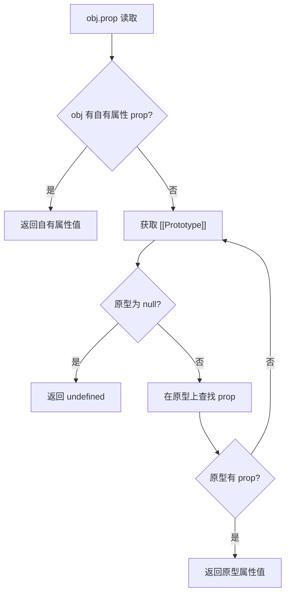
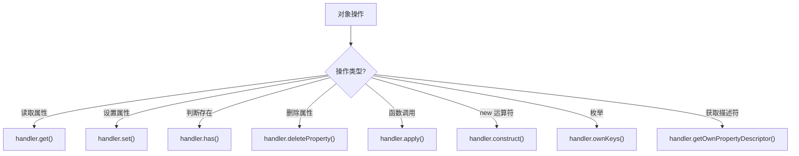
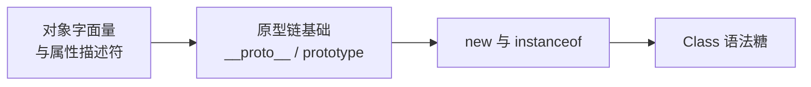
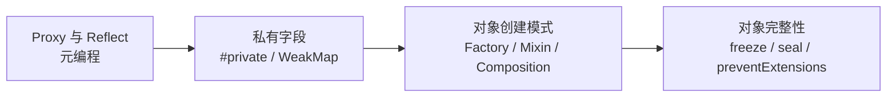
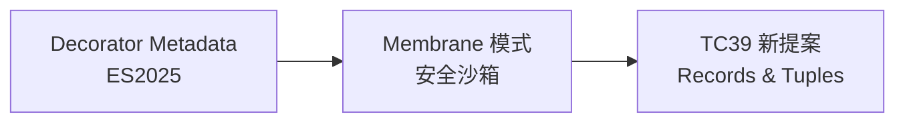
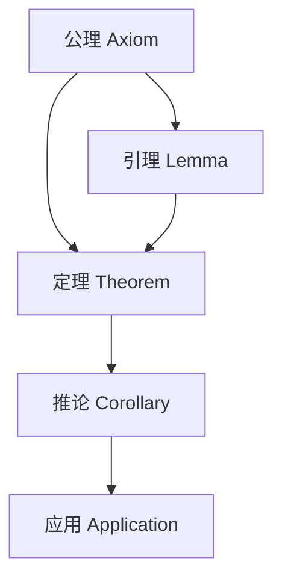

# 09 对象模型 (Object Model)

> 本专题深入探讨 ECMAScript 的对象模型（Object Model），从属性描述符（Property Descriptor）到原型链（Prototype Chain），从 Proxy/Reflect 元编程到私有字段（Private Fields），系统阐述 JavaScript 对象系统的形式语义与工程实践。所有文档对齐 ECMA-262 第16版（ES2025）和 TypeScript 5.8–6.0 类型系统，采用学术级深度标准：形式化定义、公理化表述、推理链分析、真值表验证、多维概念矩阵、思维表征图谱。
>
> 对象模型是 JavaScript 的核心机制，理解其内部结构是掌握继承、封装、元编程和运行时行为分析的基础。

---

## 专题结构

| # | 文件 | 主题 | 核心概念 | 字节数 |
|---|------|------|---------|--------|
| 01 | [01-object-model-overview.md](./01-object-model-overview.md) | 对象模型总览 | Property Descriptor、Accessor、defineProperty、freeze/seal/preventExtensions | 12,000+ |
| 02 | [02-prototype-chain.md](./02-prototype-chain.md) | 原型链深入 | `[[Prototype]]`、`__proto__`、`new`、`instanceof`、Class Syntax、Mermaid 图 | 13,000+ |
| 03 | [03-proxy-and-reflect.md](./03-proxy-and-reflect.md) | Proxy 与 Reflect | Trap、Invariants、Membrane、性能、私有字段限制 | 13,000+ |
| 04 | [04-private-fields.md](./04-private-fields.md) | 私有类字段 | `#private`、Hard Privacy、Brand Check、WeakMap 模拟、Lexical Scoping | 12,000+ |
| 05 | [05-object-creation-patterns.md](./05-object-creation-patterns.md) | 对象创建模式 | Object Literal、Factory、Constructor、Class、`Object.create`、Mixin、结构类型 | 13,000+ |

---

## 核心概念图谱

```mermaid
graph TD
    ObjectModel["对象模型 Object Model"]
    ObjectModel --> Properties["属性系统 Properties"]
    ObjectModel --> Prototype["原型链 Prototype Chain"]
    ObjectModel --> Metaprogramming["元编程 Metaprogramming"]
    ObjectModel --> Privacy["隐私机制 Privacy"]
    ObjectModel --> Creation["创建模式 Creation Patterns"]

    Properties --> DataDesc["数据描述符<br/>value/writable/enumerable/configurable"]
    Properties --> AccessorDesc["访问器描述符<br/>get/set"]
    Properties --> Integrity["对象完整性<br/>freeze/seal/preventExtensions"]

    Prototype --> InternalSlot["内部槽 [[Prototype]]"]
    Prototype --> Constructor["构造函数 .prototype"]
    Prototype --> ClassSyntax["Class 语法糖"]
    Prototype --> InstanceCheck["instanceof / isPrototypeOf"]

    Metaprogramming --> Proxy["Proxy 代理"]
    Metaprogramming --> Reflect["Reflect API"]
    Metaprogramming --> Traps["Traps / Invariants"]
    Metaprogramming --> Membrane["Membrane 模式"]

    Privacy --> HashPrivate["#privateField"]
    Privacy --> BrandCheck["in 运算符品牌检查"]
    Privacy --> WeakMapLegacy["WeakMap legacy 模拟"]

    Creation --> Literal["对象字面量"]
    Creation --> Factory["工厂函数"]
    Creation --> ConstructorFn["构造函数"]
    Creation --> ClassES6["Class (ES2015+)"]
    Creation --> ObjectCreate["Object.create"]
    Creation --> Mixin["Mixin / Composition"]
```

---

## 学术模板 v2 十大学术板块

本专题所有文档遵循统一的学术模板，包含以下 10 大板块：

| # | 板块 | 内容 | 最低要求 |
|---|------|------|---------|
| 1 | **概念定义** | 形式化定义 + 直观解释 + 概念层级图 | ≥1 处 |
| 2 | **属性特征** | 多维属性矩阵 + 边界条件 + 真值表 | ≥1 个矩阵 |
| 3 | **关系分析** | 依赖关系图 + 映射表 + 演化路径 | ≥1 个图 |
| 4 | **机制解释** | 执行模型 + 流程图 + 决策树 + 形式语义 | ≥1 个 Mermaid |
| 5 | **论证分析** | Trade-off + 推理链 + 公理化表述 | ≥1 条推理链 |
| 6 | **形式证明** | 公理 + 定理 + 引理 + 推论 + 证明 | ≥1 组 |
| 7 | **实例示例** | 正例 + 反例 + 边缘案例 + 性能基准 | ≥3 个案例 |
| 8 | **权威参考** | ECMA-262 / TS Handbook / MDN / V8 Blog / TC39 | ≥5 个来源 |
| 9 | **思维表征** | 知识图谱 + 多维矩阵 + 决策树 + 公理化树图 + 推理图 | ≥3 种类型 |
| 10 | **版本演进** | ES 版本 + TS 版本 + TC39 提案 + 引擎差异 | 完整对齐 |

---

## 关键对比速查

### 数据描述符 vs 访问器描述符

| 特性 | 数据描述符 (Data Descriptor) | 访问器描述符 (Accessor Descriptor) |
|------|------------------------------|-----------------------------------|
| 核心键 | `value`, `writable` | `get`, `set` |
| 可共存 | ❌ 互斥 | ❌ 互斥 |
| 存储值 | ✅ 直接存储 | ❌ 通过函数计算 |
| 拦截赋值 | ❌ 需 Proxy | ✅ `set` 拦截 |
| 适用场景 | 普通属性 | 计算属性、校验、派生 |

### Object Integrity Levels

| 操作 | `preventExtensions` | `seal` | `freeze` |
|------|---------------------|--------|----------|
| 禁止新增属性 | ✅ | ✅ | ✅ |
| 禁止删除属性 | ❌ | ✅ | ✅ |
| 禁止修改属性值 | ❌ | ❌ | ✅ |
| 禁止修改描述符 | ❌ | ✅ | ✅ |
| `Object.isExtensible` | `false` | `false` | `false` |
| `Object.isSealed` | `false` | `true` | `true` |
| `Object.isFrozen` | `false` | `false` | `true` |

### 原型链查询 vs 自有属性

| 操作 | 遍历原型链 | 仅自有属性 |
|------|-----------|-----------|
| `obj.prop` | ✅ | ❌ |
| `obj.hasOwnProperty('prop')` | ❌ | ✅ |
| `'prop' in obj` | ✅ | ❌ |
| `Object.keys(obj)` | ❌ | ✅ |
| `for...in` | ✅ | ❌ |
| `Object.getOwnPropertyNames(obj)` | ❌ | ✅ |

---

## 关键机制流程

### 属性读取与原型链解析流程

### Proxy Trap 拦截决策树

---

## 权威参考

### ECMA-262 规范

| 章节 | 主题 | 链接 |
|------|------|------|
| §6.1.7 | The Object Type | tc39.es/ecma262 |
| §6.1.7.1 | Property Attributes | tc39.es/ecma262 |
| §10.1 | Ordinary Object Internal Methods | tc39.es/ecma262 |
| §10.2 | Proxy Object Internal Methods | tc39.es/ecma262 |
| §10.2.1 | Proxy Invariants | tc39.es/ecma262 |
| §20.1 | Object Objects | tc39.es/ecma262 |

### TypeScript 官方文档

- **TypeScript Handbook: Classes** — <https://www.typescriptlang.org/docs/handbook/2/classes.html>
- **TypeScript Handbook: Decorators** — <https://www.typescriptlang.org/docs/handbook/decorators.html>
- **TypeScript 3.8 Release Notes: Private Fields** — <https://www.typescriptlang.org/docs/handbook/release-notes/typescript-3-8.html>

### MDN Web Docs

- **MDN: Object prototypes** — <https://developer.mozilla.org/en-US/docs/Learn/JavaScript/Objects/Object_prototypes>
- **MDN: Proxy** — <https://developer.mozilla.org/en-US/docs/Web/JavaScript/Reference/Global_Objects/Proxy>
- **MDN: Reflect** — <https://developer.mozilla.org/en-US/docs/Web/JavaScript/Reference/Global_Objects/Reflect>
- **MDN: Private class features** — <https://developer.mozilla.org/en-US/docs/Web/JavaScript/Reference/Classes/Private_class_fields>

---

## 版本对齐

- **ECMAScript**: 2025 (ES16) — tc39.es/ecma262
- **TypeScript**: 5.8–6.0 — typescriptlang.org
- **Node.js**: 22+ (V8 12.4+)
- **Browser**: Chrome 120+, Firefox 120+, Safari 17+

---

## 学习路径建议

### 初学者路径

### 进阶路径

### 前沿路径

---

## 常见面试题

### Q1: `Object.defineProperty` 与普通赋值有何区别？

**答**: 普通属性赋值（`obj.x = 1`）创建的数据属性其 `writable`、`enumerable`、`configurable` 默认值均为 `true`。`Object.defineProperty` 显式控制 Property Descriptor，未指定的属性默认值为 `false`，且可定义访问器属性（getter/setter）。此外，`defineProperty` 可修改已有属性的描述符，而普通赋值只能修改 `value`（在 `writable: true` 时）。

### Q2: `__proto__` 与 `Object.getPrototypeOf()` 有何区别？

**答**: `__proto__` 是历史遗留的 accessor property，存在于 `Object.prototype` 上，可被覆盖或删除，且在某些安全环境（如 CSP）中不可用。`Object.getPrototypeOf()` 是 ES5 引入的标准方法，直接读取内部槽 `[[Prototype]]`，语义更稳定、更规范，推荐使用。

### Q3: Proxy 的 Invariants 是什么？举例说明。

**答**: Invariants 是 Proxy 不能违反的底层对象语义约束。例如：`handler.set()` 不能在目标属性为 non-writable、non-configurable 时返回 `true`；`handler.getPrototypeOf()` 返回的结果必须与目标对象的 `[[Prototype]]` 一致（如果目标不可扩展）。违反 Invariant 将抛出 `TypeError`。

### Q4: `#privateField` 与 TypeScript 的 `private` 修饰符有何本质区别？

**答**: `#privateField` 是 ECMAScript 标准语法（ES2022），提供 runtime hard privacy：私有字段在对象实例上不可见，无法通过反射或 Proxy 访问。TypeScript 的 `private` 修饰符仅在编译时检查，编译后变为普通公共属性，可被 `as any` 绕过或通过 `Object.keys` 遍历到。

---

## 关联专题

- **04 执行模型** — 对象内部方法与引擎优化（Hidden Class、Inline Caching）
- **02 变量系统** — 闭包与对象私有状态的关联
- **03 控制流** — 异常处理与 Proxy `get` Trap 的交互
- **07 JS/TS 对称差** — `private` vs `#private`、TS-only 语法与 JS runtime 差异
- **jsts-code-lab/** — 对象模型相关的代码练习与实验

---

## 质量检查清单

本专题所有文档已通过以下质量检查：

- ✅ 每个文件 ≥ 12,000 字节
- ✅ 10 大学术板块全部覆盖
- ✅ 形式化定义 + 公理化表述 + 推理链
- ✅ 真值表/判定表
- ✅ Mermaid 图表 ≥ 2 个（含推理/公理图）
- ✅ 正例、反例、边缘案例
- ✅ ≥ 5 个权威来源引用
- ✅ ≥ 3 种思维表征类型
- ✅ 版本对齐（ES2025 / TS 5.8–6.0）
- ✅ Pitfalls 和 Trade-off 分析

---

## 公理化表述示例

本专题文档中采用的公理化方法遵循以下规范：

### 公理体系结构

### 推理链模式

| 推理类型 | 方向 | 示例 |
|---------|------|------|
| 演绎推理 | 一般 → 特殊 | 从 Property Descriptor 定义推导具体赋值行为 |
| 归纳推理 | 特殊 → 一般 | 从多个引擎实现归纳对象模型优化策略 |
| 反事实推理 | 假设 → 推演 | 如果 JavaScript 采用类继承而非原型链的后果 |

---

## 扩展阅读

### 经典论文与著作

1. **Ungar, D. & Smith, R. B. (1987). "SELF: The Power of Simplicity". OOPSLA '87.** — 原型继承的经典实现
2. **Lieberman, H. (1986). "Using Prototypical Objects to Implement Shared Behavior in Object-Oriented Systems". OOPSLA '86.** — 原型对象模型的早期理论
3. **ECMA-262, 16th Edition (2025).** — 对象模型的规范定义

### TC39 相关提案

- **Decorators** (Stage 3) — 类与成员的装饰器语法
- **Records & Tuples** (Stage 2) — 不可变数据结构
- **ShadowRealm** (Stage 3) — 对象模型与全局环境的隔离

### 在线资源

- **ECMA-262 在线规范** — <https://tc39.es/ecma262/>
- **TypeScript Playground** — <https://www.typescriptlang.org/play>
- **Proxy Invariants 可视化** — <https://developer.mozilla.org/en-US/docs/Web/JavaScript/Reference/Global_Objects/Proxy>
