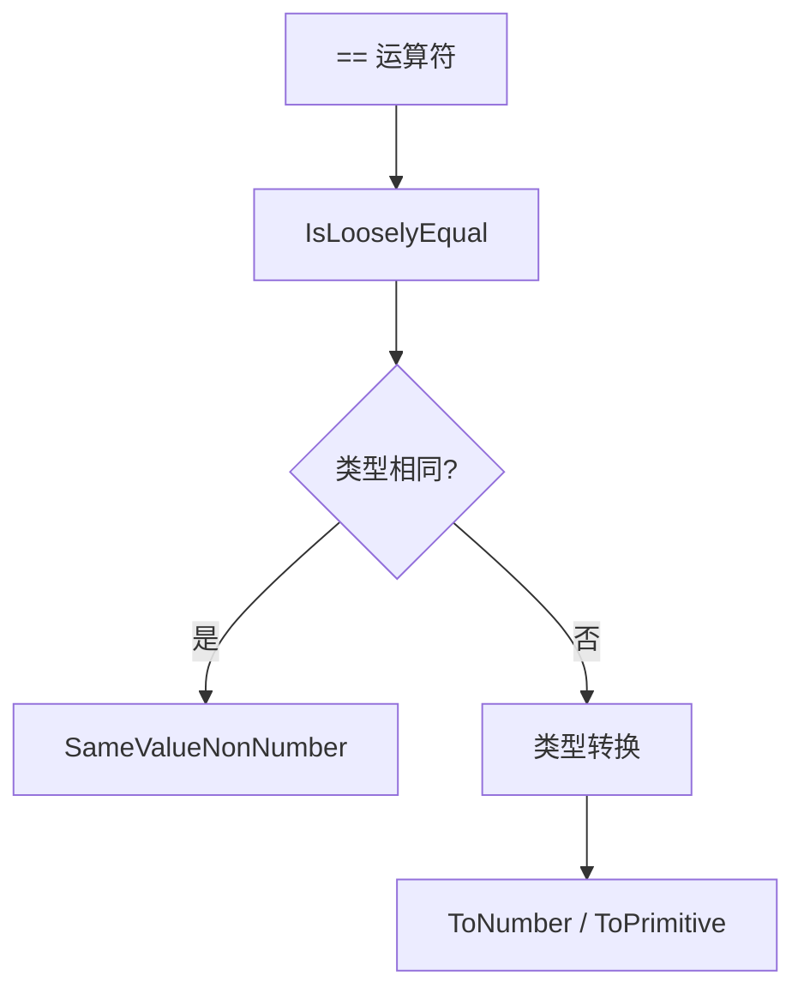
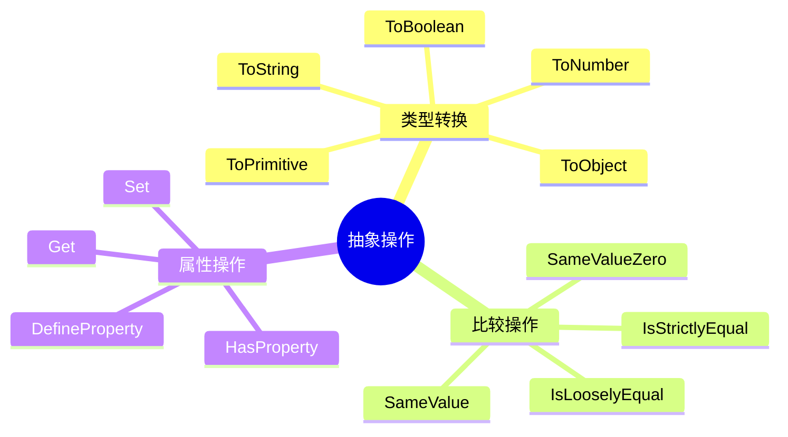
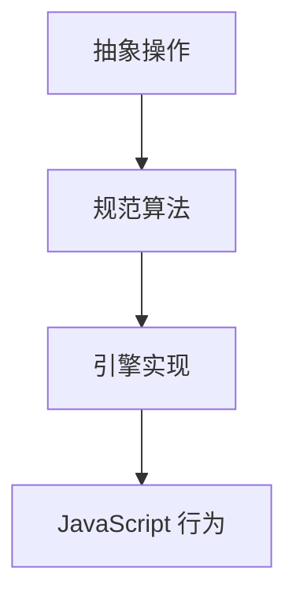

# 抽象操作（Abstract Operations）

> **形式化定义**：抽象操作（Abstract Operations）是 ECMA-262 规范中定义的伪函数，用于精确描述 JavaScript 引擎的内部行为。它们不是 JavaScript 语言本身的一部分，而是规范作者用来分解复杂算法的**元语言工具**。关键抽象操作包括 `ToPrimitive`、`ToBoolean`、`ToNumber`、`ToString`、`OrdinaryToPrimitive`、`RequireObjectCoercible`、`SameValue`、`SameValueZero`、`SameValueNonNumber` 等。ECMA-262 §7 定义了所有抽象操作。
>
> 对齐版本：ECMA-262 16th ed §7 | TypeScript 5.8–6.0

---

## 1. 概念定义 (Concept Definition)

### 1.1 形式化定义

ECMA-262 §7 定义：

> *"Abstract operations are named algorithms that are used to aid the specification of the semantics of the ECMAScript language."*

抽象操作的形式：

```
OperationName(argument1, argument2) → ReturnType
```

---

## 2. 属性与特征 (Properties & Characteristics)

### 2.1 类型转换抽象操作

| 操作 | 输入 | 输出 | 用途 |
|------|------|------|------|
| ToPrimitive | 任意值 | 原始值 | 对象转原始值 |
| ToBoolean | 任意值 | Boolean | 布尔转换 |
| ToNumber | 任意值 | Number | 数字转换 |
| ToString | 任意值 | String | 字符串转换 |
| ToObject | 任意值 | Object | 对象包装 |

### 2.2 抽象操作特征

| 特征 | 说明 |
|------|------|
| 规范内部使用 | 不暴露给 JavaScript 代码 |
| 参数化 | 接受 ECMAScript 值和规范类型 |
| 返回 Completion | 可能返回正常完成或突然完成 |
| 可递归 | 抽象操作可调用其他抽象操作 |

---

## 3. 关系分析 (Relationship Analysis)

### 3.1 抽象操作调用链



---

## 4. 机制解释 (Mechanism Explanation)

### 4.1 ToPrimitive 算法

```mermaid
flowchart TD
    A[ToPrimitive(input, hint)] --> B{input 是原始值?}
    B -->|是| C[返回 input]
    B -->|否| D{hint?}
    D -->|number| E[尝试 valueOf]
    D -->|string| F[尝试 toString]
    E --> G{valueOf 返回原始值?}
    G -->|是| H[返回]
    G -->|否| F
    F --> I{toString 返回原始值?}
    I -->|是| H
    I -->|否| J[抛出 TypeError]
```

**代码示例：ToPrimitive 的行为验证**

```javascript
const obj = {
  valueOf() { return 42; },
  toString() { return "hello"; }
};

console.log(obj + 1);      // 43 (hint: number → valueOf)
console.log(`${obj}`);     // "hello" (hint: string → toString)
```

**代码示例：`Symbol.toPrimitive` 的优先权**

```javascript
const obj2 = {
  [Symbol.toPrimitive](hint) {
    if (hint === 'number') return 99;
    if (hint === 'string') return 'str';
    return 'default';
  },
  valueOf() { return 1; },
  toString() { return '2'; }
};

console.log(obj2 + 1);   // "default1" (Symbol.toPrimitive 优先于 valueOf)
console.log(String(obj2)); // "str" (Symbol.toPrimitive 优先于 toString)
console.log(Number(obj2)); // 99
```

### 4.2 ToBoolean 真值表

| 输入类型 | 结果 | 代码示例 |
|----------|------|----------|
| `undefined` | `false` | `Boolean(undefined) // false` |
| `null` | `false` | `Boolean(null) // false` |
| `Boolean` | 原值 | `Boolean(true) // true` |
| `Number` | `+0`, `-0`, `NaN` → `false` | `Boolean(0) // false`, `Boolean(1) // true` |
| `String` | 空串 → `false` | `Boolean('') // false`, `Boolean('a') // true` |
| `Symbol` | `true` | `Boolean(Symbol()) // true` |
| `BigInt` | `0n` → `false` | `Boolean(0n) // false`, `Boolean(1n) // true` |
| `Object` | `true` | `Boolean({}) // true` |

### 4.3 ToNumber 转换规则

```javascript
// 字符串转数字
Number('123');     // 123
Number('12.3');    // 12.3
Number('');        // 0
Number('  ');      // 0
Number('123abc');  // NaN
Number('0x10');    // 16 (十六进制)

// 对象转数字（触发 ToPrimitive hint: number）
Number({ valueOf: () => 42 }); // 42
Number({ toString: () => '99' }); // 99

// 特殊值
Number(undefined); // NaN
Number(null);      // 0
Number(true);      // 1
Number(false);     // 0
Number(Symbol());  // TypeError
```

#### 代码示例：ToString 对 Symbol 的边界行为

```javascript
// ToString 对 Symbol 抛出 TypeError，这是常见陷阱
const sym = Symbol('desc');

try {
  console.log('value: ' + sym);   // TypeError: Cannot convert a Symbol value to a string
} catch (e) {
  console.log(e.name); // TypeError
}

// 正确方式：显式调用 Symbol.prototype.description 或 String() 包装
try {
  console.log('value: ' + sym.description); // "value: desc"
  console.log('value: ' + String(sym));     // "value: Symbol(desc)"
} catch (e) {
  console.log('unexpected error:', e);
}
```

#### 代码示例：BigInt 与 Number 混合运算的 ToNumber 行为

```javascript
// BigInt 与 Number 不能直接进行算术运算
const n = 10n;
const m = 5;

// console.log(n + m);  // TypeError: Cannot mix BigInt and other types

// 必须显式转换
console.log(Number(n) + m);  // 15
console.log(n + BigInt(m));  // 15n

// 比较运算例外：允许跨类型比较（均先 ToNumeric 再比较）
console.log(10n == 10);   // true
console.log(10n === 10);  // false（严格相等不触发类型转换）
console.log(10n > 5);     // true
```

---

## 5. 论证与分析 (Argumentation & Analysis)

### 5.1 == vs === 的抽象操作

| 运算符 | 抽象操作 | 类型转换 |
|--------|---------|---------|
| `==` | IsLooselyEqual | 是，强制转换 |
| `===` | IsStrictlyEqual | 否，严格比较 |
| `Object.is` | SameValue | 处理 -0/+0, NaN |

---

## 6. 实例与示例 (Examples)

### 6.1 正例：ToPrimitive

```javascript
const obj = {
  valueOf() { return 42; },
  toString() { return "hello"; }
};

console.log(obj + 1);      // 43 (hint: number → valueOf)
console.log(`${obj}`);     // "hello" (hint: string → toString)
```

### 6.2 正例：IsCallable 与 IsConstructor 的运行时体现

```javascript
// 这些抽象操作没有直接对应的 JS API，但可以通过 typeof 和 Proxy 间接观察

function isCallable(value) {
  return typeof value === 'function';
}

function isConstructor(value) {
  try {
    new new Proxy(value, {
      construct() { return {}; }
    });
    return true;
  } catch {
    return false;
  }
}

// 箭头函数可调用但不可构造
const arrow = () => {};
console.log(isCallable(arrow));    // true
console.log(isConstructor(arrow)); // false

// class 既可调用（某些引擎）又可构造
class MyClass {}
console.log(isCallable(MyClass));    // true (typeof class === 'function')
console.log(isConstructor(MyClass)); // true

// 普通对象既不可调用也不可构造
console.log(isCallable({}));       // false
console.log(isConstructor({}));    // false
```

---

## 7. 权威参考与国际化对齐 (References)

- **ECMA-262 §7** — Abstract Operations
- **MDN: Type Coercion** — <https://developer.mozilla.org/en-US/docs/Glossary/Type_coercion>
- **MDN: Equality comparisons and sameness** — <https://developer.mozilla.org/en-US/docs/Web/JavaScript/Equality_comparisons_and_sameness>
- **V8 Blog: JavaScript type coercion explained** — <https://v8.dev/blog/javascript-type-coercion>
- **2ality: Converting values to primitives** — <https://2ality.com/2022/11/coercion-to-primitive.html>
- **JavaScript.info: Type Conversions** — <https://javascript.info/type-conversions>
- **ECMA-262 §7.1.1** — ToPrimitive — <https://tc39.es/ecma262/#sec-toprimitive>
- **ECMA-262 §7.1.2** — ToBoolean — <https://tc39.es/ecma262/#sec-toboolean>
- **ECMA-262 §7.1.4** — ToNumber — <https://tc39.es/ecma262/#sec-tonumber>
- **ECMA-262 §7.1.17** — ToString — <https://tc39.es/ecma262/#sec-tostring>
- **MDN: BigInt** — <https://developer.mozilla.org/en-US/docs/Web/JavaScript/Reference/Global_Objects/BigInt>
- **MDN: Symbol** — <https://developer.mozilla.org/en-US/docs/Web/JavaScript/Reference/Global_Objects/Symbol>

---

## 8. 思维表征总结 (Cognitive Representations)

### 8.1 抽象操作分类



---

## 9. 公理化表述与形式证明 (Axiomatization & Formal Proof)

### 9.1 公理化基础

**公理 1（抽象操作的原子性）**：
> 抽象操作是规范的原子操作，不能被 JavaScript 代码打断。

### 9.2 定理与证明

**定理 1（ToPrimitive 的终止性）**：
> 对于有限对象，ToPrimitive 必然终止。

*证明*：
> 每次递归调用沿着原型链向上。若原型链有环则已在规范中处理（不无限递归）。
> ∎

---

## 10. 推理链与演绎分析 (Deductive Reasoning Chain)

### 10.1 演绎推理



---

**参考规范**：ECMA-262 §7 | MDN: Type Coercion


---

## 补充：更多核心抽象操作详解

### 补充 1：SameValue、SameValueZero、SameValueNonNumber

ECMA-262 定义了三种"相等性"抽象操作，对应 JavaScript 中的不同比较语义：

| 抽象操作 | `NaN` vs `NaN` | `+0` vs `-0` | 对应 JS API |
|---------|---------------|-------------|------------|
| `IsStrictlyEqual` (`===`) | ❌ false | ✅ true | `===` |
| `SameValue` | ✅ true | ❌ false | `Object.is()` |
| `SameValueZero` | ✅ true | ✅ true | `Map.prototype.set` / `Set.prototype.add` |
| `SameValueNonNumber` | N/A | N/A | 内部使用（字符串、对象比较） |

**关键区别**：

```javascript
Object.is(NaN, NaN)        // true  ✅ SameValue
NaN === NaN                // false ❌ IsStrictlyEqual
Object.is(+0, -0)          // false ❌ SameValue 区分正负零
+0 === -0                  // true  ✅ IsStrictlyEqual 不区分

const set = new Set()
set.add(+0)
set.add(-0)
console.log(set.size)      // 1 ✅ SameValueZero 不区分正负零
```

**代码示例：`Map` 键的比较使用 SameValueZero**

```javascript
const map = new Map();
map.set(NaN, 'first');
map.set(NaN, 'second'); // SameValueZero 认为 NaN === NaN，覆盖前值
console.log(map.get(NaN)); // "second"

map.set(+0, 'positive zero');
map.set(-0, 'negative zero'); // SameValueZero 认为 +0 === -0，覆盖前值
console.log(map.get(-0)); // "negative zero"
console.log(map.get(+0)); // "negative zero"
```

### 补充 2：RequireObjectCoercible

`RequireObjectCoercible(argument)` 是许多字符串和对象方法的隐式前置检查：

| 输入 | 结果 |
|------|------|
| `undefined` | 抛出 TypeError |
| `null` | 抛出 TypeError |
| 其他 | 返回原值 |

这也是 `"hello".trim()` 能工作而 `null.trim()` 抛错的原因。

**代码示例：RequireObjectCoercible 在方法中的隐式调用**

```javascript
// 以下方法内部均调用 RequireObjectCoercible(this)
null.toString();        // TypeError: Cannot read properties of null
undefined.trim();       // TypeError: Cannot read properties of undefined

// 但 null 和 undefined 可以被 Object 方法接受
Object.keys(null);      // TypeError
Object(undefined);      // 返回 {}
```

### 补充 3：抽象操作调用链完整示例

```mermaid
graph TD
    A[表达式: obj + 1] --> B[ToPrimitive obj, hint: number]
    B --> C{obj 有 [Symbol.toPrimitive]?}
    C -->|是| D[调用 Symbol.toPrimitive'number']
    C -->|否| E[尝试 valueOf]
    D -->|返回原始值| F[ToNumber 结果]
    D -->|返回对象| E
    E -->|返回原始值| F
    E -->|返回对象| G[尝试 toString]
    G -->|返回原始值| F
    G -->|返回对象| H[抛出 TypeError]
    F --> I[执行加法]
```

> 📅 补充更新：2026-04-27
