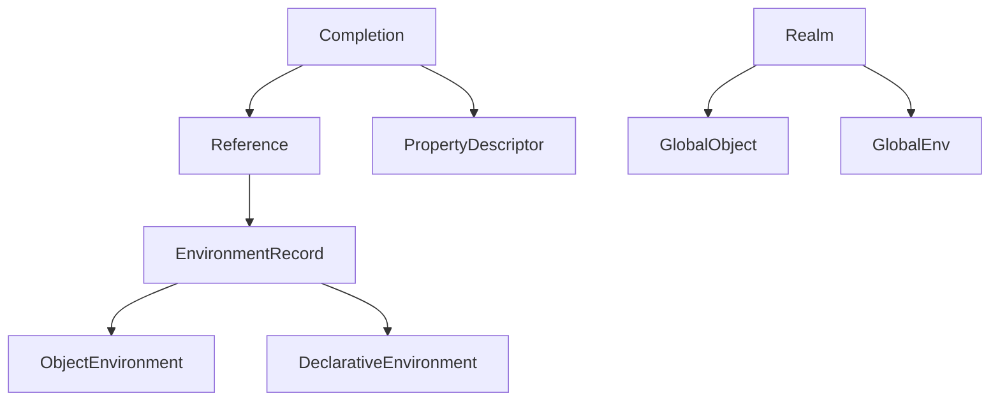
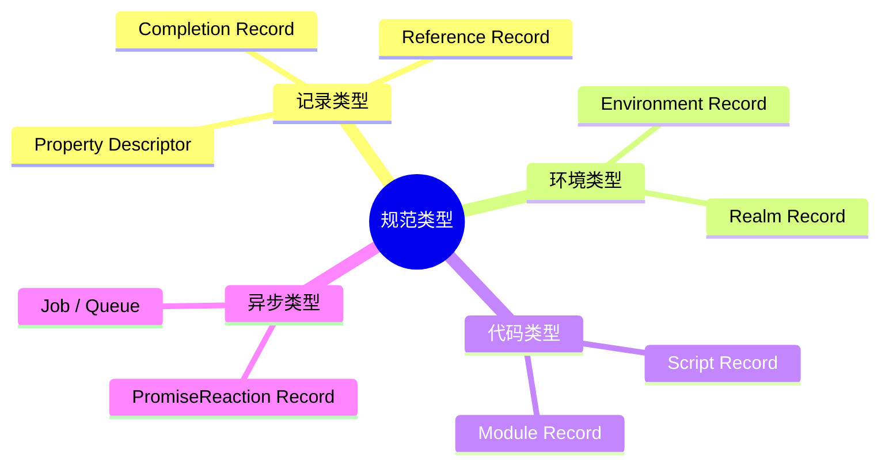
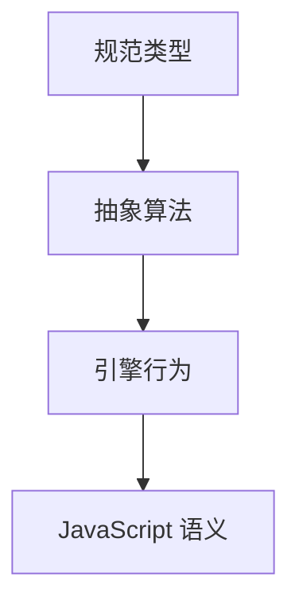
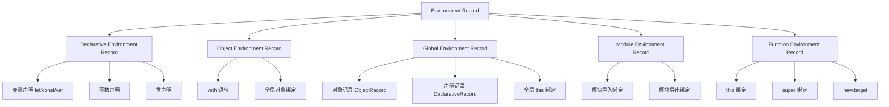

# 规范类型（Specification Types）

> **形式化定义**：规范类型（Specification Types）是 ECMA-262 规范内部使用的元类型，用于精确描述 JavaScript 引擎的内部数据结构和算法。与语言类型（String, Number, Boolean 等）不同，规范类型不直接对应 JavaScript 值。核心规范类型包括：Completion Record、Reference Record、Property Descriptor、Environment Record、Realm Record、Script Record、Module Record、PromiseReaction Record、Job 等。ECMA-262 §6.2 定义了所有规范类型。
>
> 对齐版本：ECMA-262 16th ed §6.2 | TypeScript 5.8–6.0

---

## 1. 概念定义 (Concept Definition)

### 1.1 形式化定义

ECMA-262 §6.2 定义：

> *"Specification types correspond to meta-values used within algorithms to describe the semantics of ECMAScript language constructs and ECMAScript language types."*

---

## 2. 属性与特征 (Properties & Characteristics)

### 2.1 规范类型 vs 语言类型

| 类型类别 | 示例 | 在 JavaScript 中可见? |
|---------|------|---------------------|
| 语言类型 | String, Number, Boolean, Object | ✅ |
| 规范类型 | Completion, Reference, Environment Record | ❌ |

---

## 3. 关系分析 (Relationship Analysis)

### 3.1 规范类型关系图



---

## 4. 机制解释 (Mechanism Explanation)

### 4.1 Completion Record

```
Completion Record: {
  [[Type]]: normal | return | throw | break | continue,
  [[Value]]: any | empty,
  [[Target]]: String | empty
}
```

#### 代码示例：Completion Record 与 labeled break/continue

```javascript
// 规范层面：break/continue 携带 Completion Record 的 [[Target]] 字段
// 运行时可见：标签匹配决定跳转目标

outer: for (let i = 0; i < 3; i++) {
  inner: for (let j = 0; j < 3; j++) {
    if (i === 1 && j === 1) {
      break outer; // Completion { [[Type]]: break, [[Value]]: empty, [[Target]]: "outer" }
    }
    console.log(i, j);
  }
}
// 输出：(0,0) (0,1) (0,2) (1,0) — 在 (1,1) 处跳出外层循环
```

#### 代码示例：Completion Record 与 return 值的覆盖

```javascript
function demo() {
  try {
    return 1; // 创建 Return Completion { [[Value]]: 1 }
  } finally {
    console.log('finally');
    // 若 finally 中也有 return，会覆盖 try 的返回值
    // return 2; // 取消注释后将返回 2
  }
}
console.log(demo()); // "finally" 然后 1

// 另一个边界：finally 中的 throw 会覆盖 try 的 return
function demo2() {
  try {
    return 'try-value';
  } finally {
    throw new Error('finally-error'); // 覆盖 return，向外传播异常
  }
}
try {
  demo2();
} catch (e) {
  console.log(e.message); // "finally-error"
}
```

---

## 5. 论证与分析 (Argumentation & Analysis)

### 5.1 为什么需要规范类型

| 原因 | 说明 |
|------|------|
| 精确性 | 消除自然语言的歧义 |
| 可验证性 | 支持形式化分析 |
| 一致性 | 所有引擎实现统一 |

---

## 6. 实例与示例 (Examples)

### 6.1 正例：Reference Record

```javascript
// 变量访问创建 Reference Record
// foo.bar 的求值：
// base = foo (对象)
// referencedName = "bar" (字符串)
// strict = false
```

### 6.2 正例：Property Descriptor 的运行时映射

```javascript
// Property Descriptor 是规范类型在运行时最直接的映射
const obj = {};

// 数据属性描述符（Data Property Descriptor）
Object.defineProperty(obj, 'dataProp', {
  value: 42,
  writable: true,
  enumerable: false,
  configurable: true
});

// 访问器属性描述符（Accessor Property Descriptor）
let internalValue = 0;
Object.defineProperty(obj, 'accessorProp', {
  get() { return internalValue; },
  set(v) { internalValue = v; },
  enumerable: true,
  configurable: true
});

console.log(Object.getOwnPropertyDescriptor(obj, 'dataProp'));
// { value: 42, writable: true, enumerable: false, configurable: true }

console.log(Object.getOwnPropertyDescriptor(obj, 'accessorProp'));
// { get: [Function: get], set: [Function: set], enumerable: true, configurable: true }
```

### 6.3 正例：Realm Record 与 iframe

```javascript
// 每个 iframe 拥有独立的 Realm，因此内置构造函数不相等
// 这是 Realm Record 在运行时的直接体现

const iframe = document.createElement('iframe');
document.body.appendChild(iframe);

const iframeArray = iframe.contentWindow.Array;
console.log(Array === iframeArray);  // false！不同 Realm

// 同一个 Realm 中才相等
console.log(Array === window.Array); // true

// 跨 Realm 的 Array.isArray 仍然工作，因为它检查 [[Class]] / 内部槽
console.log(Array.isArray(iframeArray.from([1, 2, 3]))); // true
```

### 6.4 正例：Module Record 与 import.meta

```javascript
// Module Record 的运行时可见面：import.meta
// 在 ESM 模块中，import.meta 暴露当前模块的元数据

// module-a.js
console.log(import.meta.url);      // 当前模块的 URL
console.log(import.meta.resolve);  // 解析相对路径的方法（某些环境）

// 动态导入返回 Module Record 的封装（Promise<ModuleNamespace>）
const moduleNs = await import('./module-b.js');
// moduleNs 是一个 Module Namespace Object，对应 Module Record 的导出绑定
```

---

## 7. 权威参考与国际化对齐 (References)

- **ECMA-262 §6.2** — Specification Types
- **MDN: Reference** — <https://developer.mozilla.org/en-US/docs/Web/JavaScript/Reference>
- **ECMA-262 §6.2** — Specification Types — <https://tc39.es/ecma262/#sec-ecmascript-data-types-and-values>
- **ECMA-262 §6.2.5** — Reference Record — <https://tc39.es/ecma262/#sec-reference-record-specification-type>
- **ECMA-262 §6.2.6** — Property Descriptor — <https://tc39.es/ecma262/#sec-property-descriptor-specification-type>
- **ECMA-262 §9.1** — Environment Records — <https://tc39.es/ecma262/#sec-environment-records>
- **MDN: Property descriptors** — <https://developer.mozilla.org/en-US/docs/Web/JavaScript/Reference/Global_Objects/Object/defineProperty>
- **MDN: try...catch** — <https://developer.mozilla.org/en-US/docs/Web/JavaScript/Reference/Statements/try...catch>
- **V8 Blog: Understanding the ECMAScript spec** — <https://v8.dev/blog/understanding-ecmascript-part-1>
- **V8 Blog: Understanding the ECMAScript spec Part 2** — <https://v8.dev/blog/understanding-ecmascript-part-2>
- **V8 Blog: Understanding the ECMAScript spec Part 3** — <https://v8.dev/blog/understanding-ecmascript-part-3>
- **Engine262** — JavaScript interpreter in JavaScript — <https://github.com/engine262/engine262>
- **2ality: ECMAScript spec: operations** — <https://2ality.com/2015/08/ecmascript-specification-operations.html>
- **JavaScript Spec Explorer** — <https://tc39.es/ecma262/>

---

## 8. 思维表征总结 (Cognitive Representations)

### 8.1 规范类型分类



---

## 9. 公理化表述与形式证明 (Axiomatization & Formal Proof)

### 9.1 公理化基础

**公理 1（规范类型的不可见性）**：
> 规范类型不能被 JavaScript 代码直接创建或访问。

### 9.2 定理与证明

**定理 1（Completion Record 的完备性）**：
> 每个语句的执行都返回 Completion Record。

*证明*：
> ECMA-262 规定每个语句的语义都返回 Completion Record。
> ∎

---

## 10. 推理链与演绎分析 (Deductive Reasoning Chain)

### 10.1 演绎推理



---

**参考规范**：ECMA-262 §6.2 | MDN: Reference


---

## 补充：规范类型深度解析

### 补充 1：Environment Record 详细分类

Environment Record 是 ECMA-262 中最重要的规范类型之一，用于描述变量和函数的词法绑定：



| Environment Record 类型 | 创建场景 | 特点 |
|------------------------|---------|------|
| **Declarative** | 块级作用域、函数体 | 存储 let/const/function/class |
| **Object** | `with (obj)` | 将对象属性作为变量绑定 |
| **Global** | 全局执行上下文 | 复合结构：Object + Declarative |
| **Module** | ESM 模块 | 支持 Live Binding 的导入导出 |
| **Function** | 函数调用 | 包含 this/super/new.target 绑定 |

### 补充 2：Realm Record 的结构

Realm Record 定义了 JavaScript 执行的"全局环境"：

```
Realm Record: {
  [[Intrinsics]]:  → 内置对象映射（Object, Array, Function 等）
  [[GlobalObject]]: → 全局对象（window / global / globalThis）
  [[GlobalEnv]]:    → 全局环境记录
  [[TemplateMap]]:  → 模板字符串缓存
  [[LoadedModules]]: → 已加载模块映射
}
```

**关键洞察**：每个 iframe 有自己的 Realm，因此 `Array` 构造函数在不同 iframe 中不相等。

```javascript
const iframe = document.createElement('iframe')
document.body.appendChild(iframe)
const iframeArray = iframe.contentWindow.Array
console.log(Array === iframeArray)  // false！不同 Realm
```

### 补充 3：PromiseReaction Record 与 Job Queue

| 规范类型 | 用途 | 可见性 |
|---------|------|--------|
| **PromiseReaction Record** | 存储 `.then()` / `.catch()` 的回调和解析行为 | 内部 |
| **PromiseCapability Record** | 封装 Promise 的 `resolve` / `reject` 能力 | 内部 |
| **Job** | 微任务单元（Promise 回调、MutationObserver） | 间接（通过事件循环） |
| **Job Queue** | 微任务队列（PromiseJobs、ScriptJobs） | 间接 |

### 补充 4：Completion Record 与异常控制流

ECMA-262 使用 Completion Record 精确描述 `try/catch/finally` 和 `return` 的语义：

```javascript
// 规范层面：try 块的正常完成被 catch 捕获为 throw 完成
// 运行时可见：finally 总会执行，即使 try 中有 return

function demo() {
    try {
        return 1; // 产生 Return Completion { [[Value]]: 1 }
    } finally {
        console.log('finally'); // 引擎强制先执行 finally
        // 若 finally 中也有 return，会覆盖 try 的返回值
    }
}
console.log(demo()); // 输出 "finally" 然后 1
```

### 补充 5：Reference Record 的运行时体现

`typeof` 和 `delete` 操作符的行为直接受 Reference Record 的 `[[Strict]]` 和 `[[ReferencedName]]` 影响：

```javascript
// delete 对未声明变量的行为差异
function strictMode() {
    'use strict';
    x = 1; // 隐式全局在严格模式下是 ReferenceError
    // delete x; // SyntaxError: Delete of an unqualified identifier
}

// typeof 对未声明变量安全：因为规范规定 typeof 检查 Reference Record 的 base
console.log(typeof notDeclared); // "undefined"，不会抛出 ReferenceError
```

---

---

## 补充：规范类型的运行时等价映射

### Property Descriptor 运行时映射

```javascript
const obj = {};
Object.defineProperty(obj, 'key', { value: 42, writable: true, enumerable: false, configurable: true });
console.log(Object.getOwnPropertyDescriptor(obj, 'key'));
// { value: 42, writable: true, enumerable: false, configurable: true }
```

### Environment Record 与闭包

```javascript
function makeCounter() { let n = 0; return () => ++n; }
const a = makeCounter(), b = makeCounter();
console.log(a(), a(), b()); // 1, 2, 1
```

---

## 更多权威参考链接

- **ECMA-262 §6.2** — Specification Types — <https://tc39.es/ecma262/#sec-ecmascript-data-types-and-values>
- **ECMA-262 §6.2.5** — Reference Record — <https://tc39.es/ecma262/#sec-reference-record-specification-type>
- **ECMA-262 §6.2.6** — Property Descriptor — <https://tc39.es/ecma262/#sec-property-descriptor-specification-type>
- **ECMA-262 §9.1** — Environment Records — <https://tc39.es/ecma262/#sec-environment-records>
- **MDN: Property descriptors** — <https://developer.mozilla.org/en-US/docs/Web/JavaScript/Reference/Global_Objects/Object/defineProperty>
- **MDN: try...catch** — <https://developer.mozilla.org/en-US/docs/Web/JavaScript/Reference/Statements/try...catch>
- **V8 Blog: Understanding the ECMAScript spec** — <https://v8.dev/blog/understanding-ecmascript-part-1>
- **Engine262** — JavaScript interpreter in JavaScript — <https://github.com/engine262/engine262>

> 📅 补充更新：2026-04-27
> 📅 再次深化：2026-04-30
