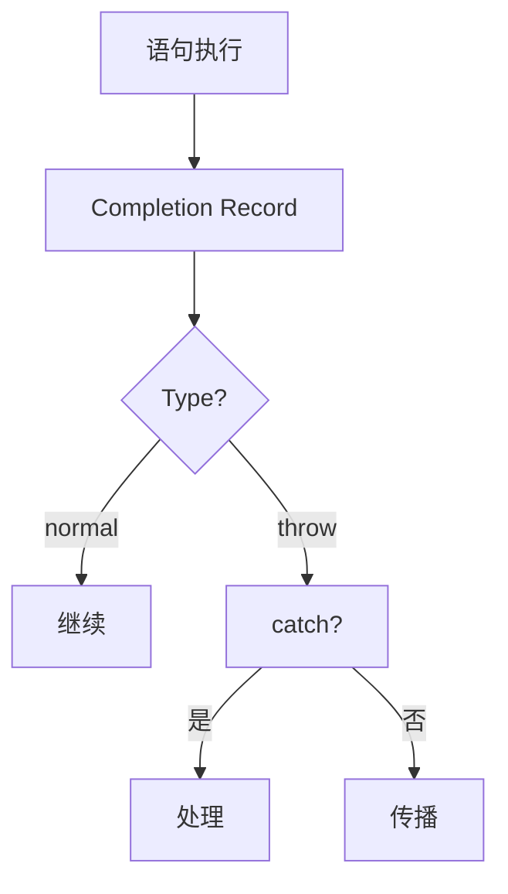

# 完成记录（Completion Records）

> **形式化定义**：完成记录（Completion Record）是 ECMA-262 规范中用于描述语句和控制流结构的规范类型。每个 JavaScript 语句的执行都产生一个 Completion Record，包含 `[[Type]]`（normal, return, throw, break, continue）、`[[Value]]`（结果值或 empty）、`[[Target]]`（标签或 empty）。ECMA-262 §6.2.4 定义了 Completion Record 的完整语义，它是理解 `return`、`throw`、`break`、`continue` 在规范层面如何工作的关键。
>
> 对齐版本：ECMA-262 16th ed §6.2.4 | TypeScript 5.8–6.0

---

## 1. 概念定义 (Concept Definition)

### 1.1 形式化定义

ECMA-262 §6.2.4 定义：

> *"The Completion Record type is a Record used to explain the runtime propagation of values and control flow."*

Completion Record 结构：

```
Completion Record = {
  [[Type]]:   normal | return | throw | break | continue,
  [[Value]]:  any | empty,
  [[Target]]: String | empty
}
```

### 1.2 五种完成类型

| [[Type]] | 来源 | [[Value]] | [[Target]] | 语义 |
|---------|------|----------|-----------|------|
| normal | 正常语句 | 表达式结果 | empty | 正常继续 |
| return | return 语句 | 返回值 | empty | 函数返回 |
| throw | throw 语句 | 错误对象 | empty | 异常传播 |
| break | break 语句 | empty | 标签或 empty | 跳出循环 |
| continue | continue 语句 | empty | 标签或 empty | 继续循环 |

---

## 2. 属性与特征 (Properties & Characteristics)

### 2.1 Completion Record 属性矩阵

| 属性 | 说明 |
|------|------|
| [[Type]] | 完成类型，决定控制流走向 |
| [[Value]] | 完成值，throw/return 有意义 |
| [[Target]] | 标签，break/continue 使用 |

### 2.2 辅助操作

```
NormalCompletion(value) -> { [[Type]]: normal, [[Value]]: value, [[Target]]: empty }
ThrowCompletion(value)  -> { [[Type]]: throw, [[Value]]: value, [[Target]]: empty }
ReturnCompletion(value) -> { [[Type]]: return, [[Value]]: value, [[Target]]: empty }
```

---

## 3. 关系分析 (Relationship Analysis)

### 3.1 Completion Record 传播

```mermaid
graph TD
    Statement[语句执行] --> CR[Completion Record]
    CR --> Type{[[Type]]}
    Type -->|normal| Next[下一条语句]
    Type -->|return| FunctionReturn[函数返回]
    Type -->|throw| Catch[最近的 catch]
    Type -->|break| LoopExit[跳出循环]
    Type -->|continue| LoopNext[循环继续]
```

---

## 4. 机制解释 (Mechanism Explanation)

### 4.1 完成记录的传播规则

```mermaid
flowchart TD
    A[执行语句] --> B[获取 Completion Record]
    B --> C{[[Type]] === normal?}
    C -->|是| D[继续执行下一条]
    C -->|否| E[向上传播]
    E --> F{上层能处理?}
    F -->|是| G[处理完成]
    F -->|否| H[继续向上传播]
```

---

## 5. 论证与分析 (Argumentation & Analysis)

### 5.1 try/catch/finally 的完成记录

| 场景 | try | catch | finally | 最终完成 |
|------|-----|-------|---------|---------|
| 无异常 | normal | — | normal | try 的完成 |
| 异常 | throw | normal | normal | catch 的完成 |
| 异常 | throw | throw | normal | catch 的 throw |
| finally return | any | any | return | finally 的 return |

---

## 6. 实例与示例 (Examples)

### 6.1 正例：try/finally 覆盖

```javascript
function example() {
  try {
    return 1;      // 产生 ReturnCompletion(1)
  } finally {
    return 2;      // finally 的 ReturnCompletion(2) 覆盖 try 的
  }
}

console.log(example()); // 2
```

### 6.2 正例：异常传播

```javascript
function throws() {
  throw new Error("boom");  // ThrowCompletion(Error)
}

try {
  throws();  // ThrowCompletion 传播到 catch
} catch (e) {
  console.log(e.message);   // "boom"
}
```

### 6.3 正例：带标签的 break 与 continue

```javascript
// break 带标签：跳出多层循环
outer: for (let i = 0; i < 3; i++) {
  for (let j = 0; j < 3; j++) {
    if (i === 1 && j === 1) {
      break outer; // BreakCompletion { [[Target]]: "outer" }
    }
    console.log(i, j);
  }
}
// 输出: 0 0, 0 1, 0 2, 1 0

// continue 带标签：继续外层循环
outer2: for (let i = 0; i < 3; i++) {
  for (let j = 0; j < 3; j++) {
    if (j === 1) {
      continue outer2; // ContinueCompletion { [[Target]]: "outer2" }
    }
    console.log(i, j);
  }
}
// 输出: 0 0, 1 0, 2 0
```

### 6.4 正例：嵌套 try/catch/finally 的完成记录覆盖

```javascript
function nestedFinally() {
  try {
    try {
      return 'inner'; // ReturnCompletion('inner')
    } finally {
      console.log('inner finally'); // 执行，但不覆盖（无 return）
    }
  } finally {
    return 'outer'; // ReturnCompletion('outer') 覆盖所有上层
  }
}

console.log(nestedFinally()); // "outer"
// 输出顺序:
// "inner finally"
// "outer"
```

### 6.5 正例：async/await 中的完成记录（Promise 封装）

```javascript
async function asyncExample() {
  try {
    await Promise.reject('fail'); // 隐式 ThrowCompletion('fail')
  } catch (e) {
    return `caught: ${e}`; // ReturnCompletion('caught: fail')
  } finally {
    console.log('cleanup'); // 始终执行
  }
}

asyncExample().then(console.log); // "caught: fail"
```

> 在 async 函数中，return 值被包装为 resolved Promise，throw 被包装为 rejected Promise。这对应规范中将 Completion Record 转换为 PromiseReaction 的过程。

### 6.6 正例：eval 中的完成记录（间接 eval 返回正常完成值）

```javascript
const result = eval('1 + 1; 2 + 2;'); // 返回最后一个表达式的值
console.log(result); // 4

// 直接 eval 中的 return 仅影响当前脚本，不跳出函数
function demo() {
  return eval('42'); // ReturnCompletion(42)
}
console.log(demo()); // 42
```

### 6.7 正例：switch 语句中的完成记录

```javascript
// switch 语句的完成记录行为
function switchCompletion(x) {
  switch (x) {
    case 1:
      return 'one'; // ReturnCompletion('one')
    case 2:
      throw new Error('two'); // ThrowCompletion(Error)
    case 3:
      break; // BreakCompletion(empty)
    default:
      'default'; // 正常完成，值为 'default'（但不会被使用）
  }
  return 'after switch';
}

console.log(switchCompletion(1)); // "one"
console.log(switchCompletion(3)); // "after switch"
```

### 6.8 正例：for...of 中的 break 完成记录

```javascript
// for...of 循环中 break 产生 BreakCompletion，触发迭代器 return()
const iterable = {
  [Symbol.iterator]() {
    let i = 0;
    return {
      next() {
        if (i < 5) return { value: i++, done: false };
        return { done: true };
      },
      return() {
        console.log('Iterator cleanup triggered by break');
        return { done: true };
      }
    };
  }
};

for (const x of iterable) {
  if (x === 2) break; // BreakCompletion 触发迭代器 return()
  console.log(x);
}
// 输出:
// 0
// 1
// "Iterator cleanup triggered by break"
```

### 6.9 正例：Generator 函数中的完成记录

```javascript
function* gen() {
  try {
    yield 1; // 暂停，返回 NormalCompletion(1) 到迭代器协议
    yield 2;
  } finally {
    console.log('Generator cleanup');
  }
}

const g = gen();
console.log(g.next()); // { value: 1, done: false }
console.log(g.return('aborted')); // 触发 finally，返回 { value: 'aborted', done: true }
// 输出: "Generator cleanup"

// throw() 向生成器注入 ThrowCompletion
const g2 = gen();
g2.next();
try {
  g2.throw(new Error('injected')); // 向生成器内抛出 ThrowCompletion
} catch (e) {
  console.log(e.message); // "injected"
}
```

### 6.10 正例：with 语句中的完成记录

```javascript
// with 语句影响标识符解析，但完成记录传播不受影响
const obj = { a: 1 };

function withExample() {
  with (obj) {
    if (a === 1) return 'matched'; // ReturnCompletion 正常传播
  }
}

console.log(withExample()); // "matched"
```

---

## 7. 进阶代码示例

### 7.1 利用 do-while(false) 模式模拟 try/catch 语义

```javascript
// 老代码中利用 break 实现提前退出的模式
function processData(data) {
  let result;
  do {
    if (!data) {
      result = 'empty';
      break; // BreakCompletion，跳出 do-while
    }
    if (data.error) {
      result = 'error';
      break;
    }
    result = data.value;
  } while (false);
  return result;
}

console.log(processData(null));     // "empty"
console.log(processData({ error: true })); // "error"
```

### 7.2 Promise 链中的完成记录等效模式

```javascript
// 将同步的 try/catch/finally 映射到 Promise
function safeOperation() {
  return Promise.resolve()
    .then(() => {
      // try 块
      return riskyCall();
    })
    .catch((err) => {
      // catch 块：处理 ThrowCompletion
      return { error: err.message };
    })
    .finally(() => {
      // finally 块：总是执行
      console.log('cleanup');
    });
}

function riskyCall() {
  if (Math.random() > 0.5) throw new Error('fail');
  return 'success';
}
```

### 7.3 手动实现 Promise.allSettled 的完成记录视角

```javascript
function allSettledManual(promises) {
  return Promise.all(
    promises.map((p) =>
      p.then(
        (value) => ({ status: 'fulfilled', value }), // NormalCompletion
        (reason) => ({ status: 'rejected', reason }) // ThrowCompletion 被捕获
      )
    )
  );
}
```

### 7.4 类构造函数中 return 对象的影响

```javascript
class Base {
  constructor() {
    this.base = true;
    // 显式 return 对象会覆盖默认返回的 this
    return { overridden: true };
  }
}

class Derived extends Base {
  constructor() {
    super();
    this.derived = true;
    // 由于 Base 返回了非 this 对象，这里无法设置 derived
  }
}

const d = new Derived();
console.log(d); // { overridden: true }
console.log(d.derived); // undefined
```

### 7.5 使用 Symbol.iterator 控制完成记录

```javascript
class ResourcePool {
  #resources = [];
  #closed = false;

  add(resource) {
    if (this.#closed) throw new Error('Pool is closed');
    this.#resources.push(resource);
  }

  *[Symbol.iterator]() {
    for (const r of this.#resources) {
      yield r;
    }
  }

  close() {
    this.#closed = true;
    for (const r of this.#resources) {
      if (typeof r.release === 'function') r.release();
    }
  }
}

const pool = new ResourcePool();
pool.add({ name: 'A', release() { console.log('Released A'); } });
pool.add({ name: 'B', release() { console.log('Released B'); } });

for (const r of pool) {
  console.log(r.name);
  if (r.name === 'A') break; // BreakCompletion 不会触发 finally，但 for...of 会正常结束
}
pool.close();
```

---

## 8. 权威参考与国际化对齐 (References)

- **ECMA-262 §6.2.4** — The Completion Record Specification Type
- **ECMA-262 §13.15** — Try/Catch/Finally 语句的完成记录语义
- **ECMA-262 §10.2.1** — FunctionDeclarationInstantiation 与完成记录
- **ECMA-262 §27.7** — AsyncFunction 的完成记录到 Promise 转换
- **ECMA-262 §14.16** — `break` 语句的完成记录语义
- **ECMA-262 §14.17** — `continue` 语句的完成记录语义
- **ECMA-262 §14.10** — `return` 语句的完成记录语义
- **ECMA-262 §14.18** — `with` 语句的完成记录语义
- **ECMA-262 §20.5.5.11** — Generator 的 throw/return 语义
- **MDN: Control flow** — <https://developer.mozilla.org/en-US/docs/Web/JavaScript/Guide/Control_flow_and_error_handling>
- **MDN: break** — <https://developer.mozilla.org/en-US/docs/Web/JavaScript/Reference/Statements/break>
- **MDN: continue** — <https://developer.mozilla.org/en-US/docs/Web/JavaScript/Reference/Statements/continue>
- **MDN: return** — <https://developer.mozilla.org/en-US/docs/Web/JavaScript/Reference/Statements/return>
- **MDN: throw** — <https://developer.mozilla.org/en-US/docs/Web/JavaScript/Reference/Statements/throw>
- **MDN: try...catch** — <https://developer.mozilla.org/en-US/docs/Web/JavaScript/Reference/Statements/try...catch>
- **MDN: Iteration protocols** — <https://developer.mozilla.org/en-US/docs/Web/JavaScript/Reference/Iteration_protocols>
- **2ality — Exploring ES6: Completion Values** — <https://2ality.com/2014/09/es6-iterators.html>（关联迭代器完成语义）
- **V8 Blog — Understanding Exceptions and Stack Traces** — <https://v8.dev/docs/stack-trace-api>
- **SpiderMonkey Internals — Exception Handling** — <https://firefox-source-docs.mozilla.org/js/index.html>
- **Engine262** — 教育用 ECMA-262 参考实现，可直接观察 Completion Record 行为 <https://engine262.js.org/>

---

## 9. 思维表征总结 (Cognitive Representations)

### 9.1 完成记录传播

```
语句执行 -> Completion Record
  normal -> 继续下一条
  return -> 函数返回
  throw -> 寻找 catch
  break -> 跳出循环
  continue -> 循环继续
```

---

## 10. 公理化表述与形式证明 (Axiomatization & Formal Proof)

### 10.1 公理化基础

**公理 1（完成记录的完备性）**：
> 每个语句执行必然产生一个 Completion Record。

**公理 2（finally 的覆盖性）**：
> finally 块中的 return/throw 覆盖 try/catch 中的完成记录。

### 10.2 定理与证明

**定理 1（异常传播的确定性）**：
> throw 产生的 ThrowCompletion 必然被最近的 catch 捕获或传播到全局。

*证明*：
> ECMA-262 §13.15 规定 try/catch 语义：catch 块匹配时处理 ThrowCompletion，否则向上传播。
> ∎

---

## 11. 推理链与演绎分析 (Deductive Reasoning Chain)

### 11.1 演绎推理



### 11.2 反事实推理

> **反设**：没有 Completion Record。
> **推演结果**：return/throw/break/continue 的实现无法统一描述，规范将充满特例。
> **结论**：Completion Record 是 ECMA-262 规范优雅性的关键设计。

---

## 12. 权威外部链接

| 资源 | 说明 | 链接 |
|------|------|------|
| ECMA-262 §6.2.4 | Completion Record 规范 | [tc39.es/ecma262/#sec-completion-record-specification-type](https://tc39.es/ecma262/#sec-completion-record-specification-type) |
| ECMA-262 §13.15 | Try/Catch/Finally | [tc39.es/ecma262/#sec-try-statement](https://tc39.es/ecma262/#sec-try-statement) |
| MDN — Control flow | JS 控制流指南 | [developer.mozilla.org/en-US/docs/Web/JavaScript/Guide/Control_flow_and_error_handling](https://developer.mozilla.org/en-US/docs/Web/JavaScript/Guide/Control_flow_and_error_handling) |
| MDN — try...catch | 异常处理详解 | [developer.mozilla.org/en-US/docs/Web/JavaScript/Reference/Statements/try...catch](https://developer.mozilla.org/en-US/docs/Web/JavaScript/Reference/Statements/try...catch) |
| MDN — Generator | 生成器完成语义 | [developer.mozilla.org/en-US/docs/Web/JavaScript/Reference/Global_Objects/Generator](https://developer.mozilla.org/en-US/docs/Web/JavaScript/Reference/Global_Objects/Generator) |
| V8 Blog — Understanding Exceptions | V8 异常与栈追踪 | [v8.dev/docs/stack-trace-api](https://v8.dev/docs/stack-trace-api) |
| JavaScript Info — Error handling | 错误处理教程 | [javascript.info/exception](https://javascript.info/exception) |
| Engine262 | 教育用 ECMA-262 实现 | [engine262.js.org](https://engine262.js.org/) |

---

**参考规范**：ECMA-262 §6.2.4 | MDN: Control flow
