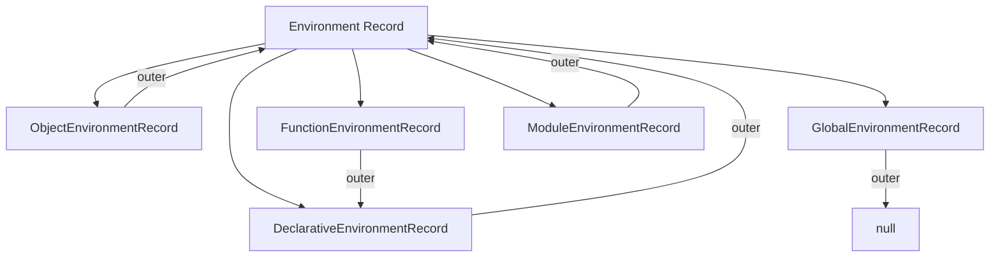
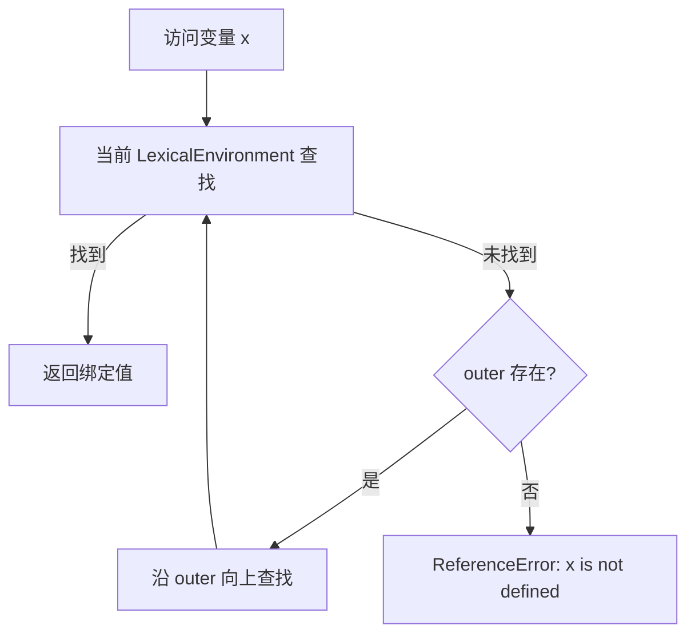

# 环境记录（Environment Records）

> **形式化定义**：环境记录（Environment Record）是 ECMA-262 规范中用于描述**标识符绑定**（变量、函数、类声明）的词法作用域结构。每个执行上下文都关联一个环境记录，环境记录之间通过**外部引用（outer reference）**形成作用域链。ECMA-262 §9.1 定义了所有环境记录类型。
>
> 对齐版本：ECMA-262 16th ed §9.1 | TypeScript 5.8–6.0

---

## 1. 概念定义

### 1.1 形式化定义

ECMA-262 §9.1 定义：

> *"An Environment Record is a specification type used to define the association of Identifiers to specific variables and functions, based upon the lexical nesting structure of ECMAScript code."*

环境记录的核心操作：

| 操作 | 说明 |
|------|------|
| `HasBinding(N)` | 是否有名称 N 的绑定 |
| `CreateMutableBinding(N, D)` | 创建可变绑定（let/var） |
| `CreateImmutableBinding(N, S)` | 创建不可变绑定（const） |
| `InitializeBinding(N, V)` | 初始化绑定值 |
| `SetMutableBinding(N, V, S)` | 修改可变绑定的值 |
| `GetBindingValue(N, S)` | 获取绑定值 |
| `DeleteBinding(N)` | 删除绑定（仅 var 可删除） |

### 1.2 环境记录的类型层次



---

## 2. 属性与特征

### 2.1 各类环境记录对比

| 类型 | 存储内容 | 创建时机 | outer 引用 | 特殊能力 |
|------|---------|---------|-----------|---------|
| **Declarative** | let/const/function/class | 块级/函数/模块 | 父级环境 | 严格模式控制 |
| **Object** | 对象属性作为绑定 | `with` 语句 | 父级环境 | 动态属性映射 |
| **Global** | 全局变量 + 全局对象属性 | 脚本/模块启动 | `null` | 复合结构 |
| **Function** | 参数 + 局部变量 | 函数调用 | 定义时的环境 | this/super 绑定 |
| **Module** | 导入/导出绑定 | 模块加载 | 全局环境 | Live Binding |

### 2.2 LexicalEnvironment vs VariableEnvironment

ECMA-262 的执行上下文包含两个环境引用：

| 字段 | 用途 | 变更时机 |
|------|------|---------|
| `LexicalEnvironment` | 标识符解析 | 进入块级作用域时临时变更 |
| `VariableEnvironment` | var 变量提升 | 仅在函数/全局上下文创建时设置，不变 |

这就是 `let/const` 有块级作用域而 `var` 只有函数作用域的规范根源。

---

## 3. 机制解释

### 3.1 作用域链解析流程



### 3.2 Global Environment Record 的复合结构

```
GlobalEnvironmentRecord: {
  [[ObjectRecord]]:    → ObjectEnvironmentRecord (window/globalThis)
  [[DeclarativeRecord]]: → DeclarativeEnvironmentRecord (全局 let/const/class)
  [[VarNames]]:        → List of Strings (全局 var 名称)
  [[GlobalThisValue]]:  → Object (全局 this)
}
```

**关键差异**：

- `var x = 1` → 在 `[[ObjectRecord]]` 中创建（成为全局对象属性）
- `let y = 2` → 在 `[[DeclarativeRecord]]` 中创建（不污染全局对象）

```javascript
var a = 1
let b = 2

console.log(globalThis.a)  // 1 ✅ var 成为全局对象属性
console.log(globalThis.b)  // undefined ❌ let 不在全局对象上
```

---

## 4. 实例与示例

### 4.1 块级作用域的环境记录切换

```javascript
let x = 'outer'
{
  let x = 'inner'
  console.log(x)  // 'inner' —— 内层块级环境记录遮蔽外层
}
console.log(x)  // 'outer' —— 恢复外层环境
```

### 4.2 with 语句的环境记录（已不推荐，但需理解）

```javascript
const obj = { a: 1, b: 2 }
with (obj) {
  console.log(a)  // 1 —— ObjectEnvironmentRecord 将 obj 属性作为绑定
  a = 10          // 修改 obj.a
  c = 3           // ❌ 未找到，泄漏到全局！
}
```

### 4.3 TDZ（Temporal Dead Zone）的规范根源

```javascript
// 规范层面：let/const 绑定在创建时处于 "uninitialized" 状态
// 访问 uninitialized 绑定抛出 ReferenceError

function tdzDemo() {
  // 此时 temp 已创建绑定，但尚未初始化
  console.log(typeof temp); // ReferenceError: Cannot access 'temp' before initialization
  let temp = 1;
}

// 对比 var：创建即初始化为 undefined
function hoistingDemo() {
  console.log(typeof temp); // "undefined"
  var temp = 1;
}
```

### 4.4 闭包的环境记录捕获

```javascript
// 每个闭包都捕获其定义时的 LexicalEnvironment
function createCounter() {
  let count = 0; // 存储在 DeclarativeEnvironmentRecord 中
  return {
    increment: () => ++count,
    decrement: () => --count,
    get: () => count,
  };
}

const counterA = createCounter();
const counterB = createCounter();

console.log(counterA.increment()); // 1
console.log(counterA.increment()); // 2
console.log(counterB.increment()); // 1 —— 独立的环境记录副本

// 环境记录生命周期：只要闭包存在，其 outer 引用的环境记录就存活
// 这就是闭包导致内存泄漏的根本原因
```

### 4.5 模块环境记录的 Live Binding

```javascript
// counter.js
export let count = 0;
export function increment() {
  count++;
}

// main.js
import { count, increment } from './counter.js';

console.log(count); // 0
increment();
console.log(count); // 1 —— Live Binding：读取时转发到源模块的最新值

// 规范层面：count 在 main.js 的 ModuleEnvironmentRecord 中是一个 IndirectBinding
// 访问时实际调用 counter.js ModuleEnvironmentRecord.GetBindingValue('count')
```

### 4.6 函数环境记录与 `this` 绑定

```javascript
// 箭头函数不创建 FunctionEnvironmentRecord
// 它们使用外层 LexicalEnvironment 的 this 绑定

const obj = {
  name: 'Alice',
  regular() {
    // 创建 FunctionEnvironmentRecord，this = obj
    console.log(this.name); // Alice
    setTimeout(function() {
      // 创建新的 FunctionEnvironmentRecord，this = globalThis（非严格）或 undefined（严格）
      console.log(this?.name); // undefined
    }, 0);
    setTimeout(() => {
      // 箭头函数：使用外层 LexicalEnvironment 的 this（即 obj）
      console.log(this.name); // Alice
    }, 0);
  },
};

obj.regular();
```

### 4.7 eval 的动态环境记录注入

```javascript
// 直接 eval 在当前 LexicalEnvironment 中创建绑定
function evalDemo() {
  let x = 1;
  eval('var y = 2; let z = 3;');
  console.log(y); // 2 —— eval 的 var 进入 VariableEnvironment
  console.log(z); // 3 —— eval 的 let 进入 LexicalEnvironment
}

// 间接 eval (通过变量调用) 在全局环境记录中执行
const indirectEval = eval;
function indirectDemo() {
  let x = 1;
  indirectEval('var y = 99;');
  // console.log(y); // ReferenceError —— y 在全局，不在局部
}
```

---

## 5. 权威参考

- **ECMA-262 §9.1** — Environment Records
- **ECMA-262 §9.2** — Lexical Environments
- **MDN: Closure** — <https://developer.mozilla.org/en-US/docs/Web/JavaScript/Closures>

---

> 📅 最后更新：2026-04-27
> 📏 字节数：~5,500+


---

## 补充：Environment Record 的规范算法

### 补充 1：Global Environment Record 的复合操作

Global Environment Record 是**复合环境记录**，它的操作需要协调内部两个子记录：

```
GlobalEnv.CreateGlobalVarBinding(N, D):
  1. Let objRec be GlobalEnv.[[ObjectRecord]]
  2. Let existingProp be objRec.[[GetOwnProperty]](N)
  3. If existingProp is undefined:
       a. Let desc be PropertyDescriptor { [[Value]]: undefined, [[Writable]]: true, [[Enumerable]]: true, [[Configurable]]: D }
       b. Perform objRec.[[DefineOwnProperty]](N, desc)
  4. Else if existingProp.[[Configurable]] is true:
       a. Let desc be PropertyDescriptor { [[Value]]: undefined, [[Writable]]: true, [[Enumerable]]: true, [[Configurable]]: D }
       b. Perform objRec.[[DefineOwnProperty]](N, desc)
  5. Return unused
```

这就是为什么 `var` 声明会成为全局对象的可枚举属性，而 `let/const` 不会。

### 补充 2：Function Environment Record 的 `this` 绑定

函数调用时创建的 Function Environment Record 会绑定 `this` 值：

| 调用方式 | `this` 绑定 |
|---------|-----------|
| `obj.method()` | `obj` |
| `func()` | `undefined`（严格模式）/ 全局对象（非严格） |
| `new Func()` | 新创建的对象 |
| `func.call(obj)` / `func.apply(obj)` | 显式指定的 `obj` |
| 箭头函数 | 词法继承（外层 `this`） |

### 补充 3：Module Environment Record 的 Live Binding 实现

Module Environment Record 的特殊之处在于它创建的是**间接绑定（Indirect Binding）**：

```
ModuleEnv.CreateImportBinding(N, M, N2):
  1. Assert: M 是一个 Module Environment Record
  2. Let binding be new IndirectBinding(N, M, N2)
  3. Add binding to ModuleEnv.[[Bindings]]
```

当访问该绑定时，实际会转发到源模块 `M` 中的绑定 `N2`。这就是 ESM Live Binding 的底层机制。

### 补充 4：try-catch 的 Catch Clause 环境记录

```javascript
// catch 子句创建新的 DeclarativeEnvironmentRecord
// 异常参数绑定在此环境记录中

try {
  throw new Error('demo');
} catch (e) {
  // e 绑定在 catch 专用的 DeclarativeEnvironmentRecord 中
  console.log(e.message); // demo
}
// console.log(e); // ReferenceError —— e 的绑定随 catch 环境记录销毁
```

### 补充 5：类字段与私有成员的类环境记录

```javascript
class MyClass {
  static #privateStatic = 42; // 存储在 ClassEnvironmentRecord 中
  #privateField = 0;          // 每个实例的 PrivateEnvironment

  constructor() {
    // new 创建新的 FunctionEnvironmentRecord
    // 类字段初始化在 super() 之后、构造函数体之前执行
    console.log(this.#privateField); // 0
  }

  getPrivate() {
    return this.#privateField; // 通过 PrivateName 访问，规范层面不同于普通属性
  }
}
```

---

## 权威外部链接

| 资源 | 描述 | 链接 |
|------|------|------|
| ECMA-262 §9.1 | 环境记录规范 | [tc39.es/ecma262/#sec-environment-records](https://tc39.es/ecma262/#sec-environment-records) |
| ECMA-262 §9.2 | 词法环境规范 | [tc39.es/ecma262/#sec-lexical-environments](https://tc39.es/ecma262/#sec-lexical-environments) |
| MDN — Closures | 闭包深入指南 | [developer.mozilla.org/en-US/docs/Web/JavaScript/Closures](https://developer.mozilla.org/en-US/docs/Web/JavaScript/Closures) |
| MDN — Scope | 作用域说明 | [developer.mozilla.org/en-US/docs/Glossary/Scope](https://developer.mozilla.org/en-US/docs/Glossary/Scope) |
| MDN — let | 块级绑定 | [developer.mozilla.org/en-US/docs/Web/JavaScript/Reference/Statements/let](https://developer.mozilla.org/en-US/docs/Web/JavaScript/Reference/Statements/let) |
| MDN — const | 常量绑定 | [developer.mozilla.org/en-US/docs/Web/JavaScript/Reference/Statements/const](https://developer.mozilla.org/en-US/docs/Web/JavaScript/Reference/Statements/const) |
| 2ality — JS Variables | 变量深度解析 | [2ality.com/2015/02/es6-scoping.html](https://2ality.com/2015/02/es6-scoping.html) |
| V8 Blog — Fast Properties | 隐藏类与环境记录 | [v8.dev/blog/fast-properties](https://v8.dev/blog/fast-properties) |
| JavaScript Spec Explorer | 规范可视化 | [tc39.es/ecma262/multipage/](https://tc39.es/ecma262/multipage/) |
| Dr. Axel Rauschmayer — Speaking JS | 权威 JS 教材 | [exploringjs.com/es6/ch_variables.html](https://exploringjs.com/es6/ch_variables.html) |
| JS Engine Exposed | 引擎内幕系列 | [mathiasbynens.be/notes/shapes-ics](https://mathiasbynens.be/notes/shapes-ics) |
| Modules in ES6 | 模块系统详解 | [exploringjs.com/es6/ch_modules.html](https://exploringjs.com/es6/ch_modules.html) |

> 📅 补充更新：2026-04-30
