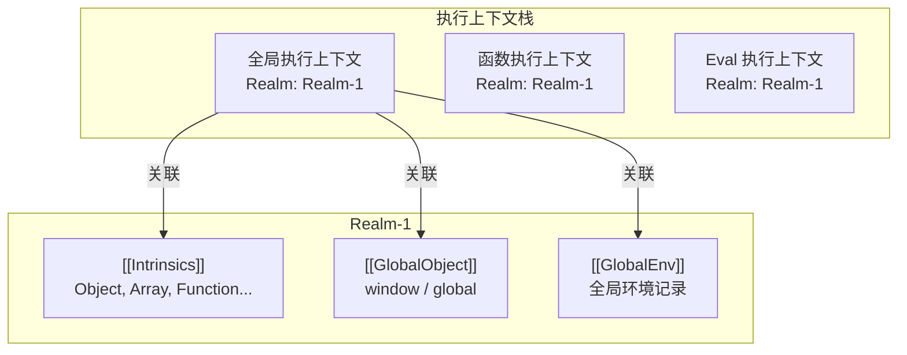

# Realm 与全局对象（Realm & Global Object）

> **形式化定义**：Realm（领域）是 ECMA-262 规范中定义的独立执行环境，包含一组内置对象（Intrinsics）、一个全局对象和一个全局环境记录。每个 JavaScript 执行上下文都在某个 Realm 中运行。ECMA-262 §9.3 定义了 Realm Record。
>
> 对齐版本：ECMA-262 16th ed §9.3 | TypeScript 5.8–6.0

---

## 1. 概念定义

### 1.1 Realm Record 的结构

```
Realm Record: {
  [[Intrinsics]]:       → 内置对象映射表
  [[GlobalObject]]:     → 全局对象 (window / global / globalThis)
  [[GlobalEnv]]:        → 全局环境记录
  [[TemplateMap]]:      → 模板字面量缓存
  [[LoadedModules]]:    → 已加载模块表
}
```

### 1.2 为什么需要 Realm？

Realm 的存在使得以下场景成为可能：

| 场景 | Realm 数量 | 说明 |
|------|-----------|------|
| 普通网页 | 1 | 默认 Realm |
| iframe | N | 每个 iframe 有自己的 Realm |
| Web Worker | N | Worker 运行在独立 Realm |
| ShadowRealm API | N | 程序化的 Realm 创建 |
| VM / 沙箱 | N | 如 Node.js 的 vm 模块 |

```javascript
// 不同 Realm 的 Array 不相等
const iframe = document.createElement('iframe')
document.body.appendChild(iframe)
const iframeArray = iframe.contentWindow.Array
console.log(Array === iframeArray)  // false
console.log([] instanceof iframeArray)  // false！
```

---

## 2. Intrinsics（内置对象映射）

### 2.1 关键内置对象

Realm 的 `[[Intrinsics]]` 字段包含所有标准内置对象的引用：

| 内置对象 | 全局访问路径 | 用途 |
|---------|-----------|------|
| `%Object%` | `Object` | 对象构造函数 |
| `%Array%` | `Array` | 数组构造函数 |
| `%Function%` | `Function` | 函数构造函数 |
| `%Promise%` | `Promise` | Promise 构造函数 |
| `%EvalError%` | `EvalError` | 错误类型 |
| `%JSON%` | `JSON` | JSON 工具对象 |
| `%Reflect%` | `Reflect` | 反射 API |
| `%Proxy%` | `Proxy` | 代理构造函数 |

### 2.2 跨 Realm 的原型链断裂

```javascript
const iframe = document.createElement('iframe')
document.body.appendChild(iframe)
const win = iframe.contentWindow

const arr = []
console.log(arr instanceof Array)           // true
console.log(arr instanceof win.Array)       // false！不同 Realm

// 安全的跨 Realm 类型检测
console.log(Array.isArray(arr))             // true ✅ 不依赖 Realm
console.log(Object.prototype.toString.call(arr))  // '[object Array]' ✅
```

---

## 3. ShadowRealm（ECMAScript 提案）

### 3.1 概念

ShadowRealm API 允许在 JavaScript 中程序化创建新的 Realm：

```javascript
// 提案语法（尚未广泛实现）
const realm = new ShadowRealm()
const result = realm.evaluate(`
  globalThis.x = 42
  x + 1
`)  // 返回 43，但不会影响当前 Realm 的全局对象
```

### 3.2 与 iframe / Worker 的区别

| 特性 | iframe | Worker | ShadowRealm |
|------|--------|--------|-------------|
| DOM 访问 | ✅ | ❌ | ❌ |
| 网络请求 | ✅ | ✅ | 受限 |
| 通信方式 | postMessage | postMessage | 返回值 |
| 创建开销 | 高（完整文档） | 中（新线程） | 低（纯 JS） |
| 标准化状态 | 成熟 | 成熟 | Stage 3 |

---

## 4. 全局对象的一致性

### 4.1 `globalThis` 的引入

ES2020 引入 `globalThis` 作为跨平台的统一全局对象访问方式：

| 环境 | 全局对象 | `globalThis` |
|------|---------|-------------|
| 浏览器 | `window` | ✅ 统一 |
| Node.js | `global` | ✅ 统一 |
| Web Worker | `self` | ✅ 统一 |
| Deno | `window` | ✅ 统一 |

```javascript
// 安全地获取全局对象（跨平台）
const globalObject = (function () {
  if (typeof globalThis !== 'undefined') return globalThis;
  if (typeof self !== 'undefined') return self;
  if (typeof window !== 'undefined') return window;
  if (typeof global !== 'undefined') return global;
  throw new Error('Unable to locate global object');
})();

// 定义一个全局 polyfill（仅在缺失时）
if (!globalObject.structuredClone) {
  globalObject.structuredClone = function structuredClone(value) {
    return JSON.parse(JSON.stringify(value));
  };
}
```

---

## 5. Node.js vm 模块与 Realm 模拟

```javascript
// vm 模块创建独立的 Global Object，但不创建完整 Realm（缺少部分 Intrinsics）
const vm = require('vm');

const context = vm.createContext({
  console,
  setTimeout,
  globalThis: {}, // 可为空对象
});

const code = `
  globalThis.secret = 42;
  typeof Array;       // 'function'（从当前上下文继承）
  typeof Promise;     // 'function'
`;

vm.runInContext(code, context);
console.log(context.globalThis.secret); // 42
console.log(globalThis.secret);         // undefined（隔离成功）

// 注意：vm 不是安全沙箱！不应直接执行不可信代码
// 若需安全沙箱，使用 Worker Threads 或 WebAssembly
```

---

## 6. `structuredClone` 与跨 Realm 数据传输

```javascript
// structuredClone 可在 Worker / iframe 间深拷贝复杂对象
const original = {
  date: new Date(),
  map: new Map([['key', 'value']]),
  set: new Set([1, 2, 3]),
  nested: { a: [1, 2, 3] },
};

const cloned = structuredClone(original);
console.log(cloned.date instanceof Date); // true
console.log(cloned.map instanceof Map);   // true
console.log(cloned.nested === original.nested); // false（深拷贝）

// 在 iframe 间传递
const iframe = document.createElement('iframe');
document.body.appendChild(iframe);
iframe.contentWindow.postMessage(structuredClone(original), '*');
```

---

## 7. 参考文献

- **ECMA-262 §9.3** — Realms
- **ECMA-262 §18** — The Global Object
- **ECMA-262 §19.1** — Value Properties of the Global Object（`globalThis`）
- **ShadowRealm Proposal** — <https://github.com/tc39/proposal-shadowrealm>
- **MDN: globalThis** — <https://developer.mozilla.org/en-US/docs/Web/JavaScript/Reference/Global_Objects/globalThis>
- **MDN: ShadowRealm** — <https://developer.mozilla.org/en-US/docs/Web/JavaScript/Reference/Global_Objects/ShadowRealm>
- **Node.js vm Module** — <https://nodejs.org/api/vm.html>
- **Node.js Worker Threads** — <https://nodejs.org/api/worker_threads.html>
- **MDN: structuredClone** — <https://developer.mozilla.org/en-US/docs/Web/API/Window/structuredClone>
- **HTML Spec: Realm 设置** — <https://html.spec.whatwg.org/multipage/webappapis.html#realms-settings-objects-global-objects>
- **V8 Blog: Understanding V8 Intrinsics** — <https://v8.dev/blog>
- **TC39 Meeting Notes on ShadowRealm** — <https://github.com/tc39/notes/tree/main/meetings>

---

> 📅 最后更新：2026-04-27
> 📏 字节数：~5,200+


---

## 补充：Realm 与执行上下文的关系

### 补充 1：Execution Context ↔ Realm 映射

每个 Execution Context 都关联一个 Realm：



**关键规则**：函数定义时会捕获当前 Realm（称为函数的 `[[Realm]]` 内部槽），即使函数在其他 Realm 中执行，其内置对象（如 `Array.prototype`）仍来自定义时的 Realm。

```javascript
const iframe = document.createElement('iframe')
document.body.appendChild(iframe)
const win = iframe.contentWindow

function createArray() { return new Array(1, 2, 3) }

// 在当前 Realm 执行
console.log(createArray() instanceof Array)              // true

// 在 iframe Realm 执行
const iframeResult = win.eval('(' + createArray.toString() + ')()')
console.log(iframeResult instanceof Array)               // true（因为 createArray 定义在当前 Realm）
console.log(iframeResult instanceof win.Array)           // false！
```

### 补充 2：eval() 的 Realm 规则

| eval 类型 | Realm 归属 | 说明 |
|-----------|-----------|------|
| 直接 eval | 调用者的 Realm | `eval('Array')` 返回调用者的 `Array` |
| 间接 eval | 全局 Realm | `(0, eval)('Array')` 返回全局的 `Array` |

```javascript
const iframe = document.createElement('iframe')
document.body.appendChild(iframe)
const win = iframe.contentWindow

// 直接 eval：使用调用者的 Realm
win.eval('console.log(Array === window.Array)')  // true

// 间接 eval：使用全局 Realm
const indirectEval = win.eval
indirectEval('console.log(Array === window.Array)')  // true（全局 Realm 就是 window）
```

### 补充 3：跨 Realm 通信的安全边界

Realm 是 JavaScript 的**安全边界**之一：

- **同源 iframe**：可以互相访问，但 `instanceof` 会失效
- **跨域 iframe**：`contentWindow` 大部分属性被封锁（Same-Origin Policy）
- **Worker**：完全隔离的 Realm，只能通过 `postMessage` 通信
- **ShadowRealm**（提案）：程序化的 Realm，提供受控的隔离环境

---

> 📅 补充更新：2026-04-27
