# 20.1 Fundamentals Lab — Architecture

> **路径**: `20-code-lab/20.1-fundamentals-lab/ARCHITECTURE.md`
> **定位**: 语言核心基础实验模块
> **关联**: `10-fundamentals/10.1-language-semantics/` | `10-fundamentals/10.2-type-system/`

---

## 1. System Overview / 系统概述

### 中文

`20.1-fundamentals-lab` 是整个 JS/TS 全景知识库 **20-code-lab** 系列的第一个实验模块，承担着为学习者建立**语言核心地基**的战略使命。本模块不追求框架层面的"炫酷"，而是深入 JavaScript 语言的底层机制——从变量声明、类型系统、作用域链、闭包到事件循环，构建对语言执行模型的完整认知。只有真正理解了这些核心原理，开发者才能在面对框架源码、性能调优和复杂调试时具备**穿透表象、直达本质**的能力。

本模块的设计理念源于一个核心洞察：**所有上层抽象（React、Vue、Node.js、TypeScript 编译器）都建立在语言核心机制之上**。如果基础不牢，学习者在遇到 `this` 绑定异常、内存泄漏、异步执行顺序混乱等问题时，只能停留在"试错-搜索-复制"的表层循环，而无法进行系统性的根因分析。

本模块覆盖六大核心主题：
- **类型系统与强制转换**：理解 JavaScript 的动态弱类型本质，掌握 TypeScript 的类型收窄与守卫
- **作用域与闭包**：从词法环境到执行上下文，建立作用域链的可视化心智模型
- **原型链与继承**：穿透 `class` 语法糖，理解基于原型的委托机制
- **事件循环**：掌握宏任务与微任务的调度顺序，写出可预测的非阻塞代码
- **ECMAScript 演进**：追踪从 ES2020 到 ES2026 的语言特性发展脉络
- **语言对比与互操作**：建立 JS vs TS vs WASM 的全景视角

### English

`20.1-fundamentals-lab` is the first experimental module in the **20-code-lab** series of the JS/TS panoramic knowledge base, bearing the strategic mission of establishing the **language core foundation** for learners. This module does not pursue framework-level "flashiness" but instead dives deep into the underlying mechanisms of the JavaScript language—from variable declarations, type systems, scope chains, closures to the event loop—to build a complete cognitive model of the language execution model. Only by truly understanding these core principles can developers possess the ability to **penetrate appearances and reach essence** when facing framework source code, performance tuning, and complex debugging.

The design philosophy stems from a core insight: **all upper-layer abstractions (React, Vue, Node.js, TypeScript compiler) are built upon language core mechanisms**. Without a solid foundation, learners encountering issues like `this` binding anomalies, memory leaks, or asynchronous execution order confusion can only remain in a superficial loop of "trial-and-error, search, copy-paste" rather than systematic root cause analysis.

---

## 2. Module Structure / 模块结构

### 中文

本模块采用**"核心演示文件 + 主题子目录 + 测试验证"**的三层组织结构，兼顾快速上手与深度探索：

```
20.1-fundamentals-lab/
├── README.md                    # 目录索引与快速导航
├── THEORY.md                    # 核心理论与代码示例
├── ARCHITECTURE.md              # 本文件：架构设计与学习指南
│
├── index.ts                     # 模块总入口：类型 coercion 边界案例
├── closures.ts                  # 闭包机制核心演示
├── event-loop.ts                # 事件循环执行顺序演示
├── prototype-chain.ts           # 原型链委托机制演示
├── tdz-demo.ts                  # 暂时性死区(TDZ)演示
├── type-coercion.ts             # 隐式类型转换陷阱演示
│
├── language-core/               # 语言核心系统化学习路径
│   ├── 01-types/                # 类型系统：原始类型、泛型
│   ├── 02-variables/            # 变量声明：var/let/const、TDZ
│   ├── 03-control-flow/         # 控制流：条件、循环
│   ├── 04-functions/            # 函数：箭头函数、this 绑定
│   ├── 05-objects-classes/      # 对象与类：原型、ES6 class
│   ├── 06-modules/              # 模块系统：ESM、动态导入
│   └── 07-metaprogramming/      # 元编程：Proxy、Reflect
│
├── js-ts-comparison/            # JS vs TS 深度对比
│   ├── syntax-mapping/          # 语法映射对照
│   ├── type-theory/             # 类型理论形式化
│   ├── semantic-models/         # 语义模型差异
│   ├── js-implementations/      # JS 原生设计模式实现
│   ├── pattern-migration/       # 模式迁移路径
│   ├── interoperability/        # 互操作技术
│   └── compiler-api/            # 编译器 API 实践
│
├── ecmascript-evolution/        # ECMAScript 演进时间线
│   ├── es2020/                  # BigInt、可选链、空值合并
│   ├── es2021/                  # Promise.any、逻辑赋值
│   ├── es2022/                  # Class fields、at()
│   ├── es2023/                  # 数组新方法
│   ├── es2024/                  # GroupBy、Promise.withResolvers
│   ├── es2025/                  # Set 方法、Iterator Helpers
│   ├── es2025-preview/          # Atomics.pause 等预览特性
│   └── es2026-preview/          # 未来特性预览
│
├── application-development/     # 应用开发基础模式
├── compiler-design/             # 编译器设计入门
│   ├── lexer.ts                 # 词法分析器
│   ├── parser.ts                # 语法分析器
│   ├── ast.ts                   # AST 遍历与操作
│   └── code-gen.ts              # 代码生成
│
├── developer-experience/        # 开发者体验工具链
│   ├── hot-module-replacement.ts
│   ├── fast-refresh.ts
│   ├── error-overlay.ts
│   └── source-maps.ts
│
├── metaprogramming/             # 元编程与反射
│   ├── decorators.ts
│   ├── proxy-interceptor.ts
│   ├── di-container.ts
│   └── reflection.ts
│
├── package-management/          # 包管理实践
├── real-world-examples/         # 真实世界案例
│   ├── auth-system/
│   ├── event-bus/
│   ├── state-management/
│   ├── data-processing/
│   ├── cli-tools/
│   ├── web-server/
│   ├── api-client/
│   └── validation/
│
├── web-apis-lab/                # Web API 实验
│   ├── fetch-advanced.ts
│   ├── streams-pipeline.ts
│   ├── service-worker-cache.ts
│   └── web-platform-apis/       # 新兴 Web 平台 API
│
├── web-assembly/                # WebAssembly 集成
├── internationalization/        # 国际化实践
└── documentation/               # 文档生成工具
```

### English

This module adopts a **three-layer organizational structure** of "core demo files + thematic subdirectories + test validation", balancing quick onboarding with deep exploration:

---

## 3. Key Concepts Map / 核心概念映射

```mermaid
graph TD
    A[Language Core / 语言核心] --> B[Type System / 类型系统]
    A --> C[Scope & Closure / 作用域与闭包]
    A --> D[Prototype Chain / 原型链]
    A --> E[Event Loop / 事件循环]
    A --> F[Module System / 模块系统]

    B --> B1[Dynamic Typing / 动态类型]
    B --> B2[Type Coercion / 类型强制转换]
    B --> B3[TypeScript Guards / TS 类型守卫]
    B --> B4[Discriminated Unions / 可辨识联合]

    C --> C1[Lexical Environment / 词法环境]
    C --> C2[Execution Context / 执行上下文]
    C --> C3[TDZ / 暂时性死区]
    C --> C4[Closure Memory / 闭包内存模型]

    D --> D1[__proto__ / 原型对象]
    D --> D2[Object.create / 委托机制]
    D --> D3[class Syntax / 类语法糖]
    D --> D4[Property Lookup / 属性查找链]

    E --> E1[Macrotask / 宏任务]
    E --> E2[Microtask / 微任务]
    E --> E3[Promise Queue / Promise 队列]
    E --> E4[Render Phase / 渲染阶段]

    F --> F1[ESM / ES 模块]
    F --> F2[Dynamic Import / 动态导入]
    F --> F3[CommonJS / CJS 互操作]

    B3 --> G[Real-world Debugging / 真实调试能力]
    C4 --> G
    D4 --> G
    E2 --> G

    G --> H[Framework Internals / 框架源码理解]
    G --> I[Performance Tuning / 性能调优]
    G --> J[Async Patterns / 异步模式设计]
```



---

## 4. Learning Progression / 学习路径

### 中文

我们建议学习者按照以下**渐进式路径**完成本模块，每一步都建立在前一步的认知基础之上：

**第一阶段：快速建立直觉（1-2 天）**
1. 阅读 `THEORY.md` 的"核心理论"和"设计原理"章节
2. 运行 `index.ts` 观察类型 coercion 的边界案例
3. 依次运行 `type-coercion.ts`、`tdz-demo.ts`、`closures.ts`、`prototype-chain.ts`、`event-loop.ts`
4. 对照 THEORY.md 中的"常见误区"表格，检验自己的理解

**第二阶段：系统化深耕（3-5 天）**
5. 进入 `language-core/` 目录，按编号顺序学习 01-types → 07-metaprogramming
6. 每个子目录包含 `README.md`、`THEORY.md` 和可运行的 `.ts` 文件
7. 重点关注 `js-ts-comparison/` 中的语义模型差异和类型理论

**第三阶段：演进与对比（2-3 天）**
8. 浏览 `ecmascript-evolution/`，按年份追踪语言演进
9. 在 `js-ts-comparison/pattern-migration/` 中练习将 JS 模式改写为 TS
10. 尝试 `compiler-design/` 中的迷你编译器实现

**第四阶段：真实场景应用（2-3 天）**
11. 选择 `real-world-examples/` 中感兴趣的方向（auth、event-bus、state-management 等）
12. 在 `web-apis-lab/` 中实验现代 Web API
13. 尝试 `web-assembly/wasm-integration.ts` 了解 JS ↔ WASM 互操作

### English

**Phase 1: Building Intuition (1-2 days)**
1. Read the "Core Theory" and "Design Principles" sections in `THEORY.md`
2. Run `index.ts` to observe type coercion edge cases
3. Run `type-coercion.ts`, `tdz-demo.ts`, `closures.ts`, `prototype-chain.ts`, `event-loop.ts` sequentially
4. Cross-check your understanding against the "Common Misconceptions" table in THEORY.md

**Phase 2: Systematic Deep Dive (3-5 days)**
5. Enter `language-core/` and study 01-types → 07-metaprogramming in numbered order
6. Each subdirectory contains `README.md`, `THEORY.md`, and runnable `.ts` files
7. Focus on semantic model differences and type theory in `js-ts-comparison/`

**Phase 3: Evolution & Comparison (2-3 days)**
8. Browse `ecmascript-evolution/` to track language evolution by year
9. Practice rewriting JS patterns to TS in `js-ts-comparison/pattern-migration/`
10. Try the mini-compiler implementation in `compiler-design/`

**Phase 4: Real-world Application (2-3 days)**
11. Select an area of interest in `real-world-examples/`
12. Experiment with modern Web APIs in `web-apis-lab/`
13. Try `web-assembly/wasm-integration.ts` for JS ↔ WASM interop

---

## 5. Prerequisites & Dependencies / 前置知识与依赖

### 中文

**前置知识假设：**
- 具备至少一门编程语言的基础经验（Python、Java、C++ 均可）
- 了解基本的计算机科学概念：变量、函数、条件语句、循环
- 熟悉命令行基本操作和 Node.js 环境安装

**模块间依赖关系：**
```
20.1-fundamentals-lab
├── 前置依赖：无（本模块为系列起点）
├── 为 20.2-language-patterns 提供：
│   ├── 闭包机制 → 高阶函数与回调模式
│   ├── 原型链 → 设计模式中的继承与委托
│   └── 类型系统 → TypeScript 特有设计模式
├── 为 20.3-concurrency-async 提供：
│   ├── 事件循环 → 异步调度模型
│   ├── Promise → async/await 语法基础
│   └── 执行上下文 → Worker Threads 内存模型
├── 为 20.4-data-algorithms 提供：
│   ├── 对象模型 → Map/Set/WeakMap 选型
│   ├── 类型化数组 → TypedArray 性能优化
│   └── 函数一等公民 → 函数式数据结构
├── 为 20.5-frontend-frameworks 提供：
│   ├── this 绑定 → 组件方法上下文
│   ├── 闭包 → 状态管理与 hooks 原理
│   └── Proxy → 响应式系统实现
└── 为 20.6-backend-apis 提供：
    ├── 模块系统 → 服务端代码组织
    ├── 事件循环 → Node.js 服务端并发模型
    └── 错误处理 → API 健壮性设计
```

**外部依赖：**
- Node.js >= 20.x
- TypeScript >= 5.5
- 推荐 IDE：VS Code + TypeScript 插件

### English

**Prerequisites:**
- Basic experience with at least one programming language (Python, Java, C++, etc.)
- Understanding of basic CS concepts: variables, functions, conditionals, loops
- Familiarity with command-line basics and Node.js installation

**External Dependencies:**
- Node.js >= 20.x
- TypeScript >= 5.5
- Recommended IDE: VS Code + TypeScript plugin

---

## 6. Exercise Design Philosophy / 练习设计哲学

### 中文

本模块的练习设计遵循**"认知负荷渐进释放"**原则，每个练习都经过精心设计，确保学习者在适当的挑战区（Zone of Proximal Development）中成长：

**渐进难度设计：**
- **Level 1 — 观察型**：运行已有代码，观察输出，回答"发生了什么"。例如 `event-loop.ts` 中预测宏任务与微任务的执行顺序。
- **Level 2 — 修改型**：在现有代码基础上修改参数或条件，观察行为变化。例如修改 `tdz-demo.ts` 中 `var` 为 `let`，对比错误信息。
- **Level 3 — 实现型**：根据理论描述独立实现一个机制。例如参照 THEORY.md 中的描述，手写一个 `Promise.all` 的简化版。
- **Level 4 — 调试型**：给定一个含有隐蔽 bug 的代码片段，运用本模块知识定位根因。例如一个因闭包捕获循环变量而导致的异常行为。
- **Level 5 — 架构型**：将多个概念组合解决真实问题。例如在 `real-world-examples/` 中设计一个基于事件总线的模块通信系统。

**真实世界场景导向：**
每个核心概念都映射到至少一个真实开发场景：
- 闭包 → React hooks 的底层原理、私有模块模式
- 原型链 → jQuery/Vue2 的插件扩展机制、对象池优化
- 事件循环 → 避免阻塞主线程、合理安排微任务优先级
- 类型收窄 →  GraphQL/REST API 响应的类型安全处理

**测试驱动验证：**
子目录中的 `.test.ts` 文件不仅是验证工具，更是学习材料。学习者应先阅读测试用例，理解预期行为，再阅读实现代码，形成"预期-验证-理解"的闭环。

### English

**Progressive Difficulty Design:**
- **Level 1 — Observation**: Run existing code, observe output, answer "what happened". Example: predicting macro/microtask execution order in `event-loop.ts`.
- **Level 2 — Modification**: Modify parameters or conditions in existing code and observe behavioral changes.
- **Level 3 — Implementation**: Independently implement a mechanism based on theoretical descriptions.
- **Level 4 — Debugging**: Given a code snippet with a subtle bug, use module knowledge to locate the root cause.
- **Level 5 — Architecture**: Combine multiple concepts to solve real-world problems.

**Real-world Scenario Orientation:**
Each core concept maps to at least one real development scenario.

**Test-driven Validation:**
`.test.ts` files in subdirectories are not just validation tools but learning materials.

---

## 7. Extension Points / 扩展方向

### 中文

完成本模块后，学习者可以在以下方向继续深化：

**纵向深化 — 语言引擎层面：**
- 阅读 V8 引擎源码（`src/objects/`、`src/heap/`），理解对象表示与垃圾回收
- 学习 TC39 提案流程，参与 ECMAScript 标准化讨论
- 研究 TypeScript 编译器 API（`ts.createProgram`、`ts.transform`），开发自定义代码转换工具
- 深入了解 WebAssembly 的 MVP 与组件模型（Component Model）规范

**横向扩展 — 框架与运行时：**
- 进入 `20.2-language-patterns`：将语言核心知识应用于设计模式与架构决策
- 进入 `20.3-concurrency-async`：基于事件循环理解 Worker Threads、Atomics 与流式处理
- 进入 `20.4-data-algorithms`：基于原型链和类型化数组理解 V8 内部优化机制

**实战项目 — 从学习到产出：**
- 基于 `compiler-design/` 实现一个迷你 DSL（领域特定语言）编译器
- 基于 `metaprogramming/` 开发一个 IoC/DI 容器库
- 基于 `web-assembly/` 将计算密集型算法（图像处理、压缩）迁移到 WASM
- 为开源项目贡献类型定义（DefinitelyTyped）或语言特性 polyfill

**学术前沿：**
- 阅读 `70-theoretical-foundations/70.1-category-theory/` 中的范畴论与类型系统关联
- 研究 Gradual Typing 的形式化语义（`10-fundamentals/10.2-type-system/`）
- 探索 Effect Systems 在 TypeScript 中的实验性实现

### English

**Vertical Deepening — Language Engine Level:**
- Read V8 engine source code (`src/objects/`, `src/heap/`) to understand object representation and garbage collection
- Learn the TC39 proposal process and participate in ECMAScript standardization discussions
- Study the TypeScript Compiler API (`ts.createProgram`, `ts.transform`) to develop custom code transformation tools
- Deep dive into WebAssembly MVP and Component Model specifications

**Horizontal Expansion — Frameworks & Runtimes:**
- Proceed to `20.2-language-patterns`: Apply language core knowledge to design patterns and architectural decisions
- Proceed to `20.3-concurrency-async`: Understand Worker Threads, Atomics, and stream processing based on the event loop
- Proceed to `20.4-data-algorithms`: Understand V8 internal optimization mechanisms based on prototype chains and typed arrays

**Practical Projects — From Learning to Output:**
- Implement a mini DSL compiler based on `compiler-design/`
- Develop an IoC/DI container library based on `metaprogramming/`
- Migrate compute-intensive algorithms to WASM based on `web-assembly/`
- Contribute type definitions (DefinitelyTyped) or language feature polyfills to open source

**Academic Frontiers:**
- Read category theory and type system connections in `70-theoretical-foundations/70.1-category-theory/`
- Research formal semantics of Gradual Typing in `10-fundamentals/10.2-type-system/`
- Explore experimental implementations of Effect Systems in TypeScript

---

*本 ARCHITECTURE.md 遵循 JS/TS 全景知识库的理论-实践闭环原则。*
*This ARCHITECTURE.md follows the theory-practice closed-loop principle of the JS/TS panoramic knowledge base.*
