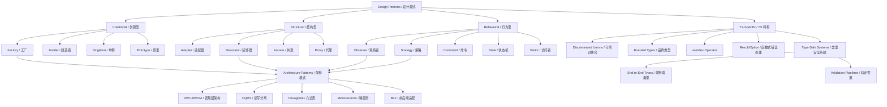

# 20.2 Language Patterns — Architecture

> **路径**: `20-code-lab/20.2-language-patterns/ARCHITECTURE.md`
> **定位**: 语言模式与软件设计模式实验模块
> **关联**: `10-fundamentals/` | `20.1-fundamentals-lab/` | `30-knowledge-base/`

---

## 1. System Overview / 系统概述

### 中文

`20.2-language-patterns` 是 JS/TS 全景知识库代码实验系列的第二个模块，聚焦**软件设计模式、架构范式与 TypeScript 语言特有模式的系统化实践**。如果说 `20.1-fundamentals-lab` 解决的是"语言机制是什么"的问题，那么本模块解决的就是"如何用好这些机制来组织复杂代码"的问题。

本模块的核心教学目标是培养学习者的**模式识别能力**与**架构决策能力**。在真实工程实践中，优秀的开发者不是背诵了更多设计模式，而是能够在面对重复出现的问题时，快速识别出适合当前上下文（Context）的模式，并理解该模式带来的权衡（Trade-offs）。本模块通过形式化的模式定义、TypeScript 类型系统增强的实现、以及从 GoF 经典模式到现代前端架构的完整覆盖，帮助学习者建立这种能力。

本模块的独特价值在于：**将抽象的设计模式转化为可编译、可测试、可扩展的 TypeScript 代码**。传统的"设计模式"教学往往停留在 UML 图和伪代码层面，而本模块要求每个模式都有完整的类型签名、单元测试和真实场景的应用示例。

### English

`20.2-language-patterns` is the second module in the JS/TS panoramic knowledge base code lab series, focusing on the **systematic practice of software design patterns, architectural paradigms, and TypeScript language-specific patterns**. If `20.1-fundamentals-lab` answers "what are the language mechanisms", this module answers "how to use these mechanisms to organize complex code".

The core teaching goal is to cultivate learners' **pattern recognition ability** and **architectural decision-making ability**. In real engineering practice, excellent developers are not those who memorize more design patterns, but those who can quickly identify patterns suitable for the current context when facing recurring problems, and understand the trade-offs involved.

---

## 2. Module Structure / 模块结构

### 中文

本模块采用**"经典模式 + 现代架构 + 领域应用"**的三层组织结构：

```
20.2-language-patterns/
├── README.md                    # 目录索引
├── THEORY.md                    # 语言模式核心理论与代码示例
├── ARCHITECTURE.md              # 本文件
│
├── design-patterns/             # GoF 23种设计模式完整实现
│   ├── creational/              # 创建型模式
│   │   ├── factory.ts           # 工厂模式
│   │   ├── abstract-factory.ts  # 抽象工厂
│   │   ├── builder.ts           # 建造者模式
│   │   ├── prototype.ts         # 原型模式
│   │   └── singleton.ts         # 单例模式
│   ├── structural/              # 结构型模式
│   │   ├── adapter.ts           # 适配器模式
│   │   ├── bridge.ts            # 桥接模式
│   │   ├── composite.ts         # 组合模式
│   │   ├── decorator.ts         # 装饰器模式
│   │   ├── facade.ts            # 外观模式
│   │   ├── flyweight.ts         # 享元模式
│   │   └── proxy.ts             # 代理模式
│   ├── behavioral/              # 行为型模式
│   │   ├── chain-of-responsibility.ts
│   │   ├── command.ts           # 命令模式（含撤销）
│   │   ├── iterator.ts
│   │   ├── mediator.ts
│   │   ├── memento.ts
│   │   ├── observer.ts
│   │   ├── state.ts             # 状态机模式
│   │   ├── strategy.ts
│   │   ├── template-method.ts
│   │   └── visitor.ts           # Visitor + 代数数据类型
│   └── js-ts-specific/          # JS/TS 特有模式
│       └── typescript-specific-patterns.ts
│
├── app-architecture/            # 应用架构模式
│   ├── mvc-derivatives.ts       # MVC/MVP/MVVM 演进
│   ├── data-fetching-patterns.ts
│   ├── dependency-injection-models.ts
│   ├── module-bundling-models.ts
│   ├── routing-navigation-models.ts
│   └── llm-driven-architecture.ts
│
├── architecture-patterns/       # 系统级架构模式
│   ├── layered/                 # 分层架构
│   ├── mvc/                     # MVC 经典实现
│   ├── mvvm/                    # MVVM 响应式绑定
│   ├── hexagonal/               # 六边形架构（端口与适配器）
│   ├── cqrs/                    # 命令查询职责分离
│   └── microservices/           # 微服务模式
│
├── fullstack-patterns/          # 全栈模式
│   ├── bff-pattern.ts           # Backend-for-Frontend
│   ├── api-gateway.ts           # API 网关模式
│   ├── data-flow-patterns.ts    # 数据流模式
│   └── end-to-end-types.ts      # 端到端类型安全
│
├── cli-framework/               # CLI 框架设计模式
│   ├── cli-builder.ts           # 构建器模式应用
│   ├── command-parser.ts
│   ├── argument-validator.ts
│   ├── config-loader.ts
│   ├── interactive-prompt.ts
│   ├── progress-bar.ts
│   └── help-generator.ts
│
├── code-organization/           # 代码组织模式
│   └── project-structure.ts
│
├── plugin-system/               # 插件系统架构
│   └── plugin-architecture.ts
│
├── testing/                     # 测试模式
│   ├── unit-test-patterns.ts
│   ├── integration-testing.ts
│   ├── mock-stub.ts
│   ├── tdd-bdd.ts
│   └── e2e-testing.ts
│
└── testing-advanced/            # 高级测试模式
    └── e2e-testing.ts
```

### English

This module adopts a **three-layer organizational structure** of "classic patterns + modern architecture + domain applications".

---

## 3. Key Concepts Map / 核心概念映射



---

## 4. Learning Progression / 学习路径

### 中文

**阶段一：经典模式筑基（5-7 天）**

1. 阅读 `THEORY.md`，理解 `Pattern = <Context, Problem, Solution, Consequences>` 的形式化定义
2. 按 GoF 分类学习 `design-patterns/`：
   - 第 1-2 天：创建型模式（factory → builder → singleton）
   - 第 3-4 天：结构型模式（adapter → decorator → facade → proxy）
   - 第 5-7 天：行为型模式（observer → strategy → command → state → visitor）
3. 每个模式运行对应的 `.test.ts` 验证理解
4. 重点掌握 THEORY.md 中的"常见误区"

**阶段二：TypeScript 类型增强（2-3 天）**
5. 学习 `design-patterns/js-ts-specific/typescript-specific-patterns.ts`
6. 深入理解 Discriminated Unions、Branded Types、`satisfies`、Result/Option 类型
7. 对比传统 JS 实现与 TS 类型增强实现的差异

**阶段三：架构模式升级（3-5 天）**
8. 学习 `architecture-patterns/` 中的系统级模式
9. 重点：layered（分层）→ hexagonal（六边形）→ cqrs（读写分离）的演进逻辑
10. 在 `app-architecture/` 中观察 MVC → MVVM → 现代前端架构的演化

**阶段四：领域应用实战（3-5 天）**
11. 在 `cli-framework/` 中综合运用 Builder + Command + Strategy 模式构建 CLI 工具
12. 在 `fullstack-patterns/` 中实践 BFF 和端到端类型安全
13. 在 `plugin-system/` 中设计可扩展的插件架构
14. 在 `testing/` 中学习测试替身与 TDD/BDD 模式

### English

**Phase 1: Classic Pattern Foundation (5-7 days)**

1. Read `THEORY.md` and understand the formal definition `Pattern = <Context, Problem, Solution, Consequences>`
2. Study `design-patterns/` by GoF categories
3. Validate understanding with corresponding `.test.ts` files
4. Focus on "Common Misconceptions" in THEORY.md

**Phase 2: TypeScript Type Enhancement (2-3 days)**
5. Study TS-specific patterns
6. Deep understanding of Discriminated Unions, Branded Types, `satisfies`, Result/Option types

**Phase 3: Architecture Pattern Upgrade (3-5 days)**
8. Study system-level patterns in `architecture-patterns/`
9. Focus on the evolution logic: layered → hexagonal → CQRS
10. Observe MVC → MVVM → modern frontend architecture evolution

**Phase 4: Domain Application Practice (3-5 days)**
11. Build CLI tools using Builder + Command + Strategy patterns
12. Practice BFF and end-to-end type safety
13. Design extensible plugin architecture
14. Learn testing doubles and TDD/BDD patterns

---

## 5. Prerequisites & Dependencies / 前置知识与依赖

### 中文

**前置知识：**

- 完成 `20.1-fundamentals-lab` 或具备等效知识：
  - 深入理解闭包、原型链、this 绑定
  - 熟悉 TypeScript 基本类型系统（interface、type、generic）
  - 了解 ES6+ 语法（class、module、arrow function、destructuring）

**模块间依赖：**

```
20.2-language-patterns
├── 前置依赖：20.1-fundamentals-lab
│   ├── 闭包 → 模块模式、高阶函数、回调模式
│   ├── 原型链 → 继承模式、原型委托
│   ├── class 语法 → 所有基于 class 的模式实现
│   └── 类型系统 → TS 特有模式的类型约束
├── 为 20.3-concurrency-async 提供：
│   ├── Observer 模式 → 事件驱动与流式编程
│   ├── Strategy 模式 → 并发策略切换
│   └── Command 模式 → 异步任务队列
├── 为 20.5-frontend-frameworks 提供：
│   ├── MVC/MVVM → 前端框架架构理解
│   ├── Observer → 响应式系统原理
│   └── Decorator → 高阶组件与 AOP
└── 为 20.6-backend-apis 提供：
    ├── Facade → API 网关与服务聚合
    ├── Adapter → 新旧接口兼容
    └── CQRS → 读写分离架构
```

### English

**Prerequisites:**

- Complete `20.1-fundamentals-lab` or possess equivalent knowledge
- Deep understanding of closures, prototype chains, `this` binding
- Familiarity with TypeScript basic type system
- Knowledge of ES6+ syntax

---

## 6. Exercise Design Philosophy / 练习设计哲学

### 中文

本模块的练习设计遵循**"模式识别 → 模式应用 → 模式组合 → 模式批判"**的四层认知升级路径：

**第一层：模式识别（Pattern Recognition）**

- 给定一段代码，识别其中使用了哪种设计模式
- 给定一个问题描述，从模式库中选择最合适的模式
- 练习材料：`design-patterns/` 中的 `.test.ts` 文件既是测试也是案例

**第二层：模式应用（Pattern Application）**

- 根据场景需求，独立实现一个模式
- 要求：包含完整的 TypeScript 类型定义、单元测试、使用示例
- 示例：实现一个支持插件的装饰器模式日志系统

**第三层：模式组合（Pattern Composition）**

- 将多个模式组合解决复杂问题
- 典型案例：Factory + Strategy + Command 构建支付系统
- 典型案例：Observer + State + Memento 构建可撤销的状态机

**第四层：模式批判（Pattern Critique）**

- 分析过度设计（Over-engineering）的风险
- 理解 KISS 原则与模式应用的平衡
- 讨论："何时不该用设计模式？"
- 对比：同一问题用不同模式解决的优劣

**TypeScript 类型挑战：**
本模块特别强调利用 TypeScript 类型系统增强模式的表达力：

- 使用 Discriminated Unions 替代传统的 `if/else` 类型判断
- 使用 Branded Types 防止 ID 混淆和单位错误
- 使用 `satisfies` 在保持字面量推断的同时施加约束
- 使用 Result/Option 类型替代 throw/catch 进行可组合的错误处理

### English

**Layer 1: Pattern Recognition**

- Given code, identify the design pattern used
- Given a problem description, select the most suitable pattern from the pattern library

**Layer 2: Pattern Application**

- Independently implement a pattern based on scenario requirements
- Requirements: complete TypeScript type definitions, unit tests, usage examples

**Layer 3: Pattern Composition**

- Combine multiple patterns to solve complex problems
- Classic case: Factory + Strategy + Command for payment system

**Layer 4: Pattern Critique**

- Analyze risks of over-engineering
- Understand balance between KISS principle and pattern application
- Discussion: "When should we NOT use design patterns?"

---

## 7. Extension Points / 扩展方向

### 中文

**纵向深化：**

- 阅读 GoF 《设计模式》原典，对比本模块的 TS 实现与 C++ 实现的差异
- 研究 Refactoring Guru 和 Patterns.dev 的现代解读
- 深入学习 fp-ts：将命令式设计模式转化为函数式组合子
- 研究 TC39 Decorators Proposal 的 Stage 3 进展

**横向扩展：**

- 进入 `20.3-concurrency-async`：将 Observer 模式扩展到事件流（RxJS）
- 进入 `20.5-frontend-frameworks`：将 MVC/MVVM 与 React/Vue 的组件模型对比
- 进入 `20.6-backend-apis`：将 CQRS、BFF 模式应用于服务端架构

**实战项目：**

- 基于 `cli-framework/` 开发一个完整的命令行工具并发布到 npm
- 基于 `plugin-system/` 为现有开源项目设计插件 API
- 实现一个轻量级前端框架，综合运用 Observer + Virtual DOM + Diff 算法
- 为企业内部系统设计一套基于 Hexagonal Architecture 的代码规范

**学术前沿：**

- 研究范畴论中的 Functor/Monad 与设计模式中 Visitor 模式的同构关系
- 探索代数效应（Algebraic Effects）作为错误处理和状态管理的新范式
- 学习依赖注入容器的设计原理（Angular DI、InversifyJS、TSyringe）

### English

**Vertical Deepening:**

- Read the original GoF "Design Patterns" and compare TS implementations with C++
- Study modern interpretations from Refactoring Guru and Patterns.dev
- Deep dive into fp-ts: convert imperative design patterns to functional combinators
- Research TC39 Decorators Proposal Stage 3 progress

**Horizontal Expansion:**

- Proceed to `20.3-concurrency-async`: extend Observer pattern to event streams (RxJS)
- Proceed to `20.5-frontend-frameworks`: compare MVC/MVVM with React/Vue component models
- Proceed to `20.6-backend-apis`: apply CQRS, BFF patterns to server-side architecture

**Practical Projects:**

- Develop a complete CLI tool based on `cli-framework/` and publish to npm
- Design plugin APIs for existing open-source projects
- Implement a lightweight frontend framework using Observer + Virtual DOM + Diff
- Design code standards based on Hexagonal Architecture for enterprise systems

---

*本 ARCHITECTURE.md 遵循 JS/TS 全景知识库的理论-实践闭环原则。*
*This ARCHITECTURE.md follows the theory-practice closed-loop principle of the JS/TS panoramic knowledge base.*
