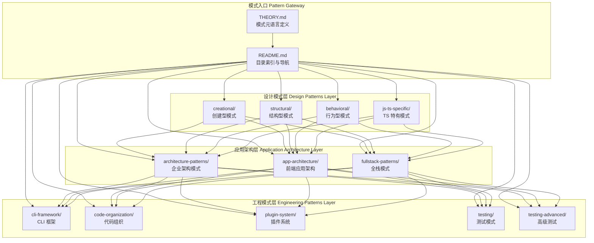
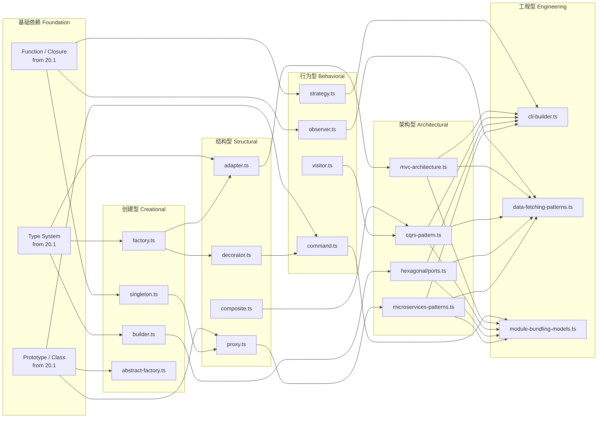
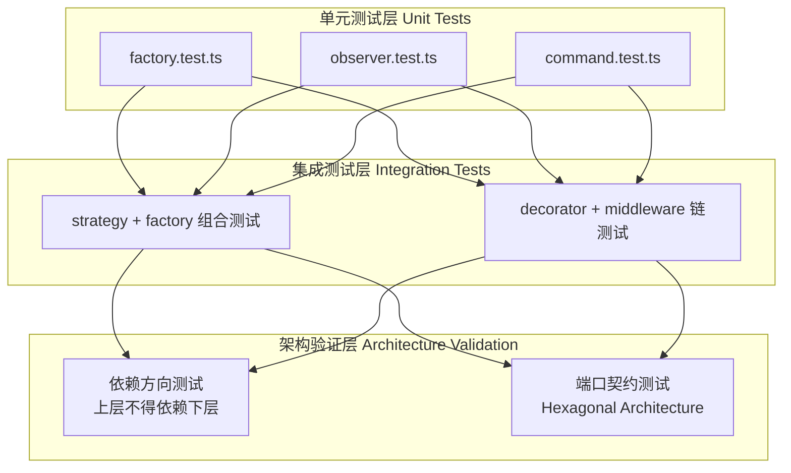
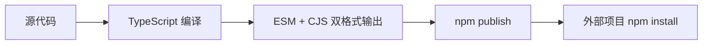

# 20.2 Language Patterns — Architecture Design / 语言模式实验室架构设计

> **定位**: `20-code-lab/20.2-language-patterns/`
> **定位 (EN)**: Language patterns lab — reusable solutions to recurring design problems in JS/TS.
> **关联**: `20.1-fundamentals-lab/` | `20.5-frontend-frameworks/` | `20.6-backend-apis/`

---

## 1. 架构概述 / Architecture Overview

本模块是连接**语言基础**（20.1）与**领域应用**（20.5/20.6）的**模式转换层**。它回答的核心问题是："在 JavaScript/TypeScript 的特定约束下，如何以 idiomatic 的方式表达经典设计模式与现代架构模式？"

This module serves as the **pattern transformation layer** bridging Language Fundamentals (20.1) and Domain Applications (20.5/20.6). It answers: "Given JS/TS's unique constraints, how do we express classic design patterns and modern architecture idiomatically?"

模块采用**"模式目录（Pattern Catalog）"**的元结构，将 GoF 23 种设计模式、企业架构模式、前端应用架构模式、CLI 框架模式等统一纳入一个可检索、可运行、可对比的知识框架。每个模式实例都是一个**最小可运行的垂直切片（Vertical Slice）**，包含完整的类型定义、实现代码、单元测试和适用场景说明。

The module adopts a **Pattern Catalog** meta-structure, unifying GoF's 23 design patterns, enterprise architecture patterns, frontend application patterns, and CLI framework patterns into a single searchable, runnable, and comparable knowledge framework.

---

## 2. 系统架构图 / System Architecture Diagram



---

## 3. 模块依赖图 / Module Dependency Map



---

## 4. 数据流描述 / Data Flow Description

本模块的数据流体现为**"问题 → 模式选择 → 实现 → 验证 → 演化"**的闭环。以下以前端应用架构中的数据获取模式为例：

The data flow manifests as a **"Problem → Pattern Selection → Implementation → Validation → Evolution"** closed loop.

### 4.1 模式应用数据流 / Pattern Application Data Flow

```
用户交互 / 系统事件
    ↓
[Router] 路由匹配与导航守卫
    ↓
[Data Fetching Pattern] 选择数据获取策略
    ├── SSR (服务端渲染): 服务器直取数据 → HTML 流式传输
    ├── CSR (客户端渲染): 挂载后客户端 fetch → 状态更新
    ├── SWR (状态重新验证): 缓存优先 → 后台更新
    └── RSC (React Server Component): 服务端组件直取 → 序列化传输
    ↓
[State Management] 状态归一化与派生
    ↓
[Component Tree] 响应式更新与渲染
    ↓
[DOM / VDOM] 最小化变更应用
```

### 4.2 CLI 框架数据流 / CLI Framework Data Flow

```
进程参数 (process.argv)
    ↓
[Argument Validator] 参数校验与类型转换
    ↓
[Command Parser] 命令路由与子命令分发
    ↓
[Config Loader] 配置文件合并（CLI 参数 > 环境变量 > 配置文件 > 默认值）
    ↓
[Interactive Prompt] 缺失参数的交互式补全
    ↓
[Middleware Chain] 日志、鉴权、遥测等横切关注点
    ↓
[Command Handler] 业务逻辑执行
    ↓
[Output Formatter] 结果格式化（JSON / Table / Tree / Progress）
```

### 4.3 CQRS + Event Sourcing 数据流 / CQRS + ES Data Flow

```
HTTP Request / Command
    ↓
[Command Handler] 验证与业务规则
    ↓
[Aggregate Root] 状态变更 → 生成 Domain Event
    ↓
[Event Store] 只追加事件日志 (Append-only)
    ↓
[Event Bus] 异步发布
    ↓
[Projection Handler] 构建物化视图 (Read Model)
    ↓
[Query Handler] 从 Read Model 查询
    ↓
HTTP Response / DTO
```

---

## 5. 关键设计决策与权衡 / Key Design Decisions and Trade-offs

### 5.1 决策矩阵 / Decision Matrix

| 决策 / Decision | 选择 / Choice | 理由 / Rationale | 代价 / Trade-off |
|----------------|--------------|-----------------|----------------|
| 模式分类法 | GoF 三分法 + JS/TS 特有模式 + 架构模式 | 兼顾经典与生态特色 | 分类边界偶有模糊 |
| 实现风格 | 类型安全优先（严格 TypeScript） | 展示 TS 的类型表达能力 | 部分实现较 JavaScript 冗长 |
| 框架依赖 | 模式骨架零框架，仅在 app-architecture 中使用框架概念代码 | 保证模式的通用性 | 无法直接复制粘贴到生产框架 |
| 测试深度 | 每个模式配对测试 + 集成场景测试 | 验证模式行为正确性 | 代码量翻倍 |
| 抽象层级 | 从类级模式到系统级架构全覆盖 | 满足不同层级学习需求 | 目录结构复杂 |
| 语言特性使用 | ES2022 + TS 5.4 全部特性 | 展示最现代的表达力 | 旧环境需转译 |

### 5.2 TypeScript 类型系统作为"模式强制器" / TypeScript as Pattern Enforcer

在经典动态语言中，设计模式的正确性依赖于**约定（convention）**和**开发者纪律**。TypeScript 的类型系统使我们能够将部分模式约束**编译期化**：

- **Builder 模式**: 通过 `this` 返回类型实现链式调用的类型安全
- **Strategy 模式**: `interface Strategy` 强制所有策略实现统一契约
- **Visitor 模式**: 利用 `Extract<Union, { kind: 'X' }>` 实现穷尽性检查
- **Result 类型**: 用 discriminated union 替代异常，强制调用方处理错误路径

### 5.3 为什么保留"反模式"讨论 / Why Include "Anti-patterns"

`testing-advanced/` 和部分 `app-architecture/` 文件不仅展示正确做法，还展示**常见误用**：

- 过度使用单例 → 测试困难、隐藏依赖
- 错误的 Context 使用 → React 中不必要的重渲染
- 上帝对象（God Object）→ 维护灾难

这种"正反对比"的架构设计显著提升了学习者的**模式识别能力**。

---

## 6. 技术栈 / Technology Stack

| 层级 / Layer | 技术 / Technology | 版本 / Version | 用途 / Purpose |
|-------------|------------------|---------------|---------------|
| 语言 / Language | TypeScript | ≥5.4 | 模式实现与类型约束 |
| 运行时 / Runtime | Node.js | ≥18 | 服务端模式执行 |
| 运行时 / Runtime | Deno | ≥1.40 | 现代模块与测试 |
| 前端概念 / Frontend Concepts | React / Vue / Svelte (类型定义) | 18+ / 3.4+ / 5+ | 应用架构模式演示 |
| 测试框架 / Testing | Vitest | ≥1.0 | 快速单元与集成测试 |
| 测试框架 / Testing | Deno Test | built-in | Deno 环境测试 |
| 代码质量 / Quality | ESLint + @typescript-eslint | ≥7.0 | 代码规范 |
| 类型检查 / Type Checking | tsc --noEmit | ≥5.4 | 编译期验证 |
| 文档 / Docs | Markdown + Mermaid | — | 架构图与说明 |

---

## 7. 测试策略 / Testing Strategy

### 7.1 测试架构 / Testing Architecture



### 7.2 测试分类 / Test Categories

| 测试类型 / Type | 目标 / Target | 示例 / Example |
|----------------|-------------|--------------|
| 模式行为测试 / Behavioral | 验证模式在运行时产生预期行为 | `singleton.test.ts` 验证唯一实例 |
| 类型级测试 / Type-level | 验证编译期类型约束 | `builder.test.ts` 中链式调用类型推断 |
| 组合测试 / Compositional | 验证多个模式协同工作 | `strategy + factory` 组合 |
| 反模式检测 / Anti-pattern | 验证错误用法被类型系统捕获 | 非法状态转换的编译错误 |
| 性能感知测试 / Performance-aware | 验证模式在大数据量下的表现 | `flyweight.test.ts` 内存对比 |

### 7.3 测试执行 / Test Execution

```bash
# 所有测试
npx vitest run

# 单一模式目录
npx vitest run design-patterns/creational

# 类型检查
npx tsc --noEmit

# Deno 环境
deno test --allow-all
```

---

## 8. 部署考量 / Deployment Considerations

### 8.1 作为库发布 / Publishing as a Library

本模块的部分子集（如 `design-patterns/` 中的通用实现）可打包为 npm 包供外部引用：



**构建设置**:
- `tsconfig.json`: `module: "NodeNext"`, `declaration: true`
- 输出目录: `dist/esm/` + `dist/cjs/`
- 入口映射: `exports` 字段指向类型定义与运行时

### 8.2 作为学习平台部署 / Deploying as Learning Platform

| 部署目标 / Target | 方案 / Solution | 触发方式 / Trigger |
|------------------|----------------|-------------------|
| 静态文档站点 | VitePress 构建 → GitHub Pages | push to main |
| 可交互 Playground | StackBlitz 项目模板 | 文档内嵌按钮 |
| CI 验证 | GitHub Actions 矩阵 | PR / nightly |
| npm 包 | Changesets 版本管理 | 手动 release |

### 8.3 运行时兼容性矩阵 / Runtime Compatibility Matrix

| 模式类别 / Category | Node.js | Deno | Bun | Browser |
|--------------------|---------|------|-----|---------|
| 创建型 / Creational | ✅ | ✅ | ✅ | ✅ |
| 结构型 / Structural | ✅ | ✅ | ✅ | ✅ |
| 行为型 / Behavioral | ✅ | ✅ | ✅ | ✅ |
| CLI 框架 / CLI | ✅ | ✅ | ✅ | ❌ |
| 前端架构 / Frontend Arch | ✅ (SSR) | ✅ | ✅ | ✅ |
| 全栈模式 / Fullstack | ✅ | ✅ | ✅ | 部分 |

### 8.4 容器化与边缘部署 / Containerization & Edge

```dockerfile
# 最小学习镜像
FROM denoland/deno:alpine
WORKDIR /app
COPY . .
RUN deno cache **/*.ts
CMD ["deno", "test", "--allow-all"]
```

边缘函数场景（如 Cloudflare Workers）中，部分模式需调整：
- **单例模式**: 在 Isolate 环境中天然单例，无需显式实现
- **状态模式**: 需外置到 KV / Durable Objects
- **观察者模式**: 跨 Isolate 需使用 Event Bus 替代内存事件

---

## 9. 质量属性 / Quality Attributes

| 属性 / Attribute | 实现机制 / Mechanism | 验证方式 / Verification |
|-----------------|---------------------|------------------------|
| **可组合性 Composability** | 模式间松耦合接口 | 随机组合两个模式，验证无冲突 |
| **可学习性 Learnability** | 单一职责文件 + 独立测试 | 新开发者 15 分钟理解一个模式 |
| **可移植性 Portability** | ESM 标准模块 | 跨运行时执行一致性 |
| **可验证性 Verifiability** | 100% 文件配对测试 | CI 全绿 |
| **可演化性 Evolvability** | 接口抽象 + 适配器模式 | 替换底层实现不影响上层 |

---

## 10. 参考与扩展 / References & Extensions

- [GoF — Design Patterns](https://en.wikipedia.org/wiki/Design_Patterns) — 经典设计模式原典
- [Refactoring Guru](https://refactoring.guru/design-patterns) — 可视化模式教程
- [Patterns.dev](https://www.patterns.dev/) — 现代 Web 模式集合
- [JavaScript Design Patterns (Addy Osmani)](https://addyosmani.com/resources/essentialjsdesignpatterns/book/) — JS 特有模式深度解析
- [Enterprise Integration Patterns](https://www.enterpriseintegrationpatterns.com/) — 企业集成模式
- [The Clean Architecture — Robert C. Martin](https://blog.cleancoder.com/uncle-bob/2012/08/13/the-clean-architecture.html) — 整洁架构
- [Hexagonal Architecture — Alistair Cockburn](https://alistair.cockburn.us/hexagonal-architecture/) — 六边形架构
- `20-code-lab/20.1-fundamentals-lab/` — 本模块的下层基础
- `20-code-lab/20.5-frontend-frameworks/` — 前端架构模式的具体应用
- `20-code-lab/20.6-backend-apis/` — 后端架构模式的具体应用

---

*本 ARCHITECTURE.md 遵循 JS/TS 全景知识库的文档规范。生成时间: 2026-05-01*
