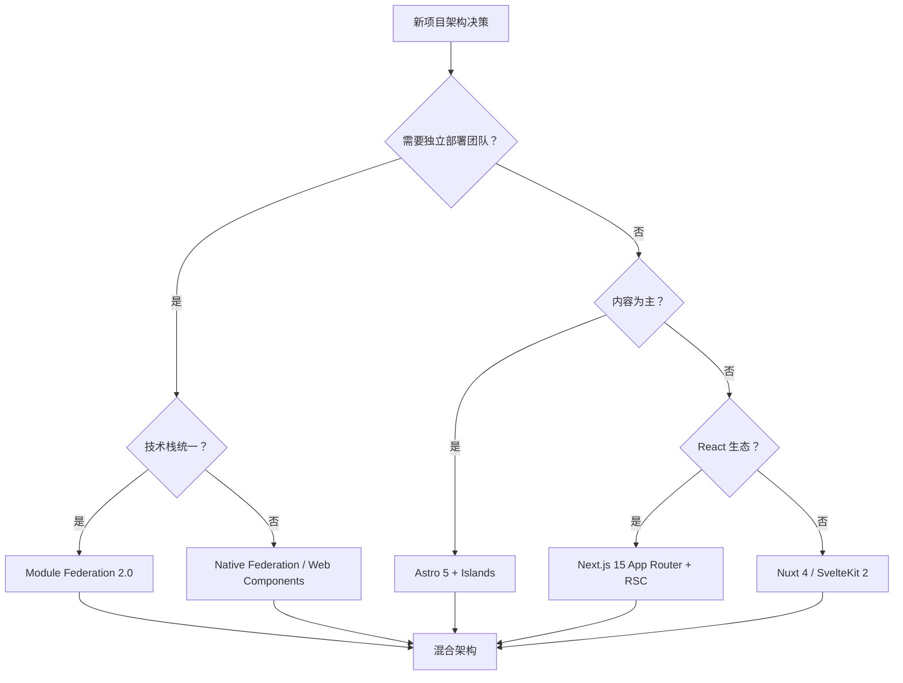

# 应用架构理论：从单体到微前端

> **目标读者**：前端架构师、技术负责人
> **对齐版本**：Module Federation 2.0 | Native Federation | React Server Components | Signals 架构
> **权威来源**：Module Federation 官方文档、Steve Kinney Enterprise UI 课程、Angular Dev Blog、Nunuqs 2026
> **版本**：2026-04

---

## 1. 前端架构演进

```
2010: 单体 jQuery
  ↓
2015: MVC (Backbone/Angular 1)
  ↓
2018: 组件化 (React/Vue)
  ↓
2020: 微前端 (qiankun/single-spa)
  ↓
2023: 模块联邦 (Module Federation 1.0)
  ↓
2025: MF 2.0 + Native Federation
  ↓
2026: 混合架构 (RSC + Islands + MF + AI Agent)
```

---

## 2. 架构模式

### 2.1 微前端方案对比（2026）

| 方案 | 集成方式 | 运行时 | 框架限制 | 2026 状态 |
|------|---------|--------|---------|----------|
| **qiankun** | 运行时沙箱 (JS Proxy) | 浏览器 | 无 | 国内主流，维护中 |
| **single-spa** | 生命周期管理 | 浏览器 | 无 | 生态广，企业级 |
| **Module Federation 2.0** | 运行时容器协议 | 编译器 + 运行时 | 需 bundler 支持 | **2026 企业标准** |
| **Native Federation** | 运行时 + Import Maps | 浏览器原生 | 无 | Angular 官方支持，跨 bundler |
| **Web Components** | 浏览器原生标准 | 浏览器 | 无 | 框架无关，但 DX 仍落后 |
| **iframe** | 浏览器隔离 | 浏览器 | 无 | 简单但体验差，仅特定场景 |

### 2.2 Module Federation 2.0 深度解析

Module Federation 是运行时代码共享模型，核心概念：**Host**（消费方）动态加载 **Remote**（提供方）的模块。

```typescript
// Host 配置
import { ModuleFederationPlugin } from '@module-federation/enhanced/webpack'

export default {
  plugins: [
    new ModuleFederationPlugin({
      name: 'shell',
      remotes: {
        marketing: 'marketing@https://marketing.app/mf-manifest.json',
        checkout: 'checkout@https://checkout.app/mf-manifest.json',
      },
      shared: {
        react: { singleton: true, requiredVersion: '^19.0.0' },
        'react-dom': { singleton: true },
      },
    }),
  ],
}

// 运行时消费
const { Banner } = await import('marketing/Banner')
```

**MF 2.0 关键升级**：

| 特性 | MF 1.0 | MF 2.0 |
|------|--------|--------|
| **共享策略** | version-first（启动加载所有 remote） | `shareStrategy`: `version-first` / `loaded-first` |
| **离线容错** | 启动失败即崩溃 | `loaded-first`：按需加载，离线 remote 不阻断启动 |
| **类型安全** | 无 | **mf-manifest.json**（manifest 文件）支持类型提取、预加载、DevTools |
| **共享作用域** | 单一 default | 多 `shareScope` 隔离不同依赖池 |
| **插件系统** | 有限 | 运行时插件：`errorLoadRemote` 回退、重试、鉴权 |

**版本协调最佳实践**：

```
共享依赖主版本对齐 → requiredVersion 表达范围 → singleton: true 去重
主版本升级 = 全系统协调变更（非单个团队独立操作）
```

> *"Treat a shared dependency major bump as a coordinated change across the whole federated system, not something one team does on a Thursday afternoon."* — Steve Kinney, 2026-03

**框架支持现状（2026）**：

| 框架 | MF 2.0 支持 | 备注 |
|------|-----------|------|
| **Webpack** | ✅ 原生 | 最成熟 |
| **Rspack** | ✅ 原生 | 字节跳动，Webpack API 兼容 |
| **Vite** | ✅ 插件 | 官方支持，部分 gap 待完善 |
| **Modern.js** | ✅ 官方 SSR 路径 | 字节跳动，MF + SSR 最完整 |
| **Next.js Pages** | ⚠️ 插件弃用中 | App Router **不支持** |
| **Angular** | ✅ Native Federation | esbuild / ApplicationBuilder 原生 |

### 2.3 Native Federation

由 Angular 团队 Manfred Steyer 发起的**与 bundler 无关**的联邦方案：

- 基于 **ECMAScript 模块** + **Import Maps**
- 编译时通过可交换适配器与不同 bundler 集成（esbuild、webpack、Vite）
- 运行时通过标准浏览器模块加载，无 bundler 锁定
- 支持 SSR 和 Hydration

```typescript
// 初始化联邦
import { initFederation } from '@angular-architects/native-federation'

initFederation('federation.manifest.json')
  .then(() => import('./bootstrap'))

// 加载远程模块
import { loadRemoteModule } from '@angular-architects/native-federation'

const routes: Routes = [
  {
    path: 'flights',
    loadChildren: () =>
      loadRemoteModule('mfe1', './Component').then(m => m.AppComponent),
  },
]
```

**MF vs Native Federation 选型**：

| 场景 | 推荐 |
|------|------|
| Webpack/Rspack 生态 | Module Federation 2.0 |
| 需要跨 bundler 迁移 | Native Federation |
| Angular 项目 | Native Federation（官方支持） |
| 需要 SSR + MF | Modern.js / Native Federation |
| 需要 manifest + 类型 + DevTools | Module Federation 2.0 |

---

## 3. 状态管理架构（2026 更新）

| 规模 | 方案 | 说明 | 2026 状态 |
|------|------|------|----------|
| 小型 | Context + useReducer | 内置，零依赖 | React 19 优化 |
| 中型 | **Zustand** / Valtio | 轻量、现代 | Zustand v5 支持 Signals |
| 大型 | Redux Toolkit / Pinia | 生态、DevTools | Redux 仍企业主流 |
| 跨应用 | **alien-signals** / Event Bus | 微前端通信 | Signals 成为跨框架标准 |
| 响应式原生 | **Jotai** / **Solid Signals** | 原子化 / 细粒度 | Jotai v2 + React 19 深度集成 |

### Signals 架构的崛起

2026 年，Signals 从 SolidJS 的专属特性演变为跨框架共享的基础架构：

| 框架 | Signals 实现 | 特点 |
|------|-------------|------|
| **SolidJS** | 原生 Signals | 创建者，最细粒度 |
| **Vue 3.5** | `shallowRef` + alien-signals | 50% 更快写入，260% 更快读取 |
| **Preact** | `@preact/signals` | 与 React 兼容 |
| **Angular 19** | `signal()` | 变更检测集成，Zoneless 模式 |
| **Svelte 5** | Runes (`$state`, `$derived`) | 编译时显式响应式 |
| **React** | `useSyncExternalStore` + 外部库 | React Compiler 1.0 自动 memo，减少手动需求 |

> **TC39 Signals 提案**（Stage 1）推动语言级标准化，alien-signals 成为框架无关的底层原语。

### Signals 基础用法示例

```typescript
// 使用 alien-signals（框架无关）
import { signal, computed, effect } from 'alien-signals';

const count = signal(0);
const doubled = computed(() => count() * 2);

// 自动追踪依赖，count 变化时执行
effect(() => {
  console.log(`count = ${count()}, doubled = ${doubled()}`);
});

count.set(5); // 输出: count = 5, doubled = 10

// 批量更新（避免中间状态触发多次 effect）
import { batch } from 'alien-signals';
batch(() => {
  count.set(10);
  // 此时 effect 尚未执行
});
// batch 结束后统一执行 effect
```

### Zustand + Signals 集成（2026 模式）

```typescript
// store.ts — Zustand v5 with Signals
import { create } from 'zustand';
import { subscribeWithSelector } from 'zustand/middleware';

interface BearState {
  bears: number;
  increase: () => void;
}

export const useBearStore = create<BearState>()(
  subscribeWithSelector((set) => ({
    bears: 0,
    increase: () => set((state) => ({ bears: state.bears + 1 })),
  }))
);

// 外部订阅（非 React 组件）
const unsub = useBearStore.subscribe(
  (state) => state.bears,
  (bears) => console.log('Bears changed:', bears)
);
```

---

## 4. 2026 混合架构模式

### 模式一：RSC + Islands + MF

```
┌─────────────────────────────────────────────┐
│              用户请求                         │
│                   │                         │
│  ┌────────────────┼────────────────┐        │
│  │                │                │        │
│  ▼                ▼                ▼        │
│ ┌─────┐      ┌────────┐      ┌─────────┐   │
│ │RSC  │      │Astro   │      │MF Remote│   │
│ │页面 │      │Island  │      │(独立部署)│   │
│ │骨架 │      │(交互组件)│      │(功能模块)│   │
│ └─────┘      └────────┘      └─────────┘   │
│   Next.js      Astro 5        Module Fed    │
│   App Router                                  │
└─────────────────────────────────────────────┘
```

- **RSC** 负责数据获取和首屏骨架
- **Astro Islands** 负责轻量交互（零 JS 默认）
- **Module Federation** 负责独立部署的功能模块（如支付、营销）

### React Server Component 数据获取模式

```typescript
// app/page.tsx — Next.js 15 App Router RSC
import { Suspense } from 'react';
import { ProductList } from './ProductList';
import { RecommendationSkeleton } from './RecommendationSkeleton';

// Server Component：直接在服务端获取数据，不打包到客户端 bundle
async function getProducts(): Promise<Product[]> {
  const res = await fetch('https://api.example.com/products', {
    next: { revalidate: 60 }, // ISR 缓存 60 秒
  });
  if (!res.ok) throw new Error('Failed to fetch products');
  return res.json();
}

export default async function Page() {
  const products = await getProducts(); // 服务端执行

  return (
    <main>
      <h1>Products</h1>
      <ProductList products={products} />

      {/* 流式传输：推荐内容延迟加载 */}
      <Suspense fallback={<RecommendationSkeleton />}>
        <Recommendations />
      </Suspense>
    </main>
  );
}

// 异步 Server Component
async function Recommendations() {
  const recommendations = await fetch(
    'https://api.example.com/recommendations',
    { cache: 'no-store' }
  ).then((r) => r.json());

  return <RecommendationCarousel items={recommendations} />;
}
```

### 模式二：AI Agent 嵌入架构

```
┌─────────────────────────────────────────────┐
│              前端应用 (React/Vue)             │
│                                             │
│  ┌─────────────┐    ┌──────────────────┐   │
│  │  UI 组件     │◀───│  AI Agent SDK     │   │
│  │  (人类界面)  │    │  (MCP Client)     │   │
│  └─────────────┘    └──────────────────┘   │
│         ▲                    │              │
│         │              ┌─────┴─────┐        │
│         │              │ MCP Server │        │
│         │              │ (工具/数据) │        │
│         │              └───────────┘        │
│         │                                     │
│  ┌──────┴──────┐                            │
│  │ 人类在环     │                            │
│  │ (审核/确认)  │                            │
│  └─────────────┘                            │
└─────────────────────────────────────────────┘
```

### MCP Client 集成示例

```typescript
// ai-agent/mcp-client.ts — Model Context Protocol 客户端
import { Client } from '@modelcontextprotocol/sdk/client/index.js';
import { StdioClientTransport } from '@modelcontextprotocol/sdk/client/stdio.js';

interface ToolCall {
  name: string;
  arguments: Record<string, unknown>;
}

class AgentClient {
  private client: Client;

  constructor() {
    this.client = new Client({ name: 'web-app-agent', version: '1.0.0' });
  }

  async connectToServer(command: string, args: string[]) {
    const transport = new StdioClientTransport({ command, args });
    await this.client.connect(transport);
  }

  async listTools() {
    return this.client.listTools();
  }

  async callTool<T = unknown>(call: ToolCall): Promise<T> {
    const result = await this.client.callTool({
      name: call.name,
      arguments: call.arguments,
    });
    return result.content as T;
  }

  // 典型 Agent 循环：LLM 决策 → 工具调用 → 结果反馈
  async agentLoop(userQuery: string, llm: LLMInterface) {
    const tools = await this.listTools();
    const response = await llm.chat({
      messages: [{ role: 'user', content: userQuery }],
      tools: tools.tools.map((t) => ({
        name: t.name,
        description: t.description,
        parameters: t.inputSchema,
      })),
    });

    if (response.toolCalls) {
      for (const tc of response.toolCalls) {
        const result = await this.callTool(tc);
        // 将工具结果反馈给 LLM 生成最终回答
        await llm.chat({
          messages: [
            { role: 'user', content: userQuery },
            { role: 'assistant', content: '', tool_calls: [tc] },
            { role: 'tool', tool_call_id: tc.id, content: JSON.stringify(result) },
          ],
        });
      }
    }
  }
}
```

---

## 5. 架构决策框架



---

## 6. 总结

前端架构的核心是**在一致性与自治之间找到平衡**。2026 年的趋势：

1. **Module Federation 2.0** 成为企业微前端标准，Native Federation 提供跨 bundler 替代
2. **Signals** 取代传统的中心化状态管理，成为响应式架构的基础原语
3. **RSC + Islands** 组合优化首屏性能，减少不必要的 JavaScript
4. **AI Agent** 作为新架构层，通过 MCP 协议嵌入现有应用

---

## 参考资源

- [Module Federation 官方文档](https://module-federation.io/)
- [Steve Kinney — Enterprise UI: Module Federation](https://stevekinney.com/courses/enterprise-ui/module-federation) (2026-03)
- [Angular Dev Blog — Native Federation](https://blog.angular.dev/micro-frontends-with-angular-and-native-federation-7623cfc5f413) (2025-02)
- [Nunuqs — Nuxt vs Next.js vs Astro vs SvelteKit 2026](https://www.nunuqs.com/blog/nuxt-vs-next-js-vs-astro-vs-sveltekit-2026-frontend-framework-showdown) (2025-12)
- [Micro-frontends: Module Federation's 2026 Blueprint](https://appsconcerebro.com/en/blog/micro-frontends-2026-module-federation-para-equipos-javascri) (2026-02)
- [React Server Components RFC](https://github.com/reactjs/rfcs/blob/main/text/0188-server-components.md) — 官方 RFC
- [Next.js App Router Documentation](https://nextjs.org/docs/app) — RSC 与流式传输
- [Astro Islands Architecture](https://docs.astro.build/en/concepts/islands/) — 零 JS 默认
- [SolidJS Signals](https://www.solidjs.com/tutorial/introduction_signals) — 细粒度响应式
- [TC39 Signals Proposal](https://github.com/tc39/proposal-signals) — 语言级 Signals Stage 1
- [alien-signals](https://github.com/stackblitz/alien-signals) — 框架无关 Signals 原语
- [Model Context Protocol](https://modelcontextprotocol.io/) — MCP 官方规范
- [Vercel AI SDK](https://sdk.vercel.ai/docs) — AI Agent 应用开发 SDK
- [Rspack Documentation](https://rspack.dev/) — 字节跳动 Webpack 兼容构建工具

---

## 模块代码文件索引

本模块包含以下可运行 TypeScript 代码文件，用于将上述理论概念转化为实践：

- `data-fetching-patterns.ts`
- `dependency-injection-models.ts`
- `index.ts`
- `llm-driven-architecture.ts`
- `module-bundling-models.ts`
- `mvc-derivatives.ts`
- `routing-navigation-models.ts`

> 💡 **学习建议**：阅读 THEORY.md 后，逐一运行上述代码文件，观察理论概念的实际行为。修改参数和边界条件，加深理解。

---

> 📅 理论深化更新：2026-04-29
