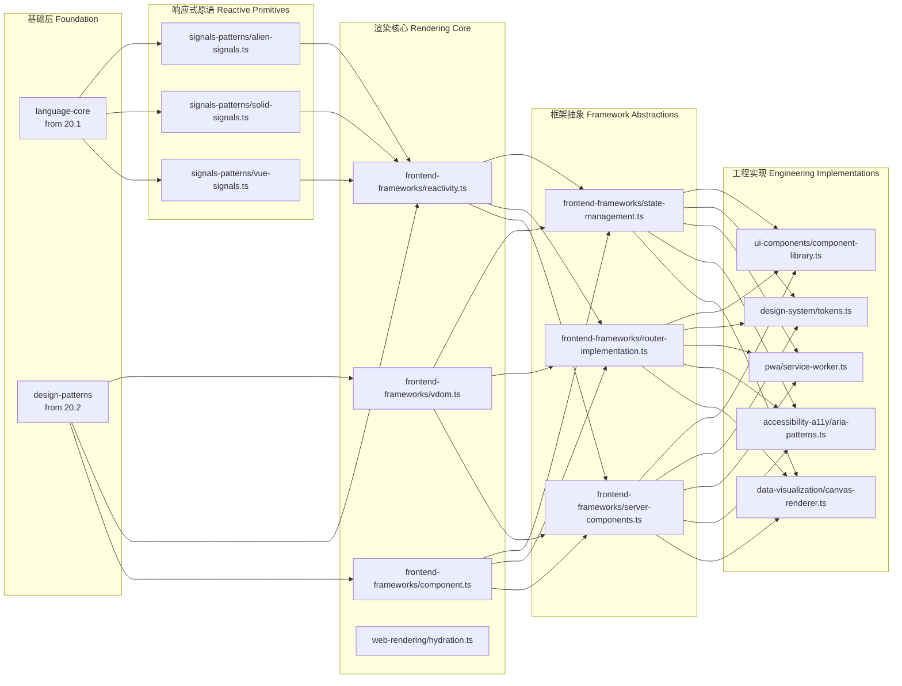
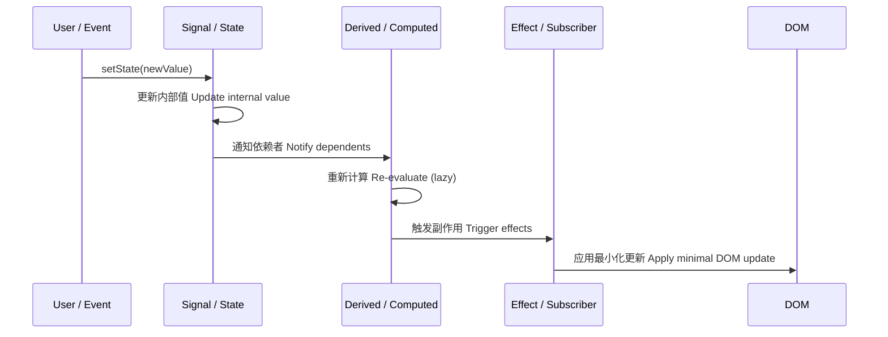
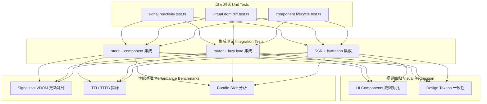
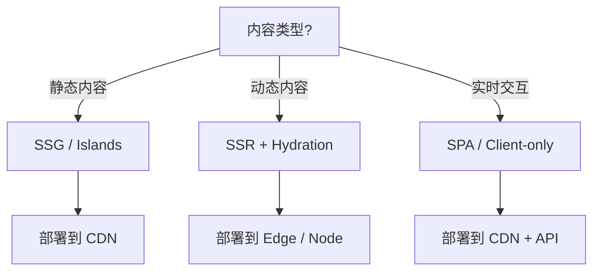

# 20.5 Frontend Frameworks — Architecture Design / 前端框架实验室架构设计

> **定位**: `20-code-lab/20.5-frontend-frameworks/`
> **定位 (EN)**: Frontend frameworks lab — reactive systems, rendering engines, and component architectures.
> **关联**: `20.1-fundamentals-lab/` | `20.2-language-patterns/` | `20.8-edge-serverless/`

---

## 1. 架构概述 / Architecture Overview

本模块是现代前端技术的**深度解剖实验室**，核心使命是揭示主流框架（React、Vue、Svelte、Angular 等）背后的通用原理，而非教授某框架的 API 使用。模块覆盖从底层响应式系统到上层元框架（Next.js、Nuxt、SvelteKit）的完整技术栈。

This module is a **deep-disssection laboratory** for modern frontend technology. Its core mission is to reveal the universal principles behind mainstream frameworks (React, Vue, Svelte, Angular), rather than teaching a specific framework's API usage.

架构采用**"渲染范式 × 框架实现"**的矩阵式组织：
- **纵向**: 虚拟 DOM、Signals、编译时优化、服务端渲染、群岛架构等渲染范式
- **横向**: React、Vue、Svelte、Solid、Angular 等框架的具体实现对比

The architecture adopts a **"Rendering Paradigm × Framework Implementation"** matrix organization.

---

## 2. 系统架构图 / System Architecture Diagram

```mermaid
graph TB
    subgraph 渲染范式层 Rendering Paradigms
        RP1[Virtual DOM<br/>Diff & Patch]
        RP2[Fine-Grained Signals<br/>Direct DOM Binding]
        RP3[Compiler-Driven<br/>Compile to DOM Updates]
        RP4[Server Components<br/>Server-First Rendering]
        RP5[Islands Architecture<br/>Partial Hydration]
    end

    subgraph 框架实现层 Framework Implementations
        F1[React 19<br/>Pull-based + Concurrent]
        F2[Vue 3.4<br/>Proxy Reactivity + Vapor]
        F3[Svelte 5<br/>Runes + Compile-time]
        F4[SolidJS<br/>Signals + No VDOM]
        F5[Angular 17+<br/>Signals + Zoneless]
    end

    subgraph 元框架层 Meta-Frameworks
        M1[Next.js 15<br/>App Router + RSC]
        M2[Nuxt 3<br/>Hybrid Rendering]
        M3[SvelteKit<br/>Adapters Pattern]
        M4[TanStack Start<br/>Full-stack TypeScript]
    end

    subgraph 支撑技术层 Supporting Technologies
        S1[signals-patterns/<br/>跨框架信号范式]
        S2[web-rendering/<br/>渲染管线]
        S3[pwa/<br/>渐进式 Web 应用]
        S4[design-system/<br/>设计系统]
        S5[ui-components/<br/>组件工程化]
        S6[accessibility-a11y/<br/>无障碍]
        S7[data-visualization/<br/>数据可视化]
        S8[lowcode-platform/<br/>低代码]
        S9[webxr/<br/>沉浸式 Web]
    end

    RP1 --> F1 & F2
    RP2 --> F4 & F2
    RP3 --> F3
    RP4 --> F1 & M1
    RP5 --> M2 & M3

    F1 --> M1
    F2 --> M2
    F3 --> M3
    F1 & F2 & F3 & F4 & F5 --> S1 & S2 & S3 & S4 & S5 & S6 & S7 & S8 & S9
```



---

## 3. 模块依赖图 / Module Dependency Map



---

## 4. 数据流描述 / Data Flow Description

### 4.1 响应式系统数据流 / Reactive System Data Flow



**细粒度 Signals 与虚拟 DOM 的差异**:
- **Signals (Solid/Vue Vapor)**: Signal 变更 → 直接触发绑定到具体 DOM 节点的更新函数 → 无 diff 开销
- **虚拟 DOM (React/Vue 传统)**: State 变更 → 重新执行组件函数 → 生成新 VDOM → Diff 算法对比 → 计算最小变更集 → 批量应用 DOM 操作
- **编译时 (Svelte)**: 编译器静态分析依赖关系 → 生成直接 DOM 操作指令 → 运行时仅执行原子更新

### 4.2 服务端渲染与水合数据流 / SSR & Hydration Data Flow

```
用户请求 (User Request)
    ↓
[Meta-Framework 路由层] 匹配路由 + 数据获取策略
    ↓
[Server Component] 服务端直接执行 → 访问数据库/API
    ↓
[RSC Payload] 序列化为特殊流格式（非 HTML）
    ↓
[HTML 流] 首字节时间 (TTFB) 优化，渐进式传输
    ↓
[浏览器接收] 解析 HTML + 内联 RSC 数据
    ↓
[水合 (Hydration)] 客户端 React/Vue 重建组件树 + 附加事件监听
    ↓
[交互就绪] 后续导航走客户端路由
```

### 4.3 群岛架构数据流 / Islands Architecture Data Flow

```
[Astro / Marko 构建时]
    静态内容 → 预渲染为 HTML
    交互组件 → 标记为 Island（含组件路径 + props）
    
[浏览器运行时]
    HTML 立即显示（无需 JS 即可阅读）
    ↓
  IntersectionObserver 检测 Island 进入视口
    ↓
  动态 import(hydrator) → 仅对该 Island 执行水合
    ↓
  Island 变为交互状态
```

---

## 5. 关键设计决策与权衡 / Key Design Decisions and Trade-offs

### 5.1 决策矩阵 / Decision Matrix

| 决策 / Decision | 选择 / Choice | 理由 / Rationale | 代价 / Trade-off |
|----------------|--------------|-----------------|----------------|
| 框架覆盖范围 | React / Vue / Svelte / Solid / Angular | 覆盖 >90% 市场份额 | 无法穷尽所有框架 |
| 实现深度 | 手写简化版框架内核（~200 行） | 揭示原理而非依赖黑盒 | 非生产级性能 |
| 渲染范式对比 | VDOM vs Signals vs Compiler 三轨并行 | 展示技术演进的权衡 | 学习曲线陡峭 |
| 元框架策略 | 概念代码 + 官方文档引用 | 避免版本快速过时 | 无法直接运行完整应用 |
| 类型安全 | 全模块 strict TypeScript | 展示类型驱动开发 | 配置复杂度 |
| 无障碍内建 | a11y 作为独立主题域 | 强调包容性设计 | 增加模块体积 |

### 5.2 响应式模型的权衡分析 / Reactive Model Trade-offs

| 维度 / Dimension | 虚拟 DOM (React) | Signals (Solid) | 编译时 (Svelte) |
|-----------------|-----------------|----------------|----------------|
| **运行时开销** | 中（diff 计算） | 极低（直接绑定） | 极低（预生成指令） |
| **内存占用** | 中（VDOM 树） | 低（仅订阅图） | 低（无运行时代理） |
| **包体积** | 中（~40KB） | 小（~7KB） | 小（编译后按需） |
| **调试难度** | 中（DevTools 成熟） | 高（依赖图复杂） | 高（映射到源码需 sourcemap） |
| **学习曲线** | 平缓 | 陡峭 | 平缓 |
| **跨框架复用** | 低（React 生态锁定） | 中（@preact/signals-core） | 低（Svelte 专用） |

### 5.3 服务端组件（RSC）的架构争议 / RSC Architectural Controversy

本模块对 RSC 持**批判性接纳**立场：
- **优势**: 零客户端 JS 体积、直接服务端数据访问、自动代码分割
- **代价**: 心智模型复杂度倍增、框架锁定、调试困难、生态分裂
- **适用边界**: 内容型站点优于交互密集型应用

---

## 6. 技术栈 / Technology Stack

| 层级 / Layer | 技术 / Technology | 版本 / Version | 用途 / Purpose |
|-------------|------------------|---------------|---------------|
| 类型系统 / Type System | TypeScript | ≥5.4 | 组件与状态类型 |
| 运行时 / Runtime | Node.js | ≥18 | SSR / SSG 演示 |
| 运行时 / Runtime | Deno | ≥1.40 | 现代模块支持 |
| 构建工具 / Bundler | Vite | ≥5.0 | 快速 HMR 演示 |
| 元框架 / Meta-Framework | Next.js (概念) | 15 | App Router + RSC |
| 元框架 / Meta-Framework | Nuxt (概念) | 3 | Vue 全栈方案 |
| 信号库 / Signals | alien-signals / @preact/signals-core | latest | 跨框架响应式原语 |
| 测试 / Testing | Vitest + @vue/test-utils + React Testing Library | latest | 组件测试 |
| 可视化 / Visualization | D3.js / Canvas API | latest | 数据可视化 |
| 无障碍 / A11y | axe-core | latest | 自动化可访问性测试 |
| WebXR | WebXR Device API | Spec | 沉浸式体验 |

---

## 7. 测试策略 / Testing Strategy

### 7.1 测试架构 / Testing Architecture



### 7.2 测试分类 / Test Categories

| 测试类型 / Type | 目标 / Target | 工具 / Tool |
|----------------|-------------|------------|
| 响应式测试 / Reactivity | 信号变更触发正确更新 | 自定义断言 + Vitest |
| VDOM Diff 测试 | 最小化变更集计算 | 单元测试 |
| 水合测试 / Hydration | SSR 输出与客户端状态一致 | Playwright |
| 可访问性测试 / a11y | WCAG 2.1 AA 合规 | axe-core + Vitest |
| 性能基准 / Benchmark | 帧率、内存、启动时间 | Benchmark.js |
| 类型测试 / Type Tests | 编译期类型推导验证 | tsd / expect-type |

---

## 8. 部署考量 / Deployment Considerations

### 8.1 渲染策略选择矩阵 / Rendering Strategy Selection Matrix



| 策略 / Strategy | 平台 / Platform | 适用场景 / Use Case |
|----------------|----------------|-------------------|
| SSG (Static Site Generation) | Vercel / Netlify / Cloudflare Pages | 博客、文档、营销页 |
| SSR (Server-Side Rendering) | Vercel / Node.js / Deno Deploy | 电商、社交平台 |
| ISR (Incremental Static Regeneration) | Vercel / Next.js | 新闻、内容站 |
| Edge SSR | Cloudflare Workers / Vercel Edge | 全球低延迟动态内容 |
| Islands | Astro on Deno Deploy | 内容为主 + 局部交互 |
| Client-only SPA | 任何静态托管 | 后台管理系统、SaaS |

### 8.2 Edge 部署的特殊考量 / Edge Deployment Considerations

前端框架在边缘运行时（V8 Isolate）中的约束：
- **无 Node.js API**: `fs`, `crypto` 需使用 Web 标准替代
- **冷启动敏感**: 包体积直接影响冷启动时间 → 优先编译时框架（Svelte）
- **内存限制**: 128MB-1GB → 避免大型虚拟 DOM 树常驻内存
- **Streams 优先**: 使用 `ReadableStream` 实现渐进式 SSR

### 8.3 CI/CD 流水线 / CI/CD Pipeline

```yaml
jobs:
  build:
    runs-on: ubuntu-latest
    steps:
      - uses: actions/checkout@v4
      - uses: actions/setup-node@v4
      - run: npm ci
      - run: npm run typecheck    # TypeScript 类型检查
      - run: npm run test:unit     # Vitest 单元测试
      - run: npm run test:a11y     # 无障碍测试
      - run: npm run build         # 生产构建
      - run: npm run analyze       # Bundle 分析
      - run: npm run test:e2e     # Playwright E2E
```

---

## 9. 质量属性 / Quality Attributes

| 属性 / Attribute | 机制 / Mechanism | 度量 / Metric |
|-----------------|-----------------|--------------|
| **首屏性能 FCP** | Islands + SSG | < 1.8s (Lighthouse) |
| **交互响应 INP** | Signals 细粒度更新 | < 200ms |
| **可访问性 Accessibility** | ARIA 模式 + 语义化 HTML | Lighthouse a11y = 100 |
| **包体积 Bundle Size** | Tree-shaking + 编译时优化 | < 50KB initial JS |
| **类型覆盖率 Type Coverage** | strict TypeScript | ≥ 95% |
| **跨浏览器兼容** | 渐进增强 | 最近 2 个主要版本 |

---

## 10. 参考与扩展 / References & Extensions

- [React Official Docs](https://react.dev/) — React 官方文档与架构说明
- [Vue.js Guide](https://vuejs.org/guide/introduction.html) — Vue 响应式系统深度解析
- [Svelte 5 Runes](https://svelte.dev/docs/runes) — 编译时响应式新范式
- [SolidJS Reactivity](https://docs.solidjs.com/concepts/intro-to-reactivity) — 细粒度响应式原典
- [Angular Signals](https://angular.dev/guide/signals) — Zoneless 变更检测
- [Next.js App Router](https://nextjs.org/docs/app) — RSC 与流式 SSR
- [Astro Islands](https://docs.astro.build/en/concepts/islands/) — 群岛架构
- [Web.dev — Core Web Vitals](https://web.dev/vitals/) — 性能指标权威指南
- [W3C WebXR](https://www.w3.org/TR/webxr/) — 沉浸式 Web 标准
- `20-code-lab/20.1-fundamentals-lab/` — 响应式系统的语言基础
- `20-code-lab/20.2-language-patterns/` — 组件设计模式
- `20-code-lab/20.8-edge-serverless/` — 边缘渲染部署

---

*本 ARCHITECTURE.md 遵循 JS/TS 全景知识库的文档规范。生成时间: 2026-05-01*
