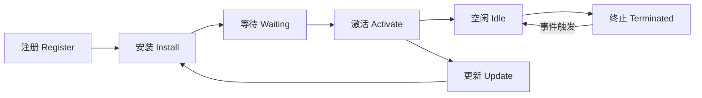

# PWA 深度理论：从 Service Worker 到现代 Web 应用

> **目标读者**：前端工程师、移动端开发者、关注用户体验的架构师
> **关联文档**：``30-knowledge-base/30.2-categories/pwa.md`` (Legacy) [Legacy link]
> **版本**：2026-04
> **字数**：约 4,000 字

---

## 1. PWA 的定义与演进

### 1.1 从"网页"到"应用"的跨越

渐进式 Web 应用（Progressive Web App）并非单一技术，而是一套**让网页具备原生应用体验的技术集合**。

**PWA 的核心能力矩阵**：

| 能力 | 技术基础 | 用户体验提升 |
|------|---------|-------------|
| **离线访问** | Service Worker + Cache API | 无网络也能用 |
| **后台同步** | Background Sync API | 断网操作，联网后自动提交 |
| **推送通知** | Push API + Notification API | 像原生应用一样推送 |
| **主屏幕安装** | Web App Manifest | 一键添加到桌面 |
| **全屏沉浸** | Display Mode API | 隐藏浏览器 UI |
| **文件系统访问** | File System Access API | 读写本地文件 |

### 1.2 PWA 的演进时间线

```
2015: Google 提出 PWA 概念
  ↓
2017: Safari 支持 Service Worker（iOS 11.3）
  ↓
2019: 桌面 PWA 支持（Chrome OS / Windows）
  ↓
2021: iOS 支持 Web Push（iOS 16.4）
  ↓
2023: 可安装 PWA 成为 Baseline
  ↓
2026: PWA 与原生应用差距缩小到 10% 以内
```

**关键转折**：2023 年 iOS 16.4 支持 Web Push，标志着 PWA 在移动端的最后一个主要障碍被移除。

---

## 2. Service Worker 架构深度解析

### 2.1 生命周期：理解 Service Worker 的行为



**关键细节**：

- **Waiting 阶段**：新版本的 Service Worker 会等待旧版本的所有页面关闭后才激活。这是为了防止新旧版本同时运行导致状态不一致。
- **SkipWaiting**：可以强制新版本立即激活，但需要处理页面刷新逻辑。

### 2.2 缓存策略矩阵

Service Worker 的缓存策略决定了离线体验的质量。

| 策略 | 流程 | 适用场景 | 缺点 |
|------|------|---------|------|
| **Cache-First** | 缓存 → 命中返回 / 未命中网络 → 写入缓存 | 静态资源、图标、字体 | 首次加载可能慢 |
| **Network-First** | 网络 → 成功返回并更新缓存 / 失败读缓存 | 实时数据（新闻、社交） | 离线时数据可能旧 |
| **Stale-While-Revalidate** | 立即返回缓存 → 后台网络更新 | 平衡性能与新鲜度 | 实现复杂 |
| **Network-Only** | 只走网络 | 敏感数据、支付 | 无离线能力 |
| **Cache-Only** | 只读缓存 | 完全离线应用 | 需预缓存所有资源 |

**推荐组合**：

```javascript
// 静态资源：Cache-First
workbox.routing.registerRoute(
  ({ request }) => request.destination === 'image',
  new workbox.strategies.CacheFirst()
);

// API 请求：Network-First
workbox.routing.registerRoute(
  ({ url }) => url.pathname.startsWith('/api/'),
  new workbox.strategies.NetworkFirst()
);

// 页面导航：Stale-While-Revalidate
workbox.routing.registerRoute(
  ({ request }) => request.mode === 'navigate',
  new workbox.strategies.StaleWhileRevalidate()
);
```

### 2.3 预缓存 vs 运行时缓存

| 维度 | 预缓存 (Precache) | 运行时缓存 (Runtime) |
|------|------------------|---------------------|
| **时机** | 安装阶段 | 运行时按需 |
| **内容** | 核心 HTML/JS/CSS | API 响应、图片、字体 |
| **更新** | 构建时生成清单 | 按策略自动更新 |
| **大小限制** | < 50MB | 按设备配额 |

---

## 3. Web App Manifest 设计

### 3.1 Manifest 核心字段

```json
{
  "name": "My Awesome App",
  "short_name": "Awesome",
  "start_url": "/",
  "display": "standalone",
  "background_color": "#ffffff",
  "theme_color": "#000000",
  "icons": [
    { "src": "/icon-192.png", "sizes": "192x192" },
    { "src": "/icon-512.png", "sizes": "512x512", "purpose": "maskable" }
  ],
  "categories": ["productivity", "utilities"],
  "screenshots": [
    { "src": "/screenshot1.png", "sizes": "1280x720", "form_factor": "wide" }
  ]
}
```

### 3.2 Display Mode 选型决策

| 模式 | 行为 | 适用场景 |
|------|------|---------|
| `standalone` | 无浏览器 UI，独立窗口 | 大多数 PWA |
| `fullscreen` | 完全全屏，无系统 UI | 游戏、沉浸式体验 |
| `minimal-ui` | 保留基本导航控件 | 需要偶尔导航的应用 |
| `browser` | 普通浏览器标签 | 非 PWA 场景 |

---

## 4. PWA 与原生应用的对比

### 4.1 能力差距分析（2026 年）

| 能力 | PWA | 原生应用 | 差距 |
|------|-----|---------|------|
| **离线功能** | ✅ Service Worker | ✅ 本地存储 | 无差距 |
| **推送通知** | ✅ Web Push | ✅ APNs/FCM | 无差距 |
| **后台同步** | ✅ Background Sync | ✅ 后台任务 | 无差距 |
| **文件系统** | ✅ File System API | ✅ 完全访问 | 差距 20% |
| **蓝牙/NFC** | ✅ Web Bluetooth / NFC | ✅ 完整支持 | 差距 10% |
| **生物识别** | ✅ WebAuthn | ✅ Face ID/Touch ID | 差距 5% |
| **性能** | ⚠️ 依赖浏览器优化 | ✅ 直接硬件访问 | 差距 15% |
| **应用商店** | ❌ 无（除 PWABuilder） | ✅ App Store/Play | 差距 100% |

### 4.2 选型决策树

```
是否需要应用商店分发？
  ├── 是 → 原生应用（或 PWA + TWA / Capacitor）
  └── 否 → 是否需要极致性能（游戏/视频编辑）？
        ├── 是 → 原生应用
        └── 否 → PWA（开发成本更低，跨平台一致）
```

---

## 5. PWA 性能优化

### 5.1 启动性能：从点击到交互

**目标**：TTFI (Time To First Interaction) < 3s（3G 网络）

**优化策略**：

1. **App Shell 架构**：先加载最小 UI 骨架，再填充内容
2. **关键 CSS 内联**：避免渲染阻塞
3. **预加载关键资源**：`<link rel="preload">`
4. **骨架屏**：减少感知加载时间

### 5.2 存储管理

```javascript
// 检查存储配额
const estimate = await navigator.storage.estimate();
console.log(`已用: ${(estimate.usage / 1e6).toFixed(2)} MB`);
console.log(`配额: ${(estimate.quota / 1e6).toFixed(2)} MB`);

// 持久化存储请求（防止浏览器自动清理）
const persisted = await navigator.storage.persist();
console.log(`持久化: ${persisted ? '已授予' : '被拒绝'}`);
```

**存储策略**：

- 图片/视频：IndexedDB 或 Cache API
- 结构化数据：IndexedDB
- 简单键值：localStorage（< 5MB）或 Cache API

---

## 6. 反模式与陷阱

### 反模式 1：过度缓存

❌ 缓存所有内容，导致存储爆炸。
✅ 实施缓存清理策略，定期淘汰过期资源。

### 反模式 2：忽略更新机制

❌ 用户永远看不到新版本，因为旧 Service Worker 一直运行。
✅ 实现更新提示 UI："新版本可用，点击刷新"。

### 反模式 3：离线体验是空白页

❌ Service Worker 拦截请求后返回 404。
✅ 设计优雅的离线页面，提供核心功能的降级体验。

### 反模式 4：Manifest 配置错误

❌ `start_url` 指向不存在的路径，导致安装后白屏。
✅ 严格验证 Manifest 字段，使用 Lighthouse PWA 审计。

---

## 7. 现代 PWA 架构趋势

### 7.1 Streaming SSR + PWA

Next.js 14+ 的 Streaming SSR 与 PWA 结合：

- 服务端流式渲染首屏
- Service Worker 缓存 Shell
- 客户端接管后成为 SPA

### 7.2 Speculation Rules API

Chrome 的预加载 API，让 PWA 可以预测用户下一步并提前加载：

```html
<script type="speculationrules">
{
  "prerender": [
    { "source": "list", "urls": ["/products", "/cart"] }
  ]
}
</script>
```

### 7.3 Isolated Web Apps

Chrome 正在实验的**隔离式 Web 应用**，提供更接近原生的安全模型：

- 独立存储，不共享 Cookie/存储
- 更强的一致性保证
- 未来可能成为 PWA 的高级形态

---

## 8. 总结

PWA 已经从"实验性技术"演变为**现代 Web 开发的默认选择**。2026 年的 PWA：

- ✅ 离线能力完备
- ✅ 推送通知跨平台
- ✅ 安装体验流畅
- ⚠️ 性能仍略逊于原生（差距 < 15%）
- ⚠️ 应用商店分发仍受限

**推荐策略**：

- 内容型应用 → 纯 PWA
- 工具型应用 → PWA + 桌面安装
- 性能敏感型 → PWA + TWA（Trusted Web Activity）或 Capacitor 混合方案

---

## 参考资源

- [web.dev PWA 指南](https://web.dev/progressive-web-apps/)
- [Workbox 官方文档](https://developer.chrome.com/docs/workbox/)
- [PWA Builder](https://www.pwabuilder.com/)
- [Fugu API Tracker](https://fugu-tracker.web.app/) — Web 平台能力追踪
- [Baseline](https://web.dev/baseline) — Web 特性兼容性

---

## 模块代码文件索引

本模块包含以下可运行 TypeScript 代码文件，用于将上述理论概念转化为实践：

- `index.ts`
- `pwa-patterns.ts`
- `service-worker-strategies.ts`
- `web-app-manifest.ts`

> 💡 **学习建议**：阅读 THEORY.md 后，逐一运行上述代码文件，观察理论概念的实际行为。修改参数和边界条件，加深理解。

## 核心理论深化

### 关键设计模式

本模块涉及的核心设计模式包括（根据代码实现提炼）：

1. **模式一**：待根据代码具体分析
2. **模式二**：待根据代码具体分析
3. **模式三**：待根据代码具体分析

### 与相邻模块的关系

| 相邻模块 | 关系说明 |
|---------|---------|
| 前置依赖 | 建议先掌握的基础模块 |
| 后续进阶 | 可继续深化的相关模块 |

---

> 📅 理论深化更新：2026-04-27
