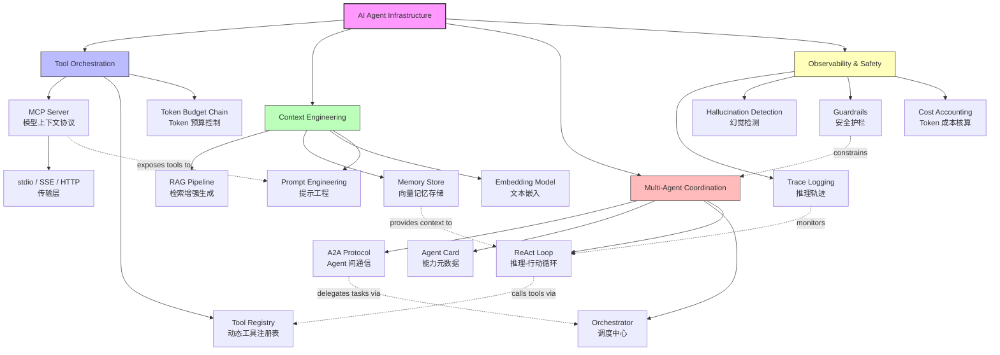

# AI Agent 基础设施 — 模块架构

> **Module**: `20-code-lab/20.7-ai-agent-infra/`
> **Position**: Advanced Level — AI-Native Application Infrastructure
> **Learning Path**: Fundamentals → Language Patterns → Concurrency → Frontend/Backend → **AI Agent Infra** → Edge & Observability

---

## 1. System Overview / 系统概述

本模块是 JS/TS 全景知识库中面向 **AI-Native 应用开发** 的核心代码实验室。随着大语言模型（LLM）从"玩具"演进为"生产基础设施"，开发者需要一套系统化的方法论来构建可靠的 AI Agent 系统。本模块解决的核心问题是：**如何可靠地将 LLM 的推理能力转化为可执行的动作序列，同时保证可观测性、安全性和可回滚性**。

This module serves as the core code laboratory for **AI-Native application development** within the JS/TS panoramic knowledge base. As Large Language Models (LLMs) evolve from "toys" to "production infrastructure," developers need a systematic methodology to build reliable AI Agent systems. The central problem this module addresses is: **how to reliably translate LLM reasoning capabilities into executable action sequences while ensuring observability, safety, and rollback capability**.

模块覆盖四大关键子域：

1. **Tool Orchestration（工具编排）**：模型到工具的调用链管理，含参数校验、超时控制、错误恢复
2. **Context Engineering（上下文工程）**：长上下文窗口下的信息压缩、检索增强（RAG）与记忆管理
3. **Multi-Agent Coordination（多 Agent 协作）**：Agent 间的任务分解、结果聚合与冲突解决
4. **Observability（可观测性）**：推理轨迹追踪、Token 成本核算、幻觉检测

从学习路径角度，本模块位于 **L2 高级代码实验室** 的 AI 专项分支。它假设学习者已掌握 TypeScript 基础、异步编程模式、API 设计原则，并准备进入 AI 驱动的应用架构领域。完成本模块后，学习者将能够独立设计 MCP Server、实现 A2A 协议通信、构建多 Agent 协作系统，并理解 AI 安全护栏的设计原则。

---

## 2. Module Structure / 模块结构

```
20.7-ai-agent-infra/
├── README.md                    # 目录索引（自动生成）
├── THEORY.md                    # 核心理论：MCP/A2A 协议对比、架构权衡
├── ARCHITECTURE.md              # 本文件：模块架构与学习导航
│
├── ai-agent-lab/                # AI Agent 核心实验室
│   ├── index.ts
│   ├── agent-coordination.ts + .test.ts      # 多 Agent 协调编排
│   ├── agent-memory.ts + .test.ts            # 向量记忆与检索
│   ├── mcp-server-demo.ts                    # MCP Server 最小实现
│   ├── multi-agent-workflow.ts               # 工作流状态机
│   ├── tool-registry.ts + .test.ts           # 动态工具注册表
│   ├── vercel-ai-sdk-tool-calling.ts         # Vercel AI SDK 集成
│   ├── README.md, THEORY.md, ARCHITECTURE.md
│   └── _MIGRATED_FROM.md
│
├── ai-integration/              # LLM 集成与流式处理
│   ├── index.ts
│   ├── ai-sdk-patterns.ts + .test.ts         # AI SDK 设计模式
│   ├── embedding-pipeline.ts + .test.ts      # 嵌入向量流水线
│   ├── llm-gateway.ts + .test.ts             # LLM 路由网关
│   ├── prompt-engineering.ts + .test.ts      # 提示工程框架
│   ├── streaming-handler.ts + .test.ts       # SSE 流式解析
│   ├── README.md, THEORY.md, ARCHITECTURE.md
│   └── _MIGRATED_FROM.md
│
├── mcp-protocol/                # Model Context Protocol 专项
│   ├── README.md, THEORY.md
│   └── (MCP Server 实现规范)
│
├── a2a-protocol/                # Google A2A 协议专项
│   ├── README.md, THEORY.md
│   └── (Agent-to-Agent 通信规范)
│
├── agent-patterns/              # Agent 设计模式
│   └── (README.md, THEORY.md)
│
├── autonomous-systems/          # 自治系统与行为树
│   ├── index.ts
│   ├── autonomous-agents.ts + .test.ts       # 自治 Agent 循环
│   ├── bdi-agent.ts + .test.ts               # BDI 信念-愿望-意图模型
│   ├── behavior-tree.ts + .test.ts           # 行为树实现
│   ├── feedback-controller.ts + .test.ts     # 反馈控制回路
│   ├── rule-based-agent.ts + .test.ts        # 规则引擎 Agent
│   ├── sense-plan-act.ts + .test.ts          # SPA 机器人架构
│   ├── task-scheduler.ts + .test.ts          # 任务调度器
│   ├── README.md, THEORY.md
│   └── _MIGRATED_FROM.md
│
├── ai-testing/                  # AI 系统测试策略
│   ├── index.ts
│   ├── ai-test-generator.ts + .test.ts       # AI 辅助测试生成
│   ├── coverage-calculator.ts + .test.ts     # 覆盖率计算
│   ├── fuzzing-generator.ts + .test.ts       # 模糊测试生成器
│   ├── llm-as-judge.ts + .test.ts            # LLM 评判模式
│   ├── mutation-testing.ts + .test.ts        # 变异测试
│   ├── property-based-generator.ts + .test.ts # 基于属性的生成
│   ├── smart-test-selector.ts + .test.ts     # 智能测试选择
│   ├── visual-regression.ts + .test.ts       # 视觉回归
│   ├── README.md, THEORY.md
│   └── _MIGRATED_FROM.md
│
├── code-generation/             # AI 代码生成与 AST 变换
│   ├── index.ts
│   ├── ai-code-generator.ts + .test.ts       # AI 代码生成器
│   ├── ast-transformer.ts + .test.ts         # AST 变换引擎
│   ├── openapi-client-gen.ts + .test.ts      # OpenAPI 客户端生成
│   ├── template-engine.ts + .test.ts         # 模板引擎
│   ├── ai-assisted-workflow/                 # AI 辅助工作流
│   │   ├── cursor-workflow.ts
│   │   ├── claude-code-patterns.ts
│   │   ├── github-copilot-patterns.ts
│   │   ├── ai-testing-generation.ts
│   │   └── prompt-engineering-guide.md
│   ├── README.md, THEORY.md
│   └── _MIGRATED_FROM.md
│
├── ml-engineering/              # 机器学习工程基础
│   ├── index.ts
│   ├── feature-scaler.ts + .test.ts          # 特征缩放
│   ├── feature-store.ts + .test.ts           # 特征存储
│   ├── linear-regression.ts + .test.ts       # 线性回归
│   ├── ml-pipeline.ts + .test.ts             # ML 流水线
│   ├── model-serialization.ts + .test.ts     # 模型序列化
│   ├── model-serving.ts + .test.ts           # 模型服务化
│   ├── simple-neural-network.ts + .test.ts   # 简单神经网络
│   ├── tensor-ops.ts + .test.ts              # 张量运算
│   ├── README.md, THEORY.md
│   └── _MIGRATED_FROM.md
│
└── nlp-engineering/             # 自然语言处理工程
    ├── index.ts
    ├── bpe-tokenizer.ts + .test.ts           # BPE 分词器
    ├── named-entity-recognizer.ts + .test.ts # 命名实体识别
    ├── nlp-pipeline.ts + .test.ts            # NLP 流水线
    ├── semantic-search.ts + .test.ts         # 语义搜索
    ├── sentiment-analyzer.ts + .test.ts      # 情感分析
    ├── text-classifier.ts + .test.ts         # 文本分类
    ├── text-preprocessor.ts + .test.ts       # 文本预处理
    ├── tfidf-vectorizer.ts + .test.ts        # TF-IDF 向量化
    ├── word-embedding.ts + .test.ts          # 词嵌入
    ├── README.md, THEORY.md
    └── _MIGRATED_FROM.md
```

每个子目录遵循统一的文件组织约定：
- `index.ts` — 子模块的统一出口，聚合所有公开 API
- `<topic>.ts` — 核心实现文件，包含可运行的 TypeScript 代码
- `<topic>.test.ts` — 配套的 Vitest 测试文件，验证实现正确性
- `README.md` — 子模块概述与快速开始指南
- `THEORY.md` — 该子模块的理论背景、设计权衡与形式化定义
- `ARCHITECTURE.md` — 子模块自身的架构文档（在 ai-agent-lab、ai-integration 等关键子模块中已存在）
- `CATEGORY.md` — 内容分类元数据
- `_MIGRATED_FROM.md` — 迁移溯源信息

---

## 3. Key Concepts Map / 关键概念地图



**概念关系说明 / Concept Relationships**:

- **MCP Server** (`mcp-protocol/`) 是工具生态的开放标准，允许任何模型安全地调用外部工具。它向上暴露标准化接口，向下封装具体的 API 调用逻辑。
- **A2A Protocol** (`a2a-protocol/`) 解决 Agent 之间的互操作性问题。通过 Agent Card 元数据，实现能力的动态发现与任务委托。
- **Agent Memory** (`ai-agent-lab/agent-memory.ts`) 使用向量嵌入和余弦相似度实现长期记忆的存储与检索，是上下文工程的核心组件。
- **ReAct Loop** (`ai-agent-lab/`) 将推理（Reasoning）与行动（Acting）交错执行，每个步骤产生可被观测的轨迹，极大提升了复杂任务的可解释性。
- **Tool Registry + Orchestrator** 构成了 Agent 系统的"神经系统"——前者管理可执行工具的目录，后者根据意图路由到正确的处理者（本地工具或其他 Agent）。

---

## 4. Learning Progression / 学习 progression

本模块采用 **分层递进 + 专项深入** 的学习路径设计。建议按以下顺序学习：

### Phase 1: 协议基础（Protocol Foundations）— 约 4-6 小时
1. 阅读 `THEORY.md` 了解 MCP / A2A / Function Calling 的架构对比
2. 运行 `mcp-protocol/` 下的示例，理解 stdio/SSE 传输机制
3. 阅读 `a2a-protocol/THEORY.md`，掌握 Agent Card 与 Task 生命周期
4. 动手实现 `ai-agent-lab/mcp-server-demo.ts` 中的最小 MCP Server

### Phase 2: 核心 Agent 能力（Core Agent Capabilities）— 约 8-10 小时
1. `ai-agent-lab/tool-registry.ts` — 理解动态工具注册与版本控制
2. `ai-agent-lab/agent-memory.ts` — 实现向量检索记忆系统
3. `ai-integration/streaming-handler.ts` — 掌握 SSE 流式响应解析
4. `ai-integration/prompt-engineering.ts` — 学习结构化提示设计
5. `ai-integration/llm-gateway.ts` — 理解多模型路由与降级策略

### Phase 3: 高级编排（Advanced Orchestration）— 约 6-8 小时
1. `ai-agent-lab/agent-coordination.ts` — 多 Agent 任务分解与结果聚合
2. `ai-agent-lab/multi-agent-workflow.ts` — 状态机驱动的工作流编排
3. `autonomous-systems/behavior-tree.ts` — 行为树在游戏 AI 中的应用
4. `autonomous-systems/sense-plan-act.ts` — 经典机器人架构的 TS 实现

### Phase 4: 质量保障（Quality Assurance）— 约 4-6 小时
1. `ai-testing/llm-as-judge.ts` — 使用 LLM 评估输出质量
2. `ai-testing/property-based-generator.ts` — 基于属性的 AI 输出测试
3. `ai-testing/mutation-testing.ts` — 变异测试发现脆弱点
4. `code-generation/ast-transformer.ts` — AI 生成代码的静态分析

### Phase 5: 领域深入（Domain Deep Dives）— 约 6-10 小时（选学）
- **ML 方向**: `ml-engineering/` 下的 tensor-ops → linear-regression → simple-neural-network → model-serving
- **NLP 方向**: `nlp-engineering/` 下的 text-preprocessor → bpe-tokenizer → word-embedding → semantic-search
- **代码生成方向**: `code-generation/` 下的 template-engine → openapi-client-gen → ai-assisted-workflow

---

## 5. Prerequisites & Dependencies / 先决条件与依赖

### 5.1 知识先决条件

| 先决知识 | 重要性 | 对应模块 |
|---------|--------|---------|
| TypeScript 高级类型（泛型、条件类型、映射类型） | ⭐⭐⭐ 必需 | `10.2-type-system/` |
| 异步编程（Promise、AsyncIterator、AbortController） | ⭐⭐⭐ 必需 | `20.3-concurrency-async/` |
| HTTP API 设计（REST、JSON-RPC、SSE） | ⭐⭐⭐ 必需 | `20.6-backend-apis/` |
| 向量与线性代数基础 | ⭐⭐ 推荐 | `20.4-data-algorithms/` |
| 软件测试基础（单元测试、Mock、覆盖率） | ⭐⭐ 推荐 | `20.1-fundamentals-lab/` |
| LLM 基础概念（Transformer、Token、Embedding） | ⭐⭐ 推荐 | `30-knowledge-base/` |

### 5.2 外部依赖

- **Node.js 18+** 或 **Bun 1.0+** 或 **Deno 1.40+**
- `@modelcontextprotocol/sdk` — MCP 协议官方 SDK
- `ai` / `@ai-sdk/openai` — Vercel AI SDK
- `zod` — 结构化输出校验
- `vitest` — 测试运行器

### 5.3 模块间依赖关系

```
20.7-ai-agent-infra
├── depends on: 20.3-concurrency-async (异步模式)
├── depends on: 20.6-backend-apis (API 设计)
├── connects to: 20.8-edge-serverless (边缘部署 Agent)
├── connects to: 20.9-observability-security (Agent 可观测性)
├── connects to: 20.13-edge-databases (Agent 记忆持久化)
└── feeds into: 50.6-ai-agent (生态示例)
```

---

## 6. Exercise Design Philosophy / 练习设计哲学

本模块的练习遵循 **"理论 → 最小实现 → 集成 → 真实场景"** 的四阶递进模型：

### 6.1 渐进式难度曲线

| 阶段 | 特征 | 示例 |
|------|------|------|
| **Level 1: 概念验证** | 单一文件、无外部依赖、纯逻辑 | `mcp-server-demo.ts` — 硬编码天气工具 |
| **Level 2: 协议集成** | 引入官方 SDK、标准接口 | `tool-registry.ts` — 动态注册 + Schema 校验 |
| **Level 3: 系统组装** | 多组件协作、状态管理 | `multi-agent-workflow.ts` — 状态机 + 任务委托 |
| **Level 4: 生产模拟** | 错误注入、性能约束、安全护栏 | `llm-gateway.ts` — 路由 + 降级 + 限流 |

### 6.2 真实世界场景锚定

每个练习都锚定一个真实生产场景：
- **MCP Server Demo** → 企业内部工具平台（如查询 Jira、GitHub、内部文档）
- **Agent Memory** → 客服机器人需要记住用户历史对话
- **LLM Gateway** → 多模型负载均衡（OpenAI + Anthropic + 本地模型）
- **Multi-Agent Workflow** → 软件研发团队中"架构师 Agent → 开发者 Agent → 测试 Agent"的协作

### 6.3 测试驱动设计

每个 `.ts` 实现文件都有对应的 `.test.ts`：
- **单元测试** 验证核心算法的正确性（如向量相似度计算）
- **集成测试** 验证协议交互的合规性（如 MCP 请求/响应格式）
- **混沌测试** 在 `chaos-engineering/` 风格下模拟网络超时、模型幻觉等异常

### 6.4 反模式警示

`THEORY.md` 和代码注释中明确标注了常见误区：
- ❌ "AI Agent 很简单无需学习" → 深入理解能避免隐蔽 bug 和性能陷阱
- ❌ "所有场景都需要多 Agent" → 简单任务单 Agent + 工具链足够，过度拆分增加延迟
- ❌ "Agent 越自治越好" → 自治性提升的同时需配套安全护栏（guardrails）与人工审核点

---

## 7. Extension Points / 扩展点

完成本模块后，学习者可以在以下方向深入探索：

### 7.1 架构扩展方向

1. **边缘部署** → `20.8-edge-serverless/` + `20.13-edge-databases/`
   - 将 Agent 推理下沉到 Cloudflare Workers / Deno Deploy
   - 使用 D1 / Turso 实现边缘记忆持久化

2. **可观测性增强** → `20.9-observability-security/`
   - 使用 OpenTelemetry 追踪 Agent 推理链路
   - 实现 Token 成本的实时仪表盘

3. **形式化验证** → `20.10-formal-verification/`
   - 使用 TLA+ 验证多 Agent 状态机的安全性与活性
   - 对关键工具函数应用 Hoare Logic 证明正确性

4. **Rust 工具链** → `20.11-rust-toolchain/`
   - 使用 napi-rs 将性能敏感的向量计算下沉到 Rust
   - 使用 WASM 在浏览器中运行本地 Embedding 模型

### 7.2 生态实践方向

5. **AI 辅助开发工作流** → `code-generation/ai-assisted-workflow/`
   - 研究 Cursor、Claude Code、GitHub Copilot 的最佳实践模式
   - 构建团队内部的 AI 代码审查 Agent

6. **垂直领域 Agent**
   - **DevOps Agent**: 自动化部署、监控告警响应
   - **数据分析 Agent**: 自然语言查询 → SQL → 可视化图表
   - **安全审计 Agent**: 代码依赖扫描、漏洞修复建议

### 7.3 学术研究方向

7. **多 Agent 系统理论**
   - 阅读 Microsoft Research 的 "Compound AI Systems"
   - 探索 Anthropic 的 "Building Effective Agents"

8. **LLM 安全与对齐**
   - 深入了解 OWASP LLM Top 10
   - 研究 NIST AI Risk Management Framework

---

## 附录：快速参考

| 子模块 | 核心技能 | 估计学习时长 | 难度 |
|--------|---------|------------|------|
| `mcp-protocol/` | MCP 协议理解与 Server 实现 | 2h | ⭐⭐ |
| `a2a-protocol/` | A2A 协议与 Agent 发现 | 2h | ⭐⭐⭐ |
| `ai-agent-lab/` | Agent 核心能力（记忆、协调、工具） | 8h | ⭐⭐⭐⭐ |
| `ai-integration/` | LLM 集成与流式处理 | 6h | ⭐⭐⭐ |
| `autonomous-systems/` | 自治系统架构 | 4h | ⭐⭐⭐⭐ |
| `ai-testing/` | AI 系统测试策略 | 4h | ⭐⭐⭐ |
| `code-generation/` | AI 代码生成与 AST | 4h | ⭐⭐⭐ |
| `ml-engineering/` | ML 工程基础 | 6h | ⭐⭐⭐⭐ |
| `nlp-engineering/` | NLP 工程基础 | 6h | ⭐⭐⭐ |

---

*本 ARCHITECTURE.md 遵循 JS/TS 全景知识库的模块架构规范。*
*最后更新: 2026-05-01*
