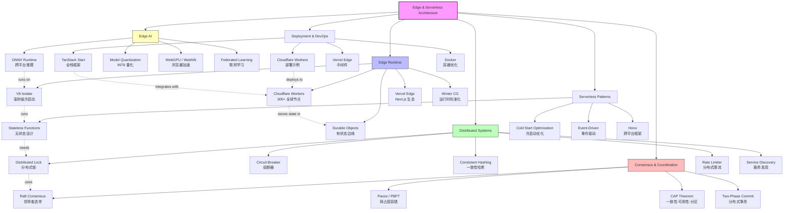

# 边缘与 Serverless — 模块架构

> **Module**: `20-code-lab/20.8-edge-serverless/`
> **Position**: Advanced Level — Edge-First & Serverless Architecture
> **Learning Path**: Fundamentals → Language Patterns → Concurrency → Data/Algorithms → Backend APIs → **Edge & Serverless**

---

## 1. System Overview / 系统概述

本模块是 JS/TS 全景知识库中面向 **边缘优先架构（Edge-First Architecture）** 与 **Serverless 计算** 的核心代码实验室。
随着全球用户分布越来越分散，传统的"中心化服务器 + CDN 静态加速"架构已无法满足低延迟、高可用的现代应用需求。
本模块解决的核心问题是：**如何在资源受限的边缘环境中运行 JavaScript/TypeScript 逻辑，同时保持可扩展性、可维护性和成本效益**。

This module serves as the core code laboratory for **Edge-First Architecture** and **Serverless Computing** within the JS/TS knowledge base. As global user distribution becomes increasingly dispersed, the traditional "centralized server + CDN static acceleration" architecture can no longer meet the low-latency, high-availability demands of modern applications. The central problem this module addresses is: **how to run JavaScript/TypeScript logic in resource-constrained edge environments while maintaining scalability, maintainability, and cost-effectiveness**.

模块覆盖六大关键领域：

1. **Edge Runtime（边缘运行时）**：V8 Isolates、Deno Deploy、Cloudflare Workers 的执行模型与约束
2. **Serverless Patterns（Serverless 模式）**：无状态函数设计、冷启动优化、事件驱动架构
3. **Distributed Systems（分布式系统）**：一致性模型、共识算法、分布式锁与容错
4. **Edge Databases（边缘数据库）**：D1、Turso、KV 存储的边缘查询与同步策略（与 `20.13-edge-databases` 深度关联）
5. **Edge AI（边缘 AI）**：模型量化、ONNX Runtime、WebGPU 推理加速
6. **Deployment & DevOps（部署与运维）**：CI/CD 流水线、容器编排、蓝绿部署

JavaScript 因其轻量级运行时和 V8 Isolates 技术，已成为边缘计算的事实标准语言。
本模块从理论到代码，帮助学习者掌握从"传统三层架构"向"边缘优先架构"迁移的完整方法论。

---

## 2. Module Structure / 模块结构

```
20.8-edge-serverless/
├── README.md                    # 目录索引（自动生成）
├── THEORY.md                    # 核心理论：边缘约束、平台对比、V8 Isolates
├── ARCHITECTURE.md              # 本文件：模块架构与学习导航
│
├── edge-computing/              # 边缘计算核心
│   ├── index.ts
│   ├── edge-runtime.ts + .test.ts            # 边缘运行时抽象
│   ├── edge-first-patterns/                  # 边缘优先设计模式
│   │   ├── edge-cache-strategies.ts          # 边缘缓存策略
│   │   ├── edge-routing-patterns.ts          # 边缘路由模式
│   │   ├── edge-state-patterns.ts            # 边缘状态管理
│   │   ├── index.ts
│   │   ├── README.md, THEORY.md
│   ├── README.md, THEORY.md, ARCHITECTURE.md
│   └── _MIGRATED_FROM.md
│
├── serverless/                  # Serverless 模式与最佳实践
│   ├── index.ts
│   ├── serverless-patterns.ts + .test.ts     # 无状态函数设计模式
│   ├── README.md, THEORY.md
│   └── _MIGRATED_FROM.md
│
├── distributed-systems/         # 分布式系统基础
│   ├── index.ts
│   ├── circuit-breaker.ts + .test.ts         # 熔断器模式
│   ├── consistency-models.ts + .test.ts      # 一致性模型
│   ├── consistent-hashing.ts + .test.ts      # 一致性哈希
│   ├── distributed-lock.ts + .test.ts        # 分布式锁
│   ├── distributed-primitives.ts + .test.ts  # 分布式原语
│   ├── load-balancer.ts + .test.ts           # 负载均衡
│   ├── rate-limiter.ts + .test.ts            # 分布式限流
│   ├── service-discovery.ts + .test.ts       # 服务发现
│   ├── snowflake-id.ts + .test.ts            # 雪花 ID 生成
│   ├── README.md, THEORY.md, ARCHITECTURE.md
│   └── _MIGRATED_FROM.md
│
├── consensus-algorithms/        # 共识算法实现
│   ├── index.ts
│   ├── cap-theorem-formal.ts + .test.ts      # CAP 定理形式化
│   ├── cap-theorem.ts
│   ├── distributed-clock.ts                    # 分布式时钟
│   ├── leader-election.ts + .test.ts         # 领导者选举
│   ├── paxos-consensus.ts + .test.ts         # Paxos 算法
│   ├── pbft-consensus.ts + .test.ts          # PBFT 算法
│   ├── raft-consensus.ts + .test.ts          # Raft 算法
│   ├── raft-log-compaction.ts + .test.ts     # Raft 日志压缩
│   ├── raft-membership-change.ts + .test.ts  # Raft 成员变更
│   ├── raft-visualizer.ts                      # Raft 可视化
│   ├── two-phase-commit.ts                     # 两阶段提交
│   ├── viewstamped-replication.ts + .test.ts # Viewstamped Replication
│   ├── README.md, THEORY.md, ARCHITECTURE.md
│   └── _MIGRATED_FROM.md
│
├── deployment-edge-lab/         # 边缘部署实战
│   ├── index.ts
│   ├── cloudflare-worker.ts                  # Cloudflare Worker 示例
│   ├── deployment-edge-lab.test.ts           # 部署测试
│   ├── docker-optimize.ts                    # Docker 边缘优化
│   ├── vercel-edge-config.ts                 # Vercel Edge Config
│   ├── README.md, THEORY.md, ARCHITECTURE.md
│   └── _MIGRATED_FROM.md
│
├── deployment-devops/           # DevOps 与 CI/CD
│   ├── index.ts
│   ├── cicd-pipeline.ts + .test.ts           # CI/CD 流水线
│   ├── docker-config.ts + .test.ts           # Docker 配置
│   ├── README.md, THEORY.md, ARCHITECTURE.md
│   └── _MIGRATED_FROM.md
│
├── container-orchestration/     # 容器编排
│   ├── index.ts
│   ├── orchestration-engine.ts + .test.ts    # 编排引擎
│   ├── README.md, THEORY.md
│   └── _MIGRATED_FROM.md
│
├── edge-ai/                     # 边缘人工智能
│   ├── index.ts
│   ├── device-capability.ts + .test.ts       # 设备能力检测
│   ├── edge-inference.ts + .test.ts          # 边缘推理
│   ├── federated-learning.ts + .test.ts      # 联邦学习
│   ├── inference-optimizer.ts + .test.ts     # 推理优化器
│   ├── model-quantization.ts + .test.ts      # 模型量化
│   ├── onnx-runtime-bridge.ts + .test.ts     # ONNX 运行时桥接
│   ├── tinyml-loader.ts + .test.ts           # TinyML 加载器
│   ├── webgpu-compute.ts + .test.ts          # WebGPU 计算
│   ├── webnn-wrapper.ts + .test.ts           # WebNN 包装器
│   ├── README.md, THEORY.md, ARCHITECTURE.md
│   └── _MIGRATED_FROM.md
│
├── service-mesh-advanced/       # 高级服务网格
│   ├── index.ts
│   ├── mesh-architecture.ts + .test.ts       # 网格架构
│   ├── README.md, THEORY.md
│   └── _MIGRATED_FROM.md
│
├── realtime-analytics/          # 实时分析
│   ├── index.ts
│   ├── streaming-analytics.ts + .test.ts     # 流式分析
│   ├── README.md, THEORY.md
│   └── _MIGRATED_FROM.md
│
└── tanstack-start-cloudflare/   # TanStack Start + Cloudflare 全栈
    ├── index.ts
    ├── 01-basic-setup/                         # 基础项目搭建
    │   ├── package.json, vite.config.ts, wrangler.jsonc
    │   ├── README.md, THEORY.md
    ├── 02-server-functions/                    # Server Functions
    │   ├── api-server-fn.ts, d1-example.ts, kv-example.ts
    │   ├── README.md, THEORY.md
    ├── 03-auth/                                # 认证集成
    │   ├── auth-config.ts, drizzle-schema.ts
    │   ├── README.md, THEORY.md
    ├── 04-performance/                         # 性能优化
    │   ├── router-preload.ts, ssr-streaming.ts
    │   ├── README.md, THEORY.md
    ├── README.md, THEORY.md
    └── _MIGRATED_FROM.md
```

---

## 3. Key Concepts Map / 关键概念地图



**概念关系说明 / Concept Relationships**:

- **V8 Isolates** (`edge-computing/`) 是边缘计算的核心技术基石。它提供毫秒级冷启动和进程级隔离，使 Cloudflare Workers 等平台能够在单节点上高密度部署数千个 Isolate。
- **Durable Objects** (`edge-computing/edge-state-patterns.ts`) 突破了边缘"无状态"的限制，通过单线程 JavaScript 对象实现有状态的边缘协同（如实时聊天室）。
- **Raft Consensus** (`consensus-algorithms/`) 是理解分布式系统一致性的关键算法。本模块提供了完整的 TypeScript 实现，包括日志复制、成员变更和可视化。
- **Circuit Breaker + Rate Limiter** (`distributed-systems/`) 构成了边缘服务的"防御系统"——前者防止级联故障，后者防止资源耗尽。
- **TanStack Start + Cloudflare** (`tanstack-start-cloudflare/`) 展示了现代全栈框架如何将前端路由、Server Functions、D1 数据库和 KV 存储整合为统一的边缘优先应用。

---

## 4. Learning Progression / 学习 progression

### Phase 1: 边缘运行时基础（Edge Runtime Foundations）— 约 4-6 小时

1. 阅读 `THEORY.md` 理解边缘优先架构 vs 传统架构的延迟对比
2. 学习 `edge-computing/edge-runtime.ts` — 掌握边缘运行时的约束模型
3. 运行 `deployment-edge-lab/cloudflare-worker.ts` — 动手部署第一个 Worker
4. 对比 THEORY.md 中的平台矩阵（Cloudflare / Vercel / Deno / AWS Lambda@Edge）

### Phase 2: Serverless 设计模式 — 约 3-4 小时

1. `serverless/serverless-patterns.ts` — 无状态函数设计原则
2. `edge-computing/edge-first-patterns/` — 缓存策略、路由模式、状态管理
3. 使用 `Hono` 框架构建跨平台边缘应用

### Phase 3: 分布式系统核心（Distributed Systems Core）— 约 8-10 小时

1. `distributed-systems/consistency-models.ts` — 强一致 vs 最终一致
2. `distributed-systems/consistent-hashing.ts` — 数据分片与负载均衡
3. `distributed-systems/circuit-breaker.ts` — 容错设计
4. `distributed-systems/rate-limiter.ts` — 限流算法（令牌桶、漏桶）
5. `distributed-systems/distributed-lock.ts` — 基于 Redis/D1 的分布式锁

### Phase 4: 共识算法深度（Consensus Algorithms Deep Dive）— 约 6-8 小时

1. `consensus-algorithms/cap-theorem-formal.ts` — CAP 定理的形式化理解
2. `consensus-algorithms/raft-consensus.ts` — 完整的 Raft 实现
3. `consensus-algorithms/raft-log-compaction.ts` — 日志压缩
4. `consensus-algorithms/paxos-consensus.ts` — 经典 Paxos
5. `consensus-algorithms/leader-election.ts` — 领导者选举机制

### Phase 5: 边缘 AI 与全栈框架（Edge AI & Full-Stack）— 约 6-8 小时（选学）

1. `edge-ai/onnx-runtime-bridge.ts` — 在边缘运行 ONNX 模型
2. `edge-ai/model-quantization.ts` — 模型量化降低推理延迟
3. `tanstack-start-cloudflare/01-basic-setup/` — 搭建全栈项目
4. `tanstack-start-cloudflare/02-server-functions/` — D1 + KV 集成

### Phase 6: 部署与运维（Deployment & DevOps）— 约 3-4 小时

1. `deployment-devops/cicd-pipeline.ts` — 边缘部署流水线
2. `deployment-devops/docker-config.ts` — 边缘优化容器配置
3. `deployment-edge-lab/docker-optimize.ts` — 多阶段构建与镜像瘦身

---

## 5. Prerequisites & Dependencies / 先决条件与依赖

### 5.1 知识先决条件

| 先决知识 | 重要性 | 对应模块 |
|---------|--------|---------|
| HTTP 协议与 RESTful API | ⭐⭐⭐ 必需 | `20.6-backend-apis/` |
| TypeScript 异步编程 | ⭐⭐⭐ 必需 | `20.3-concurrency-async/` |
| 基础网络概念（DNS、CDN、TCP/UDP） | ⭐⭐⭐ 必需 | `10.3-execution-model/` |
| 数据结构（哈希表、树、图） | ⭐⭐ 推荐 | `20.4-data-algorithms/` |
| 数据库基础（SQL、事务、索引） | ⭐⭐ 推荐 | `20.13-edge-databases/` |
| WebAssembly 基础 | ⭐ 可选 | `20.11-rust-toolchain/` |

### 5.2 外部依赖与工具

- **Wrangler CLI** — Cloudflare Workers 开发部署
- **Deno CLI** — Deno Deploy 本地开发
- **Bun** — 极速运行时与打包器
- **Hono** — 跨平台 Web 框架
- **Miniflare** — Cloudflare Workers 本地模拟器

### 5.3 模块间依赖关系

```
20.8-edge-serverless
├── depends on: 20.3-concurrency-async (异步/事件驱动)
├── depends on: 20.6-backend-apis (API 设计)
├── connects to: 20.7-ai-agent-infra (Agent 边缘部署)
├── connects to: 20.9-observability-security (边缘可观测性)
├── connects to: 20.12-build-free-typescript (免构建边缘函数)
├── connects to: 20.13-edge-databases (边缘数据持久化)
└── feeds into: 50.4-mobile / 50.5-desktop (跨平台应用)
```

---

## 6. Exercise Design Philosophy / 练习设计哲学

### 6.1 从约束出发的设计

边缘计算的核心特征是**资源受限**。本模块的所有练习都围绕以下约束展开：

| 约束 | 限制 | 练习中的应对策略 |
|------|------|----------------|
| CPU 时间 | 50ms-300ms | 预计算、缓存、异步化 |
| 内存 | 128MB-1GB | 流式处理、状态外置 |
| 代码体积 | 1-5MB | Tree shaking、动态导入 |
| 持久化 | 无本地文件 | KV 存储、边缘数据库 |

### 6.2 渐进式难度曲线

| 阶段 | 特征 | 示例 |
|------|------|------|
| **Level 1: Hello Edge** | 单文件 Worker，纯逻辑 | `cloudflare-worker.ts` — 边缘缓存 + 回源 |
| **Level 2: 平台集成** | 使用平台原生 API（KV、D1） | `edge-first-patterns/edge-cache-strategies.ts` |
| **Level 3: 分布式协调** | 多节点状态一致 | `raft-consensus.ts` — 日志复制与选举 |
| **Level 4: 生产系统** | 容错、监控、性能优化 | `deployment-edge-lab/` 完整部署流水线 |

### 6.3 真实世界场景锚定

- **边缘缓存 + 回源** → 全球电商网站的商品详情页加速
- **Durable Objects 聊天室** → 多人在线协作工具的实时通信
- **Raft 共识** → 边缘配置中心的分布式一致性
- **熔断器 + 限流** → 微服务网关的流量保护
- **TanStack Start 全栈** → 现代 SaaS 应用的完整技术栈

### 6.4 平台对比驱动学习

`THEORY.md` 提供了详尽的边缘平台对比矩阵。练习鼓励学习者在多个平台上运行同一份代码（如 Hono 应用），亲身体验各平台的差异：

| 平台 | 冷启动 | 内存 | 生态锁定 | 适用场景 |
|------|--------|------|---------|---------|
| Cloudflare Workers | <1ms | 128MB | 中 | 通用边缘计算 |
| Vercel Edge | <1ms | 1024MB | 高 | Next.js 应用 |
| Deno Deploy | <10ms | 512MB | 中 | Deno 生态 |
| AWS Lambda@Edge | 50-200ms | 128MB | 高 | AWS 生态 |

---

## 7. Extension Points / 扩展点

### 7.1 架构扩展方向

1. **AI Agent 边缘部署** → `20.7-ai-agent-infra/`
   - 在 Cloudflare Workers 上运行 MCP Server
   - 使用边缘向量数据库实现 Agent 本地记忆

2. **可观测性与安全** → `20.9-observability-security/`
   - 边缘函数的性能监控（Cold Start 追踪）
   - JWT 边缘验证与零信任架构

3. **边缘数据库深入** → `20.13-edge-databases/`
   - D1 批量查询优化与事务管理
   - Turso 嵌入式副本的读写分离

4. **免构建 TypeScript** → `20.12-build-free-typescript/`
   - 使用 Node.js 23+ strip-types 直接部署 `.ts` 文件
   - Deno 原生 TypeScript 在边缘的极致体验

### 7.2 生态实践方向

1. **全栈框架深入**
   - 将 `tanstack-start-cloudflare/` 扩展为完整的电商应用
   - 集成 Drizzle ORM + D1 实现类型安全的数据层

2. **边缘 AI 产品化**
   - 使用 `edge-ai/onnx-runtime-bridge.ts` 部署定制模型
   - 结合 WebGPU 实现浏览器端实时推理

### 7.3 学术与研究方向

1. **共识算法研究**
   - 扩展 Raft 实现支持动态成员变更
   - 对比 PBFT 与 Raft 在边缘网络中的表现

2. **分布式系统理论**
   - 深入研究 CAP 定理的形式化证明
   - 探索 CRDT（无冲突复制数据类型）在边缘协同中的应用

---

## 附录：快速参考

| 子模块 | 核心技能 | 估计学习时长 | 难度 |
|--------|---------|------------|------|
| `edge-computing/` | 边缘运行时与约束 | 4h | ⭐⭐⭐ |
| `serverless/` | 无状态函数设计 | 2h | ⭐⭐ |
| `distributed-systems/` | 分布式原语 | 6h | ⭐⭐⭐⭐ |
| `consensus-algorithms/` | Raft / Paxos 实现 | 6h | ⭐⭐⭐⭐⭐ |
| `deployment-edge-lab/` | 边缘部署实战 | 3h | ⭐⭐⭐ |
| `deployment-devops/` | CI/CD 与容器 | 3h | ⭐⭐⭐ |
| `edge-ai/` | 边缘推理与优化 | 4h | ⭐⭐⭐⭐ |
| `tanstack-start-cloudflare/` | 全栈框架集成 | 4h | ⭐⭐⭐ |

---

*本 ARCHITECTURE.md 遵循 JS/TS 全景知识库的模块架构规范。*
*最后更新: 2026-05-01*
