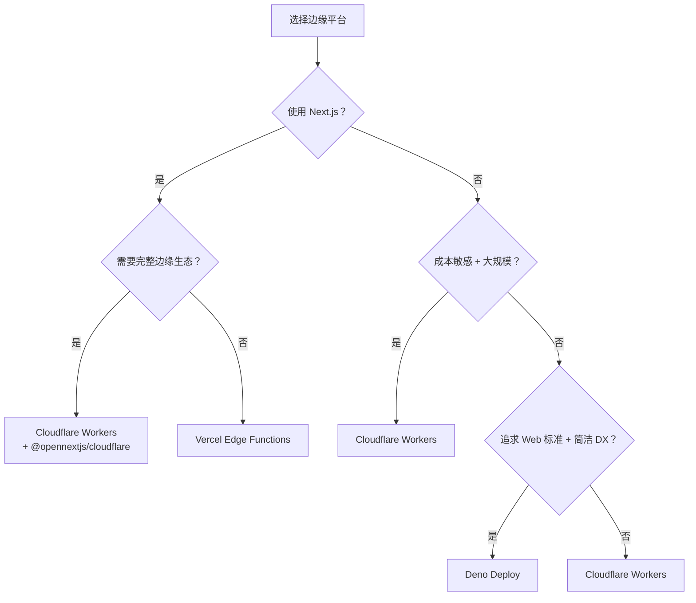

# 边缘部署实验室 — 理论基础

> **对齐版本**：Cloudflare Workers 2026 | Vercel Edge Functions | Deno Deploy | WinterCG
> **权威来源**：TryBuildPilot 2026-03、ZeonEdge 2026-02、MorphLLM 2026-04、FinlyInsights 2026
> **最后更新**：2026-04

---

## 1. 部署范式对比

| 维度 | 传统云部署 (EC2/容器) | Serverless (Lambda) | 边缘部署 (Edge Functions) |
|------|---------------------|--------------------|------------------------|
| **基础设施** | 虚拟机/容器/K8s | 函数容器 | V8 Isolate / WASM |
| **冷启动** | 分钟级 (VM) | 100-500ms (容器启动) | **<1ms** (Isolate 预热) |
| **地理分布** | 3-5 区域 | 10-20 区域 | **300+ 边缘节点** |
| **状态管理** | 数据库连接池 | 无状态，外置存储 | KV / Durable Objects / D1 |
| **成本模型** | 按小时计费 | 按执行时间 + 内存 | **按请求计费** |
| **运行时** | 完整 OS | 裁剪容器 | Web 标准 API 子集 |
| **内存限制** | GB 级 | 10GB (AWS) | **128MB** (Workers/Vercel) |
| **执行时间** | 无限 | 15min (Lambda) | 30s (Workers paid) |

> *"Traditional serverless functions run in one or a few regions. When a user in Tokyo hits your us-east-1 Lambda function, the request travels 13,000 km across the Pacific — adding 200-300ms of latency before your code even executes. Edge computing eliminates this by running your code in 200+ cities worldwide, typically within 50ms of every internet user."* — ZeonEdge, 2026-02

---

## 2. 边缘平台生态（2026）

### 2.1 三大平台深度对比

| 特性 | Cloudflare Workers | Vercel Edge Functions | Deno Deploy |
|------|-------------------|----------------------|-------------|
| **运行时** | V8 Isolates (Web API) | V8 Isolates (Cloudflare 底层) | Deno Runtime (V8) |
| **全球节点** | **300+** | 300+ (Cloudflare 网络) | 35+ |
| **冷启动** | **<1ms** (无冷启动) | ~5ms | ~5-10ms |
| **内存限制** | 128MB | 128MB | **512MB** |
| **CPU 时间** | 10ms (free) / 30s (paid) | 30s | 50ms (free) / 10min (paid) |
| **原生 TypeScript** | ⚠️ 需构建 | ⚠️ 需构建 | **✅ 零配置** |
| **免费额度** | 100K req/day | 1M invocations/mo | 1M req/mo |
| **付费起价** | **$5/mo (10M req)** | $20/mo (Pro) | $10/mo (5M req) |
| **额外请求** | **$0.15-0.30/M** | 含在套餐 | $2/M |
| **带宽** | **免费** | 1TB included | 100GB/mo |
| **生态锁定** | 平台无关 | Vercel/Next.js 深度集成 | Deno 生态 |

**成本对比（100M 请求/月）**：

- Cloudflare Workers: ~$50
- Deno Deploy: ~$200
- Vercel Edge: 含在 $20/人 Pro 套餐（但团队成本高）

### 2.2 平台存储与数据库生态

| 服务 | 平台 | 类型 | 一致性 | 适用场景 |
|------|------|------|--------|---------|
| **KV** | Cloudflare | 全局 KV | 最终一致 | 配置、缓存、会话 |
| **D1** | Cloudflare | SQLite (Serverless) | 强一致 | 边缘关系数据、用户数据 |
| **R2** | Cloudflare | 对象存储 (S3 API) | 强一致 | 文件、图片、静态资源 |
| **Durable Objects** | Cloudflare | 有状态对象 | 强一致 | 协作编辑、游戏状态、WebSocket |
| **Queues** | Cloudflare | 消息队列 | 至少一次 | 异步任务、批处理 |
| **Deno KV** | Deno Deploy | 全局 KV | **强一致 (区域内)** | 状态、计数器、配置 |
| **Vercel KV** | Vercel | Redis (Upstash) | 强一致 | 缓存、速率限制 |
| **Vercel Postgres** | Vercel | Neon (Serverless) | 强一致 | 关系数据 (+40-90ms 延迟) |
| **Turso** | 独立 | SQLite (libSQL) | 强一致 | 边缘 SQLite，全球副本 |
| **Neon** | 独立 | Serverless Postgres | 强一致 | 边缘兼容 Postgres |

> **关键洞察**：边缘数据库必须是 **HTTP-based**（D1、Turso、Neon、Upstash）。传统 TCP 数据库（RDS、MongoDB Atlas）在边缘运行时无法直接连接。

### 2.3 边缘运行时限制

**不能使用的 Node.js 模块**：

- `fs`（文件系统）— 使用 R2 / S3 替代
- `child_process`（子进程）— 边缘无 OS 访问
- `net` / `dgram`（原始 socket）— 使用 WebSocket / Fetch 替代
- `crypto`（部分）— 使用 Web Crypto API 替代

**通用支持的 Web 标准 API**：

- Fetch API、Request/Response、Headers
- Web Crypto、Streams、TextEncoder/Decoder
- URL、URLSearchParams、WebSocket
- Cache API（Cloudflare Workers）

---

## 3. 部署策略

### 3.1 蓝绿部署

同时运行两个相同环境，通过 CDN 配置或流量规则实现零停机切换。边缘场景下利用**快速全局传播**特性（Cloudflare 配置 <30s 全球生效）。

```typescript
// Cloudflare Workers — 基于环境变量的版本路由
export default {
  async fetch(request, env) {
    const version = env.CURRENT_VERSION // 'blue' or 'green'
    return fetch(`https://${version}.api.example.com${new URL(request.url).pathname}`)
  }
}
```

### 3.2 灰度发布

按用户比例逐步放量，边缘层根据 `Cookie` / `Header` / `随机哈希` 路由：

```typescript
// 边缘灰度路由
export default {
  async fetch(request) {
    const userId = request.headers.get('x-user-id') || 'anonymous'
    const hash = await crypto.subtle.digest('SHA-256', new TextEncoder().encode(userId))
    const bucket = new Uint8Array(hash)[0] % 100 // 0-99

    if (bucket < 5) {
      return fetch('https://v2-api.example.com' + request.url.pathname)
    }
    return fetch('https://v1-api.example.com' + request.url.pathname)
  }
}
```

### 3.3 A/B 测试

边缘层根据用户属性（地域、设备、随机哈希）路由到不同版本，收集指标后决策。

---

## 4. 边缘缓存策略

```http
Cache-Control: public, s-maxage=60, stale-while-revalidate=300
```

| 指令 | 作用 | 边缘适用性 |
|------|------|-----------|
| `s-maxage=60` | CDN 缓存 60 秒 | ✅ 所有边缘平台 |
| `stale-while-revalidate=300` | 过期后返回旧内容，后台刷新（300秒窗口） | ✅ Cloudflare/Vercel |
| `Cache-Tag: product-123` | 细粒度缓存失效 | ✅ Cloudflare（Purge by tag） |
| `CDN-Cache-Control` | 仅 CDN 可见的缓存指令 | ✅ Vercel/Cloudflare |

**边缘缓存失效模式**：

```typescript
// Cloudflare — 按 Tag 失效（API 触发）
await fetch('https://api.cloudflare.com/client/v4/zones/xxx/purge_cache', {
  method: 'POST',
  headers: { Authorization: 'Bearer ' + token },
  body: JSON.stringify({ tags: ['product-123', 'category-electronics'] }),
})
```

---

## 5. 安全与合规

### 5.1 边缘安全层

| 能力 | Cloudflare | Vercel | Deno Deploy |
|------|-----------|--------|-------------|
| **WAF** | ✅ 内置 (规则集) | ⚠️ 有限 | ❌ |
| **DDoS 防护** | ✅ 自动 (不限流量) | ⚠️ 基础 | ❌ |
| **Bot 管理** | ✅ 企业级 | ❌ | ❌ |
| **mTLS** | ✅ | ✅ | ⚠️ |
| **Secrets 管理** | `wrangler secret put` | 环境变量 (加密) | 环境变量 |
| **Rate Limiting** | ✅ 内置 | 需实现 | 需实现 |

### 5.2 速率限制实现

```typescript
// Cloudflare Workers — 基于 KV 的速率限制
export default {
  async fetch(request, env) {
    const ip = request.headers.get('cf-connecting-ip') || 'unknown'
    const key = `ratelimit:${ip}`
    const requests = parseInt(await env.KV.get(key) || '0') + 1

    if (requests === 1) {
      await env.KV.put(key, '1', { expirationTtl: 60 })
    } else if (requests > 100) {
      return new Response('Too Many Requests', { status: 429 })
    } else {
      await env.KV.put(key, String(requests), { expirationTtl: 60 })
    }

    return fetch(request)
  }
}
```

### 5.3 数据驻留与合规

- **GDPR/CCPA**：Cloudflare/Vercel/Deno 均处理数据于 US/EU 区域
- **严格数据本地化**（中国、俄罗斯）：以上平台均**不完全合规**，需配合本地 CDN/边缘节点
- **Secrets**：禁止硬编码 API Key，使用平台原生 Secrets 管理

---

## 6. 选型决策框架



### 跨平台可移植方案

**Hono** 是 2026 年最佳的跨平台边缘框架：

```typescript
import { Hono } from 'hono'

const app = new Hono()

app.get('/api/hello', (c) => c.json({ message: 'Hello Edge!' }))
app.get('/api/user/:id', async (c) => {
  const id = c.req.param('id')
  const user = await c.env.DB.prepare('SELECT * FROM users WHERE id = ?').bind(id).first()
  return c.json(user)
})

// 同一套代码部署到：
// - Cloudflare Workers: export default app
// - Vercel Edge: export const GET = app.fetch
// - Deno Deploy: Deno.serve(app.fetch)
// - Bun: Bun.serve(app)
```

---

## 7. 多区域 KV 同步与数据一致性

```typescript
// multi-region-kv.ts — 利用 Cloudflare KV 实现跨区域配置同步
export default {
  async fetch(request: Request, env: Env) {
    const url = new URL(request.url);
    const key = url.pathname.slice(1);

    // 读取配置（KV 最终一致，适合配置/Feature Flag）
    const config = await env.KV.get(`config:${key}`, { type: 'json' });
    if (!config) {
      return new Response('Config not found', { status: 404 });
    }

    // 基于地域的差异化响应
    const country = request.cf?.country ?? 'US';
    const localized = (config as any).regions?.[country] ?? (config as any).default;

    return new Response(JSON.stringify(localized), {
      headers: {
        'Content-Type': 'application/json',
        'Cache-Control': 'public, max-age=60',
        'CF-Cache-Status': 'DYNAMIC',
      },
    });
  },
};
```

## 8. 边缘中间件链：认证 + 缓存 + 路由

```typescript
// edge-middleware.ts — 可组合的 Hono 中间件链
import { Hono } from 'hono';
import { bearerAuth } from 'hono/bearer-auth';
import { cache } from 'hono/cache';

const app = new Hono<{ Bindings: Env }>();

// 1. 全局认证中间件
app.use('/api/*', bearerAuth({
  verifyToken: async (token, c) => {
    // 验证 JWT 或 API Key（示例简化）
    const valid = await c.env.KV.get(`apikey:${token}`);
    return valid !== null;
  },
}));

// 2. 缓存中间件（仅 GET）
app.use('/api/public/*', cache({
  cacheName: 'public-api',
  cacheControl: 'max-age=3600',
}));

// 3. 路由层
app.get('/api/public/products', async (c) => {
  const { results } = await c.env.DB.prepare('SELECT * FROM products LIMIT 50').all();
  return c.json(results);
});

app.post('/api/private/orders', async (c) => {
  const body = await c.req.json();
  // 订单处理...
  return c.json({ orderId: crypto.randomUUID() }, 201);
});

export default app;
```

## 9. WASM 边缘模块加载

```typescript
// wasm-edge.ts — 在 Cloudflare Workers 中加载 Rust/WASM 模块
import wasmModule from './fibonacci.wasm';

export default {
  async fetch(request: Request) {
    const url = new URL(request.url);
    const n = parseInt(url.searchParams.get('n') || '10', 10);

    // WASM 实例化（零成本，Isolate 预加载）
    const instance = await WebAssembly.instantiate(wasmModule, {
      env: { memory: new WebAssembly.Memory({ initial: 1 }) },
    });

    const fib = (instance.exports.fibonacci as CallableFunction)(n);
    return new Response(JSON.stringify({ n, fib }), {
      headers: { 'Content-Type': 'application/json' },
    });
  },
};
```

## 10. 本地开发与测试：Wrangler + Miniflare

```typescript
// wrangler.toml — 本地开发配置
name = "edge-api"
main = "src/index.ts"
compatibility_date = "2026-04-01"

[[kv_namespaces]]
binding = "KV"
id = "xxxxxxxxxxxxxxxxxxxxxxxxxxxxxxxx"
preview_id = "yyyyyyyyyyyyyyyyyyyyyyyyyyyyyyyy" # 本地开发使用 preview

[[d1_databases]]
binding = "DB"
database_name = "edge-db"
database_id = "zzzzzzzzzzzzzzzzzzzzzzzzzzzzzzzz"

# 本地启动：wrangler dev --local
```

```typescript
// test/edge.test.ts — 使用 Miniflare 进行边缘函数单元测试
import { Miniflare } from 'miniflare';
import { describe, it, expect, beforeAll, afterAll } from 'vitest';

let mf: Miniflare;

beforeAll(async () => {
  mf = new Miniflare({
    scriptPath: './dist/index.js',
    modules: true,
    kvNamespaces: ['KV'],
    d1Databases: ['DB'],
  });
});

afterAll(async () => {
  await mf.dispose();
});

describe('Edge API', () => {
  it('should return 200 on health check', async () => {
    const res = await mf.dispatchFetch('http://localhost/health');
    expect(res.status).toBe(200);
    const body = await res.json();
    expect(body.status).toBe('healthy');
  });

  it('should rate limit after 100 requests', async () => {
    for (let i = 0; i < 101; i++) {
      const res = await mf.dispatchFetch('http://localhost/api/data');
      if (i === 100) expect(res.status).toBe(429);
    }
  });
});
```

## 11. 边缘 CI/CD 流水线：自动化部署与回滚

```typescript
// deploy-pipeline.ts — 类型安全的边缘部署流水线抽象
interface EdgeDeployment {
  platform: 'cloudflare' | 'vercel' | 'deno-deploy';
  environment: 'staging' | 'production';
  artifactPath: string;
  secrets: Record<string, string>;
}

class EdgeDeployPipeline {
  async deploy(config: EdgeDeployment): Promise<{ url: string; version: string }> {
    // 1. 预部署检查
    await this.runPreChecks(config);
    // 2. 上传产物
    const version = await this.uploadArtifact(config);
    // 3. 渐进式流量切换（金丝雀）
    if (config.environment === 'production') {
      await this.canaryRollout(config, version);
    }
    return { url: `https://${config.environment}.example.com`, version };
  }

  private async runPreChecks(config: EdgeDeployment): Promise<void> {
    // 类型检查、单元测试、安全扫描
    console.log(`[PreCheck] Running for ${config.platform}...`);
  }

  private async uploadArtifact(config: EdgeDeployment): Promise<string> {
    console.log(`[Deploy] Uploading ${config.artifactPath} to ${config.platform}`);
    return `v-${Date.now()}`;
  }

  private async canaryRollout(config: EdgeDeployment, version: string): Promise<void> {
    // 先切 5% 流量，观察 5 分钟
    console.log(`[Canary] Routing 5% traffic to ${version}`);
    await new Promise((r) => setTimeout(r, 5 * 60 * 1000));
    console.log(`[Canary] Promoting ${version} to 100%`);
  }
}
```

---

## 10. 与相邻模块的关系

- **22-deployment-devops**: 传统部署与 CI/CD 流程
- **32-edge-computing**: 边缘计算架构与运行时深入
- **31-serverless**: Serverless 与边缘函数的对比
- **20.5-frontend-frameworks**: SSR 元框架的边缘部署（Next.js、Nuxt、SvelteKit）
- **20.7-ai-agent-infra**: AI Agent 的边缘推理部署（Wasm + ONNX Runtime）

---

## 参考来源

1. **TryBuildPilot** — [Cloudflare Workers vs Vercel Edge vs Deno Deploy 2026](https://trybuildpilot.com/388-cloudflare-workers-vs-vercel-edge-vs-deno-deploy-2026) (2026-03-12)
2. **ZeonEdge** — [Edge Computing for Web Developers 2026](https://zeonedge.com/ur/blog/edge-computing-web-developers-2026-cloudflare-workers-vercel) (2026-02-14)
3. **MorphLLM** — [Cloudflare Workers vs Vercel 2026](https://www.morphllm.com/comparisons/cloudflare-workers-vs-vercel) (2026-04-04)
4. **FinlyInsights** — [Cloudflare Workers vs Vercel Edge Functions Guide](https://finlyinsights.com/cloudflare-workers-vs-vercel-edge-functions/) (2026)
5. **Astro Vault** — [Serverless & Edge Computing Best Practices](https://vault.llbbl.com/content/runtimes/serverless-edge/) (2026)
6. **Cloudflare Workers Documentation** — [developers.cloudflare.com/workers](https://developers.cloudflare.com/workers/) — Cloudflare 官方文档
7. **Vercel Edge Functions** — [vercel.com/docs/functions/edge-functions](https://vercel.com/docs/functions/edge-functions) — Vercel 官方文档
8. **Deno Deploy** — [docs.deno.com/deploy/manual](https://docs.deno.com/deploy/manual/) — Deno Deploy 官方手册
9. **WinterCG** — [wintercg.org](https://wintercg.org/) — Web-interoperable Runtimes 标准组织
10. **Hono Framework** — [hono.dev](https://hono.dev/) — 跨平台边缘 Web 框架
11. **Cloudflare D1** — [developers.cloudflare.com/d1](https://developers.cloudflare.com/d1/) — 边缘 SQLite 数据库
12. **Cloudflare KV** — [developers.cloudflare.com/kv](https://developers.cloudflare.com/kv/) — 全局键值存储
13. **Cloudflare Durable Objects** — [developers.cloudflare.com/durable-objects](https://developers.cloudflare.com/durable-objects/) — 有状态边缘对象
14. **Turso / libSQL** — [turso.tech](https://turso.tech/) — 边缘 SQLite 全球副本
15. **Neon Serverless Postgres** — [neon.tech](https://neon.tech/) — 边缘兼容 Postgres
16. **WebAssembly on Cloudflare Workers** — [developers.cloudflare.com/workers/runtime-apis/webassembly](https://developers.cloudflare.com/workers/runtime-apis/webassembly/) — WASM 边缘运行指南
17. **OWASP Top 10** — [owasp.org/Top10](https://owasp.org/Top10/) — Web 应用安全基准
18. **GDPR Official Text** — [gdpr-info.eu](https://gdpr-info.eu/) — 欧盟通用数据保护条例
19. **Wrangler CLI Documentation** — [developers.cloudflare.com/workers/wrangler](https://developers.cloudflare.com/workers/wrangler/) — Cloudflare Workers 命令行工具
20. **Miniflare Documentation** — [miniflare.dev](https://miniflare.dev/) — 本地 Workers 模拟器
21. **Vercel CLI Documentation** — [vercel.com/docs/cli](https://vercel.com/docs/cli) — Vercel 命令行工具
22. **Deno Deployctl** — [docs.deno.com/deploy/manual/deployctl](https://docs.deno.com/deploy/manual/deployctl/) — Deno Deploy 部署工具
23. **Cloudflare Workers Testing** — [developers.cloudflare.com/workers/testing](https://developers.cloudflare.com/workers/testing/) — Workers 官方测试指南
24. **Vitest Documentation** — [vitest.dev](https://vitest.dev/) — 极速 Vite 原生测试框架
25. **GitHub Actions — Deployment Environments** — [docs.github.com/en/actions/deployment](https://docs.github.com/en/actions/deployment/targeting-different-environments/using-environments-for-deployment) — 多环境部署配置
26. **Cloudflare Workers Analytics** — [developers.cloudflare.com/workers/observability](https://developers.cloudflare.com/workers/observability/) — Workers 可观测性
27. **Vercel Analytics** — [vercel.com/docs/analytics](https://vercel.com/docs/analytics) — Vercel 性能分析
28. **Fly.io Documentation** — [fly.io/docs](https://fly.io/docs/) — Fly.io 边缘部署平台
29. **Railway Documentation** — [docs.railway.app](https://docs.railway.app/) — Railway 部署平台
