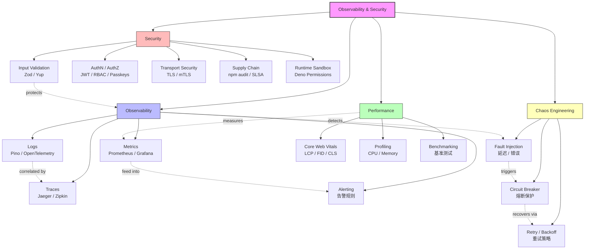

# 可观测性与安全 — 模块架构

> **Module**: `20-code-lab/20.9-observability-security/`
> **Position**: Advanced Level — Production Observability & Security Engineering
> **Learning Path**: Fundamentals → Backend APIs → Edge & Serverless → **Observability & Security** → Formal Verification

---

## 1. System Overview / 系统概述

本模块是 JS/TS 全景知识库中面向 **生产环境可观测性（Observability）** 与 **应用安全工程（Security Engineering）** 的核心代码实验室。在现代分布式系统中，"你无法优化你无法测量的东西"和"安全不是功能而是属性"是两个不可回避的工程真理。本模块解决的核心问题是：**如何在不牺牲开发效率的前提下，构建具备完整可观测性和深度安全防御的 JS/TS 应用**。

This module serves as the core code laboratory for **Production Observability** and **Security Engineering** within the JS/TS knowledge base. In modern distributed systems, "you can't optimize what you can't measure" and "security is not a feature but a property" are two unavoidable engineering truths. The central problem this module addresses is: **how to build JS/TS applications with comprehensive observability and deep security defense without sacrificing development efficiency**.

模块覆盖两大支柱领域：

### 可观测性三支柱（Observability Three Pillars）

1. **Metrics（指标）**：数值型时序数据，使用 Prometheus + Grafana 收集与可视化
2. **Logs（日志）**：结构化事件，使用 Pino、Winston、OpenTelemetry 处理
3. **Traces（链路追踪）**：请求全链路追踪，使用 OpenTelemetry、Jaeger 实现

### 安全分层防御（Defense in Depth）

1. **输入验证层**：Zod/Yup Schema 校验，防止注入攻击
2. **权限控制层**：RBAC/ACL 访问控制，最小权限原则
3. **运行时沙箱层**：Deno 权限模型，进程级隔离
4. **依赖审计层**：npm audit / Snyk，供应链安全
5. **基础设施隔离层**：容器/VM 网络隔离

从学习路径角度，本模块位于 **L2 高级代码实验室** 的基础设施专项分支。它假设学习者已掌握 Express/Fastify 等 Web 框架、Node.js 运行时原理，并准备进入生产系统的运维与安全领域。

---

## 2. Module Structure / 模块结构

```
20.9-observability-security/
├── README.md                    # 目录索引（自动生成）
├── THEORY.md                    # 核心理论：三支柱、安全框架、JIT 安全张力定理
├── ARCHITECTURE.md              # 本文件：模块架构与学习导航
│
├── observability/               # 可观测性核心
│   ├── index.ts
│   ├── alerting.ts + .test.ts              # 告警规则与通知
│   ├── health-check.ts + .test.ts          # 健康检查端点
│   ├── logging.ts + .test.ts               # 结构化日志
│   ├── metrics.ts + .test.ts               # 指标收集与暴露
│   ├── observability-stack.ts + .test.ts   # 完整观测栈
│   ├── tracing.ts + .test.ts               # 分布式链路追踪
│   ├── README.md, THEORY.md, ARCHITECTURE.md
│   └── _MIGRATED_FROM.md
│
├── observability-lab/           # 可观测性实战实验室
│   ├── index.ts
│   ├── ai-observability.ts                 # AI 系统可观测性
│   ├── error-reporter.ts                   # 错误上报系统
│   ├── opentelemetry-setup.ts              # OpenTelemetry 配置
│   ├── performance-observer.ts             # 性能观察者
│   ├── structured-logger.ts                # 结构化日志实现
│   ├── observability-lab.test.ts           # 集成测试
│   ├── README.md, THEORY.md, ARCHITECTURE.md
│   └── _MIGRATED_FROM.md
│
├── api-security/                # API 安全
│   ├── index.ts
│   ├── cors-csrf.ts + .test.ts             # CORS / CSRF 防护
│   ├── jwt-auth.ts + .test.ts              # JWT 认证实现
│   ├── rate-limiter.ts + .test.ts          # API 限流
│   ├── README.md, THEORY.md, ARCHITECTURE.md
│   └── _MIGRATED_FROM.md
│
├── auth-modern-lab/             # 现代认证实验室
│   ├── index.ts
│   ├── better-auth-setup.ts                # Better Auth 配置
│   ├── oauth2-pkce-flow.ts                 # OAuth2 PKCE 流程
│   ├── passkeys-implementation.ts          # Passkeys 实现
│   ├── rbac-middleware.ts                  # RBAC 中间件
│   ├── auth-modern-lab.test.ts             # 认证测试
│   ├── README.md, THEORY.md, ARCHITECTURE.md
│   └── _MIGRATED_FROM.md
│
├── cybersecurity/               # 网络安全核心
│   ├── index.ts
│   ├── hash-functions.ts + .test.ts        # 哈希函数实现
│   ├── jwt-auth.ts + .test.ts              # JWT 安全
│   ├── jwt-security.ts + .test.ts          # JWT 漏洞分析
│   ├── password-strength.ts + .test.ts     # 密码强度检测
│   ├── rate-limiter.ts + .test.ts          # 限流算法
│   ├── request-signer.ts + .test.ts        # 请求签名
│   ├── secure-headers.ts + .test.ts        # 安全响应头
│   ├── security-framework.ts + .test.ts    # 安全框架集成
│   ├── threat-modeling.ts + .test.ts       # 威胁建模
│   ├── README.md, THEORY.md, ARCHITECTURE.md
│   └── _MIGRATED_FROM.md
│
├── web-security/                # Web 安全
│   ├── index.ts
│   ├── xss-csp.ts + .test.ts               # XSS / CSP 防护
│   ├── README.md, THEORY.md, ARCHITECTURE.md
│   └── _MIGRATED_FROM.md
│
├── chaos-engineering/           # 混沌工程
│   ├── index.ts
│   ├── chaos-experiments.ts + .test.ts     # 混沌实验
│   ├── circuit-breaker.ts + .test.ts       # 熔断器
│   ├── fault-injection.ts + .test.ts       # 故障注入
│   ├── retry-mechanisms.ts + .test.ts      # 重试机制
│   ├── README.md, THEORY.md
│   └── _MIGRATED_FROM.md
│
├── benchmarks/                  # 性能基准测试
│   ├── index.ts
│   ├── js-vs-ts-performance.ts + .test.ts  # JS vs TS 性能
│   ├── README.md, THEORY.md
│   └── _MIGRATED_FROM.md
│
├── performance-monitoring/      # 性能监控
│   ├── index.ts
│   ├── core-web-vitals.ts + .test.ts       # Core Web Vitals
│   ├── README.md, THEORY.md
│   └── _MIGRATED_FROM.md
│
└── debugging-monitoring/        # 调试与监控（已归档）
    ├── index.ts
    ├── performance-profiling.ts + .test.ts
    ├── README.md, THEORY.md
    └── _MIGRATED_FROM.md
```

---

## 3. Key Concepts Map / 关键概念地图



**概念关系说明 / Concept Relationships**:

- **可观测性三支柱** (`observability/`) 是生产系统调试的基石。Metrics 告诉你"出了什么问题"，Logs 告诉你"为什么出问题"，Traces 告诉你"问题在哪里"。三者通过 `trace_id` 和 `request_id` 关联，构成完整的故障诊断视图。
- **安全分层防御** (`cybersecurity/`, `api-security/`, `web-security/`) 遵循"纵深防御"原则。任何单层防御都可能被突破，多层叠加才能形成有效的安全边界。
- **JIT 安全张力定理**（来自 `10-fundamentals/`）指出 V8 的激进 JIT 优化与类型混淆漏洞之间的结构性矛盾。本模块在应用层通过依赖审计和运行时沙箱来缓解这一风险。
- **混沌工程** (`chaos-engineering/`) 是可观测性的"压力测试"。通过故意注入故障，验证系统的容错能力和监控告警的有效性。

---

## 4. Learning Progression / 学习 progression

### Phase 1: 可观测性基础（Observability Foundations）— 约 6-8 小时

1. 阅读 `THEORY.md` 理解可观测性三支柱与安全框架对比
2. `observability/logging.ts` — 结构化日志设计与 Pino 实践
3. `observability/metrics.ts` — Prometheus 指标暴露与自定义指标
4. `observability/tracing.ts` — OpenTelemetry 手动埋点与自动埋点
5. `observability/health-check.ts` — 健康检查端点设计模式

### Phase 2: 可观测性集成实战 — 约 4-6 小时

1. `observability-lab/opentelemetry-setup.ts` — 完整的 OTel Node.js 配置
2. `observability-lab/structured-logger.ts` — 请求上下文关联日志
3. `observability-lab/error-reporter.ts` — 错误聚合与上报
4. `observability-lab/performance-observer.ts` — 运行时性能监控
5. `observability-lab/ai-observability.ts` — AI 系统的特殊观测需求

### Phase 3: 安全工程核心（Security Engineering Core）— 约 8-10 小时

1. `cybersecurity/secure-headers.ts` — Helmet 安全头配置
2. `cybersecurity/jwt-auth.ts` + `jwt-security.ts` — JWT 实现与漏洞分析
3. `api-security/cors-csrf.ts` — 跨域与跨站请求伪造防护
4. `api-security/rate-limiter.ts` — API 速率限制
5. `cybersecurity/threat-modeling.ts` — STRIDE 威胁建模

### Phase 4: 现代认证与授权（Modern Auth）— 约 4-6 小时

1. `auth-modern-lab/oauth2-pkce-flow.ts` — OAuth2 + PKCE 移动安全
2. `auth-modern-lab/passkeys-implementation.ts` — WebAuthn / Passkeys
3. `auth-modern-lab/rbac-middleware.ts` — 基于角色的访问控制
4. `auth-modern-lab/better-auth-setup.ts` — 现代认证库集成

### Phase 5: 混沌工程与性能（Chaos & Performance）— 约 4-6 小时

1. `chaos-engineering/fault-injection.ts` — 故障注入实验
2. `chaos-engineering/circuit-breaker.ts` — 熔断器实现
3. `chaos-engineering/retry-mechanisms.ts` — 指数退避重试
4. `benchmarks/js-vs-ts-performance.ts` — 性能基准测试方法
5. `performance-monitoring/core-web-vitals.ts` — 前端性能指标

---

## 5. Prerequisites & Dependencies / 先决条件与依赖

### 5.1 知识先决条件

| 先决知识 | 重要性 | 对应模块 |
|---------|--------|---------|
| Node.js 运行时与事件循环 | ⭐⭐⭐ 必需 | `10.3-execution-model/` |
| Express / Fastify 中间件机制 | ⭐⭐⭐ 必需 | `20.6-backend-apis/` |
| HTTP 协议与安全头 | ⭐⭐⭐ 必需 | `10.3-execution-model/` |
| 密码学基础（哈希、对称/非对称加密） | ⭐⭐ 推荐 | `30-knowledge-base/` |
| Docker / 容器基础 | ⭐⭐ 推荐 | `20.8-edge-serverless/` |

### 5.2 外部依赖

- **OpenTelemetry JS SDK** — 链路追踪与指标收集
- **Pino** — 高性能结构化日志
- **Prometheus Client** — 指标暴露
- **Helmet** — Express 安全头中间件
- **express-rate-limit** — 限流中间件
- **jose** — JWT 边缘验证
- **Zod** — 输入校验

### 5.3 模块间依赖关系

```
20.9-observability-security
├── depends on: 20.6-backend-apis (Web 框架基础)
├── depends on: 20.3-concurrency-async (异步/事件)
├── connects to: 20.7-ai-agent-infra (Agent 观测与安全)
├── connects to: 20.8-edge-serverless (边缘观测)
├── connects to: 20.10-formal-verification (形式化安全证明)
└── feeds into: 50.3-advanced (高级生产实践)
```

---

## 6. Exercise Design Philosophy / 练习设计哲学

### 6.1 从"事后救火"到"事前预防"

传统运维是"故障发生 → 人工排查 → 修复"的被动模式。本模块的练习强调主动防御：

```
无观测性：故障发生 → 人工排查 → 数小时定位 → 修复
有观测性：告警触发 → 链路追踪 → 分钟级定位 → 修复
```

### 6.2 渐进式难度曲线

| 阶段 | 特征 | 示例 |
|------|------|------|
| **Level 1: 基础配置** | 单中间件、静态配置 | `secure-headers.ts` — Helmet 安全头 |
| **Level 2: 动态策略** | 运行时决策、条件逻辑 | `rate-limiter.ts` — 基于 IP/用户的动态限流 |
| **Level 3: 系统集成** | 多组件联动、上下文传递 | `opentelemetry-setup.ts` — 全栈追踪 |
| **Level 4: 攻防对抗** | 模拟攻击、漏洞修复 | `jwt-security.ts` — JWT 漏洞分析与加固 |

### 6.3 合规框架驱动

安全练习直接对标国际安全标准：

| 框架 | 对应练习 | 验证方式 |
|------|---------|---------|
| **OWASP ASVS** | `cybersecurity/security-framework.ts` | 检查清单自动化 |
| **SLSA** | `THEORY.md` 供应链审计脚本 | Provenance 验证 |
| **NIST SSDF** | 开发流程安全 | 流程审计 |
| **CIS Controls** | 安全配置基线 | 配置扫描 |

### 6.4 真实攻击场景

- **JWT 密钥泄露** → `jwt-security.ts` 分析弱签名与算法混淆攻击
- **依赖供应链投毒** → THEORY.md 中的 `audit-supply-chain.ts` 自动化审计
- **DDoS / 暴力破解** → `rate-limiter.ts` 实现多层防护
- **XSS / CSP 绕过** → `web-security/xss-csp.ts` 内容安全策略

---

## 7. Extension Points / 扩展点

### 7.1 架构扩展方向

1. **AI Agent 安全** → `20.7-ai-agent-infra/`
   - LLM 的 OWASP Top 10 防护
   - Agent 推理轨迹的安全审计

2. **边缘可观测性** → `20.8-edge-serverless/`
   - Cloudflare Workers 的 OpenTelemetry 集成
   - 边缘函数冷启动追踪

3. **形式化验证** → `20.10-formal-verification/`
   - 使用 TLA+ 验证安全协议的正确性
   - 对关键认证流程应用 Hoare Logic

4. **边缘数据库安全** → `20.13-edge-databases/`
   - SQL 注入防护与参数化查询审计
   - 边缘数据加密与访问控制

### 7.2 生态实践方向

1. **SRE 实践体系**
   - 基于本模块构建完整的 SLO/SLI 监控体系
   - 实现错误预算与自动熔断策略

2. **红队安全测试**
   - 扩展 `chaos-engineering/` 为完整的安全红队工具集
   - 自动化渗透测试与漏洞扫描

### 7.3 标准与认证方向

1. **合规自动化**
   - 将 OWASP ASVS 检查清单集成到 CI/CD 流水线
   - 实现 SOC 2 / ISO 27001 的自动化证据收集

2. **供应链安全**
   - 深入研究 SLSA L3 在 npm 生态的实现路径
   - Sigstore / Cosign 在 JS 包签名中的应用

---

## 附录：快速参考

| 子模块 | 核心技能 | 估计学习时长 | 难度 |
|--------|---------|------------|------|
| `observability/` | 三支柱实现 | 4h | ⭐⭐⭐ |
| `observability-lab/` | OpenTelemetry 集成 | 4h | ⭐⭐⭐⭐ |
| `api-security/` | API 防护 | 3h | ⭐⭐⭐ |
| `auth-modern-lab/` | 现代认证 | 4h | ⭐⭐⭐⭐ |
| `cybersecurity/` | 网络安全 | 6h | ⭐⭐⭐⭐ |
| `web-security/` | Web 安全 | 2h | ⭐⭐⭐ |
| `chaos-engineering/` | 混沌工程 | 3h | ⭐⭐⭐⭐ |
| `benchmarks/` | 性能基准 | 2h | ⭐⭐ |

---

*本 ARCHITECTURE.md 遵循 JS/TS 全景知识库的模块架构规范。*
*最后更新: 2026-05-01*
