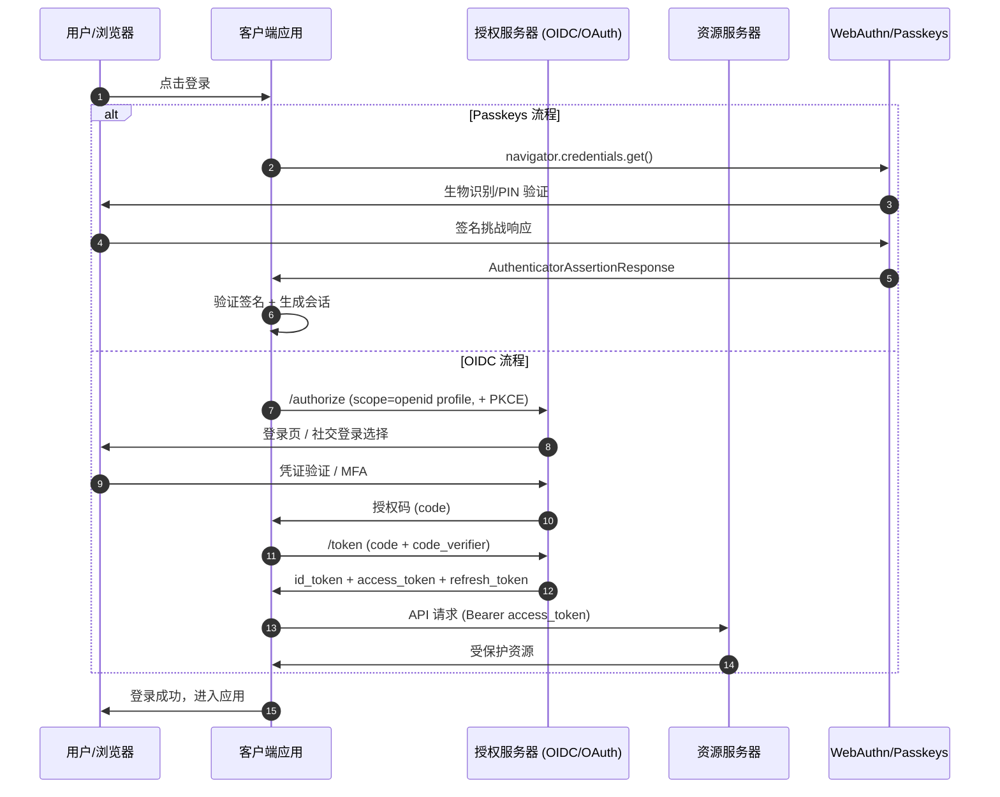

# 现代认证实验室 — 架构设计

## 1. 架构概述

本模块实现了现代 Web 认证的完整技术栈，包括 Passkeys、OAuth 2.1、JWT 会话管理和多因素认证。展示从注册到登出的全生命周期安全架构。

## 2. 核心组件

### 2.1 Passkeys 系统

- **WebAuthn Server**: 挑战生成、注册/认证验证
- **Credential Store**: 公钥凭证的安全存储
- **Cross-Device Sync**: 跨设备凭证同步适配

### 2.2 OAuth 2.1 服务器

- **Authorization Endpoint**: 授权码颁发
- **Token Endpoint**: 访问/刷新令牌颁发和验证
- **PKCE Validator**: 授权码交换验证

### 2.3 会话管理

- **JWT Issuer**: 签名令牌生成
- **Session Store**: 有状态会话的分布式存储
- **Refresh Rotator**: 刷新令牌轮换机制

### 2.4 MFA 引擎

- **TOTP Generator**: 基于时间的一次性密码
- **WebAuthn MFA**: 生物识别第二因素
- **Recovery Codes**: 备用恢复码生成和验证

## 3. 认证协议对比

| 维度 | OAuth 2.0/2.1 | OpenID Connect (OIDC) | SAML 2.0 | Passkeys (FIDO2/WebAuthn) |
|------|---------------|----------------------|----------|---------------------------|
| **核心目标** | 授权委托（Access Token） | 身份认证（ID Token） | 联邦身份认证（XML Assertion） | 无密码身份验证 |
| **传输格式** | JSON / JWT | JWT | XML | CBOR / JSON |
| **依赖凭证** | Client Secret / PKCE | ID Token + OAuth 2.0 | X.509 证书 | 非对称密钥对（私钥本地） |
| **用户体验** | 重定向授权 | 单点登录（SSO） | 企业 SSO（重定向） | 生物识别 / PIN，无密码 |
| **抗钓鱼能力** | 中（依赖重定向 URL 白名单） | 中 | 低（XML 可被重放） | **高**（绑定 origin，抗中间人） |
| **移动端友好** | 高 | 高 | 低 | **高**（同步于平台密钥链） |
| **典型场景** | 第三方 API 授权 | 社交登录、SSO | 企业 IdP 联邦（ADFS） | 高安全场景、消费者应用 |
| **标准化组织** | IETF [RFC 6749](https://datatracker.ietf.org/doc/html/rfc6749) | OpenID Foundation [OpenID Connect Core 1.0](https://openid.net/specs/openid-connect-core-1_0.html) | OASIS [SAML 2.0](https://docs.oasis-open.org/security/saml/v2.0/saml-core-2.0-os.pdf) | FIDO Alliance / W3C [WebAuthn L3](https://www.w3.org/TR/webauthn-3/) |

> **选型决策树**：
>
> - 需要**第三方授权访问资源** → OAuth 2.1
> - 需要**身份联邦 + 用户信息** → OIDC（基于 OAuth 2.1）
> - 企业级**跨域单点登录**（遗留系统）→ SAML 2.0
> - 需要**最高安全 + 最佳 UX** → Passkeys（优先），OAuth/OIDC 作为回退

## 4. 数据流与代码示例

### 4.1 认证流程架构图（Mermaid）



### 4.2 服务端 OIDC + Passkeys 统一认证入口（Node.js / Express）

```typescript
import express from 'express';
import { generateAuthenticationOptions, verifyAuthenticationResponse } from '@simplewebauthn/server';
import { jwtVerify, SignJWT } from 'jose';

const app = express();

/**
 * 统一认证路由
 * 根据请求头 strategy 选择 Passkeys 或 OIDC
 */
app.post('/auth/login', async (req, res) => {
  const { strategy, ...payload } = req.body; // strategy: 'passkey' | 'oidc'

  if (strategy === 'passkey') {
    // 1. 生成认证选项（挑战）
    const options = await generateAuthenticationOptions({
      rpID: 'example.com',
      allowCredentials: [], // 空数组表示接受任意已注册凭证
      userVerification: 'required',
    });
    // 存储 challenge 到 Redis（TTL 60s）
    await redis.set(`challenge:${payload.userId}`, options.challenge, { EX: 60 });
    return res.json(options);
  }

  if (strategy === 'oidc') {
    // 2. OIDC 授权码交换（后端-for-前端 BFF 模式）
    const tokenRes = await fetch('https://idp.example.com/oauth/token', {
      method: 'POST',
      headers: { 'Content-Type': 'application/x-www-form-urlencoded' },
      body: new URLSearchParams({
        grant_type: 'authorization_code',
        code: payload.code,
        redirect_uri: payload.redirectUri,
        client_id: process.env.OIDC_CLIENT_ID!,
        client_secret: process.env.OIDC_CLIENT_SECRET!,
        code_verifier: payload.codeVerifier, // PKCE
      }),
    });
    const tokens = await tokenRes.json();
    // 验证 ID Token
    const { payload: idTokenPayload } = await jwtVerify(
      tokens.id_token,
      await fetchJWKS('https://idp.example.com/.well-known/jwks.json')
    );
    const session = await createSession(idTokenPayload.sub, 'oidc');
    return res.json({ token: session.jwt, expiresIn: session.expiresIn });
  }

  return res.status(400).json({ error: 'Unsupported strategy' });
});

/**
 * Passkeys 验证回调
 */
app.post('/auth/passkey/verify', async (req, res) => {
  const { userId, response } = req.body;
  const expectedChallenge = await redis.get(`challenge:${userId}`);
  if (!expectedChallenge) return res.status(400).json({ error: 'Challenge expired' });

  const verification = await verifyAuthenticationResponse({
    response,
    expectedChallenge,
    expectedOrigin: 'https://example.com',
    expectedRPID: 'example.com',
    authenticator: await getAuthenticatorByCredentialID(response.id), // 从数据库读取
  });

  if (verification.verified) {
    const session = await createSession(userId, 'passkey');
    return res.json({ token: session.jwt, expiresIn: session.expiresIn });
  }
  return res.status(401).json({ error: 'Verification failed' });
});
```

## 5. 技术决策

| 决策 | 选择 | 理由 |
|------|------|------|
| 主认证 | Passkeys 优先 | 最安全、用户体验最好 |
| 回退认证 | OAuth 2.1 + 密码 | 兼容性和覆盖面 |
| 会话方案 | JWT + Redis | 无状态 + 可撤销 |

## 6. 质量属性

- **安全性**: 抗钓鱼、抗重放、抗暴力破解
- **可用性**: 跨平台、跨设备的无缝体验
- **合规性**: 符合 FIDO2 / OAuth 2.1 标准

## 7. 权威参考链接

- [OAuth 2.1 draft-ietf-oauth-v2-1-11](https://datatracker.ietf.org/doc/draft-ietf-oauth-v2-1/) — IETF 最新 OAuth 2.1 草案
- [OpenID Connect Core 1.0 incorporating errata set 2](https://openid.net/specs/openid-connect-core-1_0.html) — OIDC 核心规范
- [Web Authentication: An API for accessing Public Key Credentials Level 3](https://www.w3.org/TR/webauthn-3/) — W3C WebAuthn L3
- [FIDO2 Overview](https://fidoalliance.org/fido2/) — FIDO Alliance 官方概述
- [Passkeys.dev](https://passkeys.dev/) — Passkeys 开发者指南与最佳实践
- [OWASP Authentication Cheat Sheet](https://cheatsheetseries.owasp.org/cheatsheets/Authentication_Cheat_Sheet.html) — OWASP 认证安全速查表
- [NIST SP 800-63B Digital Identity Guidelines](https://pages.nist.gov/800-63-3/sp800-63b.html) — 美国国家标准与技术研究院数字身份指南
