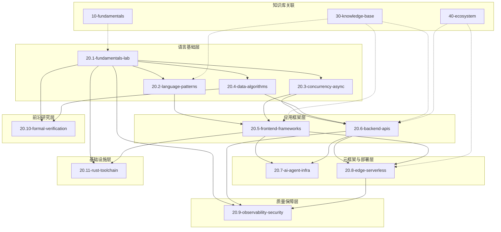

# 20-code-lab 交叉引用索引

> 代码实验室模块与新架构目录的对应关系，以及模块间依赖拓扑图。

---

## 目录结构

| 模块 | 路径 | 说明 | 关联知识库 |
|------|------|------|-----------|
| **语言核心** | `20.1-fundamentals-lab/` | 类型系统、变量、控制流、函数 | `10-fundamentals/10.2-type-system/`, `10.1-language-semantics/` |
| **设计模式** | `20.2-language-patterns/` | 架构模式、设计模式、全栈模式 | `30-knowledge-base/30.1-guides/` |
| **并发异步** | `20.3-concurrency-async/` | Promise、Async/Await、Workers、事件循环 | `10-fundamentals/10.3-execution-model/` |
| **数据与算法** | `20.4-data-algorithms/` | 数据结构、算法、性能优化 | `30-knowledge-base/30.3-comparison-matrices/` |
| **前端框架** | `20.5-frontend-frameworks/` | React、Vue、组件、渲染 | `30-knowledge-base/30.10-en/signals-paradigm.md` |
| **后端 API** | `20.6-backend-apis/` | 数据库、GraphQL、微服务、网关 | `30-knowledge-base/decision-trees.md` |
| **AI Agent 基础设施** | `20.7-ai-agent-infra/` | MCP、A2A、Agent 模式、LLM 集成 | `30-knowledge-base/30.2-categories/` |
| **边缘计算** | `20.8-edge-serverless/` | Cloudflare、Deno Deploy、Serverless | `30-knowledge-base/30.4-backend/` |
| **可观测性** | `20.9-observability-security/` | 监控、安全、调试、混沌工程 | `30-knowledge-base/30.5-diagrams/` |
| **形式化验证** | `20.10-formal-verification/` | 类型理论、语义学、区块链 | `10-fundamentals/10.7-academic-frontiers/` |
| **Rust 工具链** | `20.11-rust-toolchain/` | SWC、Oxc、编译器设计 | `30-knowledge-base/30.10-en/rust-toolchain-migration.md` |
| **免构建 TypeScript** | `20.12-build-free-typescript/` | Node.js 类型剥离、Deno、Bun 原生 TS | `10-fundamentals/10.2-type-system/` |
| **边缘数据库** | `20.13-edge-databases/` | D1、Turso、Neon、Vercel Postgres、KV | `30-knowledge-base/30.4-backend/` |

---

## 交叉引用索引表

### 语言核心 → 基础理论

| 代码实验文件 | 对应理论文件 | 主题 |
|-------------|-------------|------|
| `20.1-fundamentals-lab/language-core/01-types/generics.ts` | `10-fundamentals/10.2-type-system/structural-subtyping.md` | 泛型约束与结构子类型 |
| `20.1-fundamentals-lab/language-core/02-variables/declarations.ts` | `10-fundamentals/10.1-language-semantics/execution-context.md` | 变量提升与执行上下文 |
| `20.1-fundamentals-lab/language-core/03-control-flow/conditionals.ts` | `10-fundamentals/10.3-execution-model/event-loop.md` | 控制流与事件循环 |
| `20.1-fundamentals-lab/language-core/04-functions/arrow-functions.ts` | `10-fundamentals/10.1-language-semantics/closure-formalization.md` | 箭头函数与闭包内存模型 |

### 并发异步 → 执行模型

| 代码实验文件 | 对应理论文件 | 主题 |
|-------------|-------------|------|
| `20.3-concurrency-async/01-promises/microtask-queue.js` | `10-fundamentals/10.3-execution-model/job-queue.md` | Microtask vs Macrotask |
| `20.3-concurrency-async/03-workers/shared-array-buffer.ts` | `10-fundamentals/10.3-execution-model/memory-model.md` | SharedArrayBuffer 与 Atomics |
| `20.3-concurrency-async/04-event-loop/libuv-deep-dive.js` | `10-fundamentals/10.3-execution-model/node-event-loop.md` | libuv 事件循环阶段 |

### 前端框架 → 框架理论

| 代码实验文件 | 对应理论文件 | 主题 |
|-------------|-------------|------|
| `20.5-frontend-frameworks/01-react/concurrent-features.jsx` | `30-knowledge-base/30.10-en/compositing-priority-theorem.md` | 并发渲染与合成优先级 |
| `20.5-frontend-frameworks/03-solid/fine-grained-reactivity.jsx` | `30-knowledge-base/30.10-en/signals-paradigm.md` | Signals 与细粒度更新 |
| `20.5-frontend-frameworks/05-svelte/runes-demo.svelte` | `30-knowledge-base/30.10-en/signals-paradigm.md` | Svelte 5 Runes 实现 |

### Rust 工具链 → 编译器理论

| 代码实验文件 | 对应理论文件 | 主题 |
|-------------|-------------|------|
| `20.11-rust-toolchain/01-swc-plugin/transform.rs` | `30-knowledge-base/30.10-en/rust-toolchain-migration.md` | SWC 插件架构与 AST 转换 |
| `20.11-rust-toolchain/02-oxc-parser/benchmark.js` | `30-knowledge-base/30.3-comparison-matrices/build-tools-compare.md` | Oxc 解析器基准测试 |
| `20.11-rust-toolchain/03-napi-rs/native-bridge.rs` | `30-knowledge-base/30.10-en/rust-toolchain-migration.md` | Node.js 与 Rust 互操作 |

---

## 模块依赖拓扑图



### 依赖方向约定

| 箭头方向 | 含义 |
|---------|------|
| `A --> B` | A 是 B 的**前置知识**，学习 B 前建议先完成 A |
| `A -.-> B` | A 是 B 的**理论支撑**，B 的代码实验验证 A 的理论 |

---

## 学习路径推荐

### 路径一：全栈应用开发 (3-4 个月)

```
20.1-fundamentals-lab → 20.2-language-patterns → 20.3-concurrency-async
        ↓
20.5-frontend-frameworks → 20.7-ai-agent-infra
        ↓
20.6-backend-apis → 20.8-edge-serverless → 20.9-observability-security
```

### 路径二：编译器与工具链 (4-6 个月)

```
20.1-fundamentals-lab → 20.4-data-algorithms → 20.10-formal-verification
        ↓
20.11-rust-toolchain → 10-fundamentals/10.6-ecmascript-spec
```

### 路径三：性能与架构专家 (2-3 个月)

```
20.1-fundamentals-lab → 20.3-concurrency-async → 20.4-data-algorithms
        ↓
20.5-frontend-frameworks → 20.6-backend-apis → 20.9-observability-security
```

---

## 与知识库关联

每个模块均配有 `THEORY.md` 理论文档，位于模块根目录。理论与实践形成闭环：

```
20-code-lab/20.X-topic/
├── THEORY.md          # 理论说明
├── examples/            # 代码示例
└── exercises/           # 练习题
```

### 快速导航

| 想了解 | 去这里 |
|--------|--------|
| JavaScript 执行模型原理 | `10-fundamentals/10.3-execution-model/` |
| TypeScript 类型系统深度 | `10-fundamentals/10.2-type-system/` |
| 框架选型决策 | `30-knowledge-base/decision-trees.md` |
| 最新生态趋势数据 | `data/trend-report-2026-04-27.md` |
| Rust 工具链迁移指南 | `30-knowledge-base/30.10-en/rust-toolchain-migration.md` |
| Signals 响应式范式 | `30-knowledge-base/30.10-en/signals-paradigm.md` |
| 浏览器合成定理 | `30-knowledge-base/30.10-en/compositing-priority-theorem.md` |
| V8 JIT 安全分析 | `30-knowledge-base/30.10-en/jit-security-tension.md` |
| 类型模块化定理 | `30-knowledge-base/30.10-en/type-modularity-theorem.md` |

---

## 代码示例：模块初始化脚手架

```typescript
// scaffold-module.ts — 快速创建新的 code-lab 模块

import { mkdir, writeFile } from 'fs/promises';
import { join } from 'path';

interface ModuleConfig {
  id: string;
  name: string;
  description: string;
  prerequisites: string[];
}

async function scaffoldModule(config: ModuleConfig) {
  const baseDir = join('20-code-lab', `${config.id}-${config.name}`);

  await mkdir(join(baseDir, 'examples'), { recursive: true });
  await mkdir(join(baseDir, 'exercises'), { recursive: true });

  await writeFile(
    join(baseDir, 'THEORY.md'),
    `# ${config.name}\n\n> **定位**：\`20-code-lab/${config.id}-${config.name}/\`\n> **关联**：${config.prerequisites.map(p => `\`${p}\``).join(' | ')}\n\n## 核心理论\n\n[待补充]\n\n## 设计原理\n\n[待补充]\n\n## 实践映射\n\n### 代码示例\n\n\`\`\`typescript\n// 第一个代码示例\n\`\`\`\n\n---\n\n*本 THEORY.md 遵循 JS/TS 全景知识库的理论-实践闭环原则。*\n`
  );

  console.log(`✅ 模块 ${config.id}-${config.name} 脚手架创建完成`);
}

// 使用示例
// scaffoldModule({ id: '20.12', name: 'build-free-typescript', description: '无构建工具 TS', prerequisites: ['20.1-fundamentals-lab'] });
```

## 代码示例：自动化交叉引用校验

```typescript
// validate-cross-references.ts — 检查所有 THEORY.md 中的链接有效性

import { glob } from 'glob';
import { readFile } from 'fs/promises';
import { existsSync } from 'fs';

interface BrokenLink {
  file: string;
  line: number;
  link: string;
}

async function validateCrossReferences(): Promise<BrokenLink[]> {
  const broken: BrokenLink[] = [];
  const files = await glob('20-code-lab/**/THEORY.md');

  for (const file of files) {
    const content = await readFile(file, 'utf-8');
    const lines = content.split('\n');

    for (let i = 0; i < lines.length; i++) {
      // 匹配相对路径链接
      const matches = lines[i].match(/\]\((\.\.\/[^)]+)\)/g);
      if (!matches) continue;

      for (const match of matches) {
        const link = match.slice(2, -1); // 提取路径
        const resolved = new URL(link, `file://${file}`).pathname;
        if (!existsSync(resolved)) {
          broken.push({ file, line: i + 1, link });
        }
      }
    }
  }

  return broken;
}

// validateCrossReferences().then(links => {
//   if (links.length === 0) console.log('✅ 所有交叉引用有效');
//   else links.forEach(l => console.log(`❌ ${l.file}:${l.line} → ${l.link}`));
// });
```

## 代码示例：学习路径进度追踪器

```typescript
// learning-tracker.ts — 追踪个人学习进度
interface ModuleProgress {
  moduleId: string;
  completed: boolean;
  theoryRead: boolean;
  exercisesDone: number;
  totalExercises: number;
}

class LearningTracker {
  private progress = new Map<string, ModuleProgress>();

  loadFromStorage(): void {
    const raw = localStorage.getItem('jsts-learning-progress');
    if (raw) {
      const data = JSON.parse(raw) as ModuleProgress[];
      data.forEach((p) => this.progress.set(p.moduleId, p));
    }
  }

  saveToStorage(): void {
    localStorage.setItem('jsts-learning-progress', JSON.stringify([...this.progress.values()]));
  }

  markTheoryRead(moduleId: string): void {
    const p = this.progress.get(moduleId) ?? { moduleId, completed: false, theoryRead: false, exercisesDone: 0, totalExercises: 0 };
    p.theoryRead = true;
    this.progress.set(moduleId, p);
    this.saveToStorage();
  }

  markExerciseComplete(moduleId: string): void {
    const p = this.progress.get(moduleId)!;
    p.exercisesDone++;
    if (p.exercisesDone >= p.totalExercises && p.theoryRead) {
      p.completed = true;
    }
    this.saveToStorage();
  }

  getCompletionRate(): number {
    if (this.progress.size === 0) return 0;
    const completed = [...this.progress.values()].filter((p) => p.completed).length;
    return Math.round((completed / this.progress.size) * 100);
  }
}
```

## 代码示例：依赖拓扑排序（学习顺序生成）

```typescript
// topo-sort-learning-path.ts — 根据前置依赖生成学习顺序
type ModuleNode = {
  id: string;
  prerequisites: string[];
};

function topoSort(modules: ModuleNode[]): string[] {
  const adj = new Map<string, string[]>();
  const inDegree = new Map<string, number>();

  for (const m of modules) {
    if (!inDegree.has(m.id)) inDegree.set(m.id, 0);
    for (const pre of m.prerequisites) {
      if (!adj.has(pre)) adj.set(pre, []);
      adj.get(pre)!.push(m.id);
      inDegree.set(m.id, (inDegree.get(m.id) ?? 0) + 1);
    }
  }

  const queue = modules.filter((m) => (inDegree.get(m.id) ?? 0) === 0).map((m) => m.id);
  const result: string[] = [];

  while (queue.length) {
    const curr = queue.shift()!;
    result.push(curr);
    for (const next of adj.get(curr) ?? []) {
      const newDegree = (inDegree.get(next) ?? 0) - 1;
      inDegree.set(next, newDegree);
      if (newDegree === 0) queue.push(next);
    }
  }

  if (result.length !== inDegree.size) {
    throw new Error('Cycle detected in module dependencies');
  }

  return result;
}

// 示例：生成 20-code-lab 学习顺序
// const order = topoSort([
//   { id: '20.1', prerequisites: [] },
//   { id: '20.2', prerequisites: ['20.1'] },
//   { id: '20.3', prerequisites: ['20.1'] },
//   { id: '20.4', prerequisites: ['20.1'] },
//   { id: '20.5', prerequisites: ['20.2', '20.3'] },
// ]);
```

---

## 权威链接

- [ECMA-262 Specification](https://262.ecma-international.org/15.0/) — JavaScript 语言规范，所有语言核心实验的终极依据。
- [TypeScript Handbook](https://www.typescriptlang.org/docs/handbook/intro.html) — 类型系统实验的官方参考。
- [Node.js Documentation](https://nodejs.org/docs/latest/api/) — 后端 API 与事件循环实验的参考。
- [React Documentation](https://react.dev/) — 前端框架实验的官方指南。
- [MDN Web Docs](https://developer.mozilla.org/) — Web API、JavaScript 和 CSS 的权威文档。
- [WebKit Blog](https://webkit.org/blog/) — 渲染引擎与性能优化深度文章。
- [V8 Blog](https://v8.dev/blog) — JIT、垃圾回收与运行时优化。
- [Rust Book](https://doc.rust-lang.org/book/) — Rust 工具链实验的语言基础。
- [SWC Documentation](https://swc.rs/docs/getting-started) — 编译器插件开发指南。
- [Deno Documentation](https://docs.deno.com/) — Deno 运行时与标准库参考。
- [Bun Documentation](https://bun.sh/docs) — Bun 运行时、包管理与构建工具。
- [TC39 Proposals](https://github.com/tc39/proposals) — ECMAScript  Stage-0 到 Stage-4 提案跟踪。
- [W3C Standards](https://www.w3.org/standards/) — Web 平台标准规范总览。
- [WHATWG Living Standards](https://spec.whatwg.org/) — HTML、DOM、Streams 等活标准。
- [Node.js Design Patterns](https://nodejs.org/en/docs/guides/) — Node.js 官方设计模式与最佳实践指南
- [Google JavaScript Style Guide](https://google.github.io/styleguide/jsguide.html) — Google JS 编码规范
- [Airbnb JavaScript Style Guide](https://github.com/airbnb/javascript) — 社区最流行的 JS 风格指南
- [JavaScript.Info](https://javascript.info/) — 现代 JavaScript 教程（开源）
- [ExploringJS — Deep JavaScript](https://exploringjs.com/deep-js/) — Dr. Axel Rauschmayer 深度 JavaScript 书籍
- [Patterns.dev](https://www.patterns.dev/) — 现代 Web 应用设计模式（开源书籍）
- [Refactoring Guru](https://refactoring.guru/) — 设计模式与重构交互式教程
- [GitHub — Build your own X](https://github.com/codecrafters-io/build-your-own-x) — 从零实现各类技术的教程集合
- [The Architecture of Open Source Applications](http://www.aosabook.org/) — 开源软件架构深度分析

---

## 模块依赖矩阵

| 模块 | 前置依赖 | 后续进阶 | 知识库关联 |
|------|---------|---------|-----------|
| 20.1-fundamentals-lab | — | 20.2, 20.3, 20.4 | 10-fundamentals |
| 20.2-language-patterns | 20.1 | 20.5, 20.6 | 30.1-guides |
| 20.3-concurrency-async | 20.1 | 20.5, 20.6, 20.8 | 10.3-execution-model |
| 20.4-data-algorithms | 20.1 | 20.6, 20.10 | 30.3-comparison-matrices |
| 20.5-frontend-frameworks | 20.2, 20.3 | 20.7, 20.8 | 30.10-en/signals-paradigm |
| 20.6-backend-apis | 20.3, 20.4 | 20.7, 20.8, 20.9 | decision-trees.md |
| 20.7-ai-agent-infra | 20.1, 20.5 | 20.8, 20.9 | 30.2-categories |
| 20.8-edge-serverless | 20.5, 20.6 | 20.9 | 30.4-backend |
| 20.9-observability-security | 20.1, 20.6, 20.8 | — | 30.5-diagrams |
| 20.10-formal-verification | 20.1, 20.4 | — | 10.7-academic-frontiers |
| 20.11-rust-toolchain | 20.1, 20.5 | — | 30.10-en/rust-toolchain-migration |
| 20.12-build-free-typescript | 20.1 | — | 10-fundamentals |
| 20.13-edge-databases | 20.4, 20.6 | — | 30.4-backend |

---

## 更多权威参考

- [ECMA-262 — ECMAScript Language Specification](https://262.ecma-international.org/)
- [TypeScript Handbook](https://www.typescriptlang.org/docs/handbook/intro.html)
- [Node.js Documentation](https://nodejs.org/docs/latest/api/)
- [React Documentation](https://react.dev/)
- [MDN Web Docs](https://developer.mozilla.org/)

*最后更新: 2026-04-30*
