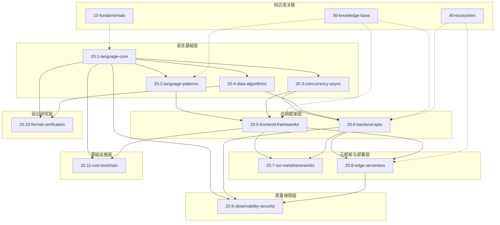

# 20-code-lab 交叉引用索引

> 代码实验室模块与新架构目录的对应关系，以及模块间依赖拓扑图。

---

## 目录结构

| 模块 | 路径 | 说明 | 关联知识库 |
|------|------|------|-----------|
| **语言核心** | `20.1-language-core/` | 类型系统、变量、控制流、函数 | `10-fundamentals/10.2-type-system/`, `10.1-language-semantics/` |
| **设计模式** | `20.2-language-patterns/` | 架构模式、设计模式、全栈模式 | `30-knowledge-base/30.1-guides/` |
| **并发异步** | `20.3-concurrency-async/` | Promise、Async/Await、Workers、事件循环 | `10-fundamentals/10.3-execution-model/` |
| **数据与算法** | `20.4-data-algorithms/` | 数据结构、算法、性能优化 | `30-knowledge-base/30.3-comparison-matrices/` |
| **前端框架** | `20.5-frontend-frameworks/` | React、Vue、组件、渲染 | `30-knowledge-base/30.10-en/signals-paradigm.md` |
| **后端 API** | `20.6-backend-apis/` | 数据库、GraphQL、微服务、网关 | `30-knowledge-base/decision-trees.md` |
| **SSR 元框架** | `20.7-ssr-metaframeworks/` | Next.js、Nuxt、Astro | `30-knowledge-base/30.2-categories/` |
| **边缘计算** | `20.8-edge-serverless/` | Cloudflare、Deno Deploy、Serverless | `30-knowledge-base/30.4-backend/` |
| **可观测性** | `20.9-observability-security/` | 监控、安全、调试、混沌工程 | `30-knowledge-base/30.5-diagrams/` |
| **形式化验证** | `20.10-formal-verification/` | 类型理论、语义学、区块链 | `10-fundamentals/10.7-academic-frontiers/` |
| **Rust 工具链** | `20.11-rust-toolchain/` | SWC、Oxc、编译器设计 | `30-knowledge-base/30.10-en/rust-toolchain-migration.md` |

---

## 交叉引用索引表

### 语言核心 → 基础理论

| 代码实验文件 | 对应理论文件 | 主题 |
|-------------|-------------|------|
| `20.1-language-core/01-type-system/generics-constraints.ts` | `10-fundamentals/10.2-type-system/structural-subtyping.md` | 泛型约束与结构子类型 |
| `20.1-language-core/02-variable-system/hoisting-demo.js` | `10-fundamentals/10.1-language-semantics/execution-context.md` | 变量提升与执行上下文 |
| `20.1-language-core/03-control-flow/async-iteration.ts` | `10-fundamentals/10.3-execution-model/event-loop.md` | 异步迭代与事件循环 |
| `20.1-language-core/04-functions/closure-memory.js` | `10-fundamentals/10.1-language-semantics/closure-formalization.md` | 闭包内存模型 |

### 并发异步 → 执行模型

| 代码实验文件 | 对应理论文件 | 主题 |
|-------------|-------------|------|
| `20.3-concurrency-async/01-promises/microtask-queue.js` | `10-fundamentals/10.3-execution-model/job-queue.md` | Microtask vs Macrotask |
| `20.3-concurrency-async/03-workers/shared-array-buffer.ts` | `10-fundamentals/10.3-execution-model/memory-model.md` | SharedArrayBuffer 与 Atomics |
| `20.3-concurrency-async/04-event-loop/libuv-deep-dive.js` | `10-fundamentals/10.3-execution-model/node-event-loop.md` | libuv 事件循环阶段 |

### 前端框架 → 框架理论

| 代码实验文件 | 对应理论文件 | 主题 |
|-------------|-------------|------|
| `20.5-frontend-frameworks/01-react/concurrent-features.jsx` | `30-knowledge-base/30.10-en/compositing-priority-theorem.md` | 并发渲染与合成优先级 |
| `20.5-frontend-frameworks/03-solid/fine-grained-reactivity.jsx` | `30-knowledge-base/30.10-en/signals-paradigm.md` | Signals 与细粒度更新 |
| `20.5-frontend-frameworks/05-svelte/runes-demo.svelte` | `30-knowledge-base/30.10-en/signals-paradigm.md` | Svelte 5 Runes 实现 |

### Rust 工具链 → 编译器理论

| 代码实验文件 | 对应理论文件 | 主题 |
|-------------|-------------|------|
| `20.11-rust-toolchain/01-swc-plugin/transform.rs` | `30-knowledge-base/30.10-en/rust-toolchain-migration.md` | SWC 插件架构与 AST 转换 |
| `20.11-rust-toolchain/02-oxc-parser/benchmark.js` | `30-knowledge-base/30.3-comparison-matrices/build-tools-compare.md` | Oxc 解析器基准测试 |
| `20.11-rust-toolchain/03-napi-rs/native-bridge.rs` | `30-knowledge-base/30.10-en/rust-toolchain-migration.md` | Node.js 与 Rust 互操作 |

---

## 模块依赖拓扑图



### 依赖方向约定

| 箭头方向 | 含义 |
|---------|------|
| `A --> B` | A 是 B 的**前置知识**，学习 B 前建议先完成 A |
| `A -.-> B` | A 是 B 的**理论支撑**，B 的代码实验验证 A 的理论 |

---

## 学习路径推荐

### 路径一：全栈应用开发 (3-4 个月)

```
20.1-language-core → 20.2-language-patterns → 20.3-concurrency-async
        ↓
20.5-frontend-frameworks → 20.7-ssr-metaframeworks
        ↓
20.6-backend-apis → 20.8-edge-serverless → 20.9-observability-security
```

### 路径二：编译器与工具链 (4-6 个月)

```
20.1-language-core → 20.4-data-algorithms → 20.10-formal-verification
        ↓
20.11-rust-toolchain → 10-fundamentals/10.6-ecmascript-spec
```

### 路径三：性能与架构专家 (2-3 个月)

```
20.1-language-core → 20.3-concurrency-async → 20.4-data-algorithms
        ↓
20.5-frontend-frameworks → 20.6-backend-apis → 20.9-observability-security
```

---

## 与知识库关联

每个模块均配有 `THEORY.md` 理论文档，位于模块根目录。理论与实践形成闭环：

```
20-code-lab/20.X-topic/
├── THEORY.md          # 理论说明
├── examples/            # 代码示例
└── exercises/           # 练习题
```

### 快速导航

| 想了解 | 去这里 |
|--------|--------|
| JavaScript 执行模型原理 | `10-fundamentals/10.3-execution-model/` |
| TypeScript 类型系统深度 | `10-fundamentals/10.2-type-system/` |
| 框架选型决策 | `30-knowledge-base/decision-trees.md` |
| 最新生态趋势数据 | `data/trend-report-2026-04-27.md` |
| Rust 工具链迁移指南 | `30-knowledge-base/30.10-en/rust-toolchain-migration.md` |
| Signals 响应式范式 | `30-knowledge-base/30.10-en/signals-paradigm.md` |
| 浏览器合成定理 | `30-knowledge-base/30.10-en/compositing-priority-theorem.md` |
| V8 JIT 安全分析 | `30-knowledge-base/30.10-en/jit-security-tension.md` |
| 类型模块化定理 | `30-knowledge-base/30.10-en/type-modularity-theorem.md` |

---

## 权威链接

- [ECMA-262 Specification](https://262.ecma-international.org/15.0/) — JavaScript 语言规范，所有语言核心实验的终极依据。
- [TypeScript Handbook](https://www.typescriptlang.org/docs/handbook/intro.html) — 类型系统实验的官方参考。
- [Node.js Documentation](https://nodejs.org/docs/latest/api/) — 后端 API 与事件循环实验的参考。
- [React Documentation](https://react.dev/) — 前端框架实验的官方指南。
- [MDN Web Docs](https://developer.mozilla.org/) — Web API、JavaScript 和 CSS 的权威文档。
- [WebKit Blog](https://webkit.org/blog/) — 渲染引擎与性能优化深度文章。
- [V8 Blog](https://v8.dev/blog) — JIT、垃圾回收与运行时优化。
- [Rust Book](https://doc.rust-lang.org/book/) — Rust 工具链实验的语言基础。
- [SWC Documentation](https://swc.rs/docs/getting-started) — 编译器插件开发指南。

---

*最后更新: 2026-04-29*
