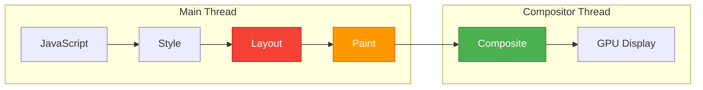

# Theorem 4: Compositing Priority Theorem

> **English Summary** of `10-fundamentals/10.1-language-semantics/theorems/compositing-priority-theorem.md`

---

## One-Sentence Summary

CSS properties that trigger only the Compositing phase—specifically `transform` and `opacity`—achieve visually equivalent animations to geometry-changing properties while bypassing Layout and Paint, enabling smooth 60fps motion even when the main thread is fully occupied by JavaScript execution.

## Key Points

- **Pipeline Skipping**: `transform: translate()` skips both Layout and Paint phases, executing entirely on the Compositor Thread with GPU acceleration, whereas `top`/`left` animations force the full five-stage pipeline.
- **Main Thread Independence**: Because Compositor Thread operates independently of the main thread, transform-based animations survive main-thread blocking events such as long-running JavaScript tasks, DOM mutations, and garbage collection pauses.
- **Frame Budget Reality**: At 60fps, each frame has a 16.6ms budget; after accounting for browser overhead, only ~10ms remains for JavaScript and rendering. Full-pipeline animations consume 8-12ms, leaving no margin; compositor-only animations consume <2ms.
- **Visual Equivalence**: From the user's perceptual perspective, `translateX(100px)` and `left: 100px` produce identical displacement; the difference is entirely in implementation efficiency.
- **Strategic Generalization**: The theorem extends beyond animation to all rendering strategy decisions—`content-visibility: auto` for off-screen content, virtual scrolling for large lists, and debounced input handling all derive from the same pipeline-minimization principle.

## Browser Compositing Pipeline Diagram

The following diagram illustrates the five-stage browser rendering pipeline and which CSS properties trigger each stage:



### CSS Property Trigger Matrix

| CSS Property | Layout | Paint | Composite | Typical Cost |
|-------------|--------|-------|-----------|-------------|
| `transform` | No | No | **Yes** | ~0.1-0.5ms |
| `opacity` | No | No | **Yes** | ~0.1-0.3ms |
| `filter` | No | **Yes** | Yes | ~1-3ms |
| `width`, `height` | **Yes** | Yes | Yes | ~5-15ms |
| `top`, `left` | **Yes** | Yes | Yes | ~5-12ms |
| `margin`, `padding` | **Yes** | Yes | Yes | ~4-10ms |
| `background-color` | No | **Yes** | Yes | ~2-5ms |
| `box-shadow` | No | **Yes** | Yes | ~3-8ms |
| `border-radius` | No | **Yes** | Yes | ~1-4ms |

*Cost estimates are representative for a medium-complexity desktop viewport; actual values vary by device, DOM size, and paint complexity.*

## Code Example: `will-change` Optimization

The `will-change` CSS property provides a hint to the browser that an element will be animated, allowing it to promote the element to its own compositor layer ahead of time:

```css
/* Promote element to compositor layer before animation starts */
.animated-card {
  will-change: transform, opacity;
  transform: translateZ(0); /* Fallback for older browsers */
}

/* Remove will-change after animation completes to free GPU memory */
.animated-card.animation-complete {
  will-change: auto;
}
```

```javascript
// JavaScript utility to manage will-change lifecycle
class CompositorLayerManager {
  constructor(element) {
    this.element = element;
  }

  promote(properties = ['transform', 'opacity']) {
    // Hint the browser to prepare compositor layers
    this.element.style.willChange = properties.join(', ');

    // Force layer creation by reading a composited property
    void this.element.offsetHeight; // Force reflow
  }

  demote() {
    // Release GPU memory after animation ends
    this.element.style.willChange = 'auto';
  }

  animate(keyframes, options) {
    this.promote(Object.keys(keyframes[0] || {}));
    const animation = this.element.animate(keyframes, options);
    animation.onfinish = () => this.demote();
    return animation;
  }
}

// Usage
const card = document.querySelector('.card');
const layerManager = new CompositorLayerManager(card);

layerManager.animate(
  [
    { transform: 'translateX(0px)', opacity: 1 },
    { transform: 'translateX(300px)', opacity: 0.8 }
  ],
  { duration: 500, easing: 'ease-in-out' }
);
```

### DevTools Performance Analysis

```javascript
// Measure pipeline phase costs using Performance API
function measureRenderingCost() {
  const start = performance.now();

  // Force layout (Reflow)
  const width = document.body.offsetWidth;

  const layoutEnd = performance.now();

  // Force paint
  document.body.style.backgroundColor =
    document.body.style.backgroundColor === 'red' ? 'blue' : 'red';

  const paintEnd = performance.now();

  console.log({
    layoutCost: layoutEnd - start,
    paintCost: paintEnd - layoutEnd,
    totalCost: paintEnd - start
  });
}
```

### FLIP Animation Technique

```typescript
// flip-animation.ts — 高性能布局动画：First, Last, Invert, Play
export class FLIPAnimator {
  private element: HTMLElement;

  constructor(element: HTMLElement) {
    this.element = element;
  }

  // 1. 记录初始状态（First）
  captureFirst(): DOMRect {
    return this.element.getBoundingClientRect();
  }

  // 2. 应用变更后记录最终状态（Last），计算差值（Invert），执行动画（Play）
  animateTo(newRect: DOMRect, firstRect: DOMRect, duration = 300) {
    const invertX = firstRect.left - newRect.left;
    const invertY = firstRect.top - newRect.top;
    const invertScaleX = firstRect.width / newRect.width;
    const invertScaleY = firstRect.height / newRect.height;

    // 立即将元素“倒回”原位置（使用 transform，不触发 Layout）
    this.element.style.transform = `translate(${invertX}px, ${invertY}px) scale(${invertScaleX}, ${invertScaleY})`;

    // 强制同步布局，确保浏览器应用 invert transform
    void this.element.offsetHeight;

    // 移除 transform，浏览器会使用 GPU 动画平滑过渡到最终状态
    this.element.style.transition = `transform ${duration}ms cubic-bezier(0.2, 0, 0.2, 1)`;
    this.element.style.transform = '';

    // 动画结束后清理
    const cleanup = () => {
      this.element.style.transition = '';
      this.element.removeEventListener('transitionend', cleanup);
    };
    this.element.addEventListener('transitionend', cleanup);
  }
}

// 使用示例：列表重新排序时的平滑过渡
async function animateReorder(listItem: HTMLElement, targetIndex: number) {
  const flip = new FLIPAnimator(listItem);
  const first = flip.captureFirst();

  // 执行 DOM 变更（可能导致布局变化）
  listItem.parentElement?.insertBefore(listItem, listItem.parentElement.children[targetIndex]);

  const last = listItem.getBoundingClientRect();
  flip.animateTo(last, first, 250);
}
```

### CSS Containment 优化

```css
/* containment.css — 限制布局/样式/绘制的影响范围 */
.list-container {
  /* 严格 containment：子树的布局不影响外部，外部也不影响内部 */
  contain: strict;

  /* 或更细粒度控制 */
  contain: layout paint style;
}

/* 大型列表使用 content-visibility 延迟离屏内容渲染 */
.virtual-list-item {
  content-visibility: auto;
  contain-intrinsic-size: 0 80px; /* 预估高度防止滚动跳动 */
}
```

```typescript
// content-visibility-polyfill.ts — 渐进增强内容可见性
function setupContentVisibility(containerSelector: string, itemSelector: string) {
  if (!CSS.supports('content-visibility', 'auto')) {
    // 降级：使用 IntersectionObserver 按需加载
    const observer = new IntersectionObserver((entries) => {
      for (const entry of entries) {
        (entry.target as HTMLElement).style.visibility = entry.isIntersecting ? 'visible' : 'hidden';
      }
    }, { rootMargin: '200px' });

    document.querySelectorAll(itemSelector).forEach((el) => observer.observe(el));
  }
}
```

## Detailed Explanation

The Compositing Priority Theorem formalizes an insight that every frontend engineer intuitively practices but rarely explicitly states: the browser's rendering pipeline is not a monolithic process but a cascade of discrete stages with dramatically different computational costs, and smart rendering strategy consists of pushing work to the cheapest eligible stage. The five-stage pipeline—JavaScript → Style → Layout → Paint → Composite—operates under a strict frame budget of 16.6ms at 60fps. In practice, browser bookkeeping consumes 4-6ms, leaving approximately 10ms for application code and rendering. A geometry-changing animation that triggers Layout (Reflow) can consume 8-12ms of this budget by itself, leaving zero headroom for JavaScript execution and guaranteeing frame drops under any realistic workload.

The theorem's proof rests on two axioms. The **Five-Stage Pipeline Axiom** establishes that different CSS properties mutate different stages: geometric properties (`width`, `height`, `top`, `left`) force Layout recalculation; visual properties (`color`, `background`, `box-shadow`) force Paint recomputation; compositing properties (`transform`, `opacity`) mutate only the final Composite stage. The **Independent Compositor Thread Axiom** establishes that the Composite stage runs on a separate thread with its own GPU context, making it immune to main-thread saturation. From these axioms, the theorem derives its central inequality: the computational cost of a compositing-only animation is strictly less than the cost of an equivalent geometry-changing animation, with the additional property that the former's cost is isolated from main-thread contention.

The engineering significance extends far beyond individual animation choices. The theorem justifies a complete taxonomy of interaction strategies: high-frequency animations (scrolling, dragging) must use only `transform` and `opacity`; content changes should leverage `content-visibility: auto` to defer Layout and Paint for off-screen elements; complex lists require virtualization to minimize the DOM node count subject to Style calculation; and user input should be handled with debouncing and CSS transitions to prevent main-thread blocking. These strategies are not independent optimizations but corollaries of a single principle—**minimize the number and scope of pipeline stages triggered per frame**—that the Compositing Priority Theorem elevates from folklore to formal reasoning.

## Authoritative Links

- [Chromium Rendering Pipeline Overview](https://www.chromium.org/developers/design-documents/rendering/) — Official Chromium project documentation on the rendering architecture.
- [Blink Rendering Pipeline](https://docs.google.com/document/d/1bo1Y4XVH3qEaYlXOLKOqoE8dtiqXDiI-2FDBHb4H7tw) — Google Doc detailing the Blink engine's compositing strategy.
- [CSS Triggers](https://csstriggers.com/) — Comprehensive reference showing which CSS properties trigger Layout, Paint, or Composite in each browser.
- [MDN: will-change](https://developer.mozilla.org/en-US/docs/Web/CSS/will-change) — Mozilla documentation on the `will-change` optimization property.
- [High Performance Animations](https://www.html5rocks.com/en/tutorials/speed/high-performance-animations/) — Google HTML5 Rocks guide to GPU-accelerated animations.
- [Chrome DevTools: Performance Analysis](https://developer.chrome.com/docs/devtools/performance/) — Official guide to profiling rendering performance.
- [web.dev — Rendering Performance](https://web.dev/articles/rendering-performance) — Comprehensive guide to the browser rendering pipeline.
- [web.dev — Avoid Large, Complex Layouts](https://web.dev/articles/avoid-large-complex-layouts-and-layout-thrashing) — Techniques to minimize layout thrashing.
- [web.dev — CSS Containment](https://web.dev/articles/content-visibility) — Using `content-visibility` and `contain` for performance.
- [MDN: contain](https://developer.mozilla.org/en-US/docs/Web/CSS/contain) — CSS containment property reference.
- [MDN: content-visibility](https://developer.mozilla.org/en-US/docs/Web/CSS/content-visibility) — content-visibility property reference.
- [Paul Lewis — FLIP Your Animations](https://aerotwist.com/blog/flip-your-animations/) — Original article on the FLIP technique.
- [Google Web Fundamentals — Animations](https://developers.google.com/web/fundamentals/design-and-ux/animations) — Best practices for web animations.
- [Surma — Inside Browser Rendering](https://www.youtube.com/watch?v=SmE4OwHztCc) — Deep dive into browser rendering internals.

---

*English summary. Full Chinese theorem with proof tree: `../../10-fundamentals/10.1-language-semantics/theorems/compositing-priority-theorem.md`*
