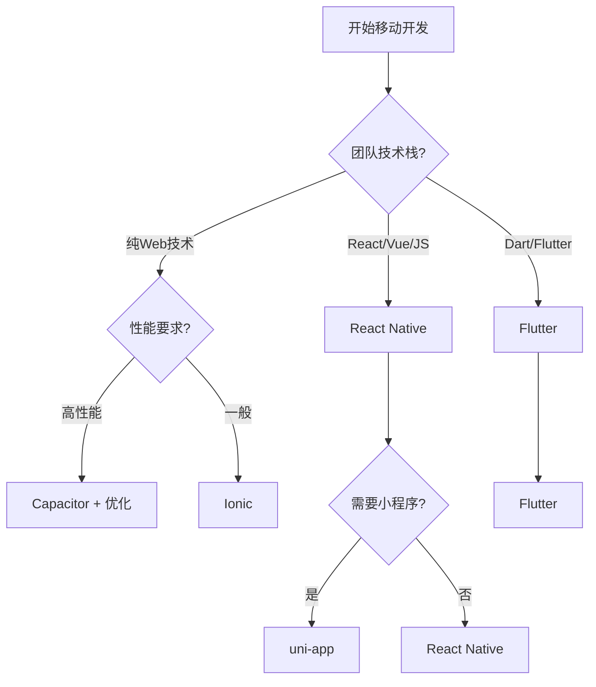

> **⚠️ 维度边界说明**
>
> 本文档属于 **框架/库分类索引**，汇总移动端与桌面端开发框架。更详细的应用层开发指南请参见：
>
> - `docs/platforms/MOBILE_DEVELOPMENT.md` — 移动端开发完全指南
> - `docs/platforms/DESKTOP_DEVELOPMENT.md` — 桌面端开发指南
> - `docs/application-domains-index.md` — 应用领域总索引
> - `examples/mobile-react-native-expo/` — 移动端示例
> - `examples/desktop-tauri-react/` — 桌面端示例

# 移动端开发库分类

> 跨平台移动应用开发框架与工具汇总

---

## 目录

- [移动端开发库分类](#移动端开发库分类)
  - [目录](#目录)
  - [React Native 生态](#react-native-生态)
    - [react-native](#react-native)
    - [expo](#expo)
    - [react-navigation](#react-navigation)
    - [react-native-elements](#react-native-elements)
    - [react-native-paper](#react-native-paper)
    - [react-native-reanimated](#react-native-reanimated)
  - [Flutter 生态](#flutter-生态)
    - [flutter](#flutter)
  - [混合方案](#混合方案)
    - [ionic](#ionic)
    - [capacitor](#capacitor)
    - [cordova](#cordova)
  - [跨平台框架](#跨平台框架)
    - [nativescript](#nativescript)
    - [weex](#weex)
    - [uni-app](#uni-app)
  - [桌面端混合](#桌面端混合)
    - [electron](#electron)
    - [tauri](#tauri)
    - [react-native-windows](#react-native-windows)
    - [react-native-macos](#react-native-macos)
  - [框架对比](#框架对比)
    - [移动端跨平台框架对比](#移动端跨平台框架对比)
    - [桌面端框架对比](#桌面端框架对比)
  - [选择建议](#选择建议)
    - [移动端开发选型](#移动端开发选型)
    - [桌面端开发选型](#桌面端开发选型)
  - [相关资源](#相关资源)
    - [官方文档](#官方文档)
    - [社区资源](#社区资源)

---

## React Native 生态

### react-native

| 属性 | 详情 |
|------|------|
| **Stars** | 120k+ ⭐ |
| **GitHub** | [facebook/react-native](https://github.com/facebook/react-native) |
| **官网** | [reactnative.dev](https://reactnative.dev/) |
| **TS支持** | ✅ 完全支持 |
| **创建时间** | 2015年1月 |
| **维护者** | Meta (Facebook) |

**描述**: 使用 React 构建原生应用的框架，支持 iOS 和 Android 平台。采用原生组件渲染，提供接近原生的性能和用户体验。

**特点**:

- 🎯 使用 JavaScript/TypeScript 和 React 开发
- 🎨 原生组件渲染，平台特定外观
- ♻️ 代码复用率 80-90%
- 🔥 热重载支持
- 📱 新架构 (Fabric/TurboModules) 提升性能
- 🌐 社区支持 Windows、macOS、Web 等平台

**适用场景**: 需要原生性能、已有 React 团队、需与 Web 共享代码的项目

**React Native 新架构 TurboModule 调用示例：**

```typescript
// App.tsx — 使用新架构的 TurboModules
import { useState, useEffect } from 'react';
import { View, Text, Button } from 'react-native';

// 自动桥接的 TurboModule（C++ 层）
import NativeCalendarModule from './NativeCalendarModule';

interface CalendarEvent {
  id: string;
  title: string;
  startDate: number;
}

export default function CalendarScreen() {
  const [events, setEvents] = useState<CalendarEvent[]>([]);

  useEffect(() => {
    // 同步或异步调用原生模块
    NativeCalendarModule.getAllEvents().then(setEvents);
  }, []);

  const createEvent = async () => {
    const newEvent = await NativeCalendarModule.createEvent(
      'Team Standup',
      Date.now(),
      Date.now() + 30 * 60 * 1000
    );
    setEvents(prev => [...prev, newEvent]);
  };

  return (
    <View>
      <Text>Events: {events.length}</Text>
      {events.map(e => (
        <Text key={e.id}>{e.title}</Text>
      ))}
      <Button title="Add Event" onPress={createEvent} />
    </View>
  );
}
```

---

### expo

| 属性 | 详情 |
|------|------|
| **Stars** | 36k+ ⭐ |
| **GitHub** | [expo/expo](https://github.com/expo/expo) |
| **官网** | [expo.dev](https://expo.dev/) |
| **TS支持** | ✅ 完全支持 |
| **创建时间** | 2016年8月 |
| **维护者** | Expo 团队 |

**描述**: React Native 的通用开发平台，提供完整的开发工具链、托管服务和丰富的原生模块库。

**特点**:

- 🚀 零配置快速开始
- 📦 内置 100+ 原生模块
- ☁️ Expo Application Services (EAS) 云服务
- 🔄 Over-the-Air (OTA) 更新
- 🛠️ 开发客户端实时预览
- 📱 支持 iOS、Android、Web

**适用场景**: 快速原型开发、小型到中型应用、无需原生代码的纯 JS 项目

**Expo Router 文件系统路由示例：**

```typescript
// app/(tabs)/index.tsx — 自动注册为 Tab 路由
import { View, Text, FlatList } from 'react-native';
import { useRouter } from 'expo-router';

export default function HomeScreen() {
  const router = useRouter();

  return (
    <View>
      <Text>Home</Text>
      <FlatList
        data={[{ id: '1', title: 'Item 1' }]}
        renderItem={({ item }) => (
          <Text
            onPress={() =>
              router.push({
                pathname: '/details/[id]',
                params: { id: item.id },
              })
            }
          >
            {item.title}
          </Text>
        )}
      />
    </View>
  );
}

// app/details/[id].tsx — 动态路由
import { useLocalSearchParams } from 'expo-router';

export default function DetailScreen() {
  const { id } = useLocalSearchParams<{ id: string }>();
  return <Text>Detail ID: {id}</Text>;
}
```

---

### react-navigation

| 属性 | 详情 |
|------|------|
| **Stars** | 23k+ ⭐ |
| **GitHub** | [react-navigation/react-navigation](https://github.com/react-navigation/react-navigation) |
| **官网** | [reactnavigation.org](https://reactnavigation.org/) |
| **TS支持** | ✅ 完全支持 |

**描述**: React Native 的事实标准导航解决方案，提供栈导航、标签导航、抽屉导航等多种导航模式。

**特点**:

- 🧭 声明式导航配置
- 🎨 深度自定义主题和过渡动画
- 🔗 深度链接支持
- 📱 原生手势处理
- 🧩 模块化设计，按需使用
- 🔒 与 react-native-screens 集成提升性能

**React Navigation 类型安全路由配置：**

```typescript
// navigation/types.ts
import type { NativeStackScreenProps } from '@react-navigation/native-stack';

export type RootStackParamList = {
  Home: undefined;
  Profile: { userId: string };
  Settings: { section?: 'account' | 'privacy' };
};

export type HomeProps = NativeStackScreenProps<RootStackParamList, 'Home'>;
export type ProfileProps = NativeStackScreenProps<RootStackParamList, 'Profile'>;

// navigation/AppNavigator.tsx
import { NavigationContainer } from '@react-navigation/native';
import { createNativeStackNavigator } from '@react-navigation/native-stack';
import { RootStackParamList } from './types';

const Stack = createNativeStackNavigator<RootStackParamList>();

export default function AppNavigator() {
  return (
    <NavigationContainer>
      <Stack.Navigator initialRouteName="Home">
        <Stack.Screen name="Home" component={HomeScreen} />
        <Stack.Screen
          name="Profile"
          component={ProfileScreen}
          options={({ route }) => ({ title: `User ${route.params.userId}` })}
        />
      </Stack.Navigator>
    </NavigationContainer>
  );
}
```

---

### react-native-elements

| 属性 | 详情 |
|------|------|
| **Stars** | 24k+ ⭐ |
| **GitHub** | [react-native-elements/react-native-elements](https://github.com/react-native-elements/react-native-elements) |
| **官网** | [reactnativeelements.com](https://reactnativeelements.com/) |
| **TS支持** | ✅ 完全支持 |

**描述**: 跨平台的 React Native UI 组件库，提供一致的设计语言和丰富的可定制组件。

**特点**:

- 🎨 平台一致的 UI 组件
- 🌙 内置深色模式支持
- 🔧 高度可定制主题系统
- 📦 包含 Button、Card、Input、ListItem 等常用组件
- ♿ 可访问性支持

---

### react-native-paper

| 属性 | 详情 |
|------|------|
| **Stars** | 13k+ ⭐ |
| **GitHub** | [callstack/react-native-paper](https://github.com/callstack/react-native-paper) |
| **官网** | [reactnativepaper.com](https://reactnativepaper.com/) |
| **TS支持** | ✅ 完全支持 |
| **维护者** | Callstack |

**描述**: 遵循 Material Design 规范的 React Native 组件库，提供高质量的 UI 组件和主题支持。

**特点**:

- 📐 遵循 Google Material Design 3
- 🎭 动态主题色彩支持
- 🔄 支持 Material You 动态配色
- 📱 内置底部导航、FAB、卡片、对话框等组件
- ♿ RTL 和可访问性完整支持

---

### react-native-reanimated

| 属性 | 详情 |
|------|------|
| **Stars** | 9k+ ⭐ |
| **GitHub** | [software-mansion/react-native-reanimated](https://github.com/software-mansion/react-native-reanimated) |
| **官网** | [docs.swmansion.com/react-native-reanimated](https://docs.swmansion.com/react-native-reanimated/) |
| **TS支持** | ✅ 完全支持 |
| **维护者** | Software Mansion |

**描述**: React Native 的高性能动画库，重新实现了 Animated API，支持复杂手势驱动的动画。

**特点**:

- ⚡ 工作在 UI 线程，流畅 60-120 FPS
- 🤲 与 react-native-gesture-handler 完美配合
- 📝 声明式 API，支持共享值
- 🎨 布局动画、进入/退出动画
- 🔄 Reanimated 4 支持新架构
- 📱 Shared Element Transitions 支持

**Reanimated 3 Worklet 动画示例：**

```typescript
import Animated, {
  useSharedValue,
  useAnimatedStyle,
  withSpring,
  withRepeat,
  withSequence,
  interpolate,
} from 'react-native-reanimated';
import { Gesture, GestureDetector } from 'react-native-gesture-handler';

export default function SwipeableCard() {
  const offset = useSharedValue(0);
  const rotation = useSharedValue(0);

  const gesture = Gesture.Pan()
    .onChange((event) => {
      offset.value = event.translationX;
      rotation.value = interpolate(
        event.translationX,
        [-200, 0, 200],
        [-15, 0, 15]
      );
    })
    .onEnd(() => {
      if (Math.abs(offset.value) > 120) {
        // 滑出屏幕
        offset.value = withSpring(Math.sign(offset.value) * 500);
      } else {
        // 复位
        offset.value = withSpring(0);
        rotation.value = withSpring(0);
      }
    });

  const animatedStyle = useAnimatedStyle(() => ({
    transform: [
      { translateX: offset.value },
      { rotateZ: `${rotation.value}deg` },
    ],
  }));

  return (
    <GestureDetector gesture={gesture}>
      <Animated.View style={[styles.card, animatedStyle]}>
        <Text>Swipe me!</Text>
      </Animated.View>
    </GestureDetector>
  );
}
```

---

## Flutter 生态

### flutter

| 属性 | 详情 |
|------|------|
| **Stars** | 166k+ ⭐ |
| **GitHub** | [flutter/flutter](https://github.com/flutter/flutter) |
| **官网** | [flutter.dev](https://flutter.dev/) |
| **语言** | Dart |
| **创建时间** | 2017年 |
| **维护者** | Google |

**描述**: Google 的 UI 工具包，用于从单一代码库构建精美的移动、Web 和桌面应用。使用 Dart 语言和自渲染引擎。

**特点**:

- 🎨 自渲染引擎 (Skia/Impeller)，UI 高度一致
- ⚡ 接近原生性能，AOT 编译
- ♻️ 100% 代码复用率
- 🎯 丰富的内置 Widget 库
- 🔥 热重载支持
- 📱 支持 iOS、Android、Web、Windows、macOS、Linux
- 🎬 强大的动画支持

**适用场景**: 高度定制化 UI、复杂动画、多平台统一体验的项目

**注意**: Flutter 使用 Dart 语言而非 JavaScript，但与 JS 生态密切相关，是跨平台开发的重要选择。

**Flutter 状态管理与 Riverpod 示例：**

```dart
// providers/user_provider.dart
import 'package:riverpod/riverpod.dart';

@riverpod
class UserNotifier extends _$UserNotifier {
  @override
  Future<User> build(String userId) async {
    final dio = ref.read(dioProvider);
    final response = await dio.get('/users/$userId');
    return User.fromJson(response.data);
  }

  Future<void> updateProfile(String name) async {
    state = const AsyncLoading();
    try {
      final updated = await ref.read(userRepositoryProvider).updateName(name);
      state = AsyncData(updated);
    } catch (err, stack) {
      state = AsyncError(err, stack);
    }
  }
}

// widgets/user_profile.dart
class UserProfile extends ConsumerWidget {
  const UserProfile({super.key, required this.userId});
  final String userId;

  @override
  Widget build(BuildContext context, WidgetRef ref) {
    final userAsync = ref.watch(userNotifierProvider(userId));

    return userAsync.when(
      data: (user) => Text(user.name),
      loading: () => const CircularProgressIndicator(),
      error: (err, _) => Text('Error: $err'),
    );
  }
}
```

---

## 混合方案

### ionic

| 属性 | 详情 |
|------|------|
| **Stars** | 51k+ ⭐ |
| **GitHub** | [ionic-team/ionic-framework](https://github.com/ionic-team/ionic-framework) |
| **官网** | [ionicframework.com](https://ionicframework.com/) |
| **TS支持** | ✅ 完全支持 |
| **创建时间** | 2013年 |

**描述**: 基于 Web 技术（HTML、CSS、JavaScript）的跨平台移动应用开发框架，使用 WebView 渲染。

**特点**:

- 🌐 基于标准 Web 技术
- 🎨 丰富的 UI 组件库
- 📱 支持 iOS、Android、PWA
- 🔌 与 Capacitor 或 Cordova 集成访问原生功能
- 🅰️ 支持 Angular、React、Vue
- ☁️ Ionic Appflow 云服务

**适用场景**: Web 开发者转型移动开发、需要快速开发 PWA 和移动应用

---

### capacitor

| 属性 | 详情 |
|------|------|
| **Stars** | 12k+ ⭐ |
| **GitHub** | [ionic-team/capacitor](https://github.com/ionic-team/capacitor) |
| **官网** | [capacitorjs.com](https://capacitorjs.com/) |
| **TS支持** | ✅ 完全支持 |

**描述**: 现代的原生 WebView 容器，将 Web 应用打包为原生应用，是 Cordova 的现代替代品。

**特点**:

- 🚀 现代化架构，TypeScript 优先
- 📦 原生 API 访问通过插件系统
- 🔒 更好的安全模型
- 🎯 原生项目作为一等公民
- 📱 支持 iOS、Android、PWA
- 🔄 实时重新加载开发模式

**Capacitor 自定义原生插件（TypeScript + Swift/Kotlin）示例：**

```typescript
// src/definitions.ts
export interface EchoPlugin {
  echo(options: { value: string }): Promise<{ value: string }>;
}

// src/web.ts
import { WebPlugin } from '@capacitor/core';
import type { EchoPlugin } from './definitions';

export class EchoWeb extends WebPlugin implements EchoPlugin {
  async echo(options: { value: string }) {
    console.log('ECHO', options.value);
    return options;
  }
}
```

---

### cordova

| 属性 | 详情 |
|------|------|
| **Stars** | 3k+ ⭐ |
| **GitHub** | [apache/cordova](https://github.com/apache/cordova) |
| **官网** | [cordova.apache.org](https://cordova.apache.org/) |
| **TS支持** | ✅ 支持 |
| **维护者** | Apache 软件基金会 |

**描述**: Apache Cordova 是历史悠久的移动应用开发框架，允许使用 Web 技术构建应用。

**特点**:

- 🌐 最早的 Web-to-Mobile 框架之一
- 🔌 丰富的插件生态系统
- 📱 支持多平台
- ⚠️ 目前主要维护模式，推荐使用 Capacitor 替代

---

## 跨平台框架

### nativescript

| 属性 | 详情 |
|------|------|
| **Stars** | 24k+ ⭐ |
| **GitHub** | [NativeScript/NativeScript](https://github.com/NativeScript/NativeScript) |
| **官网** | [nativescript.org](https://nativescript.org/) |
| **TS支持** | ✅ 完全支持 |

**描述**: 使用 JavaScript/TypeScript 构建真正的原生移动应用，直接调用原生 API，无需 WebView。

**特点**:

- 📱 直接访问 100% 原生平台 API
- ⚡ 原生性能，无 WebView 开销
- 🅰️ 支持 Angular、Vue、React、Svelte
- 🎨 CSS 样式支持
- 🔌 丰富的插件市场
- ♻️ 代码共享 Web 和移动端

---

### weex

| 属性 | 详情 |
|------|------|
| **Stars** | 13k+ ⭐ |
| **GitHub** | [apache/incubator-weex](https://github.com/apache/incubator-weex) |
| **官网** | [weex.apache.org](https://weex.apache.org/) |
| **TS支持** | ✅ 支持 |
| **维护者** | Apache 基金会 (孵化中) |

**描述**: 阿里巴巴开源的跨平台移动开发框架，支持 Vue 语法，生成原生渲染的应用。

**特点**:

- 🌐 使用 Vue.js 语法
- 📱 原生渲染，非 WebView
- ♻️ 一次编写，三端运行 (Web、iOS、Android)
- ⚠️ 目前处于 Apache 孵化器状态，活跃度降低

---

### uni-app

| 属性 | 详情 |
|------|------|
| **Stars** | 41k+ ⭐ |
| **GitHub** | [dcloudio/uni-app](https://github.com/dcloudio/uni-app) |
| **官网** | [uniapp.dcloud.net.cn](https://uniapp.dcloud.net.cn/) |
| **TS支持** | ✅ 完全支持 |
| **维护者** | DCloud |

**描述**: 基于 Vue.js 的跨平台开发框架，支持编译到 iOS、Android、H5、以及各种小程序平台。

**特点**:

- 🌐 基于 Vue.js 2/3
- 📱 一次开发，多端发布
- 🔄 支持微信小程序、支付宝小程序、百度小程序等
- 💰 丰富的插件市场和云服务
- 🛠️ HBuilderX IDE 深度集成
- 🇨🇳 国内生态丰富

---

## 桌面端混合

### electron

| 属性 | 详情 |
|------|------|
| **Stars** | 113k+ ⭐ |
| **GitHub** | [electron/electron](https://github.com/electron/electron) |
| **官网** | [electronjs.org](https://www.electronjs.org/) |
| **TS支持** | ✅ 完全支持 |
| **创建时间** | 2013年 |
| **维护者** | GitHub |

**描述**: 使用 Web 技术构建跨平台桌面应用的框架，捆绑 Chromium 和 Node.js。

**特点**:

- 🌐 完整的 Web 技术栈支持
- 💻 支持 Windows、macOS、Linux
- 🔌 完整的 Node.js API 访问
- 🎨 丰富的应用案例 (VS Code、Slack、Discord)
- 📦 electron-builder 打包工具
- ⚠️ 应用体积较大 (80-150MB)，内存占用较高

**适用场景**: 复杂桌面应用、已有 Web 代码需要桌面化、功能丰富的 IDE 类应用

**Electron 主进程与渲染进程安全通信示例：**

```typescript
// src/main/preload.ts
import { contextBridge, ipcRenderer } from 'electron';

contextBridge.exposeInMainWorld('electronAPI', {
  openFile: () => ipcRenderer.invoke('dialog:openFile'),
  onFileOpened: (callback: (path: string) => void) =>
    ipcRenderer.on('file:opened', (_event, path) => callback(path)),
});

// src/main/index.ts
import { app, BrowserWindow, dialog, ipcMain } from 'electron';

ipcMain.handle('dialog:openFile', async () => {
  const { canceled, filePaths } = await dialog.showOpenDialog({
    properties: ['openFile'],
    filters: [{ name: 'Images', extensions: ['jpg', 'png', 'gif'] }],
  });
  if (!canceled) return filePaths[0];
  return null;
});

// src/renderer/App.tsx
declare global {
  interface Window {
    electronAPI: {
      openFile: () => Promise<string | null>;
      onFileOpened: (cb: (path: string) => void) => void;
    };
  }
}

export default function App() {
  const handleOpen = async () => {
    const path = await window.electronAPI.openFile();
    if (path) console.log('Selected:', path);
  };
  return <button onClick={handleOpen}>Open File</button>;
}
```

---

### tauri

| 属性 | 详情 |
|------|------|
| **Stars** | 89k+ ⭐ |
| **GitHub** | [tauri-apps/tauri](https://github.com/tauri-apps/tauri) |
| **官网** | [tauri.app](https://tauri.app/) |
| **TS支持** | ✅ 完全支持 (前端) |
| **创建时间** | 2019年7月 |
| **语言** | Rust (后端) |

**描述**: 使用 Web 前端和 Rust 后端构建小巧、快速、安全的桌面应用框架。

**特点**:

- 📦 极小的应用体积 (2-10MB)
- ⚡ 低内存占用 (30-50MB)
- 🔒 安全的架构设计
- 🦀 Rust 后端，类型安全
- 🌐 使用系统原生 WebView
- 📱 支持 Windows、macOS、Linux、iOS、Android
- 🚀 快速启动 (< 500ms)

**适用场景**: 对应用体积和性能敏感、需要现代安全架构、愿意学习 Rust

**Tauri v2 命令系统与权限模型示例：**

```rust
// src-tauri/src/lib.rs
use tauri::Manager;

#[tauri::command]
async fn greet(name: String, app: tauri::AppHandle) -> Result<String, String> {
    let app_dir = app.path().app_data_dir().map_err(|e| e.to_string())?;
    Ok(format!("Hello {}, data dir: {:?}", name, app_dir))
}

#[cfg_attr(mobile, tauri::mobile_entry_point)]
pub fn run() {
    tauri::Builder::default()
        .plugin(tauri_plugin_shell::init())
        .invoke_handler(tauri::generate_handler![greet])
        .run(tauri::generate_context!())
        .expect("error while running tauri application");
}
```

```typescript
// src/App.tsx
import { invoke } from '@tauri-apps/api/core';

export default function App() {
  const handleGreet = async () => {
    const response = await invoke<string>('greet', { name: 'Tauri' });
    console.log(response);
  };
  return <button onClick={handleGreet}>Greet</button>;
}
```

---

### react-native-windows

| 属性 | 详情 |
|------|------|
| **GitHub** | [microsoft/react-native-windows](https://github.com/microsoft/react-native-windows) |
| **官网** | [microsoft.github.io/react-native-windows](https://microsoft.github.io/react-native-windows/) |
| **TS支持** | ✅ 完全支持 |
| **维护者** | Microsoft |

**描述**: 将 React Native 带到 Windows 平台的官方实现，支持 Windows 10+ 和 Xbox。

**特点**:

- 🪟 原生 Windows 组件支持
- 🎮 Xbox 支持
- 🔧 与 WinUI 2/3 集成
- ⚡ 原生性能
- 📱 与 React Native 代码共享

---

### react-native-macos

| 属性 | 详情 |
|------|------|
| **GitHub** | [microsoft/react-native-macos](https://github.com/microsoft/react-native-macos) |
| **官网** | [microsoft.github.io/react-native-windows](https://microsoft.github.io/react-native-windows/) |
| **TS支持** | ✅ 完全支持 |
| **维护者** | Microsoft |

**描述**: 将 React Native 带到 macOS 平台的官方实现。

**特点**:

- 🍎 原生 macOS 组件支持
- 🎨 遵循 macOS 设计规范
- 🔧 与 Cocoa 集成
- ⚡ 原生性能
- 📱 与 iOS React Native 代码高度共享

---

## 框架对比

### 移动端跨平台框架对比

| 框架 | 语言 | 渲染方式 | 性能 | 生态 | 适用场景 |
|------|------|----------|------|------|----------|
| **React Native** | JS/TS | 原生组件 | ⭐⭐⭐⭐ | ⭐⭐⭐⭐⭐ | 已有 JS 团队、需原生体验 |
| **Flutter** | Dart | 自渲染引擎 | ⭐⭐⭐⭐⭐ | ⭐⭐⭐⭐ | 高度定制 UI、复杂动画 |
| **Ionic** | JS/TS | WebView | ⭐⭐⭐ | ⭐⭐⭐⭐ | Web 开发者、快速原型 |
| **NativeScript** | JS/TS | 原生组件 | ⭐⭐⭐⭐ | ⭐⭐⭐ | 需直接访问原生 API |
| **uni-app** | Vue | WebView/原生 | ⭐⭐⭐ | ⭐⭐⭐⭐ | 小程序+App 多端发布 |

### 桌面端框架对比

| 框架 | 前端技术 | 后端技术 | 包体积 | 内存占用 | 适用场景 |
|------|----------|----------|--------|----------|----------|
| **Electron** | Web | Node.js | 80-150MB | 150-300MB | 功能丰富的大型应用 |
| **Tauri** | Web | Rust | 2-10MB | 30-50MB | 轻量级、性能敏感应用 |
| **React Native Windows/macOS** | React Native | Native | 中等 | 中等 | 移动端扩展到桌面 |

---

## 选择建议

### 移动端开发选型



### 桌面端开发选型

- **Electron**: 适合功能复杂、开发周期短、对体积不敏感的应用
- **Tauri**: 适合追求小体积、高性能、高安全性的应用
- **React Native Windows/macOS**: 适合已有 React Native 移动应用扩展到桌面

---

## 相关资源

### 官方文档

- [React Native 官方文档](https://reactnative.dev/)
- [React Native New Architecture](https://reactnative.dev/docs/the-new-architecture/landing-page) — 新架构官方指南
- [Expo 文档](https://docs.expo.dev/)
- [Expo Router 文档](https://docs.expo.dev/router/introduction/) — 文件系统路由
- [React Navigation 文档](https://reactnavigation.org/)
- [React Native Reanimated 文档](https://docs.swmansion.com/react-native-reanimated/)
- [Flutter 官方文档](https://docs.flutter.dev/)
- [Flutter Riverpod 文档](https://riverpod.dev/)
- [Ionic 文档](https://ionicframework.com/docs)
- [Capacitor 文档](https://capacitorjs.com/docs)
- [Capacitor Plugin 开发指南](https://capacitorjs.com/docs/plugins/creating-plugins)
- [Tauri 文档](https://tauri.app/start/)
- [Tauri v2 Migration](https://v2.tauri.app/start/migrate/) — v2 迁移指南
- [Electron 文档](https://www.electronjs.org/docs/latest/)
- [Electron Security Best Practices](https://www.electronjs.org/docs/latest/tutorial/security)
- [NativeScript 文档](https://docs.nativescript.org/)
- [Apple Developer — iOS](https://developer.apple.com/ios/) — Apple 官方 iOS 开发资源
- [Android Developers](https://developer.android.com/) — Google 官方 Android 开发资源
- [Material Design 3](https://m3.material.io/) — Google Material Design 规范

### 社区资源

- [React Native 周刊](https://reactnative.cc/)
- [Flutter 中文社区](https://flutter.cn/)
- [NativeScript 中文文档](https://docs.nativescript.org/)
- [React Native Directory](https://reactnative.directory/) — 社区包目录
- [Expo Example Apps](https://github.com/expo/examples) — 官方示例集合

---

*最后更新: 2025年4月*


---

> 📦 **归档说明（2026-04-27）**
>
> 本文档与 `docs/platforms/MOBILE_DEVELOPMENT.md` 内容高度重叠。更详细的移动端开发内容请参见 **platforms/MOBILE_DEVELOPMENT.md**（3,500+ 行）。
>
> 本文档保留作为分类索引入口。
