<!--
# 合并说明
- 合并来源: docs/platforms/MOBILE_DEVELOPMENT.md（完整版，2959 行）
- 合并决策: 该文件为从旧架构迁移的完整副本，内容一致，保留于新架构 platforms/ 目录
- 合并时间: 2026-04-28
-->
---

last-updated: 2026-04-27
review-cycle: 6 months
next-review: 2026-10-27
status: current
---

# 移动端开发完全指南

> 涵盖 React Native、Flutter、混合应用、PWA 等移动开发技术的深度指南

---

## 目录

- [移动端开发完全指南](#移动端开发完全指南)
  - [目录](#目录)
  - [1. React Native 架构原理](#1-react-native-架构原理)
    - [1.1 概念解释](#11-概念解释)
      - [核心特点](#核心特点)
    - [1.2 架构图](#12-架构图)
    - [1.3 新架构（Fabric + TurboModules）](#13-新架构fabric--turbomodules)
    - [1.4 代码示例](#14-代码示例)
      - [基础组件示例](#基础组件示例)
    - [1.5 平台对比](#15-平台对比)
    - [1.6 iOS/Android 注意事项](#16-iosandroid-注意事项)
      - [iOS 特别注意事项](#ios-特别注意事项)
      - [Android 特别注意事项](#android-特别注意事项)
  - [2. Flutter vs React Native 对比](#2-flutter-vs-react-native-对比)
    - [2.1 概念解释](#21-概念解释)
      - [核心差异](#核心差异)
    - [2.2 架构对比图](#22-架构对比图)
    - [2.3 详细对比表](#23-详细对比表)
    - [2.4 代码示例](#24-代码示例)
      - [React Native 示例](#react-native-示例)
      - [Flutter 示例](#flutter-示例)
    - [2.5 选择建议](#25-选择建议)
  - [3. 混合应用（Ionic、Capacitor）](#3-混合应用ioniccapacitor)
    - [3.1 概念解释](#31-概念解释)
      - [主要框架](#主要框架)
    - [3.2 架构图](#32-架构图)
    - [3.3 代码示例](#33-代码示例)
      - [Ionic + Angular 示例](#ionic--angular-示例)
      - [Capacitor 配置](#capacitor-配置)
    - [3.4 平台对比](#34-平台对比)
    - [3.5 适用场景](#35-适用场景)
  - [4. PWA 在移动端的应用](#4-pwa-在移动端的应用)
    - [4.1 概念解释](#41-概念解释)
      - [核心特性](#核心特性)
    - [4.2 架构图](#42-架构图)
    - [4.3 代码示例](#43-代码示例)
      - [Web App Manifest](#web-app-manifest)
      - [Service Worker](#service-worker)
      - [PWA 注册和安装](#pwa-注册和安装)
    - [4.4 平台支持对比](#44-平台支持对比)
    - [4.5 iOS/Android 注意事项](#45-iosandroid-注意事项)
      - [iOS 特殊限制](#ios-特殊限制)
      - [Android 优化](#android-优化)
  - [5. 移动端性能优化](#5-移动端性能优化)
    - [5.1 概念解释](#51-概念解释)
      - [关键指标](#关键指标)
    - [5.2 性能架构图](#52-性能架构图)
    - [5.3 代码示例](#53-代码示例)
      - [React Native 性能优化](#react-native-性能优化)
      - [Flutter 性能优化](#flutter-性能优化)
    - [5.4 性能监控工具](#54-性能监控工具)
    - [5.5 平台对比](#55-平台对比)
  - [6. 原生模块桥接](#6-原生模块桥接)
    - [6.1 概念解释](#61-概念解释)
      - [桥接类型](#桥接类型)
    - [6.2 架构图](#62-架构图)
    - [6.3 代码示例](#63-代码示例)
      - [React Native 原生模块](#react-native-原生模块)
      - [iOS 原生实现](#ios-原生实现)
      - [Android 原生实现](#android-原生实现)
    - [6.4 Flutter Platform Channel](#64-flutter-platform-channel)
    - [6.5 平台对比](#65-平台对比)
  - [7. 移动端的离线存储](#7-移动端的离线存储)
    - [7.1 概念解释](#71-概念解释)
      - [存储方案](#存储方案)
    - [7.2 架构图](#72-架构图)
    - [7.3 代码示例](#73-代码示例)
      - [React Native 存储封装](#react-native-存储封装)
      - [SQLite 数据库封装](#sqlite-数据库封装)
      - [离线同步管理](#离线同步管理)
    - [7.4 平台对比](#74-平台对比)
  - [8. 推送通知](#8-推送通知)
    - [8.1 概念解释](#81-概念解释)
      - [推送类型](#推送类型)
    - [8.2 架构图](#82-架构图)
    - [8.3 代码示例](#83-代码示例)
      - [React Native 推送通知](#react-native-推送通知)
      - [iOS APNs 配置](#ios-apns-配置)
    - [8.4 平台对比](#84-平台对比)
  - [9. 应用发布流程](#9-应用发布流程)
    - [9.1 概念解释](#91-概念解释)
      - [发布渠道](#发布渠道)
    - [9.2 发布流程图](#92-发布流程图)
    - [9.3 代码示例](#93-代码示例)
      - [React Native 发布配置](#react-native-发布配置)
      - [自动化发布脚本](#自动化发布脚本)
    - [9.4 平台发布要求对比](#94-平台发布要求对比)
  - [10. 移动端安全考虑](#10-移动端安全考虑)
    - [10.1 概念解释](#101-概念解释)
      - [安全领域](#安全领域)
    - [10.2 安全架构图](#102-安全架构图)
    - [10.3 代码示例](#103-代码示例)
      - [安全存储实现](#安全存储实现)
      - [网络安全配置](#网络安全配置)
      - [设备安全检查](#设备安全检查)
    - [10.4 平台安全对比](#104-平台安全对比)
    - [10.5 安全最佳实践清单](#105-安全最佳实践清单)
  - [附录：iOS/Android 开发注意事项汇总](#附录iosandroid-开发注意事项汇总)
    - [iOS 特别注意事项](#ios-特别注意事项-1)
    - [Android 特别注意事项](#android-特别注意事项-1)

---

## 1. React Native 架构原理

### 1.1 概念解释

React Native 是 Facebook 开源的跨平台移动应用开发框架，使用 JavaScript 和 React 构建原生应用。

#### 核心特点

- **Learn Once, Write Anywhere**：一次学习，到处编写
- **原生渲染**：使用原生组件而非 WebView
- **热更新**：支持 JavaScript 代码的热更新
- **原生性能**：接近原生应用的性能表现

### 1.2 架构图

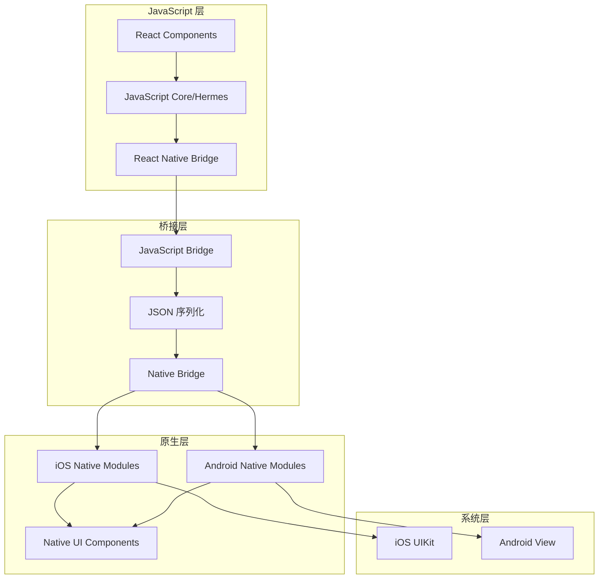

### 1.3 新架构（Fabric + TurboModules）

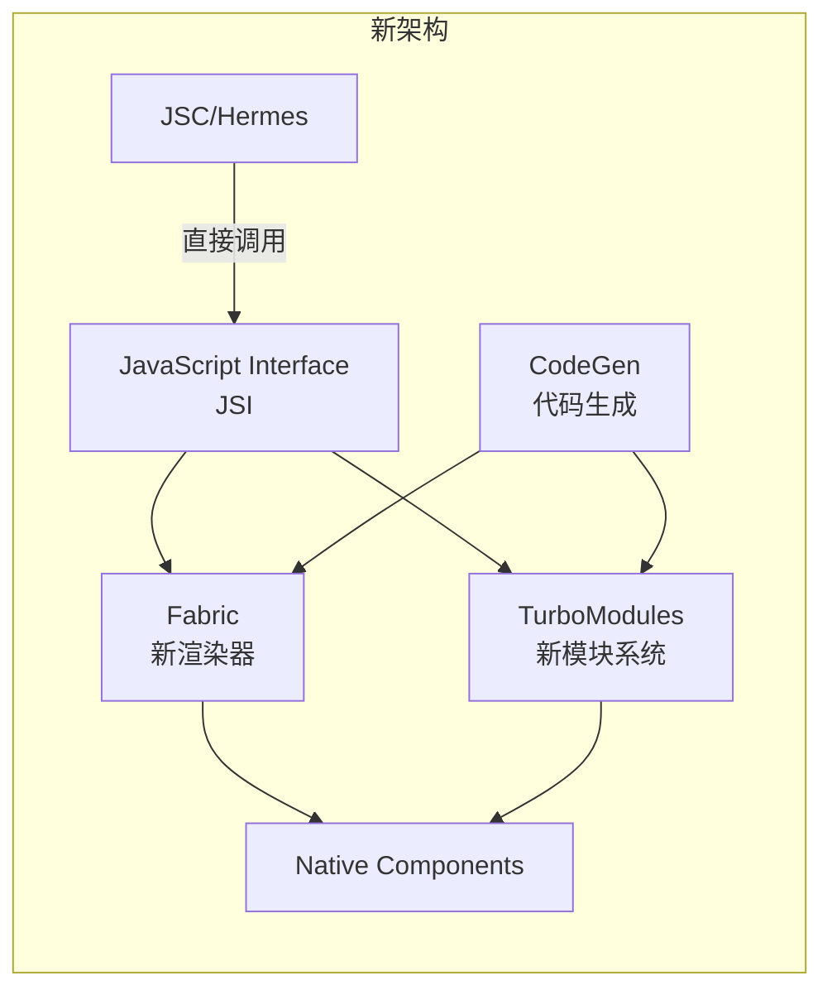

### 1.4 代码示例

#### 基础组件示例

```jsx
// App.js
import React, { useState, useEffect } from 'react';
import {
  View,
  Text,
  StyleSheet,
  TouchableOpacity,
  FlatList,
  Platform,
  StatusBar,
} from 'react-native';

// 平台适配组件
const PlatformButton = ({ onPress, title, style }) => {
  if (Platform.OS === 'ios') {
    return (
      <TouchableOpacity
        onPress={onPress}
        style={[styles.iosButton, style]}
        activeOpacity={0.8}
      >
        <Text style={styles.iosButtonText}>{title}</Text>
      </TouchableOpacity>
    );
  }

  return (
    <TouchableOpacity
      onPress={onPress}
      style={[styles.androidButton, style]}
      android_ripple={{ color: 'rgba(255,255,255,0.3)' }}
    >
      <Text style={styles.androidButtonText}>{title}</Text>
    </TouchableOpacity>
  );
};

// 主应用组件
export default function App() {
  const [data, setData] = useState([]);
  const [loading, setLoading] = useState(false);

  useEffect(() => {
    fetchData();
  }, []);

  const fetchData = async () => {
    setLoading(true);
    try {
      const response = await fetch('https://api.example.com/items');
      const json = await response.json();
      setData(json);
    } catch (error) {
      console.error(error);
    } finally {
      setLoading(false);
    }
  };

  const renderItem = ({ item }) => (
    <View style={styles.item}>
      <Text style={styles.itemTitle}>{item.title}</Text>
      <Text style={styles.itemDesc}>{item.description}</Text>
    </View>
  );

  return (
    <View style={styles.container}>
      <StatusBar
        barStyle={Platform.OS === 'ios' ? 'dark-content' : 'light-content'}
        backgroundColor={Platform.OS === 'android' ? '#2196F3' : 'transparent'}
      />

      <Text style={styles.header}>React Native 示例</Text>

      <PlatformButton
        title="刷新数据"
        onPress={fetchData}
        style={styles.refreshButton}
      />

      <FlatList
        data={data}
        renderItem={renderItem}
        keyExtractor={item => item.id.toString()}
        refreshing={loading}
        onRefresh={fetchData}
        contentContainerStyle={styles.list}
      />
    </View>
  );
}

const styles = StyleSheet.create({
  container: {
    flex: 1,
    backgroundColor: '#f5f5f5',
    paddingTop: Platform.OS === 'ios' ? 50 : StatusBar.currentHeight + 10,
  },
  header: {
    fontSize: 24,
    fontWeight: 'bold',
    textAlign: 'center',
    marginVertical: 20,
    color: '#333',
  },
  iosButton: {
    backgroundColor: '#007AFF',
    paddingVertical: 12,
    paddingHorizontal: 24,
    borderRadius: 10,
    marginHorizontal: 20,
  },
  iosButtonText: {
    color: 'white',
    fontSize: 16,
    fontWeight: '600',
    textAlign: 'center',
  },
  androidButton: {
    backgroundColor: '#2196F3',
    paddingVertical: 12,
    paddingHorizontal: 24,
    borderRadius: 4,
    elevation: 3,
    marginHorizontal: 20,
  },
  androidButtonText: {
    color: 'white',
    fontSize: 16,
    fontWeight: 'bold',
    textAlign: 'center',
  },
  refreshButton: {
    marginBottom: 20,
  },
  list: {
    paddingHorizontal: 16,
  },
  item: {
    backgroundColor: 'white',
    padding: 16,
    marginBottom: 12,
    borderRadius: 8,
    ...Platform.select({
      ios: {
        shadowColor: '#000',
        shadowOffset: { width: 0, height: 2 },
        shadowOpacity: 0.1,
        shadowRadius: 4,
      },
      android: {
        elevation: 3,
      },
    }),
  },
  itemTitle: {
    fontSize: 18,
    fontWeight: '600',
    color: '#333',
  },
  itemDesc: {
    fontSize: 14,
    color: '#666',
    marginTop: 4,
  },
});
```

### 1.5 平台对比

| 特性 | React Native | 原生开发 | Flutter |
|------|-------------|---------|---------|
| 开发语言 | JavaScript | Swift/Kotlin | Dart |
| 性能 | 接近原生 | 原生 | 接近原生 |
| 热更新 | 支持 | 不支持 | 部分支持 |
| 社区生态 | 丰富 | 丰富 | 活跃增长 |
| 学习曲线 | 中等 | 陡峭 | 中等 |

### 1.6 iOS/Android 注意事项

#### iOS 特别注意事项

```javascript
// 1. 处理刘海屏和安全区域
import { SafeAreaView, SafeAreaProvider } from 'react-native-safe-area-context';

<SafeAreaProvider>
  <SafeAreaView style={{ flex: 1 }}>
    <App />
  </SafeAreaView>
</SafeAreaProvider>

// 2. 处理回弹效果
<ScrollView bounces={false}> // 禁用回弹

// 3. 处理导航栏
import { useSafeAreaInsets } from 'react-native-safe-area-context';
const insets = useSafeAreaInsets();
// 使用 insets.top 避开状态栏
```

#### Android 特别注意事项

```javascript
// 1. 处理返回键
import { BackHandler } from 'react-native';

useEffect(() => {
  const backHandler = BackHandler.addEventListener(
    'hardwareBackPress',
    () => {
      // 处理返回逻辑
      return true; // 阻止默认行为
    }
  );
  return () => backHandler.remove();
}, []);

// 2. 处理权限请求
import { PermissionsAndroid } from 'react-native';

const requestCameraPermission = async () => {
  try {
    const granted = await PermissionsAndroid.request(
      PermissionsAndroid.PERMISSIONS.CAMERA,
      {
        title: '相机权限',
        message: '应用需要访问相机',
        buttonPositive: '允许',
        buttonNegative: '拒绝',
      }
    );
    return granted === PermissionsAndroid.RESULTS.GRANTED;
  } catch (err) {
    console.warn(err);
  }
};

// 3. 处理软键盘
import { KeyboardAvoidingView, Platform } from 'react-native';

<KeyboardAvoidingView
  behavior={Platform.OS === 'ios' ? 'padding' : 'height'}
  style={{ flex: 1 }}
>
  {/* 内容 */}
</KeyboardAvoidingView>
```

---

## 2. Flutter vs React Native 对比

### 2.1 概念解释

Flutter 是 Google 开发的 UI 工具包，使用 Dart 语言，通过自绘引擎实现跨平台开发。

#### 核心差异

- **渲染方式**：Flutter 自绘，React Native 桥接到原生
- **语言**：Flutter 使用 Dart，React Native 使用 JavaScript
- **架构**：Flutter 无桥接开销，React Native 依赖 Bridge

### 2.2 架构对比图

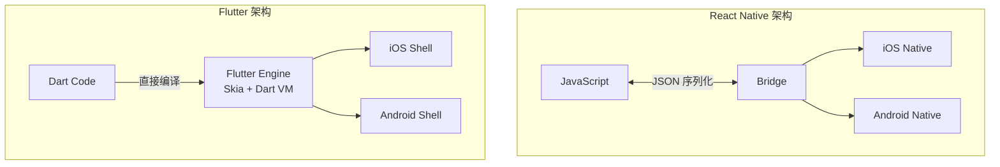

### 2.3 详细对比表

| 维度 | React Native | Flutter |
|------|-------------|---------|
| **发布年份** | 2015 | 2017 |
| **开发公司** | Meta (Facebook) | Google |
| **编程语言** | JavaScript | Dart |
| **架构** | Bridge 桥接 | 自绘引擎 |
| **性能** | 接近原生 | 接近/超越原生 |
| **包大小** | 较小 | 较大 (~4MB) |
| **热重载** | 支持 | 支持（更快） |
| **UI 一致性** | 依赖原生组件 | 完全一致 |
| **动画性能** | 60fps | 120fps |
| **Web 支持** | 原生支持 | 实验性支持 |
| **桌面支持** | 社区支持 | 官方支持 |

### 2.4 代码示例

#### React Native 示例

```jsx
// React Native 组件
import React, { useState } from 'react';
import { View, Text, TouchableOpacity, StyleSheet } from 'react-native';

export default function Counter() {
  const [count, setCount] = useState(0);

  return (
    <View style={styles.container}>
      <Text style={styles.text}>Count: {count}</Text>
      <TouchableOpacity
        style={styles.button}
        onPress={() => setCount(count + 1)}
      >
        <Text style={styles.buttonText}>Increment</Text>
      </TouchableOpacity>
    </View>
  );
}

const styles = StyleSheet.create({
  container: {
    flex: 1,
    justifyContent: 'center',
    alignItems: 'center',
  },
  text: {
    fontSize: 24,
    marginBottom: 20,
  },
  button: {
    backgroundColor: '#007AFF',
    padding: 15,
    borderRadius: 8,
  },
  buttonText: {
    color: 'white',
    fontSize: 16,
  },
});
```

#### Flutter 示例

```dart
// Flutter Widget
import 'package:flutter/material.dart';

void main() {
  runApp(const MyApp());
}

class MyApp extends StatelessWidget {
  const MyApp({Key? key}) : super(key: key);

  @override
  Widget build(BuildContext context) {
    return MaterialApp(
      title: 'Counter App',
      theme: ThemeData(
        primarySwatch: Colors.blue,
      ),
      home: const CounterPage(),
    );
  }
}

class CounterPage extends StatefulWidget {
  const CounterPage({Key? key}) : super(key: key);

  @override
  State<CounterPage> createState() => _CounterPageState();
}

class _CounterPageState extends State<CounterPage> {
  int _counter = 0;

  void _incrementCounter() {
    setState(() {
      _counter++;
    });
  }

  @override
  Widget build(BuildContext context) {
    return Scaffold(
      appBar: AppBar(
        title: const Text('Counter App'),
      ),
      body: Center(
        child: Column(
          mainAxisAlignment: MainAxisAlignment.center,
          children: <Widget>[
            const Text(
              'Count:',
              style: TextStyle(fontSize: 24),
            ),
            Text(
              '$_counter',
              style: Theme.of(context).textTheme.headlineMedium,
            ),
            const SizedBox(height: 20),
            ElevatedButton(
              onPressed: _incrementCounter,
              child: const Text('Increment'),
            ),
          ],
        ),
      ),
    );
  }
}
```

### 2.5 选择建议

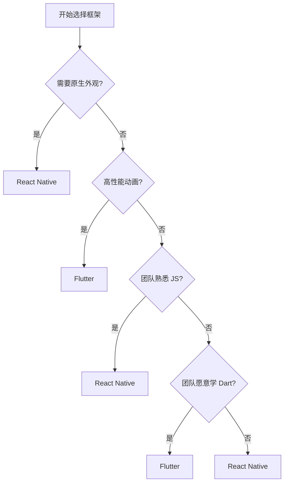

---

## 3. 混合应用（Ionic、Capacitor）

### 3.1 概念解释

混合应用使用 Web 技术（HTML/CSS/JavaScript）开发，通过 WebView 容器运行，结合原生插件访问设备功能。

#### 主要框架

- **Ionic**：基于 Angular/React/Vue 的 UI 框架
- **Capacitor**：现代混合应用运行时（Ionic 团队开发）
- **Cordova**：传统混合应用运行时

### 3.2 架构图

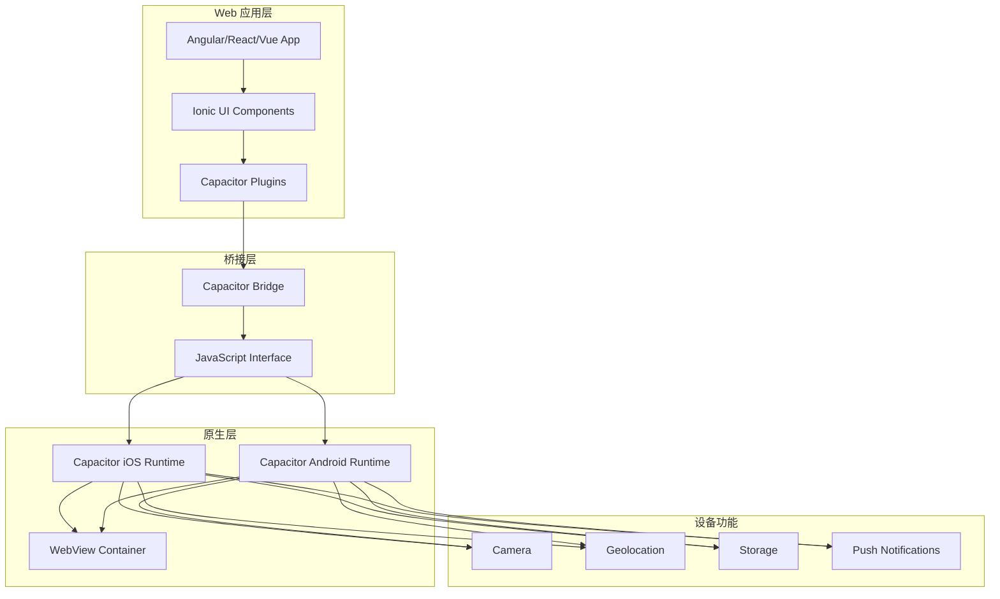

### 3.3 代码示例

#### Ionic + Angular 示例

```typescript
// app.component.ts
import { Component } from '@angular/core';
import { Platform } from '@ionic/angular';
import { SplashScreen } from '@capacitor/splash-screen';
import { StatusBar } from '@capacitor/status-bar';

@Component({
  selector: 'app-root',
  template: `
    <ion-app>
      <ion-router-outlet></ion-router-outlet>
    </ion-app>
  `,
})
export class AppComponent {
  constructor(private platform: Platform) {
    this.initializeApp();
  }

  async initializeApp() {
    await this.platform.ready();

    if (this.platform.is('hybrid')) {
      await StatusBar.setBackgroundColor({ color: '#3880ff' });
      await SplashScreen.hide();
    }
  }
}

// home.page.ts
import { Component } from '@angular/core';
import { Camera, CameraResultType } from '@capacitor/camera';
import { Geolocation } from '@capacitor/geolocation';
import { ToastController } from '@ionic/angular';

@Component({
  selector: 'app-home',
  template: `
    <ion-header>
      <ion-toolbar color="primary">
        <ion-title>混合应用示例</ion-title>
      </ion-toolbar>
    </ion-header>

    <ion-content class="ion-padding">
      <ion-card>
        <ion-card-header>
          <ion-card-title>设备功能演示</ion-card-title>
        </ion-card-header>
        <ion-card-content>
          <ion-button expand="block" (click)="takePicture()">
            <ion-icon name="camera" slot="start"></ion-icon>
            拍照
          </ion-button>

          <ion-button expand="block" (click)="getLocation()" class="ion-margin-top">
            <ion-icon name="location" slot="start"></ion-icon>
            获取位置
          </ion-button>

          

          <ion-text *ngIf="location" color="medium">
            <p>纬度: {{location.coords.latitude}}</p>
            <p>经度: {{location.coords.longitude}}</p>
          </ion-text>
        </ion-card-content>
      </ion-card>
    </ion-content>
  `,
})
export class HomePage {
  imageUrl: string = '';
  location: any = null;

  constructor(private toastCtrl: ToastController) {}

  async takePicture() {
    try {
      const image = await Camera.getPhoto({
        quality: 90,
        allowEditing: true,
        resultType: CameraResultType.Uri,
      });
      this.imageUrl = image.webPath || '';
    } catch (error) {
      this.showToast('拍照失败: ' + error);
    }
  }

  async getLocation() {
    try {
      this.location = await Geolocation.getCurrentPosition();
    } catch (error) {
      this.showToast('获取位置失败: ' + error);
    }
  }

  async showToast(message: string) {
    const toast = await this.toastCtrl.create({
      message,
      duration: 2000,
      position: 'bottom',
    });
    await toast.present();
  }
}
```

#### Capacitor 配置

```typescript
// capacitor.config.ts
import { CapacitorConfig } from '@capacitor/cli';

const config: CapacitorConfig = {
  appId: 'com.example.myapp',
  appName: 'MyHybridApp',
  webDir: 'www',
  bundledWebRuntime: false,
  plugins: {
    SplashScreen: {
      launchShowDuration: 3000,
      launchAutoHide: true,
      backgroundColor: '#ffffffff',
      androidSplashResourceName: 'splash',
      androidScaleType: 'CENTER_CROP',
    },
    PushNotifications: {
      presentationOptions: ['badge', 'sound', 'alert'],
    },
  },
  android: {
    buildOptions: {
      keystorePath: 'release.keystore',
      keystoreAlias: 'release',
    },
  },
};

export default config;
```

### 3.4 平台对比

| 特性 | Ionic/Capacitor | React Native | Flutter |
|------|----------------|--------------|---------|
| 技术栈 | Web 技术 | JavaScript | Dart |
| 渲染方式 | WebView | 原生组件 | 自绘引擎 |
| 性能 | 中等 | 接近原生 | 接近原生 |
| 包大小 | 较小 | 中等 | 较大 |
| 代码复用 | 最高（Web+移动端） | 移动端 | 移动端+桌面 |
| 原生插件 | Capacitor/Cordova | React Native Modules | Flutter Plugins |
| PWA 支持 | 原生支持 | 需额外配置 | 实验性支持 |

### 3.5 适用场景

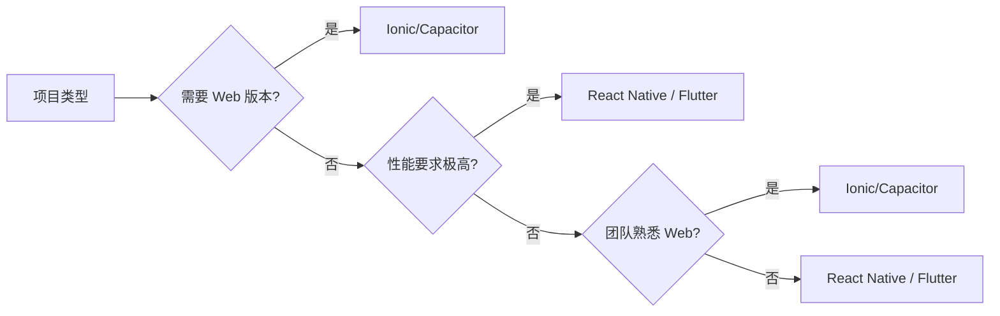

---

## 4. PWA 在移动端的应用

### 4.1 概念解释

渐进式 Web 应用（PWA）是使用现代 Web API 开发的类原生应用体验，可以安装到主屏幕、离线工作、接收推送通知。

#### 核心特性

- **可安装**：添加到主屏幕
- **离线可用**：Service Worker 缓存
- **推送通知**：原生推送体验
- **响应式**：适配各种屏幕

### 4.2 架构图

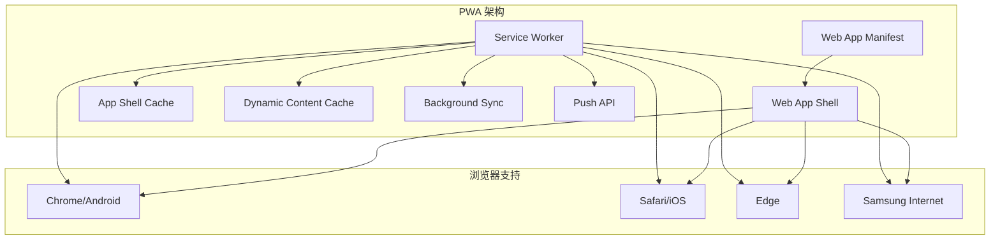

### 4.3 代码示例

#### Web App Manifest

```json
{
  "name": "My PWA App",
  "short_name": "PWA App",
  "description": "A progressive web app",
  "start_url": "/",
  "display": "standalone",
  "background_color": "#ffffff",
  "theme_color": "#2196F3",
  "orientation": "portrait",
  "scope": "/",
  "lang": "zh-CN",
  "icons": [
    {
      "src": "/icons/icon-72x72.png",
      "sizes": "72x72",
      "type": "image/png"
    },
    {
      "src": "/icons/icon-96x96.png",
      "sizes": "96x96",
      "type": "image/png"
    },
    {
      "src": "/icons/icon-128x128.png",
      "sizes": "128x128",
      "type": "image/png"
    },
    {
      "src": "/icons/icon-144x144.png",
      "sizes": "144x144",
      "type": "image/png"
    },
    {
      "src": "/icons/icon-152x152.png",
      "sizes": "152x152",
      "type": "image/png"
    },
    {
      "src": "/icons/icon-192x192.png",
      "sizes": "192x192",
      "type": "image/png"
    },
    {
      "src": "/icons/icon-384x384.png",
      "sizes": "384x384",
      "type": "image/png"
    },
    {
      "src": "/icons/icon-512x512.png",
      "sizes": "512x512",
      "type": "image/png",
      "purpose": "any maskable"
    }
  ],
  "shortcuts": [
    {
      "name": "新建笔记",
      "short_name": "新建",
      "description": "创建新笔记",
      "url": "/note/new",
      "icons": [{ "src": "/icons/note.png", "sizes": "96x96" }]
    }
  ],
  "categories": ["productivity", "utilities"],
  "screenshots": [
    {
      "src": "/screenshots/mobile.png",
      "sizes": "750x1334",
      "type": "image/png",
      "form_factor": "narrow"
    },
    {
      "src": "/screenshots/desktop.png",
      "sizes": "1920x1080",
      "type": "image/png",
      "form_factor": "wide"
    }
  ]
}
```

#### Service Worker

```javascript
// sw.js
const CACHE_NAME = 'my-pwa-v1';
const STATIC_ASSETS = [
  '/',
  '/index.html',
  '/styles.css',
  '/app.js',
  '/icons/icon-192x192.png',
  '/icons/icon-512x512.png'
];

// 安装时缓存静态资源
self.addEventListener('install', (event) => {
  event.waitUntil(
    caches.open(CACHE_NAME)
      .then((cache) => cache.addAll(STATIC_ASSETS))
      .then(() => self.skipWaiting())
  );
});

// 激活时清理旧缓存
self.addEventListener('activate', (event) => {
  event.waitUntil(
    caches.keys().then((cacheNames) => {
      return Promise.all(
        cacheNames
          .filter((name) => name !== CACHE_NAME)
          .map((name) => caches.delete(name))
      );
    }).then(() => self.clients.claim())
  );
});

// 拦截请求
self.addEventListener('fetch', (event) => {
  const { request } = event;

  // API 请求使用网络优先策略
  if (request.url.includes('/api/')) {
    event.respondWith(networkFirstStrategy(request));
  } else {
    // 静态资源使用缓存优先策略
    event.respondWith(cacheFirstStrategy(request));
  }
});

// 缓存优先策略
async function cacheFirstStrategy(request) {
  const cached = await caches.match(request);
  if (cached) {
    return cached;
  }

  try {
    const networkResponse = await fetch(request);
    const cache = await caches.open(CACHE_NAME);
    cache.put(request, networkResponse.clone());
    return networkResponse;
  } catch (error) {
    // 离线时返回默认页面
    return caches.match('/offline.html');
  }
}

// 网络优先策略
async function networkFirstStrategy(request) {
  try {
    const networkResponse = await fetch(request);
    const cache = await caches.open(CACHE_NAME);
    cache.put(request, networkResponse.clone());
    return networkResponse;
  } catch (error) {
    const cached = await caches.match(request);
    if (cached) {
      return cached;
    }
    throw error;
  }
}

// 后台同步
self.addEventListener('sync', (event) => {
  if (event.tag === 'sync-notes') {
    event.waitUntil(syncNotes());
  }
});

// 推送通知
self.addEventListener('push', (event) => {
  const data = event.data?.json() ?? {};
  const options = {
    body: data.body || '新消息',
    icon: '/icons/icon-192x192.png',
    badge: '/icons/badge-72x72.png',
    tag: data.tag || 'default',
    requireInteraction: true,
    actions: [
      { action: 'open', title: '查看' },
      { action: 'close', title: '关闭' }
    ]
  };

  event.waitUntil(
    self.registration.showNotification(data.title || '通知', options)
  );
});

// 通知点击
self.addEventListener('notificationclick', (event) => {
  event.notification.close();

  if (event.action === 'open') {
    event.waitUntil(
      clients.openWindow('/')
    );
  }
});
```

#### PWA 注册和安装

```javascript
// app.js - PWA 注册
if ('serviceWorker' in navigator) {
  window.addEventListener('load', async () => {
    try {
      const registration = await navigator.serviceWorker.register('/sw.js');
      console.log('SW registered:', registration);

      // 请求通知权限
      if ('Notification' in window) {
        const permission = await Notification.requestPermission();
        console.log('Notification permission:', permission);
      }

      // 注册后台同步
      if ('sync' in registration) {
        await registration.sync.register('sync-notes');
      }
    } catch (error) {
      console.error('SW registration failed:', error);
    }
  });
}

// 安装提示处理
let deferredPrompt;

window.addEventListener('beforeinstallprompt', (e) => {
  e.preventDefault();
  deferredPrompt = e;

  // 显示自定义安装按钮
  const installButton = document.getElementById('install-button');
  if (installButton) {
    installButton.style.display = 'block';
    installButton.addEventListener('click', async () => {
      deferredPrompt.prompt();
      const { outcome } = await deferredPrompt.userChoice;
      console.log('Install prompt outcome:', outcome);
      deferredPrompt = null;
    });
  }
});

// 检测是否已安装
window.addEventListener('appinstalled', () => {
  console.log('PWA was installed');
  deferredPrompt = null;

  // 隐藏安装按钮
  const installButton = document.getElementById('install-button');
  if (installButton) {
    installButton.style.display = 'none';
  }
});

// 检测运行模式
document.addEventListener('DOMContentLoaded', () => {
  const isStandalone = window.matchMedia('(display-mode: standalone)').matches
    || window.navigator.standalone === true;

  if (isStandalone) {
    document.body.classList.add('standalone');
    console.log('Running in standalone mode');
  }
});
```

### 4.4 平台支持对比

| 功能 | Android Chrome | iOS Safari | 桌面 Chrome |
|------|---------------|------------|-------------|
| 添加到主屏幕 | 完全支持 | 部分支持 | 完全支持 |
| Service Worker | 完全支持 | 完全支持 | 完全支持 |
| 推送通知 | 完全支持 | 部分支持 | 完全支持 |
| 后台同步 | 完全支持 | 不支持 | 完全支持 |
| 离线存储 | 完全支持 | 完全支持 | 完全支持 |
| Web App Manifest | 完全支持 | 部分支持 | 完全支持 |

### 4.5 iOS/Android 注意事项

#### iOS 特殊限制

```javascript
// iOS 上的 PWA 限制处理

// 1. 检测 iOS 设备
const isIOS = /iPad|iPhone|iPod/.test(navigator.userAgent);
const isStandalone = window.navigator.standalone === true;

// 2. iOS 推送限制 - 使用替代方案
if (isIOS && !isStandalone) {
  // iOS 不支持 Web Push，引导用户安装原生应用
  showInstallPrompt();
}

// 3. iOS 存储限制 - 使用 IndexedDB
const initStorage = async () => {
  return new Promise((resolve, reject) => {
    const request = indexedDB.open('myAppDB', 1);
    request.onerror = () => reject(request.error);
    request.onsuccess = () => resolve(request.result);
    request.onupgradeneeded = (event) => {
      const db = event.target.result;
      db.createObjectStore('notes', { keyPath: 'id' });
    };
  });
};

// 4. 处理 iOS 300ms 点击延迟
document.addEventListener('touchstart', function() {}, { passive: true });
```

#### Android 优化

```javascript
// Android 上的 PWA 优化

// 1. 支持 TWA (Trusted Web Activity)
const supportTWA = () => {
  // 使用 Bubblewrap 或 PWA Builder 生成 TWA
  // 可以发布到 Play Store
};

// 2. Android 深层链接
const handleDeepLink = () => {
  const urlParams = new URLSearchParams(window.location.search);
  const action = urlParams.get('action');

  if (action === 'open-note') {
    const noteId = urlParams.get('id');
    openNote(noteId);
  }
};

// 3. Android 返回键处理（PWA 中）
window.addEventListener('popstate', (event) => {
  // 处理返回导航
  if (shouldCloseApp()) {
    // 在 Android 上关闭应用
    window.close();
  }
});
```

---

## 5. 移动端性能优化

### 5.1 概念解释

移动端性能优化关注应用启动速度、运行流畅度、内存管理和电池消耗，确保在各种设备上都能提供良好体验。

#### 关键指标

- **TTI (Time to Interactive)**：可交互时间
- **FCP (First Contentful Paint)**：首次内容绘制
- **LCP (Largest Contentful Paint)**：最大内容绘制
- **FPS (Frames Per Second)**：每秒帧率
- **Memory Usage**：内存使用

### 5.2 性能架构图

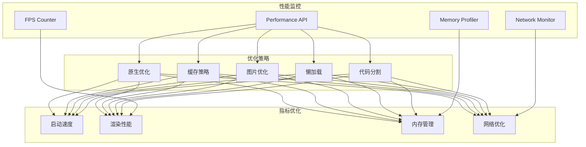

### 5.3 代码示例

#### React Native 性能优化

```javascript
// 1. 使用 Memo 避免不必要的重渲染
import React, { memo, useCallback, useMemo } from 'react';
import { FlatList, View, Text } from 'react-native';

// 子组件使用 memo
const ListItem = memo(({ item, onPress }) => {
  return (
    <View onPress={() => onPress(item.id)}>
      <Text>{item.title}</Text>
    </View>
  );
}, (prevProps, nextProps) => {
  // 自定义比较函数
  return prevProps.item.id === nextProps.item.id;
});

// 父组件
function OptimizedList({ data }) {
  // 使用 useCallback 缓存函数引用
  const handlePress = useCallback((id) => {
    console.log('Pressed:', id);
  }, []);

  // 使用 useMemo 缓存计算结果
  const sortedData = useMemo(() => {
    return [...data].sort((a, b) => b.priority - a.priority);
  }, [data]);

  return (
    <FlatList
      data={sortedData}
      renderItem={({ item }) => (
        <ListItem item={item} onPress={handlePress} />
      )}
      keyExtractor={(item) => item.id}
      // 性能优化属性
      removeClippedSubviews={true}
      maxToRenderPerBatch={10}
      windowSize={10}
      initialNumToRender={5}
      getItemLayout={(data, index) => ({
        length: 80,
        offset: 80 * index,
        index,
      })}
    />
  );
}

// 2. 使用 Hermes 引擎优化
// android/app/build.gradle
project.ext.react = [
    enableHermes: true  // 启用 Hermes
]

// 3. 图片优化
import { Image } from 'react-native';

<Image
  source={{
    uri: 'https://example.com/image.jpg',
    // 使用适当尺寸
    width: 200,
    height: 200
  }}
  // 使用 resizeMode 优化
  resizeMode="cover"
  // 设置默认占位图
  defaultSource={require('./placeholder.png')}
  // 渐进式加载
  progressiveRenderingEnabled={true}
/>

// 4. 启动优化 - 使用 AppLoading
import { useEffect, useState } from 'react';
import { View, ActivityIndicator } from 'react-native';
import * as SplashScreen from 'expo-splash-screen';

export default function App() {
  const [isReady, setIsReady] = useState(false);

  useEffect(() => {
    async function prepare() {
      try {
        // 预加载资源
        await SplashScreen.preventAutoHideAsync();
        await loadResourcesAsync();
      } catch (e) {
        console.warn(e);
      } finally {
        setIsReady(true);
        await SplashScreen.hideAsync();
      }
    }
    prepare();
  }, []);

  if (!isReady) {
    return null;
  }

  return <AppNavigator />;
}

async function loadResourcesAsync() {
  const promises = [
    // 预加载字体
    Font.loadAsync({
      'custom-font': require('./assets/fonts/custom.ttf'),
    }),
    // 预加载图片
    Asset.loadAsync([
      require('./assets/images/icon.png'),
      require('./assets/images/splash.png'),
    ]),
    // 初始化存储
    AsyncStorage.getItem('userData'),
  ];
  await Promise.all(promises);
}
```

#### Flutter 性能优化

```dart
// 1. 使用 const 构造函数
class OptimizedWidget extends StatelessWidget {
  const OptimizedWidget({Key? key}) : super(key: key);

  @override
  Widget build(BuildContext context) {
    return const Text( // 使用 const
      'Static Text',
      style: TextStyle(fontSize: 16),
    );
  }
}

// 2. 使用 RepaintBoundary 隔离重绘
class ListItem extends StatelessWidget {
  final Item item;

  const ListItem({Key? key, required this.item}) : super(key: key);

  @override
  Widget build(BuildContext context) {
    return RepaintBoundary(
      child: ListTile(
        title: Text(item.title),
        subtitle: Text(item.description),
      ),
    );
  }
}

// 3. 使用 ListView.builder 实现懒加载
ListView.builder(
  itemCount: items.length,
  itemBuilder: (context, index) {
    return ListItem(item: items[index]);
  },
  // 添加缓存区域
  cacheExtent: 100.0,
)

// 4. 图片优化
Image.network(
  'https://example.com/image.jpg',
  // 指定缓存宽高
  cacheWidth: 200,
  cacheHeight: 200,
  // 使用 fade 动画
  loadingBuilder: (context, child, loadingProgress) {
    if (loadingProgress == null) return child;
    return CircularProgressIndicator(
      value: loadingProgress.expectedTotalBytes != null
          ? loadingProgress.cumulativeBytesLoaded /
            loadingProgress.expectedTotalBytes!
          : null,
    );
  },
  // 错误处理
  errorBuilder: (context, error, stackTrace) {
    return const Icon(Icons.error);
  },
)

// 5. 使用 Isolate 处理耗时操作
import 'dart:isolate';

Future<void> processLargeData(List<Data> data) async {
  // 在独立 Isolate 中处理
  final receivePort = ReceivePort();
  await Isolate.spawn(
    _processData,
    _ProcessDataArgs(data, receivePort.sendPort),
  );

  final result = await receivePort.first;
  return result;
}

void _processData(_ProcessDataArgs args) {
  final processed = args.data.map((d) => heavyProcessing(d)).toList();
  args.sendPort.send(processed);
}
```

### 5.4 性能监控工具

```javascript
// 性能监控实现
class PerformanceMonitor {
  constructor() {
    this.metrics = {};
    this.init();
  }

  init() {
    // 监听性能指标
    if ('PerformanceObserver' in window) {
      const observer = new PerformanceObserver((list) => {
        for (const entry of list.getEntries()) {
          this.recordMetric(entry.name, entry.duration || entry.startTime);
        }
      });

      observer.observe({ entryTypes: ['measure', 'navigation', 'paint', 'lcp'] });
    }
  }

  measure(name, fn) {
    const start = performance.now();
    const result = fn();
    const duration = performance.now() - start;
    this.recordMetric(name, duration);
    return result;
  }

  async measureAsync(name, fn) {
    const start = performance.now();
    const result = await fn();
    const duration = performance.now() - start;
    this.recordMetric(name, duration);
    return result;
  }

  recordMetric(name, value) {
    if (!this.metrics[name]) {
      this.metrics[name] = [];
    }
    this.metrics[name].push({
      value,
      timestamp: Date.now(),
    });

    // 上报到分析服务
    this.reportMetric(name, value);
  }

  reportMetric(name, value) {
    // 发送性能数据到分析平台
    if (window.analytics) {
      window.analytics.track('Performance Metric', {
        name,
        value,
        platform: this.getPlatform(),
      });
    }
  }

  getPlatform() {
    const ua = navigator.userAgent;
    if (/iPhone|iPad|iPod/.test(ua)) return 'iOS';
    if (/Android/.test(ua)) return 'Android';
    return 'Web';
  }

  getMetrics() {
    return this.metrics;
  }
}

export default new PerformanceMonitor();
```

### 5.5 平台对比

| 优化维度 | React Native | Flutter | PWA |
|----------|-------------|---------|-----|
| 启动速度 | Hermes 优化 | AOT 编译 | Service Worker |
| 内存管理 | 需手动优化 | 自动垃圾回收 | 浏览器管理 |
| 渲染性能 | 接近原生 | Skia 自绘 | WebView 渲染 |
| 包大小 | 中等 | 较大 | 最小 |
| 热更新 | 支持 | 不支持 | 天然支持 |

---

## 6. 原生模块桥接

### 6.1 概念解释

原生模块桥接允许 JavaScript 代码调用原生平台 API，实现 JavaScript 无法直接访问的设备功能。

#### 桥接类型

- **React Native**：通过 Bridge 或 JSI
- **Flutter**：通过 Platform Channels
- **Capacitor**：通过 Plugin API

### 6.2 架构图

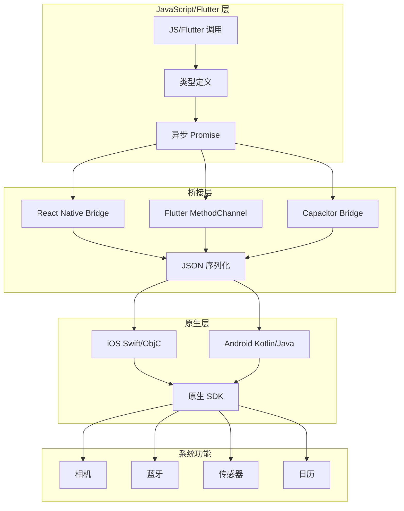

### 6.3 代码示例

#### React Native 原生模块

```javascript
// 1. 定义 TypeScript 类型
// types/CalendarModule.d.ts
declare module 'react-native' {
  interface NativeModulesStatic {
    CalendarModule: {
      createCalendarEvent(
        title: string,
        location: string,
        startDate: number,
        endDate: number
      ): Promise<string>;

      getCalendarEvents(): Promise<Array<{
        id: string;
        title: string;
        startDate: number;
      }>>;

      deleteCalendarEvent(id: string): Promise<boolean>;
    };
  }
}

// 2. JavaScript 调用层
import { NativeModules, Platform } from 'react-native';
const { CalendarModule } = NativeModules;

export class CalendarService {
  static async addEvent(eventData) {
    try {
      const eventId = await CalendarModule.createCalendarEvent(
        eventData.title,
        eventData.location,
        eventData.startDate.getTime(),
        eventData.endDate.getTime()
      );
      return { success: true, eventId };
    } catch (error) {
      console.error('Failed to create event:', error);
      throw error;
    }
  }

  static async getEvents() {
    return await CalendarModule.getCalendarEvents();
  }

  static async deleteEvent(id) {
    return await CalendarModule.deleteCalendarEvent(id);
  }
}
```

#### iOS 原生实现

```objc
// CalendarModule.h
#import <React/RCTBridgeModule.h>

@interface CalendarModule : NSObject <RCTBridgeModule>
@end

// CalendarModule.m
#import "CalendarModule.h"
#import <EventKit/EventKit.h>

@implementation CalendarModule

RCT_EXPORT_MODULE();

// 导出到 JS 的方法
RCT_EXPORT_METHOD(createCalendarEvent:(NSString *)title
                  location:(NSString *)location
                  startDate:(nonnull NSNumber *)startDate
                  endDate:(nonnull NSNumber *)endDate
                  resolver:(RCTPromiseResolveBlock)resolve
                  rejecter:(RCTPromiseRejectBlock)reject)
{
  EKEventStore *eventStore = [[EKEventStore alloc] init];

  // 请求权限
  [eventStore requestAccessToEntityType:EKEntityTypeEvent completion:^(BOOL granted, NSError *error) {
    dispatch_async(dispatch_get_main_queue(), ^{
      if (!granted) {
        reject(@"PERMISSION_DENIED", @"Calendar permission denied", error);
        return;
      }

      EKEvent *event = [EKEvent eventWithEventStore:eventStore];
      event.title = title;
      event.location = location;
      event.startDate = [NSDate dateWithTimeIntervalSince1970:[startDate doubleValue] / 1000];
      event.endDate = [NSDate dateWithTimeIntervalSince1970:[endDate doubleValue] / 1000];
      event.calendar = [eventStore defaultCalendarForNewEvents];

      NSError *saveError = nil;
      BOOL saved = [eventStore saveEvent:event span:EKSpanThisEvent error:&saveError];

      if (saved) {
        resolve(event.eventIdentifier);
      } else {
        reject(@"SAVE_FAILED", @"Failed to save event", saveError);
      }
    });
  }];
}

RCT_EXPORT_METHOD(getCalendarEvents:(RCTPromiseResolveBlock)resolve
                  rejecter:(RCTPromiseRejectBlock)reject)
{
  EKEventStore *eventStore = [[EKEventStore alloc] init];

  NSDate *startDate = [NSDate date];
  NSDate *endDate = [NSDate dateWithTimeIntervalSinceNow:86400 * 30]; // 30天后

  NSPredicate *predicate = [eventStore predicateForEventsWithStartDate:startDate
                                                                  endDate:endDate
                                                                calendars:nil];
  NSArray *events = [eventStore eventsMatchingPredicate:predicate];

  NSMutableArray *results = [NSMutableArray array];
  for (EKEvent *event in events) {
    [results addObject:@{
      @"id": event.eventIdentifier,
      @"title": event.title ?: @"",
      @"startDate": @([event.startDate timeIntervalSince1970] * 1000)
    }];
  }

  resolve(results);
}

@end
```

#### Android 原生实现

```kotlin
// CalendarModule.kt
package com.myapp.modules

import android.Manifest
import android.content.pm.PackageManager
import android.provider.CalendarContract
import androidx.core.content.ContextCompat
import com.facebook.react.bridge.*
import java.util.*

class CalendarModule(reactContext: ReactApplicationContext) :
    ReactContextBaseJavaModule(reactContext) {

    override fun getName(): String = "CalendarModule"

    @ReactMethod
    fun createCalendarEvent(
        title: String,
        location: String,
        startDate: Double,
        endDate: Double,
        promise: Promise
    ) {
        val activity = currentActivity ?: run {
            promise.reject("NO_ACTIVITY", "Activity is null")
            return
        }

        // 检查权限
        if (ContextCompat.checkSelfPermission(activity,
                Manifest.permission.WRITE_CALENDAR) != PackageManager.PERMISSION_GRANTED) {
            promise.reject("PERMISSION_DENIED", "Calendar permission not granted")
            return
        }

        try {
            val values = ContentValues().apply {
                put(CalendarContract.Events.DTSTART, startDate.toLong())
                put(CalendarContract.Events.DTEND, endDate.toLong())
                put(CalendarContract.Events.TITLE, title)
                put(CalendarContract.Events.EVENT_LOCATION, location)
                put(CalendarContract.Events.CALENDAR_ID, 1)
                put(CalendarContract.Events.EVENT_TIMEZONE, TimeZone.getDefault().id)
            }

            val uri = activity.contentResolver.insert(
                CalendarContract.Events.CONTENT_URI, values
            )

            val eventId = uri?.lastPathSegment
            promise.resolve(eventId)
        } catch (e: Exception) {
            promise.reject("SAVE_FAILED", e.message)
        }
    }

    @ReactMethod
    fun getCalendarEvents(promise: Promise) {
        val activity = currentActivity ?: run {
            promise.reject("NO_ACTIVITY", "Activity is null")
            return
        }

        val cursor = activity.contentResolver.query(
            CalendarContract.Events.CONTENT_URI,
            arrayOf(
                CalendarContract.Events._ID,
                CalendarContract.Events.TITLE,
                CalendarContract.Events.DTSTART
            ),
            null, null,
            "${CalendarContract.Events.DTSTART} ASC"
        )

        val events = Arguments.createArray()

        cursor?.use {
            while (it.moveToNext()) {
                val event = Arguments.createMap().apply {
                    putString("id", it.getString(0))
                    putString("title", it.getString(1))
                    putDouble("startDate", it.getLong(2).toDouble())
                }
                events.pushMap(event)
            }
        }

        promise.resolve(events)
    }
}

// 注册模块
// MainApplication.kt
override fun getPackages(): List<ReactPackage> =
    PackageList(this).packages.apply {
        add(CalendarPackage())
    }

// CalendarPackage.kt
class CalendarPackage : ReactPackage {
    override fun createNativeModules(reactContext: ReactApplicationContext):
        List<NativeModule> = listOf(CalendarModule(reactContext))

    override fun createViewManagers(reactContext: ReactApplicationContext):
        List<ViewManager<*, *>> = emptyList()
}
```

### 6.4 Flutter Platform Channel

```dart
// Flutter 端调用
import 'package:flutter/services.dart';

class CalendarService {
  static const platform = MethodChannel('com.example/calendar');

  static Future<String> createEvent({
    required String title,
    required String location,
    required DateTime startDate,
    required DateTime endDate,
  }) async {
    try {
      final String eventId = await platform.invokeMethod('createEvent', {
        'title': title,
        'location': location,
        'startDate': startDate.millisecondsSinceEpoch,
        'endDate': endDate.millisecondsSinceEpoch,
      });
      return eventId;
    } on PlatformException catch (e) {
      throw CalendarException(e.message ?? 'Unknown error');
    }
  }

  static Future<List<CalendarEvent>> getEvents() async {
    try {
      final List<dynamic> events = await platform.invokeMethod('getEvents');
      return events.map((e) => CalendarEvent.fromMap(e)).toList();
    } on PlatformException catch (e) {
      throw CalendarException(e.message ?? 'Unknown error');
    }
  }
}
```

### 6.5 平台对比

| 特性 | React Native | Flutter | Capacitor |
|------|-------------|---------|-----------|
| 桥接方式 | Bridge/JSI | Platform Channel | Plugin API |
| 类型安全 | TypeScript | Dart | TypeScript |
| 异步支持 | Promise | Future/Promise | Promise |
| 性能开销 | 中等 | 低 | 中等 |
| 开发复杂度 | 中等 | 低 | 低 |
| 社区插件 | 丰富 | 丰富 | 中等 |

---

## 7. 移动端的离线存储

### 7.1 概念解释

离线存储允许应用在无网络环境下正常工作，通过本地数据持久化存储用户数据和缓存内容。

#### 存储方案

- **Key-Value**：AsyncStorage、MMKV、UserDefaults
- **结构化数据**：SQLite、Realm、WatermelonDB
- **文件存储**：RNFS、Document Directory
- **缓存策略**：内存缓存 + 持久化存储

### 7.2 架构图

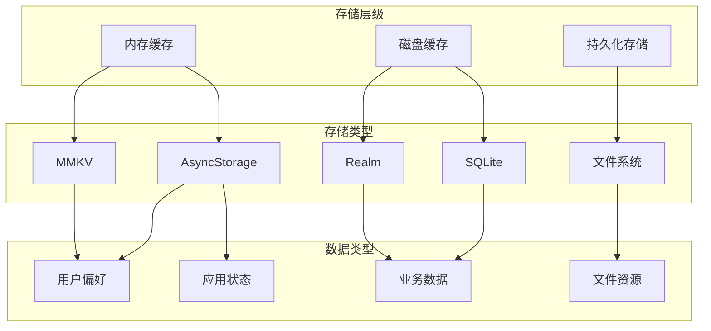

### 7.3 代码示例

#### React Native 存储封装

```javascript
// storage/StorageService.js
import AsyncStorage from '@react-native-async-storage/async-storage';
import { MMKV } from 'react-native-mmkv';

// MMKV 实例（高性能存储）
const mmkv = new MMKV();

class StorageService {
  // ========== AsyncStorage 方法 ==========

  static async setItem(key, value) {
    try {
      const jsonValue = JSON.stringify(value);
      await AsyncStorage.setItem(key, jsonValue);
    } catch (error) {
      console.error('Storage setItem error:', error);
    }
  }

  static async getItem(key, defaultValue = null) {
    try {
      const jsonValue = await AsyncStorage.getItem(key);
      return jsonValue != null ? JSON.parse(jsonValue) : defaultValue;
    } catch (error) {
      console.error('Storage getItem error:', error);
      return defaultValue;
    }
  }

  static async removeItem(key) {
    try {
      await AsyncStorage.removeItem(key);
    } catch (error) {
      console.error('Storage removeItem error:', error);
    }
  }

  // ========== MMKV 高性能方法 ==========

  static setString(key, value) {
    mmkv.set(key, value);
  }

  static getString(key, defaultValue = '') {
    return mmkv.getString(key) ?? defaultValue;
  }

  static setNumber(key, value) {
    mmkv.set(key, value);
  }

  static getNumber(key, defaultValue = 0) {
    return mmkv.getNumber(key) ?? defaultValue;
  }

  static setBoolean(key, value) {
    mmkv.set(key, value);
  }

  static getBoolean(key, defaultValue = false) {
    return mmkv.getBoolean(key) ?? defaultValue;
  }

  static setObject(key, value) {
    mmkv.set(key, JSON.stringify(value));
  }

  static getObject(key, defaultValue = null) {
    const value = mmkv.getString(key);
    return value ? JSON.parse(value) : defaultValue;
  }

  static delete(key) {
    mmkv.delete(key);
  }

  // ========== 批量操作 ==========

  static async multiSet(keyValuePairs) {
    try {
      const pairs = keyValuePairs.map(([key, value]) => [
        key,
        JSON.stringify(value)
      ]);
      await AsyncStorage.multiSet(pairs);
    } catch (error) {
      console.error('Storage multiSet error:', error);
    }
  }

  static async multiGet(keys) {
    try {
      const pairs = await AsyncStorage.multiGet(keys);
      return pairs.map(([key, value]) => [
        key,
        value ? JSON.parse(value) : null
      ]);
    } catch (error) {
      console.error('Storage multiGet error:', error);
      return [];
    }
  }

  // ========== 存储管理 ==========

  static async clear() {
    try {
      await AsyncStorage.clear();
      mmkv.clearAll();
    } catch (error) {
      console.error('Storage clear error:', error);
    }
  }

  static async getAllKeys() {
    try {
      return await AsyncStorage.getAllKeys();
    } catch (error) {
      console.error('Storage getAllKeys error:', error);
      return [];
    }
  }

  // ========== 离线数据同步 ==========

  static async queueOfflineAction(action) {
    const queue = await this.getItem('offlineQueue', []);
    queue.push({
      ...action,
      timestamp: Date.now(),
      retryCount: 0
    });
    await this.setItem('offlineQueue', queue);
  }

  static async processOfflineQueue(processFn) {
    const queue = await this.getItem('offlineQueue', []);
    const failed = [];

    for (const action of queue) {
      try {
        await processFn(action);
      } catch (error) {
        action.retryCount++;
        if (action.retryCount < 3) {
          failed.push(action);
        }
      }
    }

    await this.setItem('offlineQueue', failed);
    return failed.length === 0;
  }
}

export default StorageService;
```

#### SQLite 数据库封装

```javascript
// storage/DatabaseService.js
import SQLite from 'react-native-sqlite-storage';

SQLite.enablePromise(true);

class DatabaseService {
  constructor() {
    this.db = null;
  }

  async init() {
    try {
      this.db = await SQLite.openDatabase({
        name: 'AppDatabase.db',
        location: 'default',
      });

      await this.createTables();
      console.log('Database initialized');
    } catch (error) {
      console.error('Database initialization error:', error);
    }
  }

  async createTables() {
    const queries = [
      `CREATE TABLE IF NOT EXISTS notes (
        id TEXT PRIMARY KEY,
        title TEXT NOT NULL,
        content TEXT,
        created_at INTEGER,
        updated_at INTEGER,
        synced INTEGER DEFAULT 0
      )`,
      `CREATE TABLE IF NOT EXISTS users (
        id TEXT PRIMARY KEY,
        name TEXT NOT NULL,
        email TEXT UNIQUE,
        avatar_url TEXT,
        last_sync INTEGER
      )`,
      `CREATE INDEX IF NOT EXISTS idx_notes_synced ON notes(synced)`,
    ];

    for (const query of queries) {
      await this.db.executeSql(query);
    }
  }

  // 笔记 CRUD
  async createNote(note) {
    const { id, title, content, createdAt, updatedAt } = note;
    const query = `
      INSERT INTO notes (id, title, content, created_at, updated_at, synced)
      VALUES (?, ?, ?, ?, ?, 0)
    `;
    await this.db.executeSql(query, [id, title, content, createdAt, updatedAt]);
    return note;
  }

  async getNotes(limit = 50, offset = 0) {
    const query = `
      SELECT * FROM notes
      ORDER BY updated_at DESC
      LIMIT ? OFFSET ?
    `;
    const [result] = await this.db.executeSql(query, [limit, offset]);

    const notes = [];
    for (let i = 0; i < result.rows.length; i++) {
      notes.push(result.rows.item(i));
    }
    return notes;
  }

  async updateNote(id, updates) {
    const fields = Object.keys(updates).map(key => `${key} = ?`).join(', ');
    const values = [...Object.values(updates), Date.now(), id];

    const query = `
      UPDATE notes
      SET ${fields}, updated_at = ?, synced = 0
      WHERE id = ?
    `;
    await this.db.executeSql(query, values);
    return this.getNoteById(id);
  }

  async getNoteById(id) {
    const [result] = await this.db.executeSql(
      'SELECT * FROM notes WHERE id = ?',
      [id]
    );
    return result.rows.length > 0 ? result.rows.item(0) : null;
  }

  async deleteNote(id) {
    await this.db.executeSql('DELETE FROM notes WHERE id = ?', [id]);
  }

  // 获取未同步的数据
  async getUnsyncedNotes() {
    const [result] = await this.db.executeSql(
      'SELECT * FROM notes WHERE synced = 0 ORDER BY updated_at ASC'
    );

    const notes = [];
    for (let i = 0; i < result.rows.length; i++) {
      notes.push(result.rows.item(i));
    }
    return notes;
  }

  async markAsSynced(ids) {
    const placeholders = ids.map(() => '?').join(',');
    await this.db.executeSql(
      `UPDATE notes SET synced = 1 WHERE id IN (${placeholders})`,
      ids
    );
  }

  // 事务支持
  async transaction(operations) {
    await this.db.executeSql('BEGIN TRANSACTION');
    try {
      await operations(this);
      await this.db.executeSql('COMMIT');
    } catch (error) {
      await this.db.executeSql('ROLLBACK');
      throw error;
    }
  }

  async close() {
    if (this.db) {
      await this.db.close();
      this.db = null;
    }
  }
}

export default new DatabaseService();
```

#### 离线同步管理

```javascript
// storage/SyncManager.js
import DatabaseService from './DatabaseService';
import StorageService from './StorageService';
import NetInfo from '@react-native-community/netinfo';

class SyncManager {
  constructor(apiClient) {
    this.api = apiClient;
    this.isSyncing = false;
    this.syncInterval = null;
  }

  startAutoSync(intervalMs = 30000) {
    // 每 30 秒检查一次同步
    this.syncInterval = setInterval(() => {
      this.syncIfOnline();
    }, intervalMs);
  }

  stopAutoSync() {
    if (this.syncInterval) {
      clearInterval(this.syncInterval);
      this.syncInterval = null;
    }
  }

  async syncIfOnline() {
    const netInfo = await NetInfo.fetch();
    if (netInfo.isConnected && !this.isSyncing) {
      await this.sync();
    }
  }

  async sync() {
    if (this.isSyncing) return;
    this.isSyncing = true;

    try {
      await this.pushLocalChanges();
      await this.pullRemoteChanges();
      await StorageService.setItem('lastSyncTime', Date.now());
    } catch (error) {
      console.error('Sync failed:', error);
    } finally {
      this.isSyncing = false;
    }
  }

  async pushLocalChanges() {
    const unsyncedNotes = await DatabaseService.getUnsyncedNotes();

    if (unsyncedNotes.length === 0) return;

    try {
      const response = await this.api.post('/notes/batch', {
        notes: unsyncedNotes
      });

      if (response.data.success) {
        const syncedIds = unsyncedNotes.map(n => n.id);
        await DatabaseService.markAsSynced(syncedIds);
      }
    } catch (error) {
      // 网络错误时保留数据待下次同步
      if (!error.response) {
        console.log('Network error, will retry later');
      } else {
        throw error;
      }
    }
  }

  async pullRemoteChanges() {
    const lastSync = await StorageService.getItem('lastSyncTime', 0);

    const response = await this.api.get('/notes/updates', {
      params: { since: lastSync }
    });

    const remoteNotes = response.data.notes;

    await DatabaseService.transaction(async (db) => {
      for (const note of remoteNotes) {
        const localNote = await db.getNoteById(note.id);

        if (!localNote) {
          // 本地不存在，插入
          await db.createNote({
            ...note,
            synced: 1
          });
        } else if (note.updated_at > localNote.updated_at) {
          // 远程更新，更新本地
          await db.updateNote(note.id, {
            title: note.title,
            content: note.content,
            updated_at: note.updated_at
          });
          await db.markAsSynced([note.id]);
        }
      }
    });
  }

  // 处理冲突
  async resolveConflict(localNote, remoteNote) {
    // 策略：以远程为准，但保留本地版本到历史
    await DatabaseService.updateNote(localNote.id, {
      title: remoteNote.title,
      content: remoteNote.content,
      updated_at: remoteNote.updated_at,
    });

    // 保存冲突记录供用户查看
    await StorageService.setItem(`conflict_${localNote.id}`, {
      local: localNote,
      remote: remoteNote,
      resolvedAt: Date.now()
    });
  }
}

export default SyncManager;
```

### 7.4 平台对比

| 存储方案 | iOS | Android | 特点 |
|----------|-----|---------|------|
| UserDefaults/SharedPreferences | 原生 | 原生 | 简单键值对 |
| Keychain/Keystore | 安全存储 | 安全存储 | 加密敏感数据 |
| CoreData/Room | ORM | ORM | 复杂对象关系 |
| SQLite | 通用 | 通用 | 关系型数据 |
| Realm | 跨平台 | 跨平台 | 高性能对象存储 |
| MMKV | 跨平台 | 跨平台 | 高性能键值存储 |

---

## 8. 推送通知

### 8.1 概念解释

推送通知允许应用在后台或关闭状态下向用户发送消息，包括本地通知和远程推送（APNs/FCM）。

#### 推送类型

- **本地通知**：应用内触发
- **远程推送**：服务器下发（APNs/FCM）
- **静默推送**：后台更新数据
- **富媒体通知**：图片、视频、操作按钮

### 8.2 架构图

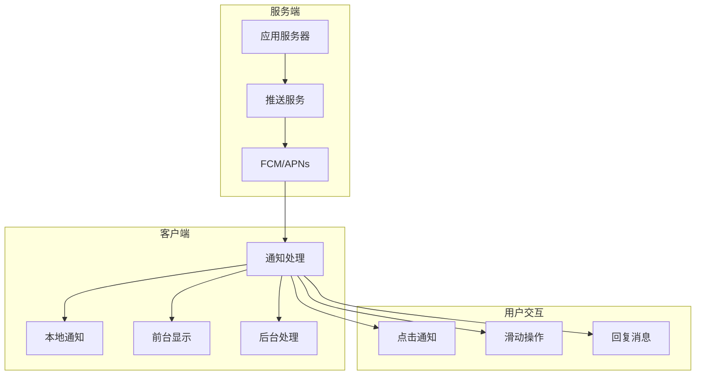

### 8.3 代码示例

#### React Native 推送通知

```javascript
// notifications/NotificationService.js
import messaging from '@react-native-firebase/messaging';
import notifee, {
  AndroidImportance,
  EventType,
  AndroidCategory
} from '@notifee/react-native';

class NotificationService {
  constructor() {
    this.onNotificationOpened = null;
    this.onMessageReceived = null;
  }

  async init() {
    // 请求权限
    await this.requestPermission();

    // 创建通知渠道（Android）
    await this.createChannels();

    // 设置消息处理
    this.setupMessageHandlers();

    // 获取 FCM Token
    const token = await this.getFCMToken();
    console.log('FCM Token:', token);

    return token;
  }

  async requestPermission() {
    const authStatus = await messaging().requestPermission();
    const enabled =
      authStatus === messaging.AuthorizationStatus.AUTHORIZED ||
      authStatus === messaging.AuthorizationStatus.PROVISIONAL;

    console.log('Authorization status:', authStatus);
    return enabled;
  }

  async createChannels() {
    // 默认渠道
    await notifee.createChannel({
      id: 'default',
      name: 'Default Channel',
      importance: AndroidImportance.HIGH,
      vibration: true,
      vibrationPattern: [300, 500],
    });

    // 高优先级渠道
    await notifee.createChannel({
      id: 'high-priority',
      name: 'High Priority Notifications',
      importance: AndroidImportance.HIGH,
      sound: 'default',
      vibration: true,
    });

    // 静默渠道
    await notifee.createChannel({
      id: 'silent',
      name: 'Silent Notifications',
      importance: AndroidImportance.LOW,
      vibration: false,
    });
  }

  async getFCMToken() {
    return await messaging().getToken();
  }

  setupMessageHandlers() {
    // 前台消息
    messaging().onMessage(async remoteMessage => {
      console.log('Foreground message:', remoteMessage);
      await this.displayLocalNotification(remoteMessage);

      if (this.onMessageReceived) {
        this.onMessageReceived(remoteMessage);
      }
    });

    // 后台/杀死状态点击
    messaging().onNotificationOpenedApp(remoteMessage => {
      console.log('Notification opened app:', remoteMessage);
      if (this.onNotificationOpened) {
        this.onNotificationOpened(remoteMessage);
      }
    });

    // 应用启动时检查
    messaging().getInitialNotification().then(remoteMessage => {
      if (remoteMessage) {
        console.log('App opened from quit state:', remoteMessage);
        if (this.onNotificationOpened) {
          this.onNotificationOpened(remoteMessage);
        }
      }
    });

    // Token 刷新
    messaging().onTokenRefresh(token => {
      console.log('FCM Token refreshed:', token);
      // 发送新 token 到服务器
    });

    // Notifee 前台事件
    notifee.onForegroundEvent(({ type, detail }) => {
      switch (type) {
        case EventType.PRESS:
          console.log('User pressed notification', detail.notification);
          break;
        case EventType.ACTION_PRESS:
          console.log('User pressed action', detail.pressAction);
          break;
      }
    });

    // Notifee 后台事件
    notifee.onBackgroundEvent(async ({ type, detail }) => {
      const { notification, pressAction } = detail;

      if (type === EventType.ACTION_PRESS && pressAction.id === 'reply') {
        // 处理回复
        console.log('Reply:', detail.input);
      }
    });
  }

  async displayLocalNotification(remoteMessage) {
    const { notification, data } = remoteMessage;

    await notifee.displayNotification({
      title: notification?.title || data?.title,
      body: notification?.body || data?.body,
      data: data,
      android: {
        channelId: 'default',
        importance: AndroidImportance.HIGH,
        smallIcon: 'ic_notification',
        color: '#2196F3',
        pressAction: {
          id: 'default',
        },
        actions: [
          {
            title: '回复',
            pressAction: { id: 'reply' },
            input: {
              placeholder: '输入回复...',
            },
          },
          {
            title: '标记已读',
            pressAction: { id: 'mark-read' },
          },
        ],
        style: data?.image ? {
          type: AndroidStyle.BIGPICTURE,
          picture: data.image,
        } : undefined,
      },
      ios: {
        categoryId: 'message',
        attachments: data?.image ? [{ url: data.image }] : undefined,
      },
    });
  }

  // 本地通知
  async scheduleLocalNotification(title, body, delay = 0) {
    await notifee.displayNotification({
      title,
      body,
      android: {
        channelId: 'default',
      },
    });
  }

  // 取消通知
  async cancelNotification(notificationId) {
    await notifee.cancelNotification(notificationId);
  }

  // 取消所有通知
  async cancelAllNotifications() {
    await notifee.cancelAllNotifications();
  }

  // 设置通知处理回调
  setNotificationOpenedHandler(handler) {
    this.onNotificationOpened = handler;
  }

  setMessageReceivedHandler(handler) {
    this.onMessageReceived = handler;
  }

  // 订阅主题
  async subscribeToTopic(topic) {
    await messaging().subscribeToTopic(topic);
  }

  async unsubscribeFromTopic(topic) {
    await messaging().unsubscribeFromTopic(topic);
  }
}

export default new NotificationService();
```

#### iOS APNs 配置

```objc
// AppDelegate.m 推送处理
#import "AppDelegate.h"
#import <RNFBMessagingModule.h>
#import <Firebase.h>

@implementation AppDelegate

- (BOOL)application:(UIApplication *)application
    didFinishLaunchingWithOptions:(NSDictionary *)launchOptions {

  [FIRApp configure];
  [FIRMessaging messaging].delegate = self;

  // 注册远程通知
  [UNUserNotificationCenter currentNotificationCenter].delegate = self;
  UNAuthorizationOptions authOptions = UNAuthorizationOptionAlert |
                                       UNAuthorizationOptionSound |
                                       UNAuthorizationOptionBadge;
  [[UNUserNotificationCenter currentNotificationCenter]
      requestAuthorizationWithOptions:authOptions
      completionHandler:^(BOOL granted, NSError * _Nullable error) {
        // 处理权限结果
      }];

  [application registerForRemoteNotifications];

  return [super application:application didFinishLaunchingWithOptions:launchOptions];
}

// 收到 FCM Token
- (void)messaging:(FIRMessaging *)messaging didReceiveRegistrationToken:(NSString *)fcmToken {
  NSLog(@"FCM registration token: %@", fcmToken);
  // 发送 token 到服务器
}

// 处理静默推送
- (void)application:(UIApplication *)application
    didReceiveRemoteNotification:(NSDictionary *)userInfo
    fetchCompletionHandler:(void (^)(UIBackgroundFetchResult))completionHandler {

  // 处理后台数据更新
  if (userInfo[@"content-available"]) {
    // 下载数据
    [self syncDataWithCompletion:^(BOOL success) {
      completionHandler(success ? UIBackgroundFetchResultNewData : UIBackgroundFetchResultFailed);
    }];
  } else {
    completionHandler(UIBackgroundFetchResultNoData);
  }
}

@end
```

### 8.4 平台对比

| 功能 | iOS APNs | Android FCM |
|------|----------|-------------|
| 令牌类型 | Device Token | FCM Token |
| 静默推送 | 支持 | 支持 |
| 富媒体 | 支持 | 支持 |
| 通知渠道 | 不支持 | 支持 |
| 消息优先级 | 普通/高 | 普通/高 |
| 送达保证 | 尽力而为 | 尽力而为 |

---

## 9. 应用发布流程

### 9.1 概念解释

应用发布是将开发完成的应用分发到应用商店的过程，包括构建、签名、测试和上架。

#### 发布渠道

- **App Store**：iOS 官方渠道
- **Google Play**：Android 官方渠道
- **企业分发**：内部测试/企业应用
- **第三方商店**：华为、小米、应用宝等

### 9.2 发布流程图

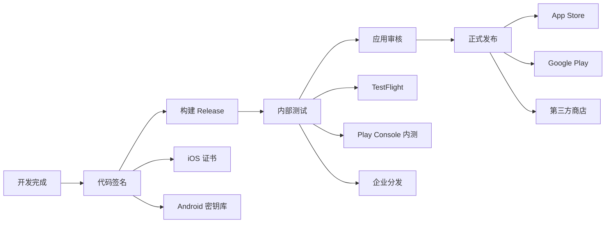

### 9.3 代码示例

#### React Native 发布配置

```javascript
// ios/Podfile
platform :ios, '13.0'

target 'MyApp' do
  use_react_native!

  # 生产环境配置
  post_install do |installer|
    react_native_post_install(installer)

    # 优化构建
    installer.pods_project.targets.each do |target|
      target.build_configurations.each do |config|
        config.build_settings['ENABLE_BITCODE'] = 'NO'
        config.build_settings['IPHONEOS_DEPLOYMENT_TARGET'] = '13.0'
      end
    end
  end
end
```

```gradle
// android/app/build.gradle
android {
    compileSdkVersion 33

    defaultConfig {
        applicationId "com.myapp"
        minSdkVersion 21
        targetSdkVersion 33
        versionCode 1
        versionName "1.0.0"

        // 启用 Hermes
        resValue "string", "build_config_package", "com.myapp"
    }

    signingConfigs {
        release {
            if (project.hasProperty('MYAPP_UPLOAD_STORE_FILE')) {
                storeFile file(MYAPP_UPLOAD_STORE_FILE)
                storePassword MYAPP_UPLOAD_STORE_PASSWORD
                keyAlias MYAPP_UPLOAD_KEY_ALIAS
                keyPassword MYAPP_UPLOAD_KEY_PASSWORD
            }
        }
    }

    buildTypes {
        release {
            signingConfig signingConfigs.release
            minifyEnabled enableProguardInReleaseBuilds
            proguardFiles getDefaultProguardFile("proguard-android.txt"), "proguard-rules.pro"

            // 启用资源压缩
            shrinkResources true

            // 配置 Hermes
            packagingOptions {
                pickFirst '**/libc++_shared.so'
                pickFirst '**/libjsc.so'
            }
        }
    }

    // 分包配置
    splits {
        abi {
            enable true
            reset()
            include 'armeabi-v7a', 'arm64-v8a', 'x86', 'x86_64'
            universalApk false
        }
    }
}
```

#### 自动化发布脚本

```javascript
// scripts/release.js
const { execSync } = require('child_process');
const fs = require('fs');
const path = require('path');

class ReleaseManager {
  constructor() {
    this.version = this.getVersion();
  }

  getVersion() {
    const packageJson = require('../package.json');
    return packageJson.version;
  }

  bumpVersion(type = 'patch') {
    const [major, minor, patch] = this.version.split('.').map(Number);

    switch (type) {
      case 'major':
        this.newVersion = `${major + 1}.0.0`;
        break;
      case 'minor':
        this.newVersion = `${major}.${minor + 1}.0`;
        break;
      case 'patch':
      default:
        this.newVersion = `${major}.${minor}.${patch + 1}`;
    }

    // 更新 package.json
    const packageJson = require('../package.json');
    packageJson.version = this.newVersion;
    fs.writeFileSync(
      path.join(__dirname, '../package.json'),
      JSON.stringify(packageJson, null, 2)
    );

    // 更新 iOS 版本
    this.updateiOSVersion();

    // 更新 Android 版本
    this.updateAndroidVersion();

    console.log(`Version bumped to ${this.newVersion}`);
  }

  updateiOSVersion() {
    const infoPlistPath = path.join(__dirname, '../ios/MyApp/Info.plist');
    let content = fs.readFileSync(infoPlistPath, 'utf8');

    // 更新版本号
    content = content.replace(
      /<key>CFBundleShortVersionString<\/key>\s*<string>[\d.]+<\/string>/,
      `<key>CFBundleShortVersionString</key>\n\t<string>${this.newVersion}</string>`
    );

    // 更新 build 号
    const buildNumber = Date.now();
    content = content.replace(
      /<key>CFBundleVersion<\/key>\s*<string>\d+<\/string>/,
      `<key>CFBundleVersion</key>\n\t<string>${buildNumber}</string>`
    );

    fs.writeFileSync(infoPlistPath, content);
  }

  updateAndroidVersion() {
    const buildGradlePath = path.join(__dirname, '../android/app/build.gradle');
    let content = fs.readFileSync(buildGradlePath, 'utf8');

    // 更新 versionName
    content = content.replace(
      /versionName "[\d.]+"/,
      `versionName "${this.newVersion}"`
    );

    // 递增 versionCode
    const versionCodeMatch = content.match(/versionCode (\d+)/);
    if (versionCodeMatch) {
      const newVersionCode = parseInt(versionCodeMatch[1]) + 1;
      content = content.replace(
        /versionCode \d+/,
        `versionCode ${newVersionCode}`
      );
    }

    fs.writeFileSync(buildGradlePath, content);
  }

  async buildiOS() {
    console.log('Building iOS Release...');

    try {
      // 安装依赖
      execSync('cd ios && pod install', { stdio: 'inherit' });

      // 构建 Archive
      execSync(
        `cd ios && xcodebuild \
          -workspace MyApp.xcworkspace \
          -scheme MyApp \
          -configuration Release \
          -archivePath build/MyApp.xcarchive \
          archive`,
        { stdio: 'inherit' }
      );

      // 导出 IPA
      execSync(
        `cd ios && xcodebuild \
          -exportArchive \
          -archivePath build/MyApp.xcarchive \
          -exportPath build \
          -exportOptionsPlist exportOptions.plist`,
        { stdio: 'inherit' }
      );

      console.log('iOS build completed: ios/build/MyApp.ipa');
    } catch (error) {
      console.error('iOS build failed:', error);
      throw error;
    }
  }

  async buildAndroid() {
    console.log('Building Android Release...');

    try {
      // 清理并构建
      execSync('cd android && ./gradlew clean assembleRelease', {
        stdio: 'inherit',
      });

      const apkPath = 'android/app/build/outputs/apk/release/app-release.apk';
      const aabPath = 'android/app/build/outputs/bundle/release/app-release.aab';

      console.log('Android build completed:');
      console.log('  APK:', apkPath);
      console.log('  AAB:', aabPath);
    } catch (error) {
      console.error('Android build failed:', error);
      throw error;
    }
  }

  async uploadToTestFlight() {
    console.log('Uploading to TestFlight...');

    try {
      execSync(
        'xcrun altool --upload-app -f ios/build/MyApp.ipa -t ios --apiKey XXX --apiIssuer XXX',
        { stdio: 'inherit' }
      );
      console.log('Uploaded to TestFlight successfully');
    } catch (error) {
      console.error('Upload to TestFlight failed:', error);
      throw error;
    }
  }

  async uploadToPlayStore() {
    console.log('Uploading to Play Store...');

    // 使用 Google Play 开发者 API 或 fastlane
    try {
      execSync('fastlane android deploy', { stdio: 'inherit' });
      console.log('Uploaded to Play Store successfully');
    } catch (error) {
      console.error('Upload to Play Store failed:', error);
      throw error;
    }
  }
}

// CLI 入口
const release = new ReleaseManager();

const command = process.argv[2];
switch (command) {
  case 'bump':
    release.bumpVersion(process.argv[3]);
    break;
  case 'build:ios':
    release.buildiOS();
    break;
  case 'build:android':
    release.buildAndroid();
    break;
  case 'upload:testflight':
    release.uploadToTestFlight();
    break;
  case 'upload:playstore':
    release.uploadToPlayStore();
    break;
  default:
    console.log('Usage: node release.js [bump|build:ios|build:android|upload:testflight|upload:playstore]');
}
```

### 9.4 平台发布要求对比

| 要求 | App Store | Google Play |
|------|-----------|-------------|
| 审核时间 | 1-7 天 | 数小时-几天 |
| 签名方式 | Apple 证书 | 密钥库 |
| 隐私政策 | 强制要求 | 强制要求 |
| 年龄分级 | 必需 | 可选 |
| 截图要求 | 特定尺寸 | 灵活 |
| 测试要求 | TestFlight | 内部测试轨道 |

---

## 10. 移动端安全考虑

### 10.1 概念解释

移动端安全涉及数据保护、网络安全、代码安全和运行时安全，防止数据泄露、篡改和未授权访问。

#### 安全领域

- **数据安全**：加密存储、安全传输
- **网络安全**：证书固定、防中间人攻击
- **代码安全**：混淆、反调试、Root 检测
- **认证授权**：生物识别、OAuth、JWT

### 10.2 安全架构图

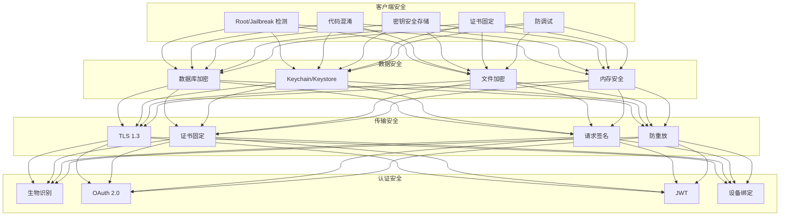

### 10.3 代码示例

#### 安全存储实现

```javascript
// security/SecureStorage.js
import * as Keychain from 'react-native-keychain';
import { Platform } from 'react-native';
import EncryptedStorage from 'react-native-encrypted-storage';

class SecureStorage {
  // 存储敏感凭证
  static async setCredentials(username, password, service) {
    try {
      await Keychain.setGenericPassword(username, password, {
        service,
        accessible: Keychain.ACCESSIBLE.WHEN_UNLOCKED,
        // iOS 生物识别
        accessControl: Platform.OS === 'ios'
          ? Keychain.ACCESS_CONTROL.BIOMETRY_CURRENT_SET
          : undefined,
      });
      return true;
    } catch (error) {
      console.error('Failed to save credentials:', error);
      return false;
    }
  }

  static async getCredentials(service) {
    try {
      const credentials = await Keychain.getGenericPassword({ service });
      return credentials;
    } catch (error) {
      console.error('Failed to get credentials:', error);
      return null;
    }
  }

  // 加密存储数据
  static async setSecureItem(key, value) {
    try {
      await EncryptedStorage.setItem(
        key,
        JSON.stringify(value)
      );
      return true;
    } catch (error) {
      console.error('Secure storage error:', error);
      return false;
    }
  }

  static async getSecureItem(key) {
    try {
      const session = await EncryptedStorage.getItem(key);
      return session ? JSON.parse(session) : null;
    } catch (error) {
      return null;
    }
  }

  static async removeSecureItem(key) {
    try {
      await EncryptedStorage.removeItem(key);
      return true;
    } catch (error) {
      return false;
    }
  }
}

export default SecureStorage;
```

#### 网络安全配置

```javascript
// security/NetworkSecurity.js
import { Platform } from 'react-native';
import { NetworkInfo } from 'react-native-network-info';
import DeviceInfo from 'react-native-device-info';

class NetworkSecurity {
  // 证书固定配置（Android）
  static getNetworkSecurityConfig() {
    return `<?xml version="1.0" encoding="utf-8"?>
<network-security-config>
    <domain-config cleartextTrafficPermitted="false">
        <domain includeSubdomains="true">api.example.com</domain>
        <pin-set expiration="2025-01-01">
            <pin digest="SHA-256">sha256/AAAAAAAAAAAAAAAAAAAAAAAAAAAAAAAAAAAAAAAAAAA=</pin>
            <pin digest="SHA-256">sha256/BBBBBBBBBBBBBBBBBBBBBBBBBBBBBBBBBBBBBBBBBBB=</pin>
        </pin-set>
    </domain-config>
</network-security-config>`;
  }

  // iOS ATS 配置
  static getATSConfig() {
    return {
      NSAppTransportSecurity: {
        NSAllowsArbitraryLoads: false,
        NSExceptionDomains: {
          'api.example.com': {
            NSExceptionMinimumTLSVersion: 'TLSv1.3',
            NSExceptionRequiresForwardSecrecy: true,
            NSIncludesSubdomains: true,
          },
        },
      },
    };
  }

  // 请求签名
  static async signRequest(method, endpoint, body, timestamp) {
    const deviceId = await DeviceInfo.getUniqueId();
    const nonce = this.generateNonce();

    const payload = `${method}|${endpoint}|${JSON.stringify(body)}|${timestamp}|${nonce}|${deviceId}`;

    // 使用存储的密钥进行 HMAC 签名
    const signature = await this.hmacSign(payload);

    return {
      'X-Timestamp': timestamp,
      'X-Nonce': nonce,
      'X-Device-Id': deviceId,
      'X-Signature': signature,
    };
  }

  static generateNonce() {
    return Math.random().toString(36).substring(2, 15);
  }

  static async hmacSign(payload) {
    // 实际实现使用原生模块进行加密
    const { NativeModules } = require('react-native');
    return await NativeModules.CryptoModule.hmacSha256(payload);
  }
}

// API 客户端安全配置
import axios from 'axios';

const apiClient = axios.create({
  baseURL: 'https://api.example.com',
  timeout: 30000,
  headers: {
    'Content-Type': 'application/json',
  },
});

// 请求拦截器 - 添加安全头
apiClient.interceptors.request.use(async (config) => {
  const timestamp = Date.now();
  const headers = await NetworkSecurity.signRequest(
    config.method.toUpperCase(),
    config.url,
    config.data,
    timestamp
  );

  Object.assign(config.headers, headers);

  // 添加认证令牌
  const token = await SecureStorage.getSecureItem('authToken');
  if (token) {
    config.headers.Authorization = `Bearer ${token}`;
  }

  return config;
});

// 响应拦截器 - 处理安全错误
apiClient.interceptors.response.use(
  (response) => response,
  async (error) => {
    if (error.response?.status === 401) {
      // 令牌过期，刷新或登出
      await handleTokenExpiration();
    }
    return Promise.reject(error);
  }
);
```

#### 设备安全检查

```javascript
// security/DeviceSecurity.js
import JailMonkey from 'jail-monkey';
import { NativeModules } from 'react-native';

class DeviceSecurity {
  // 检测 Root/Jailbreak
  static isDeviceCompromised() {
    return JailMonkey.isJailBroken();
  }

  // 检测调试器
  static isDebuggedMode() {
    return JailMonkey.isDebuggedMode();
  }

  // 检测模拟器
  static isOnExternalStorage() {
    return JailMonkey.isOnExternalStorage();
  }

  // 综合安全检查
  static async performSecurityCheck() {
    const checks = {
      isJailbroken: JailMonkey.isJailBroken(),
      isDebugged: JailMonkey.isDebuggedMode(),
      hookingDetected: JailMonkey.hookDetected(),
      isOnExternalStorage: JailMonkey.isOnExternalStorage(),
      // Android 特有
      adEnabled: JailMonkey.AdEnabled?.() || false,
    };

    // 如果检测到安全问题，记录并采取措施
    if (Object.values(checks).some(Boolean)) {
      await this.handleSecurityViolation(checks);
    }

    return checks;
  }

  static async handleSecurityViolation(checks) {
    // 上报安全事件
    console.warn('Security violation detected:', checks);

    // 可选：清除敏感数据
    if (checks.isJailbroken) {
      // await SecureStorage.clearAll();
      // 或者阻止应用运行
    }

    // 上报服务器
    try {
      await apiClient.post('/security/violation', {
        checks,
        timestamp: Date.now(),
      });
    } catch (error) {
      // 静默失败
    }
  }

  // 启用反调试（iOS）
  static enableAntiDebugging() {
    if (NativeModules.SecurityModule) {
      NativeModules.SecurityModule.enableAntiDebugging();
    }
  }

  // 检测 Frida 等调试工具
  static detectFrida() {
    return JailMonkey.hookDetected();
  }
}

export default DeviceSecurity;
```

### 10.4 平台安全对比

| 安全特性 | iOS | Android |
|----------|-----|---------|
| 安全存储 | Keychain | Keystore/EncryptedSharedPreferences |
| 代码签名 | 强制 | 强制 |
| 应用沙盒 | 严格 | 中等 |
| 生物识别 | Face ID/Touch ID | 指纹/面容 |
| 硬件加密 | Secure Enclave | TEE/StrongBox |
| 侧载限制 | 严格 | 较宽松 |

### 10.5 安全最佳实践清单

```markdown
## 移动应用安全清单

### 数据存储
- [ ] 敏感数据使用 Keychain/Keystore 存储
- [ ] 本地数据库加密（SQLCipher）
- [ ] 禁用应用备份包含敏感数据
- [ ] 内存中不长期保留敏感信息

### 网络安全
- [ ] 使用 HTTPS/TLS 1.3
- [ ] 实施证书固定
- [ ] 请求签名验证
- [ ] 防重放攻击保护

### 认证授权
- [ ] 生物识别认证
- [ ] JWT 短期令牌 + 刷新令牌
- [ ] 设备绑定
- [ ] 会话超时管理

### 代码安全
- [ ] 代码混淆（ProGuard/R8）
- [ ] Root/Jailbreak 检测
- [ ] 反调试保护
- [ ] 篡改检测

### 合规要求
- [ ] 隐私政策
- [ ] 数据最小化
- [ ] 用户同意管理
- [ ] 数据删除机制
```

---

## 附录：iOS/Android 开发注意事项汇总

### iOS 特别注意事项

| 类别 | 注意事项 | 解决方案 |
|------|----------|----------|
| UI 适配 | 刘海屏、动态岛 | SafeAreaView |
| 导航 | 返回手势 | 统一处理 |
| 键盘 | 遮挡输入框 | KeyboardAvoidingView |
| 权限 | 详细描述 | Info.plist 配置 |
| 审核 | 功能完整性 | 测试充分 |
| 推送 | APNs 配置 | 证书管理 |

### Android 特别注意事项

| 类别 | 注意事项 | 解决方案 |
|------|----------|----------|
| 权限 | 动态申请 | PermissionsAndroid |
| 返回键 | 硬件返回 | BackHandler |
| 状态栏 | 沉浸式 | StatusBar API |
| 存储 | 分区存储 | Scoped Storage |
| 后台 | 限制严格 | WorkManager |
| 推送 | FCM 配置 | Firebase |

---

> 文档版本: 1.0
> 最后更新: 2026-04-08
> 作者: AI Assistant
