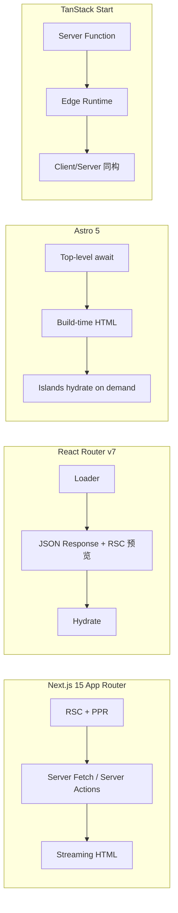
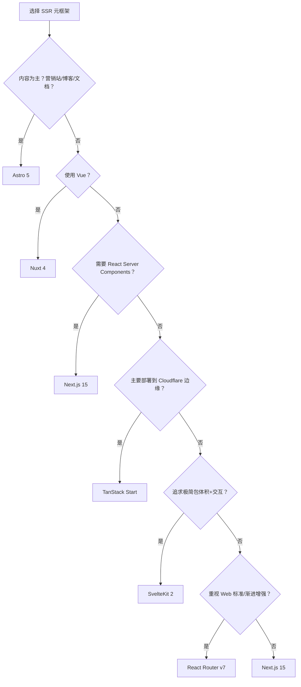

# SSR 元框架对比矩阵

> 对比主流全栈/SSR 元框架（Next.js、Nuxt、SvelteKit、Remix、TanStack Start 等），帮助你在服务端渲染、边缘部署、数据获取策略等维度做出选型决策。

---

## 核心指标对比

| 指标 | Next.js 15 | Nuxt 4 | SvelteKit 2 | React Router v7 | Astro 5 | TanStack Start |
|------|-----------|--------|-------------|-----------------|---------|----------------|
| **底层 UI 框架** | React | Vue | Svelte | React | **UI 无关** (React/Vue/Svelte/Solid) | React |
| **路由模式** | 文件系统路由 (App Router) | 文件系统路由 (Pages/Views) | 文件系统路由 | 文件系统路由 | 文件系统路由 | 文件系统路由 |
| **渲染策略** | SSR / SSG / ISR / RSC / **PPR** | SSR / SSG / ISR / Hybrid | SSR / CSR / Prerender | SSR + Streaming | **SSG 默认** + Islands SSR | SSR / CSR / 边缘 |
| **数据获取** | Server Components + fetch + Server Actions | useAsyncData / useFetch | load 函数 (统一服务端/客户端) | Loader/Action | Top-level await / Astro.glob | Server Functions |
| **边缘运行支持** | ✅ Vercel Edge / Node.js | ✅ Nitro (多预设) | ✅ Adapters | ✅ (Vite + Node) | ✅ Adapters (CF/Netlify/Vercel) | ✅ **原生 Cloudflare 优先** |
| **部署灵活性** | 高 (Vercel 最优) | 极高 (Nitro 适配器) | 高 | 高 | **极高** (纯静态可放任何 CDN) | 高 |
| **TypeScript 支持** | 极佳 | 极佳 | 良好 | 良好 | 良好 | 极佳 |
| **学习曲线** | 中等 | 平缓 | 平缓 | 中等 | **极平缓** (HTML-first) | 中等 |
| **Dev 冷启动 (M3)** | ~2.8s (Turbopack) | ~1.9s (Vite) | ~1.5s (Vite) | ~2.0s (Vite) | **~0.9s (Vite)** | ~1.8s (Vite) |

---

## 架构与特性矩阵

| 特性 | Next.js 15 | Nuxt 4 | SvelteKit 2 | React Router v7 | Astro 5 | TanStack Start |
|------|-----------|--------|-------------|-----------------|---------|----------------|
| **React Server Components** | ✅ 原生支持 | ❌ | ❌ | ⚠️ 预览中 | ❌ (Islands 替代) | ⚠️ 计划中 |
| **服务端数据变更** | ✅ Server Actions | ✅ API Routes / Server API | ✅ Form Actions | ✅ Actions | ✅ Form + API Endpoints | ✅ Server Functions |
| **边缘函数/Worker 部署** | ✅ Edge Runtime | ✅ Edge Preset | ✅ Edge Adapters | ✅ | ✅ Edge Adapters | ✅ 核心设计目标 |
| **中间件 (Middleware)** | ✅ | ✅ | ✅ | ✅ | ✅ | ✅ |
| **增量静态再生 (ISR)** | ✅ 成熟 | ✅ | ⚠️ 基础支持 | ⚠️ (预渲染) | ❌ (按需构建) | ⚠️ |
| **API 路由** | ✅ | ✅ | ✅ | ✅ | ✅ | ✅ |
| **数据库/ORM 集成** | Prisma/Drizzle | Prisma/Drizzle + 任意 | 任意 | 任意 | 任意 | D1/Turso 边缘优先 |
| **包体积 (默认)** | 大 (RSC 运行时) | 中 (Nitro) | **最小** (编译时消除) | 中 | **最小** (零 JS 默认) | 中 |

---

## 边缘部署与运行时对比

| 框架 | Vercel Edge | Cloudflare Workers | Cloudflare Pages | Netlify Edge | Node.js | 静态 CDN |
|------|-------------|-------------------|------------------|--------------|---------|---------|
| **Next.js 15** | ✅ 最优 | ⚠️ 有限 | ⚠️ | ⚠️ | ✅ | ⚠️ (export 受限) |
| **Nuxt 4** | ✅ | ✅ | ✅ | ✅ | ✅ | ✅ |
| **SvelteKit 2** | ✅ Adapter | ✅ Adapter | ✅ Adapter | ✅ Adapter | ✅ | ✅ Adapter |
| **React Router v7** | ✅ | ✅ | ✅ | ⚠️ | ✅ | ⚠️ |
| **Astro 5** | ✅ Adapter | ✅ Adapter | ✅ **首选** | ✅ Adapter | ✅ Adapter | ✅ **任何静态主机** |
| **TanStack Start** | ⚠️ | ✅ **首选** | ✅ | ⚠️ | ✅ | ⚠️ |

---

## 适用场景推荐

| 场景 | 首选 | 次选 | 理由 |
|------|------|------|------|
| React 全栈 / 大型电商 / SaaS | **Next.js 15** | React Router v7 | RSC + PPR + ISR 生态最成熟；Turbopack Stable |
| Vue 全栈 / 内容+交互混合 | **Nuxt 4** | — | Nitro + Layers 多站点复用；SSR/SSG 无感知切换 |
| 极致轻量 / 高性能交互 UI | **SvelteKit 2** | Next.js | Svelte 5 编译时消除框架代码；包体积比 React 小 50-70% |
| 内容优先 / 营销站 / 文档 / 博客 | **Astro 5** | Nuxt | Islands 架构：零 JS 默认；LCP 比 Next.js SSG 快 40-70% |
| 混合技术栈 / 迁移过渡 | **Astro 5** | — | 同一项目混用 React + Vue + Svelte 组件 |
| 坚守 Web 标准 / 渐进增强 | **React Router v7** | Next.js | 原生 Form + Link；Loader/Action 模式；Shopify/X.com/GitHub 生产验证 |
| 边缘优先 / Cloudflare 生态 | **TanStack Start** | Astro 5 | 原生 Workers/D1/KV；类型安全路由 |
| 快速原型 / 独立开发者 | **Astro 5** | Nuxt 4 | HTML-first，低配置，任何静态主机免费部署 |

---

## 2026 年重大生态变迁

### Remix → React Router v7（2024-11 稳定发布）

Remix 团队于 2024-05 宣布 Remix 与 React Router 合并：

- **React Router v7** 吸收了 Remix 的所有核心模式（loaders、actions、嵌套路由、服务端渲染）
- Remix v2 用户的推荐升级路径：**React Router v7 Framework Mode**（仅需 codemod 修改 import 路径）
- **Remix 3** 将是独立项目，基于 Preact 替代 React——与 React 生态无迁移路径
- React Router v7 已 powering Shopify (500万行代码)、X.com、GitHub、ChatGPT、Linear 等生产环境

> *"React Router v7 brings everything you love about Remix back into React Router proper."* — Remix Team, 2024-11

### Cloudflare 收购 Astro（2025）

Astro 被 Cloudflare 收购，进一步强化了边缘部署和性能优化方向。

### 构建输出实测对比（SiteGrade，2026-02）

同一营销站点（12 页面 + 50 篇博客 + CMS + 联系表单），部署到 Cloudflare Pages：

| 指标 | Next.js 15 | Nuxt 4 | Astro 5 |
|------|-----------|--------|---------|
| **构建时间** | ~45s | ~32s | **~18s** |
| **产物体积** | 1.8MB (JS) | 0.9MB (JS) | **0.15MB (JS)** |
| **LCP** | 1.2s | 0.9s | **~0.5s** |
| **FID** | 120ms | 80ms | **~20ms** |
| **Dev 冷启动** | 2.8s | 1.9s | **0.9s** |

*来源：SiteGrade Agency 独立测试 [sitegrade.io](https://sitegrade.io/en/blog/nextjs-vs-nuxt-vs-astro-2026-agency-comparison/)*

---

## 架构深度对比

### Astro Islands

```
┌─────────────────────────────────┐
│       Static HTML (no JS)       │
│                                 │
│  ┌─────────┐    ┌─────────┐     │
│  │ React   │    │ Vue     │     │
│  │ Island  │    │ Island  │     │
│  │(visible)│    │ (click) │     │
│  └─────────┘    └─────────┘     │
│                                 │
│       Static HTML (no JS)       │
└─────────────────────────────────┘
```

- 每个 Island 独立，不共享状态
- 不同框架可共存（React header + Vue slider + Svelte form）
- Hydration 可控：`client:load` / `client:visible` / `client:idle` / `client:media`
- 可完全移除 Island 实现零 JS 页面

### Next.js App Router

```
┌─────────────────────────────────┐
│   Server Component (no JS)      │
│                                 │
│  ┌─────────────────────────┐    │
│  │   Client Component      │    │
│  │   (React hydration)     │    │
│  │  ┌─────────────────┐    │    │
│  │  │ Server Component │    │    │
│  │  │ (nested, no JS)  │    │    │
│  │  └─────────────────┘    │    │
│  └─────────────────────────┘    │
└─────────────────────────────────┘
```

---

## 数据获取策略对比



---

## 决策建议



### 混合架构模式（2026 推荐）

```
┌─────────────────────────────────────────┐
│           混合元框架架构                 │
├─────────────────────────────────────────┤
│                                         │
│  ┌─────────────┐    ┌─────────────────┐ │
│  │  Astro 5    │    │   Next.js 15    │ │
│  │  营销站      │    │   应用 dashboard │ │
│  │  博客/文档   │◀───│   SaaS 产品     │ │
│  │  零 JS      │    │   RSC + PPR     │ │
│  └─────────────┘    └─────────────────┘ │
│         ▲                               │
│         │ 共享设计令牌 / 组件库           │
│  ┌──────┴──────┐                        │
│  │  React/Vue  │                        │
│  │  组件库     │                        │
│  └─────────────┘                        │
│                                         │
└─────────────────────────────────────────┘
```

> *"Some projects benefit from using both frameworks: Astro for the marketing site (homepage, blog, docs, pricing) — maximum performance. Next.js for the application (dashboard, checkout, admin) — maximum interactivity."* — WPPoland, 2026-03

---

> **关联文档**
>
> - [前端框架对比](./frontend-frameworks-compare.md)
> - [构建工具对比](./build-tools-compare.md)
> - `docs/guides/TANSTACK_START_CLOUDFLARE_DEPLOYMENT.md` — TanStack Start 边缘部署实战
> - `jsts-code-lab/59-fullstack-patterns/` — 全栈模式实现
