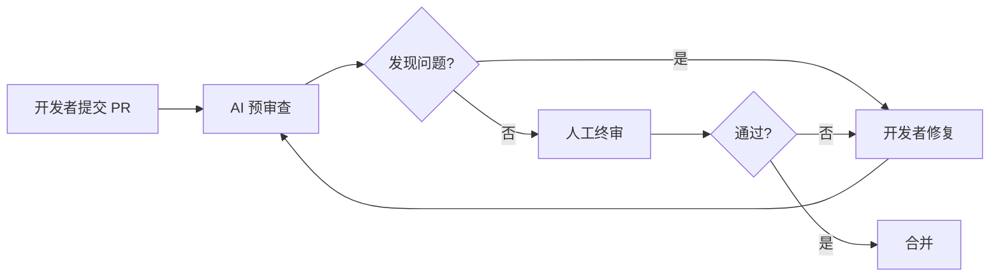

<!--
# 合并说明
- 合并来源: docs/guides/ai-coding-workflow.md（完整版，384 行）、30-knowledge-base/30.4-decision-trees/ai-coding-workflow.md（精简版，40 行）
- 合并决策: 保留 docs/ 目录中的完整版本，替换新架构中的精简版本
- 合并时间: 2026-04-28
-->
---

last-updated: 2026-04-27
review-cycle: 6 months
next-review: 2026-10-27
status: current
---

# AI 辅助编码工作流指南

> 本指南系统介绍如何在 JavaScript/TypeScript 项目中高效、安全地使用 AI 编码工具，涵盖工具选择、团队工作流、质量控制和合规安全。

---

## 一、AI 编码工具全景

### 1.1 主流工具对比

| 工具 | 类型 | 核心模型 | 定价（2026） | 适用场景 |
|------|------|----------|-------------|----------|
| **Cursor** | AI 原生 IDE | GPT-4o / Claude 3.5 Sonnet | $20/月（Pro） | 全栈开发、多文件重构、Composer 编辑 |
| **Claude Code** | CLI 工具 | Claude 3.5 Sonnet / Opus | $20/月（Pro） | 命令行工作流、批量修改、代码审查 |
| **GitHub Copilot** | IDE 插件 | GPT-4o / 自定义模型 | $10/月（个人）$19/月（商业） | 日常编码补全、IDE 集成、团队协作 |
| **Windsurf** | AI 原生 IDE | GPT-4o / Claude 3.5 | $15/月（Pro） | Cascade 工作流、实时协作 |
| **Trae** | AI 原生 IDE | 多模型支持 | 免费 / $12/月 | 初学者友好、中文优化 |
| **Zed** | 高性能编辑器 | 多模型（AI 扩展） | 免费（编辑器）+ API 费用 | 性能敏感场景、Rust 爱好者 |
| **JetBrains AI** | IDE 插件 | 多模型 | $10/月 | IntelliJ 系列用户 |
| **Codeium** | IDE 插件 | 自研模型 | 免费 / $12/月（Pro） | 隐私要求高、离线环境 |
| **Tabnine** | IDE 插件 | 自研模型 | $12/月（Pro） | 企业私有化部署 |
| **Aider** | CLI 工具 | GPT-4o / Claude / 本地模型 | 免费（开源） | Git 集成、多文件编辑 |
| **Continue.dev** | IDE 插件 | 多模型（可配置） | 免费（开源） | 模型自由选择、开源偏好 |

### 1.2 各工具适用场景详解

#### Cursor

- **优势**：Composer 多文件编辑、原生 AI 体验、上下文感知强
- **最佳场景**：
  - 从零搭建项目脚手架
  - 跨文件重构（重命名类型、迁移 API）
  - 理解和修改大型代码库
  - 生成测试和文档
- **局限**：VS Code 插件生态兼容但偶有冲突；重度依赖云端模型

#### Claude Code

- **优势**：命令行交互自然、支持长上下文（200K tokens）、擅长复杂推理
- **最佳场景**：
  - 批量文件修改（正则替换、API 迁移）
  - 代码审查和架构分析
  - 与 CI/CD 流水线集成
  - 处理大型代码库的问答
- **局限**：无 GUI，不适合 UI 开发；需要终端操作熟练度

#### GitHub Copilot

- **优势**：IDE 集成最成熟、学习成本低、社区最大
- **最佳场景**：
  - 日常编码的内联补全
  - 快速生成样板代码
  - IDE 内 Chat 问答
  - 企业团队统一采购
- **局限**：补全质量依赖上下文；Workspace 功能仍处实验阶段

#### Windsurf

- **优势**：Cascade 流式生成、实时预览、AI 代理模式
- **最佳场景**：
  - 前端 UI 开发（实时预览）
  - 迭代式原型开发
  - 需要 AI 自主执行多步骤任务

#### 本地模型方案（Ollama + Continue / Aider）

- **优势**：完全离线、数据不出境、零订阅费用
- **最佳场景**：
  - 处理敏感代码（金融、政府、医疗）
  - 网络受限环境
  - 定制化模型微调
- **局限**：硬件要求高（推荐 24GB+ VRMA）；代码质量低于云端大模型

### 1.3 选型决策树

```
需要处理敏感代码/离线环境？
  ├─ 是 → 本地模型（Ollama + CodeLlama/DeepSeek-Coder）
  └─ 否 → 需要多文件同时编辑？
           ├─ 是 → Cursor 或 Claude Code
           └─ 否 → 习惯 VS Code？
                    ├─ 是 → GitHub Copilot 或 Cursor
                    └─ 否 → JetBrains AI（IntelliJ）或 Zed
```

---

## 二、团队 AI 工作流设计

### 2.1 代码审查中的 AI 辅助

#### 工作流：AI 预审查 → 人工终审



**AI 预审查职责**：

- 检测类型错误和潜在空指针
- 标识安全问题（SQL 注入、XSS、硬编码密钥）
- 检查代码风格和命名规范
- 发现重复代码和过度复杂函数
- 验证测试覆盖率

**人工终审职责**：

- 业务逻辑正确性
- 架构设计合理性
- 边界条件完整性
- 与现有代码的兼容性
- 性能影响评估

**实施建议**：

1. 在 CI 中集成 AI 审查工具（如 CodeRabbit、PR-Agent）
2. AI 审查报告作为 PR 的自动评论
3. 设置严重问题自动阻止合并，警告类问题人工判断

### 2.2 AI 生成文档的工作流

#### 半自动化文档更新流程

```
代码变更 → AI 生成文档草稿 → 开发者校对 → 发布
```

**适用文档类型**：

| 文档类型 | AI 适用性 | 人工校对重点 |
|----------|----------|-------------|
| API 文档（OpenAPI/Swagger） | ⭐⭐⭐⭐⭐ | 业务语义准确性 |
| 函数 JSDoc | ⭐⭐⭐⭐⭐ | 参数约束和异常说明 |
| README 快速开始 | ⭐⭐⭐⭐ | 环境差异和版本兼容性 |
| 架构设计文档 | ⭐⭐⭐ | 设计决策的理由 |
| 用户操作手册 | ⭐⭐ | 截图和交互细节 |

**Prompt 模板（生成 API 文档）**：

```markdown
请为以下 Express Router 生成 OpenAPI 3.0 文档片段。

要求：
1. 包含所有路径、方法、参数、响应
2. 为每个字段添加中文描述
3. 标注必填字段和示例值
4. 包含 400/401/404/500 的错误响应
```

### 2.3 AI 辅助代码重构的流程

#### 安全重构四步法

**步骤 1：现状分析**

- 让 AI 分析目标代码的复杂度、依赖关系和潜在风险
- 输出：依赖图、复杂度指标、风险点列表

**步骤 2：方案设计**

- 让 AI 提供 2-3 种重构方案并比较优劣
- 人工选择方案并补充业务约束

**步骤 3：增量实施**

- 将重构拆分为小步骤（每次 < 5 个文件）
- 每步完成后运行测试和类型检查
- 使用 Git 频繁提交，便于回滚

**步骤 4：验证回归**

- 全量测试通过
- 性能对比（重构前后基准测试）
- 代码审查确认

**重构禁止清单**：

- ❌ 在发布前 3 天内进行大规模重构
- ❌ 没有测试覆盖的代码直接重构
- ❌ 一次 PR 中混合功能开发和重构
- ❌ 修改核心基类时不通知相关模块负责人

### 2.4 知识库构建（AI 学习团队代码风格）

#### 团队 AI 知识库结构

```
.ai-knowledge/
├── coding-standards.md       # 编码规范
├── architecture-overview.md  # 架构概览
├── common-patterns.md        # 常用模式
├── api-conventions.md        # API 约定
├── testing-guidelines.md     # 测试规范
├── error-handling.md         # 错误处理策略
└── examples/                 # 优质代码示例
    ├── feature-module/
    ├── utility-function/
    └── react-component/
```

**使用方法**：

1. 在 Cursor 的 `.cursorrules` 中引用知识库文件
2. 在 Claude Code 会话开始时加载知识库上下文
3. 在 Copilot Chat 中通过 `#file` 引用规范文件

**维护策略**：

- 每次架构决策后更新 `architecture-overview.md`
- 每季度评审和精简知识库（避免过时信息）
- 将代码审查中反复出现的问题转化为规范文档

---

## 三、质量控制

### 3.1 AI 生成代码的常见问题

#### 幻觉（Hallucination）

- **表现**：生成不存在的 API、虚构的库函数、错误的类型定义
- **案例**：AI 生成 `DateTime.fromISO()`（实际库使用 `DateTime.fromISO()` 但参数签名错误）
- **防范**：
  - 要求 AI 只使用项目中已导入的依赖
  - 生成后手动验证 API 签名（查阅官方文档）
  - 运行 TypeScript 编译和单元测试

#### 过时 API

- **表现**：使用已废弃的库版本语法、旧框架生命周期
- **案例**：React 中使用 `componentWillMount`，Node.js 中使用废弃的 `url.parse`
- **防范**：
  - 在 Prompt 中明确指定依赖版本
  - 定期运行 `npm outdated` 和 lint 规则检查
  - 将 `deprecation` 设为 ESLint 错误级别

#### 安全漏洞

- **表现**：XSS、SQL 注入、CSRF、硬编码密钥、不安全的正则
- **案例**：AI 生成 `innerHTML = userInput` 或直接拼接 SQL
- **防范**：
  - 强制使用参数化查询和模板转义
  - AI 生成代码必须通过安全扫描（Semgrep、CodeQL）
  - 禁止 AI 生成包含 `eval`、`Function()`、`innerHTML` 的代码（除非经过审查）

#### 性能陷阱

- **表现**：N+1 查询、内存泄漏、不必要的重渲染、O(n²) 算法
- **防范**：
  - 要求 AI 分析算法复杂度
  - 大数据量场景要求 AI 提供性能测试
  - 使用 React DevTools Profiler 和 Node.js clinic.js 检测

### 3.2 AI 生成代码审查清单

#### 必须通过的人工检查点

**功能性检查**

- [ ] 代码是否真正实现了需求（而非看似正确）
- [ ] 边界条件是否被充分测试
- [ ] 错误路径是否有适当的处理
- [ ] 并发/异步场景是否安全

**质量检查**

- [ ] 是否遵循项目编码规范
- [ ] 函数是否单一职责（圈复杂度 < 10）
- [ ] 命名是否清晰表达意图
- [ ] 是否有重复代码可提取

**安全检查**

- [ ] 用户输入是否被验证和转义
- [ ] 敏感数据是否被正确处理（不日志、不返回）
- [ ] 权限检查是否完整（水平/垂直越权）
- [ ] 是否使用安全的加密和哈希算法

**类型检查**

- [ ] TypeScript 是否严格模式通过（`noImplicitAny`）
- [ ] 是否有隐式 any 或类型断言（`as`）滥用
- [ ] 泛型使用是否合理
- [ ] 返回值类型是否完整

**测试检查**

- [ ] 是否包含对应的单元/集成测试
- [ ] 测试是否真正验证了行为（而非只覆盖代码）
- [ ] Mock 是否恰当（不过度也不不足）
- [ ] 测试是否独立且可重复

### 3.3 如何训练 AI 理解团队规范

#### 短期适配（单次会话）

```markdown
## 项目规范（本次会话有效）

### 技术栈
- React 19 + TypeScript 5.8 + Vite
- 状态管理: Zustand（不使用 Redux）
- UI 库: Tailwind CSS + Headless UI
- 表单: React Hook Form + Zod

### 代码风格
- 函数组件使用箭头函数
- Props 类型命名为 {ComponentName}Props
- API 调用封装在 services/ 目录，使用自定义 useQuery hook
- 错误处理使用 ErrorBoundary + toast 通知

### 示例
{粘贴一段团队优质代码作为参考}
```

#### 长期训练（知识库）

1. **创建 `.cursorrules`**：Cursor 会自动加载项目根目录的该文件
2. **使用 GitHub Copilot 的 `.github/copilot-instructions.md`**：团队共享的指令文件
3. **Claude Code 的项目配置**：在项目目录创建 `.claude-code-context.md`

#### 反馈循环

```
AI 生成代码 → 人工审查标记问题 → 更新规范文档 → AI 下次遵循
```

**关键**：将审查中发现的问题转化为具体的规则描述，而非模糊要求。

---

## 四、安全与合规

### 4.1 代码隐私：本地模型 vs 云端模型

| 维度 | 云端模型（Copilot/Cursor） | 本地模型（Ollama） |
|------|--------------------------|------------------|
| **数据隐私** | 代码上传至厂商服务器 | 完全本地，数据不出境 |
| **代码质量** | 高（GPT-4o/Claude 级别） | 中等（依赖模型和硬件） |
| **响应速度** | 快（取决于网络） | 快（依赖 GPU） |
| **成本** | 订阅费 | 硬件投入 + 电费 |
| **合规性** | 需审查厂商数据处理协议 | 天然合规 |
| **适用场景** | 一般商业项目 | 金融、政务、医疗、核心算法 |

#### 企业决策建议

```
公开开源项目 / 一般业务代码 → 云端模型
包含 PII/财务数据/核心算法 → 本地模型或私有化部署
混合场景 → 按代码库分类配置（.gitignore 标记敏感文件）
```

### 4.2 敏感信息泄露风险

#### 高风险场景

| 风险类型 | 示例 | 防护措施 |
|----------|------|----------|
| API Key 泄露 | AI 建议中包含硬编码的密钥 | 使用环境变量 + pre-commit 钩子扫描 |
| 数据库密码 | AI 生成含密码的连接字符串 | 禁止 AI 访问含密码的配置文件 |
| 内部系统地址 | 提示词中暴露内网 IP/域名 | 脱敏处理后提供给 AI |
| 商业逻辑泄露 | 核心算法通过 Prompt 上传云端 | 本地模型或代码片段匿名化 |

#### 防护措施

1. **Git 钩子防护**

   ```bash
   # .git/hooks/pre-commit
   # 使用 detect-secrets 或 git-secrets 扫描
   ```

2. **AI 工具配置**
   - Cursor：设置中开启"隐私模式"（不上传代码到云端训练）
   - Copilot：企业版可配置数据保留策略
   - Claude Code：默认不保留会话数据（需确认）

3. **团队规范**
   - 严禁在 AI Prompt 中粘贴生产环境配置
   - 使用 `.env.example` 而非真实 `.env` 作为上下文
   - 核心算法文件标记为 `@sensitive`，AI 工具忽略

### 4.3 许可证合规（AI 生成代码的版权归属）

#### 当前法律状态（2026）

- **美国**：USCO 认为纯 AI 生成内容不受版权保护；含人工创作的混合作品可能受保护
- **欧盟**：AI 生成代码的版权归属尚无统一判例，建议保留人工创作痕迹
- **中国**：《著作权法》保护的是"独创性表达"，AI 辅助创作的代码若有人工独创性编排，可能受保护

#### 实务建议

| 场景 | 建议 |
|------|------|
| 开源项目使用 AI 生成代码 | 在 LICENSE 或 CONTRIBUTING 中声明使用 AI 辅助 |
| 商业产品核心模块 | 确保核心逻辑有人工设计痕迹，保留设计文档 |
| 使用 Copilot 生成代码 | GitHub 声明用户拥有生成代码的权利，但建议审查与训练数据相似性 |
| 担心许可证污染 | 使用 `copilot-ignore` 或类似工具扫描与 GPL 等 Copyleft 代码的相似度 |

**最佳实践**：

1. AI 生成代码后，进行实质性的人工修改和审查
2. 保留 AI 辅助的记录（用于证明人工参与）
3. 避免直接复制 AI 生成的大型代码块到生产环境而不经审查
4. 使用许可证扫描工具（FOSSA、Snyke）作为 CI 环节

---

## 五、效率数据与行业趋势

### 5.1 2026 年行业报告核心数据

#### AI 代码生成占比

```
┌─────────────────────────────────────────────────────┐
│  平均 30-60% 的新增代码由 AI 生成（因项目类型而异）  │
│                                                     │
│  脚本/工具代码      ████████████████████░░░░░  75%  │
│  前端组件           ██████████████████░░░░░░░  65%  │
│  单元测试           ██████████████████░░░░░░░  65%  │
│  API 端点           ████████████████░░░░░░░░░  55%  │
│  业务逻辑           ████████████░░░░░░░░░░░░░  40%  │
│  算法/数据结构      ████████░░░░░░░░░░░░░░░░░  25%  │
│  架构设计           ████░░░░░░░░░░░░░░░░░░░░░  15%  │
└─────────────────────────────────────────────────────┘
```

#### 开发速度提升

| 指标 | 提升幅度 | 说明 |
|------|----------|------|
| 代码产出量 | +40~80% | 相同时间内编写的代码行数 |
| 样板代码编写 | +200%+ | 配置、类型定义、基础 CRUD |
| Bug 修复速度 | +25~40% | AI 辅助定位和生成修复 |
| 新人上手时间 | -30~50% | AI 解释代码和生成示例 |
| 代码审查周期 | -20~30% | AI 预审查减少往返次数 |

**注意**：产出量提升不直接等同于价值提升。AI 辅助开发的主要价值在于：

- 减少重复劳动，释放创造力
- 降低记忆负担（API 签名、配置细节）
- 加速从想法到可运行原型的过程

### 5.2 不同框架的 AI 生成准确率差异

基于 2026 年初的多项 benchmark 和社区反馈：

| 框架/技术 | 准确率评级 | 说明 |
|-----------|-----------|------|
| **React / Next.js** | ⭐⭐⭐⭐⭐ (90%+) | 训练数据最丰富，社区模式成熟 |
| **Vue / Nuxt** | ⭐⭐⭐⭐ (85%+) | 良好支持，Options API 比 Composition API 更准 |
| **Express / NestJS** | ⭐⭐⭐⭐ (85%+) | 后端模式标准化，生成质量高 |
| **Angular** | ⭐⭐⭐⭐ (80%+) | 装饰器模式 AI 理解良好 |
| **Svelte** | ⭐⭐⭐ (75%+) | 训练数据相对较少 |
| **Astro** | ⭐⭐⭐ (70%+) | 岛屿架构较新，AI 理解有限 |
| **Qwik** | ⭐⭐ (60%+) | 可恢复性模式独特，AI 易混淆 |
| **Deno / Bun** | ⭐⭐⭐ (75%+) | Node.js 模式迁移大部分可用 |
| **新兴库 (< 1年)** | ⭐⭐ (50-60%) | 训练数据不足，需大量人工修正 |

**准确率定义**：AI 生成代码在不做修改或只做微小修改即可正确运行的比例。

#### 提升准确率策略

1. **使用主流技术栈**：AI 对流行框架的理解远胜小众方案
2. **提供完整上下文**：导入语句、类型定义、示例代码帮助 AI 理解项目模式
3. **分步生成**：复杂功能拆分为多个简单步骤生成
4. **版本锁定**：明确指定依赖版本，避免 AI 使用过时的 API
5. **人工审查**：始终将 AI 视为"高效的初级开发者"，产出需审查

---

## 六、推荐工作流总结

### 个人开发者日常流程

```
1. 需求理解      → 与 AI 讨论需求，澄清边界条件
2. 技术方案      → 让 AI 提供 2-3 个方案，人工选择
3. 骨架生成      → AI 生成项目/模块骨架
4. 迭代开发      → 函数级 AI 生成 + 人工审查
5. 测试生成      → AI 生成测试草稿 → 人工补充边界
6. 文档同步      → AI 生成 JSDoc / README → 人工校对
7. 提交前审查    → AI 扫描 + 人工终审
```

### 团队协作流程

```
1. 规范定义      → 团队共同维护 .cursorrules / copilot-instructions.md
2. AI 预审查     → CI 自动运行 AI 审查，标记问题
3. 结对编程      → 一人编码 + AI 辅助，另一人审查
4. 知识沉淀      → 将优质 Prompt 和模式纳入团队知识库
5. 定期复盘      → 每月评审 AI 生成代码的质量趋势
```

---

## 附录：Prompt 资源

- [项目内 Prompt 模板库](../../20-code-lab/20.7-ai-agent-infra/code-generation/ai-assisted-workflow/prompt-engineering-guide.md)
- [Cursor 工作流](../../20-code-lab/20.7-ai-agent-infra/code-generation/ai-assisted-workflow/cursor-workflow.ts)
- [Claude Code 模式](../../20-code-lab/20.7-ai-agent-infra/code-generation/ai-assisted-workflow/claude-code-patterns.ts)
- [Copilot 技巧](../../20-code-lab/20.7-ai-agent-infra/code-generation/ai-assisted-workflow/github-copilot-patterns.ts)
- [AI 测试生成](../../20-code-lab/20.7-ai-agent-infra/code-generation/ai-assisted-workflow/ai-testing-generation.ts)
