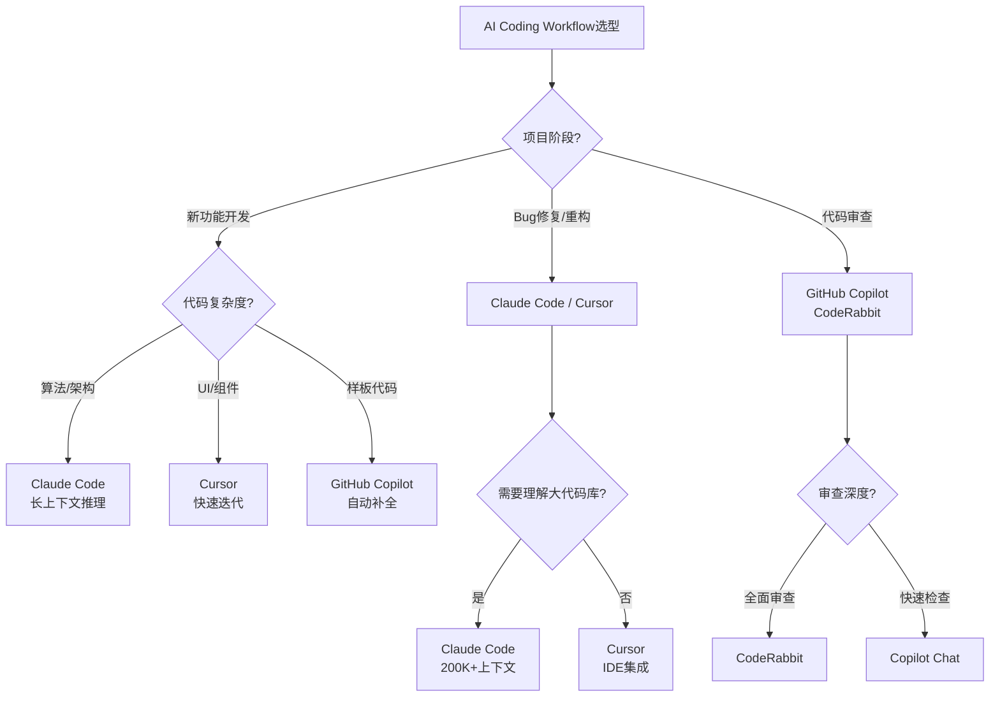

# 决策树：AI 辅助编码工作流选择

> **定位**：`30-knowledge-base/30.4-decision-trees/`
> **新增**：2026-04

---

## 决策树

---

## 工具对比矩阵

| 工具 | 类型 | 上下文长度 | TS支持 | 最佳场景 | 定价 |
|------|------|-----------|--------|---------|------|
| **Cursor** | IDE | 200K tokens | ⭐⭐⭐⭐⭐ | 快速迭代、UI开发 | $20/月 |
| **Claude Code** | CLI/Agent | 200K | ⭐⭐⭐⭐⭐ | 架构设计、大重构 | API计费 |
| **GitHub Copilot** | 插件 | 8K | ⭐⭐⭐⭐☆ | 日常补全、样板代码 | $10/月 |
| **Windsurf** | IDE | 200K | ⭐⭐⭐⭐☆ | 多文件编辑 | $15/月 |
| **CodeRabbit** | CI集成 | 128K | ⭐⭐⭐⭐☆ | PR审查 | $15/月 |

---

## 生产力数据

- **GitHub 研究**：使用 Copilot 的开发者任务完成速度快 **55%**
- **Cursor 报告**：代码生成准确率 **85%**（TS 项目）
- **关键洞察**：AI 生成 React/Next.js 准确率显著高于 Astro/Qwik（训练数据差异）

---

*本决策树反映 2026 年 AI 辅助编码工具的格局。*
