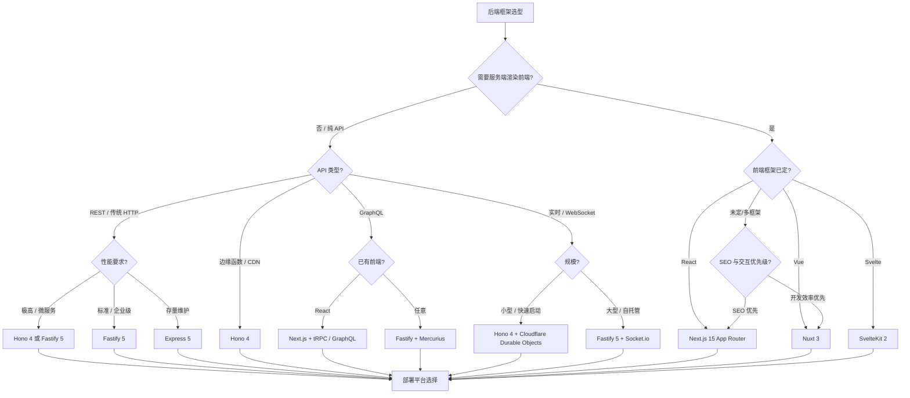

# 决策树：后端框架选择

> **定位**：`30-knowledge-base/30.4-decision-trees/`
> **对齐版本**：Next.js 15 | Nuxt 3 | SvelteKit 2 | Remix 2.4 | Hono 4 | Fastify 5 | Express 5
> **权威来源**：State of JS 2025、Rising Stars 2026、TechEmpower Benchmark Round 24、Node.js 官方博客
> **最后更新**：2026-04

---

## 后端框架现状（2026 Q2）

| 特性 | Next.js 15 | Nuxt 3 | SvelteKit 2 | Remix 2.4 | Hono 4 | Fastify 5 | Express 5 |
|------|------------|--------|-------------|-----------|--------|-----------|-----------|
| **架构模式** | 全栈 React / RSC | 全栈 Vue | 全栈 Svelte | 全栈 React（渐进增强） | 轻量 Edge 路由 | 插件化 HTTP | 极简中间件 |
| **运行时支持** | Node.js / Edge | Node.js / Edge | Node.js / Edge | Node.js / Edge | 任何（WinterCG） | Node.js | Node.js |
| **冷启动** | ~200ms（Node）/ ~50ms（Edge）| ~180ms | ~160ms | ~220ms | **~15ms** | ~120ms | ~100ms |
| **吞吐量** | 高（App Router 优化） | 高 | 高 | 中高 | **极高** | 极高 | 中等 |
| **包体积** | 较大 | 中等 | 小 | 中等 | **极小** | 小 | 极小 |
| **学习曲线** | 中等 | 低 | 低 | 中等 | 低 | 中等 | 极低 |
| **TypeScript** | ✅ 原生 | ✅ 原生 | ✅ 原生 | ✅ 原生 | ✅ 原生 | ✅ 良好 | ✅ 需配置 |
| **全栈能力** | ★★★★★ | ★★★★☆ | ★★★★☆ | ★★★★☆ | ★★☆☆☆ | ★★☆☆☆ | ★☆☆☆☆ |
| **边缘部署** | ✅ Vercel/Cloudflare | ✅ 多种 | ✅ 多种 | ✅ Fly/Vercel | **✅ 全部** | ❌ | ❌ |
| **企业采用率** | ~35% | ~12% | ~5% | ~4% | ~8% | ~15% | ~45% |
| **2026 关键特性** | Partial Prerendering | Nitro 引擎 | Svelte 5 集成 | Vite 插件 | Ultra-fast | Pino v9 | 最终 LTS |

*来源：TechEmpower Benchmark Round 24（2026-02）、State of JS 2025、npm 下载统计（2026-04）。*

> **关键洞察**：全栈框架（Next.js、Nuxt、SvelteKit）继续吞噬纯 API 框架的市场份额，但 Hono 在边缘计算和微服务场景异军突起。Express 5 终于发布最终版本，成为维护存量系统的安全选择。Remix 被 Shopify 收购后战略重心调整，社区增长放缓。

---

## 决策树



---

## 决策因素矩阵

| 场景 | 首选 | 次选 | 避免 | 关键理由 |
|------|------|------|------|---------|
| **全栈 React 应用（电商/SaaS）** | Next.js 15 | Remix 2.4 | Express | RSC + Server Actions + 流式渲染，生态最强 |
| **全栈 Vue 应用** | Nuxt 3 | — | Next.js | Nitro 引擎，自动代码分割，Vue 生态原生支持 |
| **全栈 Svelte 应用** | SvelteKit 2 | — | — | Svelte 5 Runes 集成，编译时优化到极致 |
| **边缘函数 / Cloudflare Workers** | Hono 4 | Next.js Edge | Express | 4KB 包体积，WinterCG 合规，多端运行 |
| **高吞吐微服务 API** | Fastify 5 | Hono 4 | Express | JSON Schema 验证、插件架构、2x Express 吞吐量 |
| **存量系统维护** | Express 5 | Fastify | Hono | 最终 LTS 版本，最大人才池，迁移成本最低 |
| **实时应用（聊天/游戏）** | Fastify + Socket.io | Hono + Durable Objects | Next.js | WebSocket 成熟方案，水平扩展友好 |
| **Serverless（AWS Lambda）** | Hono 4 | Fastify | Next.js（冷启动大） | 15ms 冷启动，极小包体积 |
| **内容管理系统（CMS）** | Nuxt + Nuxt Content | Next.js + Sanity | Express | 内容层抽象，类型安全 |
| **多租户 SaaS 平台** | Next.js 15 | Fastify | Express | 中间件堆栈、认证、数据库路由成熟方案多 |

---

## 框架深度对比

### Next.js 15 — React 全栈的事实标准

Next.js 15 将 App Router 推向成熟，Partial Prerendering（PPR）允许同一页面中静态和动态内容共存。

**核心优势**：
- React Server Components 深度集成，自动代码分割
- Server Actions 消除 API 路由层，表单处理极简
- 边缘/Node.js 双运行时支持
- Vercel 生态（Analytics、Speed Insights、Image Optimization）

**2026 关键更新**：
- Partial Prerendering 稳定版
- `next/font` 自动优化所有字体
- Turbopack 开发模式稳定（替代 Webpack）
- 改进的缓存控制（`unstable_cache` → `cache`）

**代码示例**：

```tsx
// app/page.tsx — Server Component 默认
import { Suspense } from 'react'
import { ProductList } from './ProductList'
import { Skeleton } from '@/components/Skeleton'

// 自动缓存，可复用
async function getProducts() {
  const res = await fetch('https://api.example.com/products', {
    next: { revalidate: 3600 }
  })
  return res.json()
}

export default async function HomePage() {
  const products = getProducts() // 不 await，流式传递
  
  return (
    <main>
      <h1>Products</h1>
      <Suspense fallback={<Skeleton />}>
        <ProductList promise={products} />
      </Suspense>
    </main>
  )
}

// app/actions.ts — Server Action
'use server'

export async function addToCart(formData: FormData) {
  const productId = formData.get('productId')
  await db.cart.create({ data: { productId } })
  revalidatePath('/cart')
}
```

---

### Nuxt 3 — Vue 全栈的优雅方案

Nuxt 3 的 Nitro 引擎提供统一的开发体验，自动处理服务端渲染、API 路由和静态生成。

**核心优势**：
- 约定优于配置，目录结构即路由
- Nitro 引擎：开发/生产一致，自动代码分割
- 模块生态丰富（Auth、Content、Image、SEO）
- 服务端和客户端 composables 无缝共享

**2026 关键更新**：
- Nuxt 4 预览（原生 TypeScript 配置、改进的 HMR）
- 实验性 Vapor Mode 支持
- 改进的岛屿架构（Islands）

---

### SvelteKit 2 — 编译型全栈框架

SvelteKit 2 深度集成 Svelte 5 的 Runes，提供类型安全的路由和表单处理。

**核心优势**：
- 编译时优化带来最小服务端开销
- 表单 actions 内置 CSRF 保护和渐进增强
- 适配器模式支持任意平台部署
- 零虚拟 DOM，服务端渲染极快

---

### Hono 4 — 边缘时代的轻量路由

Hono（ Flame 日语）是一个基于 Web Standards 的超轻量路由框架，可在 Cloudflare Workers、Deno、Bun、Node.js 上运行。

**核心优势**：
- **极小体积**：~4KB（hono/tiny），冷启动 <15ms
- **多端运行**：同一套代码跑在 Node.js、Deno、Bun、Cloudflare Workers、AWS Lambda
- **内置中间件**：CORS、JWT、缓存、验证（Zod 集成）
- **TypeScript 原生**：路由定义即类型定义

**2026 关键更新**：
- HonoX 全栈框架（类 Next.js 的 Hono 方案）
- RPC 客户端（类型安全的客户端调用）
- 改进的 JSX 支持（hono/jsx）

**代码示例**：

```typescript
// Hono 4 — 边缘函数 + RPC
import { Hono } from 'hono'
import { z } from 'zod'
import { zValidator } from '@hono/zod-validator'

const app = new Hono()

// 类型安全的路由 + 验证
const route = app.post('/api/users',
  zValidator('json', z.object({
    name: z.string().min(1),
    email: z.string().email(),
  })),
  async (c) => {
    const data = c.req.valid('json')
    const user = await db.user.create({ data })
    return c.json({ id: user.id, name: user.name })
  }
)

// 导出类型供 RPC 客户端使用
export type AppType = typeof route

export default app
```

```typescript
// client.ts — Hono RPC 类型安全客户端
import { hc } from 'hono/client'
import type { AppType } from './server'

const client = hc<AppType>('https://api.example.com')

// 完全类型安全：自动推导请求体和响应体
const res = await client.api.users.$post({
  json: { name: 'Alice', email: 'alice@example.com' }
})
const data = await res.json() // { id: string, name: string }
```

---

### Fastify 5 — 高性能 Node.js API 框架

Fastify 5 继续强化其插件架构和 JSON Schema 验证，是构建微服务和 REST API 的首选。

**核心优势**：
- **性能**：JSON 解析比 Express 快 2 倍，吞吐量高 20%
- **插件系统**：完全封装的插件，无全局状态污染
- **JSON Schema**：内置 `fast-json-stringify`，响应序列化优化
- **生态**：@fastify/swagger、@fastify/jwt、@fastify/cors 等官方插件

**2026 关键更新**：
- Pino v9 集成（日志性能提升）
- 改进的 TypeScript 声明合并
- 异步构造函数支持

**代码示例**：

```typescript
// Fastify 5 — 插件化架构 + OpenAPI
import Fastify from 'fastify'
import swagger from '@fastify/swagger'
import jwt from '@fastify/jwt'

const app = Fastify({ logger: true })

// 注册插件（顺序无关，封装隔离）
await app.register(swagger, {
  openapi: { info: { title: 'API', version: '1.0.0' } }
})
await app.register(jwt, { secret: process.env.JWT_SECRET! })

// JSON Schema 定义路由（运行时验证 + 类型推导）
app.post<{
  Body: { name: string; email: string }
  Reply: { id: number; name: string }
}>('/users', {
  schema: {
    body: {
      type: 'object',
      required: ['name', 'email'],
      properties: {
        name: { type: 'string', minLength: 1 },
        email: { type: 'string', format: 'email' }
      }
    }
  }
}, async (request, reply) => {
  const user = await db.user.create({ data: request.body })
  reply.status(201).send({ id: user.id, name: user.name })
})

await app.listen({ port: 3000 })
```

---

### Express 5 — 稳定之锚

Express 5 是经过多年等待的最终版本，主要目标是兼容性和安全修复，而非新特性。

**核心优势**：
- 最大的中间件生态和历史代码库
- 最简单的学习曲线
- Express 5 终于支持 Promise 错误处理（`async/await` 安全）
- 广泛的托管平台支持

**局限**：
- 无内置 TypeScript 支持
- 性能落后于 Fastify/Hono
- 无原生 async/await 错误处理（Express 5 改善）
- 无内置验证、序列化优化

**代码示例**：

```typescript
// Express 5 — 现代化 TypeScript（仍需手动包装）
import express, { Request, Response, NextFunction } from 'express'

const app = express()
app.use(express.json())

// Express 5 支持 Promise 拒绝自动传递
app.get('/users/:id', async (req, res) => {
  const user = await db.user.findUnique({
    where: { id: parseInt(req.params.id) }
  })
  if (!user) {
    res.status(404).json({ error: 'Not found' })
    return
  }
  res.json(user)
})

// 全局错误处理
app.use((err: Error, req: Request, res: Response, next: NextFunction) => {
  console.error(err)
  res.status(500).json({ error: err.message })
})

app.listen(3000)
```

---

## 正面案例 / 反面案例

### ✅ 何时选择该框架

| 框架 | 正确场景 |
|------|---------|
| **Next.js 15** | React 全栈应用；需要 SEO + 丰富交互；Vercel 部署；使用 React Server Components |
| **Nuxt 3** | Vue 全栈应用；需要约定优于配置；内容驱动站点；团队熟悉 Vue |
| **SvelteKit 2** | 追求极致性能和开发体验；Svelte 前端已确定；中小型全栈项目 |
| **Remix 2.4** | 渐进增强优先（无 JS 也能工作）；Shopify 生态；表单密集型应用 |
| **Hono 4** | 边缘函数/Cloudflare Workers；微服务网关；需要多端运行同一套代码；Serverless 冷启动敏感 |
| **Fastify 5** | 纯 REST API 服务；微服务架构；需要严格 Schema 验证；高吞吐后端 |
| **Express 5** | 存量系统维护；快速原型；团队无学习预算；需要最大中间件生态 |

### ❌ 何时避免该框架

| 框架 | 错误场景 |
|------|---------|
| **Next.js 15** | 纯 API 服务（过度设计）；非 React 前端；对 Vercel 锁定有顾虑 |
| **Nuxt 3** | 需要 React 生态独有库；边缘部署为主要场景 |
| **SvelteKit 2** | 大型企业需要大量第三方集成；团队无 Svelte 经验且时间紧迫 |
| **Remix 2.4** | 需要 RSC 流式渲染；团队已被 Next.js 生态深度绑定 |
| **Hono 4** | 传统服务端渲染应用；需要大量模板引擎支持；复杂业务逻辑 |
| **Fastify 5** | 简单的静态文件服务；需要快速搭建全栈页面（选 Next/Nuxt） |
| **Express 5** | 新项目追求性能（Fastify/Hono 更优）；需要内置 TypeScript 支持 |

---

## 2025-2026 趋势洞察

1. **全栈框架吞噬纯后端**：Next.js、Nuxt、SvelteKit 的 API 路由已能满足 80% 应用需求，单独的 Express/Fastify 层减少。

2. **边缘优先架构**：Cloudflare Workers、Vercel Edge、Deno Deploy 推动 Hono 等轻量框架崛起，"边缘计算"从 buzzword 变为默认选项。

3. **RPC 替代 REST**：tRPC、Hono RPC、Nuxt Server 推动类型安全的端到端调用，手写 OpenAPI 规格减少。

4. **Serverless 冷启动战争**：Hono 的 15ms 和 Next.js Edge 的 50ms 差距，在支付/认证场景成为关键决策因素。

5. **Express 的遗产化**：Express 5 发布标志着其进入维护模式，新项目应优先评估 Fastify/Hono。

---

## 选型检查清单

```
□ 需要服务端渲染前端页面？是 → Next.js / Nuxt / SvelteKit
□ 前端框架是否已确定？React → Next.js；Vue → Nuxt；Svelte → SvelteKit
□ 纯 API / 微服务？是 → Fastify / Hono
□ 边缘部署（Cloudflare/AWS@Edge）？是 → Hono / Next.js Edge
□ 冷启动是否敏感（<50ms 要求）？是 → Hono
□ 团队熟悉 Express 且时间紧迫？是 → Express 5
□ 需要类型安全的 API 客户端？是 → Hono RPC / tRPC / Nuxt Server
□ 实时通信（WebSocket/SSE）？是 → Fastify + Socket.io / Hono + Durable Objects
□ 表单密集型且需渐进增强？是 → Remix
□ 微服务间需要高性能通信？是 → Fastify + gRPC / tRPC
```

---

## 参考来源

1. **TechEmpower Benchmark** — [Round 24 Results](https://www.techempower.com/benchmarks/) (2026-02)
2. **State of JS 2025** — [Back-end Frameworks](https://stateofjs.com/)
3. **Rising Stars 2026** — [JavaScript 趋势](https://risingstars.js.org/)
4. **Next.js 官方博客** — [Next.js 15 Release](https://nextjs.org/blog) (2025-10)
5. **Nuxt 官方博客** — [Nuxt 3.16](https://nuxt.com/blog) (2026-03)
6. **Hono 官方** — [Hono v4.0](https://hono.dev/blog) (2025-02)
7. **Fastify 官方** — [v5 Release](https://fastify.dev/blog/) (2025-09)
8. **Express 官方** — [v5.0 Final Release](https://expressjs.com/) (2025-10)
9. **Remix 官方** — [Remix 2.4](https://remix.run/blog) (2025-08)
10. **Cloudflare 博客** — [Workers 性能](https://blog.cloudflare.com/) (2026-01)

---

## 权威外部链接

- [Next.js 官方文档](https://nextjs.org/docs)
- [Nuxt 官方文档](https://nuxt.com/docs)
- [SvelteKit 官方文档](https://kit.svelte.dev/docs)
- [Remix 官方文档](https://remix.run/docs)
- [Hono 官方文档](https://hono.dev/docs)
- [Fastify 官方文档](https://fastify.dev/docs/latest/)
- [Express 官方文档](https://expressjs.com/en/5x/api.html)
- [WinterCG](https://wintercg.org/) — Web 标准化运行时协作组
- [TechEmpower Benchmark](https://www.techempower.com/benchmarks/)
- [Cloudflare Workers 文档](https://developers.cloudflare.com/workers/)

---

*本决策树基于 2026 年 Q2 后端框架生态格局。全栈框架与轻量 API 框架的边界正在模糊，选型需结合部署平台和团队技能栈。*
