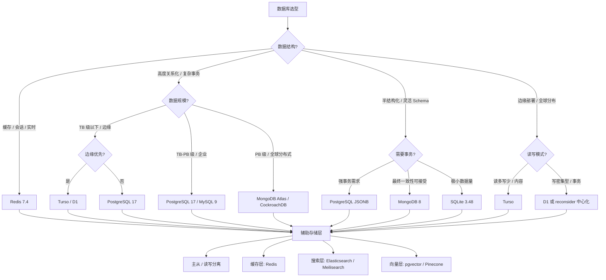

# 决策树：数据库选择

> **定位**：`30-knowledge-base/30.4-decision-trees/`
> **对齐版本**：PostgreSQL 17 | MySQL 9 | MongoDB 8 | Redis 7.4 | SQLite 3.48 | Turso | Cloudflare D1
> **权威来源**：DB-Engines 2026、State of Databases 2025、Cloudflare 博客、Fly.io 技术博客
> **最后更新**：2026-04

---

## 数据库现状（2026 Q2）

| 特性 | PostgreSQL 17 | MySQL 9 | MongoDB 8 | Redis 7.4 | SQLite 3.48 | Turso | Cloudflare D1 |
|------|---------------|---------|-----------|-----------|-------------|-------|---------------|
| **数据模型** | 关系型 | 关系型 | 文档型 | 键值/数据结构 | 嵌入式关系型 | SQLite 分支（边缘） | SQLite 分支（边缘） |
| **部署模式** | 自托管/云托管 | 自托管/云托管 | 自托管/Atlas | 自托管/云托管 | 嵌入式/本地 | 边缘 SQLite | 边缘 SQLite |
| **最大规模** | PB 级 | PB 级 | EB 级（Atlas） | TB 级（单节点） | TB 级（单文件） | GB-TB 级 | GB 级 |
| **一致性** | 强一致性 ACID | 强一致性 ACID | 可调一致性 | 最终一致性 | 强一致性 ACID | 强一致性 | 强一致性 |
| **扩展性** | 读写分离/分片 | 读写分离 | 原生分片 | Cluster 模式 | 无（单文件） | 全球复制 | 全球复制 |
| **查询语言** | SQL | SQL | MQL (类 JSON) | 专用命令 | SQL | SQLite SQL | SQLite SQL |
| **边缘延迟** | ~20-100ms | ~20-100ms | ~50-200ms | ~1-5ms（Redis Cloud） | 0ms（本地） | **~10-50ms** | **~10-50ms** |
| **存储成本** | 中 | 低 | 高 | 高（内存优先） | 极低 | 低 | 极低 |
| **JSON 支持** | ✅ JSONB（二进制，索引） | ✅ JSON（文本） | ✅ 原生文档 | ✅ 模块 | ✅ JSON1 | ✅ JSON1 | ✅ JSON1 |
| **向量搜索** | ✅ pgvector | ❌ 需插件 | ✅ Atlas Vector | ✅ Redis Vector | ❌ | ❌ | ❌ |
| **2026 关键特性** | JSONB 性能提升 2x | AI 辅助优化 | 时间序列集合 | Redis Query Engine | WAL 模式改进 | 全球副本自动同步 | 百万级行支持 |

*来源：DB-Engines 排名（2026-04）、PostgreSQL 17 Release Notes、MongoDB 8.0 Benchmark、Cloudflare D1 文档。*

> **关键洞察**：PostgreSQL 17 继续巩固"万能数据库"地位，JSONB 性能翻倍使其在文档场景也能与 MongoDB 竞争。边缘 SQLite（Turso/D1）成为 Jamstack/边缘架构的标准数据层。向量搜索的爆发使 pgvector 成为 AI 应用的事实标准。

---

## 决策树



---

## 决策因素矩阵

| 场景 | 首选 | 次选 | 避免 | 关键理由 |
|------|------|------|------|---------|
| **通用 Web 应用 / SaaS** | PostgreSQL 17 | MySQL 9 | SQLite | JSONB + ACID + 扩展性最平衡 |
| **AI / RAG 应用** | PostgreSQL + pgvector | MongoDB Atlas Vector | MySQL | pgvector 最成熟，与 LangChain 集成最佳 |
| **边缘函数数据存储** | Turso | Cloudflare D1 | PostgreSQL | 全球 <50ms 延迟，SQLite 零运维 |
| **实时分析 / 缓存** | Redis 7.4 | KeyDB | MongoDB | 亚毫秒延迟，Stream/TimeSeries 结构 |
| **内容管理 / 文档存储** | PostgreSQL JSONB | MongoDB 8 | MySQL JSON | JSONB 索引 + GIN 查询效率超越 MQL |
| **移动端 / 离线优先** | SQLite 3.48 | WatermelonDB | PostgreSQL | 嵌入式零配置，WAL 模式支持并发 |
| **金融交易 / 库存系统** | PostgreSQL 17 | MySQL InnoDB | MongoDB | 强 ACID + 行级锁 + 外键约束 |
| **日志 / 时序数据** | MongoDB 时间序列 | TimescaleDB | PostgreSQL 裸用 | 自动过期 + 压缩 + 分区 |
| **快速原型 / 测试** | SQLite 3.48 | PostgreSQL Docker | 远程数据库 | 零配置，内存模式支持 |
| **全球分布式应用** | CockroachDB / Spanner | MongoDB Atlas Global | PostgreSQL 单机 | 全球强一致，自动分片 |
| **Serverless 函数状态** | D1 / Turso | FaunaDB | PostgreSQL 直连 | 连接池无关，HTTP API |

---

## 数据库深度对比

### PostgreSQL 17 — 万能数据库的进化

PostgreSQL 17 在 OLAP 和 JSON 处理上大幅改进，成为真正的"one database to rule them all"。

**核心优势**：
- **JSONB 性能翻倍**：v17 的 JSONB 解析和查询速度较 v16 提升 2 倍，直接威胁 MongoDB
- **pgvector**：向量搜索的事实标准，支持 HNSW/IVFFlat 索引，与 OpenAI/LangChain 深度集成
- **扩展生态**：PostGIS（地理）、TimescaleDB（时序）、Citus（分布式）
- **ACID + 复杂查询**：CTE、窗口函数、递归查询无出其右

**2026 关键更新**：
- 增量排序（Incremental Sort）优化大偏移分页
- 改进的 vacuum 并行化
- JSONB 子scripting：`data['key']['subkey']`

**代码示例**：

```sql
-- PostgreSQL 17 — JSONB 高性能 + 向量搜索
CREATE TABLE products (
    id SERIAL PRIMARY KEY,
    name TEXT,
    metadata JSONB,
    embedding VECTOR(1536)  -- pgvector 扩展
);

-- JSONB GIN 索引（查询性能极致）
CREATE INDEX idx_metadata ON products USING GIN (metadata);

-- 向量相似度搜索（RAG 应用）
CREATE INDEX idx_embedding ON products USING hnsw (embedding vector_cosine_ops);

-- 混合查询：JSONB 过滤 + 向量排序
SELECT name, metadata->>'category' as category,
       1 - (embedding <=> query_embedding) as similarity
FROM products
WHERE metadata @> '{"tags": ["electronics"]}'
ORDER BY embedding <=> query_embedding
LIMIT 10;
```

---

### MongoDB 8 — 文档数据库的企业级跃迁

MongoDB 8 引入时间序列集合和可查询加密，巩固其在快速开发和物联网领域的地位。

**核心优势**：
- **灵活 Schema**：适合快速迭代和多变业务需求
- **Atlas 云服务**：全球集群、自动扩缩容、Serverless 实例
- **聚合管道**：强大的数据处理和分析能力
- **原生横向扩展**：分片集群自动平衡

**2026 关键更新**：
- 时间序列集合压缩率提升 80%
- 可查询加密（Queryable Encryption）GA
- Atlas Vector Search 与 Bedrock/Azure OpenAI 集成

---

### Redis 7.4 — 超越缓存的数据结构服务器

Redis 7.4 的 Query Engine 允许在 JSON 和 Hash 上执行复杂查询，角色从缓存扩展为主数据库。

**核心优势**：
- **亚毫秒延迟**：内存操作，网络延迟是唯一瓶颈
- **数据结构丰富**：String、Hash、List、Set、Sorted Set、Stream、JSON、TimeSeries
- **Redis Stack**：RedisJSON + RediSearch + RedisGraph + RedisTimeSeries
- **持久化**：RDB + AOF，可配置为几乎不丢数据

**2026 关键更新**：
- Redis Query Engine 支持聚合查询
- Triggers and Functions（预览）：数据库级触发器
- 改进的 ACL 和 TLS 支持

**代码示例**：

```typescript
// Redis 7.4 — 作为实时数据层
import { createClient } from 'redis'

const client = await createClient({ url: 'redis://localhost:6379' })
  .on('error', err => console.log('Redis Client Error', err))
  .connect()

// JSON 文档存储 + 索引
await client.json.set('user:1000', '$', {
  name: 'Alice',
  age: 30,
  tags: ['premium', 'developer']
})

// RediSearch 查询
await client.ft.create('idx:users', {
  '$.name': { type: 'TEXT', SORTABLE: true },
  '$.age': { type: 'NUMERIC' },
  '$.tags': { type: 'TAG' }
}, { ON: 'JSON', PREFIX: 'user:' })

// 实时搜索
const results = await client.ft.search('idx:users', '@tags:{premium} @age:[25 35]')

// 流（Stream）—— 事件溯源
await client.xAdd('events:orders', '*', {
  event: 'order_created',
  data: JSON.stringify({ productId: '123', qty: 2 })
})
```

---

### SQLite 3.48 — 被低估的嵌入式巨人

SQLite 3.48 改进的 WAL 模式和 JSON 支持，使其从移动应用扩展到边缘计算和测试场景。

**核心优势**：
- **零配置**：无服务器进程，单文件数据库
- **跨平台**：iOS、Android、桌面、嵌入式、Wasm
- **严格模式**：`STRICT` 表确保类型安全
- **WAL 模式**：支持并发读写

**2026 关键更新**：
- 改进的 JSON5 支持
- 性能增强的 FTS5（全文搜索）
- 安全性加固（CVE 修复）

---

### Turso — 全球 SQLite 的先锋

Turso 由 libSQL（SQLite fork）驱动，提供全球边缘复制，是 Vercel/Netlify 函数的理想伴侣。

**核心优势**：
- **全球复制**：写主库，读最近副本（<50ms）
- **HTTP API**：无连接池问题，Serverless 友好
- **嵌入式模式**：开发时本地 SQLite，生产时 Turso
- **定价**： generous 免费层（9GB 存储，10 亿行读取）

**代码示例**：

```typescript
// Turso — 边缘 SQLite
import { createClient } from '@libsql/client/web'

const client = createClient({
  url: process.env.TURSO_DATABASE_URL!,
  authToken: process.env.TURSO_AUTH_TOKEN!
})

// 类型安全的查询（配合 Drizzle ORM）
import { drizzle } from 'drizzle-orm/libsql'
import { users } from './schema'

const db = drizzle(client)

const result = await db.select().from(users).where(eq(users.id, 1))
```

---

### Cloudflare D1 — Workers 原生数据库

D1 是 Cloudflare 的 SQLite 托管服务，与 Workers 深度集成，提供零延迟的数据访问。

**核心优势**：
- **零冷启动延迟**：与 Workers 同区域部署
- **绑定安全**：数据库通过绑定注入，无需密钥管理
- **备份/还原**：自动快照，时间点恢复
- **定价**：极低成本（$5/月 包含 25 亿行读取）

**2026 关键更新**：
- 支持 100 万行表（从 10 万提升）
- 导入/导出 CSV
- 与 Queues 和 Workers 深度集成

**代码示例**：

```typescript
// Cloudflare D1 — Workers 绑定
export interface Env {
  DB: D1Database
}

export default {
  async fetch(request: Request, env: Env): Promise<Response> {
    const { pathname } = new URL(request.url)
    
    if (pathname === '/api/users') {
      const { results } = await env.DB.prepare(
        'SELECT id, name, email FROM users WHERE active = ?'
      ).bind(1).all()
      
      return Response.json(results)
    }
    
    return new Response('Not Found', { status: 404 })
  }
}
```

---

## 正面案例 / 反面案例

### ✅ 何时选择该数据库

| 数据库 | 正确场景 |
|--------|---------|
| **PostgreSQL 17** | 需要复杂查询和报表；AI/RAG 向量搜索；金融级事务；GIS 地理数据；长期数据仓库 |
| **MySQL 9** | LAMP 存量系统；简单 CRUD Web 应用；团队熟悉；成本敏感（托管便宜） |
| **MongoDB 8** | 快速迭代 Schema；物联网时序数据；全球分布式 Atlas 集群；文档型 CMS |
| **Redis 7.4** | 会话缓存；实时排行榜；消息队列；Pub/Sub；速率限制；JSON 实时查询 |
| **SQLite 3.48** | 移动端本地存储；桌面应用；测试环境；嵌入式 IoT；单用户工具 |
| **Turso** | 边缘函数数据层；全球读多写少；Jamstack 站点；Serverless 应用 |
| **Cloudflare D1** | Cloudflare Workers 应用；低延迟要求；预算极低；简单关系数据 |

### ❌ 何时避免该数据库

| 数据库 | 错误场景 |
|--------|---------|
| **PostgreSQL 17** | 极高并发简单 KV（Redis 更优）；边缘部署无连接池（Turso/D1 更优） |
| **MySQL 9** | 复杂 JSON 查询（PostgreSQL JSONB 更优）；向量搜索（无原生支持） |
| **MongoDB 8** | 强事务多文档操作（PostgreSQL 更可靠）；预算紧张（Atlas 昂贵） |
| **Redis 7.4** | 持久化主存储（虽有 AOF 但内存成本极高）；复杂关系查询 |
| **SQLite 3.48** | 高并发写入（WAL 有瓶颈）；网络共享文件访问；>1TB 数据 |
| **Turso** | 写密集型（最终一致性副本延迟）；复杂事务跨表；需要存储过程 |
| **Cloudflare D1** | 大规模数据（>100 万行表限制）；复杂 JOIN 性能；非 Workers 环境 |

---

## 2025-2026 趋势洞察

1. **PostgreSQL 吞噬生态**：JSONB 性能提升使 PostgreSQL 成为文档和关系的统一选择，"PostgreSQL  everywhere" 趋势加速。

2. **边缘 SQLite 标准化**：Turso 和 D1 证明 SQLite 可以全球分布，Jamstack 站点不再需要中心化数据库。

3. **向量搜索成为标配**：pgvector、Redis Vector、MongoDB Atlas Vector 使每个数据库都具备 AI 能力，专用向量数据库（Pinecone、Weaviate）面临被集成风险。

4. **Serverless 数据库连接革命**：HTTP-based 查询（Turso、D1、PlanetScale Serverless）消灭连接池痛点。

5. **多模态数据库**：Redis 的 JSON + Search + TimeSeries、PostgreSQL 的 JSONB + Vector + GIS，单一数据库处理多种负载成为常态。

---

## 选型检查清单

```
□ 数据是否高度关系化（多表 JOIN）？是 → PostgreSQL / MySQL
□ 需要复杂事务（银行/库存）？是 → PostgreSQL
□ Schema 是否频繁变化？是 → MongoDB / PostgreSQL JSONB
□ 部署在边缘/Serverless？是 → Turso / D1 / DynamoDB
□ 是否需要亚毫秒响应？是 → Redis
□ 是否需要 AI/向量搜索？是 → PostgreSQL + pgvector
□ 数据量 <1GB 且单机？是 → SQLite
□ 是否需要全球分布式强一致？是 → CockroachDB / Spanner
□ 预算是否极有限？是 → SQLite / D1 / PostgreSQL 自建
□ 团队是否有 DBA？无 → 托管服务（RDS / Atlas / Turso）
```

---

## 参考来源

1. **DB-Engines** — [Database Rankings](https://db-engines.com/en/ranking) (2026-04)
2. **PostgreSQL 官方** — [PostgreSQL 17 Release Notes](https://www.postgresql.org/docs/17/release-17.html) (2025-09)
3. **MongoDB 官方** — [MongoDB 8.0 Announcement](https://www.mongodb.com/blog/post/) (2025-11)
4. **Redis 官方** — [Redis 7.4 Release](https://redis.io/blog/) (2025-07)
5. **SQLite 官方** — [SQLite 3.48](https://sqlite.org/changes.html) (2026-01)
6. **Turso 官方** — [libSQL & Turso Blog](https://turso.tech/blog) (2026-03)
7. **Cloudflare** — [D1 GA Announcement](https://blog.cloudflare.com/d1/) (2025-10)
8. **State of Databases 2025** — [Jamstack Community Survey](https://stateofdb.com/)
9. **Fly.io 博客** — [SQLite at the Edge](https://fly.io/blog/) (2025-12)
10. **TechEmpower** — [Database Benchmark](https://www.techempower.com/benchmarks/) (2026-02)

---

## 权威外部链接

- [PostgreSQL 官方文档](https://www.postgresql.org/docs/17/)
- [MySQL 官方文档](https://dev.mysql.com/doc/)
- [MongoDB 官方文档](https://www.mongodb.com/docs/)
- [Redis 官方文档](https://redis.io/docs/)
- [SQLite 官方文档](https://sqlite.org/docs.html)
- [Turso 官方文档](https://docs.turso.tech/)
- [Cloudflare D1 文档](https://developers.cloudflare.com/d1/)
- [pgvector 文档](https://github.com/pgvector/pgvector)
- [Drizzle ORM](https://orm.drizzle.team/)
- [Prisma ORM](https://www.prisma.io/)

---

*本决策树基于 2026 年 Q2 数据库技术格局。边缘数据库和向量搜索是近两年最显著的范式转移，传统数据库选型需重新评估延迟和 AI 需求。*
