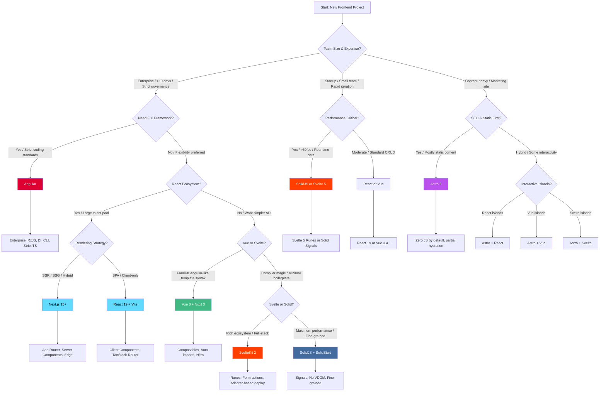

# Frontend Framework Selection Decision Tree

> **Scope:** Choosing the optimal frontend framework for JavaScript/TypeScript projects in 2025-2026.
> **Target Audience:** Engineering leads, architects, and senior developers evaluating React, Vue, Svelte, Solid, Angular, Astro, Next.js, Nuxt, and SvelteKit.

---

## 1. Executive Summary

The frontend ecosystem in 2025-2026 is characterized by three macro trends: **server-first rendering** (Server Components, Islands Architecture), **signals-based reactivity** overtaking virtual DOM in performance-critical apps, and **TypeScript-native frameworks** becoming the default expectation. The choice between React, Vue, Svelte, Solid, Angular, and meta-frameworks (Next.js, Nuxt, SvelteKit, Astro) depends on team expertise, performance requirements, SEO needs, and deployment constraints.

---

## 2. Mermaid Decision Flowchart

---

## 3. Deep-Dive Comparison Matrix

| Dimension | React 19 | Vue 3.4 | Svelte 5 | SolidJS | Angular 18 | Next.js 15 | Nuxt 3 | SvelteKit 2 | Astro 5 |
|---|---|---|---|---|---|---|---|---|---|
| **Rendering Model** | VDOM + Server Components | VDOM + Compiler opt | Compiler (no VDOM) | Fine-grained signals | VDOM + Incremental hydration | SSR/SSG/ISR/Edge | SSR/SSG/ISR/Edge | SSR/SSG/Edge | Islands (static-first) |
| **Bundle Size (hello world)** | ~40 KB | ~22 KB | ~5 KB | ~7 KB | ~130 KB | ~40 KB + framework | ~22 KB + framework | ~5 KB + framework | ~0 KB (static) |
| **Learning Curve** | Medium | Low | Very Low | Medium | High | Medium | Low | Very Low | Low |
| **TypeScript Support** | Excellent (meta-framework) | Good | Excellent | Excellent | Strict/Required | Excellent | Good | Excellent | Good |
| **Ecosystem Size** | Massive | Large | Growing | Small | Large | Massive | Large | Growing | Growing |
| **Job Market (2025)** | Dominant | Strong | Niche | Niche | Enterprise strong | Dominant | Strong | Niche | Growing |
| **Server Components** | Yes (React Server Components) | No (Vue Vapor mode exp) | No (server-side logic via kit) | No | No | Yes | Partial | No | No (islands instead) |
| **Signals/Reactives** | useState + useReducer (2025: useMemoCache) | ref/reactive | Runes ($state, $derived) | Signals (core primitive) | RxJS + signals (18.1+) | Via React | Via Vue | Via Svelte | Via framework islands |
| **Build Tool** | Vite / Next.js | Vite / Nuxt | Vite / SvelteKit | Vite / SolidStart | Angular CLI / esbuild | Turbopack / Webpack | Vite / Nitro | Vite / SvelteKit | Vite / Astro |
| **Full-Stack Capabilities** | Next.js App Router | Nuxt server API | Form actions, hooks | SolidStart | Angular Universal | API routes, middleware | Nitro server | Form actions | Server endpoints |
| **Edge Runtime** | Yes (Vercel/Cloudflare) | Yes (Nitro) | Yes (adapter-based) | Yes | Experimental | First-class | First-class | Yes | First-class |
| **Partial Hydration** | Server Components | No | No | No | No | Yes (server components) | No | No | Yes (islands) |
| **Streaming SSR** | Yes | Yes | Yes | Yes | Yes | Yes | Yes | Yes | N/A |

---

## 4. "If X Then Y" Recommendation Logic

### Team & Organizational Constraints

**If your team has >15 developers with mixed frontend experience and strict governance requirements,** choose **Angular 18**. Its opinionated CLI, built-in dependency injection, strict TypeScript enforcement, and RxJS-based state management reduce decision fatigue and enforce consistency at scale.

**If your organization already has a heavy React investment (component libraries, training, hiring pipeline),** choose **React 19** or **Next.js 15**. The migration path from React 18 to 19 is incremental, and the ecosystem (TanStack Query, Zustand, shadcn/ui) is unmatched.

**If your team is small (<5 developers) and values rapid prototyping,** choose **Vue 3 + Nuxt 3** or **Svelte 5 + SvelteKit 2**. Vue's progressive adoption model lets you drop it into an existing page; Svelte's compiler eliminates entire categories of performance bugs.

### Performance Requirements

**If you are building real-time dashboards, trading platforms, or data visualization with >1000 reactive elements,** choose **SolidJS** or **Svelte 5**. Solid's fine-grained signals avoid VDOM overhead entirely; Svelte 5's Runes provide similar fine-grained reactivity with a more familiar developer experience.

**If your application is a standard CRUD app with moderate interactivity,** React 19 or Vue 3.4 are perfectly adequate. The difference in runtime performance will be imperceptible to users.

**If you need the fastest possible Time-to-Interactive (TTI) for mobile users on slow networks,** choose **Astro 5** with React/Vue/Svelte islands. Astro ships zero JavaScript for static content, hydrating only interactive components.

### SEO & Content Strategy

**If you are building a marketing site, blog, or documentation with occasional interactive elements,** choose **Astro 5**. Its Islands Architecture is purpose-built for content-first sites.

**If you need SEO for a highly dynamic application (e-commerce, social platform),** choose **Next.js 15 App Router** or **Nuxt 3**. Server Components and streaming SSR enable dynamic content with minimal client JS.

**If you need both perfect SEO and rich client-side interactivity,** use **Next.js 15** with the App Router. The boundary between Server and Client Components lets you optimize each page region independently.

### Deployment & Infrastructure

**If you are deploying to Vercel and want zero-config edge deployment,** choose **Next.js 15** or **SvelteKit 2**. Both have first-class Vercel adapters with edge runtime support.

**If you are deploying to Cloudflare Pages/Workers and want edge-first architecture,** choose **Nuxt 3**, **SvelteKit 2**, or **Astro 5**. All three have robust Cloudflare adapters.

**If you are self-hosting on Docker/Kubernetes and need full control,** any framework works, but **Angular 18**, **Vue 3 + Nuxt 3**, and **SvelteKit 2** have the simplest SSR containerization stories.

---

## 5. 2025-2026 Trends & Future-Proofing

### React Server Components (RSC) Maturation
By 2025, React Server Components are no longer experimental. Next.js 15's App Router is the canonical implementation, but the ecosystem has fragmented: caching is complex, and the mental model of "server vs client" boundaries remains a challenge. Expect RSC patterns to stabilize by Q3 2025.

### Svelte 5 Runes
Svelte 5 (released late 2024) replaces the `let`/$:` reactive syntax with explicit Runes (`$state`, `$derived`, `$effect`). This makes reactivity more predictable and enables better TypeScript inference. SvelteKit 2 has full Runes support.

### Vue Vapor Mode
Vue's experimental "Vapor Mode" (compiler-only, no VDOM) is entering beta in 2025. If successful, it will give Vue Svelte-like performance while retaining Vue's ecosystem. Nuxt 4 (expected late 2025) will support Vapor Mode.

### Angular Signals & Zoneless
Angular 18+ has made signals a core primitive, with zoneless change detection in developer preview. By 2026, Angular may deprecate Zone.js entirely, dramatically improving performance and debugging.

### SolidStart 1.0
SolidStart reached 1.0 in 2024 and is gaining traction in performance-critical applications. Its mental model (fine-grained signals, no VDOM) is unique but powerful for developers willing to invest in learning.

### Astro Content Layer
Astro 5 introduced the Content Layer API, enabling type-safe content from any source (CMS, database, local files). This makes Astro viable for large-scale content sites previously requiring a headless CMS frontend.

---

## 6. Common Pitfalls and Anti-Patterns

### Pitfall 1: Choosing React for Static Content Sites
Using Next.js for a mostly-static blog overcomplicates the architecture. Next.js's Server Components, caching layers, and build complexity are unnecessary when Astro can deliver better Core Web Vitals with simpler mental models.

**Anti-pattern:** Building a marketing blog as a Next.js App Router application with 90% Server Components.
**Better approach:** Use Astro 5; add React/Vue islands only for the newsletter signup form and comment section.

### Pitfall 2: Over-Engineering with Angular for Small Teams
Angular's DI system, RxJS patterns, and module architecture shine at scale but create friction for small teams. A 3-person startup does not need Angular's governance features.

**Anti-pattern:** Choosing Angular for an MVP because "it's enterprise-grade."
**Better approach:** Start with Vue or Svelte; migrate to Angular only if the team grows beyond 10 developers and governance becomes a bottleneck.

### Pitfall 3: Ignoring Hydration Costs in Meta-Frameworks
Next.js, Nuxt, and SvelteKit all support SSR, but shipping a fully-hydrated page when only 10% of it is interactive wastes bandwidth and CPU. This is the "hydration tax."

**Anti-pattern:** Wrapping an entire Next.js page in a Client Component because one button needs interactivity.
**Better approach:** Keep data fetching in Server Components; use Client Components only for interactive islands. Consider Astro for content-heavy pages.

### Pitfall 4: Framework Hopping for Performance Without Profiling
Teams often rewrite from React to Svelte/Solid hoping for performance gains without identifying the actual bottleneck. In many cases, the issue is excessive re-renders, unoptimized images, or blocking third-party scripts—not the framework.

**Anti-pattern:** Rewriting a React app to SolidJS because "React is slow" without profiling.
**Better approach:** Profile with React DevTools Profiler, Lighthouse, and Web Vitals. Optimize renders, code-split, and lazy-load before considering a framework migration.

### Pitfall 5: Using SPA Mode for SEO-Critical Applications
Deploying a React/Vue/Solid SPA for an e-commerce or publishing site guarantees poor SEO and slow initial loads.

**Anti-pattern:** Building `create-react-app` or Vite SPA for a product catalog.
**Better approach:** Use Next.js, Nuxt, SvelteKit, or Astro with SSR/SSG from day one.

### Pitfall 6: Underestimating SolidJS's Learning Curve
SolidJS's fine-grained reactivity is powerful but requires unlearning VDOM patterns. Destructuring props loses reactivity; effects run synchronously and require careful dependency management.

**Anti-pattern:** Treating SolidJS like "React with signals."
**Better approach:** Read SolidJS's reactivity documentation thoroughly. Use `createSignal`, `createMemo`, and `createEffect` correctly; avoid destructuring reactive values.

---

## 7. Decision Checklist

Before finalizing your framework choice, verify:

- [ ] **Team expertise:** Can the team be productive in 2 weeks? 1 month?
- [ ] **Hiring pipeline:** Can you hire for this stack in your region?
- [ ] **Performance requirements:** Have you profiled and identified actual bottlenecks?
- [ ] **SEO needs:** Is SSR/SSG required? How dynamic is the content?
- [ ] **Deployment target:** Vercel, Netlify, Cloudflare, self-hosted, or multi-cloud?
- [ ] **Ecosystem dependencies:** Are critical libraries (maps, charts, editors) available?
- [ ] **Long-term maintenance:** Is the framework backed by a stable entity (Meta, Vercel, Google)?
- [ ] **Migration path:** If the project grows, can you incrementally adopt more features?

---

## 8. Quick Reference: Framework by Use Case

| Use Case | Recommended Framework | Runner-up |
|---|---|---|
| Enterprise SaaS (large team) | Angular 18 | Next.js 15 |
| Startup MVP (small team) | Vue 3 + Nuxt 3 | Svelte 5 + SvelteKit 2 |
| E-commerce (SEO + dynamic) | Next.js 15 App Router | Nuxt 3 |
| Marketing site / Blog | Astro 5 | Next.js 15 |
| Real-time dashboard | SolidJS + SolidStart | Svelte 5 |
| Content platform (hybrid) | Astro 5 + React islands | Next.js 15 |
| Mobile-like PWA | Vue 3 + Nuxt 3 | React 19 + Vite |
| Internal admin tool | React 19 + shadcn/ui | Vue 3 + Nuxt 3 |
| Open-source library docs | Astro 5 | Nuxt 3 (Content module) |

---

*Last updated: 2025-06. Trends and recommendations evolve rapidly—re-evaluate quarterly.*
