# 技术选型决策树

> 交互式技术选型指南，帮助你根据项目需求快速选择合适的技术栈。
> 每个选型均提供 **Mermaid 可视化流程图**（推荐在 VitePress 网站中浏览）和 **ASCII 文本树**（兼容纯文本阅读）。

---

## 1. UI库选型决策树

### Mermaid 流程图

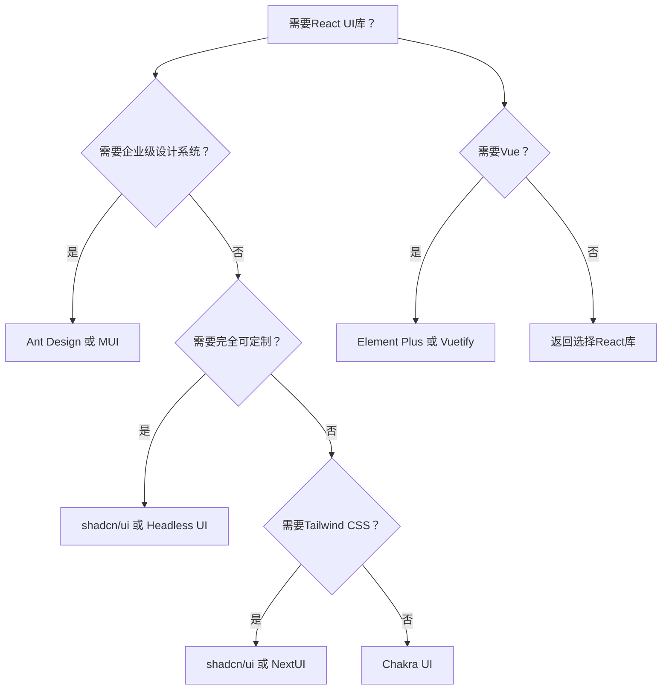
```mermaid
flowchart TD
    A[需要React UI库？] --> B{需要企业级设计系统？}
    B -->|是| C[Ant Design 或 MUI]
    B -->|否| D{需要完全可定制？}
    D -->|是| E[shadcn/ui 或 Headless UI]
    D -->|否| F{需要Tailwind CSS？}
    F -->|是| G[shadcn/ui 或 NextUI]
    F -->|否| H[Chakra UI]
    A --> I{需要Vue？}
    I -->|是| J[Element Plus 或 Vuetify]
    I -->|否| K[返回选择React库]
```

### ASCII 文本树

```
需要React UI库？
├── 需要企业级设计系统？
│   ├── 是 → Ant Design 或 MUI
│   │         📌 Ant Design：阿里巴巴出品，生态完善，中后台首选
│   │         📌 MUI：Material Design风格，文档丰富，社区活跃
│   └── 否 → 继续
├── 需要完全可定制？
│   ├── 是 → shadcn/ui 或 Headless UI
│   │         📌 shadcn/ui：无运行时依赖，可复制组件，Tailwind原生
│   │         📌 Headless UI：完全无样式，最大灵活性
│   └── 否 → 继续
├── 需要Tailwind CSS？
│   ├── 是 → shadcn/ui 或 NextUI
│   │         📌 NextUI：现代设计，暗黑模式支持好，动画丰富
│   └── 否 → Chakra UI
│             📌 Chakra UI：简单易用，样式即props，无障碍支持好
└── 需要Vue？
    ├── 是 → Element Plus 或 Vuetify
    │         📌 Element Plus：国内最流行，中后台组件丰富
    │         📌 Vuetify：Material Design，移动端适配好
    └── 否 → 返回选择React库
```

### 快速推荐

| 场景 | 推荐 | 理由 |
|------|------|------|
| 企业级中后台 | **Ant Design** | 组件最全面，生态成熟 |
| 快速原型开发 | **Chakra UI** | API简洁，上手快 |
| 高度定制需求 | **shadcn/ui** | 源码可控，样式自由 |
| 移动端优先 | **Vuetify** | Material Design，响应式好 |
| 现代React项目 | **shadcn/ui + Tailwind** | 2024年最流行组合 |

### 代码示例：shadcn/ui 组件安装与自定义主题

```bash
# 初始化 shadcn/ui（基于 Next.js 或 Vite）
npx shadcn@latest init --yes --template next --base-color slate

# 按需添加组件
npx shadcn add button card dialog

# 生成的 components/ui/button.tsx 可直接修改源码
```

```typescript
// tailwind.config.ts — 扩展 shadcn/ui 主题令牌
import type { Config } from 'tailwindcss';

const config: Config = {
  darkMode: ['class'],
  content: ['./app/**/*.{ts,tsx}', './components/**/*.{ts,tsx}'],
  theme: {
    extend: {
      colors: {
        border: 'hsl(var(--border))',
        input: 'hsl(var(--input))',
        ring: 'hsl(var(--ring))',
        background: 'hsl(var(--background))',
        foreground: 'hsl(var(--foreground))',
        primary: {
          DEFAULT: 'hsl(var(--primary))',
          foreground: 'hsl(var(--primary-foreground))',
        },
      },
      borderRadius: {
        lg: 'var(--radius)',
        md: 'calc(var(--radius) - 2px)',
        sm: 'calc(var(--radius) - 4px)',
      },
    },
  },
  plugins: [require('tailwindcss-animate')],
};

export default config;
```

> 📚 参考：[shadcn/ui Documentation](https://ui.shadcn.com/docs) | [Tailwind CSS Customization](https://tailwindcss.com/docs/customizing-colors) | [Radix UI Primitives](https://www.radix-ui.com/primitives)

---

## 2. 状态管理选型决策树

### Mermaid 流程图

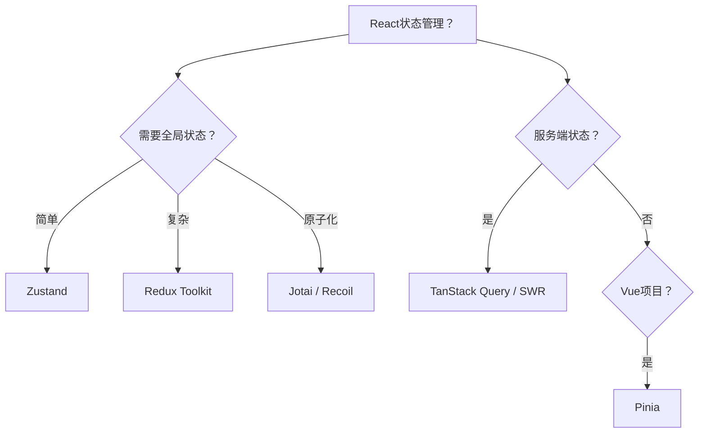
```mermaid
flowchart TD
    A[React状态管理？] --> B{需要全局状态？}
    B -->|简单| C[Zustand]
    B -->|复杂| D[Redux Toolkit]
    B -->|原子化| E[Jotai / Recoil]
    A --> F{服务端状态？}
    F -->|是| G[TanStack Query / SWR]
    F -->|否| H{Vue项目？}
    H -->|是| I[Pinia]
```

### ASCII 文本树

```
React状态管理？
├── 需要全局状态？
│   ├── 简单 → Zustand
│   │         📌 轻量(~1KB)，无样板代码，TypeScript友好
│   │         📌 适合：小型到中型应用，快速开发
│   ├── 复杂 → Redux Toolkit
│   │         📌 生态最成熟，DevTools强大，适合大型团队
│   │         📌 适合：复杂业务逻辑，时间旅行调试需求
│   └── 原子化 → Jotai / Recoil
│         📌 Jotai：简单原子化，依赖自动追踪
│             📌 Recoil：Facebook出品，适合复杂派生状态
├── 服务端状态？
│   ├── 是 → TanStack Query / SWR
│   │         📌 TanStack Query：功能最全，缓存策略丰富
│   │         📌 SWR：轻量，Vercel出品，实时更新友好
│   └── 否 → 继续
└── Vue？
    └── Pinia
        📌 Vue官方推荐，TypeScript支持好，DevTools集成
        📌 替代Vuex，更简洁的API
```

### 快速推荐

| 场景 | 推荐 | 理由 |
|------|------|------|
| 新项目首选 | **Zustand** | 2024年React社区首选，简单够用 |
| 服务端数据 | **TanStack Query** | 自动缓存、重试、乐观更新 |
| 大型企业应用 | **Redux Toolkit** | 可预测性强，调试能力强 |
| Vue项目 | **Pinia** | 官方推荐，迁移成本低 |
| 原子化偏好 | **Jotai** | 组合式思维，灵活拆分状态 |

### 代码示例：Zustand + 持久化 + TypeScript

```typescript
import { create } from 'zustand';
import { persist, createJSONStorage } from 'zustand/middleware';
import { immer } from 'zustand/middleware/immer';

interface CartState {
  items: Array<{ id: string; qty: number }>;
  addItem: (id: string) => void;
  removeItem: (id: string) => void;
}

export const useCartStore = create<CartState>()(
  persist(
    immer((set) => ({
      items: [],
      addItem: (id) =>
        set((state) => {
          const found = state.items.find((i) => i.id === id);
          if (found) found.qty += 1;
          else state.items.push({ id, qty: 1 });
        }),
      removeItem: (id) =>
        set((state) => {
          state.items = state.items.filter((i) => i.id !== id);
        }),
    })),
    { name: 'cart-storage', storage: createJSONStorage(() => localStorage) }
  )
);
```

### 代码示例：TanStack Query v5 数据获取与变异

```typescript
import { useQuery, useMutation, useQueryClient } from '@tanstack/react-query';

// 查询 Hook
function useUser(userId: string) {
  return useQuery({
    queryKey: ['user', userId],
    queryFn: async () => {
      const res = await fetch(`/api/users/${userId}`);
      if (!res.ok) throw new Error('Failed to fetch user');
      return res.json() as Promise<{ id: string; name: string; email: string }>;
    },
    staleTime: 5 * 60 * 1000, // 5 分钟内视为新鲜
  });
}

// 乐观更新变异
function useUpdateUser() {
  const queryClient = useQueryClient();
  return useMutation({
    mutationFn: async (payload: { id: string; name: string }) => {
      const res = await fetch(`/api/users/${payload.id}`, {
        method: 'PATCH',
        body: JSON.stringify(payload),
        headers: { 'Content-Type': 'application/json' },
      });
      return res.json();
    },
    onMutate: async (newData) => {
      await queryClient.cancelQueries({ queryKey: ['user', newData.id] });
      const prev = queryClient.getQueryData(['user', newData.id]);
      queryClient.setQueryData(['user', newData.id], (old: any) => ({ ...old, ...newData }));
      return { prev };
    },
    onError: (err, newData, context) => {
      queryClient.setQueryData(['user', newData.id], context?.prev);
    },
    onSettled: (data, err, newData) => {
      queryClient.invalidateQueries({ queryKey: ['user', newData.id] });
    },
  });
}
```

> 📚 参考：[Zustand Documentation](https://docs.pmnd.rs/zustand/getting-started/introduction) | [TanStack Query Docs](https://tanstack.com/query/latest/docs/framework/react/overview) | [Redux Toolkit Quick Start](https://redux-toolkit.js.org/tutorials/quick-start)

---

## 3. 构建工具选型决策树

### Mermaid 流程图

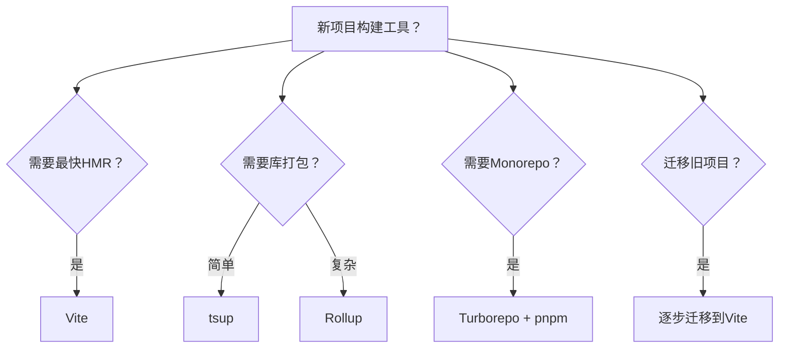
```mermaid
flowchart TD
    A[新项目构建工具？] --> B{需要最快HMR？}
    B -->|是| C[Vite]
    A --> D{需要库打包？}
    D -->|简单| E[tsup]
    D -->|复杂| F[Rollup]
    A --> G{需要Monorepo？}
    G -->|是| H[Turborepo + pnpm]
    A --> I{迁移旧项目？}
    I -->|是| J[逐步迁移到Vite]
```

### ASCII 文本树

```
新项目构建工具？
├── 需要最快HMR？
│   └── Vite
│       📌 冷启动<300ms，HMR即时更新
│       📌 生态丰富，插件多，配置简单
├── 需要库打包？
│   ├── 简单 → tsup
│   │     📌 零配置，基于esbuild，TypeScript库首选
│   │     📌 自动生成dts，支持CJS/ESM双输出
│   └── 复杂 → Rollup
│         📌 最灵活的打包方案，tree-shaking最优
│         📌 适合需要精细控制的大型库
├── 需要Monorepo？
│   └── Turborepo + pnpm
│       📌 远程缓存，并行执行，任务管道
│       📌 pnpm workspace + Turborepo = 最佳实践
└── 迁移旧项目？
    └── 逐步迁移到Vite
        📌 支持渐进式迁移，兼容性模式
        📌 可先迁移开发环境，保留生产构建
```

### 快速推荐

| 场景 | 推荐 | 理由 |
|------|------|------|
| 新项目 | **Vite** | 开发体验最佳，社区生态最大 |
| TypeScript库 | **tsup** | 一行命令打包，零配置 |
| Monorepo | **Turborepo + pnpm** | 构建缓存，CI/CD加速 |
| 大型库 | **Rollup** | 输出控制最精细 |
| Webpack迁移 | **Vite** | 有官方迁移指南，成本可控 |

### 代码示例：tsup 库打包配置

```typescript
// tsup.config.ts
import { defineConfig } from 'tsup';

export default defineConfig({
  entry: ['src/index.ts'],
  format: ['cjs', 'esm'],
  dts: true,
  splitting: true,
  sourcemap: true,
  clean: true,
  treeshake: true,
  // 外部化 peer dependencies
  external: ['react', 'react-dom'],
});
```

```bash
# 单次构建
npx tsup

# 监视模式
npx tsup --watch

# 产物结构
# dist/
#   index.js      (CJS)
#   index.mjs     (ESM)
#   index.d.ts    (类型声明)
#   index.js.map  (Source Map)
```

> 📚 参考：[Vite Documentation](https://vitejs.dev/guide/) | [tsup Documentation](https://tsup.egoist.dev/) | [Rollup.js Guide](https://rollupjs.org/guide/en/) | [Turborepo Docs](https://turbo.build/repo/docs)

---

## 4. 后端框架选型决策树

### Mermaid 流程图

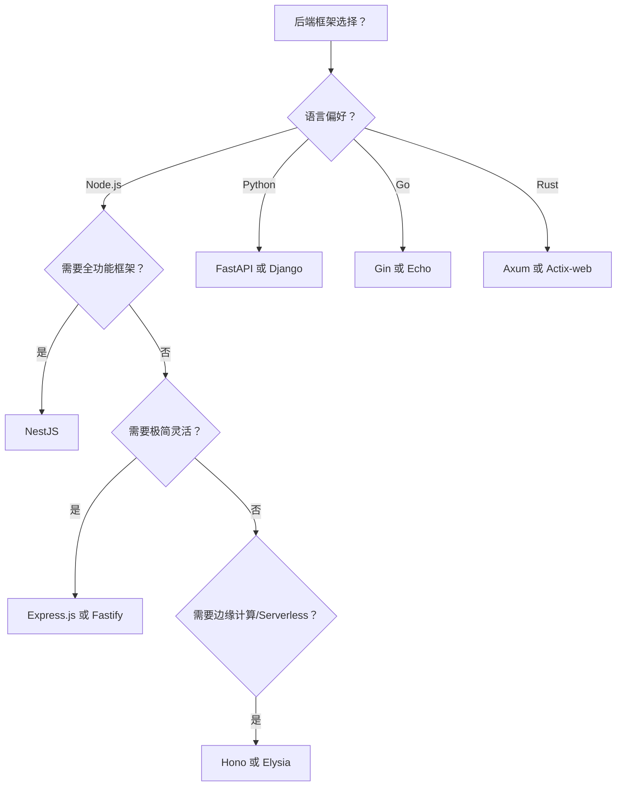
```mermaid
flowchart TD
    A[后端框架选择？] --> B{语言偏好？}
    B -->|Node.js| C{需要全功能框架？}
    B -->|Python| D[FastAPI 或 Django]
    B -->|Go| E[Gin 或 Echo]
    B -->|Rust| F[Axum 或 Actix-web]
    C -->|是| G[NestJS]
    C -->|否| H{需要极简灵活？}
    H -->|是| I[Express.js 或 Fastify]
    H -->|否| J{需要边缘计算/Serverless？}
    J -->|是| K[Hono 或 Elysia]
```

### ASCII 文本树

```
后端框架选择？
├── 语言偏好？
│   ├── Node.js → 继续
│   ├── Python → FastAPI 或 Django
│   │             📌 FastAPI：现代异步，自动生成文档，TypeHint友好
│   │             📌 Django：全功能，ORM强大，适合快速开发
│   ├── Go → Gin 或 Echo
│   │         📌 Gin：性能极高，国内社区活跃
│   │         📌 Echo：简洁现代，中间件丰富
│   └── Rust → Axum 或 Actix-web
│               📌 Axum：Tokio生态，类型安全
│               📌 Actix-web：性能王者，Actor模型
└── Node.js 具体选择
    ├── 需要全功能框架？
    │   ├── 是 → NestJS
    │   │         📌 企业级架构，依赖注入，模块化设计
    │   │         📌 类似Angular，适合大型团队协作
    │   └── 否 → 继续
    ├── 需要极简灵活？
    │   ├── 是 → Express.js 或 Fastify
    │   │         📌 Express：生态最成熟，中间件最多
    │   │         📌 Fastify：性能更好，JSON Schema验证
    │   └── 否 → 继续
    └── 需要边缘计算/Serverless？
        └── Hono 或 Elysia
            📌 Hono：超轻量，多运行时支持(Node/Bun/Deno)
            📌 Elysia：Bun原生，类型安全端到端
```

### 快速推荐

| 场景 | 推荐 | 理由 |
|------|------|------|
| 企业级Node.js | **NestJS** | 架构规范，适合大型团队 |
| 快速API开发 | **Fastify** | 性能优于Express，现代特性 |
| 全栈TypeScript | **Elysia + Bun** | 端到端类型安全 |
| Serverless | **Hono** | 冷启动快，多平台支持 |
| Python API | **FastAPI** | 异步现代，自动生成Swagger |
| 高性能API | **Go/Gin** | 资源占用低，并发强 |
| 极致性能 | **Rust/Actix-web** | 内存安全，速度最快 |

### 代码示例：Fastify 起步模板

```typescript
// server.ts — Fastify + @fastify/swagger + TypeScript
import Fastify from 'fastify';
import swagger from '@fastify/swagger';
import swaggerUi from '@fastify/swagger-ui';

const app = Fastify({ logger: true });

app.register(swagger, {
  openapi: {
    info: { title: 'API', version: '1.0.0' },
  },
});

app.register(swaggerUi, { routePrefix: '/docs' });

app.get('/health', async () => ({ status: 'ok' }));

app.listen({ port: 3000, host: '0.0.0.0' });
```

### 代码示例：Hono 边缘运行时多平台适配

```typescript
// app.ts — 多平台统一入口
import { Hono } from 'hono';

const app = new Hono();

app.get('/api/hello', (c) => {
  return c.json({ message: 'Hello from Hono!', runtime: c.env?.RUNTIME ?? 'unknown' });
});

// Node.js / Bun / Deno 通用导出
export default app;

// Cloudflare Workers 绑定
export const onRequest = app.fetch;

// AWS Lambda 适配（需 @hono/node-server 或 hono/aws-lambda）
// import { handle } from 'hono/aws-lambda';
// export const handler = handle(app);
```

> 📚 参考：[Fastify Documentation](https://www.fastify.io/docs/latest/) | [Fastify TypeScript Support](https://www.fastify.io/docs/latest/Reference/TypeScript/) | [Hono Documentation](https://hono.dev/docs/getting-started/basic) | [NestJS Docs](https://docs.nestjs.com/)

---

## 5. ORM选型决策树

### Mermaid 流程图

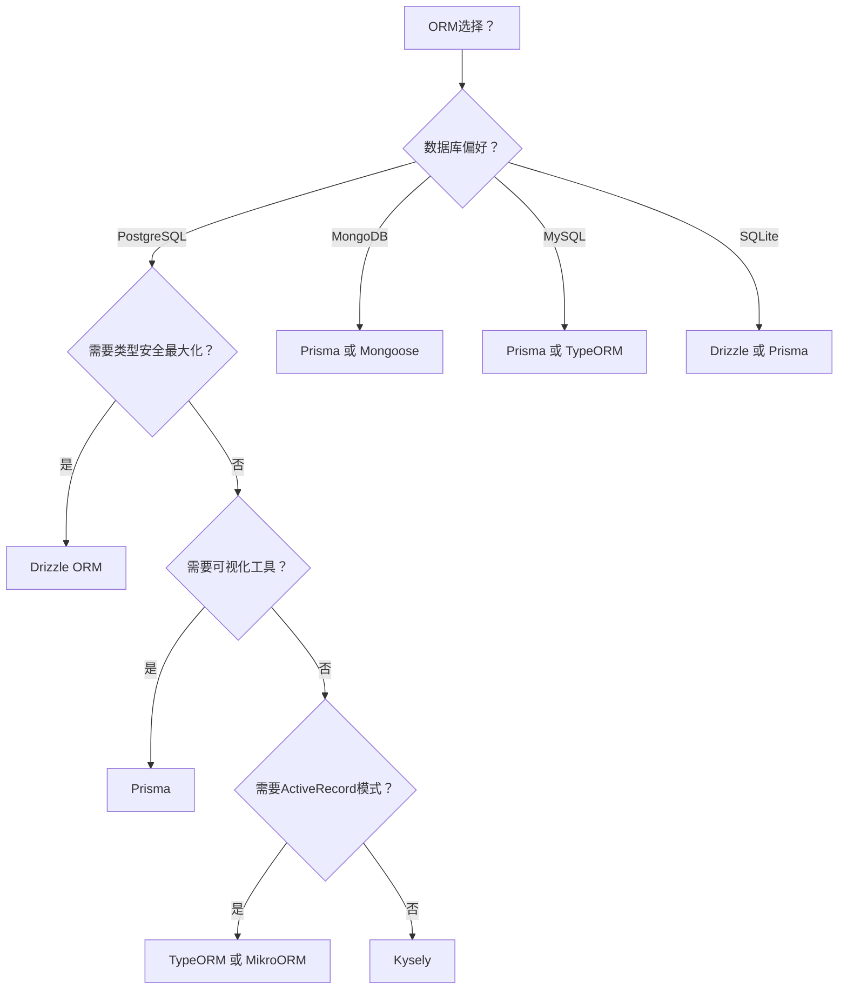
```mermaid
flowchart TD
    A[ORM选择？] --> B{数据库偏好？}
    B -->|PostgreSQL| C{需要类型安全最大化？}
    B -->|MongoDB| D[Prisma 或 Mongoose]
    B -->|MySQL| E[Prisma 或 TypeORM]
    B -->|SQLite| F[Drizzle 或 Prisma]
    C -->|是| G[Drizzle ORM]
    C -->|否| H{需要可视化工具？}
    H -->|是| I[Prisma]
    H -->|否| J{需要ActiveRecord模式？}
    J -->|是| K[TypeORM 或 MikroORM]
    J -->|否| L[Kysely]
```

### ASCII 文本树

```
ORM选择？
├── 数据库偏好？
│   ├── PostgreSQL → 继续
│   ├── MongoDB → Prisma 或 Mongoose
│   │              📌 Prisma：统一体验，也能连MongoDB
│   │              📌 Mongoose：MongoDB专用，Schema灵活
│   ├── MySQL → Prisma 或 TypeORM
│   └── SQLite → Drizzle 或 Prisma
└── PostgreSQL 具体选择
    ├── 需要类型安全最大化？
    │   ├── 是 → Drizzle ORM
    │   │         📌 SQL-like API，类型推导最强
    │   │         📌 轻量无运行时，接近原生SQL
    │   └── 否 → 继续
    ├── 需要可视化工具？
    │   ├── 是 → Prisma
    │   │         📌 Prisma Studio可视化数据，迁移系统完善
    │   │         📌 生态最佳，文档完善，多数据库支持
    │   └── 否 → 继续
    ├── 需要ActiveRecord模式？
    │   └── TypeORM 或 MikroORM
    │       📌 TypeORM：装饰器风格，类似Java Hibernate
    │       📌 MikroORM：数据映射器，Unit of Work模式
    └── 需要查询构建器？
        └── Kysely
            📌 纯类型安全查询构建器，无实体概念
            📌 最接近SQL，适合复杂查询场景
```

### 快速推荐

| 场景 | 推荐 | 理由 |
|------|------|------|
| 新项目首选 | **Prisma** | 生态最完善，开发体验好 |
| 类型安全优先 | **Drizzle** | 类型推导最强，无运行时 |
| 复杂查询 | **Kysely** | 类型安全+SQL灵活度 |
| 类Hibernate风格 | **TypeORM** | 装饰器模式，熟悉感强 |
| MongoDB | **Mongoose** | 生态成熟，文档丰富 |
| 性能敏感 | **Drizzle** | 运行时开销最小 |

### 代码示例：Drizzle ORM + PostgreSQL 关系查询

```typescript
import { pgTable, serial, varchar, integer, relations } from 'drizzle-orm/pg-core';
import { eq } from 'drizzle-orm';
import { db } from './db';

// Schema 定义
export const users = pgTable('users', {
  id: serial('id').primaryKey(),
  name: varchar('name', { length: 255 }).notNull(),
  email: varchar('email', { length: 255 }).notNull().unique(),
});

export const posts = pgTable('posts', {
  id: serial('id').primaryKey(),
  title: varchar('title', { length: 255 }).notNull(),
  authorId: integer('author_id').notNull().references(() => users.id),
});

// 关系定义
export const userRelations = relations(users, ({ many }) => ({
  posts: many(posts),
}));

export const postRelations = relations(posts, ({ one }) => ({
  author: one(users, { fields: [posts.authorId], references: [users.id] }),
}));

// 类型安全的关联查询
const usersWithPosts = await db.query.users.findMany({
  with: { posts: true },
  where: eq(users.email, 'alice@example.com'),
});
// 推导类型: Array<{ id: number; name: string; email: string; posts: Array<{ ... }> }>
```

> 📚 参考：[Drizzle ORM Documentation](https://orm.drizzle.team/docs/overview) | [Prisma Documentation](https://www.prisma.io/docs/) | [Kysely Documentation](https://kysely.dev/docs/intro)

---

## 6. 测试框架选型决策树

### Mermaid 流程图

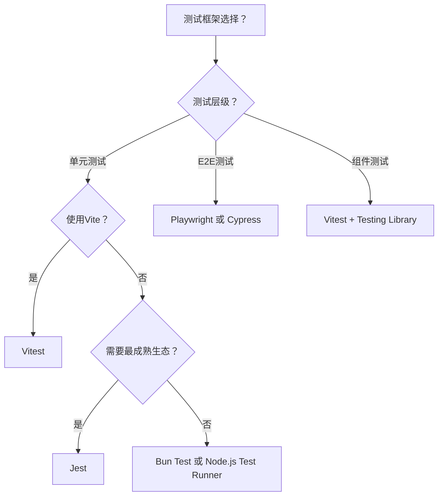
```mermaid
flowchart TD
    A[测试框架选择？] --> B{测试层级？}
    B -->|单元测试| C{使用Vite？}
    B -->|E2E测试| D[Playwright 或 Cypress]
    B -->|组件测试| E[Vitest + Testing Library]
    C -->|是| F[Vitest]
    C -->|否| G{需要最成熟生态？}
    G -->|是| H[Jest]
    G -->|否| I[Bun Test 或 Node.js Test Runner]
```

### ASCII 文本树

```
测试框架选择？
├── 测试层级？
│   ├── 单元测试 → 继续
│   ├── E2E测试 → Playwright 或 Cypress
│   │             📌 Playwright：微软出品，多浏览器，速度快
│   │             📌 Cypress：调试体验好，社区丰富，但单线程
│   └── 组件测试 → Vitest + Testing Library
│                   📌 Vitest：Vite原生，配置继承，速度快
└── 单元测试具体选择
    ├── 使用Vite？
    │   ├── 是 → Vitest
    │   │         📌 与Vite配置共享，HMR支持，API兼容Jest
    │   └── 否 → 继续
    ├── 需要最成熟生态？
    │   └── Jest
    │       📌 生态最丰富，Snapshot测试，Mock功能强
    │       📌 Create React App默认，社区资源多
    └── 需要速度优先？
        └── Bun Test 或 Node.js Test Runner
            📌 Bun Test：Bun原生，速度极快
            📌 Node Test Runner：无需依赖，Node 20+内置
```

### 快速推荐

| 场景 | 推荐 | 理由 |
|------|------|------|
| Vite项目 | **Vitest** | 无缝集成，配置零重复 |
| E2E测试 | **Playwright** | 速度更快，多浏览器并行 |
| 传统企业项目 | **Jest** | 生态最成熟，文档最多 |
| 纯Node.js | **Node Test Runner** | 零依赖，内置断言 |
| 组件测试 | **Testing Library** | 用户行为导向，无障碍友好 |
| API测试 | **Vitest + MSW** | Mock服务 worker，真实HTTP模拟 |
| 视觉回归 | **Playwright + Storybook** | 截图对比，组件文档 |

### 代码示例：Vitest 单元测试 + MSW Mock

```typescript
// sum.test.ts
import { describe, it, expect } from 'vitest';
import { sum } from './sum';

describe('sum', () => {
  it('adds two numbers', () => {
    expect(sum(1, 2)).toBe(3);
  });
});

// api.test.ts — 使用 MSW 拦截 HTTP
import { rest } from 'msw';
import { setupServer } from 'msw/node';

const server = setupServer(
  rest.get('/api/user', (req, res, ctx) => {
    return res(ctx.json({ id: 1, name: 'Alice' }));
  })
);

beforeAll(() => server.listen());
afterEach(() => server.resetHandlers());
afterAll(() => server.close());
```

### 代码示例：Playwright E2E 测试与视觉回归

```typescript
// tests/login.spec.ts
import { test, expect } from '@playwright/test';

test('user can log in', async ({ page }) => {
  await page.goto('/login');
  await page.fill('[data-testid="email"]', 'alice@example.com');
  await page.fill('[data-testid="password"]', 'secret123');
  await page.click('[data-testid="submit"]');
  await expect(page).toHaveURL('/dashboard');
  await expect(page.locator('h1')).toContainText('Dashboard');
});

// 视觉回归测试
test('homepage visual regression', async ({ page }) => {
  await page.goto('/');
  await expect(page).toHaveScreenshot('homepage.png', {
    maxDiffPixels: 100,
  });
});
```

> 📚 参考：[Vitest Documentation](https://vitest.dev/) | [MSW Documentation](https://mswjs.io/) | [Playwright Docs](https://playwright.dev/docs/intro) | [Node.js Test Runner](https://nodejs.org/api/test.html)

---

## 7. 包管理器选型决策树

### Mermaid 流程图

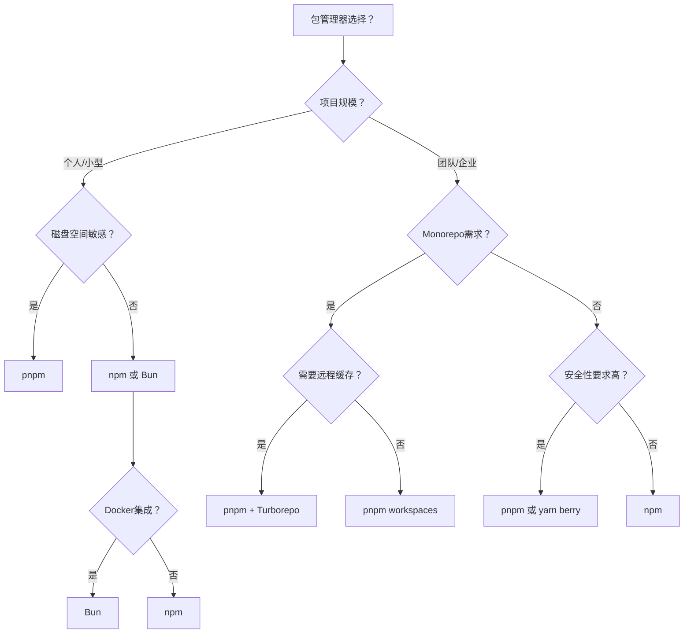
```mermaid
flowchart TD
    A[包管理器选择？] --> B{项目规模？}
    B -->|个人/小型| C{磁盘空间敏感？}
    B -->|团队/企业| D{Monorepo需求？}
    C -->|是| E[pnpm]
    C -->|否| F[npm 或 Bun]
    D -->|是| G{需要远程缓存？}
    D -->|否| H{安全性要求高？}
    G -->|是| I[pnpm + Turborepo]
    G -->|否| J[pnpm workspaces]
    H -->|是| K[pnpm 或 yarn berry]
    H -->|否| L[npm]
    F --> M{Docker集成？}
    M -->|是| N[Bun]
    M -->|否| O[npm]
```

### ASCII 文本树

```
包管理器选择？
├── 项目规模？
│   ├── 个人/小型 → 磁盘空间敏感？
│   │   ├── 是 → pnpm
│   │   │         📌 硬链接节省磁盘，node_modules结构扁平
│   │   │         📌 安装速度比npm快3倍，默认lockfile
│   │   └── 否 → npm 或 Bun
│   │       ├── Docker集成？
│   │       │   ├── 是 → Bun
│   │       │   │         📌 内置运行时+包管理器，Docker镜像极小
│   │       │   │         📌 lockfile兼容npm，安装速度极快
│   │       │   └── 否 → npm
│   │       │             📌 Node.js内置，零学习成本，生态最通用
│   │       │             📌 适合：不需要特殊功能的标准项目
│   └── 团队/企业 → Monorepo需求？
│       ├── 是 → 需要远程缓存？
│       │   ├── 是 → pnpm + Turborepo
│       │   │         📌 pnpm workspace + Turborepo远程缓存 = 企业级Monorepo
│       │   │         📌 支持任务管道，并行执行，CI/CD大幅加速
│       │   └── 否 → pnpm workspaces
│       │             📌 原生workspace支持，filter命令强大
│       │             📌 比yarn workspaces更省磁盘，更快速度
│       └── 否 → 安全性要求高？
│           ├── 是 → pnpm 或 yarn berry
│           │   📌 pnpm：严格依赖隔离，自动阻止幽灵依赖
│           │   📌 yarn berry：Plug'n'Play零依赖，签名验证支持
│           └── 否 → npm
│               📌 成熟稳定，企业审计友好，与Registry生态无缝
```

### 快速推荐

| 场景 | 推荐 | 理由 |
|------|------|------|
| 个人项目 | **npm** | 零配置，随Node.js安装 |
| 磁盘空间敏感 | **pnpm** | 硬链接机制，全局存储节省空间 |
| Monorepo | **pnpm + Turborepo** | 远程缓存，任务管道，filter命令 |
| 极致速度 | **Bun** | 安装速度最快，内置运行时 |
| 企业安全 | **pnpm** | 严格依赖隔离，阻止幽灵依赖 |
| Docker场景 | **Bun** | 极简镜像，单二进制 |
| Yarn迁移 | **yarn berry** | Plug'n'Play，离线模式 |

### 代码示例：pnpm workspace 配置

```yaml
# pnpm-workspace.yaml
packages:
  - 'packages/*'
  - 'apps/*'
```

```json
// package.json — 根目录脚本
{
  "scripts": {
    "build": "pnpm -r build",
    "test": "pnpm -r test",
    "lint": "pnpm -r lint",
    "dev:web": "pnpm --filter web dev",
    "dev:api": "pnpm --filter api dev"
  }
}
```

```bash
# 常用 pnpm workspace 命令
pnpm install              # 安装所有依赖
pnpm --filter <pkg> add lodash   # 给指定包添加依赖
pnpm --filter <pkg> exec vitest  # 在指定包中执行命令
pnpm -r run build         # 递归构建所有包
```

> 📚 参考：[pnpm Documentation](https://pnpm.io/) | [pnpm Workspaces](https://pnpm.io/workspaces) | [Bun Package Manager](https://bun.sh/docs/cli/install) | [npm Workspaces](https://docs.npmjs.com/cli/v10/using-npm/workspaces)

---

## 8. Monorepo 工具选型决策树

### Mermaid 流程图

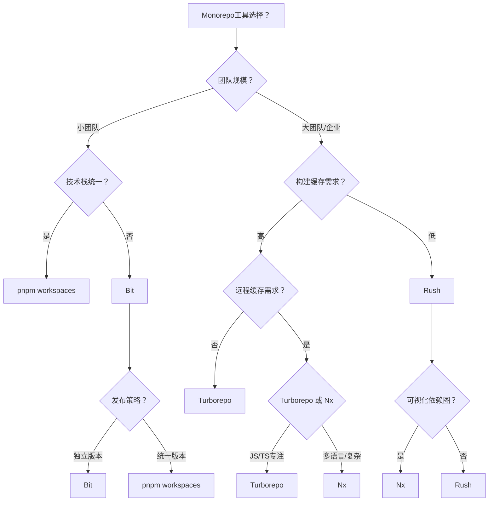
```mermaid
flowchart TD
    A[Monorepo工具选择？] --> B{团队规模？}
    B -->|小团队| C{技术栈统一？}
    B -->|大团队/企业| D{构建缓存需求？}
    C -->|是| E[pnpm workspaces]
    C -->|否| F[Bit]
    D -->|高| G{远程缓存需求？}
    D -->|低| H[Rush]
    G -->|是| I{Turborepo 或 Nx}
    G -->|否| J[Turborepo]
    I -->|JS/TS专注| K[Turborepo]
    I -->|多语言/复杂| L[Nx]
    F --> M{发布策略？}
    M -->|独立版本| N[Bit]
    M -->|统一版本| O[pnpm workspaces]
    H --> P{可视化依赖图？}
    P -->|是| Q[Nx]
    P -->|否| R[Rush]
```

### ASCII 文本树

```
Monorepo工具选择？
├── 团队规模？
│   ├── 小团队 → 技术栈统一？
│   │   ├── 是 → pnpm workspaces
│   │   │         📌 零额外工具，pnpm原生支持，上手成本最低
│   │   │         📌 适合：同技术栈的小型项目集合
│   │   └── 否 → Bit
│   │             📌 组件驱动开发，支持异构技术栈组合
│   │             📌 适合：微前端、跨框架组件库
│   └── 大团队/企业 → 构建缓存需求？
│       ├── 高 → 远程缓存需求？
│       │   ├── 是 → JS/TS专注？
│       │   │   ├── 是 → Turborepo
│       │   │   │         📌 Vercel出品，与JS生态深度集成
│       │   │   │         📌 配置极简，远程缓存免费额度 generous
│       │   │   └── 否 → Nx
│       │   │             📌 多语言支持，插件生态丰富
│       │   │             📌 强大的依赖图分析和项目约束规则
│       │   └── 否 → Turborepo
│       │       📌 本地任务缓存，并行执行，增量构建
│       └── 低 → Rush
│           📌 微软出品，企业级版本管理，统一版本策略
│           📌 内置发布流程，change log自动生成
```

### 快速推荐

| 场景 | 推荐 | 理由 |
|------|------|------|
| 小型JS/TS项目 | **pnpm workspaces** | 零额外依赖，足够简单 |
| 追求极速构建 | **Turborepo** | 配置简单，远程缓存开箱即用 |
| 多语言Monorepo | **Nx** | 插件生态最全，不限于JS |
| 企业级发布管理 | **Rush** | 微软出品，版本策略严谨 |
| 跨框架组件库 | **Bit** | 组件级独立发布，技术栈无关 |
| 大型团队 | **Nx 或 Turborepo** | 依赖图可视化，任务并行化 |

### 代码示例：Nx 生成器与执行器

```bash
# 安装 Nx
npx create-nx-workspace@latest myorg --preset=ts

# 生成库
npx nx g @nx/js:lib utils --unitTestRunner=vitest

# 生成应用
npx nx g @nx/next:app webapp

# 依赖图可视化
npx nx graph

# 受影响项目构建（仅构建变更及其依赖）
npx nx affected -t build
```

```json
// nx.json — 任务缓存与并行配置
{
  "targetDefaults": {
    "build": {
      "dependsOn": ["^build"],
      "inputs": ["production", "^production"],
      "cache": true
    },
    "test": {
      "inputs": ["default", "^production", "{workspaceRoot}/jest.config.js"],
      "cache": true
    }
  },
  "parallel": 3,
  "namedInputs": {
    "default": ["{projectRoot}/**/*", "sharedGlobals"],
    "production": ["default", "!{projectRoot}/**/*.test.ts"]
  }
}
```

> 📚 参考：[Turborepo Documentation](https://turbo.build/repo/docs) | [Nx Documentation](https://nx.dev/getting-started/intro) | [Rush Stack](https://rushstack.io/) | [Bit Documentation](https://bit.dev/docs/getting-started/installing-bit)

---

## 9. 部署平台选型决策树

### Mermaid 流程图

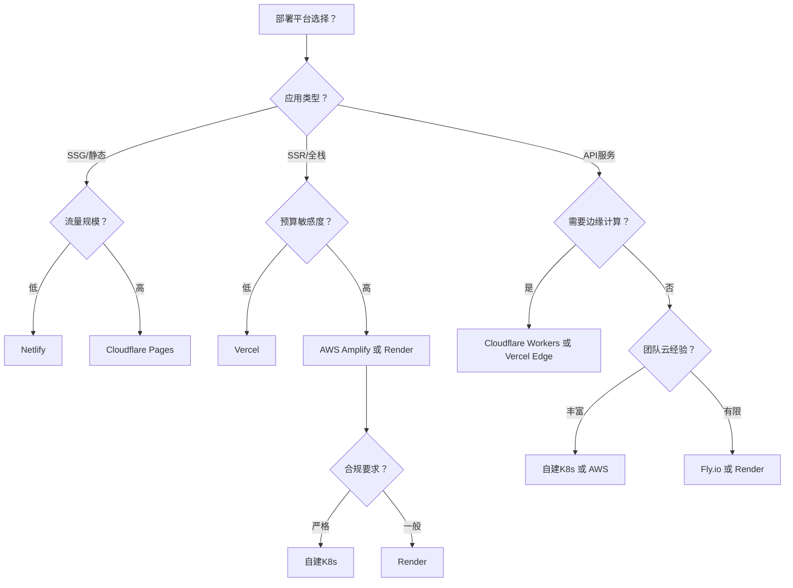
```mermaid
flowchart TD
    A[部署平台选择？] --> B{应用类型？}
    B -->|SSG/静态| C{流量规模？}
    B -->|SSR/全栈| D{预算敏感度？}
    B -->|API服务| E{需要边缘计算？}
    C -->|低| F[Netlify]
    C -->|高| G[Cloudflare Pages]
    D -->|低| H[Vercel]
    D -->|高| I[AWS Amplify 或 Render]
    E -->|是| J[Cloudflare Workers 或 Vercel Edge]
    E -->|否| K{团队云经验？}
    K -->|丰富| L[自建K8s 或 AWS]
    K -->|有限| M[Fly.io 或 Render]
    I --> N{合规要求？}
    N -->|严格| O[自建K8s]
    N -->|一般| P[Render]
```

### ASCII 文本树

```
部署平台选择？
├── 应用类型？
│   ├── SSG/静态 → 流量规模？
│   │   ├── 低 → Netlify
│   │   │         📌 静态托管标杆，表单处理+Identity集成
│   │   │         📌 免费额度 generous，适合个人/开源项目
│   │   └── 高 → Cloudflare Pages
│   │             📌 全球CDN，边缘缓存，免费流量几乎无限
│   │             📌 与Workers无缝集成，边缘函数支持
│   ├── SSR/全栈 → 预算敏感度？
│   │   ├── 低 → Vercel
│   │   │         📌 NextJS官方平台，零配置部署，预览环境自动生成
│   │   │         📌 生态最全，但超出免费额度费用较高
│   │   └── 高 → AWS Amplify 或 Render
│   │       ├── 合规要求？
│   │       │   ├── 严格 → 自建K8s
│   │       │   │         📌 完全可控，数据驻留自主管理
│   │       │   │         📌 适合：金融、医疗等强合规行业
│   │       │   └── 一般 → Render
│   │       │             📌 价格透明，自动SSL，数据库托管一体
│   │       │             📌 适合：初创团队，预算敏感的全栈应用
│   └── API服务 → 需要边缘计算？
│       ├── 是 → Cloudflare Workers 或 Vercel Edge
│       │         📌 Cloudflare Workers：V8 isolate，冷启动0ms
│       │         📌 Vercel Edge：与NextJS深度集成，全球低延迟
│       └── 否 → 团队云经验？
│           ├── 丰富 → 自建K8s 或 AWS
│           │         📌 K8s：容器编排标准，多云可移植
│           └── 有限 → Fly.io
│                     📌 按区域部署容器，全球负载均衡极简
│                     📌 自带PostgreSQL托管，适合全栈API
```

### 快速推荐

| 场景 | 推荐 | 理由 |
|------|------|------|
| NextJS应用 | **Vercel** | 官方平台，功能集成最深 |
| 静态网站/博客 | **Cloudflare Pages** | 免费流量大，全球CDN |
| 边缘API/Worker | **Cloudflare Workers** | 冷启动为零，定价低 |
| 预算敏感全栈 | **Render** | 价格透明，一体化托管 |
| 全球容器部署 | **Fly.io** | 区域级部署，数据库一体 |
| 强合规需求 | **自建K8s** | 完全自主可控 |

### 代码示例：Next.js 部署到 Vercel

```javascript
// vercel.json — 边缘函数与缓存配置
{
  "functions": {
    "app/api/edge/**/*.ts": {
      "maxDuration": 30
    }
  },
  "headers": [
    {
      "source": "/(.*)",
      "headers": [
        { "key": "X-Content-Type-Options", "value": "nosniff" }
      ]
    }
  ]
}
```

### 代码示例：Cloudflare Workers 部署配置

```typescript
// wrangler.toml
name = "my-api"
main = "src/index.ts"
compatibility_date = "2026-04-27"

# D1 数据库绑定
[[d1_databases]]
binding = "DB"
database_name = "production-db"
database_id = "xxxxxxxx-xxxx-xxxx-xxxx-xxxxxxxxxxxx"

# KV 缓存绑定
[[kv_namespaces]]
binding = "CACHE"
id = "xxxxxxxx-xxxx-xxxx-xxxx-xxxxxxxxxxxx"
```

```typescript
// src/index.ts — Hono on Cloudflare Workers
import { Hono } from 'hono';

const app = new Hono<{ Bindings: { DB: D1Database; CACHE: KVNamespace } }>();

app.get('/api/users/:id', async (c) => {
  const id = c.req.param('id');
  const cached = await c.env.CACHE.get(`user:${id}`);
  if (cached) return c.json(JSON.parse(cached));

  const user = await c.env.DB.prepare('SELECT * FROM users WHERE id = ?')
    .bind(id)
    .first();
  if (!user) return c.notFound();

  await c.env.CACHE.put(`user:${id}`, JSON.stringify(user), { expirationTtl: 300 });
  return c.json(user);
});

export default app;
```

> 📚 参考：[Vercel Docs — Deployment](https://vercel.com/docs/concepts/deployments/overview) | [Cloudflare Workers Docs](https://developers.cloudflare.com/workers/) | [Cloudflare Pages Docs](https://developers.cloudflare.com/pages/) | [Fly.io Docs](https://fly.io/docs/)

---

## 10. 监控与可观测性选型决策树

### Mermaid 流程图

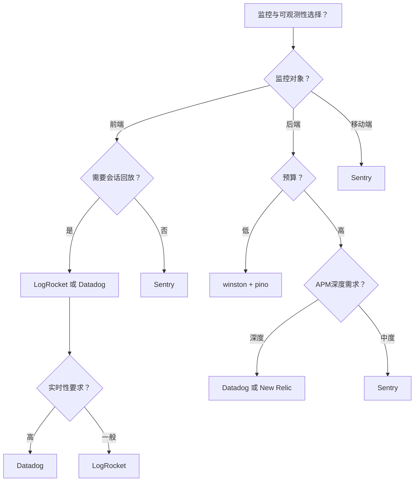
```mermaid
flowchart TD
    A[监控与可观测性选择？] --> B{监控对象？}
    B -->|前端| C{需要会话回放？}
    B -->|后端| D{预算？}
    B -->|移动端| E[Sentry]
    C -->|是| F[LogRocket 或 Datadog]
    C -->|否| G[Sentry]
    D -->|低| H[winston + pino]
    D -->|高| I{APM深度需求？}
    I -->|深度| J[Datadog 或 New Relic]
    I -->|中度| K[Sentry]
    F --> L{实时性要求？}
    L -->|高| M[Datadog]
    L -->|一般| N[LogRocket]
```

### ASCII 文本树

```
监控与可观测性选择？
├── 监控对象？
│   ├── 前端 → 需要会话回放？
│   │   ├── 是 → LogRocket 或 Datadog
│   │   │         📌 LogRocket：前端会话回放标杆，DOM录制精准
│   │   │         📌 Datadog：全栈可观测，RUM+APM关联分析
│   │   └── 否 → Sentry
│   │       📌 错误追踪行业标杆，source map还原精准
│   │       📌 性能监控、发布健康度、Issue自动分配
│   ├── 后端 → 预算？
│   │   ├── 低 → winston + pino
│   │   │         📌 winston：生态最成熟，传输方式丰富
│   │   │         📌 pino：高性能JSON日志，开销极低
│   │   └── 高 → APM深度需求？
│   │       ├── 深度 → Datadog 或 New Relic
│   │       │         📌 Datadog：基础设施+应用+日志统一平台
│   │       │         📌 New Relic：APM先驱，分布式追踪完善
│   │       └── 中度 → Sentry
│   │           📌 后端错误追踪，性能监控，发布回归检测
│   └── 移动端 → Sentry
│       📌 跨平台支持(iOS/Android/RN/Flutter)，崩溃符号化
│       📌 发布版本追踪，用户影响面评估
```

### 快速推荐

| 场景 | 推荐 | 理由 |
|------|------|------|
| 前端错误追踪 | **Sentry** | source map还原最准，生态最全 |
| 前端会话回放 | **LogRocket** | DOM录制体验最佳 |
| 全栈可观测 | **Datadog** | APM+日志+基础设施统一 |
| 预算有限 | **pino + Sentry** | 高性能日志+核心错误追踪 |
| 移动端崩溃 | **Sentry** | 跨平台，符号化完善 |
| 企业级APM | **New Relic** | 分布式追踪成熟 |
| 自托管日志 | **winston** | 传输插件丰富，生态成熟 |

### 代码示例：pino 结构化日志与 OpenTelemetry 集成

```typescript
import pino from 'pino';

// 生产环境结构化日志（JSON）
const logger = pino({
  level: process.env.LOG_LEVEL ?? 'info',
  base: { service: 'api-gateway', version: '1.2.0' },
  timestamp: pino.stdTimeFunctions.isoTime,
  formatters: {
    level(label) {
      return { level: label.toUpperCase() };
    },
  },
  redact: {
    paths: ['req.headers.authorization', 'password', 'token'],
    remove: true,
  },
});

// 使用
logger.info({ reqId: 'abc-123', userId: 42 }, 'User login success');
logger.error({ err: new Error('DB connection timeout') }, 'Database error');

// 子 logger 继承上下文
const child = logger.child({ component: 'payment-service' });
child.warn({ amount: 199.99 }, 'Suspicious transaction detected');
```

> 📚 参考：[Sentry Documentation](https://docs.sentry.io/) | [pino Documentation](https://getpino.io/#/) | [Datadog Docs](https://docs.datadoghq.com/) | [OpenTelemetry JS](https://opentelemetry.io/docs/languages/js/)

---

## 11. CI/CD 流水线选型决策树

### Mermaid 流程图

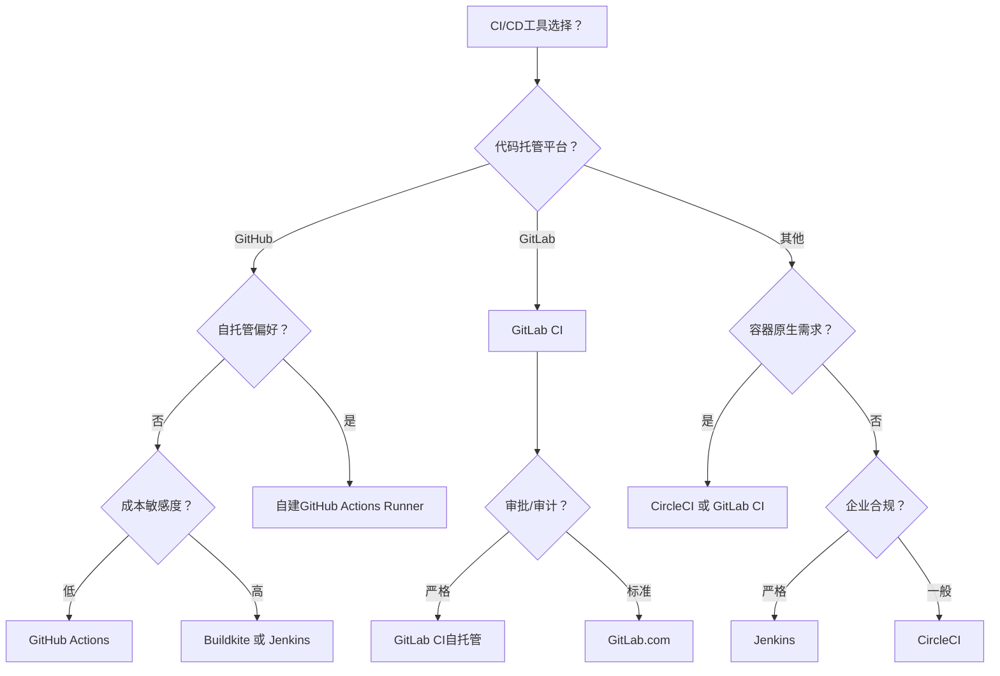
```mermaid
flowchart TD
    A[CI/CD工具选择？] --> B{代码托管平台？}
    B -->|GitHub| C{自托管偏好？}
    B -->|GitLab| D[GitLab CI]
    B -->|其他| E{容器原生需求？}
    C -->|否| F{成本敏感度？}
    C -->|是| G[自建GitHub Actions Runner]
    F -->|低| H[GitHub Actions]
    F -->|高| I[Buildkite 或 Jenkins]
    E -->|是| J[CircleCI 或 GitLab CI]
    E -->|否| K{企业合规？}
    K -->|严格| L[Jenkins]
    K -->|一般| M[CircleCI]
    D --> N{审批/审计？}
    N -->|严格| O[GitLab CI自托管]
    N -->|标准| P[GitLab.com]
```

### ASCII 文本树

```
CI/CD工具选择？
├── 代码托管平台？
│   ├── GitHub → 自托管偏好？
│   │   ├── 否 → 成本敏感度？
│   │   │   ├── 低 → GitHub Actions
│   │   │   │         📌 与GitHub深度集成，Actions Marketplace丰富
│   │   │   │         📌 矩阵构建，并发执行，预览环境自动部署
│   │   │   └── 高 → Buildkite 或 Jenkins
│   │   │       📌 Buildkite：混合模式，SaaS控制+自托管Runner，按用户定价
│   │   │       📌 Jenkins：完全免费，插件最多，但维护成本高
│   │   └── 是 → 自建GitHub Actions Runner
│   │       📌 数据不出境，自定义硬件资源，企业级隔离
│   ├── GitLab → 审批/审计需求？
│   │   ├── 严格 → GitLab CI自托管
│   │   │         📌 完整DevOps平台，CI/CD+代码+Issue一体化
│   │   │         📌 审批流程、审计日志、合规认证齐全
│   │   └── 标准 → GitLab.com
│   │       📌 与GitLab仓库无缝，CI配置即代码(.gitlab-ci.yml)
│   └── 其他 → 容器原生需求？
│       ├── 是 → CircleCI 或 GitLab CI
│       │   📌 CircleCI：Docker原生，执行速度快，配置简洁
│       │   📌 GitLab CI：Kubernetes Executor，弹性伸缩
│       └── 否 → 企业合规？
│           ├── 严格 → Jenkins
│           │         📌 完全自托管，数据主权可控，插件覆盖一切
│           └── 一般 → CircleCI
│               📌 云原生，SSH调试，并行工作流强大
```

### 快速推荐

| 场景 | 推荐 | 理由 |
|------|------|------|
| GitHub仓库 | **GitHub Actions** | 原生集成，Marketplace丰富 |
| 完整DevOps平台 | **GitLab CI** | 代码+CI+CD+监控一体化 |
| 容器原生构建 | **CircleCI** | Docker优化，执行速度快 |
| 完全自托管 | **Jenkins** | 零授权费，插件生态最全 |
| 混合模式 | **Buildkite** | SaaS控制+自托管执行器 |
| 企业合规/审计 | **GitLab自托管** | 审批流程，审计日志完备 |
| 预算敏感 | **Jenkins** | 开源免费，硬件自主 |

### 代码示例：GitHub Actions 可复用工作流

```yaml
# .github/workflows/reusable-ci.yml
name: Reusable CI
on:
  workflow_call:
    inputs:
      node-version:
        required: true
        type: string
      run-e2e:
        default: false
        type: boolean

jobs:
  build:
    runs-on: ubuntu-latest
    steps:
      - uses: actions/checkout@v4
      - uses: pnpm/action-setup@v4
      - uses: actions/setup-node@v4
        with:
          node-version: ${{ inputs.node-version }}
          cache: 'pnpm'
      - run: pnpm install --frozen-lockfile
      - run: pnpm lint
      - run: pnpm typecheck
      - run: pnpm test --coverage
      - uses: codecov/codecov-action@v5
        if: inputs.run-e2e
      - run: pnpm test:e2e
        if: inputs.run-e2e
```

### 代码示例：GitLab CI 多阶段流水线

```yaml
# .gitlab-ci.yml
stages: [install, lint, test, build, deploy]

variables:
  NODE_VERSION: "22"
  PNPM_CACHE_FOLDER: ".pnpm-store"

cache:
  key: ${CI_COMMIT_REF_SLUG}
  paths:
    - ${PNPM_CACHE_FOLDER}
    - node_modules/
    - .turbo/

install:
  stage: install
  image: node:${NODE_VERSION}
  script:
    - corepack enable
    - corepack prepare pnpm@latest --activate
    - pnpm config set store-dir ${PNPM_CACHE_FOLDER}
    - pnpm install --frozen-lockfile

lint:
  stage: lint
  image: node:${NODE_VERSION}
  script:
    - pnpm lint
    - pnpm typecheck

test:
  stage: test
  image: node:${NODE_VERSION}
  script:
    - pnpm test --coverage
  coverage: '/All files[^|]*\|[^|]*\s+([\d\.]+)/'

build:
  stage: build
  image: node:${NODE_VERSION}
  script:
    - pnpm build
  artifacts:
    paths:
      - dist/
    expire_in: 1 week

deploy:
  stage: deploy
  image: alpine:latest
  script:
    - echo "Deploying to production..."
  environment:
    name: production
    url: https://api.example.com
  only:
    - main
```

> 📚 参考：[GitHub Actions Documentation](https://docs.github.com/en/actions) | [GitLab CI/CD Docs](https://docs.gitlab.com/ee/ci/) | [CircleCI Docs](https://circleci.com/docs/) | [Jenkins Documentation](https://www.jenkins.io/doc/)

---

## 12. Web API 技术选型决策树

### Mermaid 流程图

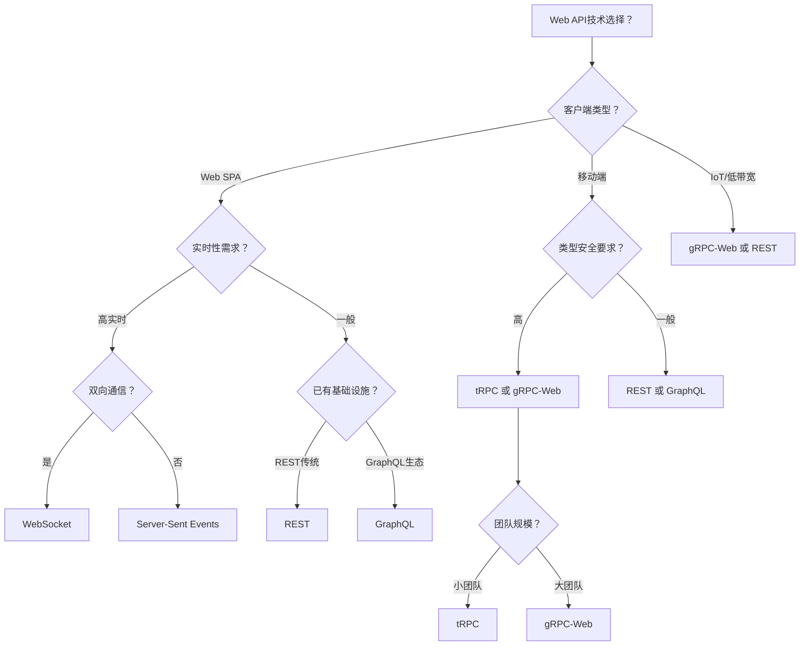
```mermaid
flowchart TD
    A[Web API技术选择？] --> B{客户端类型？}
    B -->|Web SPA| C{实时性需求？}
    B -->|移动端| D{类型安全要求？}
    B -->|IoT/低带宽| E[gRPC-Web 或 REST]
    C -->|高实时| F{双向通信？}
    C -->|一般| G{已有基础设施？}
    F -->|是| H[WebSocket]
    F -->|否| I[Server-Sent Events]
    D -->|高| J[tRPC 或 gRPC-Web]
    D -->|一般| K[REST 或 GraphQL]
    G -->|REST传统| L[REST]
    G -->|GraphQL生态| M[GraphQL]
    J --> N{团队规模？}
    N -->|小团队| O[tRPC]
    N -->|大团队| P[gRPC-Web]
```

### ASCII 文本树

```
Web API技术选择？
├── 客户端类型？
│   ├── Web SPA → 实时性需求？
│   │   ├── 高实时 → 双向通信？
│   │   │   ├── 是 → WebSocket
│   │   │   │         📌 全双工通道，聊天/协作/游戏首选
│   │   │   │         📌 Socket.io降级友好，rooms机制强大
│   │   │   └── 否 → Server-Sent Events
│   │   │             📌 单向服务端推送，基于HTTP，自动重连
│   │   │             📌 适合：股票行情、实时通知、日志流
│   │   └── 一般 → 已有基础设施？
│   │       ├── REST传统 → REST
│   │       │         📌 最通用，缓存友好，CDN支持好
│   │       │         📌 适合：无特殊需求的标准CRUD服务
│   │       └── GraphQL生态 → GraphQL
│   │           📌 客户端驱动查询，一次请求获取所需数据
│   │           📌 适合：复杂数据关系，前端需求多变
│   ├── 移动端 → 类型安全要求？
│   │   ├── 高 → 团队规模？
│   │   │   ├── 小团队 → tRPC
│   │   │   │         📌 端到端TypeScript类型安全，零样板代码
│   │   │   │         📌 需全栈TypeScript，仅适合统一技术栈
│   │   │   └── 大团队 → gRPC-Web
│   │   │             📌 强Schema约束，多语言代码生成
│   │   │             📌 HTTP/2传输，二进制ProtoBuf高效
│   │   └── 一般 → REST 或 GraphQL
│   │       📌 REST：移动端缓存策略成熟，开发成本低
│   │       📌 GraphQL：减少请求次数，弱网环境友好
│   └── IoT/低带宽 → gRPC-Web 或 REST
│       📌 gRPC-Web：二进制传输，带宽占用最低
│       📌 REST：兼容性最好，嵌入式设备友好
```

### 快速推荐

| 场景 | 推荐 | 理由 |
|------|------|------|
| 标准CRUD API | **REST** | 最通用，缓存成熟 |
| 前端数据灵活查询 | **GraphQL** | 客户端驱动，减少往返 |
| 全栈TypeScript | **tRPC** | 端到端类型安全 |
| 实时双向通信 | **WebSocket** | 全双工，生态成熟 |
| 服务端推送 | **Server-Sent Events** | HTTP原生，自动重连 |
| 移动端/多语言 | **gRPC-Web** | 强Schema，二进制高效 |
| 物联网/低带宽 | **gRPC-Web** | ProtoBuf压缩率高 |

### 代码示例：tRPC 路由 + 中间件 + 客户端调用

```typescript
// server/router.ts
import { initTRPC } from '@trpc/server';
import { z } from 'zod';

const t = initTRPC.create();
const appRouter = t.router({
  user: t.router({
    getById: t.procedure
      .input(z.object({ id: z.string().uuid() }))
      .query(async ({ input }) => {
        return db.user.findById(input.id); // 推导返回类型自动传播到客户端
      }),
    create: t.procedure
      .input(z.object({ name: z.string().min(1), email: z.string().email() }))
      .mutation(async ({ input }) => {
        return db.user.create(input);
      }),
  }),
});

export type AppRouter = typeof appRouter;

// client.ts
import { createTRPCProxyClient, httpBatchLink } from '@trpc/client';
import type { AppRouter } from './server/router';

const client = createTRPCProxyClient<AppRouter>({
  links: [httpBatchLink({ url: '/api/trpc' })],
});

// 完全类型安全的远程调用
const user = await client.user.getById.query({ id: '550e8400-e29b-41d4-a716-446655440000' });
```

### 代码示例：Server-Sent Events 实时推送

```typescript
// server.ts — Node.js 原生 SSE
import { createServer } from 'node:http';

const server = createServer((req, res) => {
  if (req.url === '/events') {
    res.writeHead(200, {
      'Content-Type': 'text/event-stream',
      'Cache-Control': 'no-cache',
      'Connection': 'keep-alive',
    });

    const interval = setInterval(() => {
      res.write(`data: ${JSON.stringify({ time: new Date().toISOString(), price: Math.random() * 100 })}

`);
    }, 1000);

    req.on('close', () => clearInterval(interval));
    return;
  }

  res.writeHead(200, { 'Content-Type': 'text/html' });
  res.end(`
    <script>
      const evtSource = new EventSource('/events');
      evtSource.onmessage = (e) => console.log(JSON.parse(e.data));
    </script>
  `);
});

server.listen(3000);
```

> 📚 参考：[tRPC Documentation](https://trpc.io/docs) | [GraphQL Specification](https://spec.graphql.org/) | [Socket.io Docs](https://socket.io/docs/v4/) | [MDN — Server-Sent Events](https://developer.mozilla.org/en-US/docs/Web/API/Server-sent_events)

---

## 13. 认证方案选型决策树

### Mermaid 流程图

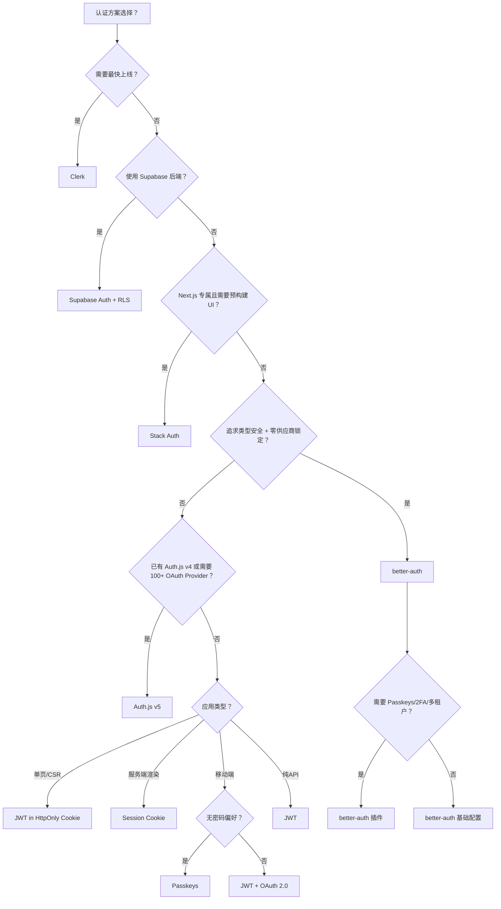
```mermaid
flowchart TD
    A[认证方案选择？] --> B{需要最快上线？}
    B -->|是| C[Clerk]
    B -->|否| D{使用 Supabase 后端？}
    D -->|是| E[Supabase Auth + RLS]
    D -->|否| F{Next.js 专属且需要预构建 UI？}
    F -->|是| G[Stack Auth]
    F -->|否| H{追求类型安全 + 零供应商锁定？}
    H -->|是| I[better-auth]
    H -->|否| J{已有 Auth.js v4 或需要 100+ OAuth Provider？}
    J -->|是| K[Auth.js v5]
    J -->|否| L{应用类型？}
    L -->|单页/CSR| M[JWT in HttpOnly Cookie]
    L -->|服务端渲染| N[Session Cookie]
    L -->|移动端| O{无密码偏好？}
    L -->|纯API| P[JWT]
    O -->|是| Q[Passkeys]
    O -->|否| R[JWT + OAuth 2.0]
    I --> S{需要 Passkeys/2FA/多租户？}
    S -->|是| T[better-auth 插件]
    S -->|否| U[better-auth 基础配置]
```

### ASCII 文本树

```
认证方案选择？
├── 需要最快上线（<1天）？
│   └── 是 → Clerk
│             📌 托管服务，预构建 UI，分钟级集成
│             📌 SOC 2 合规，安全团队零维护成本
│             📌 适合：MVP、PoC、不愿维护认证基础设施的团队
├── 使用 Supabase 后端？
│   └── 是 → Supabase Auth
│             📌 RLS 行级安全：数据权限在数据库层执行
│             📌 与 PostgreSQL 深度集成，用户数据自主可控
│             📌 适合：已使用 Supabase 的全栈项目
├── Next.js 专属且需要预构建 UI？
│   └── 是 → Stack Auth
│             📌 Next.js 深度集成，App/Pages Router 均支持
│             📌 团队/组织、邀请机制内置
│             📌 云托管 + 自托管双模式
├── 追求类型安全 + 零供应商锁定？
│   └── 是 → better-auth
│             📌 2026 年 T3 Stack 默认选择，TS-first 设计
│             📌 插件架构：Passkeys、2FA、组织、Admin 按需加载
│             📌 数据库无关：Drizzle/Prisma/原生 SQL 适配器
│             📌 框架无关：Next.js/Nuxt/Hono/SvelteKit 均可
│             📌 零供应商锁定，完全自托管
│             └── 需要 Passkeys/2FA/多租户？
│                 ├── 是 → better-auth 插件系统一键启用
│                 └── 否 → better-auth 基础配置足够
├── 已有 Auth.js v4 或需要 100+ OAuth Provider？
│   └── 是 → Auth.js v5
│             📌 生态最成熟，OAuth Provider 最丰富
│             ⚠️ v4→v5 迁移 Breaking Change 多，抽象层调试困难
│             ⚠️ Edge runtime crypto 历史问题（v5 已修复但仍有坑）
└── 其他场景 → 应用类型？
    ├── 单页/CSR → JWT in HttpOnly Cookie
    │             📌 无状态，水平扩展友好
    │             📌 配合 Refresh Token 轮换机制
    ├── 服务端渲染 → Session Cookie
    │             📌 可即时撤销，原生安全
    ├── 移动端 → 无密码偏好？
    │   ├── 是 → Passkeys (FIDO2/WebAuthn)
    │   │         📌 生物识别/硬件密钥，防钓鱼
    │   └── 否 → JWT + OAuth 2.0 + PKCE
    │             📌 安全区存储(Keychain/Keystore)
    └── 纯API → JWT
                📌 无状态传递，微服务间解耦
```

### 快速推荐

| 场景 | 推荐 | 理由 |
|------|------|------|
| 2026 新全栈 TS 项目 | **better-auth** | 类型安全最佳，插件按需，零锁定 |
| Next.js 官方路线 | **Auth.js v5** | 生态最广，但需容忍迁移历史包袱 |
| 最快上线 MVP | **Clerk** | 分钟级集成，精美 UI，安全合规托管 |
| Supabase 后端 | **Supabase Auth** | RLS 不可替代，与数据库无缝集成 |
| SSR应用 | **Session Cookie** | 原生安全，可即时撤销 |
| 单页应用 | **JWT in HttpOnly Cookie** | 无状态，扩展性好 |
| 第三方登录 | **OAuth 2.0 + OIDC** | 行业标准，社交登录兼容 |
| 企业SSO | **SAML / OIDC** | 与IdP深度集成 |
| 移动端原生 | **JWT + Passkeys** | 安全区存储+无密码 |
| 微服务间 | **JWT** | 无状态传递，服务解耦 |
| 未来趋势 | **Passkeys** | 防钓鱼，用户体验好 |

### 代码示例：better-auth 基础配置

```typescript
// auth.ts — better-auth 通用配置
import { betterAuth } from 'better-auth';
import { drizzleAdapter } from 'better-auth/adapters/drizzle';
import { db } from './db';

export const auth = betterAuth({
  database: drizzleAdapter(db, { provider: 'sqlite' }),
  socialProviders: {
    github: {
      clientId: process.env.GITHUB_CLIENT_ID!,
      clientSecret: process.env.GITHUB_CLIENT_SECRET!,
    },
  },
  plugins: [], // 按需加载 2FA / Passkeys / Organization
});

// server.ts — Hono 集成
import { Hono } from 'hono';
import { auth } from './auth';

const app = new Hono();
app.on(['POST', 'GET'], '/api/auth/**', (c) => auth.handler(c.req.raw));
```

### 代码示例：Passkeys / WebAuthn 注册与验证

```typescript
// 客户端：注册 Passkey
async function registerPasskey() {
  const resp = await fetch('/api/auth/passkey/register-options');
  const options = await resp.json();

  const credential = await navigator.credentials.create({ publicKey: options }) as PublicKeyCredential;

  await fetch('/api/auth/passkey/register-verify', {
    method: 'POST',
    headers: { 'Content-Type': 'application/json' },
    body: JSON.stringify({
      id: credential.id,
      rawId: Array.from(new Uint8Array(credential.rawId)),
      response: {
        clientDataJSON: Array.from(new Uint8Array((credential.response as AuthenticatorAttestationResponse).clientDataJSON)),
        attestationObject: Array.from(new Uint8Array((credential.response as AuthenticatorAttestationResponse).attestationObject)),
      },
      type: credential.type,
    }),
  });
}
```

> 📚 参考：[better-auth Documentation](https://www.better-auth.com/docs/) | [WebAuthn / Passkeys Guide](https://webauthn.guide/) | [Auth.js Documentation](https://authjs.dev/) | [Clerk Docs](https://clerk.com/docs) | [Supabase Auth Docs](https://supabase.com/docs/guides/auth)

---

## 14. 数据存储选型决策树

### Mermaid 流程图

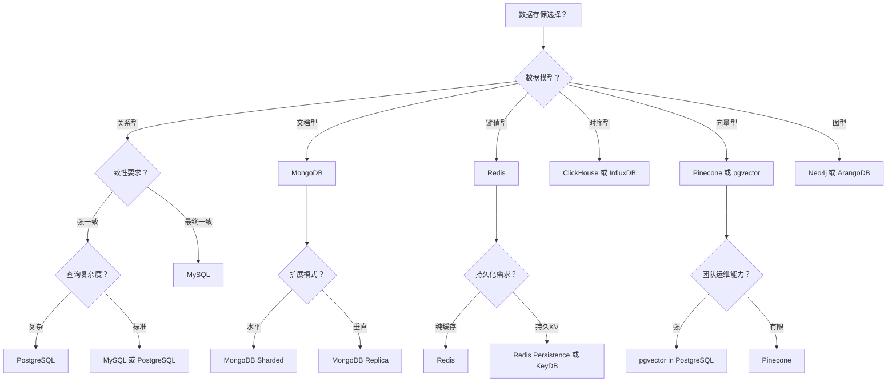
```mermaid
flowchart TD
    A[数据存储选择？] --> B{数据模型？}
    B -->|关系型| C{一致性要求？}
    B -->|文档型| D[MongoDB]
    B -->|键值型| E[Redis]
    B -->|时序型| F[ClickHouse 或 InfluxDB]
    B -->|向量型| G[Pinecone 或 pgvector]
    B -->|图型| H[Neo4j 或 ArangoDB]
    C -->|强一致| I{查询复杂度？}
    C -->|最终一致| J[MySQL]
    I -->|复杂| K[PostgreSQL]
    I -->|标准| L[MySQL 或 PostgreSQL]
    D --> M{扩展模式？}
    M -->|水平| N[MongoDB Sharded]
    M -->|垂直| O[MongoDB Replica]
    E --> P{持久化需求？}
    P -->|纯缓存| Q[Redis]
    P -->|持久KV| R[Redis Persistence 或 KeyDB]
    G --> S{团队运维能力？}
    S -->|强| T[pgvector in PostgreSQL]
    S -->|有限| U[Pinecone]
```

### ASCII 文本树

```
数据存储选择？
├── 数据模型？
│   ├── 关系型 → 一致性要求？
│   │   ├── 强一致 → 查询复杂度？
│   │   │   ├── 复杂 → PostgreSQL
│   │   │   │         📌 高级查询优化器，窗口函数，CTE递归
│   │   │   │         📌 JSONB支持文档查询，PostGIS地理扩展
│   │   │   │         📌 pgvector插件支持向量搜索
│   │   │   └── 标准 → MySQL 或 PostgreSQL
│   │   │       📌 MySQL：国内生态最熟，读写分离方案成熟
│   │   │       📌 PostgreSQL：功能更全，扩展生态丰富
│   │   └── 最终一致 → MySQL
│   │       📌 主从异步复制，读扩展性好，运维简单
│   ├── 文档型 → MongoDB
│   │   📌 Schema灵活，嵌套文档，聚合管道强大
│   │   📌 水平分片成熟，适合：内容管理、用户画像、日志
│   ├── 键值型 → Redis
│   │   📌 内存级延迟，数据结构丰富(String/Hash/Stream)
│   │   📌 持久化RDB/AOF，适合：缓存、会话、排行榜、限流
│   ├── 搜索/日志 → Elasticsearch
│   │   📌 倒排索引，全文搜索，聚合分析
│   │   📌 ELK生态成熟，适合：日志分析、站内搜索、APM
│   ├── 时序型 → ClickHouse
│   │   📌 列式存储，压缩率高，聚合查询极速
│   │   📌 适合：Metrics、IoT数据、大规模日志分析
│   ├── 向量型 → 团队运维能力？
│   │   ├── 强 → pgvector in PostgreSQL
│   │   │         📌 同一数据库管理，ACID保障，成本最低
│   │   └── 有限 → Pinecone
│   │       📌 全托管向量数据库，语义搜索开箱即用
│   │       📌 自动索引优化，无需调参
│   └── 图型 → Neo4j
│       📌 原生图存储，Cypher查询直观
│       📌 适合：知识图谱、社交网络、推荐系统
```

### 快速推荐

| 场景 | 推荐 | 理由 |
|------|------|------|
| 通用关系型 | **PostgreSQL** | 功能最全，扩展丰富 |
| 国内传统项目 | **MySQL** | 生态最熟，运维资源多 |
| Schema灵活 | **MongoDB** | 文档模型，快速迭代 |
| 缓存/会话 | **Redis** | 内存级速度，数据结构丰富 |
| 全文搜索 | **Elasticsearch** | 倒排索引，ELK生态 |
| 时序/分析 | **ClickHouse** | 列式存储，聚合极速 |
| 向量/RAG | **Pinecone** | 托管服务，开箱即用 |
| 图数据库 | **Neo4j** | 原生图存储，Cypher直观 |

### 代码示例：Redis 限流器与分布式锁

```typescript
import Redis from 'ioredis';

const redis = new Redis({ host: 'localhost', port: 6379 });

// 滑动窗口限流器
async function rateLimit(key: string, limit: number, windowMs: number): Promise<boolean> {
  const now = Date.now();
  const windowStart = now - windowMs;
  const multi = redis.multi();

  multi.zremrangebyscore(key, 0, windowStart);
  multi.zcard(key);
  multi.zadd(key, now, `${now}-${Math.random()}`);
  multi.pexpire(key, windowMs);

  const results = await multi.exec();
  const currentCount = (results?.[1]?.[1] as number) ?? 0;
  return currentCount < limit;
}

// 分布式锁（Redlock 简化版）
async function acquireLock(lockKey: string, ttlMs: number): Promise<string | null> {
  const token = `${Date.now()}-${Math.random()}`;
  const result = await redis.set(lockKey, token, 'PX', ttlMs, 'NX');
  return result === 'OK' ? token : null;
}

async function releaseLock(lockKey: string, token: string): Promise<void> {
  const script = `
    if redis.call("get", KEYS[1]) == ARGV[1] then
      return redis.call("del", KEYS[1])
    else
      return 0
    end
  `;
  await redis.eval(script, 1, lockKey, token);
}
```

> 📚 参考：[PostgreSQL Documentation](https://www.postgresql.org/docs/) | [Redis Commands Reference](https://redis.io/commands/) | [MongoDB Docs](https://www.mongodb.com/docs/) | [pgvector GitHub](https://github.com/pgvector/pgvector) | [Neo4j Cypher Manual](https://neo4j.com/docs/cypher-manual/current/)

---

## 15. AI 框架选型决策树

### Mermaid 流程图

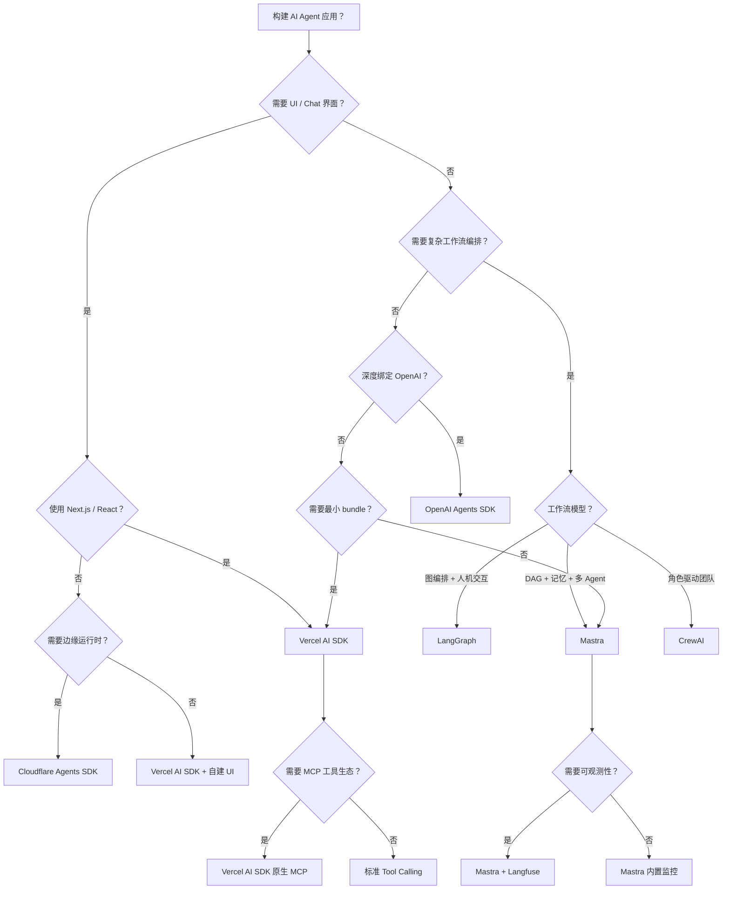
```mermaid
flowchart TD
    A[构建 AI Agent 应用？] --> B{需要 UI / Chat 界面？}
    B -->|是| C{使用 Next.js / React？}
    C -->|是| D[Vercel AI SDK]
    C -->|否| E{需要边缘运行时？}
    E -->|是| F[Cloudflare Agents SDK]
    E -->|否| G[Vercel AI SDK + 自建 UI]
    B -->|否| H{需要复杂工作流编排？}
    H -->|是| I{工作流模型？}
    I -->|图编排 + 人机交互| K[LangGraph]
    I -->|DAG + 记忆 + 多 Agent| J[Mastra]
    I -->|角色驱动团队| L[CrewAI]
    H -->|否| M{深度绑定 OpenAI？}
    M -->|是| N[OpenAI Agents SDK]
    M -->|否| O{需要最小 bundle？}
    O -->|是| D
    O -->|否| J
    D --> P{需要 MCP 工具生态？}
    P -->|是| Q[Vercel AI SDK 原生 MCP]
    P -->|否| R[标准 Tool Calling]
    J --> S{需要可观测性？}
    S -->|是| T[Mastra + Langfuse]
    S -->|否| U[Mastra 内置监控]
```

### ASCII 文本树

```
构建 AI Agent 应用？
├── 需要 UI / Chat 界面？
│   ├── 使用 Next.js / React？
│   │   ├── 是 → Vercel AI SDK
│   │   │         📌 200万+ 周下载，100+ 模型统一 API
│   │   │         📌 原生 Streaming、AI Gateway、MCP Client 内置
│   │   └── 否 → 需要边缘运行时？
│   │             ├── 是 → Cloudflare Agents SDK
│   │             │         📌 Durable Objects 有状态会话，全球低延迟
│   │             │         📌 适合：WebSocket 实时协作、边缘原生
│   │             └── 否 → Vercel AI SDK + 自建 UI
│   └── 否 → 需要复杂工作流编排？
│       ├── 是 → 工作流模型？
│       │   ├── 图编排 + 人机交互 → LangGraph
│       │   │         📌 基于图状态机，支持循环、分支、持久化 Checkpointer
│       │   │         📌 生产级采用：Uber、Klarna、LinkedIn、JPMorgan
│       │   │         📌 适合：复杂审批、研究型 Agent、需要可视化调试
│       │   ├── DAG + 记忆 + 多 Agent → Mastra
│       │   │         📌 TypeScript-first，内置 DAG 工作流、Memory、Multi-Agent
│       │   │         📌 适合：企业级自动化、多角色协作系统
│       │   └── 角色驱动团队 → CrewAI
│       │             📌 46K+ Stars，角色(Role)+目标(Goal)+任务(Task)驱动
│       │             📌 v1.10+ 原生 MCP + A2A 支持
│       │             📌 适合：内容创作流水线、多领域分析、研究团队
│       └── 否 → 深度绑定 OpenAI？
│           ├── 是 → OpenAI Agents SDK
│           │         📌 官方出品，100+ 模型支持，类型安全
│           │         📌 内置 Agent Handoffs，适合快速原型
│           └── 否 → 需要最小 bundle？
│                 ├── 是 → Vercel AI SDK (~25KB 核心)
│                 └── 否 → Mastra
└── 需要 MCP 工具生态？
    ├── 是 → Vercel AI SDK 原生 MCP / Mastra 社区适配 / CrewAI v1.10+
    │         📌 MCP 已成为 AI 工具接入事实标准 (9700万+ 月下载)
    │         📌 10000+ public servers 覆盖 GitHub、Slack、PostgreSQL
    └── 否 → 标准 Tool Calling (OpenAI / Anthropic 格式)
```

### 快速推荐

| 场景 | 推荐 | 理由 |
|------|------|------|
| Next.js 全栈 Chat 应用 | **Vercel AI SDK** | UI 集成零成本，Streaming 原生 |
| 复杂图编排 + 人机交互 | **LangGraph** | 循环工作流、可视化调试、持久化状态 |
| 多角色研究团队 | **CrewAI** | 角色驱动，原生 MCP+A2A，低学习曲线 |
| 复杂业务流程自动化 | **Mastra** | DAG 工作流引擎 + 记忆 + 多 Agent |
| 深度 RAG 系统 | **LangChain.js** | 生态最全，Pipeline 成熟 |
| OpenAI 原生 Agent | **OpenAI Agents SDK** | 官方优化，类型安全，Handoffs 简洁 |
| 全球边缘低延迟 | **Cloudflare Agents SDK** | Durable Objects 有状态会话 |
| 快速原型 / MVP | **Vercel AI SDK** | 学习曲线最低，社区资源最多 |
| 企业级多 Agent 平台 | **Mastra + Langfuse** | 编排能力 + 可观测性完备 |

### 代码示例：Vercel AI SDK Streaming Chat

```tsx
// app/api/chat/route.ts
import { openai } from '@ai-sdk/openai';
import { streamText } from 'ai';

export async function POST(req: Request) {
  const { messages } = await req.json();
  const result = streamText({
    model: openai('gpt-4o'),
    system: 'You are a helpful assistant.',
    messages,
  });
  return result.toDataStreamResponse();
}

// app/components/Chat.tsx
'use client';
import { useChat } from 'ai/react';

export default function Chat() {
  const { messages, input, handleInputChange, handleSubmit } = useChat();

  return (
    <div className="chat">
      {messages.map((m) => (
        <div key={m.id} className={m.role}>
          <strong>{m.role === 'user' ? 'User: ' : 'AI: '}</strong>
          {m.content}
        </div>
      ))}
      <form onSubmit={handleSubmit}>
        <input value={input} onChange={handleInputChange} placeholder="Say something..." />
        <button type="submit">Send</button>
      </form>
    </div>
  );
}
```

> 📚 参考：[Vercel AI SDK Documentation](https://sdk.vercel.ai/docs) | [LangGraph Docs](https://langchain-ai.github.io/langgraph/) | [Mastra Documentation](https://mastra.ai/docs) | [CrewAI Docs](https://docs.crewai.com/) | [OpenAI Agents SDK](https://platform.openai.com/docs/guides/agents) | [Model Context Protocol](https://modelcontextprotocol.io/)

---

## 16. AI Coding Workflow 选型决策树

### Mermaid 流程图

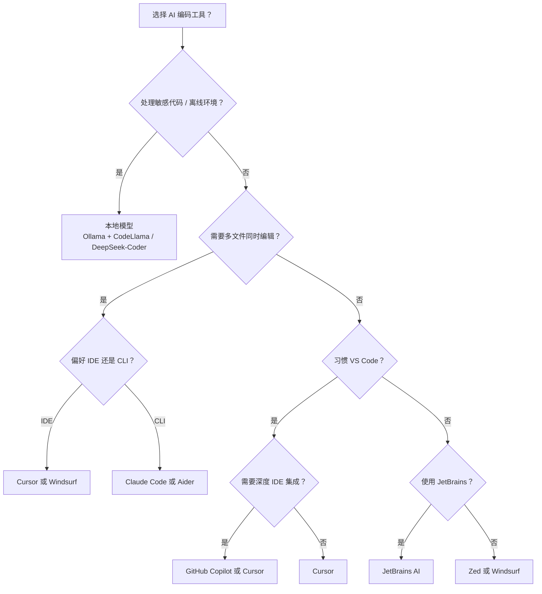
```mermaid
flowchart TD
    A[选择 AI 编码工具？] --> B{处理敏感代码 / 离线环境？}
    B -->|是| C[本地模型<br/>Ollama + CodeLlama / DeepSeek-Coder]
    B -->|否| D{需要多文件同时编辑？}
    D -->|是| E{偏好 IDE 还是 CLI？}
    D -->|否| F{习惯 VS Code？}
    E -->|IDE| G[Cursor 或 Windsurf]
    E -->|CLI| H[Claude Code 或 Aider]
    F -->|是| I{需要深度 IDE 集成？}
    F -->|否| J{使用 JetBrains？}
    I -->|是| K[GitHub Copilot 或 Cursor]
    I -->|否| L[Cursor]
    J -->|是| M[JetBrains AI]
    J -->|否| N[Zed 或 Windsurf]
```

### ASCII 文本树

```
选择 AI 编码工具？
├── 处理敏感代码 / 离线环境？
│   └── 是 → 本地模型（Ollama + CodeLlama / DeepSeek-Coder）
│             📌 完全离线，数据不出境，零订阅费用
│             📌 硬件要求：推荐 24GB+ VRAM
│             📌 适合：金融、政务、医疗、核心算法
└── 否 → 需要多文件同时编辑？
    ├── 是 → 偏好 IDE 还是 CLI？
    │   ├── IDE → Cursor 或 Windsurf
    │   │         📌 Cursor：Composer 多文件编辑最强，上下文感知深
    │   │         📌 Windsurf：Cascade 流式生成，实时预览，AI 代理模式
    │   └── CLI → Claude Code 或 Aider
    │             📌 Claude Code：200K tokens 长上下文，擅长批量修改和架构分析
    │             📌 Aider：开源免费，Git 集成优秀，多文件编辑成熟
    └── 否 → 习惯 VS Code？
        ├── 是 → 需要深度 IDE 集成？
        │   ├── 是 → GitHub Copilot（$10/月）或 Cursor（$20/月）
        │   │         📌 Copilot：生态最成熟，学习成本低，企业采购友好
        │   │         📌 Cursor：AI 原生体验，多文件重构更强
        │   └── 否 → Cursor（独立 IDE，AI 体验最佳）
        └── 否 → 使用 JetBrains？
            ├── 是 → JetBrains AI（$10/月，IntelliJ 深度集成）
            └── 否 → Zed（高性能，Rust 编写）或 Windsurf（$15/月）
```

### 快速推荐

| 场景 | 推荐 | 理由 |
|------|------|------|
| 全栈多文件重构 | **Cursor** | Composer 编辑最强，上下文感知 |
| 命令行批量修改 | **Claude Code** | 长上下文，架构分析，CI/CD 集成 |
| 日常编码补全 | **GitHub Copilot** | IDE 集成最成熟，社区最大 |
| 前端 UI 实时预览 | **Windsurf** | Cascade 流式生成，实时预览 |
| 敏感代码 / 离线 | **Ollama + Continue** | 完全本地，数据自主 |
| 开源偏好 / 模型自由 | **Continue.dev + 任意模型** | 开源插件，模型可配置 |
| 企业团队统一采购 | **GitHub Copilot Business** | $19/月，管理后台，合规认证 |

### 代码示例：Ollama 本地模型 API 调用

```typescript
// 调用本地 Ollama 模型生成代码
async function generateWithOllama(prompt: string): Promise<string> {
  const res = await fetch('http://localhost:11434/api/generate', {
    method: 'POST',
    headers: { 'Content-Type': 'application/json' },
    body: JSON.stringify({
      model: 'deepseek-coder:6.7b',
      prompt,
      stream: false,
      options: { temperature: 0.2, num_ctx: 8192 },
    }),
  });
  const data = await res.json();
  return data.response;
}

// 使用示例
const code = await generateWithOllama(
  'Write a TypeScript function that validates an email address using regex.'
);
console.log(code);
```

> 📚 参考：[Cursor Documentation](https://docs.cursor.com/) | [Claude Code Docs](https://docs.anthropic.com/en/docs/agents-and-tools/claude-code/overview) | [Ollama GitHub](https://github.com/ollama/ollama) | [Continue.dev Docs](https://docs.continue.dev/) | [Aider Documentation](https://aider.chat/docs/)

---

## 17. Type Stripping 策略决策树

### Mermaid 流程图

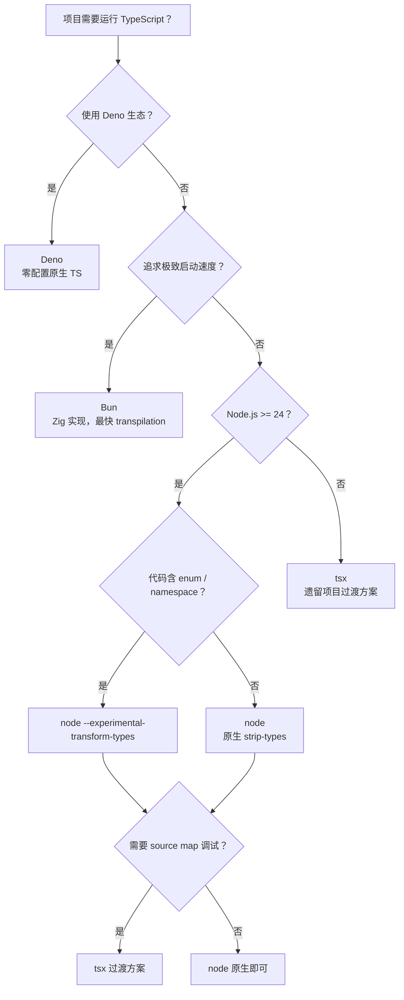
```mermaid
flowchart TD
    A[项目需要运行 TypeScript？] --> B{使用 Deno 生态？}
    B -->|是| C[Deno<br/>零配置原生 TS]
    B -->|否| D{追求极致启动速度？}
    D -->|是| E[Bun<br/>Zig 实现，最快 transpilation]
    D -->|否| F{Node.js >= 24？}
    F -->|是| G{代码含 enum / namespace？}
    F -->|否| H[tsx<br/>遗留项目过渡方案]
    G -->|是| I[node --experimental-transform-types]
    G -->|否| J[node<br/>原生 strip-types]
    I --> K{需要 source map 调试？}
    J --> K
    K -->|是| L[tsx 过渡方案]
    K -->|否| M[node 原生即可]
```

### ASCII 文本树

```
项目需要运行 TypeScript？
├── 使用 Deno 生态？
│   └── 是 → Deno（deno run，零配置）
│             📌 内置 fmt / lint / test，URL 导入原生支持
│             📌 可选运行时类型检查（--no-check 跳过）
├── 追求极致启动速度？
│   └── 是 → Bun（bun run，12ms 冷启动）
│             📌 Zig 实现，enum/namespace/JSX 开箱即用
│             📌 内置 bundler / test runner / 包管理器 / SQLite
│             📌 适合：工具/CLI、Bun 生态全栈
└── Node.js 生态？
    ├── Node.js >= 24？
    │   ├── 代码含 enum / namespace？
    │   │   ├── 是 → node --experimental-transform-types
    │   │   │         📌 轻量 transpilation，支持 enum/namespace/装饰器
    │   │   │         📌 性能仍远优于完整 tsc
    │   │   └── 否 → node（原生 strip-types）
    │   │             📌 直接运行 .ts，零外部依赖
    │   │             📌 注意：必须显式写 .ts 扩展名
    │   └── 需要 source map 调试？
    │       ├── 是 → tsx（过渡方案，esbuild 包装）
    │       │         📌 遗留项目、复杂 tsconfig paths、Monorepo 开发
    │       └── 否 → node 原生即可（2026 推荐）
    └── Node.js < 24（遗留项目）？
        └── 是 → tsx
                  📌 esbuild 包装，速度极快
                  📌 2026 年 1 月宣布进入维护模式，运行时原生替代趋势
```

### 快速推荐

| 场景 | 推荐 | 理由 |
|------|------|------|
| 现代 Node.js API 新项目 | **Node.js 24+ strip-types** | 零依赖，原生支持，ESM 最佳 |
| Deno 全栈 | **Deno 2.7** | 零配置，内置工具链完整 |
| 极速工具/CLI | **Bun 1.3** | 冷启动最快，内置功能最多 |
| 遗留 Node.js 18/20 | **tsx** | 兼容性好，无需升级运行时 |
| 生产构建 (bundling) | **tsc / esbuild / rolldown / bun build** | 根据生态选择 |
| CI 类型检查 | **tsc --noEmit 或 tsgo** | 完整类型检查，不输出产物 |

### 代码示例：Node.js 24+ 原生 TypeScript 运行

```json
// package.json
{
  "name": "native-ts-app",
  "type": "module",
  "scripts": {
    "dev": "node --watch src/server.ts",
    "start": "node src/server.ts",
    "typecheck": "tsc --noEmit"
  },
  "engines": {
    "node": ">=24.0.0"
  }
}
```

```typescript
// src/server.ts — 原生运行，无需 tsx / ts-node
import { createServer } from 'node:http';

interface User {
  id: number;
  name: string;
}

const users: User[] = [
  { id: 1, name: 'Alice' },
  { id: 2, name: 'Bob' },
];

const server = createServer((req, res) => {
  if (req.url === '/users') {
    res.writeHead(200, { 'Content-Type': 'application/json' });
    res.end(JSON.stringify(users));
    return;
  }
  res.writeHead(404);
  res.end('Not Found');
});

server.listen(3000, () => console.log('Server running at http://localhost:3000'));
```

> 📚 参考：[Node.js Type Stripping Docs](https://nodejs.org/api/typescript.html) | [Node.js --experimental-transform-types](https://nodejs.org/api/cli.html#--experimental-transform-types) | [Bun TypeScript Docs](https://bun.sh/docs/typescript) | [Deno TypeScript Support](https://docs.deno.com/runtime/fundamentals/typescript/) | [tsx Documentation](https://github.com/privatenumber/tsx)

---

## 18. Edge 数据库选型决策树

### Mermaid 流程图

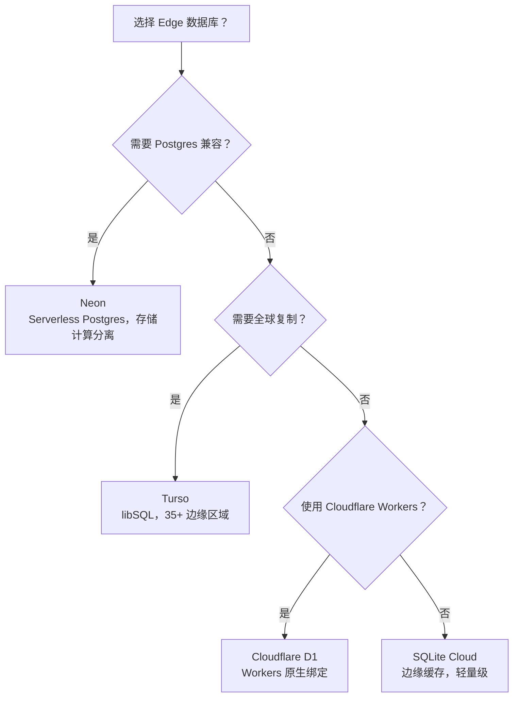
```mermaid
flowchart TD
    A[选择 Edge 数据库？] --> B{需要 Postgres 兼容？}
    B -->|是| C[Neon<br/>Serverless Postgres，存储计算分离]
    B -->|否| D{需要全球复制？}
    D -->|是| E[Turso<br/>libSQL，35+ 边缘区域]
    D -->|否| F{使用 Cloudflare Workers？}
    F -->|是| G[Cloudflare D1<br/>Workers 原生绑定]
    F -->|否| H[SQLite Cloud<br/>边缘缓存，轻量级]
```

### ASCII 文本树

```
选择 Edge 数据库？
├── 需要 Postgres 兼容？
│   └── 是 → Neon
│             📌 存储计算分离，Page Server 共享存储
│             📌 数据库分支（Git-like 工作流），被 Databricks 收购
│             📌 永久 Free Tier，适合：完整 PG 功能的全栈应用
│             📌 冷启动：~50-150ms（HTTP driver）
└── 否 → 需要全球复制？
    ├── 是 → Turso
    │         📌 libSQL (SQLite fork)，35+ 边缘区域
    │         📌 单一写入端点 + 多区域读取副本
    │         📌 500 个免费数据库，适合：多租户 SaaS、全球读多写少
    │         📌 冷启动：~10-30ms（HTTP 边缘副本）
    └── 否 → 使用 Cloudflare Workers？
        ├── 是 → Cloudflare D1
        │         📌 Workers 原生绑定（env.DB），零网络开销
        │         📌 2026 GA，免费 5GB，300+ 城市自动复制
        │         📌 冷启动：~1-5ms（本地绑定）
        └── 否 → SQLite Cloud
                  📌 边缘节点托管 SQLite，REST API + WebSocket 订阅
                  📌 适合：轻量级实时应用、IoT、边缘缓存层
```

### 快速推荐

| 场景 | 推荐 | 理由 |
|------|------|------|
| Cloudflare Workers 全栈 | **D1 + Drizzle ORM** | 原生绑定，零配置，延迟最低 |
| 多租户 SaaS（全球用户） | **Turso + Drizzle ORM** | 500 免费 DB，每租户独立库 |
| 需要完整 PG 的 Serverless | **Neon + Drizzle/Prisma 7** | 分支工作流，生态增强 |
| 实时应用 + Auth + 存储 | **Supabase** | 全栈平台，RLS 安全 |
| 极端轻量 / 低带宽 | **Drizzle + D1/Turso** | 最小 bundle，最快冷启动 |
| 已有 MySQL 生态迁移 | **PlanetScale** | Vitess 分片，分支工作流 |

### 代码示例：Drizzle ORM + Cloudflare D1

```typescript
// schema.ts
import { sqliteTable, text, integer } from 'drizzle-orm/sqlite-core';

export const users = sqliteTable('users', {
  id: integer('id').primaryKey(),
  email: text('email').notNull().unique(),
  name: text('name').notNull(),
});

// db.ts — Cloudflare D1 绑定
import { drizzle } from 'drizzle-orm/d1';
import * as schema from './schema';

export function getDb(d1: D1Database) {
  return drizzle(d1, { schema });
}

// worker.ts
import { Hono } from 'hono';
import { getDb } from './db';
import { users } from './schema';
import { eq } from 'drizzle-orm';

const app = new Hono<{ Bindings: { DB: D1Database } }>();

app.get('/users/:id', async (c) => {
  const db = getDb(c.env.DB);
  const user = await db.select().from(users).where(eq(users.id, Number(c.req.param('id')))).get();
  return user ? c.json(user) : c.notFound();
});

export default app;
```

### 代码示例：Neon Serverless Driver + Edge

```typescript
// db.ts — Neon serverless driver（HTTP 连接，无 TCP）
import { neon } from '@neondatabase/serverless';
import { drizzle } from 'drizzle-orm/neon-http';

const sql = neon(process.env.DATABASE_URL!);
export const db = drizzle(sql);

// 使用（可在任何边缘运行时执行）
import { pgTable, serial, varchar } from 'drizzle-orm/pg-core';

const users = pgTable('users', {
  id: serial('id').primaryKey(),
  email: varchar('email', { length: 255 }).notNull().unique(),
});

// 查询
const allUsers = await db.select().from(users);
```

> 📚 参考：[Cloudflare D1 Documentation](https://developers.cloudflare.com/d1/) | [Drizzle ORM D1 Docs](https://orm.drizzle.team/docs/get-started-sqlite#cloudflare-d1) | [Neon Documentation](https://neon.tech/docs/) | [Turso Documentation](https://docs.turso.tech/) | [Neon Serverless Driver](https://github.com/neondatabase/serverless)

---

## 决策速查表

| 技术领域 | 首选推荐 | 备选方案 |
|---------|---------|---------|
| React UI库 | shadcn/ui + Tailwind | Ant Design |
| 状态管理 | Zustand | Jotai / TanStack Query |
| 构建工具 | Vite | Rollup (库) |
| Node.js后端 | NestJS (大型) / Fastify (中小型) | Hono (边缘) |
| ORM | Prisma | Drizzle |
| 测试 | Vitest + Playwright | Jest + Cypress |
| 包管理器 | pnpm | npm / Bun |
| Monorepo工具 | Turborepo + pnpm | Nx / Rush |
| 部署平台 | Vercel (全栈) / Cloudflare (静态) | Render / Fly.io |
| 监控可观测 | Sentry + Datadog | LogRocket / New Relic |
| CI/CD | GitHub Actions | GitLab CI / CircleCI |
| Web API | REST (通用) / GraphQL (灵活) | tRPC / gRPC-Web |
| 认证方案 | **better-auth** (新 TS 项目) / Session (SSR) | OIDC / Passkeys |
| 数据存储 | PostgreSQL | MongoDB / Redis |
| Edge 数据库 | Turso / D1 / Neon | SQLite Cloud / Supabase |
| AI Agent 框架 | Vercel AI SDK | Mastra / LangGraph / CrewAI |
| AI 编码工作流 | Cursor | Claude Code / Copilot / Windsurf |
| Type Stripping | Node.js 24+ 原生 | Bun / Deno / tsx |

---

## 权威参考链接

| 资源 | 链接 | 说明 |
|------|------|------|
| State of JS 2025 | <https://stateofjs.com/en-US> | JavaScript 生态年度调查 |
| State of React 2025 | <https://stateofreact.com/> | React 生态年度调查 |
| npm Trends | <https://npmtrends.com/> | 包下载量对比工具 |
| Bundlephobia | <https://bundlephobia.com/> | 包体积分析 |
| ThoughtWorks Tech Radar | <https://www.thoughtworks.com/radar> | 技术趋势雷达 |
| CNCF Landscape | <https://landscape.cncf.io/> | 云原生技术全景 |
| Stack Overflow Developer Survey | <https://survey.stackoverflow.com/> | 开发者年度调查 |
| GitHub Trending | <https://github.com/trending> | 实时开源趋势 |
| JavaScript Rising Stars | <https://risingstars.js.org/> | 年度增长最快项目 |
| Next.js Docs | <https://nextjs.org/docs> | Next.js 官方文档 |
| Vite Docs | <https://vitejs.dev/guide/> | Vite 官方文档 |
| pnpm Docs | <https://pnpm.io/> | pnpm 官方文档 |
| Turborepo Docs | <https://turbo.build/repo/docs> | Turborepo 官方文档 |
| Prisma Docs | <https://www.prisma.io/docs/> | Prisma ORM 文档 |
| Drizzle Docs | <https://orm.drizzle.team/docs/overview> | Drizzle ORM 文档 |
| Playwright Docs | <https://playwright.dev/docs/intro> | Playwright 测试文档 |
| Zustand Docs | <https://docs.pmnd.rs/zustand/getting-started/introduction> | Zustand 状态管理 |
| TanStack Query Docs | <https://tanstack.com/query/latest> | TanStack Query 文档 |
| Auth.js Docs | <https://authjs.dev/> | Auth.js 认证库 |
| better-auth Docs | <https://www.better-auth.com/docs/> | better-auth 文档 |
| Fastify Docs | <https://www.fastify.io/docs/latest/> | Node.js 高性能框架文档 |
| Vitest Docs | <https://vitest.dev/> | 下一代测试框架 |
| MSW Docs | <https://mswjs.io/> | API Mocking 库 |
| Cloudflare Workers Docs | <https://developers.cloudflare.com/workers/> | 边缘计算平台 |
| WebAuthn Guide | <https://webauthn.guide/> | 无密码认证标准指南 |
| Cloudflare D1 Docs | <https://developers.cloudflare.com/d1/> | 边缘数据库 |
| Neon Docs | <https://neon.tech/docs/> | Serverless Postgres |
| Turso Docs | <https://docs.turso.tech/> | 边缘 SQLite |
| LangGraph Docs | <https://langchain-ai.github.io/langgraph/> | 图编排 Agent 框架 |
| Mastra Docs | <https://mastra.ai/docs> | TypeScript AI 框架 |
| CrewAI Docs | <https://docs.crewai.com/> | 多角色 Agent 团队 |
| Ollama Docs | <https://github.com/ollama/ollama> | 本地大模型运行 |
| Node.js Type Stripping | <https://nodejs.org/api/typescript.html> | Node.js 原生 TS 支持 |
| esbuild Docs | <https://esbuild.github.io/> | 极速打包工具 |
| shadcn/ui Docs | <https://ui.shadcn.com/docs> | 现代 React 组件库 |
| Tailwind CSS Docs | <https://tailwindcss.com/docs> | 实用优先 CSS 框架 |
| Radix UI Primitives | <https://www.radix-ui.com/primitives> | 无头 UI 组件 |
| tRPC Documentation | <https://trpc.io/docs> | 端到端类型安全 API |
| GraphQL Specification | <https://spec.graphql.org/> | GraphQL 规范 |
| Socket.io Docs | <https://socket.io/docs/v4/> | 实时双向通信库 |
| MDN — Server-Sent Events | <https://developer.mozilla.org/en-US/docs/Web/API/Server-sent_events> | SSE 官方文档 |
| Redis Documentation | <https://redis.io/docs/> | Redis 官方文档 |
| pgvector GitHub | <https://github.com/pgvector/pgvector> | Postgres 向量扩展 |
| Neo4j Cypher Manual | <https://neo4j.com/docs/cypher-manual/current/> | 图数据库查询语言 |
| Vercel AI SDK | <https://sdk.vercel.ai/docs> | AI 应用开发 SDK |
| Model Context Protocol | <https://modelcontextprotocol.io/> | AI 工具标准协议 |
| OpenAI Agents SDK | <https://platform.openai.com/docs/guides/agents> | OpenAI Agent 开发 |
| Cursor Documentation | <https://docs.cursor.com/> | AI 原生 IDE |
| Claude Code Docs | <https://docs.anthropic.com/en/docs/agents-and-tools/claude-code/overview> | 命令行 AI 编码 |
| Continue.dev Docs | <https://docs.continue.dev/> | 开源 AI 编码助手 |
| Aider Documentation | <https://aider.chat/docs/> | 命令行多文件 AI 编辑 |

---

> 💡 **提示**：以上推荐基于2024-2026年技术趋势和生态活跃度，实际选型需结合团队技术栈和项目具体需求。
