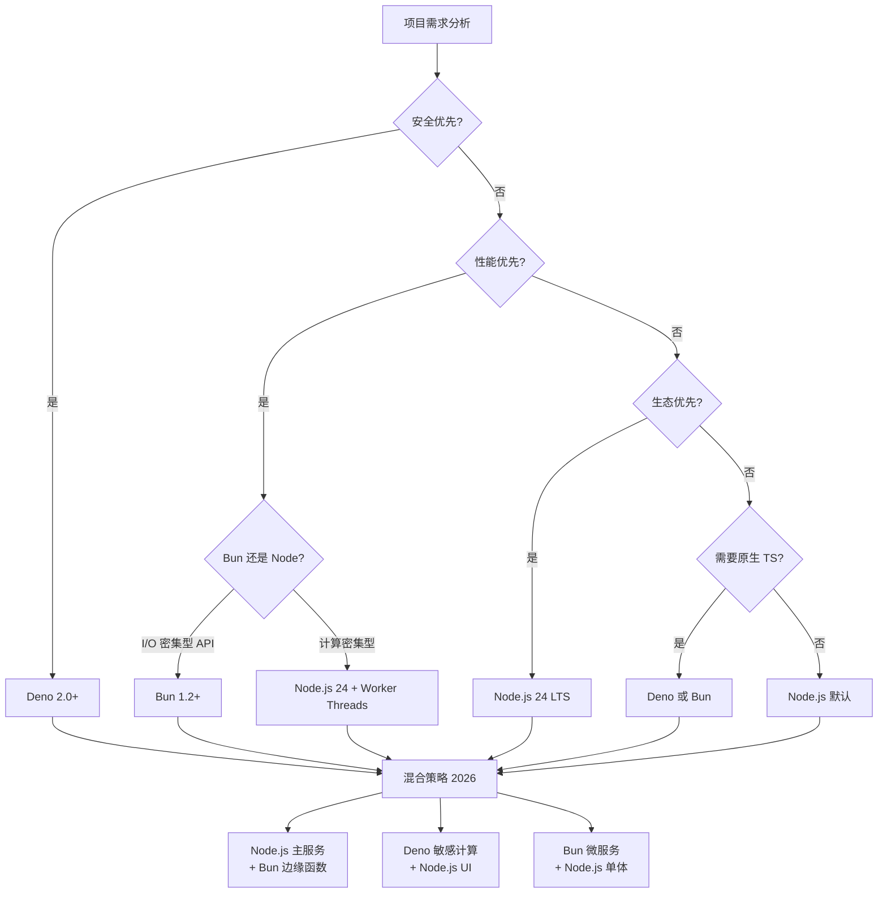

# 决策树：JavaScript 运行时选择

> **定位**：`30-knowledge-base/30.4-decision-trees/`
> **对齐版本**：Node.js 24 LTS | Bun 1.2 Stable | Deno 2.x | Deno 3.0 RC
> **权威来源**：CodeWithSeb 2026-04、TechBytes 2026-04、MortexSolutions 2026-04、RepoFlow 2026-02
> **最后更新**：2026-04

---

## 运行时现状（2026 Q2）

| 特性 | Node.js 24 LTS | Bun 1.2+ | Deno 2.x | Deno 3.0 RC |
|------|---------------|----------|----------|-------------|
| **引擎** | V8 + libuv | JavaScriptCore + Zig I/O | V8 + Rust Tokio | V8 + Rust Tokio |
| **原生 TypeScript** | `--experimental-strip-types` (稳定) | ✅ 零配置 | ✅ 零配置 | ✅ + KV 存储内置 |
| **npm 兼容** | 100% | ~99.7% | ~95% | ~97% |
| **HTTP Hello World** | ~78K req/s | **~185K req/s** | ~142K req/s | ~160K req/s |
| **JSON API (含验证)** | ~67K req/s | **~124K req/s** | ~98K req/s | ~105K req/s |
| **冷启动 (HTTP server)** | ~148ms | **~38ms** | ~52ms | ~45ms |
| **内存占用 (基础 HTTP)** | ~55MB | ~30MB | ~35MB | ~32MB |
| **包安装速度** | npm 基线 | **10-20x 快于 npm** | deno install 15% 快 (冷) / 90% 快 (热) | 同左 |
| **安全模型** | `--permission` 细粒度 (v22.13+) | 无内置沙箱 | Deny-by-default 权限沙箱 | 同左 |
| **调试支持** | Chrome DevTools 成熟 | `bun --inspect` 基础 | Chrome DevTools | 同左 |
| **APM (Datadog/Sentry)** | 完整 | 实验性 | 有限 | 改善中 |
| **Windows 支持** | 完整 | 改善中，仍有 edge case | 完整 | 完整 |

*来源：CodeWithSeb M3 MacBook Pro 实测（2026-04）；MortexSolutions 综合基准（2026-04）；RepoFlow 微基准（2026-02，M4）。*

> **关键洞察**：Bun 在原始 I/O 吞吐量上领先 2-4x，但真实应用瓶颈通常在数据库/网络。Bun 最大的日常优势是 `bun install` 的 10-20x 速度——CI/CD 管道可从 8 分钟缩短到 3 分钟。

---

## 决策树



---

## 决策因素矩阵

| 场景 | 首选 | 次选 | 避免 | 关键理由 |
|------|------|------|------|---------|
| **企业存量系统** | Node.js 24 | — | Bun/Deno | npm 生态 100% 兼容，运维知识沉淀最深 |
| **高吞吐 API (50K+ req/s)** | Bun | Node.js | — | Zig I/O + JSC 引擎，2-4x 原始性能优势 |
| **Serverless/FaaS (冷启动敏感)** | Bun | Deno | Node.js | 冷启动 38ms vs 148ms，内存 30MB vs 55MB |
| **金融/高安全/不可信代码** | Deno | — | Bun | Deny-by-default 沙箱，权限最小化原则 |
| **AI Agent 服务** | Bun | Node.js | — | 原生 TS + 内置 SQLite/S3 + 极速安装 |
| **边缘函数 (Cloudflare/Deno Deploy)** | Deno | Bun | Node.js | Deno Deploy 原生，WinterCG 合规 |
| **快速原型/内部工具** | Bun | Deno | — | 零配置 TS，单二进制替代 npm+webpack+jest |
| **团队熟悉度低/招聘** | Node.js | — | Bun/Deno | 最大人才池，文档最丰富 |
| **Windows 开发团队** | Node.js | Deno | Bun | Bun Windows 仍有 edge case |
| **APM/可观测性关键** | Node.js | — | Bun | Datadog/New Relic/Sentry 成熟支持 |

---

## 运行时安全模型对比

2025 年 npm 供应链攻击（chalk、debug 包被劫持，Shai-Hulud 蠕虫自主传播）使运行时安全成为选型核心因素：

| 运行时 | 安全模型 | 默认姿态 | 生产建议 |
|--------|---------|---------|---------|
| **Deno** | Deny-by-default 沙箱 | 所有访问默认阻断 | 最适合运行不可信代码；`--allow-read=/data --allow-net=api.example.com` |
| **Node.js** | Opt-in 权限模型 (v22.13+) | 完全开放，除非 `--permission` | `node --permission --allow-fs-read=/data --allow-net=api.example.com`；CVE-2024-36137 绕过已知，作为 defense-in-depth |
| **Bun** | Full-trust | 无运行时限制 | 依赖外部工具（依赖扫描、CI/CD 策略）；适合可信内部工具 |

> *"npm lifecycle scripts execute with full user privileges during `npm install`, providing access to SSH keys, cloud credentials, and more."* — Splunk 分析，2025

---

## 混合架构模式（2026 推荐）

```
┌─────────────────────────────────────────┐
│           混合运行时架构                  │
├─────────────────────────────────────────┤
│                                         │
│  ┌─────────────┐    ┌─────────────┐     │
│  │   Node.js   │    │    Bun      │     │
│  │   主服务     │◀───│   边缘函数   │     │
│  │  业务逻辑    │    │  API聚合    │     │
│  │  认证/支付   │    │  高吞吐API   │     │
│  └──────┬──────┘    └─────────────┘     │
│         │                               │
│  ┌──────┴──────┐                        │
│  │    Deno     │                        │
│  │   敏感计算   │                        │
│  │  认证/加密   │                        │
│  │  不可信插件  │                        │
│  └─────────────┘                        │
│                                         │
│  统一接口: OpenAPI / gRPC / tRPC        │
│  统一观测: OpenTelemetry                │
│  统一部署: Docker / Kubernetes          │
│                                         │
└─────────────────────────────────────────┘
```

---

## 代码示例

### Node.js 24 — 权限模型与原生 TS

```bash
# 原生 TypeScript 执行（无需 ts-node）
node --experimental-strip-types server.ts

# 生产环境启用权限沙箱
node --permission \
  --allow-fs-read=/app/data \
  --allow-fs-write=/app/logs \
  --allow-net=localhost:3000,api.example.com \
  --allow-child-process \
  dist/server.js
```

```typescript
// server.ts — Node.js 24 原生 HTTP 服务
import { createServer } from 'node:http'

const server = createServer((req, res) => {
  res.writeHead(200, { 'Content-Type': 'application/json' })
  res.end(JSON.stringify({ runtime: 'Node.js 24', ts: true }))
})

server.listen(3000, () => console.log('Server running on http://localhost:3000'))
```

### Bun — 极速 I/O 与内置测试

```typescript
// http.ts — Bun 原生 HTTP 服务
Bun.serve({
  port: 3000,
  fetch(req) {
    const url = new URL(req.url)
    if (url.pathname === '/api/health') {
      return Response.json({ status: 'ok', runtime: 'Bun' })
    }
    return new Response('Not Found', { status: 404 })
  },
})

// 内置 SQLite（无需安装依赖）
import { Database } from 'bun:sqlite'

const db = new Database('app.db')
db.run('CREATE TABLE IF NOT EXISTS users (id INTEGER PRIMARY KEY, name TEXT)')
const insert = db.query('INSERT INTO users (name) VALUES (?)')
insert.run('Alice')
```

```typescript
// sum.test.ts — Bun 内置测试（无需 jest/vitest）
import { describe, it, expect } from 'bun:test'

describe('math', () => {
  it('should add correctly', () => {
    expect(1 + 1).toBe(2)
  })
})

// 运行: bun test
```

### Deno — 安全沙箱与边缘部署

```typescript
// main.ts — Deno 原生 HTTP 服务
import { serve } from 'https://deno.land/std@0.220.0/http/server.ts'

serve((req) => {
  return Response.json({
    runtime: 'Deno',
    version: Deno.version.deno,
    permissions: Deno.permissions.query({ name: 'read' }),
  })
}, { port: 8000 })
```

```bash
# Deno 显式权限运行（默认拒绝一切）
deno run --allow-net=localhost:8000 --allow-read=/data --allow-write=/logs main.ts

# Deno Deploy 部署（零配置边缘函数）
deno deploy --project=my-app --include=main.ts
```

### Dockerfile 多运行时对比

```dockerfile
# Node.js 24 LTS
FROM node:24-alpine
WORKDIR /app
COPY package*.json ./
RUN npm ci --only=production
COPY . .
EXPOSE 3000
CMD ["node", "--permission", "--allow-fs-read=/app", "--allow-net=0.0.0.0:3000", "dist/server.js"]

# Bun 1.2
FROM oven/bun:1.2-alpine
WORKDIR /app
COPY package.json bun.lockb ./
RUN bun install --production
COPY . .
EXPOSE 3000
CMD ["bun", "run", "server.ts"]

# Deno 2.x
FROM denoland/deno:2.0
WORKDIR /app
COPY deno.json main.ts ./
RUN deno cache main.ts
EXPOSE 8000
CMD ["deno", "run", "--allow-net", "main.ts"]
```

### 混合架构 tRPC 网关示例

```typescript
// gateway.ts — Node.js 主网关，转发至 Bun 微服务
import { createTRPCProxyClient, httpBatchLink } from '@trpc/client'
import type { BunServiceRouter } from './bun-service'

const bunClient = createTRPCProxyClient<BunServiceRouter>({
  links: [httpBatchLink({ url: 'http://bun-service:3001/trpc' })],
})

// Node.js Express 路由中调用 Bun 服务
app.get('/api/analytics', async (req, res) => {
  const report = await bunClient.analytics.generateReport.query({
    startDate: req.query.from as string,
    endDate: req.query.to as string,
  })
  res.json(report)
})
```

---

## 选型检查清单

```
□ 数据库 I/O 是否为瓶颈？是 → 运行时差异可能被掩盖
□ 是否需要 APM/Sentry/Datadog？是 → Node.js 最安全
□ 是否有 Windows 开发者？是 → 优先 Node.js / Deno
□ 是否部署到 Serverless/Edge？是 → Bun / Deno
□ 是否运行不可信代码/插件？是 → Deno 必选
□ CI 安装时间是否影响开发效率？是 → Bun 可节省 5-10 分钟/次
□ 团队是否有 Bun/Deno 运维经验？否 → Node.js 降低风险
□ 是否需要原生 SQLite/S3 客户端？是 → Bun 内置支持
```

---

## 参考来源

1. **CodeWithSeb** — [Node.js vs Bun vs Deno 2026](https://codewithseb.com/blog/nodejs-vs-bun-vs-deno-2026-runtime-comparison) (2026-04-22)
2. **TechBytes** — [Deno 2.0 vs Bun 1.2 vs Node.js Deep Dive](https://techbytes.app/posts/deno-2-0-vs-bun-1-2-full-benchmark-analysis-node-js/) (2026-04-05)
3. **MortexSolutions** — [Bun vs Node.js vs Deno Runtime Comparison 2026](https://www.mortexsolutions.com/blog/bun-vs-nodejs-vs-deno-runtime-comparison-2026) (2026-04-03)
4. **Pavan Rangani** — [Bun 1.2 vs Node.js 22: Production Benchmark](https://blogs.pavanrangani.com/bun-vs-nodejs-runtime-comparison-2026/) (2026-04-07)
5. **Strapi** — [Bun vs Node.js: Security & Performance](https://strapi.io/blog/bun-vs-nodejs-performance-comparison-guide) (2026-04-19)
6. **RepoFlow** — [Node.js vs Deno vs Bun Microbenchmarks](https://www.repoflow.io/blog/node-js-vs-deno-vs-bun-performance-benchmarks) (2026-02-17)
7. **Sachin's DevLog** — [Bun vs Node vs Deno Production Benchmark](https://sachinsharma.dev/blogs/bun-vs-node-vs-deno-benchmark) (2026-03-05)

---

## 权威外部链接

- [Node.js Documentation](https://nodejs.org/docs/latest/api/) — Node.js 官方 API 文档
- [Bun Documentation](https://bun.sh/docs) — Bun 官方文档与 API 参考
- [Deno Documentation](https://docs.deno.com/) — Deno 官方文档
- [Deno Deploy](https://deno.com/deploy) — Deno 边缘计算平台
- [WinterCG](https://wintercg.org/) — Web 标准化运行时协作组
- [OpenTelemetry JS](https://opentelemetry.io/docs/languages/js/) — 跨运行时统一可观测性
- [Node.js Security Best Practices](https://nodejs.org/en/docs/guides/security/) — Node.js 官方安全指南
- [OWASP NodeGoat](https://github.com/OWASP/NodeGoat) — Node.js 安全漏洞学习项目
- [Splunk — npm Supply Chain Security Report 2025](https://www.splunk.com/en_us/blog/security.html) — 供应链安全分析
- [Docker Hub — Node.js Official Images](https://hub.docker.com/_/node) — 官方容器镜像
