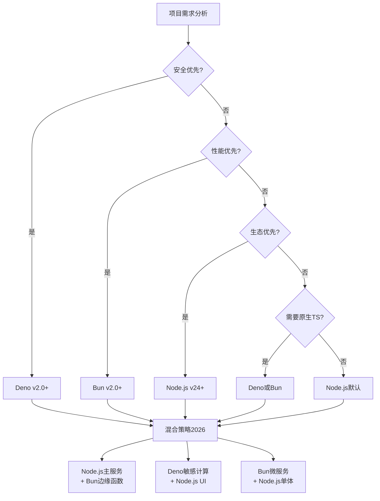

# 决策树：JavaScript 运行时选择

> **定位**：`30-knowledge-base/30.4-decision-trees/`
> **关联**：`10-fundamentals/10.1-language-semantics/theorems/runtime-convergence-theorem.md`

---

## 决策树



---

## 决策因素矩阵

| 场景 | 首选 | 次选 | 避免 | 关键理由 |
|------|------|------|------|---------|
| **企业存量系统** | Node.js | — | Bun/Deno | npm 生态兼容性 |
| **Serverless/FaaS** | Bun | Deno | Node.js | 冷启动速度 |
| **金融/高安全** | Deno | — | Node.js/Bun | 权限沙盒 |
| **AI Agent服务** | Bun | Node.js | — | 原生TS + 性能 |
| **边缘函数** | Deno/Bun | Node.js | — | 启动延迟 |
| **快速原型** | Bun | Deno | — | 零配置 |
| **团队熟悉度低** | Node.js | — | Bun/Deno | 招聘/文档生态 |

---

## 混合架构模式（2026 推荐）

```
┌─────────────────────────────────────────┐
│           混合运行时架构                  │
├─────────────────────────────────────────┤
│                                         │
│  ┌─────────────┐    ┌─────────────┐     │
│  │   Node.js   │    │    Bun      │     │
│  │   主服务     │◀───│   边缘函数   │     │
│  │  业务逻辑    │    │  API聚合    │     │
│  └──────┬──────┘    └─────────────┘     │
│         │                               │
│  ┌──────┴──────┐                        │
│  │    Deno     │                        │
│  │   敏感计算   │                        │
│  │  认证/加密   │                        │
│  └─────────────┘                        │
│                                         │
│  统一接口: OpenAPI / gRPC               │
│  统一观测: OpenTelemetry                │
│                                         │
└─────────────────────────────────────────┘
```

---

*本决策树基于运行时收敛定理，反映 2026 年的最佳实践。*
